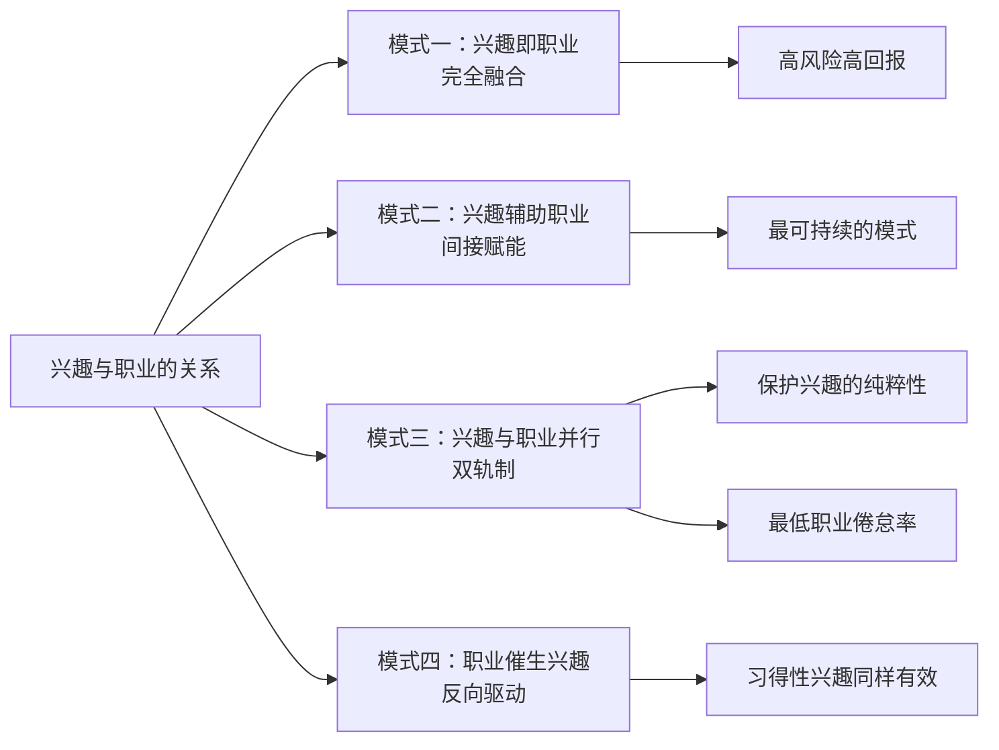

## 四、兴趣与职业的关系

兴趣与职业之间的关系，远比"做自己喜欢的事"这个浪漫叙事复杂得多。它涉及心理学中的动机理论、经济学中的人力资本模型、社会学中的职业流动研究，以及无数个体在真实世界中的成败经验。理解这种关系的本质，能帮助你在职业规划中做出更理性的决策——既不盲目追逐热情，也不彻底压抑兴趣。

### 4.1 兴趣与职业关系的四种模式

兴趣和职业并非只有"完全合一"和"完全分离"两种状态。现实中存在四种典型模式：

**模式一：兴趣即职业（完全融合）**

兴趣与职业高度重合。典型代表：职业音乐家、游戏主播、旅行作家、美食博主。这种模式的吸引力最大，但门槛也最高——你需要在兴趣领域达到前5%的水平，才能获得足够的市场回报。

**模式二：兴趣辅助职业（间接赋能）**

兴趣与职业不在同一领域，但兴趣培养的能力对职业有显著帮助。例如：业余辩论爱好者在商务谈判中表现出色；摄影爱好者的视觉审美帮助UI设计师产出更优秀的作品；户外运动爱好者的抗压能力帮助投行分析师扛住高压工作节奏。这是最常见且最可持续的模式。

**模式三：兴趣与职业并行（双轨制）**

工作是工作，爱好是爱好，两者界限分明。白天做会计，晚上写小说；工作日当程序员，周末做木工。这种模式的优势在于：兴趣不会被职业压力污染，始终保持纯粹的愉悦感。心理学研究证实，拥有一项与工作无关的"深度休闲活动"（Serious Leisure）的人，职业倦怠率更低。

**模式四：职业催生兴趣（反向驱动）**

在工作中接触到某个领域，逐渐产生了真正的兴趣。很多程序员最初只是因为就业前景好而入行，后来在解决复杂技术问题的过程中获得了深层的智力愉悦，形成了真正的热情。这种模式被心理学家称为"习得性兴趣"（Acquired Interest），研究表明它在长期职业满意度上并不逊色于"天生的热情"。

### 4.2 兴趣转化为职业：机遇与陷阱

#### 4.2.1 转化的可行性评估框架

将兴趣转化为职业不是拍脑袋的决定，而需要系统评估。以下框架基于职业规划领域的"三环模型"（借鉴吉姆·柯林斯的刺猬理念），从三个维度进行判断：

**维度一：热情深度——你有多喜欢这件事？**

| 层级 | 表现 | 适合转化吗 |
|------|------|-----------|
| 浅层喜欢 | 偶尔做做，心情好时才想做 | 不适合 |
| 中度投入 | 固定时间做，会主动学习相关知识 | 可以尝试副业 |
| 深度沉浸 | 废寝忘食，愿意忍受枯燥的基础训练 | 有转化潜力 |
| 心流状态 | 做的时候忘记时间，完成后有深层满足感 | 强烈建议尝试 |

**维度二：能力水平——你在这个领域处于什么位置？**

兴趣转化为职业需要达到"市场可接受的最低专业水平"。以摄影为例：爱好者拍朋友圈→婚礼摄影师→商业广告摄影师→艺术画廊签约摄影师。只有达到第二层级（婚礼摄影师）以上，才能获得稳定收入。自我评估的方法：找到该领域的从业者，对比你的作品/产出，诚实判断差距。

**维度三：市场需求——有人愿意为你的产出付费吗？**

这是最容易被忽略的维度。很多人在前两个维度得分很高，但忽略了市场验证。验证方法包括：在平台上发布作品看反馈、接小单测试市场反应、调研目标客户群的付费意愿、分析同领域从业者的收入水平。

#### 4.2.2 过度理由效应：当爱好变成工作

心理学中有一个重要概念——过度理由效应（Overjustification Effect）。1973年，心理学家Lepper、Greene和Nisbett的经典实验发现：原本因为"好玩"而画画的孩子，在获得外部奖励（奖状）后，当奖励消失，他们画画的时间和兴趣都大幅下降。

这个效应对兴趣职业化有深刻启示：

- **内在动机被外在动机替代**：当你开始为钱画画，"画什么能卖钱"会逐渐取代"画什么让我兴奋"。
- **自主性丧失**：职业化意味着要满足客户需求，而非纯粹遵循自己的创作冲动。
- **评价焦虑**：当兴趣变成工作，每一笔产出都面临市场评价，压力会侵蚀乐趣。

**应对策略：**

1. **保留"纯粹空间"**：即使摄影成为职业，仍然保留一部分时间拍自己想拍的东西，不为任何人，不为任何报酬。
2. **区分"创作"和"生产"**：将职业产出视为"生产"（有标准、有deadline），将纯粹的兴趣时间视为"创作"（自由、无压力）。两种模式在时间和空间上刻意分离。
3. **建立内在评价标准**：除了市场反馈，建立自己的作品评价体系。"这张照片让我自己满意"与"这张照片客户满意"是两个独立的判断。
4. **控制职业化比例**：不一定要100%将兴趣转化为职业。保持70%职业+30%纯兴趣的比例，很多人找到了可持续的平衡点。

#### 4.2.3 转化的实操路径

如果你决定尝试将兴趣职业化，以下是一条经过验证的渐进式路径：

**第一阶段：验证期（1-3个月）**

在不辞职的前提下，利用业余时间开始小规模尝试。目标不是赚钱，而是验证三个问题：你是否愿意在疲惫的工作日后仍然投入时间？你的产出是否能获得陌生人的正面反馈（而非亲友的客套）？你能否接受重复性的工作内容？

**第二阶段：副业期（3-12个月）**

开始正式接单或发布作品，建立初始客户群和作品集。重点关注：积累10-20个高质量案例、建立基本的定价和交付流程、了解行业的真实收入水平和工作强度。

**第三阶段：跃迁期（决策点）**

当副业收入达到主业收入的50%-70%时，可以考虑全职转型。但要满足以下前提条件：拥有至少6个月的生活费储备、已经建立了稳定的客户来源渠道、对行业淡旺季有充分了解、配偶/家人支持。

**第四阶段：专业期（持续迭代）**

全职后，重点从"能不能做"转向"如何做得更好、赚得更多"。需要补足的能力包括：商业运营（财务、营销、客户管理）、个人品牌建设、持续学习和技能迭代。

#### 4.2.4 不同兴趣类型的职业化潜力对比

| 兴趣类型 | 典型职业路径 | 转化难度 | 收入天花板 | 关键挑战 |
|---------|------------|---------|-----------|---------|
| 视觉艺术（摄影/绘画/设计） | 自由摄影师、插画师、UI设计师 | 中 | 高（顶级可达百万年薪） | 审美差异化、建立风格辨识度 |
| 文字创作（写作/博客） | 自由撰稿人、自媒体人、编剧 | 中 | 中高 | 持续产出压力、流量变现 |
| 编程/技术 | 独立开发者、技术顾问、SaaS创业者 | 低-中 | 极高 | 从技术思维转向产品思维 |
| 音乐/表演 | 音乐人、主播、培训师 | 高 | 两极分化严重 | 头部效应极强，长尾生存困难 |
| 运动/健身 | 健身教练、体育培训、运动博主 | 低-中 | 中 | 体力限制、年龄窗口 |
| 烹饪/美食 | 私厨、美食博主、烘焙创业 | 低-中 | 中高 | 食品安全法规、供应链管理 |
| 手工/木工 | 独立工匠、手作品牌、工作坊 | 中 | 中 | 产能瓶颈、规模化困难 |
| 游戏 | 游戏主播、电竞选手、游戏测试 | 极高 | 极高或极低 | 竞争极其残酷，职业生涯短 |

### 4.3 兴趣对职业发展的辅助作用

即使不将兴趣直接转化为职业，兴趣爱好也能在多个层面为职业发展提供助力。这不是"心灵鸡汤式的鼓励"，而是有实证研究支撑的结论。

#### 4.3.1 软技能的隐性培养

职场中真正区分优秀和平庸的，往往不是硬技能，而是软技能——沟通、协作、领导力、抗压能力、创造性思维。而兴趣爱好恰恰是培养这些能力的最佳"训练场"：

**团队运动（篮球、足球、排球）→ 协作与领导力**

在团队运动中，你需要学会：在高压下快速决策、理解队友的优势和短板并合理分配角色、接受失败并迅速调整策略。这些能力直接映射到项目管理和团队协作场景。哈佛商学院的研究发现，大学期间参加过团队运动的毕业生，在职业生涯前10年的晋升速度比平均水平快20%。

**演讲/辩论俱乐部 → 沟通与说服力**

Toastmasters（国际演讲会）的会员在职场晋升中的表现显著优于同龄人。原因在于：结构化表达能力（金字塔原理在演讲中被反复训练）、即兴反应能力（即兴演讲环节）、同理心和听众意识（好的演讲者永远在想"听众需要什么"）。

**写作/博客 → 逻辑思维与知识管理**

写作的本质是"将模糊的思维结构化"。长期写作的人，在工作中表现出更强的分析能力和方案撰写能力。更深层的价值在于：写作迫使你将隐性知识转化为显性知识，这个过程本身就是深度学习。

**音乐/乐器 → 纪律性与模式识别**

学习乐器需要长期坚持重复练习，培养的是延迟满足能力和精细的自我管理能力。神经科学研究发现，音乐训练能增强大脑的模式识别能力，这对数据分析、编程等需要发现规律的工作有直接帮助。

#### 4.3.2 弱关系网络：兴趣圈子里的隐藏机遇

社会学家马克·格兰诺维特（Mark Granovetter）在1973年提出的"弱关系理论"至今仍是社会网络研究的基石。他的研究发现：人们获得重要职业信息（如工作机会）的渠道，主要不是亲密的家人和朋友（强关系），而是那些不太熟悉但恰好处于不同社交圈的人（弱关系）。

兴趣爱好是构建弱关系网络的天然渠道：

- **跨行业信息流通**：你在摄影俱乐部认识的人，可能来自金融、医疗、教育等完全不同的行业。这种跨圈子的信息流通，是创新和机会的重要来源。
- **基于共同兴趣的信任基础**：与纯粹的商务社交不同，兴趣圈子中建立的关系有更自然的信任基础——你们因为共同的热爱而相识，而非利益交换。
- **长期维护成本低**：兴趣活动本身就是社交场景，不需要刻意"维护关系"。每周一起打球、每月参加读书会，关系自然保持活跃。

**实操建议**：选择1-2个有线下活动的兴趣社团加入。线上社群的价值远不如面对面交流。重点关注那些成员背景多元化的圈子，而非全是同行业者的圈子。

#### 4.3.3 跨界创新：T型人才的核心竞争力

在知识经济时代，最具创新力的人才往往是"T型人才"——在一个领域有深度（竖线），同时在多个领域有涉猎（横线）。兴趣爱好正是拓展"横线"的最佳途径。

经典案例分析：

- **史蒂夫·乔布斯与书法**：乔布斯在大学期间旁听的书法课，直接影响了Mac电脑的字体设计，开创了个人电脑拥有漂亮字体的先河。他自己说："如果我没上那门课，Mac就不会有多种字体。"
- **埃隆·马斯克的跨领域阅读**：马斯克从小广泛阅读科幻、哲学、物理、工程类书籍，这种跨领域的知识储备让他能在火箭科学、电动汽车、人工智能等完全不同领域建立竞争优势。
- **查理·芒格的多元思维模型**：巴菲特的搭档芒格强调"跨学科思维"，他从心理学、物理学、生物学、数学等多个领域提取思维模型，用于投资决策。这种方法论的核心就是"跨界"。

**如何主动利用兴趣培养跨界思维？**

1. **保持一个与主业完全无关的兴趣**：如果你是程序员，去学画画；如果你是设计师，去学经济学。越不相关，越容易产生意想不到的思维碰撞。
2. **定期做"跨界笔记"**：在兴趣领域学到的概念或方法，尝试用文字表述"这对我主业的XX问题有什么启发"。这个刻意练习的过程，就是创新的种子。
3. **参加跨领域活动**：TED演讲、跨界工作坊、不同行业的分享会，都是接触不同思维方式的窗口。

#### 4.3.4 身心健康：职业可持续发展的基础设施

这一点常常被轻描淡写，但它的重要性怎么强调都不过分。职业发展是一场马拉松，不是百米冲刺。没有健康的身心，所有的职业规划都是空中楼阁。

**运动型爱好对职业表现的直接影响：**

- 有氧运动（跑步、游泳、骑行）能提升大脑的认知功能，包括记忆力、注意力和决策能力。神经科学杂志发表的研究表明，每周150分钟的中等强度运动，能将认知功能提升15%-20%。
- 力量训练对缓解久坐带来的身体问题（颈椎、腰椎、肩周）有直接效果，减少因身体不适导致的工作效率下降。
- 团队运动还提供了社交互动和压力释放的双重功能。

**艺术型爱好对心理健康的保护作用：**

- 绘画、手工、音乐等创造性活动能激活大脑的"默认模式网络"（DMN），这是大脑进行自我修复和整合的机制。
- 正念类活动（书法、茶道、园艺）能有效降低皮质醇水平，缓解慢性压力。
- 拥有艺术型爱好的人，在面对职业挫折时表现出更强的心理韧性（Resilience）。

#### 4.3.5 个人品牌：兴趣深度带来的差异化

在简历和面试中，一个有深度的兴趣爱好能让你从同质化严重的候选人中脱颖而出。但关键在于"深度"，而非"种类"。

"爱好：读书、旅行、看电影"——这是最常见的简历爱好栏写法，也是最无效的。它传递的信息是：我没有什么特别的爱好。

对比另一种写法："业余独立游戏开发者，3款作品上架itch.io，累计下载2000+次"——这传递的信息完全不同：技术能力、项目管理能力、产品思维、自驱力。

**如何让兴趣成为个人品牌的加分项？**

1. **选一个兴趣深入下去**：与其浅尝辄止5个爱好，不如在1-2个爱好上做出可展示的成果。
2. **建立可量化的成就记录**：比赛获奖、作品发布、社区影响力、完成的项目数量——这些具体的数据远比"热爱XX"有说服力。
3. **在合适的场景展示**：面试中被问到"你的业余爱好是什么"时，用STAR法则（情境-任务-行动-结果）讲述你兴趣中的一个小故事，远比罗列爱好清单有效。

### 4.4 兴趣与职业关系的常见误区

#### 误区一："找到热情就能找到理想职业"

这是"追随你的热情"（Follow Your Passion）这一流行叙事的核心谬误。卡尔·纽波特（Cal Newport）在《优秀到不能被忽视》一书中系统反驳了这个观点。他的核心论点：热情不是职业选择的起点，而是精通某个领域后的副产品。

大多数人不是先有热情再有能力，而是在持续投入、获得正反馈、逐步精通的过程中，逐渐对某件事产生了深层的热情。这被称为"能力-热情"正循环：能力提升→获得成就→产生热情→更愿意投入→能力进一步提升。

**纠正方法**：与其问"我对什么有热情"，不如问"我在什么事情上能比大多数人做得更好"和"什么事情能让我进入心流状态"。

#### 误区二："兴趣职业化一定会失去乐趣"

虽然过度理由效应确实存在，但"兴趣变成工作就一定不好玩"是一个过度简化的结论。关键变量不是"是否收费"，而是"是否保持自主性"。

自我决定理论（Self-Determination Theory）指出，内在动机有三个核心要素：自主性（Autonomy）、胜任感（Competence）和归属感（Relatedness）。只要在职业化过程中维护好这三个要素，兴趣的乐趣不会消失。

很多成功将兴趣职业化的人——独立游戏开发者、自由插画师、旅行博主——依然对自己的工作充满热情。区别在于：他们选择了保持自主性的方式（自由职业而非受雇），设置了边界（保留纯兴趣时间），并持续精进技能以获得胜任感。

#### 误区三："只应该发展对职业有帮助的兴趣"

这种极端功利化的思维会适得其反。首先，你无法准确预测哪个兴趣会在未来产生职业价值——乔布斯在学书法时不可能预见到它会影响个人电脑的设计。其次，完全功利化的兴趣选择会剥夺兴趣最核心的价值——自由感和愉悦感。

正确的态度是：允许自己拥有"无用"的兴趣，同时对任何兴趣保持开放心态，不急于判断它的职业价值。

#### 误区四："年轻时必须确定兴趣方向"

职业心理学家约翰·克朗伯兹（John Krumboltz）提出的"计划性偶发事件理论"（Planned Happenstance Theory）认为：很多成功的职业路径不是规划出来的，而是在开放探索中偶然形成的。过早确定方向反而会关闭可能性。

对于年轻人来说，更重要的是：广泛尝试不同领域、培养可迁移的通用能力（沟通、分析、学习能力）、保持对偶然机会的敏感度。兴趣方向会在探索中自然浮现，不必强迫自己在某个年龄之前"找到它"。

### 4.5 不同人生阶段的兴趣-职业策略

#### 4.5.1 学生阶段（15-22岁）：广泛探索

这个阶段的核心任务是"试错成本最低的广泛探索"。建议：每个学期至少尝试一个全新的领域、参加至少2个不同类型的社团或兴趣小组、记录每次尝试的感受和收获（建立"兴趣探索日志"）、关注哪些活动能让你进入心流状态。

#### 4.5.2 职业初期（22-30岁）：建立能力基础

这个阶段的优先级应该是"在主业上建立核心竞争力"，而非急于将兴趣职业化。兴趣的角色是：作为主业压力的释放阀、通过副业小规模验证职业化可能性、培养软技能和跨领域视野。

#### 4.5.3 职业中期（30-45岁）：战略性整合

这个阶段有了足够的行业经验和资源积累，是兴趣与职业整合的黄金期。可以考虑：将成熟的兴趣能力转化为核心竞争力、利用行业积累+兴趣特长创造独特价值定位、通过兴趣圈子拓展第二曲线的可能性。

#### 4.5.4 职业后期（45岁+）：兴趣驱动的第二人生

很多成功人士在传统职业路径的"退休期"转向兴趣驱动的事业——开画廊、做公益、写书、当顾问。这个阶段的兴趣职业化，动机已经从"赚钱"转向"意义感"和"传承"，往往能产出最有深度的成果。

### 4.6 实操工具：兴趣-职业关系评估表

以下是一份自我评估工具，帮助你系统分析自己兴趣与职业的关系现状和优化方向。为每项打分（1-5分），然后综合分析。

**A. 兴趣热情度评估**

| 评估项 | 分数(1-5) | 说明 |
|--------|----------|------|
| 你会在空闲时间主动想到这件事吗？ | | 5=经常想到，1=从不 |
| 做这件事时你会忘记时间吗？ | | 5=经常，1=从不 |
| 即使没有报酬你愿意做吗？ | | 5=非常愿意，1=完全不愿意 |
| 你会主动学习这件事的进阶知识吗？ | | 5=持续学习，1=从不 |
| 你能忍受做这件事过程中的枯燥部分吗？ | | 5=完全能，1=完全不能 |

**B. 能力水平评估**

| 评估项 | 分数(1-5) | 说明 |
|--------|----------|------|
| 在这个领域你超过了多少比例的人？ | | 5=前5%，1=后50% |
| 你有可展示的作品/成果吗？ | | 5=丰富且优质，1=几乎没有 |
| 你获得过外部的专业认可吗？ | | 5=行业内认可，1=没有 |
| 你能教授初学者吗？ | | 5=可以系统教学，1=自己都不确定 |

**C. 市场需求评估**

| 评估项 | 分数(1-5) | 说明 |
|--------|----------|------|
| 有人愿意为你的产出付费吗？ | | 5=已有付费客户，1=从未有人付费 |
| 这个领域的市场规模在增长吗？ | | 5=快速增长，1=在萎缩 |
| 你的差异化优势明显吗？ | | 5=独特且难以复制，1=同质化严重 |
| 你能接受这个领域的平均收入水平吗？ | | 5=完全满意，1=远低于预期 |

**评分解读**：三个维度总分各20分。A≥16且B≥14且C≥14 = 具备职业化基础，可以认真考虑；A≥16但B或C较低 = 热情充足，需要先补能力或做市场验证；A<12 = 即使其他两项得分高，也不建议强行职业化——缺乏热情支撑的职业化很难持久。

兴趣与职业的关系没有标准答案。核心原则是：尊重自己的动机类型（内在驱动还是外在驱动）、诚实评估自己的能力水平、在可控范围内大胆尝试、保持灵活而非执着于某个既定路径。无论选择哪种模式，持续投入、保持好奇、维护身心健康，才是长期职业幸福的根本保障。
