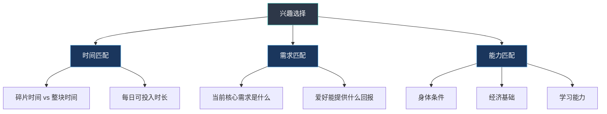
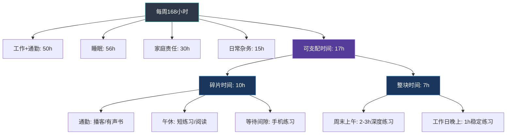
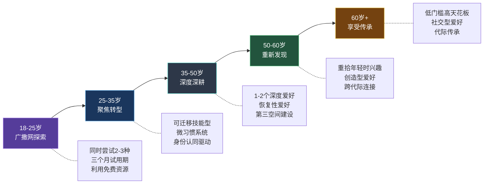

## 五、不同人生阶段的兴趣选择

兴趣爱好不是一套"一劳永逸"的方案。你在22岁时迷上的东西，到了42岁可能完全提不起兴趣；你在35岁觉得"没时间"的爱好，到了60岁可能成为每天最期待的事情。人生不同阶段，我们的时间资源、身体条件、心理需求、社会角色都在发生深刻变化，兴趣选择的策略也必须随之调整。

发展心理学家丹尼尔·莱文森（Daniel Levinson）在其经典著作《人生四季》中提出，人的一生由一系列"季节"组成，每个季节大约持续5-10年，伴随着不同的核心任务和心理主题。埃里克·埃里克森（Erik Erikson）的心理社会发展理论则将人生划分为八个阶段，每个阶段都有一个核心的心理冲突需要解决。这些理论共同指向一个关键认知：**兴趣选择不是随机的，它应该与你当前人生阶段的核心需求相匹配。**

选对了，兴趣爱好成为人生的加速器和稳定器；选错了，不仅浪费时间和金钱，还可能加剧你当前阶段的焦虑和压力。

### 5.1 兴趣选择的底层逻辑：三个匹配原则

在讨论具体年龄段之前，先建立一个通用的决策框架。无论你处于哪个阶段，选择兴趣爱好时都应该考虑三个维度的匹配：

**时间匹配**：你的碎片化时间还是整块时间多？每天能稳定投入多少时间？一个需要每天练习2小时的爱好和一个可以"想起来就做"的爱好，适合完全不同的时间模式。

**需求匹配**：你当前阶段最需要什么？是社交连接、压力释放、成就感、身体健康，还是自我表达？不同爱好的"回报类型"差异巨大——运动给你精力，艺术给你表达，社交型爱好给你归属感。

**能力匹配**：你的身体条件、经济基础、学习能力是否支撑这个爱好的入门和持续？一个需要高价装备的爱好和一个零成本的爱好，对经济敏感度不同的人意味着不同的选择。

### 5.2 青年期（18-25岁）：广撒网的黄金窗口

#### 5.2.1 这个阶段的独特优势

18-25岁是兴趣探索的"黄金窗口"，原因有三：

第一，**神经可塑性处于峰值**。神经科学研究表明，人类大脑的前额叶皮层在25岁左右才完全成熟，这意味着你的学习能力、适应能力和创造力在这个阶段处于最高水平。你学习一项新技能的速度比35岁时快30-50%，犯错的成本也更低——没人会嘲笑一个22岁的人"吉他弹得不好"。

第二，**试错成本极低**。这个阶段大多数人没有房贷、没有家庭负担、没有"不能失败"的压力。你尝试摄影发现不喜欢，换一个就是了；你报了一个吉他班发现没感觉，下个月换钢琴也没人说什么。这种"说走就走"的自由，在人生的后续阶段会越来越稀缺。

第三，**社交资源丰富**。大学社团、兴趣小组、城市里的各种活动……20岁出头的人身边充满了同样在探索的同龄人。社会学习理论告诉我们，同伴的影响对兴趣发展至关重要——看到身边的人在做有趣的事情，你会自然地产生"我也想试试"的冲动。

#### 5.2.2 具体策略

**策略一：同时尝试2-3种不同类型的爱好**

不要只盯着一种类型。建议同时尝试以下三类中各选一种：

| 类型 | 示例 | 培养的能力 | 未来价值 |
|------|------|-----------|---------|
| 创造型 | 写作、摄影、编程、绘画 | 创造力、审美、问题解决 | 可转化为副业或职业技能 |
| 身体型 | 跑步、游泳、篮球、攀岩 | 体能、意志力、抗压能力 | 终身健康基础 |
| 社交型 | 桌游、合唱、辩论、志愿者 | 沟通能力、团队协作 | 人脉积累和软技能 |

**策略二：设定"三个月试用期"**

给自己三个月的时间认真投入。第一个月每周至少投入3小时，第二个月评估感受——是否开始产生"主动想做"的冲动？第三个月判断是否有深度发展的兴趣。如果三个月后仍然没有"上头"的感觉，果断放弃，转向下一个。

心理学研究支持这种做法：Hidi和Renninger的兴趣发展四阶段模型表明，从"触发性情境兴趣"到"萌发的个人兴趣"通常需要2-4个月的持续接触。过早放弃可能让你错过真正喜欢的东西，但过久坚持一个无感的爱好也是浪费时间。

**策略三：利用"免费+低价"资源降低门槛**

- 大学社团通常是零成本或极低成本的入门途径
- B站、YouTube上有大量免费教学视频，覆盖几乎所有爱好领域
- 闲鱼上的二手装备能将入门成本降低50-80%
- 很多城市有免费的公园跑团、读书会、摄影外拍活动

**策略四：建立"兴趣档案"**

用一个简单的表格记录你的每次尝试：

爱好名称：_______________
开始时间：_______________
投入时长：_______小时
感受评分（1-10）：_______
最享受的部分：_______________
最不喜欢的部分：_______________
是否继续：是 / 否 / 再观察

这个档案在后续人生阶段会非常有价值——当你35岁想重新拾起爱好时，它能帮你快速回忆起自己的偏好和体验。

#### 5.2.3 常见陷阱

**陷阱一：跟风选择**。看到室友在学吉他你就学吉他，看到朋友圈都在跑步你就去跑步。跟风选的爱好往往缺乏内在动机，很难坚持超过三个月。自我决定理论告诉我们，"自主感"是内在动机的三大支柱之一——如果一个选择不是出于自愿，就很难产生真正的兴趣。

**陷阱二：急于变现**。"学摄影能不能接单？""学编程能不能做副业？"过早考虑变现会把兴趣变成另一个工作，扼杀探索的乐趣。这个阶段的核心任务是"发现自己"，不是"赚钱"。

**陷阱三：过度投入单一爱好**。有些人一发现喜欢的东西就All In，放弃其他所有尝试。这会导致视野狭窄，错过可能更适合自己的方向。广度探索和深度投入不是矛盾的——先广后深才是最优路径。

### 5.3 职场初期（25-35岁）：从探索到聚焦的关键转型

#### 5.3.1 这个阶段的核心挑战

25-35岁是一个矛盾交织的阶段。一方面，你终于有了自己的收入，理论上可以"想买什么装备就买什么装备"；另一方面，工作压力、职业竞争、社交应酬、恋爱/婚姻等各种事情占据了大量时间和精力。

盖洛普（Gallup）的一项调查显示，25-35岁的职场人平均每天的自由支配时间只有1.5-2小时，比大学时期减少了60%以上。这意味着你不能再像20岁那样"什么都试试"，必须做出更有策略性的选择。

#### 5.3.2 具体策略

**策略一：选择"可迁移技能型"爱好**

这个阶段的职业发展至关重要，选择那些能够反哺职业的爱好是最高性价比的决策。以下是一些"一箭双雕"的爱好选择：

| 爱好 | 直接收获 | 职业迁移价值 |
|------|---------|-------------|
| 写作/博客 | 自我表达、思维整理 | 沟通能力、个人品牌、内容营销 |
| 公众演讲/Toastmasters | 自信心、表达能力 | 领导力、商务演示、团队管理 |
| 编程/数据分析 | 逻辑思维、问题解决 | 跨领域技能、副业可能性 |
| 摄影/视频制作 | 审美、视觉叙事 | 品牌传播、社交媒体运营 |
| 运动（跑步/健身） | 体能、精力管理 | 抗压能力、自律性、社交破冰 |

**策略二：建立"微习惯"系统**

既然时间有限，就把爱好融入日常生活的缝隙中。关键不是"每天练2小时"，而是"每天练10分钟也行"。行为心理学家BJ·福格（BJ Fogg）的微习惯理论表明，一个行为的执行难度越低，坚持的概率越高。

实操建议：
- 通勤路上听10分钟播客/有声书（积累知识型爱好）
- 午休时用手机拍一张照片并简单后期（摄影微练习）
- 睡前写200字日记或读书笔记（写作微练习）
- 周末固定1-2小时作为"爱好时间"，雷打不动

**策略三：利用"身份认同"驱动坚持**

詹姆斯·克利尔（James Clear）在《原子习惯》中提出，最持久的行为改变来自身份层面的转变——不是"我要跑步"，而是"我是一个跑者"；不是"我要学摄影"，而是"我是一个摄影师"。

具体做法：
- 在社交媒体简介中加上你的爱好身份
- 加入相关的社群，让"圈内人"的身份感强化你的投入
- 购买一两件像样的装备（不需要顶级，但要"正式"），用仪式感标记身份转变
- 告诉朋友和家人"我在学XXX"，利用社会承诺效应增加坚持动力

#### 5.3.3 特殊情况处理

**情况一：加班文化严重，几乎没有自由时间**

如果你的工作强度极大（如互联网996），建议选择以下类型的爱好：
- 零准备成本：不需要换衣服、不需要出门、不需要特殊装备
- 碎片化友好：可以在10-30分钟内获得完整体验
- 恢复性高：能让大脑从工作模式切换到放松模式

推荐：冥想/正念（10分钟即可）、手机摄影（随时可拍）、有声书/播客（通勤时间）、简单的手工（折纸、编织）。

**情况二：已婚/有孩子，家庭占据大量时间**

选择能与家人共同参与的爱好，将"个人时间"转化为"家庭时间"：
- 亲子运动（骑车、爬山、游泳）
- 家庭烹饪/烘焙
- 家庭旅行规划与摄影
- 桌游/益智游戏

**情况三：经济压力大，不想在爱好上花钱**

零成本或极低成本的爱好同样可以带来深度满足：
- 跑步（只需一双跑鞋）
- 写作/博客（只需纸笔或免费平台）
- 阅读（图书馆免费，微信读书等平台有大量免费资源）
- 徒步/城市探索（几乎零成本）
- 体操/自重训练（不需要健身房）

### 5.4 中年期（35-50岁）：深耕与平衡的艺术

#### 5.4.1 这个阶段的心理特征

35-50岁是心理学家荣格所说的"人生正午"——你已经积累了足够的人生经验，开始对"我是谁""我想要什么样的生活"这类问题产生更深的思考。很多人在这个阶段经历所谓的"中年觉醒"（Midlife Awakening），开始重新审视自己的生活方式和优先级。

盖洛普的全球幸福指数研究发现，人类的幸福感呈现"U型曲线"——在45-50岁左右触底，然后开始回升。兴趣爱好在这个阶段扮演着"抗抑郁缓冲器"的角色，能够有效缓解中年期特有的焦虑和迷茫感。

#### 5.4.2 具体策略

**策略一：从"广度探索"转向"深度深耕"**

如果说20多岁是"什么都试试"，35岁以后就应该"选1-2个认真投入"。心理学家安德斯·艾利克森（Anders Ericsson）的刻意练习研究表明，达到专家水平通常需要10000小时的有目的练习。35岁开始认真投入一个爱好，到50岁时你已经可以达到相当高的水平。

选择标准：
- 你已经在之前的尝试中确认了兴趣（不是"我觉得我会喜欢"，而是"我已经试过了，确实喜欢"）
- 这个爱好有清晰的进阶路径，不会很快"触顶"
- 它能与你当前的生活方式兼容（不需要每天投入大量时间）
- 它能给你带来持续的"心流"体验

**策略二：选择"恢复性"爱好**

中年人面临的最大挑战之一是"精力管理"。工作、家庭、社交……各种责任像水泵一样持续抽走你的精力。你需要的爱好不是"再加一项任务"，而是"精力充电器"。

恢复性爱好（Restorative Hobbies）的特征：
- 让你暂时忘记工作和家庭责任
- 不需要高强度的竞争或表现压力
- 能让你进入"心流"状态
- 结束后感到精力恢复而非更加疲惫

典型选择：园艺（接触自然、节奏缓慢）、书法/绘画（专注当下、冥想般的体验）、钓鱼（耐心等待、与自然连接）、瑜伽/太极（身心整合、压力释放）、烹饪（创造性的、有即时反馈的）。

**策略三：利用爱好建立"第三空间"**

社会学家雷·奥尔登堡（Ray Oldenburg）提出"第三空间"（Third Place）的概念——除了家（第一空间）和工作场所（第二空间）之外的社交场所。中年人最容易陷入"家-公司"两点一线的单调生活，而爱好社群提供的"第三空间"能有效打破这种单调。

具体做法：
- 加入一个每周固定活动的线下社群（读书会、跑团、摄影俱乐部）
- 参与一个有共同目标的项目（合唱团排练、乐队演出、马拉松训练营）
- 在兴趣社群中承担一定的组织角色（增加归属感和责任感）

**策略四：规划"终身型"爱好**

35-50岁是为退休生活做准备的最佳时机。选择那些你可以在60岁、70岁、80岁时仍然继续进行的爱好，提前建立技能基础和社交网络。

终身型爱好的特征：
- 对身体机能的要求适中，不会随年龄增长而大幅下降
- 有持续的进阶空间，不会"学完了就没得学"
- 有活跃的社群，能提供社交连接
- 能带来持续的成就感和意义感

推荐：书法、绘画、园艺、摄影、阅读、写作、围棋/象棋、乐器（钢琴、吉他、古琴）、太极、钓鱼。

#### 5.4.3 中年人的时间管理实战

中年人培养爱好最大的障碍是时间。以下是一套经过验证的时间管理框架：

关键原则：
- **保护"爱好时间"**：像保护工作会议一样保护你的爱好时间，不轻易让其他事情侵占
- **降低启动成本**：把装备放在最容易拿到的地方，减少"开始做"的心理阻力
- **与家人协商**：明确告诉家人"每周六上午是我的爱好时间"，争取他们的理解和支持
- **利用碎片时间**：不要小看每天的30分钟碎片时间，一年累计下来超过180小时——足以在大多数爱好上取得显著进步

### 5.5 中年后期（50-60岁）：重新发现与身份重建

#### 5.5.1 这个阶段的独特意义

50-60岁是一个被严重低估的兴趣培养黄金期。孩子逐渐独立（或已经离家），职业进入稳定期甚至准备退休，经济基础通常比年轻时更稳固。很多人在这个阶段经历"空巢期"——孩子离开后突然发现大量空闲时间，却不知道该做什么。

心理学家荣格认为，人生的后半段是"个体化"（Individuation）的过程——从社会角色的面具下找回真实的自己。兴趣爱好在这个过程中扮演着关键角色，它帮助你重新定义"我是谁"，不再仅仅是"XX的父亲/母亲"或"XX公司的XX职位"。

#### 5.5.2 具体策略

**策略一：重新审视年轻时的兴趣档案**

回想你在20-30岁时尝试过但因为"没时间"而放弃的爱好。现在可能是重新拾起它们的最佳时机。你已经有了更多的人生阅历和耐心，年轻时觉得"太难"或"太无聊"的东西，现在可能会有不同的感受。

**策略二：探索"创造型"爱好**

这个阶段特别适合创造型爱好——绘画、写作、木工、陶艺、音乐创作。原因有三：
- 你有了足够的人生素材可以表达
- 你不再急于"证明自己"，更能享受创造过程本身
- 创造带来的成就感对这个阶段的心理健康尤为重要

**策略三：建立"跨代际"的社交连接**

选择那些能够与不同年龄段的人互动的爱好。教授年轻人你擅长的东西，或者向年轻人学习新技能——这种跨代际的交流对双方都有益。研究表明，代际互动能够显著降低老年人的认知衰退风险，同时增强年轻人的社会资本。

### 5.6 老年期（60岁以上）：享受与传承

#### 5.6.1 这个阶段的生理与心理特点

60岁以后，身体机能的下降是不可回避的现实。但这并不意味着兴趣爱好的选择空间缩小了——恰恰相反，很多对体能要求不高的爱好在这个阶段反而更加适合。

《柳叶刀》发表的一项覆盖120万人的研究表明，规律参与兴趣活动的老年人，认知衰退速度比不参与的老年人慢32%，全因死亡风险降低约30%。世界卫生组织（WHO）在其关于"积极老龄化"的指南中明确指出，兴趣爱好是维持老年人生活质量的四大支柱之一（另外三个是健康、安全和社会参与）。

#### 5.6.2 具体策略

**策略一：选择"低门槛、高天花板"的爱好**

低门槛意味着身体条件要求不高，容易开始；高天花板意味着有持续的进阶空间，不会很快"学到头"。

推荐选择：

| 爱好 | 身体要求 | 社交属性 | 认知刺激 | 成就感 |
|------|---------|---------|---------|--------|
| 书法 | 低 | 中（可以独自练习，也可以参加社团） | 高 | 高（作品可以展示和馈赠） |
| 绘画（国画/水彩） | 低 | 中 | 高 | 高 |
| 太极/八段锦 | 中低 | 高（晨练群体） | 中 | 中 |
| 园艺 | 中低 | 中（社区花园） | 中 | 高（看得见的成长） |
| 围棋/象棋 | 极低 | 高（棋友圈） | 极高 | 中 |
| 摄影 | 低-中 | 中高（摄影采风团） | 中 | 高 |
| 声乐/合唱 | 低 | 极高（合唱团） | 中 | 高（演出成就感） |
| 阅读/写作 | 极低 | 中（读书会、写作群） | 极高 | 高 |

**策略二：重视"社交型"爱好**

孤独是老年人最大的健康威胁之一。美国卫生局局长在2023年的报告中将"孤独流行病"列为公共健康危机，指出长期孤独对健康的危害等同于每天吸15支烟。兴趣爱好社群为老年人提供了重要的社交连接。

特别推荐的社交型爱好：
- **合唱团/乐队**：音乐活动能够同时刺激听觉、记忆、语言和运动皮层，是认知刺激最全面的爱好之一。集体演唱还能促进催产素分泌，增强社会连接感。
- **广场舞/交谊舞**：身体活动+社交互动+音乐刺激的三重组合，对预防认知衰退效果显著。
- **棋牌类活动**：围棋、象棋、桥牌等需要策略思维的游戏能有效维持认知功能。更重要的是，棋牌活动通常有固定的"棋友"群体，提供稳定的社交支持。
- **志愿者活动**：教授年轻人技能、参与社区服务、做导览志愿者——这些活动能带来强烈的意义感和价值感，对心理健康至关重要。

**策略三：选择"代际传承"型爱好**

将自己的人生经验和技能传递给下一代，是老年期最有意义的活动之一。心理学家埃里克森认为，老年期的核心心理任务是"自我整合 vs 绝望"——能够回顾人生并感到满意的人，会体验到"智慧"（wisdom）；反之则可能陷入绝望。而"传承"正是实现自我整合的最佳途径。

具体形式：
- 写回忆录或人生故事
- 教授孙辈书法、绘画、棋艺
- 在社区开设免费兴趣课程
- 参与口述历史项目
- 制作家庭相册或家谱

#### 5.6.3 健康与安全注意事项

老年人选择爱好时需要特别注意以下几点：

**关节保护**：避免高冲击性的运动（如跑步、篮球），选择对关节友好的活动（如游泳、太极、瑜伽）。如果已经有骨质疏松或关节炎，应在医生指导下选择合适的运动强度。

**认知负荷管理**：虽然保持认知活跃很重要，但不要给自己太大压力。学习新东西的目的是享受过程，不是"证明自己还没老"。如果某个爱好让你感到焦虑而非愉悦，降低难度或换一个更轻松的方向。

**视力和听力考量**：选择爱好时要考虑自己的视力和听力条件。如果视力下降明显，避免需要长时间精细操作的活动（如微缩模型），选择大尺度的创作（如大幅绘画、书法）。如果听力下降，可以考虑视觉导向的爱好（如摄影、园艺）。

**防跌倒**：户外活动注意天气和路面条件，室内活动确保空间充足、光线充足。太极和瑜伽在改善平衡能力方面效果显著，值得作为"基础爱好"来培养。

### 5.7 全生命周期兴趣发展路线图

将以上各阶段的策略整合成一张路线图，帮助你直观地理解兴趣爱好的全生命周期管理：

### 5.8 常见误区与纠正

**误区一："等退休了再培养爱好"**

这是最普遍也最有害的想法。原因有三：第一，你不知道自己退休后身体状况如何；第二，爱好需要时间积累，等到60岁才开始，你的学习能力和精力都不如从前；第三，你现在就需要爱好来缓解压力和维持健康，而不是"等到以后"。从今天开始，哪怕只是每天15分钟。

**误区二："我现在太忙了，没时间"**

时间管理大师劳拉·范德卡姆（Laura Vanderkam）在其著作《168小时》中指出，大多数人并不像自己以为的那么忙。她建议用时间记录法——连续一周精确记录每15分钟在做什么——你会发现大量被"刷手机""无目的浏览"占据的时间。把这些时间的哪怕一半用于爱好，每周就能多出5-7小时。

**误区三："年纪大了学不会了"**

神经科学已经推翻了"成年人大脑不能改变"的旧观点。虽然成年人的神经可塑性确实低于青少年，但大脑终身都可以通过学习建立新的神经连接。伦敦大学学院的研究发现，学习新技能（如杂耍）的成年人在8周后大脑灰质密度显著增加。关键不是年龄，而是方法——成年人需要更多的"刻意练习"和"即时反馈"来弥补学习速度的下降。

**误区四："爱好必须有产出"**

不是所有爱好都需要"出作品""拿成绩""赚到钱"。纯粹为了享受过程而做的事情，本身就是有价值的。心理学研究表明，"无目的的愉悦活动"对心理健康的促进效果甚至优于"有目标的刻意练习"。允许自己"只是为了开心"而做某件事，这本身就是一种能力。

**误区五："别人推荐的一定适合我"**

爱好选择是高度个人化的事情。别人觉得有趣的东西，你可能觉得无聊；别人觉得"太简单"的东西，你可能觉得刚刚好。尊重自己的感受，而不是盲目跟随他人的推荐。上文提到的"兴趣档案"和"三个月试用期"策略，就是帮你用亲身体验而非他人评价来做决策。

### 5.9 本节小结

不同人生阶段的兴趣选择策略可以概括为以下核心原则：

| 人生阶段 | 核心策略 | 选爱好的关键词 | 最大陷阱 |
|----------|---------|--------------|---------|
| 18-25岁 | 广撒网探索 | 尝试、发现、记录 | 跟风、急于变现 |
| 25-35岁 | 聚焦转型 | 可迁移、微习惯、身份 | "太忙"的借口 |
| 35-50岁 | 深度深耕 | 深度、恢复、第三空间 | 完全忽略自己 |
| 50-60岁 | 重新发现 | 重拾、创造、跨代际 | 空巢迷茫 |
| 60岁+ | 享受传承 | 低门槛、社交、传承 | "太晚了"的心态 |

无论你处于哪个阶段，最重要的一步永远是：**现在就开始**。不要等到"完美时机"——它永远不会来。从你手边最容易做的事情开始，哪怕只是打开一个教学视频、报一个体验课、或者出门散步15分钟。行动会产生动力，动力会带来改变。

***
