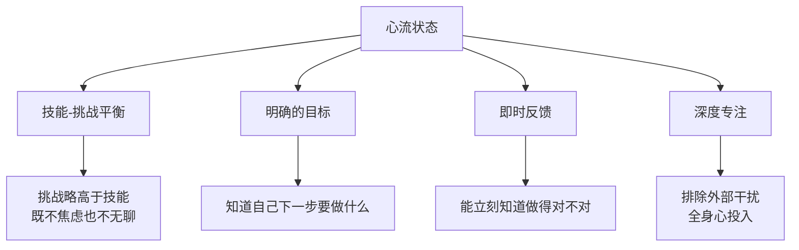
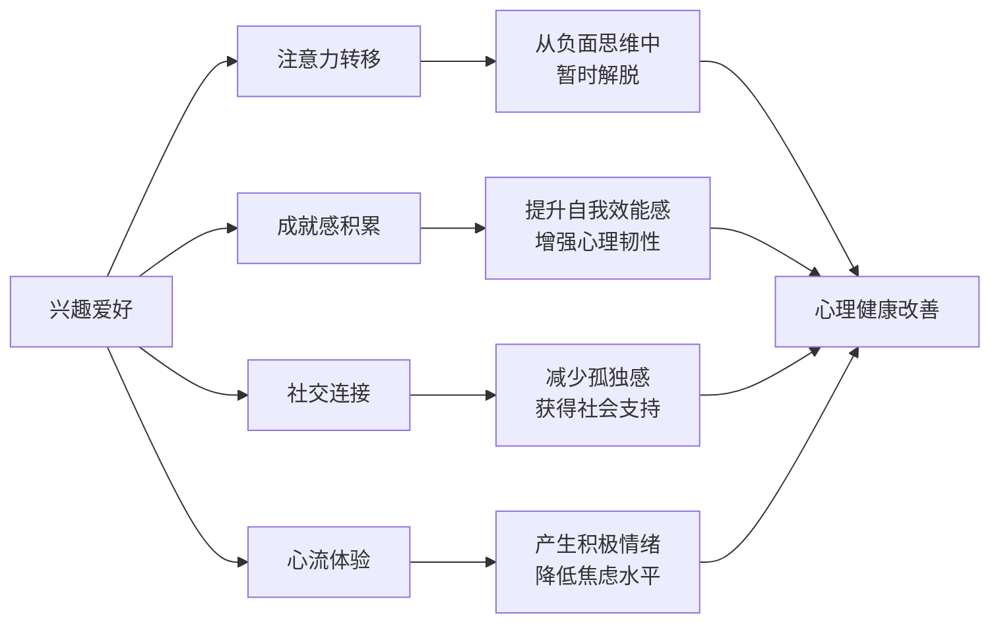
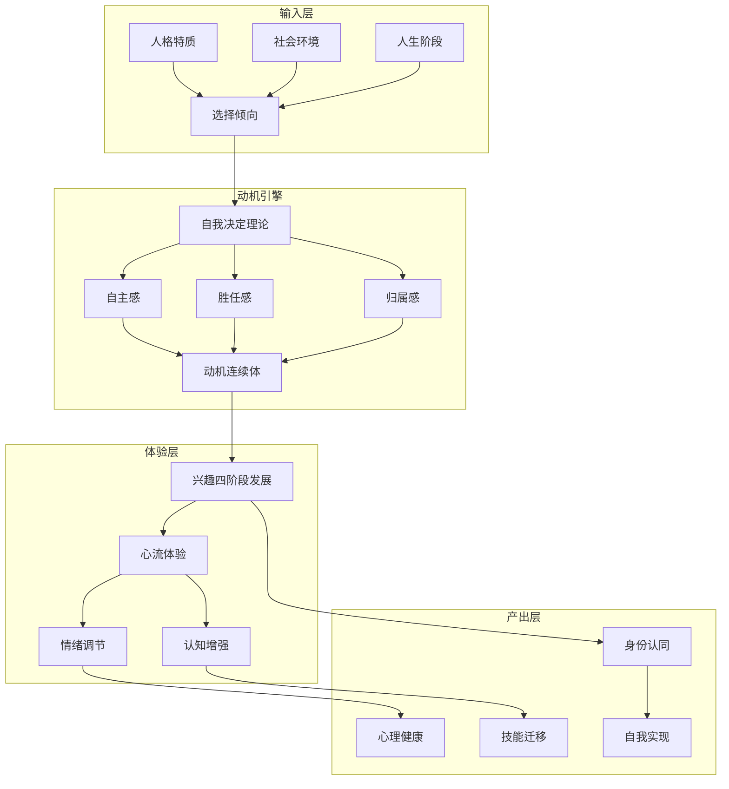

## 六、兴趣爱好的心理学视角

兴趣爱好不只是"打发时间"的行为——它是人类心理系统中一个高度精密的动机-情绪-认知协同机制。理解兴趣背后的心理学原理，不仅能帮助我们选择和坚持爱好，更能让我们通过爱好优化心理健康、构建个人身份、提升生活质量。

本节将从六个核心理论视角系统剖析兴趣爱好的心理学机制，并提供可落地的实践框架。

### 6.1 自我决定理论与兴趣发展

自我决定理论（Self-Determination Theory, SDT）由心理学家爱德华·德西（Edward Deci）和理查德·瑞安（Richard Ryan）于1985年提出，是当代动机心理学中引用量最高的理论框架之一。该理论认为，人类行为的动机并非简单的"有动力/没动力"二元对立，而是一个从完全外部驱动到完全内在驱动的连续谱系。兴趣爱好的质量，取决于三种基本心理需求的满足程度。

#### 6.1.1 三种基本心理需求

**自主感（Autonomy）**——"我选择做这件事"

自主感不是"随心所欲"，而是"感觉到自己的行为是自我认可的"。研究发现，即使是在外部约束下（如公司要求学某项技能），如果个体能够将其与个人价值观关联（"这项技能对我的长期发展有意义"），也能体验到自主感。反之，如果一个爱好完全出于社交压力（"朋友们都在学，我不学显得落后"），即使最终学会了，过程中也很难获得真正的满足。

实操启示：在选择爱好时，问自己三个问题——"如果没有任何人知道我在做这件事，我还会选择它吗？""我在做这件事时，内心的声音是'不得不'还是'我想要'？""这件事与我珍视的价值观有什么联系？"

**胜任感（Competence）**——"我能把这件事做好"

胜任感的核心不是"已经做得很好"，而是"能够感知到进步"。这就是为什么设定合理的目标阶梯和提供及时反馈对兴趣维持如此重要。斯坦福大学心理学教授卡罗尔·德韦克（Carol Dweck）的研究进一步指出：持有成长型思维（认为能力可以通过努力提升）的人，在爱好中更容易建立胜任感；而持有固定型思维（认为能力是天生的）的人，遇到困难时更容易将其解读为"我不适合这个"。

实操启示：在爱好学习的初期，刻意为自己设计"小胜利"——比如学吉他时先学会一首简单的和弦进行而不是直接挑战高难度曲目；学画画时先临摹简单图形而不是直接写生。每次完成一个小目标，都在大脑的胜任感系统中积累正向标记。

**归属感（Relatedness）**——"我在做这件事时与他人有连接"

归属感不一定要通过"加入社群"来实现。它也可以来自：与朋友分享你的作品、教别人你刚学到的技能、甚至只是在社交媒体上看到同好者的动态而感到"我不是一个人"。纽约大学的研究表明，即使是线上社群中的"弱连接"（不频繁互动但知道彼此存在），也能有效满足归属需求。

实操启示：即使你偏好独处型爱好（如写作、编程），也建议建立一个低压力的分享渠道——可以是一个小型写作群、一个编程论坛账号、或者仅仅是定期向一位朋友展示你的进展。

#### 6.1.2 内在动机 vs 外在动机

SDT 将动机分为四个层级，从弱到强：

| 动机类型 | 描述 | 示例 | 持久性 |
|---------|------|------|--------|
| 外部调节 | 为了获得奖励或避免惩罚 | "学英语是因为公司要求" | 极低 |
| 内摄调节 | 为了避免内疚或焦虑 | "不练琴会觉得浪费了买琴的钱" | 低 |
| 认同调节 | 认为活动有价值和意义 | "学编程对我未来职业很重要" | 中等 |
| 整合调节 | 活动与自我身份完全融合 | "编程是我是谁的一部分" | 高 |
| 内在动机 | 活动本身就是奖赏 | "编程让我进入心流状态" | 最高 |

兴趣爱好的理想状态是达到内在动机或整合调节。但动机并非固定不变——它会随时间和情境波动。今天觉得"这就是我热爱的事"，明天可能因为挫折感变成"我好像没那么喜欢了"。理解这一点，就不会在动机下降时误以为"选错了爱好"，而是将其视为正常的心理波动。

### 6.2 心流理论：兴趣的巅峰体验

心理学家米哈里·契克森米哈赖（Mihaly Csikszentmihalyi）在1990年提出的**心流理论（Flow Theory）**，是理解"为什么有些爱好让人废寝忘食"的关键框架。心流是一种完全沉浸在活动中的心理状态，其特征是：注意力高度集中、时间感扭曲、自我意识消失、活动本身成为奖赏。

#### 6.2.1 心流的触发条件

心流不是随机出现的，它需要满足特定条件。根据契克森米哈赖及其后继者的研究，进入心流状态需要以下要素：

**技能-挑战平衡**是心流的核心条件。契克森米哈赖用一个二维模型来描述：

|  | 低挑战 | 中等挑战 | 高挑战 |
|--|--------|---------|--------|
| **高技能** | 无聊 | **心流** | 焦虑/唤醒 |
| **中等技能** | 无聊/放松 | 参与 | 焦虑 |
| **低技能** | 漠然 | 担忧 | 焦虑 |

爱好之所以特别容易产生心流，是因为它天然提供了"技能-挑战平衡"的环境——你可以自由选择难度等级，不像工作那样被外部要求约束。

#### 6.2.2 如何在爱好中培养心流

1. **选择合适的难度区间**：挑战应比当前能力高出5%-15%。太简单导致无聊，太难导致焦虑。比如学钢琴，如果当前水平是四级，就选择五级的曲目来练习，而不是直接挑战八级。

2. **分解目标为可感知的小单元**：大目标（"写一本小说"）无法提供即时反馈，但小目标（"今天写完这个场景"）可以。每完成一个小单元，心流的反馈循环就完成一次。

3. **创造"无打扰时段"**：研究发现，从被打断到重新进入深度专注平均需要23分钟。在爱好时间中，关闭手机通知、设定明确的专注时段（如番茄钟的变体——45分钟专注+15分钟休息），能显著提高心流出现的概率。

4. **建立仪式感**：心理学中的"情境暗示"效应表明，固定的时间、地点和准备动作会帮助大脑快速进入状态。比如每天晚上八点在书房的同一张桌子上画画，大脑会逐渐将这个情境与"创作模式"关联。

### 6.3 兴趣发展的四阶段模型

心理学家苏珊·伦宁格-辛格（Suzanne Hidi）和安妮·伦宁格（Anne Renninger）在2006年提出了兴趣发展的四阶段模型，这是理解"兴趣是如何从无到有、从弱到强"的权威框架。

#### 6.3.1 四阶段详解

**阶段一：触发性情境兴趣（Triggered Situational Interest）**

由外部刺激引发的短暂兴趣。比如在短视频平台看到一段精彩的书法作品，产生"我也想试试"的冲动。这个阶段的特点是：持续时间短（通常数分钟到数天）、依赖外部刺激、尚未与自我身份建立联系。

关键特征：90%的人停留在这个阶段就会消退。触发性兴趣是"种子"，但种子需要土壤和水分才能发芽。大多数人的问题是：收集了无数"想做的事"的清单，却从未将任何一个推进到下一阶段。

**阶段二：维持性情境兴趣（Maintained Situational Interest）**

在外部支持下持续的兴趣。这个阶段的关键转变是：从"被吸引"到"持续参与"。比如被书法视频吸引后，报名了一个线上课程，每周固定时间学习，有老师指导和同学互动。外部支持系统（社群、导师、结构化课程）是维持这一阶段的核心要素。

数据参考：Renninger和Hidi的研究发现，在维持阶段获得的外部支持质量，直接决定了兴趣能否发展到下一阶段。低质量的支持（如过于严厉的批评、不合理的进度要求）反而会阻碍兴趣发展。

**阶段三：萌发的个人兴趣（Emerging Individual Interest）**

开始主动追求的兴趣。即使没有外部奖励或社交压力，也会自发地去学习和练习。这个阶段的标志是：你会主动搜索相关信息、会因为想到这个爱好而感到兴奋、会在闲暇时间自然地想到去做这件事。

转折点：从阶段二到阶段三的过渡，往往伴随着一个关键事件——比如第一次完成一个让自己真正满意的作品、第一次在比赛中获得认可、或者第一次体验到心流状态。

**阶段四：成熟的个人兴趣（Well-Developed Individual Interest）**

稳定的、内在驱动的兴趣。这个阶段的特点是：兴趣已经成为个人身份的一部分（"我是一个跑步者""我是一个吉他手"），遇到困难会主动寻找解决方法而非放弃，能够从活动的多个层面获得满足感。

#### 6.3.2 实践意义：给兴趣发展合理的预期

理解这四个阶段，能够帮助我们建立合理的预期：

- 不要期望第一天就对某个爱好"一见钟情"——大多数人需要经历6-12周的持续参与才能判断一个爱好是否适合自己
- 不要因为"三分钟热度"而自责——这是人类面对新事物的正常反应，关键是能否进入并维持阶段二
- 不要忽视外部支持系统——即使是高度内向的人，也需要某种形式的外部结构（如课程、书单、练习计划）来帮助兴趣发展
- 不要急于"放弃"——从阶段二到阶段三的过渡通常需要3-6个月，许多人在过渡期前就放弃了

### 6.4 兴趣与人格特质的关系

人格心理学中最具影响力的五因素模型（Big Five / OCEAN模型）为理解"什么样的人适合什么样的爱好"提供了科学依据。

#### 6.4.1 五大人格特质与爱好的对应关系

**开放性（Openness to Experience）**

高开放性的人好奇心强、想象力丰富、喜欢新奇体验。他们更容易对多种爱好产生兴趣，也更愿意尝试非传统的活动。他们通常是"多面手"，拥有跨越多个领域的兴趣。但高开放性也意味着容易"三分钟热度"——因为总有更新奇的事物吸引注意力。

典型适配爱好：创意写作、实验摄影、即兴音乐、陶艺、旅行探索
风险提示：需要刻意培养"深度"而非只追求"广度"，建议选择1-2个核心爱好长期投入

**尽责性（Conscientiousness）**

高尽责性的人自律、有条理、目标导向。他们更容易在爱好中坚持长期投入并达到高水平，但也可能因为过度追求"完美表现"而丧失乐趣。他们需要警惕将爱好"工作化"——如果每个爱好都变成"必须进步"的任务，就失去了爱好的心理补偿功能。

典型适配爱好：长跑训练、乐器精进、模型制作、园艺
风险提示：定期提醒自己"这个爱好的目的是享受过程"，避免将工作中的绩效思维完全复制到爱好中

**外向性（Extraversion）**

外向者从社交互动中获取能量，内向者从独处中恢复精力。这直接影响爱好选择：外向者更倾向于团队运动、社交舞蹈、合唱团等群体活动；内向者更倾向于阅读、写作、绘画、独自跑步等独处活动。但需要注意：内向者也可以享受社交型爱好（只是需要更多的恢复时间），外向者也可以享受独处型爱好（只是可能需要偶尔分享和讨论）。

**宜人性（Agreeableness）**

高宜人性的人友善、合作、关注他人感受。他们更愿意在兴趣社群中扮演支持者和协调者角色，善于营造积极的学习氛围。但高宜人性也可能导致"过度迁就"——比如在合唱团中总是被安排做和声部分而非独唱，在运动队中总是做辅助而非核心位置。高宜人性的人需要学习在爱好中也适度争取自己的需求。

**神经质（Neuroticism）**

高神经质的人情绪波动较大、容易焦虑和自我批评。在爱好中，高神经质可能带来两个极端：一方面，他们更容易因为初期的挫折而放弃（"我果然不适合这个"）；另一方面，爱好对他们来说可能是更有效的心理调节工具——高神经质的人如果能找到一个稳定的爱好，从中获得的心流体验对情绪稳定性的提升效果比普通人更显著。

#### 6.4.2 自我评估实践框架

不要简单地给自己贴标签。更好的做法是：

1. **回顾过去的经验**：在过去的爱好或学习经历中，你是在什么条件下感到最有动力？什么条件下最容易放弃？这些是比任何人格测试都更准确的"自我数据"。
2. **区分"真正的我"和"被期待的我"**：你选择某个爱好，是因为内心被吸引，还是因为它符合某种社会期望（如"男人应该喜欢运动""文艺青年应该喜欢读书"）？
3. **允许人格特质的流动性**：人格不是固定不变的，它会随年龄、经历和环境变化。30岁的你和20岁的你，在爱好偏好上可能有显著差异。

### 6.5 兴趣爱好作为情绪调节系统

越来越多的心理学研究将兴趣爱好视为一种"非正式的心理健康干预手段"。

#### 6.5.1 情绪调节机制

爱好通过四种途径影响情绪状态：

**注意力转移**：当人沉浸在爱好中时，大脑的"默认模式网络"（DMN，负责反刍思维和自我参照思维）活动降低，而负责当下任务的"任务正向网络"活动增强。这意味着，爱好能有效地打断负面思维的循环——不是通过"强迫自己不去想"，而是通过提供一个更有吸引力的注意力目标。

**成就感积累**：每一次完成一个作品、突破一个技术瓶颈、或者达到一个里程碑，都会触发大脑奖赏回路中的多巴胺释放。长期积累的成就感，会构建一个"我能行"的自我叙事，这种自我叙事在面对生活其他领域的挑战时也会发挥作用。

**社交连接**：共同的爱好创造了"基于活动的社交"——与基于角色的社交（同事、家人）不同，这种社交压力更低、真实度更高，因为参与者是因为共同兴趣而聚在一起。

**心流体验**：如6.2节所述，心流状态本身就能产生强烈的积极情绪，其效果可持续数小时甚至数天。

#### 6.5.2 临床心理学中的"处方爱好"

在英国、澳大利亚和部分欧洲国家，医生已经可以开具"社会处方"（Social Prescribing），将患者转介到社区艺术项目、园艺活动、合唱团等非医疗干预中。英国国家卫生服务体系（NHS）的数据显示，参与社会处方的患者在心理健康指标上的改善，与接受认知行为疗法的患者相当，且复发率更低。

虽然"处方爱好"在国内尚未制度化，但其背后的逻辑是普适的：对于轻度到中度的焦虑、抑郁和压力问题，一个结构化的爱好参与计划，可以作为心理治疗的有效补充——当然不能替代专业治疗。

#### 6.5.3 爱好的"心理补偿"功能

心理学中的"补偿理论"认为，人们会在一个领域中寻求在另一个领域中缺失的心理满足。例如：

- 工作中缺乏自主感的人，可能从需要自主决策的爱好（如自由潜水、独自旅行）中获得补偿
- 工作中高度抽象的人，可能从需要动手操作的爱好（如木工、烹饪）中获得平衡
- 工作中缺乏社交的人，可能从团体运动或合唱中获得归属感
- 工作中高度结果导向的人，可能从过程导向的爱好（如冥想、散步）中获得放松

理解这一功能，有助于有意识地选择能够弥补生活短板的爱好，而非盲目跟随潮流。

### 6.6 认知心理学视角：兴趣如何重塑大脑

兴趣爱好不仅影响情绪，还对认知功能产生实质性的神经可塑性影响。

#### 6.6.1 交叉迁移效应（Cross-Transfer Effect）

神经科学研究表明，在一个领域培养的技能可以部分迁移到其他领域，这种现象被称为"交叉迁移"。例如：

- 学习乐器提升了听觉加工能力，同时也改善了语言学习中的语音辨别能力
- 学习国际象棋增强了工作记忆和模式识别能力，这种能力可以迁移到数学和编程中
- 学习绘画提升了视觉空间能力，改善了日常导航和空间推理能力
- 冥想练习增强了注意力控制能力，提升了在所有认知任务中的表现

这意味着，投资在爱好上的时间不是"浪费"——它在构建的底层认知能力会在生活的其他方面产生回报。

#### 6.6.2 双重编码与记忆增强

加拿大心理学家阿兰·帕维奥（Allan Paivio）的双重编码理论指出，当信息同时以语言和视觉两种方式编码时，记忆效果最好。许多爱好天然涉及多感官编码——烹饪涉及味觉、嗅觉、触觉和视觉；音乐涉及听觉和运动觉；园艺涉及触觉、嗅觉和视觉。这种多感官参与使得爱好成为天然的"认知训练场"。

#### 6.6.3 神经可塑性的关键窗口

虽然"关键期"理论（认为某些能力只能在特定年龄窗口期发展）被过度简化了，但大脑的可塑性确实随年龄变化。好消息是，学习爱好涉及的"技能型可塑性"（如运动技能、感知技能）在成年期仍然高度活跃。加州大学旧金山分校的研究显示，即使是70岁以上的老年人，通过持续的音乐训练也能显著改善工作记忆和注意力。

### 6.7 社会心理学视角：兴趣与身份认同

#### 6.7.1 兴趣作为身份标记

社会心理学家亨利·泰弗尔（Henri Tajfel）的社会认同理论指出，人们通过群体成员身份来定义自己。兴趣爱好是构建社会身份的重要来源——"我是一个跑步者""我是一个咖啡爱好者""我是一个开源社区贡献者"。

这种身份标记有两个功能：
- **内群体认同**：与同样爱好某个活动的人产生"我们感"，增强归属需求
- **自我概念丰富化**：多重爱好身份使自我概念更加复杂和灵活，提升心理韧性

#### 6.7.2 兴趣社群的群体动力学

兴趣社群并非总是正面的。心理学研究揭示了几个常见的群体动力学陷阱：

- **地位竞争**：当社群中的等级结构过于明显时，新成员可能因为感到"差距太大"而退出。选择入门友好的社群比选择"最专业"的社群更重要
- **回音室效应**：封闭的爱好社群可能强化狭隘的观点（"只有我们这种弹法才是正确的"），阻碍开放性探索
- **社会比较陷阱**：过度关注他人的成就会降低自己的胜任感。关键在于"与过去的自己比较"而非与他人比较

### 6.8 常见心理障碍与应对

在兴趣发展的过程中，以下几个心理障碍最为普遍：

#### 6.8.1 完美主义瘫痪

表现：因为害怕做得不够好而迟迟不开始，或者反复准备而永不进入实操。比如买了很多画笔和教程，但总觉得"还没准备好"而不开始画。

心理机制：完美主义与高神经质和低自我效能感有关。大脑将"做得不够完美"等同于"失败"，触发回避行为。

应对方法：
1. 设定"最低可行标准"——不是"画一幅好画"，而是"在纸上画10分钟"
2. 刻意练习"不完美的作品"——每周完成一个"允许自己不满意"的作品
3. 记住：所有大师都有大量不为人知的"垃圾作品"，只是他们没有展示出来

#### 6.8.2 比较焦虑

表现：看到别人的优秀作品后，觉得"我永远达不到那个水平"，丧失动力。

心理机制：这是"专家盲点"（expert blind spot）的反面——我们只看到别人展示的成品，看不到他们背后数千小时的练习过程。

应对方法：
1. 主动了解专家的成长历程——你会发现他们也曾是初学者
2. 限制社交媒体上同领域内容的消费量，避免过度暴露在"高光时刻"中
3. 建立自己的"进步档案"——定期保存作品，每月回顾时你会发现显著的进步

#### 6.8.3 "选错爱好"的焦虑

表现：担心"如果这不是最适合我的爱好怎么办""如果我在浪费时间怎么办"。

心理机制：这源于对"最优选择"的执念，忽略了任何爱好都有学习价值的事实。

应对方法：
1. 接受"没有完美的爱好，只有足够好的爱好"
2. 设定一个试验期（建议3个月），到期后再评估是否继续
3. 记住：即使是"最终放弃"的爱好，也为你积累了认知能力和自我认知

#### 6.8.4 动机衰减曲线

表现：初期热情高涨，2-4周后热情骤降，最终放弃。

心理机制：这与"新奇效应"（novelty effect）有关——多巴胺系统对新奇刺激反应强烈，但随着习惯化，同等刺激带来的多巴胺释放会显著减少。

应对方法：
1. 在动机高涨期建立"低阻力启动系统"——比如将乐器放在最显眼的位置、在日历上固定爱好时间
2. 当热情下降时，不要将其解读为"我不喜欢这个了"，而是将其视为兴趣从阶段一向阶段二过渡的正常信号
3. 在低动力期切换到"微习惯"模式——每天只做5分钟，保持接触但不强求表现

### 6.9 发展心理学视角：年龄与兴趣的演变

#### 6.9.1 不同生命阶段的兴趣心理特征

| 年龄段 | 心理特征 | 兴趣发展的特点 | 建议 |
|-------|---------|-------------|------|
| 18-25岁 | 身份探索期 | 广泛尝试，容易改变，受同伴影响大 | 大胆尝试，记录每次尝试的感受和收获 |
| 25-35岁 | 身份建立期 | 开始追求深度，偏好能带来成就感的爱好 | 选择2-3个核心爱好深入投入 |
| 35-50岁 | 身份稳定期 | 爱好成为心理补偿和压力调节的工具 | 选择能平衡工作压力的爱好类型 |
| 50-65岁 | 身份再评估期 | 可能重新拾起年轻时的爱好，追求意义感 | 允许自己"回到初心"，不追求功利价值 |
| 65岁以上 | 整合期 | 爱好成为社交纽带和认知保护的手段 | 优先选择社交性强、认知参与度高的活动 |

#### 6.9.2 性别与文化差异

需要注意的是，以上框架基于西方心理学研究，跨文化适用性存在差异。中国文化中，爱好选择受到更多家庭期望和社会规范的影响（如"学而优则仕"的传统观念可能导致"爱好必须有实用价值"的心理负担）。此外，性别刻板印象对爱好的影响也不容忽视——男性可能因为社会期望而回避被认为"女性化"的爱好（如插花、编织），女性可能回避被认为"男性化"的爱好（如格斗、电子竞技）。

识别这些外部影响，不是为了否定它们，而是为了做出更有意识的选择——选择你真正想要的，而非仅仅选择社会允许你想要的。

### 6.10 理论整合：兴趣爱好的心理学全景图

将以上所有理论视角整合，我们可以构建一个完整的兴趣爱好心理学模型：

这个全景图的核心洞见是：兴趣爱好不是孤立的"业余活动"，而是一个贯穿动机、认知、情绪和身份的心理生态系统。理解这个系统，就能更有意识地培养、维护和优化自己的兴趣爱好。

### 6.11 本节要点回顾

1. **自我决定理论**揭示了兴趣的三种心理需求基础——自主感、胜任感、归属感，三者缺一不可
2. **心流理论**解释了"废寝忘食"的心理机制——技能-挑战平衡是核心触发条件
3. **兴趣四阶段模型**给出了兴趣从萌芽到成熟的完整路径，帮助建立合理预期
4. **五大人格特质**为选择爱好提供了个体化参考，但不应成为限制
5. **情绪调节功能**使爱好成为心理健康的重要"非正式干预手段"
6. **认知增强效应**证明爱好投资的时间不会"浪费"，底层能力会迁移
7. **身份认同功能**说明爱好深度参与会改变"你是谁"的自我叙事
8. **常见心理障碍**（完美主义、比较焦虑、动机衰减）都有可操作的应对策略
9. **年龄和文化因素**影响兴趣选择，但理解这些影响后可以做出更自由的决定
