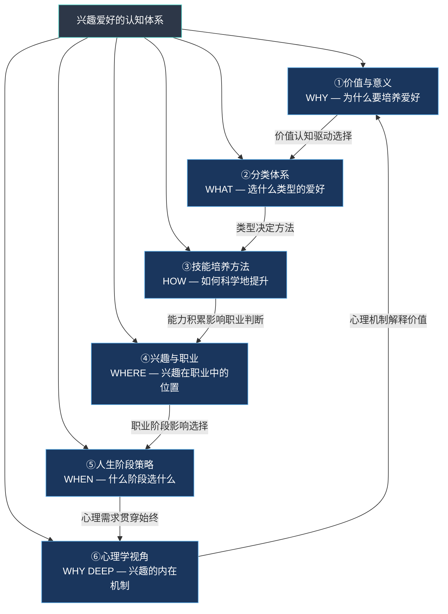
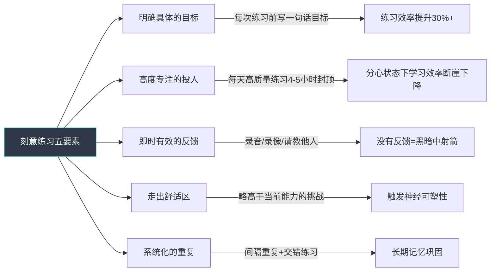
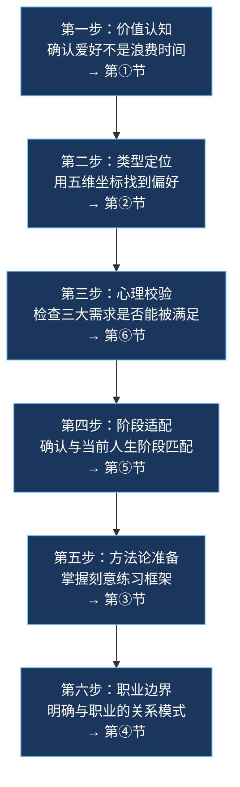

## 本节小结：基础理论全景整合

基础理论六节内容构建了兴趣爱好的完整认知框架——从"为什么要培养爱好"到"如何科学地培养爱好"，再到"如何在不同人生阶段持续经营爱好"。本节不是简单的要点罗列，而是将六个维度的知识进行交叉整合，帮你建立一张立体的"兴趣认知地图"，让零散的知识点形成可操作的决策系统。

---

### 一、六维框架总览：一张图看清全局

基础理论六节围绕一个核心命题展开：**兴趣爱好不是消遣，而是一个连接心理健康、社交关系、认知发展、身体健康、职业价值和生命意义的完整系统。** 六节内容分别从六个维度拆解这个系统：

六个维度不是孤立的章节，而是环环相扣的系统。理解价值才能有动力选择，选对类型才能找到有效的培养方法，掌握方法才能评估职业化的可能性，结合人生阶段才能做出务实的决策，而心理学视角则是贯穿所有环节的底层操作系统。

---

### 二、各节核心精要：从六个维度构建完整认知

#### 2.1 兴趣的价值：不止于"好玩"——它是你的自我更新引擎

兴趣爱好的价值远超消遣娱乐。第一节从六个维度系统论证了这一点：

| 维度 | 核心机制 | 关键数据/研究 |
|------|---------|-------------|
| 心理健康 | 心流状态触发多巴胺、血清素、内啡肽释放 | 规律兴趣活动降低32%抑郁风险 |
| 社交连接 | 基于共同热爱的深层关系网络 | 兴趣社群产生高价值"弱关系"网络 |
| 认知发展 | 神经可塑性激活，认知储备积累 | 延缓大脑衰老，提升跨领域迁移能力 |
| 身体健康 | 降低皮质醇，改善免疫和睡眠 | 即便是静态爱好也有间接生理效益 |
| 经济价值 | 技能可变现，人脉可转化 | 最被低估的是跨行业人脉资产 |
| 生命意义 | 提供工作和家庭之外的"第三身份" | PERMA模型中的E（投入）是幸福支柱之一 |

**关键认知纠偏**：三个最常见的误区阻碍了人们建立兴趣生态——"兴趣必须有用"（忽视了无目的投入本身就是心理修复）、"必须做到优秀"（将爱好异化为另一种绩效考核）、"没时间"（本质上是优先级问题，每天30分钟足以产生显著心理效益）。摆脱这三个认知陷阱，是建立健康兴趣生态的第一步。

#### 2.2 分类体系：找到你的"本命类型"——五维坐标定位法

爱好的分类不是贴标签，而是建立一张"选择地图"。第二节从五个维度构建了分类框架：

| 分类维度 | 回答的问题 | 核心价值 |
|---------|-----------|---------|
| 活动性质 | 这个爱好的核心动作是什么？ | 匹配你的核心驱动力 |
| 投入程度 | 需要多少时间和资源？ | 匹配你的现实条件 |
| 季节场景 | 在哪里、什么时候做？ | 匹配你的生活环境 |
| 技能路径 | 多久能入门、能走多远？ | 匹配你的成长期望 |
| 社交属性 | 一个人还是和别人一起？ | 匹配你的社交需求 |

按活动性质的五大类型——创造型、体验型、运动型、智力型、社交型——构成了最基本的坐标轴。大多数人的"本命爱好"是两三种类型的交叉组合：

- 独自创作但想社交？→ 摄影社团、写作工坊、开源社区
- 运动但想动脑？→ 攀岩路线规划、战术足球分析、定向越野
- 体验但想产出？→ 美食博客、旅行Vlog、咖啡烘焙记录
- 智力挑战但想社交？→ 桌游俱乐部、编程马拉松、辩论社

**实操方法**：回顾过去三个月让你感到"时间过得飞快"的活动，分析它属于哪种类型组合，然后沿着这个方向寻找更系统化的爱好。真正的兴趣源于真实的内在驱动力，而非"应该喜欢什么"。

#### 2.3 技能培养：科学方法胜过盲目努力——刻意练习的完整框架

第三节是整套基础理论中最具操作性的一节。安德斯·埃里克森（Anders Ericsson）的刻意练习理论是核心引擎，五个不可分割的特征构成了技能提升的通用框架：

除了刻意练习，还有三个关键规律必须理解：

**学习曲线不是线性的**——高原期是正常的，甚至是必经的。高原期实际上是大脑在进行"内部整合"，将零散的技能片段连接成更稳固的神经回路。在高原期放弃，等于在黎明前转身。

**元认知能力是加速器**——学会"观察自己的学习过程"，比多练两小时更有价值。定期问自己："我哪里卡住了？为什么卡住？有什么不同的练法？"这种反思习惯能让你的学习效率呈指数级提升。

**社会学习不可忽视**——找到一个比你高一到两个段位的学习伙伴或导师，进步速度可以翻倍。观察他们如何思考、如何解决问题，比任何教程都更有效。

**六大练习误区与纠偏**：

| 误区 | 表现 | 纠偏方法 |
|------|------|---------|
| 低质量重复 | 在舒适区反复练已经会的 | 每次练习聚焦一个薄弱环节 |
| 忽视反馈 | 从不录音录像，请教他人 | 至少每周录一次音/像，客观审视 |
| 急于求成 | 刚学两周就要弹复杂曲目 | 基础阶段多花30%时间，后续进阶快3倍 |
| 一次性学太多 | 同时开始3种以上新爱好 | 同一时期只深度投入1-2个 |
| 忽视休息 | 每天高强度练习不休息 | 每周至少1-2天完全休息日 |
| 只练强项 | 反复重复擅长的部分 | 直面薄弱环节才是真正的进步来源 |

#### 2.4 兴趣与职业：谨慎的平衡术——四种模式与边界管理

"把爱好变成职业"是一个被过度浪漫化的叙事。第四节拆解了兴趣与职业关系的四种真实模式：

| 模式 | 描述 | 典型案例 | 适合人群 |
|------|------|---------|---------|
| 兴趣即职业 | 完全融合 | 职业音乐家、游戏主播 | 兴趣领域前5%水平 |
| 兴趣辅助职业 | 间接赋能 | 摄影审美帮助UI设计 | 大多数人，最可持续 |
| 兴趣与职业并行 | 双轨制 | 白天会计，晚上写小说 | 需要"纯粹兴趣空间"的人 |
| 职业催生兴趣 | 反向驱动 | 程序员因解决问题获得智力愉悦 | 在工作中发现热情的人 |

"过度理由效应"（Overjustification Effect）是理解这个议题的关键心理学概念：当内在热爱被外在报酬替代时，热情可能反而消退。但也不必因此恐惧——关键在于边界管理：

- **保留纯玩空间**：至少一部分爱好不与任何KPI或收入挂钩
- **副业试水**：如果决定职业化，先用市场验证而非想象验证
- **软技能可迁移**：即使不职业化，兴趣培养的表达、协作、创造力、自律也是职场硬通货
- **人脉是隐藏资产**：跨行业的人脉网络往往是兴趣带来的最被低估的职业资产

#### 2.5 人生阶段策略：在正确的时间做正确的选择——三匹配决策框架

不同阶段有不同的最优策略。第五节的核心贡献是提出了"三匹配"决策框架，这是贯穿所有人生阶段的通用法则：

| 匹配维度 | 核心问题 | 决策要点 |
|---------|---------|---------|
| 时间匹配 | 我的时间模式是碎片还是整块？ | 碎片时间选"想起来就做"的爱好，整块时间选需要沉浸的爱好 |
| 需求匹配 | 我当前最需要什么？ | 运动给你精力，艺术给你表达，社交型爱好给你归属感 |
| 能力匹配 | 身体、经济、学习能力是否支撑？ | 考虑入门成本、持续成本和学习曲线陡峭度 |

三个关键阶段的策略差异：

**青年期（18-25岁）**——广撒网的黄金窗口。神经可塑性处于峰值，学习新技能的速度比35岁时快30-50%。核心策略：广泛探索2-3种不同类型，优先选择能培养可迁移技能的爱好（写作、演讲、编程），不怕"三分钟热度"。

**中年期（35-55岁）**——深度投入的精简阶段。时间紧张但资源充裕。核心策略：精选1-2种深度投入，选择能缓解压力、恢复精力的爱好（瑜伽、乐器、园艺），开始考虑可以持续终身的爱好形态。

**老年期（55岁以上）**——持续享受的终身阶段。核心策略：适中强度、社交属性优先、认知激活。书法、太极、合唱团等爱好同时满足社交需求和认知锻炼。

**最关键的一句话**：不要用"等我有时间了"作为推迟的理由。问题从来不是时间，而是优先级。每天30分钟的乐器练习或15分钟的冥想，就已经足够产生显著的心理效益。

#### 2.6 心理学视角：理解兴趣的内在机制——从理论到自我诊断

第六节提供了理解"兴趣为什么会来、为什么会走"的心理学工具。两个核心框架：

**自我决定理论（SDT）**——爱德华·德西和理查德·瑞安提出，揭示了兴趣持久的三大支柱。任何一个支柱缺失，兴趣都难以持续：

| 心理需求 | 缺失时的表现 | 满足方法 |
|---------|------------|---------|
| 自主感 | 被迫参加的兴趣班、为社交压力维持的爱好 | 确保爱好选择出于自愿，给自己"随时可以退出"的自由 |
| 胜任感 | 长期看不到进步，陷入"我可能不适合"的自我怀疑 | 设置阶梯式小目标，确保有及时正反馈 |
| 归属感 | 一个人默默坚持，缺乏社群支持 | 加入兴趣社群，哪怕只是线上群组 |

**兴趣发展四阶段模型**——苏珊·伦宁格-辛格和安妮·伦宁格提出，解释了从"被吸引"到"真正热爱"的完整路径：

**人格特质与爱好匹配**——大五人格理论提供了另一个选择维度：

- **高开放性**：适合探索型、创造型爱好，天生的"多面手"
- **高尽责性**：适合需要长期坚持的爱好，容易达到高水平
- **高外向性**：倾向社交型爱好（团队运动、聚会类）
- **高内向性**：倾向独处型爱好（阅读、写作、绘画）
- **高神经质**：需要更多正反馈支持，但爱好能提供更大的心理安慰

---

### 三、知识整合：六节内容如何协同工作

六个维度不是并列的清单，而是一个环环相扣的决策流程。当你决定培养一个爱好时，实际的认知路径是：

**一个完整的决策案例**：假设你想学摄影——

1. **价值认知**（第①节）：摄影能提供心流体验（构图和后期的专注投入）、社交连接（摄影社群和外拍活动）、认知发展（视觉审美和空间感知能力提升）、潜在的经济价值（副业接单）
2. **类型定位**（第②节）：摄影是创造型+体验型的交叉——你创造作品，同时也享受探索和发现的过程
3. **心理校验**（第⑥节）：自主感（拍摄主题完全由你决定）✓、胜任感（技术提升有清晰的反馈——照片质量）✓、归属感（摄影社群庞大且活跃）✓
4. **阶段适配**（第⑤节）：如果你是25岁，可以广泛尝试不同摄影类型；如果是45岁，可以从手机摄影起步，利用通勤时间练习
5. **方法论准备**（第③节）：制定刻意练习计划——本周目标：掌握三分法构图；每天拍10张，选最好的1张记录到成长档案
6. **职业边界**（第④节）：先作为"兴趣辅助职业"模式——提升视觉审美能力对设计类工作有帮助；如果水平达到前10%再考虑副业接单

---

### 四、跨章节常见误区整合

基础理论六节内容中散布着大量"误区-纠偏"信息，这里将最重要的整合为一个快速参考表，覆盖从认知到行动的完整链条：

| 阶段 | 常见误区 | 本质问题 | 纠偏方法 |
|------|---------|---------|---------|
| 认知阶段 | "兴趣必须有用" | 工具化思维扼杀内在动机 | 允许自己有"纯粹为了快乐"的投入 |
| 认知阶段 | "没时间" | 优先级问题伪装成时间问题 | 每天30分钟即可，从"早起30分钟"开始 |
| 选择阶段 | 跟风选择别人推荐的爱好 | 忽视自身偏好和需求 | 用五维分类框架自我诊断 |
| 选择阶段 | 同时开始太多新爱好 | 认知资源被过度分散 | 同一时期只深度投入1-2个 |
| 学习阶段 | 低质量重复代替刻意练习 | 在舒适区消耗时间 | 每次练习聚焦一个薄弱环节 |
| 学习阶段 | 在高原期放弃 | 不理解学习曲线的非线性特征 | 高期期是"内部整合"，坚持就是胜利 |
| 学习阶段 | 急于求成，跳过基础 | 基础不牢导致后续瓶颈 | 基础阶段多花30%时间，后续进阶快3倍 |
| 维持阶段 | 失去自主感仍在坚持 | 外在压力替代内在动机 | 给自己"随时可以退出"的自由 |
| 维持阶段 | 一个人默默坚持 | 缺乏归属感和外部支持 | 加入社群，哪怕只是线上群组 |
| 职业阶段 | 盲目将爱好职业化 | 过度理由效应消解热情 | 先副业试水，保留至少一块"纯玩空间" |

---

### 五、知识自测：检验你的理论内化程度

在进入下一节的实操方案之前，用以下自测检验你对基础理论的理解深度。这不是考试，而是帮你发现认知盲区——

#### 自测一：价值认知（对应第①节）

问自己：我能说出自己当前或计划中的爱好，在至少三个维度上带来的**具体价值**吗？

- 不是泛泛地说"对身体好"，而是具体到"每天30分钟的跑步让我的睡眠时间从6.5小时增加到7.5小时"
- 不是笼统地说"能交朋友"，而是"通过羽毛球俱乐部我认识了3位行业外的朋友，其中一位给我介绍了一个副业机会"

#### 自测二：类型定位（对应第②节）

问自己：我清楚自己的偏好属于哪种类型组合吗？

- 回顾过去三个月让你感到"时间过得飞快"的活动
- 它是创造型、体验型、运动型、智力型、社交型中的哪种组合？
- 你选择的爱好是否匹配这个组合？

#### 自测三：方法意识（对应第③节）

问自己：我是否理解"刻意练习"与"随意练习"的核心区别？

- 能否列出刻意练习的五个要素？
- 你当前的练习方式中，有多少时间是在"舒适区"重复已会的内容？
- 你有没有建立反馈机制（录音、录像、请教、记录）？

#### 自测四：阶段匹配（对应第⑤节）

问自己：我当前选择的爱好是否与人生阶段匹配？

- 时间匹配：我的时间模式（碎片/整块）是否适合这个爱好？
- 需求匹配：这个爱好提供的回报类型是否是我当前最需要的？
- 能力匹配：我的身体、经济、学习能力是否支撑入门和持续？

#### 自测五：心理机制（对应第⑥节）

问自己：我知道如何通过满足三大心理需求来维持兴趣的持久性吗？

- 自主感：这个爱好是我真心想做的，还是"应该做的"？
- 胜任感：我有没有设置阶梯式小目标，确保持续获得正反馈？
- 归属感：我有没有加入相关的社群或找到学习伙伴？

**评分标准**：5个维度全部能清晰回答 → 理论已内化，可以进入实操。3-4个维度清晰 → 回顾对应章节补强。2个以下清晰 → 建议重新通读基础理论全部内容。

理论的价值不在于记住，而在于内化为行动的直觉。当你面对"要不要开始一个新爱好""要不要放弃一个爱好""要不要把爱好变成职业"这类决策时，六个维度的框架能帮你做出更清醒的判断——这就是基础理论的终极意义。

---

### 六、下一节前瞻

下一节将进入实操层面，以摄影、音乐、运动和手工创作四大领域为载体，把这里学到的理论框架真正落地。每个领域都将按照以下结构展开：

1. **快速入门**：零基础的第一步是什么？
2. **装备选择**：需要什么工具，如何避免"器材党"陷阱？
3. **学习路线**：从入门到进阶的具体路径图
4. **刻意练习方案**：每个阶段的具体练习计划
5. **社群与资源**：去哪找同伴、找教程、找反馈
6. **常见坑点**：新手最容易踩的坑和避开方法

带着基础理论的认知框架进入实操，你会发现自己的学习效率远高于"凭感觉摸索"的状态——因为你已经知道了"为什么要学""选对了没有""怎么学最高效"。理论和实操的结合，才是完整的成长路径。
