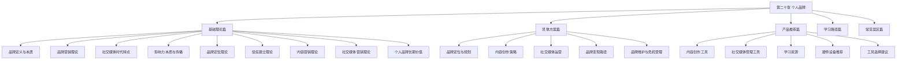
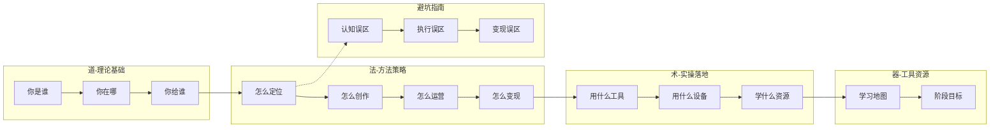
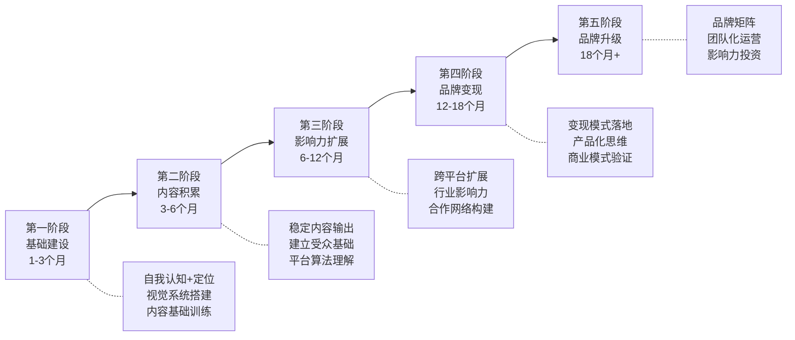
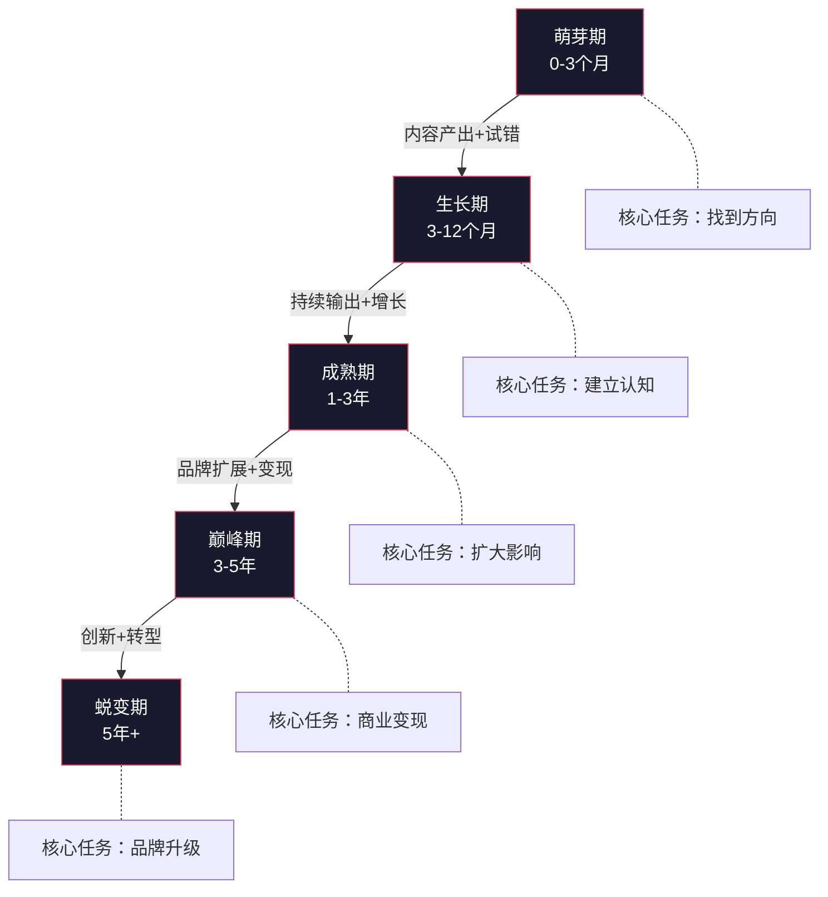
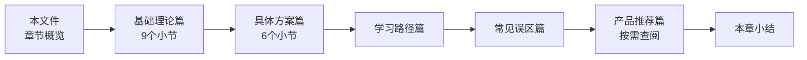

# 第二十章 个人品牌：让你的价值被看见

## 为什么你必须认真对待个人品牌

### 一个正在发生的现实

2023年，LinkedIn发布了一份名为《全球人才趋势》的报告，其中一个数据令人深思：**87%的招聘经理表示，候选人的个人品牌是影响录用决策的关键因素之一**。与此同时，麦肯锡的研究表明，在知识经济领域，拥有强个人品牌的从业者，其收入比同水平但无品牌意识的从业者平均高出 **20%-40%**。

这不是鸡汤，这是数据。

个人品牌的本质不是一个营销概念，而是一个经济学事实：在信息过载的时代，注意力是最稀缺的资源，而个人品牌是你获取、管理和转化注意力的系统方法。无论你是否主动管理它，你的个人品牌都在持续运作——你在社交媒体上的每一条动态、在会议上的一次发言、在项目中的每一个交付物，都在无声地构建他人对你的认知。

问题从来不是"要不要建立个人品牌"，而是"你要不要主动掌控它"。

### 个人品牌的底层逻辑

理解个人品牌，首先需要理解三个底层逻辑：

**第一，信任是稀缺品。** 在一个信息真假难辨的时代，信任成为最有价值的社会资本。爱德曼信任晴雨表（Edelman Trust Barometer）的数据显示，人们对机构的信任度持续走低，但对"像我一样的人"（people like me）的信任度却在上升。这意味着，个人品牌中的"人"比"品牌"更可信。当你建立起基于真实能力和持续输出的个人品牌时，你实际上在积累一种稀缺的社会资本。

**第二，杠杆效应。** 个人品牌是一种资产杠杆。一份内容可以触达成千上万人，一次信任建立可以反复复用。与出售时间换取收入不同，个人品牌能够实现"睡后收入"——你睡觉时，你的内容、你的口碑、你的影响力仍在为你工作。这就是为什么同样能力水平的两个人，收入可能相差10倍——差距不在于能力本身，而在于能力的可见度和可获取性。

**第三，复合增长。** 个人品牌的增长是复合式的。前期投入巨大但回报甚微，坚持到某个临界点后，增长会呈指数级爆发。凯文·凯利提出的"1000个铁杆粉丝"理论正是基于这个逻辑——你不需要成为全民网红，只需要1000个愿意持续为你付费的忠实受众，就能实现财务自由。

### 前互联网时代 vs 社交媒体时代

个人品牌不是新概念，但社交媒体彻底改变了它的游戏规则：

| 维度 | 前互联网时代 | 社交媒体时代 |
|------|------------|------------|
| 传播渠道 | 口碑、名片、线下活动 | 社交媒体、搜索引擎、内容平台 |
| 受众范围 | 熟人圈层（数百人） | 全球受众（数十万人） |
| 建设周期 | 数年到数十年 | 6个月到2年可见显著效果 |
| 内容形式 | 文字、演讲、出版物 | 图文、视频、音频、直播、互动 |
| 反馈机制 | 延迟且模糊 | 即时且精确（数据驱动） |
| 核心门槛 | 人脉、资历、机构背书 | 内容质量、持续输出、平台理解 |
| 竞争格局 | 地域化、圈层化 | 全球化、去中心化 |
| 失败成本 | 低（影响范围有限） | 高（负面内容可永久传播） |

社交媒体时代的核心变化是：**每个普通人都拥有了媒体权力**。一个县城教师可以通过抖音影响百万人，一个业余摄影师可以通过小红书接到商业合作，一个程序员可以通过技术博客成为行业意见领袖。这些在十年前几乎不可想象。

---

## 本章知识全景图

个人品牌建设是一门融合了传播学、营销学、心理学和实践技能的综合学科。本章按照 **"道 → 法 → 术 → 器 → 路径 → 避坑"** 的完整逻辑链展开，覆盖从理论认知到落地执行的每一个环节。

### 各篇章定位与关联

---

## 基础理论篇：你的品牌世界观

基础理论篇不是"可跳过"的背景知识，而是整章的地基。不理解理论就去操作，就像不懂物理学就去造桥——也许能站住，但你不知道什么时候会塌。

### 个人品牌的定义与本质

个人品牌是你在他人心中的"印象总和"——但这个定义只触及了表面。更深层的理解需要引入**"冰山模型"**：你能看到的（社交媒体内容、公开演讲、外在形象）只是冰山一角，真正支撑品牌的是水面下的部分（专业能力、价值观、个人经历、长期习惯）。

核心公式：

> **个人品牌价值 = 专业能力 × 影响力 × 信任度 × 独特性**

这是乘法关系，任何一项为零，整体归零。很多人只关注影响力（粉丝数），忽略了专业能力和信任度，结果是"有流量无转化"——粉丝多但没人买单。

### 品牌营销理论

这一节将企业品牌的核心理论迁移到个人品牌场景，包括：

- **大卫·艾克的品牌资产理论**：品牌认知度、品牌联想、感知质量、品牌忠诚度、专有资产——五个维度构成你的品牌资产评估框架
- **品牌故事理论**：起源故事、突破故事、使命故事、客户故事——四种故事类型让你的品牌有血有肉
- **SWOT分析**：个人品牌的自我诊断工具，每季度做一次
- **4P与4C营销理论**：从"我提供什么"到"受众需要什么"的视角转换

### 社交媒体时代的特点

注意力经济是理解社交媒体运营的底层框架。本节深入剖析：

- 注意力获取、保持、转化的三个层次
- 八大主流平台（微信公众号、小红书、抖音、B站、知乎、微博、LinkedIn、播客）的用户画像、算法机制、适用场景
- 平台选择策略：1个主平台+1-2个辅助平台的黄金组合
- "阶梯式推荐"算法的底层逻辑：初始流量池→扩大推荐→持续推荐

### 影响力的本质与传播

影响力不是自封的，而是他人赋予的。本节的核心框架：

> **影响力 = 触达范围 × 信任深度 × 行动转化率**

三个层次递进：认知层（让人知道你）→ 情感层（让人喜欢你）→ 行动层（让人跟随你）→ 忠诚层（让人推荐你）。

同时引入西奥迪尼的**影响力六原则**在个人品牌中的应用：互惠、承诺与一致性、社会认同、喜好、权威、稀缺。

### 品牌定位理论

定位不是"你做什么"，而是"在受众心中占据什么位置"。这一节将系统讲解：

- 艾·里斯和杰克·特劳特的经典定位理论
- 个人品牌的独特价值主张（UVP）提炼方法
- 定位公式：**你是谁 + 你为谁 + 你解决什么问题 + 你有何不同**
- 定位的常见陷阱：试图讨好所有人、定位过于宽泛、定位与能力不匹配

### 信任建立理论

信任是个人品牌的终极货币。本节覆盖：

- 信任的三个维度：能力信任、品格信任、情感信任
- 信任建立的"信任等式"：**信任 = (专业能力 × 可靠性 × 亲近感) / 自我导向**
- 信任建立的六个阶段：陌生→认识→熟悉→信任→依赖→倡导
- 信任危机的修复路径

### 内容营销理论

内容是品牌的载体。本节深入：

- 内容营销的核心逻辑：用有价值的内容吸引目标受众，而非打断式广告
- 内容金字塔模型：旗舰内容（少量）+ 常规内容（定期）+ 碎片内容（大量）
- 内容选题的"三圆交叉法"：你擅长的 × 受众需要的 × 市场空白的
- 内容生产的系统化方法论

### 社交媒体营销理论

从理论到算法，本节覆盖：

- 社交媒体运营的"AARRR"漏斗模型（获取→激活→留存→收入→推荐）
- 不同平台的算法深度解析
- 社交聆听与舆情管理的实操方法

### 个人品牌的长期价值

品牌不是一次性工程，而是终身资产。本节讨论：

- 个人品牌的复利效应与临界点理论
- 品牌资产的积累与衰减规律
- 不同人生阶段的品牌策略调整

---

## 具体方案篇：从0到1的完整路径

理论是地图，方案是导航。具体方案篇提供可执行的操作指南。

### 品牌定位与规划

这是所有行动的第一步，也是最容易被跳过的一步。本节提供完整的定位工作坊流程：

1. **自我审计**：用SWOT分析+个人商业画布梳理你的资源和能力
2. **受众画像**：用用户画像方法论锁定你的核心受众
3. **竞品分析**：研究同领域的成功品牌，找到差异化切入点
4. **定位声明**：用公式化模板输出你的品牌定位
5. **品牌视觉系统**：头像、色彩、字体、排版风格的统一设计
6. **品牌声音**：你说话的方式、用词习惯、语气风格

### 内容创作策略

内容是品牌的血液。本节覆盖：

- **选题系统**：如何持续产出高质量选题而不枯竭
- **内容框架**：不同类型内容（教程、观点、故事、数据）的写作模板
- **标题公式**：10种经过验证的高点击率标题结构
- **视觉设计**：非设计师也能做出高质量视觉内容的方法
- **内容日历**：如何规划一周/一月的内容发布节奏
- **爆款方法论**：什么样的内容更容易"出圈"

### 社交媒体运营

运营是从"创作"到"收获"的桥梁。本节覆盖：

- 账号搭建的完整流程（从注册到优化）
- 各平台的运营策略差异（不是一套模板打天下）
- 互动管理：评论回复、私信管理、社群运营
- 数据分析：如何阅读平台数据、优化内容策略
- 矩阵运营：如何用一份内容在多个平台分发

### 品牌变现路径

品牌建设的最终目标是创造价值（对你自己和他人）。本节覆盖：

- **知识付费**：课程、电子书、付费社群的创建与运营
- **咨询服务**：1对1咨询、企业顾问的定价与交付
- **商业合作**：品牌代言、内容合作的谈判与执行
- **产品销售**：如何用品牌驱动产品销售
- **投资与孵化**：个人品牌如何撬动更大的商业机会

### 品牌维护与危机管理

品牌建设如同修行，毁掉只需一瞬间。本节覆盖：

- 日常品牌维护的检查清单
- 负面评价的处理策略（什么时候回应、什么时候忽略、什么时候道歉）
- 危机管理的"黄金4小时"原则
- 危机恢复的品牌重建策略
- 真实案例分析：成功的危机管理 vs 失败的危机管理

---

## 产品推荐篇：用对工具，事半功倍

工欲善其事，必先利其器。本篇推荐经过实战验证的工具和资源：

- **内容创作工具**：写作、图片设计、视频剪辑、音频处理的精选工具
- **社交媒体管理工具**：多平台管理、数据追踪、自动化运营
- **学习资源**：书籍、课程、社区、案例库
- **硬件设备推荐**：相机、麦克风、灯光、直播设备
- **工具选择建议**：不同阶段、不同预算的工具组合方案

---

## 学习路径篇：分阶段的行动地图

建立个人品牌不是一蹴而就的事情。学习路径篇提供清晰的阶段性规划，让你知道每一步该做什么。

### 学习路径总览

每个阶段都有明确的目标、行动清单和里程碑指标，详见学习路径篇。

---

## 常见误区篇：避坑比学习更重要

很多人不是没有能力，而是在错误的方向上越走越远。常见误区篇揭示个人品牌建设中最常见的认知和执行陷阱，帮助你少走弯路。以下是一些预告：

| 误区 | 正确认知 |
|------|---------|
| 等到"准备好了"再开始 | 最好的开始时间是现在，边做边迭代 |
| 粉丝数 = 品牌价值 | 1000个铁杆粉丝 > 10万僵尸粉 |
| 人设越完美越好 | 真实和有缺陷反而更有吸引力 |
| 什么火做什么 | 专注垂直领域才能建立认知 |
| 模仿成功者就能成功 | 学习方法，不复制路径 |
| 品牌建设 = 自我营销 | 品牌的核心是创造价值，不是推销自己 |

更多误区与纠正方法，请阅读常见误区篇。

---

## 个人品牌的生命周期

理解品牌生命周期，有助于你在不同阶段做出正确决策，避免在错误的时间做正确的事。

**萌芽期**的核心是试错。不要追求完美，要快速验证你的定位和内容方向是否被受众接受。这个阶段的关键词是"快速迭代"——每周复盘，每月调整。

**生长期**的核心是积累。一旦找到有效的内容方向和平台，就要加倍投入，用高频、高质量的内容建立受众基础。这个阶段最大的敌人是"放弃"——绝大多数人在看到增长之前就放弃了。

**成熟期**的核心是系统化。内容生产要从"灵感驱动"转向"系统驱动"，建立内容日历、SOP、复用机制。同时开始构建合作网络，扩大影响力半径。

**巅峰期**的核心是变现。品牌资产足够大时，变现应该是自然的结果而非刻意追求。重点是建立多元化的收入来源，降低对单一渠道的依赖。

**蜕变期**的核心是升级。市场在变、受众在变、你自己也在变。成功的品牌需要不断进化，而不是停留在过去的辉煌中。要么自我革命，要么被时代淘汰。

---

## 谁需要这一章

本章适合以下人群，但侧重点各有不同：

**职场人士（侧重点：内部品牌+行业品牌）**
在企业内部，你的个人品牌决定了晋升速度和资源获取能力。在行业内，你的个人品牌决定了职业选择权和议价能力。本章教你如何在不"出名"的前提下，建立职场影响力。

**自由职业者和创业者（侧重点：获客品牌+信任品牌）**
客户选择你而不是竞争对手的核心原因，往往不是价格，而是信任。本章教你如何用个人品牌系统性地降低获客成本、提高转化率。

**专业人士（侧重点：专业品牌+思想领导力）**
医生、律师、工程师、设计师等专业人士，其个人品牌的核心是"专业可信度"。本章教你如何将专业知识转化为行业影响力。

**学生和职场新人（侧重点：起步品牌+差异化定位）**
没有丰富的经验并不意味着无法建立个人品牌。本章教你如何用学习过程本身建立品牌——记录成长、分享见解、展示潜力。

**对个人品牌感兴趣但不知从何开始的人（侧重点：全景认知+行动启动）**
如果你只是好奇，本章给你完整的知识框架。如果你准备行动，本章给你清晰的路线图。

---

## 如何阅读本章

本章内容系统而全面，根据不同目的有不同的最优阅读方式：

### 通读路线（推荐首次阅读）

按以下顺序阅读，建立完整的知识框架：

预计阅读时间：4-6小时。建议分2-3次完成。

### 实操路线（已了解理论，想直接行动）

1. 品牌定位与规划（具体方案篇第一节）
2. 学习路径篇（找到你当前所处的阶段）
3. 内容创作策略（具体方案篇第二节）
4. 社交媒体运营（具体方案篇第三节）
5. 回头补读基础理论中你不熟悉的部分

### 急用路线（需要立刻解决某个问题）

- 想定位自己？→ 品牌定位与规划
- 想提升内容？→ 内容创作策略
- 想涨粉？→ 社交媒体运营
- 想赚钱？→ 品牌变现路径
- 遇到危机？→ 品牌维护与危机管理
- 不知道用什么工具？→ 产品推荐篇

---

## 在开始之前：你的个人品牌自测

在正式进入本章内容之前，建议你花10分钟完成以下自测。这将帮助你明确自己的起点，也让后续的学习更有针对性。

**认知维度（每题1-5分，1=完全不了解，5=非常清楚）**

1. 你能用一句话说清楚自己是谁、为谁服务、提供什么价值吗？
2. 你知道你的目标受众在哪里活跃、他们关心什么问题吗？
3. 你知道你的领域里有哪些人在做个人品牌、他们做得怎么样吗？
4. 你能说出你的3个核心竞争优势吗？
5. 你有清晰的品牌视觉系统（头像、色彩、排版风格）吗？

**行动维度（每题1-5分，1=从未做过，5=一直在做）**

6. 你是否在固定平台持续输出内容（每周至少1次）？
7. 你是否系统地研究过至少1个平台的算法机制？
8. 你是否建立过内容日历或选题清单？
9. 你是否有过主动的品牌合作或变现尝试？
10. 你是否定期复盘自己的品牌数据（关注量、互动率、转化率）？

**评分说明：**

| 得分区间 | 你的阶段 | 建议重点 |
|---------|---------|---------|
| 10-20分 | 完全新手 | 重点阅读基础理论篇+学习路径篇 |
| 21-30分 | 起步阶段 | 重点阅读具体方案篇，尤其品牌定位 |
| 31-40分 | 成长阶段 | 重点阅读内容创作策略+社交媒体运营 |
| 41-50分 | 成熟阶段 | 重点阅读品牌变现+品牌维护 |

---

## 一个核心提醒

在进入本章之前，请记住一个最重要的原则：

> **个人品牌的本质不是"让别人觉得你很厉害"，而是"持续为他人创造真实价值"。**

一切技巧、策略、工具都服务于这个核心。如果你的内容和服务不能为他人创造价值，再精美的包装也只是泡沫。

有些人把个人品牌等同于"人设打造"——精心设计一个讨人喜欢的形象，然后努力维护它。这是一条危险的路。人设需要维护成本，而且迟早会被拆穿。真正可持续的个人品牌，是建立在真实能力和持续价值输出之上的。

管理学大师汤姆·彼得斯在1997年提出个人品牌概念时就说过：**"你最重要的项目就是你自己。"** 这句话在今天依然正确。

现在，让我们开始这段让你的价值被更多人看见的旅程。

***

