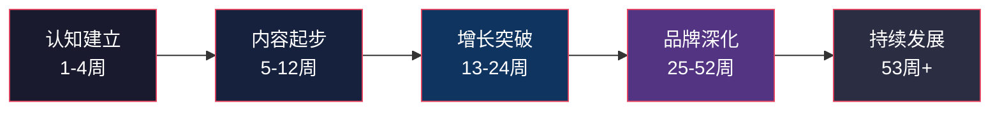
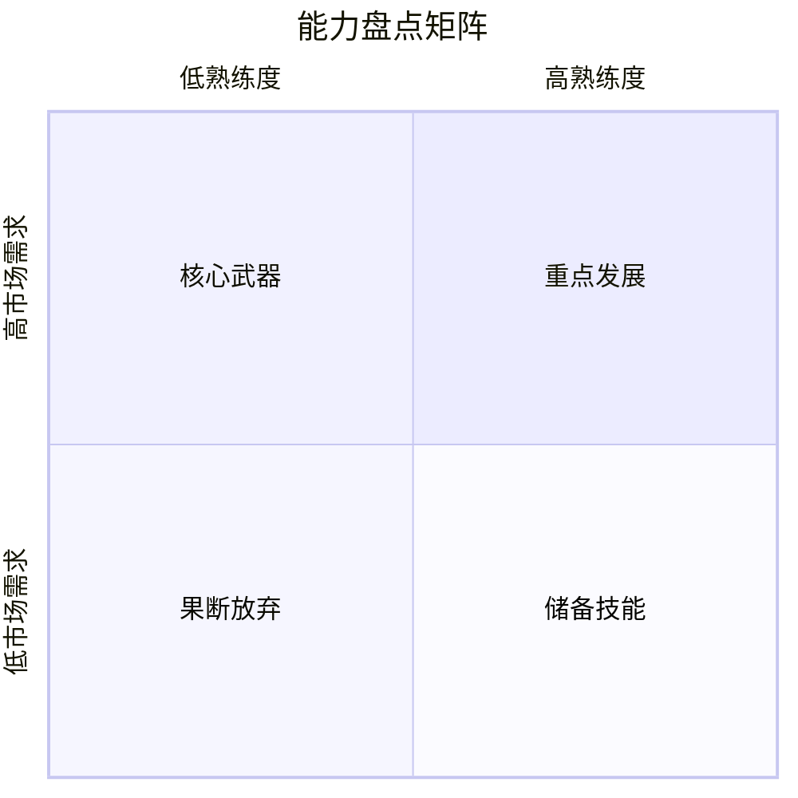
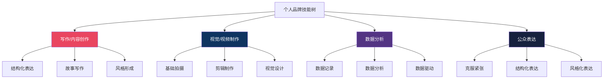

# 第二十章 个人品牌：学习路径

建立个人品牌不是灵感爆发式的一次性行为，而是一项需要系统规划、分阶段推进的长期工程。本节提供一套从零到成熟的完整学习路径，覆盖认知建立、内容起步、增长突破、品牌深化和持续发展五个阶段，并针对不同人群、不同技能给出差异化路线图。所有时间节点均为参考值，实际进度取决于你的可用时间和行业特性。

## 一、为什么需要学习路径

很多人在建立个人品牌时犯一个典型错误：看到别人做短视频火了就去拍视频，看到别人写公众号赚钱了就去写文章，东一榔头西一棒槌，半年过去什么都没沉淀下来。根本原因在于缺少一条清晰的路径——不知道自己在哪个阶段、该做什么、下一步去哪里。

学习路径解决三个核心问题：

| 问题 | 没有路径时 | 有路径时 |
|------|-----------|---------|
| 方向感 | 不知道该学什么，什么都想学 | 每个阶段有明确的学习重点 |
| 节奏感 | 时而疯狂输出时而完全停摆 | 匀速推进，形成可持续的习惯 |
| 成就感 | 看不到进步，容易放弃 | 阶段性成果清晰可见 |

学习路径本质上是一张「认知地图」——它不会替你走路，但能让你知道脚下的路通向哪里。

## 二、总体学习路径框架

### 2.1 第一阶段：认知建立期（第1-4周）

这个阶段的核心目标是「建立认知框架」。你不需要发任何内容，只需要搞清楚三件事：我是谁、受众是谁、我要提供什么价值。急于跳过这个阶段直接开始创作的人，往往在第三个月就会遇到严重的方向困惑。

#### 第1周：理论学习与品牌认知

**目标**：理解个人品牌的底层逻辑，建立正确的认知框架。

**学习内容**：

1. **个人品牌的本质定义**。个人品牌不是「包装」，不是「人设」，而是「你在别人心智中占据的独特位置」。品牌的核心是差异化——你和同领域的其他人有什么不同，为什么别人要关注你而不是别人。理解这一点，后面的所有动作才有锚点。

2. **品牌资产的构成要素**。一个完整的个人品牌由五个维度构成：专业能力（你能解决什么问题）、内容体系（你输出什么内容）、视觉识别（别人看到你的第一印象）、社交关系（你的网络和背书）、信任积累（别人为什么相信你）。这五个维度需要同步建设，但前期以专业能力和内容体系为重。

3. **平台生态认知**。不同平台的算法逻辑、用户画像、内容形式差异巨大。前期不要贪多，但需要了解各平台的基本特征：

   | 平台 | 内容形式 | 用户特征 | 算法逻辑 | 适合领域 |
   |------|---------|---------|---------|---------|
   | 微信公众号 | 长文 | 25-45岁，职场/商业 | 社交分发为主 | 深度观点、行业分析 |
   | 小红书 | 图文/短视频 | 18-35岁，女性为主 | 兴趣推荐 | 生活方式、视觉类 |
   | 抖音 | 短视频/直播 | 全年龄段 | 流量池赛马 | 娱乐、知识、带货 |
   | B站 | 中长视频 | 18-30岁，偏男性 | 推荐+搜索 | 知识、技术、二次元 |
   | 知乎 | 问答/文章 | 22-40岁，高学历 | 搜索+推荐 | 专业领域、深度分析 |
   | LinkedIn/脉脉 | 职业内容 | 职场人士 | 社交分发 | 职场、行业洞察 |

**实操方法**：

- 阅读《定位》（杰克·特劳特）或《影响力》（罗伯特·西奥迪尼），二选一即可，前者侧重品牌策略，后者侧重心理学原理。每天读30-50页，做笔记记录对个人品牌有启发的观点。
- 在目标平台上花30分钟「刷内容」——不是漫无目的地刷，而是带着分析的眼光去看：这个账号为什么火？它的定位是什么？内容有什么特点？记录10个你认为做得好的同领域账号。

#### 第2周：自我分析与能力盘点

**目标**：全面梳理自己的专业能力、独特经历、价值观和个性特点。

**能力盘点四象限法**：

把自己会的东西填入下面的四象限矩阵，横轴是「熟练程度」，纵轴是「市场需求」：

- **右上角（高熟练+高需求）**：这是你的核心武器，个人品牌应该围绕这些能力展开。
- **左上角（低熟练+高需求）**：这是你需要重点发展的方向，市场需求大但你还需提升。
- **右下角（高熟练+低需求）**：可以作为差异化特色，但不适合作为主要内容方向。
- **左下角（低熟练+低需求）**：果断放弃，不要在这上面浪费时间。

**具体操作步骤**：

1. **能力清单**：花30分钟写下你所有的技能、知识领域、工具使用能力，不要自我审查，先全部列出来。一个在互联网公司做运营的人，列出的清单可能包括：数据分析、Excel、SQL、用户增长、活动策划、文案写作、PS、项目管理、英语六级、大学时拿过辩论赛冠军……

2. **经历梳理**：列出你人生中的关键经历——职业经历、项目经验、学习经历、旅行经历、特殊体验。重点找那些「有故事可讲」的经历。辩论赛冠军就是一个好素材——它说明你有逻辑表达能力和感染力。

3. **价值观澄清**：问自己三个问题：我最关心什么议题？我认为什么事情是对的？我愿意为什么事情投入时间而不觉得浪费？这些问题的答案决定了你能否长期坚持某个方向。

4. **个性特点识别**：请3-5个了解你的朋友用三个词形容你。收集反馈后寻找共性。如果三个人都说你「理性」「话少」「靠谱」，那么做情感博主可能不太适合你，但做技术解析或数据分析类内容就是天然优势。

#### 第3周：市场调研与竞争分析

**目标**：了解目标领域的竞争格局，找到自己的差异化切入点。

**竞品分析五步法**：

1. **搜索关键词**：在目标平台搜索你想要做的领域关键词（比如「Python教程」「职场沟通」），记录排名前20的账号。

2. **分类整理**：把这些账号按内容形式（文字/视频/图文）、内容角度（理论/实操/案例）、人设风格（严肃/幽默/亲切）进行分类。

3. **分析头部账号**：选3-5个你认为做得最好的账号，深入分析：
   - 他们的定位语是什么（一句话说清自己是谁）
   - 他们的内容结构是什么样的
   - 他们如何与粉丝互动
   - 他们的变现模式是什么
   - 他们的弱点或不足是什么

4. **寻找空白地带**：在分析中特别注意「没有人做」或「做得不好」的方向。比如Python教程很多，但专门面向设计师的Python教程可能就是空白。职场沟通的内容很多，但专门面向程序员的沟通课可能就有机会。

5. **验证需求**：在知乎、小红书等平台搜索相关问题，看看有没有人在问但没有被很好回答的问题。这些问题就是你的内容机会。

**产出物**：一份竞品分析文档，包含至少10个竞品账号的分析、市场空白点的总结、以及3-5个可选的差异化定位方向。

#### 第4周：品牌定位与形象设计

**目标**：确定独特价值主张，设计品牌视觉形象，选择主运营平台。

**独特价值主张（UVP）公式**：

> 我帮助 [目标受众] 通过 [你的方法/能力] 实现 [他们想要的结果]

示例：
- "我帮助0-3年产品经理通过真实案例拆解，掌握从需求到上线的完整方法论"
- "我帮助职场新人通过结构化表达训练，在3个月内成为团队中最会汇报的人"

一个好的UVP需要满足三个条件：受众明确（不是「所有人」）、结果具体（不是「变得更好」）、有差异化（不是别人也在说的一样的话）。

**品牌形象设计清单**：

| 元素 | 要求 | 工具推荐 |
|------|------|---------|
| 头像 | 清晰、专业、辨识度高 | 证件照/职业照，或Canva设计的风格化头像 |
| 昵称 | 简短、好记、与定位相关 | 避免生僻字、过长的名称 |
| 简介 | 一句话说清你是谁、你能提供什么 | 参考UVP公式 |
| 封面图 | 统一风格，传递品牌调性 | Canva（免费模板丰富） |
| 内容模板 | 统一配色、字体、版式 | Canva/创客贴 |

**平台选择决策矩阵**：

根据你的内容形式偏好和目标受众，用下面的矩阵选择主平台：

| 你的情况 | 推荐主平台 | 原因 |
|---------|-----------|------|
| 善于写作，内容偏深度 | 微信公众号+知乎 | 长文阅读习惯成熟，搜索流量持久 |
| 善于表达，内容偏视觉 | 小红书+抖音 | 算法推荐公平，新人也有机会 |
| 技术/专业领域 | 知乎+B站 | 搜索流量大，用户愿意看长内容 |
| 职场/商业领域 | LinkedIn+公众号 | 职场人群集中，社交分发强 |
| 娱乐/生活方式 | 抖音+小红书 | 流量大，变现路径多 |

原则：先集中精力做好一个平台，等形成稳定的内容创作能力和一定的粉丝基础后（通常是3-6个月），再考虑扩展到第二个平台。

**阶段性成果清单**：
- [x] 完成能力盘点四象限图
- [x] 完成至少10个竞品账号的分析
- [x] 确定独特价值主张（UVP）
- [x] 设计完品牌形象（头像、封面、简介）
- [x] 选定主运营平台
- [x] 初步确定内容方向（3-5个内容支柱）

### 2.2 第二阶段：内容起步期（第5-12周）

这个阶段的核心目标是「跑通内容创作闭环」。从选题到创作到发布到复盘，你需要把整个流程跑通，形成可持续的内容生产系统。这个阶段不要追求爆款，要追求稳定。

#### 第5-6周：内容准备与技能学习

**内容选题库搭建**：

在开始创作之前，先搭建一个包含30-50个选题的选题库。这样每次创作时不用临时想写什么，直接从库里挑选。

选题来源的六个渠道：

1. **受众痛点**：在知乎、小红书、微博搜索目标受众常问的问题。比如做职场沟通方向，可以搜索「汇报工作」「向上管理」「跨部门协作」等关键词，把高赞问题记录下来。

2. **行业热点**：关注行业媒体、头部账号，追踪近期热点话题。热点不是让你蹭流量，而是给你提供「创作的契机」——同一个热点事件，你可以从自己的专业角度给出独特的解读。

3. **个人经验**：你踩过的坑、总结出的方法、验证过的工具，这些都是独一无二的内容素材。别人写理论可以搜到，但你的真实经历只有你能写。

4. **书籍/课程拆解**：读完一本专业书或上完一门课后，用自己的理解和实践去拆解其中的核心观点。这既是学习也是创作。

5. **竞品分析**：看同领域账号的热门内容，思考「如果是我来写，我会怎么写得更好或角度不同」。

6. **受众反馈**：当你开始发布内容后，受众的评论、私信、提问都是最直接的选题来源。

**内容创作基础技能速成**：

这个阶段不需要你成为写作大师或剪辑高手，只需要掌握「够用」的基础技能：

- **文字内容**：学会使用结构化框架组织内容。最实用的框架是「总-分-总」：开头用一两句话说清这篇文章要解决什么问题，中间分点展开论述，结尾总结核心要点。初学者先不要追求文采，先追求「把事情说清楚」。

- **图文内容**：学会使用Canva或创客贴制作封面图和内容配图。掌握基本的排版原则：对齐、对比、重复、亲密性。每篇图文至少配3张相关图片。

- **短视频内容**：学会使用剪映进行基础剪辑。掌握三个核心技能：画面裁剪（去掉多余的片段）、添加字幕（让信息传达更准确）、添加背景音乐（提升观看体验）。第一周的视频不需要花哨的转场和特效，干净清晰就够了。

#### 第7-8周：首发测试与反馈收集

**第一批内容发布策略**：

第一批内容（5-10篇）的核心目的不是获取流量，而是「测试」——测试你的定位是否准确、内容形式是否合适、受众反馈如何。

发布策略：

1. **覆盖不同内容类型**：5-10篇内容尽量覆盖2-3种不同的内容类型。比如做职场方向，可以分别写一篇干货教程、一篇个人故事、一篇行业分析，看看哪种类型反馈最好。

2. **控制变量**：尽量让每次发布的时间、平台、封面风格保持一致，只改变内容类型，这样才能准确判断哪种内容更受欢迎。

3. **主动分发**：前几篇内容的自然流量一定很低，不要因此焦虑。把内容分享到相关的社群、朋友圈、同事群，获取初始的阅读和互动数据。

4. **设置数据记录表**：

   | 发布日期 | 平台 | 标题 | 内容类型 | 阅读量 | 点赞数 | 评论数 | 收藏数 | 转发数 | 备注 |
   |---------|------|------|---------|--------|--------|--------|--------|--------|------|
   | 示例 | 小红书 | xxx | 干货教程 | 500 | 30 | 8 | 25 | 5 | 封面需优化 |

**反馈分析框架**：

每次发布后24小时和72小时分别记录一次数据。重点分析：

- **哪些内容数据好？** 好在哪里？是阅读量高还是互动率高？阅读量高说明标题/封面吸引人，互动率高说明内容引发共鸣。
- **哪些内容数据差？** 差在哪里？是没人点开（标题/封面问题）还是点开就划走（内容质量问题）还是看完不互动（内容没有引发行动欲望）？
- **受众的评论说了什么？** 评论区是最宝贵的反馈来源。如果有人问「能不能详细讲讲XXX」，这就是下一期的选题。

#### 第9-10周：内容优化与迭代

基于前两周的数据反馈，开始有针对性地优化。

**标题优化**：

标题决定了内容的「打开率」。一个好的标题需要满足以下条件中的至少两个：

| 标题技巧 | 示例 | 适用场景 |
|---------|------|---------|
| 数字具象化 | "月薪3千到3万，我用了这5个方法" | 经验分享、方法论 |
| 痛点直击 | "为什么你做的PPT总是很丑？" | 教程、解决方案 |
| 身份标签 | "10年产品经理告诉你，需求文档到底怎么写" | 专业观点 |
| 反常识 | "每天读书2小时，是我做过最蠢的事" | 观点类、故事类 |
| 结果承诺 | "用这个框架写周报，领导追着给你加薪" | 干货教程 |

**封面优化**：

封面决定了内容的「点击率」。不同平台对封面的要求不同：

- **小红书**：封面要信息量大，通常需要在封面上放标题文字，配色要醒目。
- **抖音**：封面要有人物或动作，纯文字封面效果差。
- **B站**：封面风格化强，可以夸张一些，表情包风格也有市场。
- **公众号**：封面图影响转发时的展示效果，要简洁清晰。

**内容结构优化**：

无论什么形式的内容，都可以用「钩子-主体-行动号召」的三段式结构：

1. **钩子（前5秒/前2行）**：抓住注意力。可以用提问、数据、反常识的观点、故事的悬念。
2. **主体**：提供核心价值。每讲完一个要点，用小结句过渡，让读者跟上你的逻辑。
3. **行动号召（CTA）**：告诉受众看完之后可以做什么。可以是「收藏这篇，下次遇到问题翻出来看」，也可以是「评论区告诉我你的经历」。

#### 第11-12周：习惯固化与频率稳定

**建立稳定的内容发布频率**：

到这个阶段，你应该已经找到了适合自己的内容类型和创作流程。现在要做的是把它固化为习惯。

推荐的发布频率起点：

| 平台 | 建议起步频率 | 稳定期频率 |
|------|------------|-----------|
| 微信公众号 | 每周1篇 | 每周2-3篇 |
| 小红书 | 每周3-4篇 | 每天1篇 |
| 抖音 | 每周3-4条 | 每天1-2条 |
| B站 | 每周1-2条 | 每周2-3条 |
| 知乎 | 每周2-3篇 | 每天1篇 |

**内容日历模板**：

制作一个每周内容日历，提前规划好每天的创作任务：

| 星期 | 上午 | 下午 | 晚上 |
|------|------|------|------|
| 一 | 选题+大纲 | 写初稿 | — |
| 二 | 修改初稿 | 制作配图/剪辑 | — |
| 三 | 发布+互动 | 数据记录 | — |
| 四 | 选题+大纲 | 写初稿 | — |
| 五 | 修改初稿 | 发布+互动 | — |
| 六 | 深度内容创作 | — | — |
| 日 | 本周复盘 | 下周规划 | — |

**阶段性成果清单**：
- [x] 发布20-30篇内容
- [x] 积累100-500个粉丝
- [x] 建立内容创作SOP（标准操作流程）
- [x] 形成稳定的发布频率
- [x] 搭建选题库（至少20个备选选题）
- [x] 建立数据记录和分析习惯

### 2.3 第三阶段：增长突破期（第13-24周）

这个阶段的核心目标是「找到增长杠杆并放大」。经过前12周的积累，你应该已经有了足够的数据来判断什么有效、什么无效。现在要做的是把有效的东西做到极致。

#### 第13-16周：内容质量跃升

**从「能用」到「好用」的内容升级**：

前12周的内容可能只是「及格」水平，这个阶段要追求「良好」甚至「优秀」。升级的方向包括：

1. **深度升级**：不再只写「是什么」，开始写「为什么」和「怎么做」。比如之前写「5个提高效率的App」，现在要写「为什么这5个App能提高效率——从认知科学角度解释工具如何减少决策疲劳」。

2. **原创性升级**：减少搬运和转述，增加自己的独立观点和原创方法论。你可以参考别人的内容作为输入，但输出必须有自己的独特角度。

3. **形式升级**：尝试更复杂的内容形式。文字内容可以加入信息图、流程图；视频内容可以加入动画演示、数据可视化。

4. **故事性升级**：在干货内容中融入故事元素。人脑天生对故事敏感——同样的知识点，用「我亲身经历的一个案例」来开头，比「根据研究数据显示」开头的阅读完成率高30%-50%。

**爆款内容创作方法论**：

爆款不可复制，但爆款的底层规律可以学习。分析100个爆款内容后，可以总结出以下共性：

| 要素 | 说明 | 操作方法 |
|------|------|---------|
| 情绪共鸣 | 内容触发了受众的某种强烈情绪 | 从受众的焦虑、渴望、愤怒、感动入手 |
| 社交货币 | 转发这条内容能让转发者显得有见识/有趣/有品味 | 让内容成为「社交谈资」 |
| 实用价值 | 内容可以直接指导行动 | 提供具体的方法、工具、模板 |
| 话题性 | 内容涉及有争议或有讨论空间的话题 | 提出一个有立场的观点，引发讨论 |
| 时机 | 内容与当前热点或节日相关 | 建立热点响应机制，提前准备节日内容 |

#### 第17-20周：运营能力提升

**社交媒体运营进阶**：

1. **发布时间优化**：不同平台和不同受众群体的活跃时间不同。通过测试找到你的最佳发布时间段。一般规律：
   - 工作日早上7:30-8:30（通勤时间）
   - 中午12:00-13:00（午休时间）
   - 晚上20:00-22:00（下班后）
   - 周末全天流量较均匀

2. **互动策略**：不要只回复评论，要主动「制造互动」。方法包括：
   - 在内容结尾设置开放式问题
   - 发起投票或选择题
   - 在评论区「自问自答」引导讨论
   - 回复每一条评论（前1000个粉丝阶段尤其重要）

3. **社群运营**：当粉丝达到一定量级（500-1000）时，建立核心粉丝群。社群的作用不是「管理粉丝」，而是「建立深度连接」——群里的高频互动者会成为你最忠实的传播者。

4. **跨平台分发**：同一篇内容根据平台特性进行改编后发布到多个平台。一篇深度文章可以拆解为：公众号长文版 + 知乎回答版 + 小红书图文版 + 抖音口播版。注意：不是简单复制粘贴，而是根据平台特性重新包装。

#### 第21-24周：合作与破圈

**建立创作者关系网络**：

一个人做个人品牌是孤独的，而且效率有限。建立创作者关系网络可以实现资源互换和互相赋能。

1. **找到同量级的创作者**：不要一上来就去找大V合作，找和你粉丝量差不多、领域相关但不完全重叠的创作者。比如你做Python教学，可以找做数据分析、做AI入门的创作者。

2. **合作形式**：
   - 互相推荐（在各自内容中提及对方）
   - 联合创作（一起做一期内容或一次直播）
   - 互换资源（分享各自的选题、素材、工具）
   - 互相审稿（给对方的内容提反馈意见）

3. **参与平台活动**：关注平台官方的创作活动、话题挑战、创作者激励计划。参与这些活动能获得额外的流量曝光。

4. **线下连接**：参加行业会议、线下沙龙、创作者聚会。线下的深度连接远比线上的点赞互动有效。

**阶段性成果清单**：
- [x] 粉丝达到1000-5000
- [x] 内容互动率稳定在行业平均水平以上
- [x] 建立至少5个创作者合作关系
- [x] 形成个人辨识度的内容风格
- [x] 至少产出1-2篇「小爆款」（数据远超日常水平的内容）

### 2.4 第四阶段：品牌深化期（第25-52周）

这个阶段的核心目标是「从内容创作者升级为品牌」。内容创作者靠内容吸引关注，品牌靠信任和影响力获得溢价。这个阶段需要在内容深度、品牌故事、影响力半径和商业模式四个维度同时发力。

#### 第25-32周：品牌深度构建

**从「内容账号」到「品牌」的跃迁**：

一个账号和一个品牌之间的区别在于：账号是「你发内容别人看」，品牌是「别人主动来找你」。实现这个跃迁需要三个要素：

1. **品牌故事**：你为什么做这件事？你的使命是什么？一个好的品牌故事不是简历式的经历堆砌，而是一个有起承转合的叙事——你遇到了什么问题、经历了什么挣扎、得出了什么结论、现在要帮助谁解决同样的问题。

2. **方法论沉淀**：把你零散的经验和知识体系化，形成一套可以命名的方法论。比如「三步汇报法」「五维沟通模型」。方法论的价值在于：它让你的内容从「信息」升级为「知识体系」，别人提起这个方法论就会想到你。

3. **品牌文化**：为你的受众群体建立一种文化认同。比如你的品牌倡导「理性思考」，那么你的受众会以「理性」为荣，他们会在评论区说「关注你就是因为这里没有情绪化的内容」。这种文化认同是最强的品牌护城河。

#### 第33-40周：影响力半径拓展

**多平台矩阵运营**：

到这个阶段，你的主平台应该已经有了稳定的流量和粉丝基础。现在是扩展到第二个甚至第三个平台的时机。

多平台运营的核心原则：

- **一鱼多吃**：同一主题的内容根据平台特性重新包装，而不是每个平台从零创作
- **平台特性适配**：公众号适合深度长文，小红书适合图文卡片，抖音适合口播+画面，B站适合教程类视频
- **流量互导**：在不同平台之间建立流量通道，比如在抖音简介放公众号链接，在公众号放社群二维码

**行业影响力构建**：

1. **输出行业观点**：不只是分享方法和技巧，开始对行业趋势、热点事件发表独立观点。观点类内容传播性最强，也最能建立影响力。

2. **受邀分享**：主动向行业活动、播客、直播发出分享邀约，或者在你的内容中展示你的专业度，让邀约主动找上门。

3. **媒体曝光**：当你的影响力达到一定程度，行业媒体、自媒体会来找你做采访或引用你的观点。这时候要积极回应，每一次曝光都是品牌资产的积累。

#### 第41-48周：变现路径探索

**个人品牌的六种变现模式**：

| 变现模式 | 门槛 | 收入上限 | 适合阶段 | 说明 |
|---------|------|---------|---------|------|
| 广告合作 | 粉丝1000+ | 中 | 起步期 | 品牌投放软文/视频 |
| 知识付费 | 专业度+粉丝5000+ | 中高 | 增长期 | 课程、训练营、付费社群 |
| 咨询服务 | 专业度 | 高 | 深化期 | 一对一或一对多咨询 |
| 自有产品 | 运营能力 | 很高 | 成熟期 | 实体/数字产品 |
| 代运营/培训 | 行业影响力 | 高 | 成熟期 | 帮助他人建立品牌 |
| 投资/合伙 | 综合资源 | 极高 | 顶级 | 用影响力换取股权或分红 |

**变现实验方法**：

不要等到「准备好了」再开始变现，而是用「最小可行产品」的方式尽早测试：

1. **第一步**：在现有内容中加入一个简单的变现入口。比如在公众号文章底部放一个「一对一咨询」的链接，定价99元/30分钟。如果有人付费，说明你的内容已经建立了足够的信任。

2. **第二步**：根据付费用户的反馈优化你的产品/服务。他们最常问什么问题？他们的核心需求是什么？这些信息比你自己拍脑袋想的要准确得多。

3. **第三步**：逐步提升产品定价和规模。从一对一咨询升级为小班训练营，从免费社群升级为付费星球。

#### 第49-52周：年度复盘与规划

**年度复盘框架**：

用以下框架进行系统复盘：

1. **数据复盘**：整理全年的关键数据——粉丝增长曲线、内容发布数量、爆款内容列表、变现收入等。数据是最客观的成绩单。

2. **内容复盘**：回顾全年发布的内容，分类统计哪些类型的数据最好、哪些最差。分析原因，为下一年的内容策略提供依据。

3. **关系复盘**：盘点这一年的合作关系、行业人脉、核心粉丝群体。哪些关系需要维护？哪些需要断开？

4. **能力复盘**：这一年你的哪些能力提升了？哪些能力还需要补强？写下来年的学习计划。

5. **战略复盘**：你的品牌定位是否需要调整？你的目标受众是否发生了变化？你所在的行业趋势如何？基于这些判断制定下一年的品牌战略。

**阶段性成果清单**：
- [x] 粉丝达到5000-20000
- [x] 建立稳定的行业影响力
- [x] 找到至少1条适合的变现路径并产生收入
- [x] 形成成熟的运营体系（内容生产+分发+互动+变现）
- [x] 完成品牌故事和方法论的体系化
- [x] 完成年度复盘和来年规划

### 2.5 第五阶段：品牌成熟期（第53周以后）

这个阶段没有明确的终点，因为个人品牌的维护是一个终身工程。核心目标是「持续创造价值，保持品牌活力」。

**长期可持续发展的四个支柱**：

1. **内容创新**：不要陷入「重复自己」的陷阱。定期尝试新的内容形式、新的角度、新的互动方式。每隔6个月做一次内容创新实验——可以是一个新的栏目、一种新的内容格式、一个全新的平台。

2. **能力持续升级**：个人品牌的天花板取决于你个人能力的天花板。持续学习、持续实践、持续输出，保持你在领域内的专业领先度。

3. **关系网络维护**：定期更新你的创作者关系网络和行业人脉。人脉不是加了微信就完了，需要持续的互动和价值交换。

4. **品牌危机预防**：影响力越大，被攻击的风险也越高。建立品牌危机应对预案——遇到负面评论怎么处理、遇到误解怎么澄清、遇到恶意攻击怎么应对。具体方法参见本章「常见误区」相关章节。

## 三、不同人群的差异化路径

每个人的起点不同、可用时间不同、目标不同，因此需要根据自身情况调整学习路径。以下是四种典型人群的差异化路线。

### 3.1 职场人士路径

**核心挑战**：时间有限（工作日精力被工作消耗），需要在「做好本职工作」和「建设个人品牌」之间找到平衡。

**策略要点**：
- **时间利用**：工作日利用早起（30分钟）和午休（30分钟）完成碎片化任务——选题、素材收集、简单互动。周末集中2-3小时完成深度创作。
- **内容杠杆**：把工作中的思考和总结转化为内容。你在工作中写的复盘文档、做的方法论总结，稍微包装一下就是优质内容。这样「工作即创作」，不需要额外花太多时间。
- **平台选择**：优先选择LinkedIn/脉脉（职场社交）和公众号（深度内容），这两个平台的用户画像和职场人士的目标受众高度重合。

**里程碑时间表**：

| 时间点 | 目标 | 关键动作 |
|--------|------|---------|
| 第1个月 | 完成定位和形象设计 | 能力盘点、竞品分析、UVP确定 |
| 第3个月 | 发布20篇内容 | 建立每周2篇的发布节奏 |
| 第6个月 | 粉丝达到1000 | 优化内容质量，开始获得行业关注 |
| 第9个月 | 粉丝达到3000 | 建立创作者合作关系 |
| 第12个月 | 粉丝达到5000+ | 开始获得合作邀约和变现机会 |

**风险提示**：注意公司政策对员工对外发声的规定。有些公司不允许员工以个人身份发表与公司业务相关的内容。在开始之前了解清楚公司的相关规定，避免不必要的麻烦。

### 3.2 自由职业者路径

**核心挑战**：收入不稳定导致心态波动，容易在「做内容」和「找客户」之间焦虑摇摆。

**策略要点**：
- **内容即获客**：把个人品牌建设直接和获客挂钩。每篇内容都是一个「销售员」——它在你睡觉的时候也在帮你展示专业能力。所以内容创作不是「额外的事」，而是「业务的核心」。
- **案例驱动**：每完成一个客户项目，就写一篇案例复盘。案例内容是最有说服力的「广告」——它同时展示了你的专业能力、工作方法和实际成果。
- **信任链建设**：自由职业者最稀缺的资源是信任。通过内容建立信任的方式是：免费分享80%的知识，用剩下的20%变现。不要怕「教会徒弟饿死师傅」——你免费分享的越多，找你付费的人越多。

**里程碑时间表**：

| 时间点 | 目标 | 关键动作 |
|--------|------|---------|
| 第1个月 | 完成定位，搭建作品集 | 能力盘点、案例整理、品牌设计 |
| 第3个月 | 通过内容获得第一单 | 发布10篇以上案例/干货内容 |
| 第6个月 | 内容获客占比30% | 优化内容转化路径 |
| 第12个月 | 内容获客占比60%+ | 建立稳定的内容获客渠道 |

### 3.3 创业者路径

**核心挑战**：需要同时管理公司运营和个人品牌，时间和精力极度紧张。

**策略要点**：
- **创始人IP化**：把创始人个人品牌和公司品牌绑定。用户更容易对「一个人」产生信任感，而不是对「一个公司」。雷军之于小米、马斯克之于特斯拉，都是创始人IP化的典型案例。
- **故事为王**：创业者最稀缺的内容素材是「真实故事」——创业过程中的决策、失败、转折、突破。这些故事比任何干货都更能打动人心。
- **效率优先**：创业者的时间极度宝贵，需要用最高效率的方式创作内容。推荐的方式是：日常用语音记录想法和故事（录音转文字工具：讯飞听见、飞书妙记），周末集中整理成文章或视频脚本。

**里程碑时间表**：

| 时间点 | 目标 | 关键动作 |
|--------|------|---------|
| 第1个月 | 建立创始人形象 | 创业故事、产品理念内容发布 |
| 第3个月 | 通过内容获得种子用户 | 产品相关干货+创业故事持续输出 |
| 第6个月 | 粉丝达到2000+ | 开始建立创业者社群 |
| 第12个月 | 创始人影响力形成 | 内容成为公司增长的重要渠道 |

### 3.4 学生路径

**核心挑战**：没有行业积累和社会经验，不确定自己的定位方向。

**策略要点**：
- **学习过程即内容**：你在学习新知识的过程中记录的心得、踩的坑、总结的方法，本身就是有价值的内容。「学习笔记」类内容的目标受众非常庞大——每一个和你在学同样东西的人都是潜在粉丝。
- **不要等到「准备好了」**：学生最常犯的错误是「等我学够了再开始分享」。事实上，你作为「正在学习的人」分享的内容，往往比专家的内容更能引起共鸣——因为你的受众也在学习，他们遇到的问题你刚好也遇到了。
- **作品集思维**：把你在平台上发布的每一篇内容都当作「作品集」的一件作品。当你求职时，一个持续更新了半年的专业内容账号，比简历上写的「学习能力强」有说服力得多。

**里程碑时间表**：

| 时间点 | 目标 | 关键动作 |
|--------|------|---------|
| 第1个月 | 找到定位方向 | 测试2-3个方向，看哪个反馈最好 |
| 第3个月 | 发布15篇以上内容 | 建立稳定的创作习惯 |
| 第6个月 | 粉丝达到500+ | 积累作品集和行业认知 |
| 第12个月 | 初步个人品牌形成 | 求职时成为差异化竞争优势 |

### 3.5 人群路径对比总结

| 维度 | 职场人士 | 自由职业者 | 创业者 | 学生 |
|------|---------|-----------|--------|------|
| 每日投入时间 | 30-60分钟 | 1-2小时 | 30-60分钟 | 1-2小时 |
| 内容重心 | 行业洞察+方法论 | 案例+方法论 | 创业故事+产品理念 | 学习笔记+成长记录 |
| 变现时机 | 6-12个月 | 3-6个月 | 与业务同步 | 不急于变现 |
| 核心平台 | LinkedIn/公众号 | 公众号/知乎 | 公众号/抖音/视频号 | B站/小红书/知乎 |
| 最大风险 | 公司政策限制 | 心态焦虑 | 分散精力 | 方向频繁变动 |

## 四、核心技能学习路径

个人品牌建设需要四项核心技能：写作/内容创作、视觉/视频制作、数据分析、公众表达。以下分别给出从入门到精通的学习路线。

### 4.1 写作能力提升路径

写作是个人品牌建设的基础能力——无论你做视频、图文还是音频，底层都是「把观点结构化地表达清楚」的能力。

#### 第1-4周：基础写作能力

**目标**：能做到「把一件事说清楚」。

**核心训练**：

1. **结构化表达训练**。掌握三种基础写作框架：
   - **总-分-总**：先说结论，再展开论述，最后总结。适用于大多数干货内容。
   - **SCQA（情境-冲突-问题-答案）**：先描述一个情境，再指出其中的冲突/问题，最后给出解决方案。适用于问题解决类内容。
   - **时间线**：按照时间顺序叙述事件的发展过程。适用于故事类、复盘类内容。

2. **每日写作练习**。每天写300-500字，题材不限。可以是工作复盘、读书笔记、生活观察。重点不是写得好，而是「写得出来」。写作能力的提升没有捷径，只有量变到质变。

3. **拆解优秀文章**。每天精读1篇同领域的优秀文章，分析它的结构、标题、开头、论证方式、结尾。用不同颜色标注：标题用了什么技巧、开头用了什么方法、每个段落的功能是什么。

**推荐资源**：
- 《金字塔原理》（芭芭拉·明托）——结构化思维和表达的经典教材
- 《写作是最好的自我投资》（Spenser）——面向新媒体写作者的实操指南

#### 第5-12周：进阶写作技巧

**目标**：能做到「把一件事说得有吸引力」。

**核心训练**：

1. **标题创作**。标题决定了80%的内容命运。每天练习写10个标题，然后从中选最好的一个。参考前文「标题优化」部分的技巧表格。

2. **开头写作**。用「钩子」抓住读者注意力。四种有效的开头方式：
   - 提问式："你有没有遇到过这种情况——明明准备得很充分，汇报的时候脑子一片空白？"
   - 数据式："90%的职场新人在第一次述职时会犯这三个错误。"
   - 故事式："上周我参加了一个行业大会，台上那位嘉宾说了一句话，让我想了很久。"
   - 反常识式："每天读书2小时是我做过最没效率的事。"

3. **故事写作**。学会用故事包裹干货。一个完整的故事弧线：角色→遭遇困境→尝试解决→获得结果→提炼启示。每周练习写一个300-500字的微型故事。

**推荐资源**：
- 《爆款文案》（关健明）——面向营销文案的实战技巧
- 《故事》（罗伯特·麦基）——故事创作的底层逻辑

#### 第13-24周：风格形成

**目标**：形成自己独特的写作风格。

**核心训练**：

1. **风格实验**。在前12周尝试了不同框架和技巧后，这个阶段要开始「做减法」——保留最适合自己的表达方式，去掉不适合的。

2. **效率提升**。建立自己的写作SOP：选题→大纲→初稿→修改→配图→发布。把每一步的时间压缩到合理范围。一个成熟的写作者，一篇2000字的文章从选题到发布控制在2-3小时。

3. **读者意识训练**。每写完一段，停下来问自己：「如果我是读者，看到这里我会想继续看下去吗？我会觉得有用吗？我会转发吗？」培养这种「读者视角」是写作能力质变的关键。

### 4.2 视频制作能力提升路径

视频是当下流量最大的内容形式。即使你主要做文字内容，学会基础的视频制作也能大幅扩展你的影响力半径。

#### 第1-4周：基础拍摄

**目标**：能用手机拍出「能看」的视频。

**核心训练**：

1. **设备准备**。你不需要专业相机，一部智能手机就够了。但需要：
   - 手机支架/三脚架（30-80元，稳定画面）
   - 领夹麦克风（50-150元，提升音质，音质比画质更重要）
   - 环形补光灯（50-100元，改善光线）

2. **构图基础**。掌握三种最常用的构图方式：
   - **三分法**：把画面分成3×3的九宫格，把主体放在交叉点上。
   - **居中构图**：适合口播类视频，人物居中。
   - **引导线构图**：利用线条引导观众视线到主体。

3. **光线运用**。最好的光源是自然光——面朝窗户拍摄，光线均匀柔和。避免背光（脸会黑）和顶光（会有阴影）。室内拍摄如果光线不足，用环形灯补光。

4. **每天练习**：用手机拍1分钟的自我介绍视频，回看并找出问题。第一周的目标是克服「镜头恐惧」。

#### 第5-12周：剪辑入门

**目标**：能独立完成一条3-5分钟的短视频制作。

**核心训练**：

1. **剪映基础操作**。掌握以下功能就够用了：
   - 素材导入和时间线编辑
   - 分割和删除多余片段
   - 添加字幕（自动识别+手动校准）
   - 添加背景音乐和音效
   - 添加转场效果
   - 导出设置

2. **剪辑节奏**。好的视频需要有节奏感——不是匀速播放所有内容，而是有快有慢。重点内容放慢、重复、强调；过渡性内容快速带过。学会用「J-cut」（声音先于画面出现）和「L-cut」（画面先于声音切换）让转场更自然。

3. **每周产出1-2条视频**。不要追求完美，先完成再完善。

**推荐资源**：
- 剪映官方教程（B站/抖音搜索「剪映教程」）
- B站搜索「视频剪辑入门」，免费教程足够初学者使用

#### 第13-24周：进阶视频技巧

**目标**：能制作有个人风格的视频内容。

**核心训练**：

1. **画面设计**。学习使用文字动画、数据可视化、图表动画等元素提升视频的信息密度和观赏性。

2. **声音设计**。不只是「说话+背景音乐」，学习使用音效（转场音效、强调音效）、环境音、多轨混音来增强视频的沉浸感。

3. **风格探索**。尝试不同的视频风格——口播、Vlog、教程、动画解说、情景剧——找到最适合你的定位和个性的形式。

### 4.3 数据分析能力提升路径

数据是内容优化的指南针。不看数据的内容创作就像闭着眼睛开车——也许能走一段直线，但迟早会偏。

#### 第1-4周：建立数据意识

**目标**：理解各平台的核心数据指标。

**各平台关键指标**：

| 指标 | 含义 | 优化方向 |
|------|------|---------|
| 曝光量/展现量 | 内容被多少人看到 | 标签精准度、发布时间 |
| 点击率 | 看到的人中有多少点开了 | 标题、封面 |
| 完播率/阅读完成率 | 点开的人中有多少看完了 | 内容质量、结构、节奏 |
| 互动率 | 看完的人中有多少互动了 | 内容共鸣度、行动号召 |
| 涨粉率 | 看完的人中有多少关注了 | 个人品牌力、内容价值感 |

**实操**：建一个Excel或Notion表格，每周记录每个平台每个内容的核心数据。

#### 第5-12周：数据分析方法

**目标**：能从数据中发现问题和机会。

**核心分析方法**：

1. **对比分析**：把数据好的内容和数据差的内容放在一起对比，找出差异。是选题不同？标题不同？发布时间不同？还是内容结构不同？

2. **趋势分析**：把数据按时间排列，观察趋势。粉丝是持续增长还是波动？互动率是上升还是下降？找到趋势背后的原因。

3. **归因分析**：每次数据出现异常波动（突然涨粉或掉粉），都要找到原因。是因为发了某篇特别好的内容？还是被某个大V推荐了？还是被限流了？

#### 第13-24周：数据驱动优化

**目标**：用数据指导所有内容决策。

**A/B测试方法**：

- 同一个选题用两种不同的标题，分别发布在不同时间，对比点击率
- 同一个主题用图文和视频两种形式发布，对比数据表现
- 不同的发布时间进行测试，找到最佳发布时段

每次只改变一个变量，其他条件保持不变，这样才能准确判断是什么因素导致了数据差异。

### 4.4 公众表达能力提升路径

公众表达包括线上直播、线下演讲、播客录制等场景。这个技能往往被忽视，但它对个人品牌的放大效应非常显著——一次成功的演讲或直播带来的人脉和影响力，可能超过你写100篇文章。

#### 第1-4周：克服紧张

**核心训练**：

1. **对镜练习**：每天对着镜子说3分钟，主题不限。观察自己的表情、手势、语速。
2. **录音回听**：用手机录下自己的一段话，回听并找出口头禅（「嗯」「那个」「就是说」）和语速问题。
3. **小范围试讲**：在朋友或家人面前讲5分钟，收集反馈。

#### 第5-12周：结构化表达

**核心训练**：

1. **PREP法则**：Point（观点）→ Reason（原因）→ Example（例子）→ Point（重申观点）。这是最实用的即兴表达框架。
2. **电梯演讲**：练习用30秒说清楚「你是谁、你做什么、你能提供什么价值」。
3. **每周一次直播**：在目标平台做一次30分钟的直播，主题可以是回答粉丝问题、分享一个知识点、或做一次内容复盘。

#### 第13-24周：风格化表达

**核心训练**：

1. **找到自己的表达节奏**：有人适合快节奏、信息密度高的风格，有人适合慢节奏、娓娓道来的风格。通过实践找到最适合你的。
2. **肢体语言训练**：手势、站位、眼神交流都是表达的一部分。可以参考TED演讲视频学习。
3. **控场能力**：学会应对冷场、应对杠精、应对技术故障等各种现场突发情况。

### 4.5 技能学习优先级

不同阶段需要优先提升的技能不同：

| 阶段 | 第一优先 | 第二优先 | 第三优先 |
|------|---------|---------|---------|
| 认知建立期 | 写作基础 | — | — |
| 内容起步期 | 写作进阶 | 视频基础 | 数据记录 |
| 增长突破期 | 视频进阶 | 数据分析 | 公众表达 |
| 品牌深化期 | 公众表达 | 数据驱动 | 风格形成 |
| 品牌成熟期 | 全面精进 | 全面精进 | 全面精进 |

## 五、学习路径执行方法论

知道了路径还不够，执行才是真正的战场。这一节解决「怎么执行」的问题。

### 5.1 制定个人学习计划

**四步计划法**：

1. **评估可用时间**。诚实地计算你每周能投入多少时间在个人品牌建设上。不要高估——一个每天加班到9点的程序员，说「每天投入2小时做内容」大概率做不到。宁可设定一个保守的目标（每天30分钟），也不要设定一个做不到的目标（每天2小时）。

2. **匹配阶段目标**。根据你的可用时间，对照前面的阶段目标，设定合理的里程碑。时间少的人可能需要把每个阶段的时间拉长1.5-2倍，这是完全正常的。

3. **分解为周计划**。把阶段目标分解为每周的具体行动。「第3个月粉丝达到1000」不是行动计划，「本周发布2篇内容、做1次竞品分析、回复所有评论」才是。

4. **预留弹性空间**。计划不要排满100%的时间，留出20%-30%的弹性空间用于应对突发情况、调整方向、或纯粹的休息和充电。

**计划模板**：

第X周计划（日期：MM/DD - MM/DD）
================================
本周重点目标：[用一句话描述]

周一：
  - [ ] [具体任务1]（预计X分钟）
  - [ ] [具体任务2]（预计X分钟）
周二：
  - [ ] [具体任务3]（预计X分钟）
  ...
周日：
  - [ ] 本周复盘
  - [ ] 下周计划

本周数据目标：
  - 发布内容：X篇
  - 目标阅读量：X
  - 目标涨粉：X

备注：[需要注意的事项]

### 5.2 进度跟踪与复盘系统

**三层复盘体系**：

| 复盘层级 | 频率 | 内容 | 时长 |
|---------|------|------|------|
| 日复盘 | 每天 | 今天做了什么？遇到什么问题？ | 5分钟 |
| 周复盘 | 每周 | 本周目标完成情况？数据如何？下周重点？ | 30分钟 |
| 月复盘 | 每月 | 本月里程碑完成情况？需要调整什么？ | 1小时 |

**周报模板**：

第X周复盘（MM/DD - MM/DD）
============================
一、本周成果
  - 发布内容：[列出标题和链接]
  - 数据表现：[阅读量/涨粉/互动数据]
  - 其他成果：[建联/合作/学习]

二、本周问题
  - [问题1及分析]
  - [问题2及分析]

三、下周计划
  - 重点目标：[一句话]
  - 具体任务：[列表]

四、本周感悟
  - [一句话总结本周最大的收获]

**数据追踪工具**：

- **入门级**：Excel/Google Sheets，手动记录，足够初期使用
- **进阶级**：Notion数据库，可以设置视图和提醒
- **专业级**：新榜/蝉妈妈等第三方数据工具，适合中后期需要深度数据分析时使用

### 5.3 常见执行障碍与应对策略

#### 障碍一：「不知道写什么」

**诊断**：这不是「灵感」问题，而是「选题系统」问题。

**解决方案**：

1. **建立选题流水线**。设置一个随时可以添加选题的工具（手机备忘录、Notion、飞书文档），任何时候看到、想到、听到可以作为选题的内容，立刻记录下来。不要等到要写的时候才想写什么。

2. **选题公式**。如果你实在想不出来，用这个公式自动生成选题：
   - [目标受众] + [常见困惑] + [你的解法]
   - 例如：「职场新人」+「不知道怎么跟领导汇报工作」+「三步汇报法」

3. **输入决定输出**。如果你觉得没什么可写，说明你的输入不够。每周至少读2-3篇行业文章、1本相关书籍的章节、参加1次行业讨论。输入的质量决定了输出的质量。

#### 障碍二：「写了没人看」

**诊断**：可能的原因有三个——选题不行、标题不行、或者分发不行。

**解决方案**：

1. **选题诊断**。你的选题是否有人关心？在目标平台搜索你的选题关键词，看看同类内容的数据如何。如果别人做这个选题数据也很差，说明选题本身没有吸引力；如果别人数据好你数据差，说明问题不在选题。

2. **标题/封面诊断**。如果你的内容曝光量不错但点击率低，问题出在标题或封面。用前文的标题技巧优化标题，用更醒目的配色和更大的文字优化封面。

3. **分发诊断**。如果你的内容质量没问题但没有曝光，说明分发渠道不够。主动把内容分享到相关社群、朋友圈，获取初始互动数据来「撬动」平台的推荐算法。

4. **耐心**。在起步阶段，「写了没人看」是常态。不要因此放弃——持续输出，积累势能。大多数成功的个人品牌在前3个月都没有显著的流量增长，突破通常发生在6个月以后。

#### 障碍三：「坚持不下去」

**诊断**：坚持不下去的根本原因通常是两个——正反馈不够和目标太大。

**解决方案**：

1. **降低启动门槛**。把「每天写一篇1500字的文章」降低为「每天写300字的笔记」。启动越容易，坚持越容易。等习惯形成后再逐步提升标准。

2. **设置微小里程碑**。不要只盯着「1万粉」的大目标，把过程拆解为100粉、500粉、1000粉的小里程碑，每达到一个就给自己一个小奖励。

3. **建立外部约束**。找一个同样在做个人品牌的朋友，互相监督、互相审稿。或者公开承诺「每周三更新」——公开的承诺比私下的决心更有约束力。

4. **接受低谷期**。每个创作者都会经历低谷期——某段时间内容质量下滑、数据下滑、动力下滑。这是正常的，不要因此否定自己。低谷期最好的应对方式是「降低标准但不要停止」——写不出2000字的深度文章，就写500字的简短分享，总之不要断更。

#### 障碍四：「怕被熟人看到」

**诊断**：这是「暴露恐惧」，源于担心被评判。

**解决方案**：

1. **换一个视角**：你想建立个人品牌，本质上是想「被看到」。如果连你认识的人都不敢让他们看到，又怎么让陌生人看到？

2. **从匿名开始**：如果你实在放不开，可以用昵称、不露脸的方式先开始。等建立了信心后再逐步露出真实身份。

3. **记住这一点**：你的熟人中，绝大多数人根本不关心你发了什么。人们更关心自己，而不是别人。你高估了别人对你的关注度。

#### 障碍五：「精力不够用」

**诊断**：时间管理和精力管理的问题。

**解决方案**：

1. **批量创作**。不要每天创作一篇内容，而是集中半天创作一周的内容。批量操作的效率远高于分散操作。

2. **内容复用**。一篇深度文章可以拆解为：3-5条朋友圈/微博、1条小红书图文、1条抖音口播、1条知乎回答。一次创作，多次使用。

3. **模板化**。建立固定的内容模板——标题模板、开头模板、结构模板、结尾模板。模板不是偷懒，而是减少「决策疲劳」，把精力集中在真正需要创造力的部分。

4. **善用AI工具**。AI写作助手（ChatGPT、Claude等）可以帮你快速生成大纲、润色文字、翻译内容。AI不会替代你的独特观点和经验，但它能帮你把「从0到60分」的过程大幅缩短，让你把精力集中在「从60分到90分」的提升上。

## 六、学习资源汇总

### 6.1 书籍推荐

| 类别 | 书名 | 作者 | 适合阶段 | 核心价值 |
|------|------|------|---------|---------|
| 品牌定位 | 《定位》 | 杰克·特劳特 | 认知建立期 | 理解品牌定位的底层逻辑 |
| 影响力 | 《影响力》 | 罗伯特·西奥迪尼 | 认知建立期 | 理解说服和影响的心理学原理 |
| 写作 | 《金字塔原理》 | 芭芭拉·明托 | 内容起步期 | 结构化思维和表达 |
| 写作 | 《写作是最好的自我投资》 | Spenser | 内容起步期 | 新媒体写作实操 |
| 文案 | 《爆款文案》 | 关健明 | 增长突破期 | 标题和文案创作技巧 |
| 故事 | 《故事》 | 罗伯特·麦基 | 品牌深化期 | 故事创作的底层逻辑 |
| 习惯 | 《原子习惯》 | 詹姆斯·克利尔 | 全阶段 | 建立和维持好习惯 |
| 思考 | 《思考，快与慢》 | 丹尼尔·卡尼曼 | 品牌深化期 | 理解人的决策机制 |

### 6.2 工具推荐

| 用途 | 工具 | 费用 | 说明 |
|------|------|------|------|
| 图文设计 | Canva | 免费/付费 | 丰富的模板，零设计基础可用 |
| 视频剪辑 | 剪映 | 免费 | 手机端+电脑端，功能强大 |
| 数据记录 | Notion | 免费/付费 | 数据库+笔记一体 |
| 内容日历 | 飞书/Notion | 免费 | 团队协作友好 |
| 录音转文字 | 讯飞听见/飞书妙记 | 部分免费 | 口述转文字，提升创作效率 |
| 热点追踪 | 微博热搜/知乎热榜 | 免费 | 及时获取热点信息 |
| 数据分析 | 新榜/蝉妈妈 | 付费 | 第三方数据分析平台 |
| AI辅助 | ChatGPT/Claude | 免费/付费 | 辅助大纲生成、文字润色 |

### 6.3 免费学习渠道

1. **B站**：搜索「个人品牌」「自媒体运营」「写作教程」「视频剪辑」，大量免费且高质量的教程。
2. **知乎**：搜索相关话题下的高赞回答，很多从业者会分享一线经验。
3. **公众号**：关注5-10个同领域的头部账号，拆解他们的内容策略。
4. **播客**：在小宇宙App搜索「个人品牌」「内容创业」，碎片时间也能学习。
5. **平台官方教程**：各平台（抖音、小红书、B站等）都有官方的创作者学院，内容免费且权威。

## 七、本节小结

个人品牌的学习路径可以总结为五个阶段、四条核心技能线、五类差异化人群路线：

**五个阶段**：
1. 认知建立期（1-4周）——搞清楚「我是谁、做什么、给谁做」
2. 内容起步期（5-12周）——跑通内容创作的完整闭环
3. 增长突破期（13-24周）——找到增长杠杆并放大
4. 品牌深化期（25-52周）——从内容创作者升级为品牌
5. 品牌成熟期（53周+）——持续创造价值，保持品牌活力

**四条技能线**：写作、视频、数据分析、公众表达——前期以写作为核心，中期加入视频和数据，后期全面精进。

**关键执行原则**：
- 从一个平台开始，不要贪多
- 先完成再完善，不要追求完美
- 坚持比技巧重要，持续输出是第一竞争力
- 数据是指南针，但不要被数据绑架
- 个人品牌的本质是长期价值创造，不是短期流量收割

记住，个人品牌建设是一场马拉松，不是百米冲刺。那些最终建立了强大个人品牌的人，不是最有天赋的人，而是最能坚持的人。从今天开始，按照路径行动，每天进步一点点，一年后你会感谢今天开始的自己。

在下一节中，我们将揭示建立个人品牌时常犯的错误，帮助你避免踩坑。
