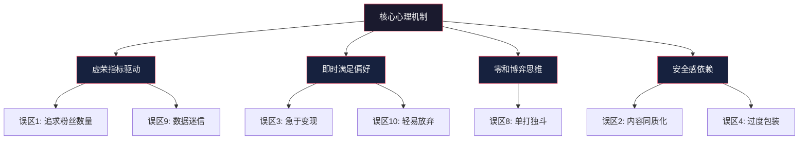
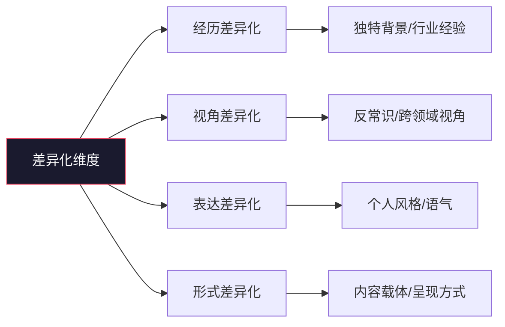
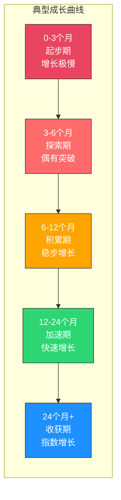

# 第二十章 个人品牌：常见误区

## 本节导读

建立个人品牌是一条"看起来简单、做起来容易踩坑"的路。很多创作者并非没有才华，而是在关键认知上存在偏差，导致投入大量时间和精力却收效甚微。

本节系统梳理了个人品牌建设中最常见的10个误区。每个误区不仅告诉你"错在哪"，还帮你理解"为什么会错"以及"如何纠正"。更重要的是，我们提供了可执行的自检清单，让你在实践中随时校准方向。

### 误区的底层逻辑

这10个误区并非孤立存在，它们往往源于几个核心心理机制：

理解这些底层机制，有助于从根本上避免误区，而不仅仅是在表面行为上修补。

---

## 误区一：追求粉丝数量，忽视粉丝质量

### 误区表现

很多人将粉丝数量作为衡量个人品牌成功的唯一标准。为了涨粉，他们不惜使用买粉、互粉、蹭热点等手段。结果粉丝数量看起来不少，但互动率极低，转化率更是惨淡。

典型症状包括：

- **数据好看但没有实际效果**。粉丝数破万，但一条内容只有几十个赞，评论区冷清
- **粉丝画像与目标受众严重错位**。做技术内容的账号，粉丝里大量是薅羊毛党
- **变现时发现"叫好不叫座"**。有粉丝基础但付费转化率低于1%
- **陷入"数字游戏"的恶性循环**。为了维持粉丝数，不断做低质量的涨粉活动，偏离内容方向

这种心态的根源是"虚荣指标"——将表面的数字当作成功的标志，而忽视了真正的价值。

### 为什么这是个问题

从平台算法角度看，互动率比粉丝数更能决定内容的分发权重。抖音、小红书、B站等主流平台的推荐算法都采用"阶梯式流量池"机制：内容先推给小范围用户，如果互动数据好（点赞率、完播率、评论率），才会进入更大的流量池。

如果你的10000个粉丝中有7000个是僵尸粉或低活跃用户，它们会拉低你的互动率，导致算法认为你的内容质量不高，反而**减少**推荐量。换句话说，虚假的粉丝数不仅没有帮助，还会拖累你的内容分发。

| 指标 | 账号A（1万粉/1%互动率） | 账号B（1000粉/15%互动率） |
|------|------------------------|--------------------------|
| 单条平均互动 | 100 | 150 |
| 算法推荐权重 | 低 | 高 |
| 广告主评估价值 | 低 | 高 |
| 粉丝信任度 | 弱 | 强 |
| 付费转化潜力 | ~0.1% | ~3-5% |

### 正确认知

**1000个真正认可你、信任你的粉丝，比10000个僵尸粉有价值得多。** 这句话已经成为个人品牌领域的共识，但它背后有具体的机制支撑：

高质量粉丝会形成"信任飞轮"。当你发布内容，他们会第一时间互动，帮助你的内容突破初始流量池。他们的互动行为（评论、转发）又会带来新的精准用户。这个正向循环一旦建立，增长会越来越快。

凯文·凯利的"1000个铁杆粉丝"理论指出：一个创作者只需要1000个愿意为你的每个作品付费的铁杆粉丝，就能维持体面的生活。假设每个铁杆粉丝每年为你贡献200元收入，1000个铁杆粉丝就是20万年收入——这已经超过了大多数城市的平均工资。

**互动率是更重要的指标**。互动率（互动数/粉丝数）反映了粉丝的活跃度和忠诚度。不同平台的基准互动率参考：

| 平台 | 良好互动率 | 优秀互动率 | 说明 |
|------|-----------|-----------|------|
| 抖音 | 3-5% | 8%以上 | 点赞+评论+分享/播放量 |
| 小红书 | 2-4% | 6%以上 | 点赞+收藏+评论/曝光量 |
| B站 | 5-8% | 12%以上 | 三连数/播放量 |
| 微信公众号 | 1-3% | 5%以上 | 阅读+点赞+在看/粉丝数 |
| Twitter/X | 0.5-1% | 2%以上 | 互动数/粉丝数 |

### 如何诊断自己是否中招

回答以下问题，如果有3个以上回答"是"，说明你可能正在陷入这个误区：

1. 你是否经常查看粉丝数，并因此开心或焦虑？
2. 你是否考虑过买粉、互粉等增粉手段？
3. 你的互动率是否长期低于所在平台的基准值？
4. 你是否做过与品牌定位无关的涨粉活动？
5. 你是否发现"粉丝不少但没什么人理你"？

### 行动建议

**短期措施（本周内）：**
- 计算你当前的真实互动率（互动数/粉丝数），与上表基准对比
- 停止一切买粉、互粉行为，清理僵尸粉（如果平台支持）
- 分析过去10条内容的互动数据，找出互动率最高的内容类型

**中期措施（1-3个月）：**
- 建立"粉丝质量评估表"，每月跟踪互动率、评论质量、私信转化率
- 在内容中设置"筛选机制"——例如在文章中加入"如果你认同X，欢迎在评论区留言Y"，筛选出高意愿用户
- 优化内容标题和封面，吸引精准目标用户而非泛流量

**长期策略：**
- 将"互动率"和"粉丝质量"纳入你的核心KPI，替代"粉丝数"
- 建立内容-互动-信任的正向飞轮，而非内容-涨粉的单向管道
- 学习社区运营，将粉丝从"关注者"转化为"参与者"再到"共建者"

---

## 误区二：内容同质化，缺乏独特性

### 误区表现

有些人看到某个领域的热门内容，就盲目模仿，结果内容与大量同类账号高度相似，毫无辨识度。他们写的文章、拍的视频，换一个账号名字也完全成立。

典型症状：

- **标题、结构、语气都在模仿头部博主**。"震惊！""必看！""我后悔没早知道！"——这些标题已经让读者审美疲劳
- **观点人云亦云**。别人说什么就说什么，没有自己的思考和判断
- **内容换汤不换药**。同一套内容换个说法重新发，缺乏新意
- **在用户心智中没有"标签"**。用户想不起你有什么独特之处

这种心态的根源是"安全感"——模仿成功案例感觉更安全，但恰恰忽视了差异化才是生存之道。

### 为什么这是个问题

信息过载时代的核心矛盾不是"内容太少"，而是"内容太多"。根据统计，中国互联网每天新增的内容量以PB计算，一个用户每天在社交媒体上接触的信息超过34GB。在这样的环境中，同质化的内容注定被淹没。

从竞争角度看，模仿头部博主的做法存在一个根本性的逻辑错误：**头部博主之所以成功，恰恰是因为他们在当时是独特的**。当他们已经占据了某个定位后，模仿者只能分到残羹冷炙。

从用户心智角度看，杰克·特劳特在《定位》中提出的"心智阶梯"理论表明：用户心智中每个品类只能记住2-3个品牌。如果你的内容与前几名高度相似，你永远无法进入用户的心智阶梯。

### 差异化的四个维度

差异化不是凭空标新立异，而是有章可循的系统工程。以下是四个可操作的差异化维度：

**维度一：经历差异化**

你的职业经历、生活背景、所处环境，是别人无法复制的。例如：
- 一个在非洲工作过的工程师讲创业，天然带有异域视角
- 一个从工厂一线做到管理层的人讲管理，比纯理论派更有说服力
- 一个经历过创业失败又东山再起的人讲商业，比只讲成功的人更可信

**维度二：视角差异化**

同一个话题，可以从不同角度切入。例如讲"时间管理"：
- 从神经科学角度讲（为什么大脑会拖延）
- 从哲学角度讲（时间的本质是什么）
- 从逆向角度讲（为什么你应该停止管理时间）
- 从特定人群角度讲（双职工家庭的时间管理）

**维度三：表达差异化**

你的语言风格、叙述方式、情感基调，都可以成为差异化的载体。有些人以幽默见长，有些人以严谨著称，有些人以温暖打动人。找到并坚持自己的表达风格，让用户"闭着眼睛也能认出你"。

**维度四：形式差异化**

同样的内容可以有不同的呈现形式：
- 长文 vs 短文 vs 信息图
- 视频 vs 音频 vs 图文
- 纯文字 vs 互动式内容
- 系统课程 vs 碎片化分享

### 如何找到自己的独特性

**练习一：经历盘点法**

拿出一张纸，写下你的所有独特经历（工作、生活、旅行、学习），然后回答：
- 这些经历给了我什么独特的认知？
- 我从这些经历中学到了什么别人可能不知道的东西？
- 哪些经历是我可以持续输出内容的素材库？

**练习二："我是唯一"法**

完成句子："我是唯一一个_____的_____创作者。" 如果你能用一句清晰的话概括你的独特定位，你就找到了差异化的方向。

**练习三：交叉定位法**

将两个通常不相关的领域交叉，往往能产生独特的定位。例如：
- 心理学 × 产品经理 = "懂心理学的产品思维"
- 历史 × 管理学 = "以史为鉴的管理智慧"
- 健身 × 程序员 = "为久坐族设计的健身方案"

### 行动建议

- 深入分析自己的独特经历、观点和表达方式，用"经历盘点法"系统梳理
- 在热门话题中找到独特的切入角度，用"交叉定位法"创造新定位
- 发展自己的内容风格和表达方式，保持一致性
- 不要害怕与主流观点不同，差异化本身就是竞争力
- 建立"独特性检查清单"，发布前对照：这篇内容去掉我的名字，别人也能写吗？

---

## 误区三：急于变现，忽视价值积累

### 误区表现

有些人刚建立账号不久，就开始急于变现：接广告、卖课程、开直播带货。结果因为缺乏足够的信任和影响力，变现效果很差，反而损害了品牌形象。

具体表现为：

- **内容质量下降**。为了接广告，在内容中硬植入产品推荐，影响用户体验
- **频繁推销引起反感**。每条内容都在卖东西，评论区出现"又是广告"的声音
- **定价与信任不匹配**。粉丝信任度不够就卖高价课程，退款率极高
- **品牌形象被"赚钱"标签固化**。用户提起你的第一反应是"那个卖课的"，而不是"那个有价值的人"

这种心态的根源是"急功近利"——想要快速看到回报，而忽视了品牌建设需要时间。

### 为什么这是个问题

信任是所有商业行为的基础。罗伯特·西奥迪尼在《影响力》中提出的"互惠原则"指出：人们更愿意回报那些先给予自己的人。在个人品牌语境下，这意味着你必须先提供足够的免费价值，才能获得变现的权利。

从经济学角度看，这涉及到"信任资本"的积累。信任资本是一种无形资产，需要通过长期的、持续的价值输出来积累。过早变现相当于在信任资本不足时强行"透支"，结果是信任破产。

更严重的是，品牌形象一旦被"赚钱"标签固化，要扭转这个认知需要付出数倍的努力。心理学中的"首因效应"（第一印象效应）决定了用户对你的初始认知会持续影响后续判断。

### 变现的正确时机

不存在一个固定的"变现时间点"，但可以通过以下指标来判断是否准备好了：

| 评估维度 | 未准备好 | 基本准备好 | 成熟期 |
|----------|---------|-----------|--------|
| 信任度 | 粉丝互动以点赞为主，少有深度交流 | 有固定活跃粉丝，会主动问你问题 | 粉丝主动推荐你给别人 |
| 内容深度 | 内容以搬运/浅层整理为主 | 有原创深度内容，获得认可 | 成为领域内的参考来源 |
| 粉丝画像 | 粉丝画像模糊，无法清晰描述 | 能描述粉丝的基本特征和需求 | 对粉丝需求有深入理解 |
| 个人能力 | 尚在学习阶段，专业度不够 | 有一定专业积累，能解决实际问题 | 有成功案例和口碑 |
| 互动质量 | 评论以"不错""支持"为主 | 有深度讨论和具体问题 | 粉丝愿意为你的建议付费 |

### 变现的正确方式

变现不是突然"开始赚钱"，而是价值传递的自然延伸。正确的变现路径：

**阶段一：价值输出期（0-6个月）**
- 专注于免费内容的质量和深度
- 建立与受众的信任关系
- 了解受众的核心需求和痛点

**阶段二：轻量变现期（6-12个月）**
- 开始提供付费内容的"预告版"或"简化版"
- 例如：免费内容讲框架，付费内容讲细节和模板
- 小额付费产品试水（如9.9元的电子手册）

**阶段三：体系变现期（12个月以上）**
- 建立完整的产品/服务矩阵
- 从低价到高价，覆盖不同需求层次
- 持续输出免费内容，维持品牌信任度

### 行动建议

- 在前6-12个月专注于价值输出，不急于变现
- 即使开始变现，也要确保产品或服务的质量远超价格
- 变现方式要与品牌调性一致——做技术内容就卖技术课程，不要突然卖面膜
- 保持免费内容的质量和频率，不要因为变现而降低免费内容的标准
- 建立"先给予，再获取"的思维习惯，将免费内容视为"信任投资"

---

## 误区四：过度包装，失去真实感

### 误区表现

有些人为了塑造"完美"的品牌形象，过度包装自己：夸大成就、虚构经历、美化照片、使用华丽的辞藻。结果给人一种"不真实"的感觉，反而难以建立信任。

具体表现：

- **简历式自我介绍**。每条内容都在暗示自己有多厉害，让人感觉在"凡尔赛"
- **永远正确、永远成功**。只展示成功，从不提及失败，让人觉得不真实
- **语言过于正式或营销化**。大量使用"赋能""抓手""底层逻辑"等行业黑话
- **照片过度修图**。人像磨皮到失去真实感，产品图与实物差距大
- **人设与真实自我不一致**。线上"精英人设"，线下完全不同

这种心态的根源是"不安全感"——觉得真实的自己不够好，需要包装才能被接受。

### 为什么这是个问题

心理学研究揭示了一个反直觉的"出丑效应"（Pratfall Effect）：能力出众的人在展示小缺点后，反而会更受喜爱。原因是完美让人产生距离感，而适度的"不完美"让人觉得亲近和可信。

从品牌信任角度看，真实性是信任的基石。爱德曼信任晴雨表（Edelman Trust Barometer）连续多年的调查显示，"真实性"是消费者信任品牌的三大因素之一。在个人品牌领域，这个比例更高。

过度包装还有一个隐藏风险：**人设维持成本**。当你的线上形象与真实自我差距过大时，维持这个人设需要消耗大量心理能量。长期下来，要么疲惫不堪，要么人设崩塌。近年来多位知名博主的"翻车"事件，大多与人设崩塌有关。

### 真实感的建立方法

**方法一：适度展示脆弱性**

布琳·布朗（Brené Brown）在《脆弱的力量》中指出：展示脆弱性不是软弱的表现，而是勇气的体现。在个人品牌语境中，适度展示脆弱性包括：
- 分享你的失败经历和从中学到的教训
- 承认自己的知识盲区
- 坦诚面对批评和质疑
- 分享你在成长过程中的困惑和挣扎

**方法二：保持线上线下的一致性**

真实的反面不是"虚假"，而是"不一致"。如果你在线上是一个温和理性的形象，线下却是一个暴躁易怒的人，这种不一致迟早会暴露。保持一致性意味着：
- 你的内容观点与你的真实信念一致
- 你的线上形象与你的线下行为一致
- 你对不同人说的话是一致的

**方法三：用故事代替说教**

故事天然比说教更真实，因为故事包含具体的场景、情绪和细节。与其说"我是一个很努力的人"，不如讲一个你为了完成某个项目连续加班两周、最后发现问题出在自己一开始的假设上，然后从中领悟了什么的故事。

**方法四：真实不等于随意**

需要区分两个概念：真实和随意。真实是指不夸大、不虚构，但仍然可以展示你最好的一面。就像约会时穿上好看的衣服、面试时打起精神——这是展示最好的自己，而不是伪装。

真实的公式可以概括为：

> 真实 = 不夸大 + 不虚构 + 展示最好的自己 + 适度的不完美

### 行动建议

- 展示真实的自己，包括成就和不足
- 不要夸大或虚构经历——在互联网时代，谎言的保质期越来越短
- 适当分享失败和教训，用故事代替说教
- 用真诚的语气与受众交流，避免营销化和行业黑话
- 建立"真实感检查清单"：这条内容是否与我的真实信念一致？是否夸大了什么？

---

## 误区五：只关注内容，忽视互动

### 误区表现

有些人只专注于创作内容，忽视了与受众的互动。他们不回复评论、不回复私信、不参与讨论，结果虽然有内容输出，但难以建立深度的粉丝关系。

具体表现：

- **评论区长期无人管理**。有价值的问题无人回复，负面评论无人处理
- **私信"已读不回"**。粉丝的私信石沉大海，渐渐不再发私信
- **不做任何互动活动**。没有问答、投票、连麦等互动形式
- **把社交媒体当"公告栏"**。只发内容，不参与对话

这种心态的根源是"内容中心主义"——认为只要内容好就够了，忽视了社交的本质是"互动"。

### 为什么这是个问题

**平台算法层面：** 所有主流社交媒体平台的算法都将"互动"作为核心推荐因素。评论率、回复率、互动深度（长评论vs短评论）都会影响内容的分发权重。一个不回复评论的创作者，在算法眼中就是一个"低质量"的创作者。

**关系建立层面：** 心理学中的"本杰明·富兰克林效应"指出：帮过你的人更愿意再帮你。反向应用：当你回复粉丝的评论、解答他们的问题时，他们会觉得你"在乎"他们，从而加深情感连接。这种连接是任何优质内容都无法替代的。

**信息获取层面：** 互动是最好的市场调研。粉丝在评论区和私信中的问题、困惑、反馈，是最真实的需求信号。忽视这些信号，等于浪费了最宝贵的信息源。

**商业转化层面：** 有互动关系的粉丝，付费转化率是没有互动关系粉丝的5-10倍。因为在商业行为中，"关系"比"内容"更能影响购买决策。

### 互动的系统化方法

**日常互动（每天15-30分钟）：**

| 时间段 | 互动内容 | 目的 |
|--------|---------|------|
| 发布后1小时 | 回复前20条评论 | 引导讨论方向，提升算法权重 |
| 午间休息 | 回复私信中的具体问题 | 建立个人连接 |
| 晚间 | 浏览评论区，回复有价值的问题 | 维护社区氛围 |

**定期互动（每周/每月）：**
- **问答活动**。每周固定时间回答粉丝提问，可以是文字、音频或视频形式
- **投票/调研**。通过投票了解粉丝对下一个话题的偏好
- **直播连麦**。与粉丝实时交流，拉近距离
- **粉丝故事征集**。让粉丝分享他们的经历，增强归属感

**深度互动（建立核心粉丝群）：**
- 建立付费或邀请制的粉丝社群
- 定期举办线下活动或线上研讨会
- 邀请核心粉丝参与内容共创
- 为核心粉丝提供专属福利和优先权益

### 行动建议

- 每天留出固定时间（15-30分钟）回复评论和私信
- 主动参与相关话题的讨论，不只是在自己的内容下互动
- 定期举办互动活动（问答、投票、连麦）
- 建立粉丝社群，从"单向传播"转向"社区共建"
- 在互动中收集需求信号，反哺内容创作

---

## 误区六：盲目追热点，偏离品牌定位

### 误区表现

有些人看到热点话题就忍不住蹭，结果内容五花八门，与品牌定位毫无关系。虽然热点内容可能带来短期流量，但会稀释品牌形象，让受众困惑"你到底是做什么的"。

典型症状：

- **内容主题跳跃太大**。上一条讲技术，下一条讲娱乐八卦，再下一条讲时事政治
- **热点内容与自身定位毫无关联**。做美食的去评论娱乐圈事件
- **为了蹭热点降低内容质量**。在热点消失前抢发，内容粗糙
- **粉丝困惑和流失**。新用户被热点吸引来，但发现大部分内容不是他们想要的，随即取关

这种心态的根源是"流量焦虑"——害怕错过任何获取流量的机会。

### 为什么这是个问题

热点内容的本质是"借势"，借的是公众注意力的势。但借势的前提是"势"与你有关。一个做编程教学的账号突然发了一条娱乐圈评论，即使获得了10万阅读量，这些流量也无法转化为有效粉丝——因为他们来的目的是看娱乐八卦，不是学编程。

更危险的是，频繁的热点追风会让你在用户心智中的定位变得模糊。定位理论的核心原则是"聚焦"：你越是聚焦于一个明确的定位，用户越容易记住你；你越是分散，用户越困惑。

从算法角度看，平台会根据你的历史内容建立"账号画像"。当你频繁发与定位无关的内容时，算法会困惑于"这个账号到底是做什么的"，导致推荐精准度下降，反而影响你正常内容的分发。

### 热点的正确追法

不是所有热点都不能追，关键是找到"热点"与"品牌"的连接点。以下是判断框架：

**热点追/不追决策矩阵：**

| | 热点与定位强相关 | 热点与定位弱相关 | 热点与定位无关 |
|---|---|---|---|
| **热点持续时间长** | 必追，深度分析 | 可追，找到切入角度 | 不追 |
| **热点持续时间中等** | 追，快速响应 | 谨慎，写短评即可 | 不追 |
| **热点持续时间短** | 追，快速短评 | 不追 | 不追 |

**"三点一线"热点法：**

找到以下三个点的交集：
1. **热点事件本身**：发生了什么
2. **你的专业领域**：你能从什么角度分析
3. **用户需求**：用户从你的分析中能获得什么价值

只有当三点一线时，这个热点才值得追。

**案例分析：**

假设你的定位是"职场沟通"：
- 某企业高管公开发言引发争议 → **可追**（可以从沟通技巧角度分析该发言的问题）
- 某明星塌房 → **不追**（与职场沟通无关）
- 某公司裁员潮 → **可追**（可以从如何与HR沟通、如何争取权益的角度切入）
- 某部电影大火 → **可追**（如果电影中有职场沟通的经典场景）

### 行动建议

- 追热点前用"三点一线"法检查：热点×专业×用户需求是否有交集
- 如果有关，找到独特的切入角度，而不是重复别人的观点
- 如果无关，果断放弃——短期流量不值得稀释品牌定位
- 保持80%以上的内容与品牌定位一致，热点内容控制在20%以内
- 建立"热点响应SOP"：发现热点→判断相关性→决定追/不追→确定角度→快速创作→发布

---

## 误区七：忽视视觉呈现，内容体验差

### 误区表现

有些人只关注文字内容的质量，忽视了视觉呈现。他们的文章排版混乱、图片模糊、封面不吸引人，结果即使内容质量不错，也难以吸引用户点击和阅读。

具体表现：

- **封面图缺乏设计感**。随便截个图或用默认模板，毫无吸引力
- **文章排版混乱**。大段文字堆砌，没有小标题、加粗、列表等视觉层次
- **配图质量低**。图片分辨率低、与内容不相关、或来源不明（侵权风险）
- **视觉风格不统一**。每条内容的配色、字体、排版都不一样，缺乏品牌感
- **在移动端体验差**。文字太小、图片超出屏幕、视频比例不对

这种心态的根源是"内容至上主义"——认为内容好就够了，忽视了视觉是用户接触内容的第一印象。

### 为什么这是个问题

认知心理学研究发现，人类处理视觉信息的速度比文字快60000倍。在信息流中，用户决定是否点击一篇内容通常只需要1-2秒，而在这个时间窗口内，视觉元素（封面图、标题排版）起着决定性作用。

微软的研究表明，人类的平均注意力持续时间已从2000年的12秒下降到2015年的8秒。在这样的注意力环境下，如果视觉呈现不能在瞬间抓住用户，再好的内容也没有机会被阅读。

更重要的是，视觉呈现直接影响用户的"感知质量"。心理学中的"光环效应"（Halo Effect）指出：人们倾向于认为一个在某方面表现好的事物，在其他方面也表现好。精美的视觉呈现会让用户在阅读前就"预设"你的内容是高质量的。

### 视觉优化的系统方法

**封面图设计原则：**

| 要素 | 低质量 | 中等质量 | 高质量 |
|------|--------|---------|--------|
| 主题清晰度 | 看不出主题 | 能看出大致主题 | 一眼看出主题和价值 |
| 色彩搭配 | 无配色概念 | 使用基础配色 | 统一品牌色，视觉舒适 |
| 文字设计 | 无文字或字体混乱 | 有清晰标题 | 标题+副标题，层次分明 |
| 图片质量 | 模糊或无关 | 清晰且相关 | 高质量且有设计感 |

**文章排版黄金法则：**
- 每3-5行设置一个视觉断点（小标题、加粗、列表、引用框）
- 使用H2/H3/H4建立清晰的内容层级
- 重点内容用加粗或高亮标注
- 长文使用目录或导航
- 段落之间留白，避免"文字墙"

**建立视觉风格指南：**
- 确定2-3个品牌主色和2-3个辅助色
- 选择1-2款主要字体（标题字体+正文字体）
- 建立封面图模板（可使用Canva、Figma等工具）
- 统一配图风格（实拍vs插画vs截图）
- 在所有平台保持视觉一致性

### 行动建议

- 设计3-5个封面图模板，覆盖你的主要内容类型
- 优化文章排版：加入小标题、加粗、列表、引用框，提升可读性
- 使用Canva、Figma等工具建立视觉风格指南
- 在发布前用手机预览，确保移动端体验良好
- 保持视觉风格的一致性，让用户一眼认出你的内容

---

## 误区八：单打独斗，拒绝合作

### 误区表现

有些人习惯独自创作，从不与其他创作者合作。他们担心合作会"分走"自己的粉丝，或者不知道如何寻找合作机会。

具体表现：

- **从不与同行交流**。把其他创作者视为竞争对手而非潜在伙伴
- **拒绝合作邀请**。即使有机会合作，也因为各种顾虑而拒绝
- **不参与行业社群**。不加入创作者社群，不参加行业活动
- **独自摸索所有问题**。遇到运营、技术、变现问题都自己扛

这种心态的根源是"零和思维"——认为粉丝是有限的，别人多了自己就少了。

### 为什么这是个问题

个人品牌的增长存在"圈层天花板"。当你只靠自己的内容吸引粉丝时，你能触达的用户范围是有限的——主要是你现有粉丝的社交网络和平台推荐的范围。合作是突破圈层天花板最有效的方式。

从经济学角度看，合作是一种"正和博弈"。两个创作者合作，总影响力大于各自影响力之和。原因有三：

1. **用户重叠率低**。即使同一领域的创作者，粉丝重叠率通常也只有10-30%。合作可以让双方都触达对方70-90%的新用户
2. **信任转移效应**。当一个用户信任的创作者推荐另一个创作者时，信任会部分转移，降低新用户的认知门槛
3. **内容互补效应**。不同创作者的视角和专长互补，合作内容往往比单独创作更丰富、更有深度

### 合作的层级和方法

**层级一：轻度互动（零成本，立即可做）**
- 评论、转发对方的内容
- 在自己的内容中引用或推荐对方的观点
- 在社群中互动，建立初步关系

**层级二：内容合作（低成本，1-2周准备）**
- 互相推荐（"我关注的XX领域博主推荐"）
- 联合直播或连麦
- 合作创作一篇文章或视频
- 互换广告位（"你推我，我推你"）

**层级三：深度合作（需要较多投入，但收益也最大）**
- 联合课程或产品
- 共同运营社群或活动
- 长期战略合作（定期内容互推）
- 联合品牌活动

### 如何寻找合作机会

**主动寻找：**
- 在你的领域内找到粉丝量级相近、定位互补的创作者
- 先通过互动（评论、转发）建立关系，再提出合作
- 参加行业活动、创作者社群，拓展人脉

**被动吸引：**
- 持续输出高质量内容，让潜在合作者注意到你
- 在内容中展示你的专业能力和合作意愿
- 建立清晰的合作页面或联系方式

### 合作的注意事项

- **选择互补而非竞争的合作伙伴**。如果你做前端教学，找后端教学的博主合作，而不是另一个前端教学博主
- **明确合作的价值分配**。提前沟通双方的期望、投入和收益分配
- **从小项目开始**。先做一次简单的互推，验证合作效果，再决定是否深度合作
- **保持你的品牌独立性**。合作是为了拓展，不是为了依附

### 行动建议

- 列出你所在领域内5-10个潜在合作对象，分析他们的定位和粉丝画像
- 从轻度互动开始（评论、转发），逐步建立关系
- 尝试第一次内容合作（互推或联合直播）
- 参加行业活动，拓展人脉
- 建立"合作机会追踪表"，记录潜在合作对象和合作进展

---

## 误区九：数据迷信，过度依赖数据

### 误区表现

有些人过度关注数据，每小时都在查看阅读量、粉丝数、互动数。数据好就开心，数据差就焦虑。他们被数据绑架，失去了创作的乐趣和初心。

具体表现：

- **频繁查看数据**。发布后每隔几分钟就刷新一次，无法专注于其他事情
- **情绪随数据波动**。数据好就开心，数据差就焦虑甚至沮丧
- **创作完全被数据驱动**。只做"数据好"的内容类型，放弃"数据不好"但自己热爱的方向
- **忽视长期趋势**。只关注单条内容的数据表现，不看长期积累
- **数据"优化"到失去灵魂**。为了提升数据，不断迎合算法，内容越来越套路化

这种心态的根源是"控制欲"——想要完全掌控结果，而忽视了创作本身的价值。

### 为什么这是个问题

数据的悖论在于：**过度关注数据往往会导致数据变差**。原因是：

1. **短期数据有极大的随机性**。一条内容的表现受发布时间、算法状态、热点事件等众多因素影响，单条内容的数据不能代表你的水平
2. **数据焦虑影响创作质量**。当你总想着"这条数据会不会好"时，你的创作会变得保守和迎合，失去锐度和个性
3. **数据无法衡量所有价值**。创作带来的成长、思维的锻炼、人脉的积累、表达的满足——这些都是数据无法体现的价值

纳西姆·塔勒布在《反脆弱》中提到的"代理问题"在这里同样适用：当你把数据作为目标时，你实际上是在优化一个"代理指标"，而不是真正重要的东西。

### 正确的数据使用方式

**数据的正确角色：参考信号，而非评判标准。**

数据应该帮助你：
- 了解受众的偏好和需求（哪些话题更受欢迎）
- 识别内容优化方向（哪种标题、封面效果更好）
- 跟踪长期趋势（粉丝质量是否在提升）
- 验证策略是否有效（改变方向后数据是否有改善）

数据不应该成为：
- 创作的唯一驱动力
- 情绪的晴雨表
- 自我价值的衡量标准

### 建立健康的数据观

**原则一：关注长期趋势，忽略短期波动**

建立月度数据仪表盘，而不是每小时刷数据。每月看一次总趋势：互动率是否在提升？粉丝质量是否在改善？内容深度是否在增加？

**原则二：设置"数据查看规则"**

- 新内容发布后，24小时内不查看数据
- 每周固定一个时间查看数据（如周日晚上）
- 数据只在固定时间查看，其他时间不刷新

**原则三：区分"过程指标"和"结果指标"**

| 过程指标（你能控制的） | 结果指标（你不能完全控制的） |
|----------------------|--------------------------|
| 内容发布频率 | 单条阅读量 |
| 内容质量自评 | 涨粉速度 |
| 互动投入时间 | 算法推荐量 |
| 学习和成长进度 | 行业排名 |

关注过程指标，接受结果指标的波动。

**原则四：保留"无数据创作"空间**

每个月给自己留出1-2条"不看数据"的内容额度——做你真正想做的内容，不管它数据好不好。这能帮你保持创作的初心和热情。

### 行动建议

- 设置数据查看规则：每周固定时间查看，其他时间不刷新
- 建立月度数据仪表盘，关注长期趋势而非短期波动
- 将"过程指标"作为日常追踪的重点，接受"结果指标"的自然波动
- 每月做1-2条"无数据创作"，保持创作的初心和热情
- 记住创作的本质：表达、成长、连接，数据只是副产品

---

## 误区十：轻易放弃，缺乏长期主义

### 误区表现

有些人创作了几个月，看到增长缓慢就放弃。他们觉得自己"不适合做自媒体"、"没有天赋"，于是转向其他事情。结果永远在起步阶段，从未真正建立起品牌。

具体表现：

- **3个月定律**。做了3个月没看到明显增长，就决定放弃
- **频繁更换方向**。做了一段时间内容创作，又去做电商，又去做直播，又去做短视频，什么都尝试但什么都没坚持
- **归因错误**。把增长缓慢归因于"不适合"或"没天赋"，而不是"还不够努力"或"方法不对"
- **对比焦虑**。看到同时期开始的博主已经起来，就觉得自己不行
- **完美主义陷阱**。觉得自己的内容不够好，不敢发布，直到失去热情

这种心态的根源是"即时满足"——习惯了短视频、社交媒体带来的即时反馈，对需要长期积累的品牌建设缺乏耐心。

### 为什么这是个问题

数据告诉我们一个残酷但真实的事实：**大多数个人品牌在成功前就放弃了**。

以下是几个领域的典型成长曲线：

大多数人在A阶段（0-3个月）就放弃了。而真正成功的创作者，几乎都经历过B阶段（3-6个月）的"看不到希望"时期。那些坚持过B阶段的人，往往会迎来C阶段的稳步增长。

从复利效应来看，个人品牌的增长是典型的"指数增长"模式。前期增长缓慢，但一旦过了临界点，增长会加速。放弃在A或B阶段，意味着你永远看不到指数增长的到来。

### 如何坚持下去

**方法一：设定"最低坚持期"**

给自己设定一个最低坚持期——建议至少12个月。在这12个月内，不管数据如何，你都要坚持创作。12个月后，你有了足够的数据来评估，可以做出更理性的决定。

**方法二：将大目标分解为小里程碑**

不要只盯着"10万粉丝"这样的大目标。将目标分解为可执行的小里程碑：
- 第1个月：完成10条高质量内容
- 第3个月：找到10个核心互动粉丝
- 第6个月：内容平均互动率达到平台基准
- 第9个月：建立稳定的创作流程
- 第12个月：对内容方向和受众有清晰理解

**方法三：建立"创作习惯系统"**

不要依赖意志力，而是建立系统：
- 固定创作时间（如每天早上6-7点）
- 建立内容素材库，降低创作门槛
- 设定最低发布频率（如每周2条）
- 建立创作SOP（选题→大纲→初稿→修改→发布）

**方法四：找到坚持的动力源**

不同的人坚持的动力不同，找到你的：
- **成长驱动**：看到自己在进步
- **表达驱动**：享受表达的过程
- **连接驱动**：与粉丝的互动带来的满足感
- **使命驱动**：帮助他人的使命感
- **记录驱动**：将创作视为人生记录

**方法五：建立支持系统**

- 找一个同样在做内容创作的朋友，互相监督
- 加入创作者社群，获得同行支持
- 定期回顾自己的进步，增强信心
- 在低谷时允许自己休息，但不要放弃

### 行动建议

- 设定最低坚持期：至少坚持12个月再决定是否放弃
- 将大目标分解为小里程碑，每完成一个就给自己正反馈
- 建立创作习惯系统，降低对意志力的依赖
- 找到你的核心动力源，在低谷时提醒自己为什么开始
- 建立支持系统——创作者社群、监督伙伴、定期复盘

---

## 本节小结

### 十大误区的底层归因

这10个误区看似不同，但可以归因为几个核心心理机制：

| 心理机制 | 对应误区 | 核心纠正方向 |
|---------|---------|------------|
| 虚荣指标驱动 | 误区1（追求数量）、误区9（数据迷信） | 关注真正有价值的指标 |
| 即时满足偏好 | 误区3（急于变现）、误区10（轻易放弃） | 建立长期主义思维 |
| 安全感依赖 | 误区2（内容同质化）、误区4（过度包装） | 拥抱真实和差异化 |
| 零和博弈思维 | 误区8（单打独斗） | 建立合作共赢思维 |
| 内容中心主义 | 误区5（忽视互动） | 平衡内容与互动 |
| 流量焦虑 | 误区6（盲目追热点） | 聚焦品牌定位 |
| 形式不重要 | 误区7（忽视视觉） | 重视全方位体验 |

### 避免误区的核心原则

1. **长期主义**：品牌建设是一个长期过程，不期望速成，也不因短期波动而放弃
2. **价值优先**：先提供价值，再获取回报，用信任资本而非流量思维运作
3. **真实真诚**：真实是建立信任的基础，过度包装的维持成本远高于真实
4. **差异化**：找到并放大你的独特性，而不是模仿他人
5. **互动社交**：与受众建立真正的关系，而不是单向传播
6. **持续坚持**：坚持是最大的竞争力，大多数人输在了半路

### 自检清单

每月对照以下清单检查一次，及时纠偏：

- [ ] 我的互动率是否达到平台基准？
- [ ] 我的内容是否有明确的辨识度？
- [ ] 我是否在正确的时机以正确的方式变现？
- [ ] 我的内容是否足够真实？
- [ ] 我是否在认真回复评论和私信？
- [ ] 我追的热点是否与品牌定位相关？
- [ ] 我的视觉呈现是否专业？
- [ ] 我是否有合作和人脉拓展？
- [ ] 我是否过度依赖数据做决策？
- [ ] 我是否还在坚持创作？

记住，个人品牌的本质是"让你的真实价值被更多人看见"。专注于提升自己的能力和价值，持续为他人创造价值，你的品牌会自然生长。不要被短期的数据和外界的评价所左右，坚持你的初心，享受创作和成长的过程。时间会证明，那些坚持下来的人，终将收获属于自己的影响力和价值。
