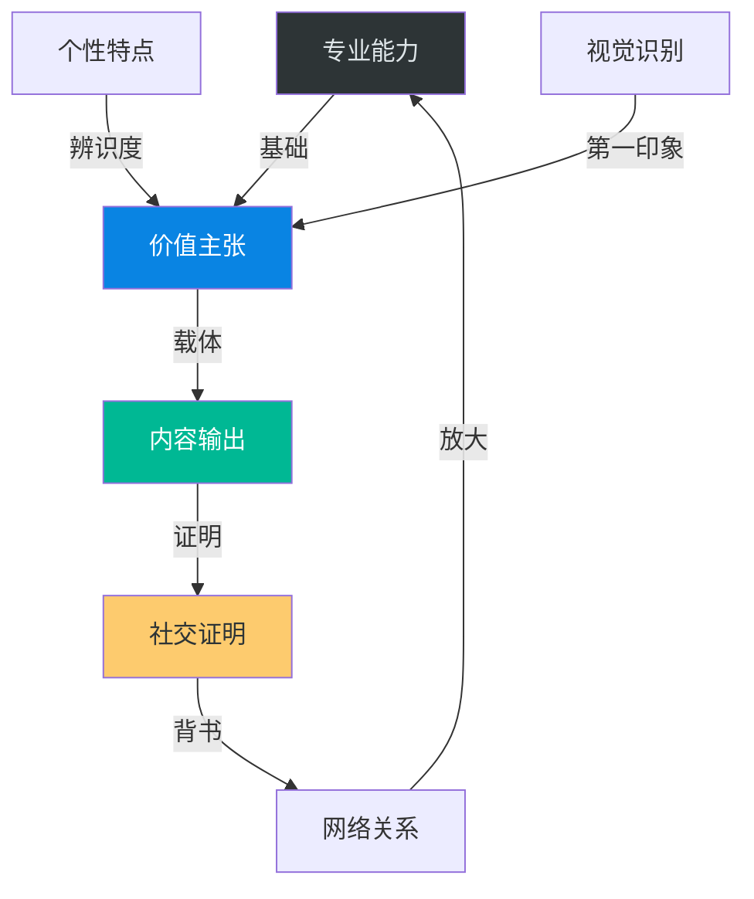
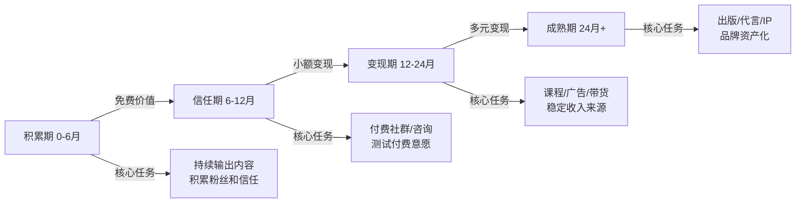
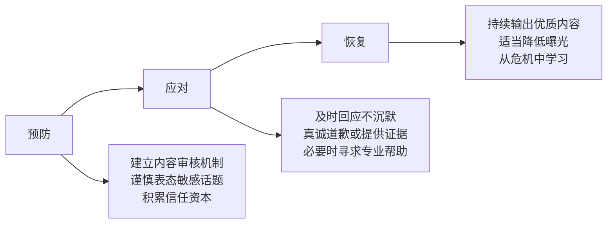
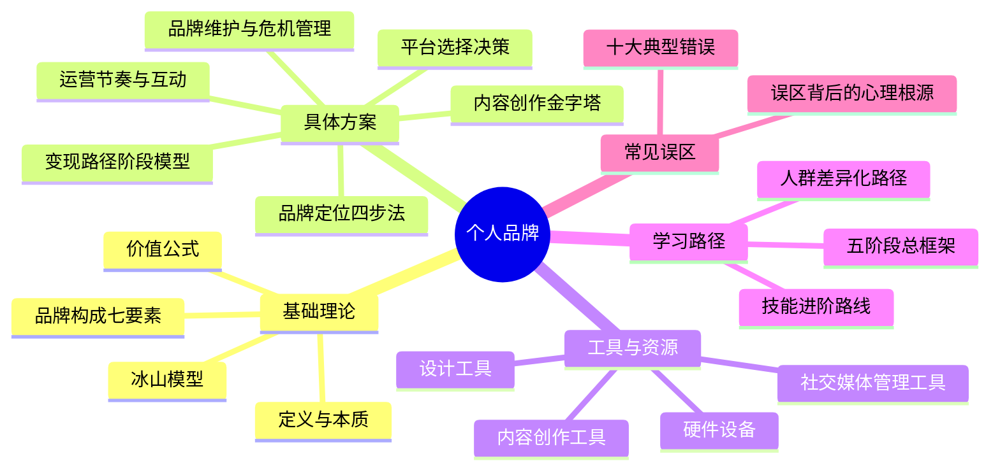

# 第二十章 个人品牌：本章小结

本章从基础理论、具体方案、产品工具、学习路径、常见误区五个维度，系统构建了个人品牌的完整知识体系。本小结不是简单的内容复述，而是将全章核心知识进行**提炼、串联和升华**，帮助你形成完整的认知框架，并提供可立即执行的行动方案。

## 一、核心知识框架

### 1.1 个人品牌的本质公式

理解个人品牌，首先要掌握它的价值公式：

**个人品牌价值 = 专业能力 × 影响力 × 信任度 × 独特性**

这个公式揭示了四个关键事实：

- **乘法关系**：四个要素是相乘而非相加，任何一个为零，整体归零。你可能专业能力极强，但如果影响力为零（没人知道你），品牌价值就是零。反之，你可能有百万粉丝，但缺乏专业能力，信任度崩塌，品牌同样一文不值。
- **短板效应**：最弱的那个要素决定了品牌的天花板。与其在某个维度做到极致，不如先补足短板。
- **复利效应**：每个要素的提升都会倍增整体价值。当四个要素同步提升时，品牌价值呈指数级增长。
- **独特性是乘数**：如果独特性趋近于零（你和别人完全一样），即使其他三项很强，品牌价值也会大幅缩水。这就是为什么差异化如此重要。

### 1.2 品牌冰山模型

个人品牌如同冰山，水面上是可见元素，水面下是支撑体系：

| 层次 | 内容 | 占比 | 重要度 |
|------|------|------|--------|
| 水面之上（可见层） | 社交媒体内容、外在形象、公开演讲、发布作品 | ~20% | 表面印象 |
| 水面之下（支撑层） | 专业知识、独特经历、价值观、学习习惯、人脉信任、韧性坚持 | ~80% | 决定品牌能走多远 |

这个模型告诉我们：**只经营表面层是最大的陷阱**。精心设计头像和简介只是起步，真正让品牌持久的，是水面下的积累。当你感到"内容枯竭"或"增长停滞"时，问题往往不在表面，而在于水面下的专业能力或独特价值需要加深。

### 1.3 品牌构成的七大要素

本章基础理论篇建立了一个完整的个人品牌构成模型。理解这七个要素的相互关系，是制定任何品牌策略的前提：

**关键洞察**：这七个要素形成闭环——专业能力产出价值主张，通过内容输出传播，获得社交证明，借助网络关系放大，反过来又增强专业能力的可信度。品牌建设不是线性的，而是螺旋上升的。

## 二、核心方法论提炼

### 2.1 品牌定位的四步法

定位是品牌的地基，决定了后续所有行动的方向：

**第一步：自我分析——找到你的"原点"**

不要停留在"我会什么"的表面，要深入挖掘三层：
- **能力层**：你掌握的硬技能和软技能，用"深度×广度×实战"三维评估
- **经历层**：你独特的经历组合——教育背景、行业经验、人生转折、失败教训
- **价值层**：你真正关心什么、愿意为什么付出时间、你认为什么是对的

实操方法：让5个最了解你的人分别用3个词形容你，取交集就是你的核心特质。

**第二步：市场调研——找到"需求"**

- 确定目标受众的画像（年龄、职业、痛点、信息获取习惯）
- 分析同领域的竞争者：他们的定位是什么？缺什么？你能补充什么？
- 搜索知乎、小红书、B站的高频问题，找到真实需求

**第三步：找到交叉点——建立"定位"**

你的定位 = 你的能力 ∩ 市场需求 ∩ 你的独特性

三者的交集就是你的品牌定位。如果只满足其中两项：
- 能力 + 需求，但不独特 → 容易陷入同质化竞争
- 能力 + 独特，但无需求 → 自嗨型品牌
- 需求 + 独特，但无能力 → 承诺无法兑现，品牌崩塌

**第四步：验证定位——确保"可行"**

用三个标准检验：
1. **独特性**：搜索你的定位关键词，看是否有大量同类内容？你的切入点有何不同？
2. **价值性**：你的目标受众是否愿意为这个价值付费（哪怕只是时间）？
3. **可持续性**：你能否在6-12个月内持续产出这个方向的内容？

### 2.2 内容创作的金字塔体系

本章具体方案篇详细介绍了内容策略，这里将其提炼为一个可执行的金字塔体系：

| 层级 | 内容类型 | 频率 | 作用 | 示例 |
|------|----------|------|------|------|
| 塔尖 | 旗舰内容 | 每季度1-2个 | 建立权威、长期引流 | 系列课程、白皮书、深度报告 |
| 塔身 | 常规内容 | 每周1-3篇 | 持续输出价值、维护活跃度 | 深度文章、教程视频、案例分析 |
| 塔基 | 碎片内容 | 每天1-3条 | 保持曝光、互动引流 | 短观点、评论回复、行业动态 |

**核心原则**：塔基保证曝光频率，塔身建立专业深度，塔尖打造品牌里程碑。三者缺一不可——只有碎片内容，品牌缺乏深度；只有旗舰内容，更新频率太低，容易被遗忘。

**创作流程的六步法**：
1. **选题**：从受众痛点出发，而非自嗨
2. **调研**：搜集素材、数据、案例，确保内容有据可依
3. **结构化**：先搭框架再填充，避免写到一半偏离主题
4. **创作**：一气呵成写初稿，不要边写边改
5. **优化**：润色标题、调整结构、补充案例
6. **发布**：选择最佳发布时间，配好封面和标签

### 2.3 平台选择的决策矩阵

不同平台有不同的内容偏好、用户群体和算法逻辑。本章介绍了五大主流平台，这里用决策矩阵帮你快速选择：

| 平台 | 内容形式 | 用户画像 | 优势 | 适合谁 | 起步难度 |
|------|----------|----------|------|--------|----------|
| 微信公众号 | 长文 | 全年龄段、高粘性 | 深度内容、私域运营 | 有写作能力的专业人士 | ★★★ |
| 小红书 | 图文+短视频 | 年轻女性为主 | 种草属性强、搜索流量 | 生活方式/消费/美妆领域 | ★★ |
| B站 | 中长视频 | 年轻用户为主 | 知识类内容友好、弹幕互动 | 能出镜/剪辑的知识博主 | ★★★★ |
| 抖音 | 短视频 | 全年龄段 | 流量巨大、爆款机会多 | 表现力强、能做短视频 | ★★（起步易，做好难） |
| 知乎 | 长文+问答 | 高学历、专业人群 | SEO效果好、专业性强 | 有专业深度的知识分享者 | ★★ |

**平台策略建议**：
- **精力有限**：选1个主平台深耕，用其他平台做内容分发（修改格式适配）
- **精力充裕**：1个主平台 + 1-2个辅助平台，但主平台投入应占70%以上精力
- **选平台的优先级**：目标受众在哪 → 你擅长什么形式 → 平台成长红利

### 2.4 变现路径的阶段模型

变现不是一步到位的，需要根据品牌成熟度选择合适的路径：

**各阶段的变现方式与门槛**：

| 变现方式 | 最低粉丝门槛 | 最低信任周期 | 收入潜力 | 风险 |
|----------|-------------|-------------|----------|------|
| 知识付费（课程） | 5000+ | 6个月+ | 高 | 内容质量要求高 |
| 付费社群 | 1000+ | 3个月+ | 中 | 需持续运营 |
| 一对一咨询 | 500+ | 3个月+ | 中 | 时间换钱，天花板低 |
| 广告合作 | 10000+ | 6个月+ | 中高 | 可能损害信任 |
| 电商带货 | 5000+ | 6个月+ | 高 | 需选品能力 |
| 出版书籍 | 不限 | 12个月+ | 低 | 周期长，版税有限 |
| 付费演讲 | 10000+ | 12个月+ | 高 | 需要线下表达能力 |

**变现的核心原则**：永远保持免费内容的质量不下降。当粉丝感觉你"变味了"——开始频繁推销、内容质量下滑、初心改变——信任就会迅速流失。信任的建立需要数月甚至数年，但崩塌只需要一次糟糕的变现尝试。

## 三、关键能力的掌握路径

本章学习路径篇为不同人群设计了差异化方案，这里将其提炼为**通用能力进阶框架**，你可以根据自己的情况调整节奏：

### 3.1 写作能力进阶

| 阶段 | 周期 | 目标 | 具体练习 |
|------|------|------|----------|
| 基础期 | 第1-4周 | 能写清楚 | 每天300-500字练习，学习总分总结构 |
| 进阶期 | 第5-12周 | 能写吸引人 | 学习标题技巧、故事写作，每周完成1-2篇完整文章 |
| 风格期 | 第13-24周 | 形成个人风格 | 尝试不同写法，找到最适合自己的表达方式 |
| 精通期 | 第25周+ | 高效产出 | 建立选题库、素材库、模板库，实现批量创作 |

推荐资源：《写作是最好的自我投资》（Spenser）、《爆款文案》（关健明）、《金字塔原理》（芭芭拉·明托）。

### 3.2 视频制作能力进阶

| 阶段 | 周期 | 目标 | 工具 |
|------|------|------|------|
| 拍摄基础 | 第1-4周 | 能拍出清晰的画面 | 手机 + 自然光 |
| 剪辑入门 | 第5-12周 | 能完成基本剪辑 | 剪映 |
| 进阶技巧 | 第13-24周 | 提升节奏感和观赏性 | Premiere / Final Cut |
| 风格形成 | 第25周+ | 形成辨识度高的视频风格 | 自由组合 |

### 3.3 数据分析能力进阶

| 阶段 | 周期 | 核心能力 |
|------|------|----------|
| 数据意识 | 第1-4周 | 理解各平台核心指标（阅读量、互动率、完播率等） |
| 分析方法 | 第5-12周 | 对比分析、趋势分析，找到高互动内容的共同规律 |
| 数据驱动 | 第13-24周 | 建立数据监控体系，通过A/B测试优化内容策略 |

## 四、必须避免的十大误区与对策

本章常见误区篇详细分析了十个典型错误，这里将其系统化，形成**误区速查表**，便于你在实际运营中随时对照：

| 误区 | 表现 | 根源 | 纠正方法 |
|------|------|------|----------|
| ❶ 追求数量忽视质量 | 买粉、互粉，互动率极低 | 虚荣指标 | 关注互动率而非粉丝数 |
| ❷ 内容同质化 | 模仿热门内容，毫无辨识度 | 安全感需求 | 找到独特切入点和个人风格 |
| ❸ 急于变现 | 刚起步就卖课接广告 | 急功近利 | 前6-12个月专注价值输出 |
| ❹ 过度包装 | 夸大成就、虚构经历 | 不安全感 | 真实展示，适当暴露不足 |
| ❺ 忽视互动 | 只发内容，不回复评论 | 内容中心主义 | 每天留出时间互动 |
| ❻ 盲目追热点 | 内容五花八门，偏离定位 | 流量焦虑 | 追热点前先问"和定位有关吗" |
| ❼ 忽视视觉 | 排版混乱、封面不吸引人 | 内容至上主义 | 投入时间设计封面和排版 |
| ❽ 单打独斗 | 从不与其他创作者合作 | 零和思维 | 主动建立创作者关系网络 |
| ❾ 数据迷信 | 每小时查数据，被数据绑架 | 控制欲 | 每周看一次数据，关注长期趋势 |
| ❿ 轻易放弃 | 几个月没增长就放弃 | 即时满足 | 至少坚持12个月再做判断 |

**误区背后的共同规律**：这十个误区看似不同，但根源高度相似——**急功近利**（想快速看到回报）、**外部驱动**（被数据和评价左右）、**恐惧心理**（害怕不被认可、害怕失败）。破解之道只有一个：**回归初心，聚焦价值创造**。

## 五、品牌维护与危机应对

品牌建设不只是"从0到1"，还有"从1到N"的持续维护。本章具体方案篇专门讨论了品牌维护与危机管理，这里将关键策略提炼如下：

### 5.1 日常维护的四个维度

| 维度 | 具体行动 | 频率 |
|------|----------|------|
| 内容一致性 | 保持质量、风格、价值观的统一 | 每次发布前 |
| 形象更新 | 头像、封面、简介定期更新，保持新鲜感 | 每季度 |
| 关系维护 | 与粉丝、合作伙伴、同行保持互动 | 每天 |
| 能力更新 | 持续学习，保持专业能力的领先 | 每周 |

### 5.2 危机管理的三阶段模型

**危机管理的核心原则**：信任是品牌的"银行账户"。日常的内容输出和互动是在"存款"，危机发生时是在"取款"。如果你平时积累了足够的信任资本，一次危机不会让你"破产"；但如果你平时不注意积累，任何小危机都可能是致命的。

## 六、个性化行动方案

### 6.1 自我诊断：你现在在哪个阶段？

用以下清单快速定位你的品牌建设阶段：

**起步期（0-3个月）的标志**：
- [ ] 还没有明确的品牌定位
- [ ] 还没有选择主平台
- [ ] 发布内容少于10篇
- [ ] 粉丝少于500

**成长期（3-12个月）的标志**：
- [ ] 已有清晰的品牌定位
- [ ] 已建立稳定的发布节奏
- [ ] 粉丝在500-5000之间
- [ ] 开始有稳定的互动

**成熟期（12个月+）的标志**：
- [ ] 品牌定位已验证并被受众认可
- [ ] 粉丝超过5000
- [ ] 开始有合作机会主动找来
- [ ] 已有初步的变现尝试

### 6.2 不同阶段的行动重点

**起步期的核心任务**：
1. 完成自我分析和品牌定位（本周内）
2. 设计品牌形象：头像、封面、简介（3天内）
3. 选择主平台并注册账号
4. 准备10-20个选题，开始发布第一批内容
5. 不要追求完美，先开始再优化

**成长期的核心任务**：
1. 深入分析数据，找到受欢迎的内容类型
2. 优化标题、封面、结构
3. 建立内容日历，形成稳定发布节奏
4. 开始与同领域创作者建立联系
5. 尝试建立粉丝社群

**成熟期的核心任务**：
1. 深化品牌定位，建立品牌故事
2. 拓展多平台运营
3. 开始小规模变现实验
4. 建立系统的内容创作和运营体系
5. 探索合作与跨界机会

### 6.3 不同人群的差异化建议

| 人群 | 核心目标 | 推荐主平台 | 每日投入 | 关键里程碑 |
|------|----------|-----------|----------|-----------|
| 职场人士 | 提升竞争力，获得晋升 | 知乎/LinkedIn/脉脉 | 30分钟 | 6月内粉丝1000，开始获得行业关注 |
| 自由职业者 | 吸引客户，建立权威 | 公众号/知乎 | 1小时 | 6月内通过内容获得第一批客户 |
| 创业者 | 引流获客，建立创始人IP | 公众号/抖音/B站 | 1小时 | 6月内通过内容获得种子用户 |
| 学生 | 为职业发展做准备 | B站/小红书/知乎 | 课余3-5小时/周 | 12月内建立初步品牌，为求职加分 |

## 七、贯穿全章的三条主线

回顾整章内容，有三条贯穿始终的主线，理解它们比记住任何单个知识点都重要：

### 主线一：价值先行，信任为本

从品牌定位到内容创作，从互动运营到变现路径，所有环节的核心逻辑都是：**先提供价值，再获取回报**。这不是道德说教，而是最有效率的策略——因为信任是所有商业行为的基础，而信任只能通过持续的价值交付来建立。

### 主线二：长期主义，复利思维

品牌建设的回报曲线不是线性的，而是指数型的。前6个月可能增长缓慢，让你怀疑方向是否正确；但如果你坚持输出价值、持续优化、不断学习，增长会在某个临界点突然加速。这个临界点因人而异，但所有成功品牌都经历过漫长的积累期。

### 主线三：真实自我，差异化表达

在信息过载的时代，"像别人"是最危险的策略。你独特的经历、观点、表达方式，才是别人无法复制的核心竞争力。不要试图成为"更好的别人"，而要成为"最好的自己"。

## 八、本章知识地图

## 最后的话

个人品牌建设是一场马拉松，不是百米冲刺。在这个过程中，你会经历：

- **增长缓慢的焦虑**——前6个月可能只有几百粉丝，这是正常的
- **创作瓶颈的困惑**——不知道写什么、写了没人看，每个创作者都经历过
- **外界质疑的压力**——"你这样做有什么用？"，最好的回应是用结果说话

这些都是正常的阶段，不是你"不适合"的信号。每个成功的个人品牌都经历过这些。

但请记住一个更根本的问题：**你为什么开始？** 是为了帮助他人？分享知识？表达自己？建立影响力？这个"为什么"是你最强大的动力来源——当数据不好时，当外界质疑时，当你想放弃时，回到你的初心，它会告诉你答案。

正如亚马逊创始人杰夫·贝佐斯所说："你的品牌是别人在你不在场时对你的评价。"让你的品牌成为这样的评价——**他值得信任，他的内容有价值，他是一个真诚的人**。

现在就开始行动吧。不需要完美，只需要开始。你的个人品牌之旅，从写下第一行字的那一刻开始。
