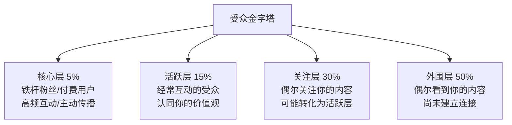
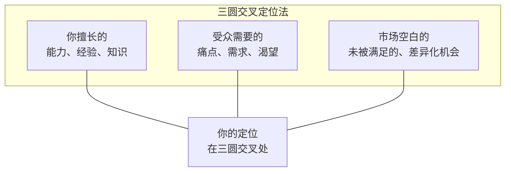
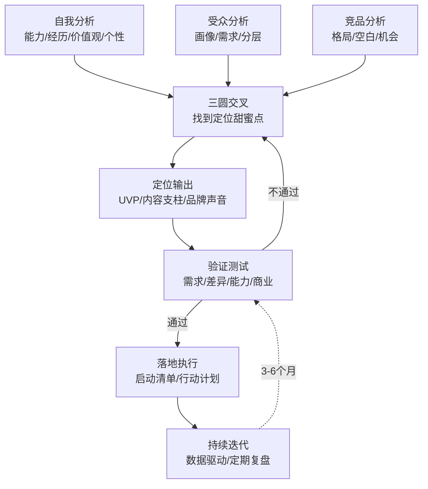

## 一、品牌定位与规划

品牌定位是所有品牌建设行动的第一步，也是决定后续所有努力是否有效的关键环节。定位错了，内容再好、运营再勤、投入再多，都是在错误的方向上加速奔跑。定位对了，哪怕初期资源有限，也能一步步积累出有辨识度、有影响力、有商业价值的个人品牌。

本节提供一套从自我诊断到定位输出的完整工作流，包含可填写的模板、可操作的步骤、可验证的清单。你需要的不是"再想想"，而是"现在就做"。

---

### 1.1 自我分析：找到你的品牌原材料

自我分析不是写心灵鸡汤，而是一次严肃的个人资产盘点。你需要像审计一家公司一样审计自己——你有什么能力、什么经历、什么资源、什么独特性。这些就是你品牌的"原材料"。

#### 1.1.1 专业能力盘点

专业能力是个人品牌的地基。没有真实能力支撑的品牌，就是空中楼阁。

**操作方法：能力矩阵绘制**

拿出一张纸或打开一个表格，按照以下维度逐一盘点：

| 能力类别 | 具体技能 | 当前水平 | 市场需求度 | 热爱程度 | 品牌潜力 |
|---------|---------|---------|-----------|---------|---------|
| 核心专业 | 如：Python开发 | 精通（8/10） | 高 | 高 | 高 |
| 辅助技能 | 如：数据分析 | 中级（6/10） | 高 | 中 | 中 |
| 软技能 | 如：公开演讲 | 入门（3/10） | 中 | 高 | 中 |
| 跨界技能 | 如：心理学知识 | 入门（4/10） | 中 | 高 | 高 |

**水平评估标准**（避免自我高估或低估）：

- **入门（1-3分）**：了解基本概念，能完成简单任务，需要指导
- **中级（4-6分）**：独立完成常规工作，能解决常见问题
- **高级（7-8分）**：能处理复杂场景，能指导他人，有项目经验
- **专家（9-10分）**：能创新方法论，有行业影响力，被同行认可

**关键筛选逻辑**：品牌潜力高的能力需要同时满足三个条件——水平不低于中级、市场需求不低于中等、你对它有热情。只有水平但没热情，你坚持不下去；只有热情但没水平，你立不住脚。

一个常见的错误是把"我会什么"等同于"我的品牌是什么"。你可能精通Excel，但"Excel达人"这个定位已经极度拥挤。你需要进一步挖掘——你是"用Excel做财务建模的人"还是"用Excel做数据可视化的设计师"，这中间的差距就是品牌价值的差距。

#### 1.1.2 独特经历梳理

经历是最难被复制的品牌资产。任何人经过训练都可以掌握一项技能，但没有人能复制你的人生轨迹。

**四维经历挖掘法**：

**维度一：职业经历的独特性**
- 你是否经历过行业转型？（从传统行业到互联网，从技术到管理）
- 你是否在非典型环境中取得过成果？（远程团队、跨国协作、从0到1的项目）
- 你是否犯过重大错误并从中成长？（失败经历往往比成功经历更有共鸣）

**维度二：学习成长的独特路径**
- 你的学习方式有什么特别之处？（自学成才、跨界转型、边做边学）
- 你是否用非常规方法解决了常规问题？
- 你在成长过程中有什么关键转折点？

**维度三：跨界经验的融合价值**
- 你是否有两个以上不同领域的深度经验？
- 这些经验的交叉点在哪里？
- 有没有只有你才能看到的"盲区机会"？

**维度四：生活经历的人格底色**
- 你的成长背景塑造了你什么样的价值观？
- 你有什么特别的兴趣爱好？
- 你的生活方式中有什么能引发共鸣的元素？

**实操模板——经历提炼清单**：

花30分钟，不加筛选地写下你人生中的20个重要经历（里程碑、转折点、挑战、成就）。然后用以下三个问题筛选：

1. 这个经历是否塑造了今天的我？（相关性）
2. 这个经历是否能引发目标受众的共鸣？（连接性）
3. 这个经历是否包含可分享的经验或教训？（价值性）

通过三个筛选条件的经历，就是你品牌故事的核心素材。

#### 1.1.3 价值观澄清

价值观决定了品牌的"灵魂"。两个能力相当的人，因为价值观不同，会建立完全不同的品牌——一个可能走"权威专家"路线，另一个可能走"平民导师"路线。

**价值观排序练习**：

从以下24个核心价值观中，选出你最认同的5个，然后排序：

> 真实、创新、助人、效率、自由、公平、勇气、智慧、美、连接、成长、安全、影响力、创造力、独立、合作、诚信、卓越、简约、冒险、责任、快乐、传承、突破

排序完成后，问自己三个问题：

1. **冲突测试**：当排名第一的价值观和其他价值观冲突时，你会选哪个？（例如"真实"和"助人"冲突——你是否会为了帮助别人而说善意的谎言？）
2. **底线测试**：有哪些事情是你绝对不会为了品牌增长而做的？（例如：不会为了流量制造焦虑，不会为了变现推荐自己不认可的产品）
3. **一致性测试**：你的价值观是否在你的日常行为中得到体现？如果"真实"是你的核心价值，但你在社交媒体上只展示光鲜的一面，这就是价值观和行为的不一致。

价值观不是写在简介里的装饰品，而是每一个决策的判断标准。当你面临"要不要追这个热点""要不要接这个合作""要不要用这种方式表达"的决策时，回到你的核心价值观，答案通常会变得清晰。

#### 1.1.4 个性特点识别

个性是品牌最难被模仿的部分。技能可以学习，经历无法复制，但个性是从内而外散发的独特气质。

**"三个标签"练习**：

分别问三类人（家人/密友、同事/合作伙伴、不太熟的朋友），用三个词形容你。收集所有标签后，找交集——被多人提到的标签，就是你的真实个性标签。

**个性-品牌映射表**：

| 个性标签 | 品牌表达方式 | 适合的内容风格 | 不适合的表达 |
|---------|------------|--------------|------------|
| 幽默 | 段子、类比、反差感 | 轻松吐槽、反转叙事 | 严肃说教、长篇大论 |
| 严谨 | 数据、逻辑、引用 | 深度分析、研究报告 | 情绪化表达、随性分享 |
| 温暖 | 故事、共情、鼓励 | 经验分享、情感共鸣 | 犀利批评、对抗性表达 |
| 犀利 | 观点鲜明、直击要害 | 行业评论、观点输出 | 中庸温和、和稀泥 |

**重要提醒**：不要为了品牌而伪装个性。伪装短期有效，长期必崩。你不需要变成另一个人，你需要做的是找到自己个性中最有吸引力的部分，然后放大它。

---

### 1.2 目标受众分析：你的品牌为谁而建

"我的内容是给所有人看的"——这是最危险的定位。当你试图服务所有人，你实际上谁也服务不了。品牌的力量来自于精准——精准的人群、精准的需求、精准的解决方案。

#### 1.2.1 受众画像构建

受众画像不是拍脑袋想象，而是基于调研和推理的系统构建。

**三层画像模型**：

**第一层：基础画像（Who）**
- 年龄区间：不要写"25-35岁"，写"25-30岁的职场前5年"
- 性别比例：你的内容是否天然偏向某个性别？
- 职业分布：具体到行业和岗位，不要写"白领"，写"互联网公司的产品经理和运营"
- 收入水平：直接影响你的变现方式和定价策略
- 地域分布：一线城市的焦虑和三线城市的需求完全不同

**第二层：心理画像（Why）**
- 核心焦虑：他们晚上睡不着时在想什么？
- 渴望状态：他们理想中的自己是什么样的？
- 信息获取习惯：他们通过什么渠道获取信息？
- 决策驱动因素：什么会让他们"关注"一个人？什么会让他们"取关"？

**第三层：行为画像（How）**
- 活跃平台：他们在哪些平台上花时间最多？
- 内容偏好：他们喜欢长文还是短视频？喜欢干货还是故事？
- 互动习惯：他们会在评论区留言还是默默点赞？
- 消费习惯：他们愿意为什么类型的内容付费？价格敏感度如何？

**快速画像法**（适合起步阶段，没有数据积累时使用）：

1. 找到3-5个你的"理想对标账号"
2. 逐个分析他们的评论区、互动人群、热评内容
3. 从评论者的头像、简介、历史发言中提炼画像信息
4. 将多个账号的信息交叉验证，形成初步画像

#### 1.2.2 受众需求挖掘

知道了受众是谁还不够，你还需要知道他们需要什么。

**需求挖掘的五种方法**：

**方法一：关键词研究**
使用百度指数、微信指数、知乎热搜、小红书搜索建议等工具，输入你的领域关键词，观察：
- 搜索量趋势：需求在增长还是萎缩？
- 相关搜索词：用户在搜索什么关联问题？
- 长尾关键词：有哪些细分需求没有被充分满足？

**方法二：社区潜水**
加入目标受众聚集的社群（微信群、QQ群、豆瓣小组、Reddit版块），观察：
- 什么问题被反复提问？（高频需求）
- 什么回答获得最多认同？（有效解决方案的特征）
- 什么内容被截图转发？（传播动机分析）

**方法三：竞品评论区分析**
分析你所在领域头部账号的评论区，重点关注：
- "求教程""怎么做到的""能详细说说吗"——信息需求
- "我也是""太真实了""终于有人说出来了"——情感共鸣
- "能推荐XX吗""有没有XX方面的内容"——未被满足的需求

**方法四：一对一深度访谈**
选择5-10个符合你目标画像的人，进行15-30分钟的对话。核心问题：
- 你目前在XX领域最大的困惑是什么？
- 你关注了哪些XX领域的创作者？为什么关注他们？
- 你觉得现有内容中缺少什么？
- 如果有一个XX领域的导师，你最想从他/她那里得到什么？

**方法五：自身经历映射**
如果你自己就是目标受众（最理想的情况），回忆你在"小白阶段"时的困惑和需求。你曾经走过的弯路、踩过的坑、希望当时有人告诉你的事情，就是你的内容方向。

#### 1.2.3 受众分层

不是所有受众都同等重要。你需要对受众进行分层，明确谁是核心受众、谁是次要受众、谁是外围受众。

**核心策略**：品牌建设初期，不要追求"大而全"的受众覆盖，而要专注于服务好核心层。核心层的口碑传播，比你自己的任何推广都更有效。100个愿意转发你内容的铁杆粉丝，比10000个僵尸粉有价值得多。

---

### 1.3 竞品分析：在红海中找蓝海

竞品分析不是为了抄袭，而是为了理解战场格局。你需要知道：这个领域有哪些人在做、他们做得怎么样、他们没有做什么、你能做什么不同的。

#### 1.3.1 竞品识别

**三层竞品模型**：

| 层级 | 定义 | 示例 | 分析重点 |
|------|------|------|---------|
| 直接竞品 | 定位几乎相同，受众高度重叠 | 同样讲"产品经理成长"的博主 | 内容差异点、运营策略 |
| 间接竞品 | 领域相同但角度不同 | 讲"产品经理"但侧重工具评测 | 可借鉴的角度和方法 |
| 潜在竞品 | 目前不在同一领域但可能跨界 | 讲"职场成长"的博主开始涉及产品 | 趋势预警 |

**竞品识别方法**：
1. 在目标平台搜索你的领域关键词，找出头部和腰部账号
2. 通过新榜、飞瓜、千瓜等数据平台查看领域排名
3. 观察头部账号的关注列表和互动圈子
4. 搜索行业相关的话题标签，找到活跃创作者

#### 1.3.2 竞品分析框架

对每个竞品（选取3-5个最有代表性的），从以下维度进行分析：

**竞品分析表模板**：

| 分析维度 | 竞品A | 竞品B | 竞品C | 你的机会 |
|---------|------|------|------|---------|
| 核心定位 | | | | |
| 目标受众 | | | | |
| 内容类型 | | | | |
| 发布频率 | | | | |
| 平均互动量 | | | | |
| 变现方式 | | | | |
| 内容优势 | | | | |
| 内容短板 | | | | |
| 粉丝高频需求 | | | | |
| 未覆盖的选题 | | | | |

**重点分析项**：

- **内容空白**：受众有需求但竞品没有覆盖的选题，这是最大的机会
- **形式空白**：竞品都做图文但没人做视频（或反过来），这可能是差异化方向
- **风格空白**：竞品都是严肃风格，你可以考虑轻松幽默路线
- **深度空白**：竞品都停留在表面科普，你可以做深度分析

#### 1.3.3 竞品分析的常见误区

**误区一：只看头部，不看腰部**
头部账号的策略不一定适合你——他们有团队、有资源、有粉丝基础。腰部账号（1万-10万粉）的打法更具参考价值，因为他们更接近你的起步阶段。

**误区二：只看数据，不看内容**
一个账号的粉丝量高不代表它的定位策略正确，可能只是起步早或者投入了大量推广费用。你需要分析的是它的内容策略、互动质量和受众忠诚度。

**误区三：看到红海就放弃**
红海意味着有成熟的市场需求。关键不是"有没有竞争"，而是"能不能找到差异化切入角度"。同样是讲Python，可以讲"Python for 数据分析"，也可以讲"Python for 设计师"——差异化的空间永远存在。

---

### 1.4 差异化定位：你的品牌DNA

定位的核心公式在基础理论篇已经讲过（你是谁+你为谁+你解决什么问题+你有何不同），这里专注于实操——如何从分析到输出，得到一个可执行的定位。

#### 1.4.1 定位三圆交叉法

找到你的定位，本质上是找到三个圆的交叉区域：

- **只擅长+有需求但不独特**：你在红海里厮杀，很难出头
- **擅长+独特但没需求**：你做得很酷但没人买单
- **有需求+独特但不擅长**：你立不住脚，很快会被识破
- **三者交叉**：这是你的甜蜜点——你有能力做、受众有需求、别人还没做好

#### 1.4.2 六种定位策略详解

在基础理论篇中提到了六种定位策略，这里给出更详细的实操指导：

**策略一：差异化定位**
- 核心逻辑：在大领域中找到一个被忽视的角度
- 实操步骤：列出你所在领域的10个常见切入角度→找到其中被提及最少但有需求的2-3个→选择你最有能力覆盖的
- 案例：职场领域的"内向者成长指南"——大领域是职场成长，差异化角度是为内向性格的人量身定制

**策略二：细分定位**
- 核心逻辑：在大市场中切出一个足够小但足够深的细分领域
- 实操步骤：领域→子领域→细分领域→超细分领域（至少下钻3层）
- 案例：摄影→手机摄影→手机美食摄影→低光环境手机美食摄影
- 注意：细分到什么程度取决于受众基数。太细会导致天花板过低，太粗会导致竞争激烈。一般以"能在目标平台找到至少1万潜在关注者"为底线

**策略三：跨界定位**
- 核心逻辑：将两个不相关的领域结合，创造独特价值
- 实操步骤：列出你深度了解的2-3个领域→找到它们的交叉应用→验证交叉点是否有受众需求
- 案例："用设计思维做产品管理""用心理学原理提升销售能力""用编程思维优化健身训练"
- 风险：跨界定位需要你在两个领域都有足够的深度，否则容易"两头不靠"

**策略四：人格定位**
- 核心逻辑：以你鲜明的人格特质作为品牌核心
- 适用条件：你的人格特质足够鲜明、有辨识度、能引发共鸣
- 案例："毒舌但真诚的产品测评""话少但句句干货的技术分享"
- 注意：人格定位不等于"人设"。人设是表演出来的，人格定位是放大真实的你

**策略五：经历定位**
- 核心逻辑：以你的独特经历作为品牌基石
- 适用条件：你的经历中有足够多的可分享的经验、教训、方法论
- 案例："从月薪3000到年入百万的自由职业之路""非科班出身的AI工程师成长记"
- 注意：经历定位需要持续更新——当你不再有新的成长和突破时，品牌会停滞

**策略六：方法论定位**
- 核心逻辑：以你独创或深度实践的方法论作为品牌核心
- 适用条件：你有一套被验证有效的、可复制的方法论
- 案例："用PDCA循环管理个人成长""用OKR方法论规划职业发展"
- 优势：方法论定位的品牌护城河最强——别人可以模仿你的内容，但模仿不了你的方法论体系

#### 1.4.3 UVP（独特价值主张）提炼

UVP是品牌定位的浓缩表达——一句话说清楚你是谁、为谁服务、提供什么价值。

**UVP公式（基础版）**：

> 我帮助 [目标受众] 通过 [方法/手段] 实现 [结果/价值]

**UVP公式（进阶版）**：

> 我是 [身份标签]，帮助 [目标受众] 解决 [具体问题]，不同于 [竞品/传统方式] 的是 [你的独特之处]

**UVP检验清单**：

| 检验标准 | 问题 | 通过条件 |
|---------|------|---------|
| 清晰度 | 一个完全不了解你的人能在10秒内理解吗？ | 用日常用语，不用行业黑话 |
| 差异化 | 换一个名字，这个UVP还能用在别人身上吗？ | 如果能，说明不够独特 |
| 受众相关 | 目标受众听到这句话会想"这说的是我"吗？ | 必须命中具体痛点 |
| 价值感 | 这个UVP是否承诺了一个具体的结果？ | 避免"提升""赋能"等模糊词 |
| 可信度 | 你有能力兑现这个承诺吗？ | 有案例、数据或经历支撑 |
| 可持续 | 你能围绕这个UVP持续产出内容吗？ | 至少能写100个相关选题 |

**反面示例与修正**：

| 原始UVP | 问题 | 修正后 |
|---------|------|-------|
| "分享生活美学" | 太泛，没有具体价值 | "帮30岁+都市女性用极简方式打造有质感的日常" |
| "教你学编程" | 红海，无差异化 | "帮非科班转行者用项目驱动法在6个月内拿到第一个开发offer" |
| "资深HR的职业建议" | 以自我为中心 | "帮工作3-7年的职场人避开晋升路上的隐性陷阱" |

#### 1.4.4 定位画布：一页纸完成定位

以下是一个可填写的定位画布模板。花1-2小时，认真填写每一项：

┌─────────────────────────────────────────────────┐
│                 个人品牌定位画布                    │
├──────────────┬──────────────────────────────────┤
│ 我是谁        │ [你的身份/角色，不超过3个标签]       │
├──────────────┼──────────────────────────────────┤
│ 我服务谁      │ [核心受众的精准描述]                │
├──────────────┼──────────────────────────────────┤
│ 他们有什么问题 │ [3个核心痛点]                      │
│              │ 1.                                │
│              │ 2.                                │
│              │ 3.                                │
├──────────────┼──────────────────────────────────┤
│ 我怎么帮他们   │ [你的方法/路径/产品]               │
├──────────────┼──────────────────────────────────┤
│ 为什么选我     │ [你的独特优势/差异化因素]           │
│ 而不是别人     │                                  │
├──────────────┼──────────────────────────────────┤
│ 我的UVP      │ [一句话价值主张]                    │
├──────────────┼──────────────────────────────────┤
│ 核心关键词(5个)│ [与你品牌最相关的5个关键词]          │
├──────────────┼──────────────────────────────────┤
│ 内容支柱(3-5个)│ [你持续产出内容的核心主题方向]       │
│              │ 1.                                │
│              │ 2.                                │
│              │ 3.                                │
├──────────────┼──────────────────────────────────┤
│ 阶段目标      │ 3个月：                            │
│              │ 6个月：                            │
│              │ 12个月：                           │
└──────────────┴──────────────────────────────────┘

#### 1.4.5 内容支柱定义

内容支柱（Content Pillars）是围绕你的定位延伸出的3-5个核心主题方向。它们决定了你"说什么"，是内容创作策略的骨架。

**内容支柱的三个原则**：

1. **紧扣定位**：每个支柱都应该与你的核心定位直接相关
2. **足够宽泛**：能支撑至少50-100个选题而不重复
3. **互相补充**：支柱之间有逻辑关联，共同构成你的知识体系

**示例——"帮职场新人用沟通技巧快速融入团队"的定位**：

| 内容支柱 | 说明 | 选题方向示例 |
|---------|------|------------|
| 向上沟通 | 如何与上级有效沟通 | 汇报工作、争取资源、表达异议、反馈请求 |
| 平行协作 | 如何与同事高效合作 | 跨部门沟通、会议发言、冲突处理、请求协助 |
| 表达能力 | 如何清晰有力地表达 | 结构化表达、电梯演讲、邮件写作、PPT演示 |
| 职场社交 | 如何建立职场人脉 | 破冰技巧、饭局社交、行业活动、线上互动 |
| 心态调适 | 如何克服社交恐惧 | 内向者生存指南、自信建设、情绪管理 |

**选题溢出测试**：对每个内容支柱，尝试在10分钟内写出20个选题。如果某个支柱你写不出10个，说明它可能太窄了，需要扩展或替换。

---

### 1.5 品牌形象设计：让定位"看得见"

定位是内在的骨架，形象是外在的呈现。好的品牌形象让人一眼就记住你、认出你、信任你。

#### 1.5.1 视觉识别系统

**头像设计原则**：
- **辨识度第一**：在手机屏幕上（通常只有40-60px大小）能被清晰辨认
- **一致性**：所有平台使用同一张头像，降低认知成本
- **风格匹配**：头像风格要与品牌调性一致（专业领域用职业照，创意领域可以更有设计感）
- **定期更新**：每1-2年更新一次，保持新鲜感但不要频繁更换

**封面图/主页设计**：
- 包含品牌名称或UVP的核心信息
- 色彩方案与头像保持一致
- 避免信息过载——封面图是"第一印象"，不是"全部信息"

**色彩方案选择**：

| 色系 | 传达的感觉 | 适合的领域 |
|------|-----------|-----------|
| 蓝色系 | 专业、可信赖、稳重 | 科技、金融、职场、教育 |
| 红/橙色系 | 活力、热情、行动力 | 健身、美食、生活方式 |
| 绿色系 | 成长、健康、自然 | 心理、健康、环保、理财 |
| 黑白灰 | 高级、极简、专业 | 设计、时尚、高端咨询 |
| 紫色系 | 创意、智慧、独特 | 艺术、文化、个人成长 |

选择2-3个主色调（一个主色+一个辅助色+一个点缀色），在所有视觉内容中保持一致。

#### 1.5.2 品牌声音（Tone of Voice）

品牌声音是你的"听觉识别"——即使遮住你的头像和名字，受众也能通过文字风格认出你。

**品牌声音四维度**：

| 维度 | 问自己 | 选项示例 |
|------|--------|---------|
| 正式程度 | 你像朋友聊天还是像教授讲课？ | 随意 ↔ 正式 |
| 情感温度 | 你给人温暖的感觉还是冷静理性？ | 温暖 ↔ 理性 |
| 表达方式 | 你倾向于讲故事还是列数据？ | 叙事 ↔ 分析 |
| 能量水平 | 你的表达是高能激昂还是平和沉稳？ | 高能 ↔ 沉稳 |

**语言习惯清单**（确定后保持一致）：

- **称呼**：你如何称呼受众？（"朋友们""同学们""各位""小伙伴"）
- **用词**：用专业术语还是通俗表达？用书面语还是口语？
- **句式**：长句多还是短句多？喜欢用反问还是陈述？
- **标点**：喜欢用省略号还是感叹号？用emoji吗？频率如何？
- **标志性表达**：有没有你常用的口头禅、结束语、开场白？

**示例——两种截然不同的品牌声音**：

品牌A（职场沟通导师）：
> "今天聊一个扎心的话题：你有没有过这种经历？辛辛苦苦做了一周的方案，汇报的时候领导全程看手机……别急着怪领导，先想想你的汇报方式是不是出了问题。"

品牌B（技术架构师）：
> "微服务拆分的本质是领域边界的划分。很多团队把微服务做成了'分布式单体'——服务拆了，但耦合一点没少。今天我们来聊聊Domain-Driven Design中的Bounded Context。"

两者都很有效，但适合不同的人和不同的受众。关键是找到属于你的声音，然后保持一致。

#### 1.5.3 个人简介撰写

个人简介是品牌定位的"电梯版本"——通常只有50-150字的空间，但决定了陌生人是否会关注你。

**简介结构公式**：

[身份标签] + [核心价值/成就] + [内容方向/关注理由] + [行动引导]

**简介优化对比**：

| 版本 | 内容 | 问题 |
|------|------|------|
| 初版 | "热爱生活的90后" | 无价值、无差异化、无行动理由 |
| 改进 | "产品经理｜分享产品方法论" | 有价值但太泛，没有差异化 |
| 优化 | "8年B端产品经理｜带过3个从0到1的SaaS产品｜分享产品经理的实战避坑指南" | 有身份、有背书、有价值 |
| 最终 | "8年B端PM，做过3个SaaS从0到1｜每周拆解一个真实产品案例，帮你少踩我踩过的坑 👇 最受欢迎的5篇文章" | 有背书、有内容承诺、有社交证明、有行动引导 |

**各平台简介特点**：

- **微信公众号**：可以较长，适合放完整的价值主张和内容目录
- **小红书**：简洁有个性，配合标签和emoji更醒目
- **抖音**：一句话概括，突出差异化，引导关注
- **B站**：可以稍长，突出内容特色和更新频率
- **知乎**：突出专业背景和回答领域
- **LinkedIn**：专业导向，突出成就和价值主张

---

### 1.6 定位验证：在正式投入前确认方向

定位不是想出来的，而是验证出来的。在全面投入内容创作之前，你需要用最小成本验证你的定位是否成立。

#### 1.6.1 验证的四个维度

**维度一：需求验证**
- 目标受众是否在主动搜索相关内容？（关键词搜索量）
- 目标受众是否在社群中讨论相关话题？（社群活跃度）
- 是否有人在为类似内容付费？（市场付费意愿）

**维度二：差异化验证**
- 你的定位与现有竞品是否有明显区别？
- 你的定位是否容易被人记住和转述？
- 让5个不了解你领域的人听完你的定位后复述，他们能准确复述吗？

**维度三：能力验证**
- 你能围绕这个定位持续产出内容至少1年吗？
- 你有足够的知识深度来应对受众的追问吗？
- 你有持续学习和成长的计划来保持内容新鲜度吗？

**维度四：商业验证**
- 这个定位是否指向清晰的变现路径？
- 目标受众是否有相应的消费能力？
- 你的定位是否允许未来的产品化和规模化？

#### 1.6.2 最小化验证方法

**方法一：内容测试法（1-2周）**
- 围绕你的定位，在目标平台发布5-10篇内容
- 观察阅读量、互动率、评论质量
- 特别关注评论区是否有"精准受众"出现（他们的问题和反馈是否与你预期一致）

**方法二：社群测试法（2-4周）**
- 加入3-5个目标受众聚集的社群
- 以你的定位为基础，回答问题、分享观点
- 观察反馈：是否有人主动找你交流？是否有人邀请你做更多分享？

**方法三：MVP产品测试法（1个月）**
- 制作一个最小化的内容产品（一篇深度长文、一个免费小课、一份PDF指南）
- 通过社交媒体分发，收集反馈
- 观察：有多少人下载/阅读？有多少人给出正面反馈？有多少人主动传播？

#### 1.6.3 定位调整的信号

以下信号出现时，说明你的定位可能需要调整：

| 信号 | 可能的原因 | 调整方向 |
|------|-----------|---------|
| 持续3个月互动率低于1% | 内容与受众不匹配 | 回到受众分析，验证画像 |
| 评论区总是出现非目标受众 | 定位不够精准 | 收窄定位，更聚焦 |
| 你自己对内容创作感到厌倦 | 定位与热情不匹配 | 调整到更符合热情的角度 |
| 竞品大量涌入同一赛道 | 差异化不足 | 寻找新的差异角度 |
| 无法想到新的选题 | 定位太窄 | 适度扩展内容支柱 |
| 受众反馈"不知道你是做什么的" | 定位不清晰 | 简化UVP，减少信息量 |

**关键原则**：定位可以迭代，但不要频繁推翻。每次调整应该是"微调"而不是"大改"。给一个定位至少3个月的验证期，用数据说话，而不是凭感觉。

---

### 1.7 品牌规划落地：从定位到行动计划

定位确定之后，你需要将其转化为可执行的行动计划。

#### 1.7.1 品牌建设启动清单

**第一周：基础搭建**
- [ ] 完成定位画布（1.4.4节模板）
- [ ] 确定主平台和1-2个辅助平台
- [ ] 注册/优化各平台账号
- [ ] 设置统一的头像、封面图、简介
- [ ] 写出第一批10个选题

**第二周：内容启动**
- [ ] 发布第1篇内容（不要追求完美，先发出去）
- [ ] 加入3-5个目标受众聚集的社群
- [ ] 关注10个领域内的对标账号
- [ ] 开始记录选题灵感（建立选题库）

**第三周：节奏建立**
- [ ] 确定固定的发布频率（如每周2-3次）
- [ ] 建立简单的内容生产流程（选题→大纲→初稿→修改→发布）
- [ ] 开始主动互动（评论、转发、回复）
- [ ] 收集第一周的反馈数据

**第四周：复盘优化**
- [ ] 分析前3周的内容数据
- [ ] 总结哪些内容反响好、为什么
- [ ] 调整内容方向和发布策略
- [ ] 制定下个月的内容计划

#### 1.7.2 常见问题解答

**Q：我觉得自己没有什么特别的，怎么定位？**
A：没有人真的"没有特点"。问题通常出在两个方面：一是你对自己的优势习以为常（就像鱼意识不到水），建议用"三个标签"练习从他人视角看待自己；二是你只看到了"技能层面"的独特性，忽略了经历、视角、价值观层面的独特性。一个学了10年英语又去做了销售的人，他的英语学习方法可能比英语专业的人更有实战价值——因为他是从"用"的角度学的。

**Q：我想做的方向已经有很厉害的人了，还有机会吗？**
A：市场有头部不代表没有你的空间。你需要回答一个问题："如果我关注了那个很厉害的人，我还需要关注你吗？"如果答案是"需要，因为你能提供XX不同的价值"，你就有了机会。差异化的角度可以是：更细分的受众、更新的视角、更实操的内容、不同的内容形式、不同的表达风格。

**Q：定位需要多具体？太具体会不会限制发展？**
A：初期定位越具体越好。原因有三：第一，具体定位更容易被记住；第二，具体定位竞争更小；第三，具体定位的内容更容易做好。至于限制发展的问题——定位可以随着你的成长而迭代。先在一个小领域建立权威，再逐步扩展，这比一开始就铺大摊子有效得多。几乎所有成功的个人品牌都是从一个非常具体的起点开始的。

**Q：定位之后能改吗？**
A：能改，但要注意方式。微调（换一个角度、收窄或扩展受众、更新UVP表述）是正常的，甚至推荐的。但大改（彻底换领域、换受众、换方向）成本很高，相当于重新来过。所以第一次定位要认真对待，用验证环节确认方向，用3个月时间检验效果。

---

### 1.8 本节总结

品牌定位与规划是个人品牌建设的"地基工程"。本节的核心逻辑是：

**记住三个核心原则**：

1. **先做后改**：不要追求一步到位的完美定位。先做出一个"足够好"的定位，用实践验证，用数据迭代。
2. **聚焦再扩展**：初期定位要窄、要深、要具体。在一个小领域做到极致，再逐步扩展。
3. **真实最重要**：定位可以策略性地放大你的某些特点，但不能凭空捏造。可持续的个人品牌建立在真实能力之上。

定位完成之后，下一步是将这个定位转化为持续的内容输出——这就是下一节"内容创作策略"要解决的问题。

***
