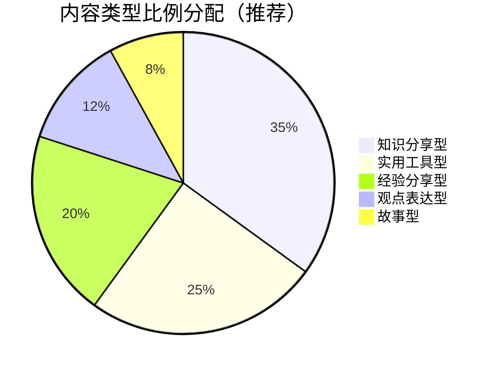
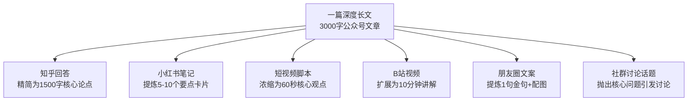
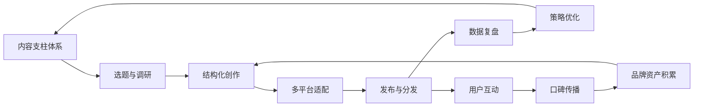

## 二、内容创作策略

内容是个人品牌的核心载体。如果说品牌定位是"你是谁"，那么内容创作就是"你如何证明你是谁"。每一次内容发布，都是一次品牌资产的积累——优质内容让受众记住你、信任你、主动传播你。本章将从内容体系设计、创作流程、写作技法、平台适配、质量管控五个维度，系统拆解从零到精通的内容创作方法论。

### 2.1 内容支柱体系设计

在开始创作任何单篇内容之前，你需要先搭建**内容支柱体系（Content Pillar System）**——这是你所有内容的骨架，决定了你的内容是否系统化、是否有辨识度、是否能持续产出。

#### 2.1.1 什么是内容支柱

内容支柱是你围绕个人品牌核心定位，划分出的3-5个固定内容方向。每个支柱对应受众的一个核心需求，所有具体内容都从支柱中派生。例如：

| 个人品牌定位 | 支柱1 | 支柱2 | 支柱3 | 支柱4 |
|-------------|-------|-------|-------|-------|
| Python技术博主 | Python实战教程 | 工具链与效率 | 行业技术趋势 | 程序员成长 |
| 职场成长导师 | 简历与面试 | 职场沟通 | 能力提升 | 行业洞察 |
| 摄影教学博主 | 拍摄技巧 | 后期修图 | 器材评测 | 创意灵感 |
| 理财规划师 | 基础知识 | 产品分析 | 风险管理 | 案例复盘 |

没有内容支柱的创作者，最常见的问题是：今天发穿搭、明天发读书笔记、后天发美食探店——受众完全记不住你是做什么的。内容支柱的作用就是让你在"该写什么"这个问题上不再纠结。

#### 2.1.2 五种核心内容类型

每个内容支柱下，你需要规划五种内容类型，它们承担不同的品牌建设功能：

**类型一：知识分享型——建立专业权威**

这是你的"硬核"内容，直接展示你的专业深度。具体形式包括：

- **行业分析与趋势解读**：对行业动态的深度分析，不是简单搬运新闻，而是加入你的专业判断。例如："2024年AI对设计行业的5个真实冲击——我采访了20位设计师后的结论"
- **系统教程与技能拆解**：把复杂知识拆解成可学习的步骤。好的教程不是罗列知识点，而是设计学习路径，让读者从"不会"到"会"
- **工具评测与方法论**：对比测试同类工具，给出有数据支撑的推荐。关键是要有真实使用场景，而不是复制官方文档
- **原理与机制解析**：解释"为什么"而非只说"怎么做"。例如不只教"怎么写标题"，而是解释"为什么数字型标题点击率高——认知心理学中的加工流畅性理论"

**类型二：经验分享型——建立情感连接**

知识可以被搜索引擎替代，但个人经验是独一无二的。这类内容的核心价值是**真实性和共鸣感**：

- **个人成长复盘**：不美化、不卖惨，如实记录你走过的弯路和收获。读者要的不是"成功学"，而是"一个真实的人如何一步步走过来"
- **失败教训总结**：这类内容往往比成功经验更受欢迎。标题含"踩坑""教训""后悔"的内容，平均互动率比纯干货高30%-50%
- **决策过程透明化**：分享你面对选择时的思考过程。例如"我为什么放弃大厂offer选择创业——决策背后的10个考量维度"
- **日常工作记录**：让受众看到你的工作状态和专业习惯，增强"活人感"

**类型三：观点表达型——塑造品牌态度**

有观点的人才能被记住。这类内容帮你从"信息提供者"升级为"意见领袖"：

- **对行业事件的深度评论**：不是蹭热点，而是提供独特视角。在所有人都说"XX要火"的时候，你能冷静分析"为什么它可能火不起来"
- **对争议问题的立场表达**：敢于表态，但要基于逻辑和事实而非情绪。立场越鲜明，吸引的受众越精准——同时也要接受部分人的不认同
- **对流行趋势的反思**：当某种方法论被过度追捧时，敢于提出不同意见。例如"为什么'每天5点起床'不适合所有人——从生物钟科学角度分析"
- **行业预测与前瞻**：基于专业判断对未来趋势做出预测，附上推理过程。即使预测不完全准确，推理过程本身就是价值

**类型四：实用工具型——创造收藏价值**

这类内容的特征是"拿来就能用"，天然具有高收藏和高转发属性：

- **模板与清单**：可直接复制使用的模板（如"项目管理甘特图模板""年终总结框架"）。关键是模板要经过你自己验证，不是从网上拼凑的
- **资源合集与导航**：系统整理某个领域的学习资源、工具推荐、入门指南。例如"零基础学数据分析：从入门到就业的完整资源地图"
- **操作手册与SOP**：把复杂流程标准化。例如"从零搭建个人博客的完整SOP（含踩坑记录）"
- **速查表与对比指南**：用表格、图表等形式呈现对比信息。例如"5款主流笔记软件横评：功能×价格×适用场景全对比"

**类型五：故事型——创造情感共鸣**

人类大脑天生对故事敏感。用故事包装信息，记忆留存率比纯信息高22倍（斯坦福大学研究）：

- **客户/用户案例故事**：展示你的工作成果，但重点放在"对方遇到的困境→你的解决方案→最终效果"的叙事弧线上
- **个人经历故事**：选择与品牌定位相关的经历，用故事结构（起因→冲突→转折→结果）重新编排
- **行业故事与幕后揭秘**：分享行业内的"内幕"或"冷知识"，满足受众的好奇心
- **成长对比故事**：用"before vs after"的对比结构，展示变化和进步

#### 2.1.3 内容比例分配

不同类型内容的比例决定了你的品牌调性。以下是经过验证的推荐比例：

- **新手期（0-1000粉）**：知识分享40% + 实用工具30% + 经验分享20% + 故事10%。这个阶段需要靠干货建立专业形象，观点和故事要少而精
- **成长期（1000-1万粉）**：知识分享35% + 实用工具25% + 经验分享20% + 观点12% + 故事8%。开始加入更多个人观点，建立差异化
- **成熟期（1万粉以上）**：各类型灵活调配，根据数据反馈动态调整。此时你已经有了稳定的受众画像，可以根据他们的偏好优化比例

### 2.2 内容创作全流程

#### 2.2.1 第一步：选题——决定内容的天花板

选题是内容创作中投入产出比最高的环节。一个好选题能让你的内容传播效率翻倍，而一个糟糕的选题再好的文笔也救不回来。

**选题的四个来源：**

1. **受众痛点挖掘**：最直接、最有效的选题来源。方法包括：
   - 在目标受众聚集的社区（知乎、小红书、贴吧、行业论坛）搜索高频问题
   - 分析自己过往内容的评论区，找出受众反复提出的疑问
   - 直接做问卷调查或在社群中发起话题征集
   - 关注行业内的"常青问题"——那些反复被问到、从未被彻底解决的问题

2. **热点借势**：借助热点话题的流量红利。但要注意：
   - 只追与你定位相关的热点，不相关的热点会稀释品牌
   - 热点内容要加入你的专业视角，不能只是搬运信息
   - 热点有时效性，通常48小时内是最佳发布窗口
   - 准备一个"热点反应模板"：事件概述 + 我的分析 + 对受众的启示

3. **竞品分析**：研究同领域优秀创作者的高互动内容：
   - 分析他们点赞/收藏最高的内容，提炼选题规律
   - 找到他们覆盖但讲得不够深的话题，你来做得更好
   - 发现他们没有覆盖的细分话题，抢占空白领域
   - 注意：借鉴选题方向，不抄袭具体内容

4. **个人积累**：你在工作和学习中自然产生的思考和发现：
   - 工作中解决的难题，本身就是好选题
   - 学习新知识时的困惑和顿悟，可以转化为教程
   - 与同行交流中获得的启发，可以整理为观点文章
   - 日常记录灵感的习惯非常重要——用手机备忘录随时记录

**选题评估矩阵**：用以下四个维度给选题打分（1-5分），总分12分以上的选题值得创作：

| 评估维度 | 5分标准 | 1分标准 |
|---------|---------|---------|
| 受众需求 | 高频痛点，搜索量大 | 小众冷门，几乎无人问 |
| 专业匹配 | 完全在你的专业范围内 | 需要大量外部学习 |
| 差异化空间 | 你能提供独特视角或方法 | 已经有大量优质内容 |
| 传播潜力 | 容易引发讨论和分享 | 纯信息类，互动性低 |

#### 2.2.2 第二步：调研——让内容有据可依

选题确定后，不要急于动笔。充分的调研决定了内容的深度和可信度。

**调研四步法：**

1. **信息收集（30-60分钟）**：
   - 搜索该话题的权威资料：学术论文、行业报告、官方文档
   - 阅读排名前10的同类内容，记录他们的结构、论点、不足
   - 收集数据和案例：统计数据、实验结果、真实案例
   - 整理一个"素材清单"，包含所有可用的论据和引用来源

2. **受众分析（15-30分钟）**：
   - 明确这篇内容的目标读者是谁（新手/中级/高级）
   - 分析他们对这个话题已有的认知水平
   - 预判他们最关心的问题和最大的困惑
   - 确定内容的深度和语言风格

3. **角度确定（15-30分钟）**：
   - 分析竞品内容的角度，避免重复
   - 找到你的独特切入点：个人经验、跨界视角、反直觉观点、更系统的方法
   - 确定一个核心观点（一篇文章只讲一个核心观点）
   - 用一句话概括你的核心论点——如果你说不清楚，说明还没想清楚

4. **结构设计（15-30分钟）**：
   - 列出内容大纲，确定主要章节和顺序
   - 标注每个部分需要的论据和案例类型
   - 设计开头的"钩子"和结尾的"行动号召"
   - 预估总字数和创作时间

#### 2.2.3 第三步：结构化——让内容有骨架

好的结构让读者在30秒内判断"这篇文章值不值得读"。以下是经过验证的高效内容结构：

**经典结构一：问题-方案-验证**
1. 提出问题（引起共鸣）
2. 分析问题（建立信任）
3. 给出方案（提供价值）
4. 验证方案（案例/数据）
5. 总结行动（推动转化）

**经典结构二：总-分-总**
1. 核心观点（开头亮明）
2. 分论点1 + 论据 + 案例
3. 分论点2 + 论据 + 案例
4. 分论点3 + 论据 + 案例
5. 总结升华 + 行动建议

**经典结构三：时间线/流程型**
1. 背景和起点
2. 阶段1：发生了什么 → 学到了什么
3. 阶段2：发生了什么 → 学到了什么
4. 阶段3：发生了什么 → 学到了什么
5. 最终结果 + 可复制的方法论

**经典结构四：对比型**
1. 引入对比话题
2. A方案的优势和劣势
3. B方案的优势和劣势
4. 对比表格/数据
5. 结论和选择建议

#### 2.2.4 第四步：初稿创作——完成比完美重要

初稿阶段的核心原则是**先完成，再完美**。不要边写边改，这会严重打断思路。

**创作节奏建议**：

- 先把大纲中每个标题下的要点写出来（骨架）
- 然后逐段展开，把要点扩充成完整的段落（血肉）
- 先写最有把握的部分，不一定要从开头写起
- 遇到需要补充数据或案例的地方，先标记占位符`[待补充]`，继续往下写
- 初稿完成后，通读一遍，检查逻辑连贯性

**避免的写作陷阱**：

- **开头太长**：前3段还没进入正题。读者没有耐心等你铺垫，第一句话就要给出"继续读下去的理由"
- **逻辑跳跃**：上一段讲A，下一段突然跳到C，中间缺了B。每一段之间要有自然的过渡
- **堆砌信息**：把所有搜集到的素材都塞进去。一篇好文章不是信息量最大，而是信息密度最高——每句话都有存在的理由
- **自说自话**：全程"我认为""我觉得"，没有数据和案例支撑。观点需要论据来强化

#### 2.2.5 第五步：修改打磨——从60分到90分

初稿是给自己看的，修改稿才是给读者看的。优秀的创作者花在修改上的时间往往超过初稿创作时间。

**修改检查清单**：

| 检查项 | 标准 | 修改方法 |
|--------|------|---------|
| 标题 | 能在3秒内引起好奇或共鸣 | 写5-10个标题变体，选最好的 |
| 开头 | 前2句能让读者决定继续读 | 用问题、数据、冲突场景开头 |
| 核心观点 | 全文围绕一个核心观点展开 | 删掉偏离核心的内容 |
| 逻辑链 | 每段之间有清晰的因果或递进关系 | 添加过渡句，调整段落顺序 |
| 论据 | 每个观点至少有1个具体论据 | 补充数据、案例、引用 |
| 语言 | 简洁、准确、无废话 | 删掉"众所周知""不言而喻"等空话 |
| 排版 | 有小标题、加粗、列表、留白 | 长段落拆分，重点内容加粗 |
| 结尾 | 有明确的行动号召或思考引导 | 不要用"以上就是"结尾 |

#### 2.2.6 第六步：发布与分发

内容发布不是终点，而是传播的起点：

- **发布时间**：工作日的早7-9点、午12-14点、晚20-22点是大多数平台的流量高峰。具体时间需要通过数据测试找到你的受众最活跃的时段
- **标签与话题**：每篇内容添加3-5个相关标签，其中1-2个热门标签（获取曝光）+ 2-3个精准标签（获取精准流量）
- **多平台适配**：同一内容根据不同平台的特性进行二次加工（详见2.4节）
- **互动准备**：发布后的前2小时是算法推荐的关键窗口，准备好回复评论，提升互动率
- **二次传播**：将内容精华提炼成金句卡片、短视频片段、讨论话题，进行二次分发

### 2.3 标题与开头的创作技法

#### 2.3.1 标题创作：决定80%的点击率

标题是内容的"门面"。在信息流中，用户平均只花1-2秒扫视标题，标题不行，内容再好也没人看。

**七种经过验证的标题模式：**

**1. 数字型——降低认知成本**

人脑处理数字比文字更快，数字给人"可量化、可预期"的感觉。

- "5个让你效率翻倍的时间管理技巧"
- "10个新手常犯的摄影错误——第7个90%的人都中招"
- "30天养成一个好习惯的方法（附每日执行清单）"

**写作要点**：数字要具体（不要"几个"，要"7个"）；数字越大不一定越好，3-7个是最佳范围；括号补充信息能增加20%点击率。

**2. 问题型——激发好奇心缺口**

问题天然制造"知识缺口"，让读者产生"我想知道答案"的冲动。

- "为什么你的简历总是石沉大海？HR不会告诉你的3个筛选规则"
- "如何在3个月内建立个人品牌？这是我见过最系统的方案"
- "月入过万的自由职业者都在做什么？我采访了50位后的发现"

**写作要点**：问题要精准命中目标受众的痛点；不要问读者已经知道答案的问题；问题+答案预告的组合效果最好。

**3. 对比型——制造认知冲突**

对比产生的反差感是吸引注意力的利器。

- "高手和新手的10个区别——不仅仅是经验的差距"
- "月薪5000和月薪50000的人，思维方式到底有什么不同？"
- "传统营销 vs 内容营销：一个在花钱买流量，一个在让流量找你"

**4. 故事型——激活镜像神经元**

人天然对"别人的故事"感兴趣，故事型标题让读者产生代入感。

- "我如何从月薪3000到年入百万——中间踩过的12个坑"
- "一个内向者的职场逆袭之路：从被忽视到被需要"
- "我花了3年才明白的10个道理，希望你能少走弯路"

**5. 悬念型——制造信息缺口**

留下关键信息不说完，激发读者的好奇心。

- "这个方法让我3个月涨粉10万，但有个前提条件"
- "99%的人都不知道的效率工具——我自己用了2年才分享"
- "我差点因为这个错误毁了职业生涯"

**6. 指令型——直接给出行动方向**

用明确的动词开头，给读者"做了就能得到"的预期。

- "学会这个框架，你写的每篇文章都能上热门"
- "用这3步方法，2周内让简历通过率翻倍"
- "掌握这套思维模型，做决策不再纠结"

**7. 身份标签型——精准定位受众**

在标题中明确目标人群，让对应的人产生"这是写给我的"感觉。

- "给3年以内经验的产品经理：你最该补的5项能力"
- "内向者必看：不善社交也能建立个人品牌的4个方法"
- "程序员转型管理，我用这3本书完成了思维升级"

**标题AB测试方法**：同一篇内容准备3-5个标题，在不同平台或不同时间段测试，记录点击率数据。积累足够数据后，你会发现自己领域的标题规律。

#### 2.3.2 开头创作：决定读者是否继续

标题让读者点击，开头决定读者是否继续读下去。你有大约3秒钟（约50个字）来留住读者。

**四种高效开头模板：**

**1. 痛点共鸣式**
你有没有遇到过这种情况：[描述一个具体的痛点场景]？
如果你的答案是"有"，那么这篇文章就是为你写的。

**2. 数据冲击式**
根据[权威来源]的数据，[一个令人意外的数据]。
这个数字背后，隐藏着一个被大多数人忽视的真相：[你的核心观点]。

**3. 故事切入式**
[时间]，我[做了一件具体的事]。
当时的我没想到，这个决定会[带来什么结果]。
今天，我想把这段经历中的[核心收获]分享给你。

**4. 反常识式**
[一个被广泛接受的观点]——这句话你一定听过。
但今天我要告诉你的是，这句话可能害了你。
因为[你的反常识观点]。

### 2.4 不同平台的内容适配策略

每个平台的用户行为模式、算法逻辑、内容形态都不同。同一份素材需要根据平台特性进行"翻译"，而不是简单地复制粘贴。

#### 2.4.1 微信公众号

**平台特性**：深度阅读平台，用户愿意花5-15分钟阅读长文。算法推荐权重较低，主要靠社交传播和搜索流量。

**内容规格**：
- 标题：20字以内，含核心关键词。公众号标题在聊天列表中只显示前半部分，核心信息要前置
- 正文：2000-5000字是最佳区间。太短显得没干货，太长阅读完成率会下降
- 排版：每300-500字一个小标题；关键结论加粗；善用引用块突出金句；段落不超过4行
- 配图：封面图决定朋友圈分享的点击率；正文每500字配1张图或图表，降低阅读疲劳
- 结尾：设计"转发语"——帮读者想好分享到朋友圈时可以说的话，降低分享门槛

**创作要点**：
- 公众号内容重深度、重逻辑、重体系化，适合"知识分享型"和"观点表达型"内容
- 善用"阅读原文"链接引流到其他内容或产品
- 次条内容可以用较轻量的形式（如资源合集、问答），与头条形成互补
- 定期发布系列内容（如"XX入门系列"共5篇），培养用户追更习惯

#### 2.4.2 小红书

**平台特性**：种草决策平台，用户以18-35岁女性为主，视觉驱动，搜索流量占比高。

**内容规格**：
- 标题：含emoji表情 + 关键词 + 数字/痛点。例如"🔥5个让皮肤变好的习惯｜坚持1个月亲测有效"
- 正文：300-800字，开头直接说结论，不要铺垫。用emoji分段，增加视觉节奏
- 配图：封面图是小红书的"第一战场"——必须有设计感。正文建议4-9张图，信息卡片形式效果最佳
- 标签：3-5个标签，包含1个大流量标签（如#职场干货）+ 2-3个精准标签（如#产品经理面试）

**创作要点**：
- 小红书内容重实用、重视觉、重"可操作性"，适合"实用工具型"和"经验分享型"内容
- "干货清单"类内容（如"XX必看的10本书""XX的完整流程"）在小红书表现最好
- 封面图用Canva等工具设计统一模板，建立视觉识别度
- 善用小红书的搜索SEO——在标题和正文中自然嵌入用户会搜索的关键词

#### 2.4.3 抖音/短视频平台

**平台特性**：娱乐化内容消费平台，算法推荐权重极高，前3秒决定生死。

**内容规格**：
- 时长：15-60秒（新手建议控制在30秒以内），信息密度是核心
- 开头：前3秒必须抓住注意力——用一个冲击性问题、一个反常识结论、或一个视觉冲击
- 节奏：每3-5秒一个信息点，不要有"空镜头"和无效画面
- 字幕：必须加字幕，大量用户在静音状态下浏览
- 结尾：设计"完播钩子"——在视频最后预告下一期内容，或提出一个引发思考的问题

**创作要点**：
- 短视频重娱乐性、重节奏、重"瞬间吸引"，适合"故事型"和"观点表达型"的精简版本
- 一个视频只讲一个知识点，不要贪多
- 真人出镜的完播率和互动率普遍高于纯画面+配音
- 评论区是短视频的"第二战场"——主动在评论区补充内容、回复用户，能显著提升推荐量
- 发布频率建议日更或隔日更，短视频平台对发布频率敏感

#### 2.4.4 B站

**平台特性**：中长视频平台，用户以18-30岁为主，追求深度和"硬核"内容，社区文化强。

**内容规格**：
- 时长：5-20分钟是最佳区间，深度讲解有天然优势
- 封面：设计感强的封面 + 吸引人的标题，决定点击率
- 结构：清晰的章节划分，可以用B站的"章节标记"功能
- 节奏：前30秒明确"这个视频能帮你解决什么问题"，中段深度讲解，结尾总结+引导互动

**创作要点**：
- B站内容重深度、重趣味、重"陪伴感"，适合"知识分享型"和"教程型"内容
- B站用户对"恰饭"（商业推广）的容忍度较低，内容要以价值为主
- 善用B站的专栏功能发布图文内容，与视频形成互补
- "一键三连"（点赞、投币、收藏）是B站的核心互动指标，在视频中设计自然的引导

#### 2.4.5 知乎

**平台特性**：知识问答平台，用户追求深度和专业性，搜索SEO流量占比高，长尾效应明显。

**内容规格**：
- 回答：1000-3000字，逻辑严密、论据充分、有数据支撑
- 文章：2000-5000字，系统化的深度内容
- 结构：用"结论先行"的方式组织内容，然后展开论证
- 配图：适当使用图表、数据可视化，增强说服力

**创作要点**：
- 知乎内容重专业性、重逻辑、重"信息增量"，适合"知识分享型"和"观点表达型"内容
- 知乎的长尾流量非常可观——一篇高质量回答可以在1-2年内持续获得流量
- 优先回答"关注人数多但高质量回答少"的问题，性价比最高
- 在回答中自然引用自己的其他回答或文章，形成内容矩阵
- 知乎的"盐选专栏"是变现的好渠道，适合系统化的深度内容

#### 2.4.6 多平台内容复用策略

同一份素材可以适配多个平台，但不是简单复制粘贴。以下是内容复用的"一鱼多吃"方法：

**复用注意事项**：
- 每个平台至少修改30%的内容，避免被判定为搬运
- 根据平台特性调整语言风格——知乎可以严谨，小红书要亲切，抖音要口语化
- 不同平台的发布时间错开，避免同一时间段多平台发布同质内容
- 建立一个"素材库"，把每篇内容的核心素材（数据、案例、金句）单独存档，方便后续复用

### 2.5 写作技法进阶

#### 2.5.1 钩子写作：每段开头都要有"钩子"

"钩子"是让读者继续往下读的句子。在信息爆炸的时代，读者随时可能流失，你需要在每个关键位置放置钩子。

**六种常用钩子类型**：

1. **反常识钩子**："你以为XX是这样的？其实恰恰相反。"
2. **数据钩子**："根据XX研究，87%的人在这件事上犯了同一个错误。"
3. **故事钩子**："去年这个时候，我的一个学员遇到了一个棘手的问题。"
4. **问题钩子**："你有没有想过，为什么有些人做事总是比你快3倍？"
5. **承诺钩子**："看完这一节，你就能掌握XX的核心方法。"
6. **悬念钩子**："接下来要说的这个方法，可能会颠覆你对XX的认知。"

**钩子放置的关键位置**：
- 文章开头（决定是否继续阅读）
- 每个小标题后的第一句（决定是否阅读这一节）
- 长段落的中间（防止中途流失）
- 文章中后段（防止"读到一半就走了"）

#### 2.5.2 故事结构：让信息自带传播力

**STAR故事框架**（适用于案例和经验分享）：

- **S（Situation）**：背景设定——"当时的情况是怎样的"
- **T（Task）**：任务/挑战——"面临什么问题或目标"
- **A（Action）**：行动——"我做了什么，为什么这样做"
- **R（Result）**：结果——"最终效果如何，学到了什么"

**英雄之旅简化版**（适用于个人成长故事）：

1. **日常世界**：你原本的状态
2. **冒险召唤**：遇到了什么问题或机会
3. **拒绝与导师**：最初的犹豫，以及什么让你下定决心
4. **考验与成长**：过程中的困难和突破
5. **收获与回归**：最终的收获，以及你的经验如何帮助他人

#### 2.5.3 可读性优化：降低读者的认知负荷

**句子层面**：
- 一句话一个意思，不要用长句塞多个信息点
- 主语前置，不要让读者猜"这句话在说谁"
- 避免双重否定（"不是不可能"→"有可能"）
- 专业术语首次出现时给出解释

**段落层面**：
- 每段3-5行，超过5行就要考虑拆分
- 段首用一句话概括本段核心意思（倒金字塔结构）
- 段与段之间要有逻辑连接词（因此、然而、此外、更重要的是）

**排版层面**：
- 长文必须有目录或导航
- 关键结论用加粗或引用块突出
- 复杂信息用表格呈现，比纯文字更易理解
- 善用"留白"——不要把页面塞得满满的

### 2.6 内容质量管控体系

#### 2.6.1 发布前自检清单

每篇内容发布前，用以下清单逐一检查：

□ 标题：是否能在3秒内引起目标受众的注意？
□ 开头：前50字是否能让读者决定继续阅读？
□ 核心观点：全文是否围绕一个清晰的核心观点展开？
□ 逻辑链：每段之间是否有清晰的逻辑关系？
□ 论据：每个重要观点是否有数据、案例或引用支撑？
□ 原创性：是否有独特的视角或增量信息？
□ 可操作性：读者看完后是否知道"下一步该做什么"？
□ 排版：是否有小标题、加粗、列表、留白？
□ 错别字：是否通读检查过错别字和语病？
□ 配图：图片是否清晰、相关、有说明文字？
□ 标签：是否添加了合适的标签和话题？
□ 互动设计：是否有引导读者互动的环节？

#### 2.6.2 发布后数据复盘

发布不是终点。通过数据复盘，持续优化内容策略：

| 关注指标 | 含义 | 优化方向 |
|---------|------|---------|
| 阅读量/播放量 | 内容的曝光能力 | 优化标题、封面、发布时间 |
| 完读率/完播率 | 内容的留人能力 | 优化开头、节奏、内容密度 |
| 点赞率 | 内容的认可度 | 优化内容质量和共鸣感 |
| 收藏率 | 内容的实用价值 | 增加可操作的干货和模板 |
| 评论率 | 内容的讨论性 | 增加争议性观点或互动提问 |
| 转发率 | 内容的传播力 | 增加社交货币（帮转发者表达自我） |
| 涨粉率 | 内容的吸粉能力 | 强化个人品牌辨识度 |

**复盘频率建议**：
- 每篇内容发布24小时后记录一次数据
- 每周做一次周度数据汇总，找出高互动内容的共同特征
- 每月做一次月度分析，调整内容类型比例和发布策略

#### 2.6.3 常见内容质量问题及修正

| 问题 | 表现 | 原因 | 修正方法 |
|------|------|------|---------|
| 内容空洞 | 全是道理没有例子 | 缺乏调研和素材积累 | 每个观点配至少1个具体案例 |
| 逻辑混乱 | 读完不知道在讲什么 | 没有大纲就动笔 | 先写大纲，确保逻辑链完整 |
| 同质化 | 和别人的内容雷同 | 缺乏独特视角 | 加入个人经验、数据、反常识观点 |
| 信息过载 | 一篇塞太多内容 | 贪多求全 | 一篇文章只讲一个核心主题 |
| 语言生硬 | 像在读教科书 | 过度追求"专业感" | 用口语化表达，像和朋友聊天一样 |
| 缺乏行动性 | 看完不知道怎么做 | 只讲理论不给方法 | 每个建议附上具体操作步骤 |

### 2.7 内容创作的长期策略

#### 2.7.1 建立内容日历

内容日历是保证持续输出的基础设施。没有内容日历，你很容易陷入"今天不知道写什么"的困境。

**周度内容日历模板**：

| 星期 | 平台 | 内容类型 | 支柱方向 | 主题 | 状态 |
|------|------|---------|---------|------|------|
| 周一 | 公众号 | 知识分享 | 支柱A | 待定 | 规划中 |
| 周三 | 小红书 | 实用工具 | 支柱B | 待定 | 规划中 |
| 周五 | B站 | 教程视频 | 支柱C | 待定 | 规划中 |
| 周日 | 知乎 | 深度回答 | 支柱A | 待定 | 规划中 |

**月度规划流程**：
1. 每月最后一周，规划下月的主题方向
2. 每周日，确定下周的具体选题
3. 每天晚上，确认第二天要发布的内容已就绪
4. 留出20%的弹性空间，用于追热点和临时灵感

#### 2.7.2 内容复利与资产化

聪明的创作者不是每次从零开始，而是让过去的内容持续产生价值：

- **内容系列化**：将零散的内容整理成系列，如"Python入门系列（共10篇）"，降低新读者的入门门槛
- **内容升级**：定期回顾旧内容，用新的数据、案例、观点进行更新。一篇"2024年版XX指南"比写一篇全新的更高效
- **内容合集**：将同主题的多篇内容整理成电子书或长文合集，作为引流品或付费产品
- **素材库建设**：把每篇内容中用到的素材（数据、案例、金句、图片）分类存储，方便后续复用

#### 2.7.3 AI辅助创作工作流

善用AI工具提升创作效率，但不要让AI替代你的思考：

**AI适用的环节**：
- 选题发散：给AI一个方向，让它生成20个选题候选，你来筛选
- 大纲优化：让AI检查你的大纲逻辑是否完整，是否有遗漏
- 素材搜索：让AI帮你快速找到相关的数据和案例
- 语言润色：让AI检查语法错误、优化表达方式
- 标题生成：让AI生成10个标题变体，你来挑选和修改

**AI不适用的环节**：
- 核心观点的形成：这是你专业判断的体现，AI无法替代
- 个人经验的表达：真实经历和情感是AI无法伪造的
- 争议性观点的论证：AI倾向于"安全"的回答，而你需要鲜明的立场
- 最终定稿：AI生成的内容必须经过你的审核和修改，加入个人风格

**AI辅助创作流程示例**：

1. 你：确定选题方向和核心观点（15分钟）
2. AI：生成大纲建议和素材线索（5分钟）
3. 你：调整大纲，确定结构（10分钟）
4. 你：撰写初稿核心段落（60分钟）
5. AI：辅助补充数据、扩展论述（10分钟）
6. 你：修改定稿，注入个人风格（30分钟）
7. AI：检查错别字和语法（2分钟）
8. 你：最终确认和发布（5分钟）

#### 2.7.4 克服创作瓶颈

每个创作者都会遇到"写不出来"的时候。以下是经过验证的应对策略：

**预防性策略**：
- 建立"选题池"：平时积累选题灵感，保持至少有20个待写的选题
- 固定创作时间：每天固定1-2小时为创作时间，形成习惯后"写不出来"的情况会大幅减少
- 输入保证输出：持续阅读、学习、交流，保证有足够的输入来支撑输出

**应急策略**：
- 降低标准：写不出来高质量的长文，就写一篇短文或清单。"完成一个60分的内容"比"完美内容的零产出"有价值得多
- 换个形式：写不出文章就录语音，画不出图表就列清单。换个形式可能就通了
- 回答问题：去知乎、社群找一个具体问题来回答。"回答一个具体问题"比"写一篇主题文章"的心理压力小得多
- 复盘旧内容：回顾自己过去的高互动内容，分析为什么它表现好，能否做续集或更新版

### 影响力传播流程图

***
