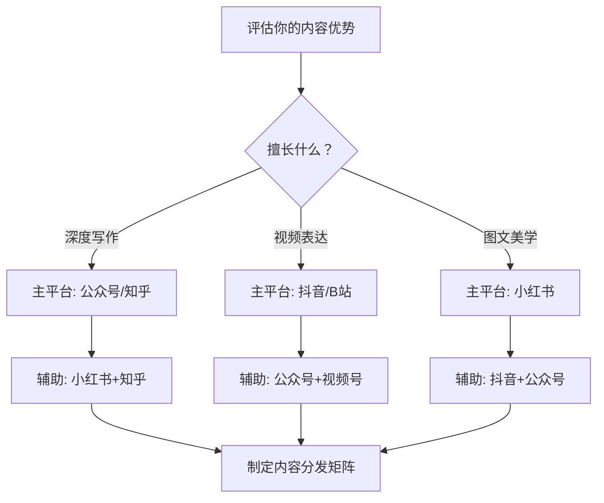
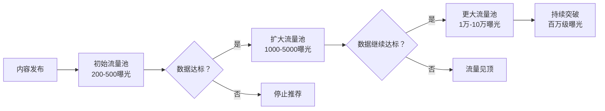
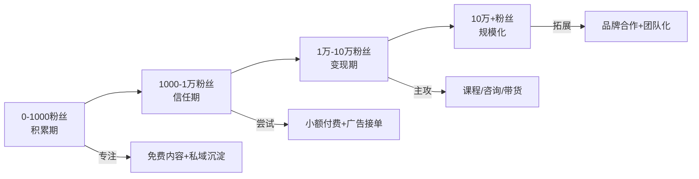
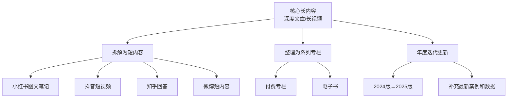

## 三、社交媒体运营

社交媒体是个人品牌从"被少数人知道"到"被目标受众广泛认知"的核心杠杆。你可能在某个领域有深厚的专业积累，但如果这些积累只停留在你的脑子里或者本地文件夹里，它们对你的品牌价值贡献接近于零。社交媒体运营的本质，是将你的专业价值进行系统化的外化和传播，让对的人在对的场景下看到你、信任你、选择你。

本章将从平台选择、内容体系、运营节奏、互动管理、数据分析、增长策略、变现路径、危机应对八个维度，构建一套完整的社交媒体运营方法论。

### 3.1 平台选择与定位策略

#### 3.1.1 主流平台特性对比

不同平台的内容形态、用户画像和算法逻辑差异巨大。选错平台意味着你的内容可能永远触达不到目标受众。以下是主要平台的核心特性对比：

| 平台 | 核心内容形态 | 用户画像 | 算法偏好 | 适合的个人品牌类型 | 内容生命周期 |
|------|------------|---------|---------|-------------------|------------|
| 微信公众号 | 长图文、深度文章 | 25-45岁，职场人士为主 | 社交推荐+订阅 | 专业知识型、思想领袖型 | 长（可被搜索持续获取流量） |
| 抖音 | 短视频（15s-10min） | 18-40岁，覆盖面最广 | 兴趣推荐，完播率优先 | 视觉化强的技能展示、生活方式 | 短（48小时内爆发，之后衰减） |
| 小红书 | 图文笔记+短视频 | 18-35岁，女性用户占比超70% | 搜索+推荐双引擎 | 生活方式、美学、实用攻略 | 中长（搜索属性强，长尾流量好） |
| B站 | 中长视频（5-30min） | 18-30岁，学生和年轻职场人 | 完播率+互动深度 | 深度教学、技术分享、文化评论 | 长（知识类内容搜索流量持续） |
| 知乎 | 问答+专栏文章 | 22-40岁，高学历人群 | 搜索+专业度加权 | 专业领域深度解答 | 很长（SEO友好，搜索流量持续） |
| 微博 | 短内容+图文+视频 | 全年龄段，偏时事关注者 | 热点+社交传播 | 热点评论、行业观察 | 很短（几小时即被覆盖） |
| 视频号 | 短视频+直播 | 30-55岁，微信生态用户 | 社交推荐+兴趣推荐 | 职场经验、商业洞察 | 中（微信社交链加持） |

#### 3.1.2 平台组合策略

**不要试图同时运营所有平台。** 资源有限的情况下，选择一个主平台深耕、一到两个辅助平台分发内容是更明智的策略。

平台组合的三个原则：

**原则一：主平台匹配你的内容优势。** 如果你擅长深度写作，公众号或知乎作为主平台；如果镜头表现力强，抖音或B站更合适；如果擅长制作精美图文，小红书是首选。

**原则二：辅助平台选择内容可复用的。** 公众号的长文可以拆解为小红书的图文笔记；B站的视频可以剪辑为抖音的短视频。选择内容形态相近的平台组合，降低多平台运营的成本。

**原则三：辅助平台选择用户画像有差异的。** 主平台和辅助平台的用户最好有互补性。比如主攻B站（年轻技术人群）+小红书（泛生活方式人群），可以覆盖不同维度的目标受众。

#### 3.1.3 账号定位一句话公式

在任何平台上建立账号之前，先用一句话说清楚你的定位：

> **我是谁 + 我为谁 + 提供什么价值 + 凭什么信我**

示例：
- "前大厂架构师，帮 3 年经验的开发者建立系统化技术思维"
- "心理咨询师，用通俗心理学帮职场人化解人际内耗"
- "10 年供应链从业者，给跨境卖家拆解降本增效的真实案例"

这句话不需要出现在你的个人简介里，但它决定了你后续所有内容的方向。每次写内容之前，问自己：这个内容是否服务了我的定位？

### 3.2 内容体系搭建

#### 3.2.1 内容支柱模型

个人品牌的内容不应该是随机灵感的产物，而应该围绕 3-5 个「内容支柱」系统产出。内容支柱是你所在领域的核心话题群，每个支柱下包含若干子话题。

**搭建步骤：**

1. **列出你的专业领域中，目标受众最关心的 5-10 个问题**
2. **将这些问题归类为 3-5 个主题群**
3. **每个主题群构成一个内容支柱**
4. **每个支柱下规划 10-20 个具体选题**

以「个人理财」领域为例：

| 内容支柱 | 子话题示例 | 内容类型 |
|---------|----------|---------|
| 基础知识 | 复利原理、资产配置、风险评估 | 科普图文、概念讲解视频 |
| 实操工具 | 记账方法、基金筛选、保险对比 | 教程、工具推荐、对比表格 |
| 案例分析 | 真实理财案例复盘、踩坑故事 | 故事型内容、深度分析 |
| 行业观察 | 政策解读、市场趋势、新品点评 | 热点评论、趋势分析 |
| 个人成长 | 理财心态、消费观念、财务自由路径 | 价值观输出、经验分享 |

#### 3.2.2 内容类型矩阵

不同类型的内容服务于不同的运营目标。一个成熟的内容体系应该包含以下四种类型：

| 内容类型 | 目标 | 占比建议 | 特征 | 示例 |
|---------|------|---------|------|------|
| 引流型 | 吸引新用户 | 40% | 话题性强、易传播、贴近热点 | "为什么你的简历总被刷？HR不会告诉你的5个真相" |
| 信任型 | 建立专业信任 | 30% | 深度分析、有数据支撑、逻辑严密 | "深度拆解：2024年新能源行业的真实利润率" |
| 互动型 | 提升粉丝粘性 | 20% | 引发讨论、投票、问答、挑战 | "月薪1万和月薪3万的人，差距到底在哪？" |
| 转化型 | 促进变现 | 10% | 直接展示服务/产品价值、限时优惠 | "我的一对一咨询服务上线了，前10名8折" |

**关键原则：引流型内容负责拉新，信任型内容负责留存，互动型内容负责活跃，转化型内容负责变现。** 四种类型缺一不可，只写引流型内容会变成"有流量没价值"的空心账号，只写信任型内容会变成"有深度没流量"的小众账号。

#### 3.2.3 选题方法论

选题决定了内容的上限。一个好选题应该同时满足三个条件：**受众需要、你能提供、竞争不过你**。

**选题的六个来源：**

1. **搜索数据**：用 5118、百度指数、知乎搜索、小红书搜索查看你的领域中有哪些高搜索量的关键词。有搜索量意味着有持续的需求。
2. **评论区挖掘**：你自己和同领域其他创作者的评论区，是天然的选题库。读者提出的问题、质疑、补充，都是真实需求的映射。
3. **行业报告和新闻**：关注行业报告、政策变动、重大事件，及时输出你的专业解读。
4. **个人经历**：你踩过的坑、走过的弯路、做过的决策，是最有说服力的内容素材。
5. **竞品分析**：研究同领域头部账号的高互动内容，不是抄，而是找到他们的选题逻辑和角度。
6. **跨界迁移**：从其他领域借鉴框架和思维方式，应用到你的领域中。比如用产品经理思维讲职业规划，用数据分析思维讲健身减脂。

### 3.3 理解平台算法

#### 3.3.1 算法的基本逻辑

所有内容平台的算法本质上都在做同一件事：**将合适的内容匹配给合适的人，最大化用户的平台停留时长。** 理解这个底层逻辑，你就理解了为什么算法偏爱某些内容。

以抖音和小红书为例，内容的推荐流程大致如下：

**算法关注的核心指标：**

| 指标 | 含义 | 优化方向 |
|------|------|---------|
| 点击率（CTR） | 曝光后被点击的比例 | 优化标题和封面 |
| 完播率/阅读完成率 | 用户看完全文/视频的比例 | 优化内容节奏，前3秒抓住注意力 |
| 互动率 | 点赞+评论+收藏+转发的综合比率 | 在内容中设置互动触发点 |
| 关注转化率 | 看完内容后关注账号的比例 | 强化个人IP识别度 |
| 停留时长 | 用户在内容上花费的时间 | 增加内容深度和信息密度 |

#### 3.3.2 各平台算法差异与应对

**抖音/快手**：完播率是第一优先级。对策是前3秒必须有强钩子（悬念、冲突、反常识），视频长度控制在用户耐心范围内，结尾设置引导互动的话术。

**小红书**：搜索流量占比高，标题和正文中的关键词布局至关重要。对策是研究目标关键词的搜索量，在标题和正文前两行自然嵌入核心关键词。

**公众号**：社交推荐（"看一看"、朋友圈转发）的权重在增加。对策是创作能引发共鸣、让人愿意转发的内容，在文末设置明确的转发引导。

**B站**：弹幕和评论的密度影响推荐。对策是在视频中设置"弹幕触发点"（比如提问、争议性观点、彩蛋），引导观众发弹幕互动。

**知乎**：回答的专业度和点赞数决定排序。对策是回答要有独家见解或详实的数据支撑，而不是泛泛而谈。

### 3.4 运营节奏与内容日历

#### 3.4.1 更新频率选择

**日更 vs 周更 vs 双周更**，选择哪种取决于你的内容类型、精力和平台特性。

| 更新频率 | 适合场景 | 优势 | 风险 |
|---------|---------|------|------|
| 日更 | 短视频平台、资讯类内容 | 快速积累曝光，算法友好 | 质量容易下滑，创作者容易倦怠 |
| 每周2-3次 | 中等深度内容（图文+短视频） | 平衡质量和数量 | 需要稳定的选题和产出流程 |
| 每周1次 | 深度长文、长视频 | 保证质量，适合精品路线 | 增长速度较慢，需要更长时间积累 |
| 双周/月更 | 高制作成本内容（纪录片式视频） | 单篇质量极高 | 对内容质量要求极高，否则容易被遗忘 |

**建议**：如果你是刚开始运营的新手，选择每周 2-3 次的节奏。频率够高以积累数据和经验，又不至于因为压力过大而放弃。等你建立了稳定的创作流程后，再根据数据决定是否调整频率。

#### 3.4.2 发布时间优化

发布时间影响初始流量池的数据表现，进而影响算法推荐。但不存在"万能最佳时间"，只有**适合你目标受众的时间**。

**确定最佳发布时间的方法：**

1. **初始阶段**：参考行业通用数据发布内容
   - 工作日：早 7:00-9:00（通勤时间）、午 12:00-13:30（午休）、晚 20:00-22:00（休闲时间）
   - 周末：上午 10:00-12:00、下午 15:00-17:00、晚上 20:00-23:00
2. **数据积累阶段**：连续发布 30 天后，对比不同时间段发布的内容数据
3. **优化阶段**：锁定 2-3 个最佳时间段，固定发布

**注意**：不同平台的最佳时间不同。抖音用户活跃时间偏晚（21:00-23:00），小红书用户午间活跃度高（12:00-13:00），B站用户晚间活跃（19:00-23:00）。一定要根据你的具体平台和受众数据来确认。

#### 3.4.3 内容日历系统

内容日历不是简单的"哪天发什么"，而是一个包含选题、制作、审核、发布、复盘全流程的管理系统。

**内容日历模板：**

| 日期 | 平台 | 内容类型 | 选题 | 关键词 | 状态 | 发布时间 | 数据反馈 |
|------|------|---------|------|--------|------|---------|---------|
| 周一 | 公众号 | 信任型·深度分析 | 2024年Q3行业趋势 | 行业趋势、Q3分析 | 已发布 | 08:00 | 阅读3200，转发89 |
| 周二 | 小红书 | 引流型·实用攻略 | 5个提升效率的工具 | 效率工具、提升效率 | 制作中 | 12:30 | — |
| 周四 | B站 | 信任型·教程 | 从零搭建个人知识体系 | 知识管理、个人成长 | 选题通过 | 19:00 | — |
| 周五 | 公众号 | 互动型·问答 | 粉丝问题精选第12期 | 精选问答 | 规划中 | 20:00 | — |

**批量生产技巧**：不要每天想今天发什么。建议每周日晚上花 1-2 小时做一次集中选题和排期，然后按计划执行。批量选题比零散选题效率高 3-5 倍，因为你可以从全局视角分配内容类型和节奏。

### 3.5 互动管理

#### 3.5.1 评论区运营

评论区不是附属品，而是内容的延伸。一条精彩的评论回复，其价值可能超过内容本身。评论区是展示你人格魅力和专业深度的第二战场。

**评论回复的四个层次：**

| 层次 | 回复方式 | 效果 | 示例 |
|------|---------|------|------|
| 基础层 | 简单感谢 | 维持基本礼貌 | "谢谢支持！" |
| 进阶层 | 针对性回应 | 展示你在关注读者 | "你提到的这个角度很有意思，确实很多人忽略了……" |
| 专业层 | 补充知识 | 增强专业权威感 | "你问的这个问题很好，简单说……详细的内容我后续单独写一篇" |
| 互动层 | 引发讨论 | 带动评论区氛围 | "你觉得A和B哪个更适合新手？我倾向于A，理由是……" |

**评论区运营的三条铁律：**

1. **发布后 2 小时内是黄金回复期**。这段时间算法正在根据初始数据决定是否扩大推荐，高质量的评论互动能显著提升内容的初始数据表现。
2. **负面评论是展示格局的机会**。面对质疑和批评，冷静、专业、有理有据的回复，往往比正面评论更能赢得旁观者的好感。但纯粹的人身攻击和恶意骚扰，不需要回复，直接删除或拉黑。
3. **主动在评论区埋设讨论话题**。在内容末尾或评论区置顶一条引导性评论，比如"你们觉得这个方法在XX场景下适用吗？"，降低读者参与讨论的门槛。

#### 3.5.2 私信管理

私信是高价值互动通道。关注私信的人，通常已经对你的内容产生了较强的信任感。

**私信分类处理策略：**

| 私信类型 | 处理方式 | 响应时间 |
|---------|---------|---------|
| 咨询类（问专业问题） | 给出简要回答，引导到付费咨询或详细文章 | 24小时内 |
| 合作类（商务合作） | 了解对方需求后判断是否匹配，匹配则进入商务流程 | 48小时内 |
| 求助类（个人困境） | 共情+简要建议，严重问题引导专业渠道 | 24小时内 |
| 好评类（表达感谢） | 真诚回复，适当引导关注/转发 | 当天 |
| 骚扰/广告 | 不回复，直接拉黑或举报 | — |

**自动回复设置建议**：在公众号、抖音等支持自动回复的平台，设置欢迎语。欢迎语应包含：感谢关注 + 你提供什么价值 + 如何找到你的核心内容（关键词回复或菜单引导）。不要在自动回复中堆砌太多信息，简洁清晰即可。

#### 3.5.3 社群运营

社群是将"弱关系粉丝"转化为"强关系用户"的关键环节。一个活跃的社群，可以成为你内容的放大器、产品的试验田、变现的基础盘。

**社群运营的四个阶段：**

**阶段一：冷启动（0-100 人）**
- 从你的铁杆粉丝中邀请首批成员
- 设置明确的入群门槛（关注时间、互动次数等）
- 亲自参与每一次讨论，营造活跃氛围
- 每天至少发布一条独家内容或话题

**阶段二：活跃期（100-500 人）**
- 培养 5-10 名核心活跃成员作为"社群志愿者"
- 固定栏目：每周话题讨论、每月分享会、新人自我介绍
- 建立群规，及时清理广告和违规内容
- 开始尝试小规模的付费活动（如限时免费的直播答疑）

**阶段三：规模化（500-2000 人）**
- 按主题或需求建立分群（如交流群、学习群、行业群）
- 引入 SOP 和自动化工具（如入群自动欢迎、关键词自动回复）
- 定期组织线上线下活动
- 开始搭建社群变现模型（付费社群、会员制）

**阶段四：生态化（2000 人以上）**
- 社群本身成为品牌资产
- 培养社群内的 KOL 和内容贡献者
- 建立社群文化认同（专属称呼、内部梗、年度活动）
- 社群成为核心用户池，反哺内容创作和产品研发

**社群生命周期管理**：大多数社群的活跃周期是 3-6 个月，之后会逐渐沉寂。要提前规划社群的迭代节奏，定期注入新的话题、活动和成员，保持社群的新鲜感。

### 3.6 数据分析框架

#### 3.6.1 核心指标体系

数据分析的目标不是"看数据"，而是"从数据中提取可执行的洞察"。以下是个人品牌运营需要关注的核心指标，分为三层：

| 指标层级 | 核心指标 | 计算方式 | 反映的问题 |
|---------|---------|---------|----------|
| 增长层 | 粉丝增长率 | 本周新增粉丝 / 上周总粉丝数 × 100% | 账号整体增长是否健康 |
| 增长层 | 内容曝光量 | 所有内容的总曝光次数 | 内容触达范围 |
| 互动层 | 互动率 | (点赞+评论+收藏+转发) / 曝光量 × 100% | 内容质量和受众匹配度 |
| 互动层 | 完播率/阅读完成率 | 看完全文或视频的用户比例 | 内容吸引力和节奏控制 |
| 互动层 | 评论质量 | 有效评论（非灌水）占总评论比例 | 内容是否引发了深度思考 |
| 转化层 | 关注转化率 | 新增粉丝 / 内容曝光量 × 100% | 个人IP吸引力 |
| 转化层 | 私域转化率 | 进入私域（社群/微信）的粉丝比例 | 粉丝信任深度 |
| 转化层 | 付费转化率 | 付费用户 / 总粉丝数 × 100% | 变现能力 |

**新手优先关注三个指标**：互动率、关注转化率、粉丝增长率。这三个指标综合反映了"你的内容是否被对的人看到并认可"。

#### 3.6.2 数据分析周期和方法

**每日监控（5 分钟）**：
- 查看当日发布内容的即时数据（播放量、点赞、评论）
- 回复评论区的高质量评论
- 发现异常数据（突然暴跌或暴涨）及时分析原因

**每周分析（30 分钟）**：
- 整理本周所有内容的核心数据到表格
- 标记表现最好和最差的内容
- 分析高表现内容的共性（选题类型、标题风格、发布时间）
- 下周选题调整计划

**每月复盘（1-2 小时）**：
- 月度数据趋势分析（粉丝增长曲线、互动率变化）
- 内容类型效果对比（引流型 vs 信任型 vs 互动型的数据差异）
- 竞品账号横向对比（同领域头部账号的近期动态）
- 下月运营策略调整

**数据分析的五个关键问题**（每周分析时务必回答）：

1. 本周哪篇内容表现最好？为什么？
2. 本周哪篇内容表现最差？和最好的相比差在哪？
3. 粉丝增长的主要来源是哪些内容？
4. 评论区最常见的反馈或问题是什么？
5. 有没有意外的数据发现（某个旧内容突然获得流量）？

#### 3.6.3 数据工具推荐

| 工具 | 功能 | 适用平台 | 费用 |
|------|------|---------|------|
| 平台自带后台 | 基础数据分析 | 全平台 | 免费 |
| 新榜 | 多平台数据监测、排行 | 微信/抖音/快手/小红书 | 基础免费，高级付费 |
| 飞瓜数据 | 抖音/快手深度分析 | 抖音、快手 | 付费 |
| 灰豚数据 | 小红书数据分析 | 小红书 | 付费 |
| 蝉妈妈 | 抖音电商数据分析 | 抖音 | 付费 |
| 5118 | 关键词挖掘、SEO分析 | 全网搜索 | 基础免费，高级付费 |
| Google Trends | 搜索趋势分析 | 全网 | 免费 |
| Excel/飞书表格 | 自建数据追踪表 | 通用 | 免费 |

**建议**：新手阶段使用平台自带后台 + 一个免费的关键词工具（如 5118 免费版）就足够了。不要在数据工具上花太多钱，等你的账号有了稳定的收入后再考虑付费工具。

### 3.7 粉丝增长策略

#### 3.7.1 内容驱动增长

内容是最根本的增长引擎。以下是经过验证的内容增长技巧：

**标题优化**：在信息流中，用户决定是否点击你的内容只有 0.5-2 秒的时间。标题（和封面）决定了这 0.5 秒内用户的选择。

高效标题的五个公式：

| 公式 | 结构 | 示例 |
|------|------|------|
| 数字+利益 | N个方法/技巧/秘诀+获得什么 | "7个让你薪资翻倍的谈判技巧" |
| 痛点+方案 | 问题描述+解决承诺 | "总是加班到深夜？这3个时间管理法帮你准点下班" |
| 反常识 | 打破预期的认知冲击 | "为什么我劝你不要考研？一个过来人的真心话" |
| 对比冲突 | A vs B的戏剧性对比 | "月薪5千和月薪5万的人，每天早上做的第一件事完全不同" |
| 悬念+好奇 | 留白，激发好奇心 | "我花了3年才明白的职场真相，后悔知道太晚" |

**封面设计**：短视频和图文平台的封面是"第二标题"。好的封面应满足：
- 信息清晰：文字够大、够少、够醒目（手机屏幕上能看清）
- 情绪触发：使用能引发好奇、惊讶、共鸣的表情或画面
- 风格统一：形成视觉识别，让粉丝在信息流中一眼认出你

#### 3.7.2 互动驱动增长

**与同类创作者互动**不是"蹭流量"，而是社交平台的基本生存法则。算法会将你的互动行为作为推荐信号，与高质量账号互动有助于提升你自己的账号权重。

具体做法：
- 在同领域大号的评论区发表有深度的评论（不是"写得好"，而是补充观点、提出有价值的质疑）
- 参与平台话题挑战和活动
- 主动与其他创作者进行内容合作（互相推荐、联合直播、共同创作）
- 在你的内容中引用和@其他创作者，建立社交链接

#### 3.7.3 跨平台引流

跨平台引流的核心逻辑：**在每个平台提供"不完整的价值"，引导用户去你的主平台获取完整价值。**

实操方法：
- 在小红书发布干货图文，末尾引导"完整版在公众号"
- 在抖音发布短视频，引导"详细教程在B站"
- 在知乎回答问题，签名区放公众号名称
- 在所有平台的个人简介中统一放置主平台入口

**注意事项**：各平台对外部引流都有不同程度的限制。避免在正文中直接放微信号或二维码（容易被限流甚至封号），改用谐音、图片水印、个人主页链接等更隐蔽的方式。

#### 3.7.4 SEO 思维

SEO（搜索引擎优化）不只是网站的事。小红书、知乎、B站、抖音都有自己的搜索系统，搜索流量是高质量的长尾流量。

**平台内 SEO 的关键动作：**

1. **关键词研究**：使用平台搜索框的下拉联想词、5118 等工具，找到你的领域中搜索量大但竞争不激烈的长尾关键词。
2. **标题嵌入关键词**：将核心关键词自然地写入标题，不要堆砌。
3. **正文关键词布局**：在正文的前 200 字内出现核心关键词，全文中自然出现 3-5 次。
4. **标签和话题**：选择与关键词匹配的标签和话题，增加搜索入口。
5. **持续更新**：搜索排名偏爱持续更新的活跃账号。

### 3.8 变现路径设计

#### 3.8.1 变现的阶段性

变现不是"等粉丝多了再想"的事情，而应该从第一天就有规划。但变现方式应随粉丝量级递进：

#### 3.8.2 五种主要变现方式

| 变现方式 | 适合阶段 | 收入潜力 | 难度 | 说明 |
|---------|---------|---------|------|------|
| 广告/品牌合作 | 1万粉丝+ | 中等 | 低 | 品牌方付费推广，报价通常为粉丝数×0.03-0.1元/条 |
| 知识付费（课程/专栏） | 3000粉丝+ | 高 | 中 | 制作一次，持续售卖，边际成本接近零 |
| 咨询/教练服务 | 1000粉丝+ | 高 | 中 | 一对一或小组形式，客单价高但受限于时间 |
| 社群/会员制 | 5000粉丝+ | 中高 | 中 | 付费社群、会员专栏，提供持续价值 |
| 电商/带货 | 1万粉丝+ | 高 | 高 | 自有产品或佣金带货，需要供应链能力 |

**最重要的一点**：不要在信任建立之前就开始变现。过早的商业化会透支粉丝信任，导致取关和负面口碑。变现的节奏应该是：**先持续输出免费价值 → 建立信任和口碑 → 提供小额付费产品测试意愿 → 逐步增加变现比重**。

### 3.9 危机应对与口碑管理

#### 3.9.1 常见危机类型

| 危机类型 | 触发原因 | 严重程度 | 应对策略 |
|---------|---------|---------|---------|
| 内容争议 | 观点引发争议或被断章取义 | 中 | 不删帖，发布澄清说明，态度诚恳 |
| 事实错误 | 内容中出现数据或事实性错误 | 中 | 及时更正并道歉，说明错误原因 |
| 负面评价 | 产品/服务未达预期 | 中-高 | 私下沟通解决，公开回应表明态度 |
| 舆论攻击 | 被竞争对手或恶意账号攻击 | 高 | 不参与骂战，收集证据，必要时法律维权 |
| 违规处罚 | 违反平台规则被限流或封号 | 高 | 了解违规原因，提交申诉，准备备用账号 |

#### 3.9.2 危机应对原则

**黄金四小时法则**：社交媒体上的危机传播速度极快，4 小时内不回应，舆论就可能失控。

**应对三步法**：

1. **第一时间表态**（4小时内）：表明你已经关注到问题，正在了解情况。不需要在第一时间给出完整的解决方案，但必须表态。
2. **给出事实和方案**（24小时内）：基于事实给出解释或解决方案。不要推诿、不要狡辩、不要卖惨。
3. **持续跟进**（后续几天）：持续跟进问题的解决进展，直到事件完全平息。

**绝对不要做的事**：
- 删除负面评论或帖子（除非是明显的恶意攻击和造谣），删帖会被截图传播，加剧危机
- 在情绪激动时回应，先冷静再回应
- 用小号或水军反击，一旦被发现将造成不可挽回的信任损失

#### 3.9.3 日常口碑维护

与其在危机发生后救火，不如在日常做好口碑维护：

- **定期搜索自己的名字/品牌名**：使用各平台搜索功能，查看是否有你不知道的负面信息。
- **建立正面内容矩阵**：在多个平台持续输出正面、专业的内容，形成"信息护城河"。即使出现负面信息，搜索结果中你的正面内容也会排在前面。
- **与粉丝建立真实关系**：铁杆粉丝是最有效的危机公关力量。在危机发生时，他们会自发为你辩护。

### 3.10 工具与效率提升

#### 3.10.1 内容创作工具

| 工具类别 | 推荐工具 | 用途 |
|---------|---------|------|
| 文案写作 | Notion、飞书文档、语雀 | 选题管理、内容撰写、团队协作 |
| 图片设计 | Canva、创客贴、稿定设计 | 封面设计、信息图、社交媒体图片 |
| 视频剪辑 | 剪映（手机+PC）、Final Cut Pro、DaVinci Resolve | 短视频和长视频剪辑 |
| 排版工具 | 秀米、135编辑器、壹伴 | 公众号排版 |
| AI辅助 | ChatGPT、Claude、Kimi | 选题灵感、文案润色、数据分析 |

#### 3.10.2 运营效率工具

| 工具类别 | 推荐工具 | 用途 |
|---------|---------|------|
| 多平台管理 | 蚁小二、融媒宝 | 一键多平台发布 |
| 数据监控 | 新榜、飞瓜、灰豚 | 多平台数据追踪 |
| 社群管理 | 微伴助手、句子互动 | 群管理自动化 |
| 排期工具 | 飞书日历、Notion Calendar | 内容日历管理 |
| 素材管理 | Eagle、Billfish | 图片和视频素材库管理 |

#### 3.10.3 AI 辅助运营

AI 工具正在深度改变内容创作和运营的效率。以下是 AI 在社交媒体运营中的具体应用场景：

**内容创作环节**：
- **选题扩展**：给 AI 你的领域和目标受众，让它生成 50 个选题，你从中筛选
- **大纲生成**：选定选题后，让 AI 生成内容大纲，你在此基础上调整和补充
- **文案润色**：写完初稿后，让 AI 检查逻辑漏洞、优化表达
- **标题生成**：让 AI 生成 10 个标题变体，你选择最佳的一个

**数据分析环节**：
- **数据解读**：将数据表格交给 AI 分析趋势和异常
- **竞品分析**：让 AI 对比你和竞品账号的内容策略差异
- **报告生成**：让 AI 将原始数据整理成可视化报告

**注意事项**：AI 是工具，不是替代品。AI 生成的内容缺乏个人经历和独特观点，直接发布会让读者感受到"AI味"，降低信任感。正确的用法是：**AI 负责效率，你负责灵魂。** 用 AI 加速结构搭建和资料整理，用你的经验、观点和人格魅力填充内容的核心。

### 3.11 常见误区与纠正

| 误区 | 错误做法 | 正确做法 |
|------|---------|---------|
| 追求全平台覆盖 | 同时运营 6-7 个平台，每个都做不好 | 选 1 个主平台+1-2 个辅助平台，做深做透 |
| 只看粉丝数量 | 10 万粉丝但互动率不到 1% | 1 万精准粉丝但互动率 5% 以上，变现能力更强 |
| 内容搬运 | 搬运其他平台或账号的内容 | 学习优秀内容的框架，用自己的语言和经验重新创作 |
| 过度追热点 | 什么火写什么，和定位无关 | 只追与你的领域相关的热点，从专业角度解读 |
| 忽视数据 | 凭感觉创作，不看数据反馈 | 每周分析数据，用数据指导内容优化 |
| 过早变现 | 刚有 500 粉丝就开始卖课 | 先积累信任和口碑，至少 3000 粉丝后开始小额测试 |
| 不做互动 | 发完内容就走，不回复评论 | 发布后 2 小时内积极回复评论，带动讨论氛围 |
| 急于求成 | 发了 10 条内容没涨粉就放弃 | 社交媒体运营是长期投资，至少坚持 3-6 个月才能看到明显效果 |
| 内容同质化 | 照搬同领域头部账号的内容风格 | 找到自己的差异化角度和表达风格 |
| 忽视平台规则 | 不了解平台的审核和推荐规则 | 每个平台花 1 小时阅读官方创作者指南，避免违规 |

### 3.12 进阶策略

#### 3.12.1 IP 矩阵化

当你的主账号发展到一定阶段（通常 5 万粉丝以上），可以考虑建立账号矩阵：

- **主账号**：你的核心品牌阵地，承载最重要的内容和 IP 形象
- **子账号 1**：聚焦某个细分领域，吸引垂直人群
- **子账号 2**：不同平台的差异化账号，覆盖不同用户群
- **员工号/矩阵号**：团队成员以统一品牌但不同人设运营的账号

矩阵化的核心价值：降低单账号风险（被封号不会全军覆没），覆盖更多细分受众，为不同变现路径提供独立的流量入口。

#### 3.12.2 内容复利系统

一份高质量的内容不应该只用一次。建立内容复利系统：

1. **核心内容（长文/长视频）** → 拆解为 3-5 条短内容（小红书笔记/抖音短视频）
2. **系列内容** → 整理为合集/专栏（公众号付费专栏/B站合集）
3. **高互动内容** → 迭代更新（每年更新一次数据和案例，持续获取流量）
4. **社群讨论精华** → 二次加工为正式内容

#### 3.12.3 从个人到团队

当社交媒体运营开始产生稳定收入，你需要考虑从"一个人做所有事"转变为"团队协作"。这个转变通常发生在月收入稳定在 2 万元以上时。

**团队分工建议**：

| 角色 | 职责 | 招聘优先级 |
|------|------|----------|
| 内容助理 | 选题搜集、初稿撰写、素材整理 | 第一优先 |
| 剪辑/设计 | 视频剪辑、封面设计、排版 | 第二优先 |
| 运营助理 | 评论回复、社群管理、数据统计 | 第三优先 |
| 商务 | 广告对接、合作洽谈 | 第四优先 |

**核心原则**：内容创作（尤其是选题和核心观点）必须由你本人把控，这是你个人品牌的核心资产。可以外包的是执行层面的工作（剪辑、排版、数据统计），不可以外包的是思想层面的工作（观点、经验、人格魅力）。

### 3.13 行动清单

完成本章阅读后，按以下顺序执行：

1. **本周内**：确定你的主平台和 1-2 个辅助平台
2. **本周内**：用"一句话公式"写出你的账号定位
3. **本周内**：建立 3-5 个内容支柱，每个支柱下规划 10 个选题
4. **本周内**：在主平台完善个人主页（头像、简介、背景图）
5. **下周起**：按每周 2-3 次的频率开始发布内容
6. **一个月后**：做第一次数据分析复盘，调整内容策略
7. **三个月后**：评估是否增加频率、扩展平台或开始变现测试

社交媒体运营是一场马拉松，不是百米冲刺。坚持 3 个月你会看到初步效果，坚持 6 个月你会建立稳定的流量基础，坚持 1 年以上你会拥有真正的品牌资产。

***
