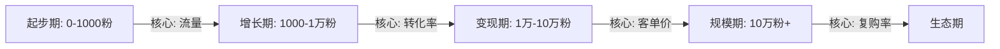
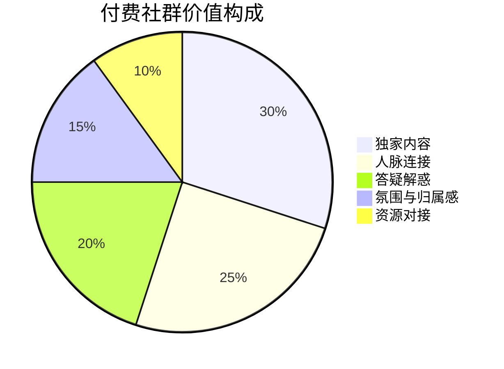
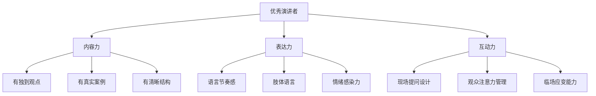
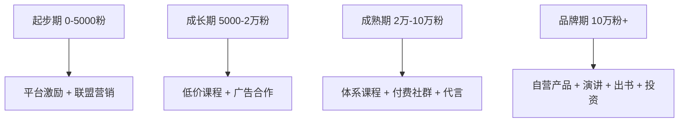

## 四、品牌变现路径

个人品牌的终极价值体现在变现能力上。没有变现的品牌是空中楼阁——你无法持续投入时间精力去维护一个不产生回报的品牌。但变现不是终点，而是品牌飞轮加速转动的起点：收入让你投入更多资源，更多资源产出更好的内容，更好的内容吸引更多受众，更多受众带来更高收入。

理解变现的本质，才能选择正确的路径。本节将从变现的底层逻辑出发，逐一拆解六大变现路径的原理、方法、实操和陷阱。

### 4.1 变现的底层逻辑

#### 4.1.1 信任经济模型

个人品牌变现的本质是**信任的货币化**。用户为你付费，买的不是内容本身，而是对你的信任。这个信任包括三个层面：

| 信任层级 | 含义 | 变现对应 |
|---------|------|---------|
| 认知信任 | 我知道你很专业 | 低客单价产品（免费内容引流、低价课程） |
| 情感信任 | 我喜欢你的风格和价值观 | 中客单价产品（付费社群、年度会员） |
| 行为信任 | 我愿意把钱交给你来解决问题 | 高客单价产品（咨询、定制方案、企业合作） |

不同变现路径对应不同的信任层级。很多人的变现效率低，根本原因是用低信任层级去推高信任产品——读者刚关注你，你就卖几千块的课程，转化率自然惨淡。

#### 4.1.2 变现公式

个人品牌收入可以用一个公式来理解：

月收入 = 流量 × 转化率 × 客单价 × 复购率

- **流量**：有多少人知道你（粉丝数、阅读量、搜索排名）
- **转化率**：知道你的人中有多少愿意付费（通常 1%-5%）
- **客单价**：每个人愿意付多少钱
- **复购率**：付费用户中有多少会再次购买

提升任何一个变量都能增加收入，但不同阶段的侧重点不同：

#### 4.1.3 变现时机判断

不是粉丝越多越好，而是信任越深越好。以下是开始变现的信号：

**可以开始变现的信号：**
- 有人主动私信问你能不能提供付费服务
- 你的免费内容下出现"能不能出个更详细的"类评论
- 你已经有了稳定的更新频率且持续3个月以上
- 你有明确的专业领域且在该领域有一定口碑
- 你的时间开始不够用（免费答疑太多）

**还不适合变现的信号：**
- 发了内容几乎无人互动
- 你还没有明确的专业定位
- 你的内容质量还不稳定
- 你只是想快速赚钱而不是真正提供价值

### 4.2 路径一：知识付费

知识付费是个人品牌最主流的变现方式，因为它门槛相对较低、利润率高（数字产品边际成本趋近于零）、且能直接放大你的专业价值。

#### 4.2.1 在线课程

**为什么课程是知识付费的核心？**

一门好的课程等于把你的时间复制了无数次。你花40小时录制一门课程，100个人购买，相当于你用40小时换来了100份收入。而如果用一对一咨询的方式，40小时最多服务20个人（每人2小时）。

**课程开发的完整流程：**

**第一步：需求验证（1-2周）**

在投入大量时间制作课程之前，先验证需求：

1. 在你的内容评论区和私信中，统计被问得最多的问题
2. 在知乎、小红书搜索你的领域关键词，看哪些问题有高赞回答但回答质量一般
3. 做一个简单的问卷调查（问卷星、腾讯问卷），问粉丝"你最想学什么"
4. 在朋友圈/社群发一个预售海报，看有多少人表示感兴趣

**验证标准**：如果问卷回收100+份，且至少30%的人选了同一个主题，这个需求就是真实的。

**第二步：课程大纲设计**

好的课程大纲遵循"问题导向"而非"知识导向"：

❌ 知识导向：
  第一章：什么是品牌定位
  第二章：品牌定位的理论基础
  第三章：品牌定位的方法论

✅ 问题导向：
  第一章：你到底要帮谁解决什么问题？（定位三问）
  第二章：如何找到你的差异化优势？（竞品分析模板）
  第三章：一句话说清你是谁？（定位语公式）

**第三步：内容制作**

| 内容类型 | 制作工具 | 适用场景 | 预算 |
|---------|---------|---------|------|
| 录屏教学 | OBS（免费）、Camtasia | 软件操作、数据分析类 | 0-500元 |
| 真人出镜 | 手机/相机 + 补光灯 + 麦克风 | 思维类、故事类 | 500-3000元 |
| 图文PPT | Canva、Keynote + 录音 | 知识梳理、框架讲解 | 0-200元 |
| 直播授课 | 小鹅通、知识星球直播 | 互动性强的内容 | 0-500元/年 |

**新手建议**：不要追求完美制作。第一版课程用手机+PPT就够了，先验证市场反馈，再迭代升级。很多月入十万的知识博主，第一版课程就是在出租屋里用手机录的。

**第四步：平台选择与定价**

| 平台 | 抽成比例 | 适合谁 | 优势 |
|------|---------|-------|------|
| 小鹅通 | 0%（SaaS收费） | 有自己流量的人 | 完全自主，功能全面 |
| 知识星球 | 5% | 社群型内容 | 自带社区功能 |
| 得到 | 50%+ | 顶级知识IP | 平台流量大 |
| 腾讯课堂 | 10-30% | 技能培训类 | 流量大，搜索曝光 |
| B站课堂 | 30% | 年轻受众 | 平台用户活跃 |
| 自建网站 | 0% | 有技术能力的人 | 完全掌控 |

**定价策略**：

- **引流课**（9.9-49元）：短小精悍，解决一个具体问题，目的是获取用户和建立信任
- **系统课**（199-699元）：完整体系，10-30节，解决一个领域的核心问题
- **高端课**（999-4999元）：深度内容+社群+答疑+作业批改，重服务
- **训练营**（2000-10000元）：限时限量，高互动，强交付

**定价原则**：先低后高。第一门课定价 199 元以下，跑通流程后再涨价。不要一开始就定 999 元——除非你已经是行业公认的专家。

#### 4.2.2 付费社群

**社群 vs 课程的本质区别**：课程是一次性交付，社群是持续性服务。课程卖的是知识，社群卖的是圈子和陪伴。

**社群的核心价值构成：**

**社群运营的关键动作：**

1. **每日固定栏目**：早报/晚报、每日一问、案例分享——让用户养成每天打开的习惯
2. **每周固定活动**：主题讨论、嘉宾分享、作业点评——保持社群活跃度
3. **每月固定产出**：月度报告、行业分析、资源汇总——让用户感受到持续价值
4. **季度复盘与调整**：收集反馈，淘汰低价值内容，增加高需求内容

**社群定价参考：**

| 定价区间 | 服务内容 | 目标用户 |
|---------|---------|---------|
| 99-199元/年 | 基础社群+每周分享+资料库 | 入门级用户 |
| 365-699元/年 | 以上+每月直播+答疑+人脉 | 进阶用户 |
| 1000-3000元/年 | 以上+一对一诊断+资源对接+线下活动 | 专业用户 |
| 5000元+/年 | 以上+私董会级别深度交流 | 企业主/高管 |

**社群续费率是核心指标**。第一年续费率低于40%说明内容价值不足，需要立即调整。健康的社群续费率在60%-80%之间。

#### 4.2.3 一对一咨询

**咨询的三个层次：**

| 层次 | 形式 | 定价参考 | 适合阶段 |
|------|------|---------|---------|
| 答疑式 | 微信语音/视频，30-60分钟 | 200-500元/次 | 有专业能力但无品牌溢价 |
| 诊断式 | 深度分析+书面报告+方案 | 1000-3000元/次 | 有案例和口碑 |
| 教练式 | 持续3-6个月，定期跟踪 | 5000-20000元/期 | 高端定位，深度服务 |

**咨询产品化的关键**：不要把自己变成一个"按小时卖时间"的人。把咨询过程标准化：

1. 设计标准化的咨询前问卷（了解背景、问题、期望）
2. 制作诊断框架模板（确保每次咨询质量一致）
3. 咨询后提供书面总结和行动清单
4. 建立案例库（征得同意后脱敏使用）

#### 4.2.4 数字产品

数字产品是一次制作、反复销售的高利润产品：

| 产品类型 | 示例 | 定价 | 制作周期 |
|---------|------|------|---------|
| 模板包 | Notion模板、PPT模板、Excel模板 | 29-199元 | 1-2周 |
| 工具包 | 检查清单、工作流SOP、话术库 | 49-299元 | 1-3周 |
| 电子书 | 领域指南、方法论手册 | 19-99元 | 2-4周 |
| 素材库 | 图片素材、文案素材、案例库 | 99-499元 | 持续更新 |
| 数据报告 | 行业分析、趋势报告 | 99-999元 | 按周期制作 |

**数字产品的核心优势**：零边际成本、无需库存、全球销售、自动交付。这是最适合个人品牌的变现方式之一。

### 4.3 路径二：广告与商业合作

#### 4.3.1 品牌合作（广告植入）

**广告合作的层次：**

| 合作形式 | 粉丝量要求 | 单条报价参考（公众号） | 说明 |
|---------|-----------|-------------------|------|
| 软文植入 | 5000+ | 500-3000元 | 把品牌信息自然融入内容 |
| 专题推荐 | 1万+ | 2000-10000元 | 专门写一篇推荐文章 |
| 视频植入 | 1万+ | 1000-8000元 | 在视频中自然提及 |
| 直播带货 | 5000+ | 坑位费+佣金 | 直播中展示和推荐产品 |

**报价公式参考**：

公众号头条报价 ≈ 粉丝数 × 0.03-0.1 元
小红书图文报价 ≈ 粉丝数 × 0.1-0.3 元
抖音视频报价 ≈ 粉丝数 × 0.03-0.08 元
B站视频报价 ≈ 粉丝数 × 0.1-0.2 元

以上仅为参考区间，实际报价受领域、互动率、粉丝质量影响很大。一个10万粉但互动率5%的账号，可能比50万粉但互动率0.5%的账号报价更高。

**接广告的红线：**

1. **不接与品牌调性冲突的产品**：你是做健身内容的，接减肥药广告就是自毁信任
2. **不接自己没用过的产品**：你推荐的东西自己都不用，一旦翻车代价极大
3. **广告占比不超过20%**：如果你的内容一半以上是广告，粉丝会大量流失
4. **保持透明**：明确标注"广告""合作"，不要伪装成真实体验——用户不傻

**如何找到品牌合作机会：**

- 主动：在公众号/小红书简介中留下商务联系方式（邮箱、微信）
- 平台：蒲公英（小红书）、星图（抖音）、花火（B站）、新榜（公众号）
- 被动：当你的影响力达到一定程度，品牌方会主动找上门
- 中介：加入MCN或广告中介平台，由他们对接品牌资源

#### 4.3.2 产品代言

代言与普通广告的区别在于**深度绑定**——你不只是推荐一个产品，而是成为品牌的长期合作伙伴，甚至参与产品设计。

**代言的条件：**
- 在特定领域有公认的权威性
- 个人形象与品牌高度契合
- 有一定的商业谈判能力
- 能接受排他性条款（同类竞品不能合作）

**代言谈判要点：**
1. 明确合作期限和排他范围
2. 约定内容审核权（你有权拒绝不符合你调性的内容）
3. 明确违约责任（品牌出问题时你的免责条款）
4. 争取销售分成而非纯固定费用（利益绑定更长久）

### 4.4 路径三：电商与产品销售

#### 4.4.1 自营产品

基于个人品牌开发自有产品，是利润最高但难度也最大的变现方式。

**数字产品（高利润率）：**

| 产品类型 | 案例 | 开发成本 | 利润率 |
|---------|------|---------|-------|
| 付费Newsletter | 每周深度行业分析 | 低（主要是时间） | 95%+ |
| 在线工具 | 效率计算器、评估工具 | 中（需开发能力） | 80%+ |
| 会员网站 | 独家内容+社区 | 中 | 90%+ |
| 课程体系 | 从入门到精通的系列课 | 高（制作周期长） | 85%+ |

**实体产品（需要供应链能力）：**

| 产品类型 | 案例 | 关键挑战 |
|---------|------|---------|
| 自有品牌商品 | 服装品牌、护肤品牌 | 供应链、库存、质检 |
| 联名产品 | 与品牌合作推出定制款 | 谈判能力、品牌匹配度 |
| 出版物 | 书籍、手账、日历 | 出版流程、印刷成本 |
| 周边产品 | 帆布袋、贴纸、文具 | 设计、小批量生产 |

**实体产品的关键决策：**

- **自己囤货 vs 一件代发**：新手建议先用一件代发（1688、拼多多供应链），跑通后再考虑囤货
- **自有品牌 vs 贴牌**：初期可以贴牌（OEM），等销量稳定后再注册自有品牌
- **自营 vs 分销**：自营利润高但责任大，分销利润低但风险小

#### 4.4.2 联盟营销

联盟营销是"推荐别人的产品赚佣金"，本质是信任的变现——你用你的信用为产品背书。

**主流联盟平台：**

| 平台 | 佣金比例 | 适合领域 | 结算方式 |
|------|---------|---------|---------|
| 淘宝联盟（淘宝客） | 1%-50%（品类差异大） | 电商类推荐 | 月结 |
| 京东联盟 | 0.5%-30% | 3C、家电、图书 | 月结 |
| 拼多多（多多进宝） | 5%-50% | 下沉市场商品 | 月结 |
| 各品牌CPS计划 | 5%-30% | 品牌官方推广 | 视品牌而定 |
| 海淘联盟（Amazon等） | 3%-10% | 海外商品推荐 | 月结/季结 |

**联盟营销的核心技巧：**

1. **只推荐你真正用过的产品**：信任是你的核心资产，推荐烂产品会透支信任
2. **写深度测评而非简单推荐**：对比测评、长期使用报告、优缺点分析比"这个好用"有效10倍
3. **善用内容场景**：教程类内容植入购买链接（"这个工具需要XX设备"），转化率远高于硬广
4. **追踪数据**：用不同的推广链接追踪不同渠道的效果，优化投放策略

#### 4.4.3 电商变现的数据参考

做一个简单的ROI（投入产出比）计算来评估电商变现的可行性：

月利润 = 日均流量 × 转化率 × 客单价 × 30天 × 利润率 - 固定成本

示例：
- 日均流量：1000人（来自你的内容矩阵）
- 转化率：2%（行业平均水平）
- 客单价：99元
- 利润率：40%（扣除成本后）
- 固定成本：2000元/月（工具+推广）

月利润 = 1000 × 2% × 99 × 30 × 40% - 2000 = 23,760 - 2000 = 21,760元

### 4.5 路径四：演讲与出版

#### 4.5.1 付费演讲

**演讲变现的层次：**

| 层次 | 场景 | 报价参考 | 进入门槛 |
|------|------|---------|---------|
| 线上分享 | 社群分享、直播连麦 | 0-2000元 | 有一定粉丝基础 |
| 行业活动 | 峰会嘉宾、圆桌讨论 | 2000-10000元 | 行业知名度 |
| 企业内训 | 企业内部培训 | 5000-30000元/天 | 专业深度+培训能力 |
| 商业演讲 | 年会、论坛主旨演讲 | 10000-100000元/场 | 顶级行业影响力 |
| 巡回演讲 | 全国多城市巡回 | 按场次累计 | 强大的个人品牌 |

**如何获得第一个演讲机会：**

1. **主动申请**：关注行业大会的嘉宾招募信息，提交你的演讲主题和大纲
2. **从免费开始**：先在本地Meetup、小型沙龙做免费分享，积累演讲视频和口碑
3. **打造演讲代表作**：录制一个10-15分钟的高质量演讲视频，作为你的"名片"
4. **加入演讲者社群**：Toastmasters、各类演讲训练营，拓展人脉
5. **通过内容吸引**：你的文章/视频火了之后，主办方会主动邀请

**演讲的核心能力模型：**

#### 4.5.2 出版书籍

**出版的两条路：**

| 维度 | 传统出版 | 自出版 |
|------|---------|--------|
| 前期投入 | 0元（出版社承担） | 3000-20000元（排版、封面、印刷） |
| 版税收入 | 8%-15%（码洋的百分比） | 30%-70%（取决于平台） |
| 出版周期 | 6-18个月 | 1-3个月 |
| 审核门槛 | 高（需出版社选题通过） | 低（自己把控质量） |
| 品牌背书 | 强（"XX出版社出版"） | 弱（需要自己推广） |
| 发行渠道 | 新华书店、京东、当当 | 主要线上（亚马逊KDP、豆瓣阅读） |
| 适合谁 | 有出版社资源、追求品牌背书 | 有粉丝基础、追求快速上市和高利润 |

**出书的实际收益**：

不要指望靠版税发财。一本书定价 59 元，传统出版版税 10%，卖 1 万册的收入是 5.9 万元——这已经是畅销书的水平了。出书的核心价值在于：

1. **品牌背书**："著有《XX》一书"是个人品牌最强的信任信号
2. **流量入口**：书是最低成本的获客工具，读者会因为书找到你
3. **演讲敲门砖**：有书的作者在演讲市场的报价可以翻2-5倍
4. **课程基础**：书的内容可以直接转化为课程大纲

**从内容到书的路径**：

如果你已经在持续输出内容，出书并不需要"从零写10万字"：

日常内容输出 → 系列文章积累 → 整理成书稿大纲 → 补充深化 → 出版

很多畅销书作者的书，其实 70% 的内容来自他们过去的文章，只是做了系统化整理和补充。

### 4.6 路径五：投资与IP授权

#### 4.6.1 品牌投资

当个人品牌达到一定高度后，你可以用品牌影响力作为资本参与投资：

- **顾问/独立董事**：以品牌影响力换取公司股份或顾问费
- **天使投资**：用你的影响力帮助创业公司获取用户，换取股权
- **品牌入股**：以你的个人品牌价值入股某个项目或公司

这种方式门槛最高，但回报也最大。前提是你的品牌在特定领域已经形成不可替代的影响力。

#### 4.6.2 IP授权

如果你的品牌形成了独特的视觉符号、口头禅、人物形象等IP资产，可以进行授权：

- **形象授权**：授权其他品牌使用你的形象进行联名推广
- **内容授权**：将你的内容授权给其他平台转载或改编
- **品牌授权**：授权他人使用你的品牌名开展特定业务

### 4.7 路径六：平台激励与流量变现

这是门槛最低的变现方式，适合作为变现的起点：

#### 4.7.1 各平台创作者激励计划

| 平台 | 激励方式 | 收益参考 | 门槛 |
|------|---------|---------|------|
| 微信公众号 | 流量主广告分成 | 1000阅读≈3-10元 | 500粉丝即可开通 |
| 抖音 | 中视频计划、创作者基金 | 1万播放≈5-20元 | 发布原创视频 |
| B站 | 创作激励 | 1万播放≈15-30元 | 1000粉丝+ |
| 头条号 | 创作收益 | 1万阅读≈3-10元 | 发布原创文章 |
| 知乎 | 创作者激励、盐选 | 千次阅读≈1-5元 | 持续创作 |
| 小红书 | 薯条推广返利 | 有限 | 需要一定粉丝量 |

**平台收入的特点**：收入与内容质量不完全成正比，主要取决于平台算法和流量分配。适合作为补充收入，不适合作为主要收入来源。

### 4.8 变现路径选择策略

#### 4.8.1 不同阶段的变现组合

**起步期（0-5000粉）**：专注内容质量，通过平台激励和小额联盟营销获得正反馈。这个阶段的收入可能只有几百到几千元/月，但核心目的是验证变现模式。

**成长期（5000-2万粉）**：推出第一门低价课程（99-199元），开始接少量广告合作。这个阶段的月收入目标是 3000-10000 元。

**成熟期（2万-10万粉）**：课程体系化（从引流课到高价课），建立付费社群，开始接受品牌代言。月收入目标 1万-10万元。

**品牌期（10万粉+）**：开发自营产品线，进入演讲市场，出书建立行业权威。月收入10万元以上，上不封顶。

#### 4.8.2 不同领域的变现偏好

| 领域 | 最佳变现方式 | 原因 |
|------|------------|------|
| 职场/管理 | 企业内训 + 高端咨询 | 企业买单，客单价高 |
| 技术/编程 | 在线课程 + 技术社区 | 学习需求强，付费意愿高 |
| 生活/美妆 | 电商带货 + 品牌合作 | 消费决策影响直接 |
| 教育/考试 | 系统课程 + 付费社群 | 刚需，续费率高 |
| 财经/投资 | 付费社群 + 咨询 | 高净值用户，付费能力强 |
| 设计/创意 | 模板工具 + 外包接单 | 产品化程度高 |
| 健身/健康 | 课程 + 代言 + 自营产品 | 用户粘性高，复购率高 |

### 4.9 变现的法律与税务

#### 4.9.1 税务基础

个人品牌收入的税务处理是一个经常被忽视但非常重要的问题：

**个人收入类型与税率：**

| 收入类型 | 税目 | 税率 | 说明 |
|---------|------|------|------|
| 平台广告分成 | 劳务报酬 | 20%-40%（预扣） | 年终汇算清缴多退少补 |
| 课程/咨询收入 | 劳务报酬或经营所得 | 视情况而定 | 金额大时建议注册个体工商户 |
| 品牌合作收入 | 劳务报酬 | 20%-40% | 可以要求品牌方代扣代缴 |
| 电商收入 | 经营所得 | 5%-35% | 需要办理营业执照 |

**优化建议**：

1. **年收入10万以下**：用个人身份即可，税务负担不重
2. **年收入10-50万**：考虑注册个体工商户，可以享受小规模纳税人优惠
3. **年收入50万以上**：建议注册公司，合理规划税务结构
4. **所有收入都要纳税**：不要心存侥幸，大数据时代逃税的代价远大于税款本身

#### 4.9.2 法律风险防范

1. **合同意识**：所有商业合作都要有书面合同，明确权利义务、付款条件、违约责任
2. **知识产权保护**：你的原创内容要保留创作记录（时间戳、原始文件），作为侵权维权的证据
3. **广告合规**：根据《广告法》，代言人必须使用过推荐的产品，不能做虚假宣传
4. **隐私保护**：在咨询、社群中获取的用户信息要妥善保管，不得泄露或转卖
5. **退款政策**：提前制定清晰的退款政策，避免纠纷

### 4.10 常见变现误区

**误区一：急于变现，忽视价值积累**

很多人粉丝刚过千就开始卖课，结果课程质量差、口碑崩塌，反而毁掉了刚建立的品牌。正确的做法是：先用3-6个月持续输出高质量免费内容，建立信任后再推出付费产品。

**误区二：定价过低，自我贬低**

"我不值那个钱"是很多内容创作者的心理障碍。定价过低不仅降低收入，还会让用户质疑你的专业性。合理定价的方法：参考同领域同体量的创作者的定价，然后打8折作为你的起步价。

**误区三：单一变现渠道**

只靠广告收入或只靠课程收入都是危险的。平台政策一变，收入可能断崖式下降。健康的收入结构应该是：至少3个收入来源，且单一渠道占比不超过50%。

**误区四：只关注新用户，忽视老用户**

获取一个新用户的成本是维护一个老用户的5-10倍。很多创作者把90%的精力放在引流上，却忽视了已付费用户的复购和转介绍。数据显示，提高5%的客户留存率可以带来25%-95%的利润增长。

**误区五：混淆免费与付费的边界**

把所有好内容都免费分享，付费产品就没有吸引力。正确的做法是：免费内容展示你的专业水平（让人知道你很厉害），付费内容解决具体问题（让人愿意花钱让你帮他解决问题）。

### 4.11 本节要点回顾

| 路径 | 适合阶段 | 核心优势 | 主要挑战 |
|------|---------|---------|---------|
| 知识付费 | 成长期起 | 高利润率，可规模化 | 内容质量要求高 |
| 广告合作 | 成长期起 | 收入稳定 | 可能影响品牌调性 |
| 电商产品 | 成熟期起 | 利润空间大 | 需要供应链能力 |
| 演讲出版 | 成熟期起 | 品牌背书强 | 门槛高，周期长 |
| 投资IP | 品牌期 | 回报最大 | 需要顶级影响力 |
| 平台激励 | 起步期 | 门槛最低 | 收入有限 |

变现不是一蹴而就的事情，而是一个不断试验、优化、扩展的过程。从最小可行的变现方式开始，逐步构建多元化的收入体系，让品牌的价值真正转化为可持续的商业回报。
