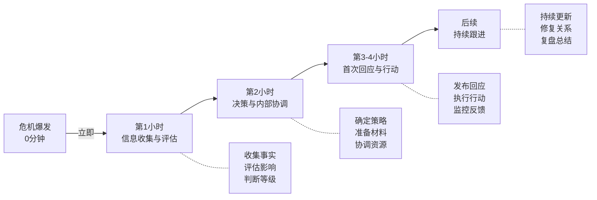

## 五、品牌维护与危机管理

个人品牌建设如同建楼——拆除只需一瞬，建造却需数年。这一节解决的是品牌建成后最容易被忽视的两个问题：**如何维护**和**如何应对危机**。

很多人把99%的精力放在"建设"上，却对"维护"和"危机"毫无准备。这就像一个人拼命赚钱却从不买保险——风平浪静时一切安好，一旦出事便满盘皆输。

---

### 5.1 品牌维护的底层逻辑

品牌维护不是"出了问题再处理"，而是一套**持续运转的系统**。理解品牌维护，需要先理解三个核心概念。

#### 5.1.1 品牌资产的"水池模型"

把你的品牌想象成一个水池：

- **进水口**：优质内容、正面互动、信任积累、好评推荐
- **出水口**：负面事件、争议言论、服务失误、信任消耗
- **水位**：你的品牌资产总量

品牌维护的核心任务是：**让进水速度持续大于出水速度**。很多人只关注进水（发内容、涨粉），却忽略了出水（负面积累、信任侵蚀）。等到水位下降到危险线以下，再想补救就来不及了。

#### 5.1.2 信任资本的积累与消耗

信任是品牌的核心货币。它遵循一个不对称规律：

> **建立信任需要100次一致的行为，摧毁信任只需要1次背叛。**

这不是夸张——心理学中的"负面偏差"（Negativity Bias）效应表明，人类大脑对负面信息的关注度和记忆力是正面信息的3-5倍。这意味着你发了100篇优质文章积累的信任，可能因为1次不当言论就归零。

信任资本的运作规律：

| 维度 | 积累速度 | 消耗速度 | 恢复难度 |
|------|---------|---------|---------|
| 能力信任 | 中等（需持续证明） | 快（一次重大失误） | 中等（需重新证明） |
| 品格信任 | 慢（需长期一致） | 极快（一次道德争议） | 极难（可能无法完全恢复） |
| 情感信任 | 中等（需真诚互动） | 快（一次冷漠回应） | 较易（真诚即可修复） |

**关键洞察**：品格信任一旦受损，恢复成本是其他维度的5-10倍。这就是为什么涉及道德争议的危机（抄袭、造假、欺骗）往往比能力不足的危机更致命。

#### 5.1.3 品牌维护的"冰山理论"

可见的品牌维护（冰山之上）只是冰山一角：
- 回复评论、发布内容、参加活动

真正支撑品牌的是冰山之下的部分：
- 舆情监控系统、危机预案、内容审核流程、关系网络维护、自我迭代机制

大部分人只做冰山之上的事，这是品牌脆弱的根本原因。

---

### 5.2 日常品牌维护体系

日常维护是品牌健康的"体检制度"。以下是经过实战验证的完整维护体系。

#### 5.2.1 内容一致性维护

内容一致性是品牌认知的基石。受众对你的品牌认知，建立在**反复一致的内容输出**之上。一旦内容风格、价值观、质量出现大幅波动，受众的信任就会动摇。

**内容一致性检查清单：**

| 检查项 | 频率 | 具体操作 |
|--------|------|---------|
| 内容质量标准 | 每篇 | 发布前对照质量检查表（见下文） |
| 品牌调性审核 | 每周 | 回顾本周所有内容，确认风格统一 |
| 价值观一致性 | 每月 | 检查内容是否与品牌定位产生偏离 |
| 视觉风格统一 | 每月 | 检查配图、排版、色彩是否一致 |
| 话题相关性 | 每季度 | 评估内容选题是否还在核心领域内 |

**内容质量检查表（发布前必检）：**

□ 信息准确性：数据、引用、事实是否经过核实？
□ 价值密度：每段内容是否都有实质信息？
□ 受众匹配：内容是否针对目标受众的需求和认知水平？
□ 品牌调性：语言风格是否符合品牌定位？
□ 合规性：是否涉及敏感话题、版权问题、法律风险？
□ 可读性：排版、分段、标题层次是否清晰？
□ 行动引导：是否有明确的下一步引导（关注、评论、分享、购买）？

#### 5.2.2 视觉形象维护

视觉是品牌的第一印象。保持视觉一致性不是"一成不变"，而是在统一框架内适度进化。

**视觉维护的"三不变三变"原则：**

- **不变**：核心色彩（主色调）、Logo/头像（保持识别度）、字体风格（保持调性）
- **可变**：辅助色彩（跟随季节/热点）、布局排版（跟随平台趋势）、装饰元素（保持新鲜感）

**视觉更新周期建议：**

| 元素 | 更新频率 | 注意事项 |
|------|---------|---------|
| 头像 | 6-12个月 | 变化不能太大，保持辨识度 |
| 封面/横幅 | 3-6个月 | 可配合季节、活动更换 |
| 内容配图风格 | 持续微调 | 跟随平台审美趋势，但保持个人特色 |
| 品牌色彩 | 极少变动 | 除非品牌战略升级 |

**实操提示**：用Figma或Canva建立品牌视觉模板库。每次制作内容时从模板出发，既能保持一致性，又能提高生产效率。维护一个"品牌素材文件夹"，存放头像、封面、配色方案、常用字体等，确保视觉元素随时可调用。

#### 5.2.3 关系网络维护

品牌不是一个人的事——它嵌入在你与受众、同行、合作伙伴、平台的多维关系网络中。关系网络的维护是品牌长期健康的关键。

**关系分层维护策略：**

| 关系层级 | 定义 | 维护频率 | 维护方式 |
|---------|------|---------|---------|
| 核心圈 | 铁杆粉丝、紧密合作者 | 每日 | 高质量互动、专属内容、私域沟通 |
| 活跃圈 | 经常互动的受众和同行 | 每周 | 回复评论、参与讨论、内容互动 |
| 外围圈 | 关注但不常互动的人 | 每月 | 优质内容触达、偶尔互动 |
| 潜在圈 | 可能的目标受众 | 持续 | 内容分发、SEO、跨平台曝光 |

**核心圈维护的5个关键动作：**

1. **记住名字**：对核心粉丝和合作伙伴，记住名字和个人细节。这比任何营销技巧都有效。
2. **主动提供价值**：不要等别人来找你，主动分享对他们有用的信息、资源、机会。
3. **给予公开认可**：在内容中提到、感谢、推荐核心支持者。公开认可是最好的关系粘合剂。
4. **私域深度交流**：通过私信、社群、线下活动进行更深度的交流，建立超越"关注者-创作者"关系的连接。
5. **互惠互利**：推荐他们的内容、产品、服务，为他们创造价值。关系的本质是互惠。

#### 5.2.4 平台生态维护

不同平台的规则和算法在持续变化。品牌维护需要关注平台层面的变化。

**平台维护检查清单：**

- **规则更新**：关注平台官方公告，及时调整内容策略。平台规则变更（如抖音的审核标准、小红书的商业内容规定）可能直接影响你的内容合规性。
- **算法变化**：定期分析内容数据，发现流量异常及时调整。如果某类内容突然失去流量，可能是算法调整的信号。
- **账号安全**：启用两步验证、绑定手机/邮箱、定期修改密码。账号被盗是品牌危机中最难处理的类型之一。
- **备份内容**：所有核心内容必须在本地有备份。平台封号、内容下架随时可能发生。建议维护一个本地内容库，所有发布过的内容都有Markdown或Word备份。

#### 5.2.5 数据监控与健康度评估

品牌维护不能只靠感觉，需要数据支撑。

**品牌健康度仪表盘（建议每周检查）：**

| 指标 | 含义 | 健康标准 | 危险信号 |
|------|------|---------|---------|
| 内容互动率 | 点赞+评论+分享/浏览量 | 平台平均水平以上 | 持续低于平均50% |
| 粉丝增长率 | 新增粉丝/总粉丝 | 稳定正增长 | 连续2周负增长 |
| 负面反馈比例 | 负面评论/总评论 | <5% | >15% |
| 私信咨询量 | 主动私信的用户数 | 稳定或增长 | 突然下降 |
| 搜索指数 | 品牌名/个人名的搜索量 | 稳定或增长 | 持续下降 |
| 内容完播率/阅读完成率 | 完整消费内容的比例 | >40% | <20% |
| 取关率 | 取关人数/总粉丝 | <1%/月 | >3%/月 |

**数据异常处理流程：**

当某个指标出现异常波动时，按以下步骤排查：

1. **确认是否为数据噪音**：查看是否是平台统计误差、节假日效应等
2. **定位时间节点**：异常从哪天开始？那天发布了什么内容？
3. **检查外部因素**：是否有平台政策变化、行业热点、竞品动作？
4. **分析根因**：是内容问题、互动问题、还是外部事件？
5. **制定调整方案**：针对根因制定应对策略
6. **跟踪恢复**：持续监控指标，确认调整有效

---

### 5.3 负面评价与舆情管理

负面评价是品牌建设中不可避免的部分。处理得当，负面评价反而能展现你的专业度和人格魅力；处理失当，一条负面评论可能演变成全面危机。

#### 5.3.1 负面评价的分类与应对策略

不是所有负面评价都需要同等对待。正确的应对方式取决于负面评价的类型：

| 类型 | 特征 | 应对策略 | 回应时间 |
|------|------|---------|---------|
| 合理批评 | 指出真实问题，有理有据 | 真诚感谢+承认问题+改进承诺 | 2小时内 |
| 误解型负面 | 基于错误信息的批评 | 礼貌澄清+提供证据+感谢关注 | 4小时内 |
| 情绪宣泄 | 无具体问题，纯发泄 | 简短共情+不争辩+私信沟通 | 24小时内 |
| 恶意攻击 | 人身攻击、造谣抹黑 | 不回应（大多数情况）或法律途径 | 评估后决定 |
| 竞品水军 | 有组织的负面攻击 | 收集证据+平台举报+必要时公开澄清 | 评估后决定 |

**关键原则：对事不对人。** 无论对方态度如何，你的回应都应该聚焦于"问题本身"，而不是"攻击对方"。

#### 5.3.2 负面评价回应的"HEART"框架

面对负面评价，使用HEART框架组织回应：

- **H（Hear，倾听）**：认真阅读对方的反馈，理解其核心诉求。不要急于辩解，先理解对方为什么这么说。
- **E（Empathize，共情）**：表达理解和重视。"我理解你的感受""感谢你指出这个问题"。
- **A（Acknowledge，承认）**：如果确实有问题，坦诚承认。如果没问题，礼貌澄清。不要模糊回避。
- **R（Resolve，解决）**：提出具体的解决方案或改进承诺。空洞的道歉不如一个具体的行动计划。
- **T（Thank，感谢）**：感谢对方的反馈。负面反馈是免费的产品改进建议。

**回应示例——合理批评：**

原文："你的课程内容太基础了，完全没有讲到实际操作中会遇到的问题。"

HEART回应：
"感谢你的反馈，你说得对。（H+E）课程在实操深度上确实有不足，
特别是实际项目中会遇到的坑和边界情况覆盖不够。（A）我正在准备
一个'进阶实操篇'的补充内容，专门解决实际操作中的常见问题，
预计下周上线。上线后会免费开放给已购课的学员。（R）再次感谢
你的时间和诚实反馈，这类声音对我来说非常有价值。（T）"

**回应示例——误解型负面：**

原文："这个博主就是割韭菜的，一个破课卖这么贵。"

HEART回应：
"理解你的顾虑，价格确实是一个需要考虑的因素。（H+E）不过
可能有些信息不对称——这个课程包含X小时的视频内容、Y个实操
模板、Z次社群答疑，平均到每小时的成本其实是低于市场均价的。
（A+澄清）当然，值不值最终还是看个人需求，如果你对内容有具体
疑问，我很乐意详细介绍。（R）感谢你的关注。（T）"

#### 5.3.3 不该回应的情况

不是所有负面评价都值得回应。以下情况建议**不回应**：

1. **明显的钓鱼/引战**：对方的目的就是激怒你，让你做出失态回应。回应只会让对方得逞。
2. **过于情绪化的攻击**：对方正处于极端情绪中，任何回应都可能火上浇油。等24小时再评估。
3. **已经回应过一次**：同一件事不要反复回应。回应一次后如果对方继续纠缠，围观者会自行判断。
4. **恶意水军/有组织攻击**：回应只会给他们更多素材。收集证据，走平台举报或法律途径。
5. **极小的负面评论被少量点赞**：关注度极低的负面评论，回应反而给它增加曝光。

**经验法则**：一条负面评论获得的关注度（点赞+回复）不超过你正常内容的10%时，通常不需要回应。

#### 5.3.4 舆情监控的实操方法

在危机发生之前发现问题，是品牌维护的最高境界。

**个人品牌的舆情监控体系：**

| 层级 | 工具/方法 | 频率 | 覆盖范围 |
|------|---------|------|---------|
| 基础层 | 手动搜索（百度、微博、小红书搜索自己的品牌名） | 每日 | 主要平台 |
| 进阶层 | 谷歌快讯（Google Alerts）+百度新闻订阅 | 实时邮件 | 全网新闻和博客 |
| 专业层 | 舆情监控工具（鹰眼速读、新浪舆情通） | 实时 | 全网+社交媒体 |
| 社群层 | 私域社群内的口碑监控 | 每日 | 核心受众圈 |

**关键词监控清单：**

- 你的品牌名/个人名（包括常见错别字）
- 你的产品/课程/服务名称
- 你的核心标签/口号
- 你的竞争对手名称（了解行业动态）
- 你所在领域的热点话题

**免费监控方案（适合个人品牌起步阶段）：**

1. 设置Google Alerts，监控品牌名+个人名的全网提及
2. 微博、小红书、知乎定期搜索品牌名，查看最新讨论
3. 加入行业相关社群，关注群内对你的提及
4. 定期查看后台数据中的"搜索词"报告，了解受众如何找到你

---

### 5.4 危机管理：从预防到恢复的完整体系

危机管理不是"灭火"，而是一套包含预防、应对、恢复三个阶段的完整体系。

#### 5.4.1 危机的类型与等级划分

不同类型的危机需要不同的应对策略。首先建立清晰的分类框架：

**个人品牌危机类型矩阵：**

| 类型 | 说明 | 典型场景 | 严重程度 |
|------|------|---------|---------|
| 内容危机 | 发布了有争议或错误的内容 | 数据错误、观点偏激、敏感话题 | ★★☆☆☆~★★★★☆ |
| 信任危机 | 被发现欺骗、造假、言行不一 | 学历造假、经历夸大、承诺不兑现 | ★★★★★ |
| 合作危机 | 合作方出了问题或合作产生纠纷 | 品牌方出事、合作方反目、利益纠纷 | ★★★☆☆~★★★★☆ |
| 法律危机 | 涉及法律纠纷或侵权 | 版权纠纷、诽谤指控、虚假宣传 | ★★★★☆~★★★★★ |
| 个人危机 | 个人生活问题被公开 | 隐私泄露、个人丑闻、家庭矛盾 | ★★★★☆~★★★★★ |
| 技术危机 | 账号安全或平台问题 | 账号被盗、内容被删、平台封号 | ★★★☆☆ |

**危机等级评估：**

| 等级 | 影响范围 | 应对要求 | 响应时间 |
|------|---------|---------|---------|
| 一级（轻微） | 少量评论区负面，无扩散 | 常规处理即可 | 24小时内 |
| 二级（中等） | 多个平台出现讨论，有一定传播 | 需要正式回应 | 4-12小时内 |
| 三级（严重） | 大范围传播，主流媒体/大V介入 | 需要系统性应对 | 1-4小时内 |
| 四级（灾难性） | 全网热搜，严重影响个人生活和事业 | 需要专业团队介入 | 1小时内启动 |

#### 5.4.2 危机预防：建立"防火墙"

最好的危机管理是让危机不发生。以下是经过验证的预防措施：

**内容发布前的风险评估流程：**

发布前风险自检：

1. 敏感度检查
   □ 是否涉及政治、宗教、性别、种族等敏感话题？
   □ 是否涉及正在发生的公共事件/争议？
   □ 是否可能被断章取义？
   □ 标题是否有歧义或引导性？

2. 事实核查
   □ 数据和引用来源是否可靠？
   □ 是否经过至少两个独立来源验证？
   □ 是否存在以偏概全的风险？

3. 法律风险
   □ 是否涉及他人隐私？
   □ 是否使用了未授权的图片/音乐/文字？
   □ 是否涉及商业宣传的合规要求？
   □ 是否可能构成诽谤或侵犯名誉权？

4. 情绪检查
   □ 这条内容是否在愤怒/兴奋/焦虑状态下写的？
   □ 如果24小时后看到这条内容，你会后悔吗？
   □ 你的最大"敌人"看到这条内容会怎么利用它？

**高风险内容的发布策略：**

当你需要就敏感话题表态时，采用以下策略降低风险：

1. **预判立场光谱**：在发布前思考，这条内容会让哪些人满意、哪些人不满、哪些人愤怒。确保你能接受最坏的结果。
2. **找信任的人预审**：找2-3个不同立场的朋友先看一遍，收集反馈再决定是否发布。
3. **选择合适的发布时间**：避免在热点事件最激烈的时候表态。等情绪冷却后再发声，更容易被理性接受。
4. **准备好回应预案**：发布前就准备好可能出现的批评和你的回应话术。不要等批评来了再手忙脚乱。

**信任资本的持续积累：**

危机能否扛过去，很大程度上取决于你平时积累了多少信任资本。以下是持续积累信任的方法：

- **透明度**：定期分享你的真实经历、决策过程、成功和失败。透明度是信任的基石。
- **一致性**：言行一致、承诺兑现、长期稳定输出。一致性是信任的保障。
- **能力证明**：持续用作品、成果、专业表现证明你的能力。能力是信任的基础。
- **社区贡献**：主动帮助他人、分享资源、参与公益活动。利他是信任的放大器。
- **关系网络**：与行业内有公信力的人建立深度关系。当你需要背书时，他们是最有说服力的证明。

#### 5.4.3 危机应对的"黄金4小时"原则

危机发生后的前4小时是决定危机走向的关键窗口。这4小时内的决策和行动，往往决定了危机是"可控"还是"失控"。

**"黄金4小时"时间线：**

**第1小时：信息收集与评估（不要急着回应）**

危机爆发时，最危险的反应是"立刻回应"。在你掌握足够信息之前，任何回应都可能让情况更糟。

这1小时内你需要做的事情：

1. **停止一切已排期的内容发布**：避免在危机期间发布无关内容，显得漠不关心。
2. **收集完整信息**：
   - 危机的起因是什么？（追溯最早的触发点）
   - 谁在传播？传播范围有多大？
   - 核心批评点是什么？
   - 有哪些是事实、哪些是误解、哪些是恶意编造？
   - 是否有媒体/大V介入？
3. **评估危机等级**：使用前文的四级评估框架。
4. **记录所有相关信息**：截图保存关键帖子、评论、传播路径。这些可能在后续澄清或法律维权中用到。

**第2小时：决策与内部协调**

基于第1小时的信息收集，做出关键决策：

1. **确定回应策略**：

| 情况 | 策略 | 说明 |
|------|------|------|
| 确实有错 | 主动承认+道歉+改进方案 | 坦诚是最好的策略 |
| 被误解 | 澄清+提供证据+保持平和 | 不要带有攻击性 |
| 被恶意攻击 | 静默观察+收集证据+法律准备 | 不要正面冲突 |
| 信息不完整 | 先发布简短声明+承诺调查 | "我已关注到此事，正在了解详情" |

2. **准备回应材料**：起草正式回应文本（详见下一节）。
3. **协调支持力量**：通知核心圈的合作伙伴、粉丝领袖，让他们了解真实情况（不是要求他们帮你洗白，而是避免他们也被误导）。
4. **法律顾问咨询**：涉及法律风险的危机，这一步必须在回应前完成。

**第3-4小时：首次回应**

回应的质量直接决定危机的走向。以下是回应的结构化模板：

**危机回应的"CLEAR"结构：**

- **C（Context，背景）**：简要说明事情的背景和经过。让不了解情况的人也能看懂。
- **L（Listen，倾听）**：表明你已经认真听取了各方的声音和反馈。
- **E（Explain，解释）**：清晰解释你的立场、原因或澄清事实。如果有错，直接承认。
- **A（Action，行动）**：提出具体的改进措施或解决方案。不要只道歉不行动。
- **R（Reassure，保证）**：承诺后续的改进和跟进时间。

**回应的"五要五不要"：**

| 要 | 不要 |
|------|------|
| 要在事实清楚后尽快回应 | 不要在信息不全时仓促回应 |
| 要真诚坦率，承认错误 | 不要推卸责任、找借口、甩锅 |
| 要聚焦事实和解决方案 | 不要攻击批评者、转移话题 |
| 要保持冷静和专业 | 不要情绪化、阴阳怪气、冷嘲热讽 |
| 要给出具体行动承诺 | 不要只说"我会改进"而不说怎么改 |

#### 5.4.4 典型危机场景的应对方案

以下针对个人品牌最常见的危机场景，给出具体可执行的应对方案。

**场景一：内容错误被曝光**

你发布了一篇内容，其中有数据错误或事实错误，被人指出并传播。

应对流程：

1. 立即核实错误是否属实（1小时内）
2. 如果属实：
   - 原内容标注更正（不删除原文，保留透明度）
   - 发布更正声明，明确指出错误和正确信息
   - 感谢指出错误的人
3. 如果不属实：
   - 礼貌澄清，提供正确信息的来源
   - 不攻击质疑者

**回应模板：**
关于[具体内容]的更正：

我在[日期]发布的[内容标题]中，[具体错误描述]是不正确的。
正确的信息是[正确内容]。

感谢 @[指出者] 的指正。我会在原内容中更新更正信息，
并对因错误信息可能造成的误导表示歉意。

我会加强未来内容的事实核查流程，避免类似问题。

**场景二：过往言论被翻出**

你过去的某条言论（可能是几年前的）被翻出来，放在当下的语境下引发争议。

应对流程：

1. 找到并审视原始言论的完整上下文
2. 评估：该言论在当下是否确实不当？
3. 如果确实不当：
   - 承认当时的言论不妥
   - 解释你的成长和认知变化
   - 说明你现在的立场
4. 如果被断章取义：
   - 提供完整上下文
   - 但不要攻击对方"断章取义"（这会显得在甩锅）

**回应模板（确实不当的情况）：**
关于[日期]的那条[平台]发言：

我看到了大家的讨论。这条[时间]年前的发言，
放在今天的语境下确实[不妥/冒犯/表达不当]。

当时我的认知和表达都不够成熟。[简要说明你的认知变化]。

今天的我认为[你现在的立场]。

我会正视这个问题，也感谢大家的批评和提醒。
人是在不断成长的，我也在学习如何更好地表达和思考。

**场景三：抄袭/洗稿指控**

有人指控你的内容抄袭或洗稿他人的作品。

应对流程：

1. **立刻暂停回应，认真核实**：这是最严重的指控之一，不能轻率回应
2. **逐条比对指控内容**：客观评估相似度
3. **如果确实存在引用不当**：
   - 立即补上引用标注
   - 公开道歉
   - 如果涉及商业利益，主动联系原作者协商
4. **如果确实是独立创作**：
   - 提供创作过程的证据（草稿、时间线、参考资料）
   - 保持平和客观，不要攻击对方
   - 让事实说话

**场景四：合作品牌出事**

你代言或推广过的品牌/产品出了问题（质量问题、虚假宣传等）。

应对流程：

1. 立即下架相关内容或标注声明
2. 了解事情全貌
3. 发布声明：说明你与该品牌的关系、你是否知晓问题、你的态度
4. 如果你之前确实做过该产品的推荐，考虑是否需要对受影响的受众负责

**回应模板：**
关于[品牌/产品]近期的问题，我需要向大家做一个说明：

我在[日期]与[品牌]进行了[合作/推广]。了解到[问题概述]后，
我已经[下架相关内容/暂停合作/要求品牌方回应]。

对于可能因我的推荐而受到影响的朋友，我深感抱歉。
[具体补救措施]。

今后我会加强对合作品牌的尽职调查，确保推荐的内容
真正值得信赖。也感谢大家的监督。

**场景五：账号被盗**

你的社交账号被黑客入侵，发布了不当内容或进行了欺诈行为。

应对流程：

1. 立即通过一切可能的渠道找回账号（绑定手机、邮箱、申诉流程）
2. 同时通过其他平台发布声明，告知受众你的账号被盗
3. 找回账号后：
   - 修改所有密码
   - 启用两步验证
   - 检查是否有内容被删改、私信被发送
   - 发布正式声明，说明情况并提醒受众不要点击被盗期间发送的链接

#### 5.4.5 危机后的品牌恢复

危机应对不是终点，危机后的品牌恢复才是真正的考验。

**恢复的三个阶段：**

**阶段一：降温期（危机后1-2周）**

- 降低发布频率，但不要完全消失（消失会引发更多猜测）
- 发布平和、正向、有价值的内容，展现你的正常状态
- 不要反复提起危机事件（除非有新的重大进展）
- 加强与核心圈的关系维护，确保核心支持者没有流失

**阶段二：重建期（危机后2-8周）**

- 逐步恢复常规内容节奏
- 用更高质量的内容重建信任
- 适当展示你的"成长"——危机中学到了什么、改变了什么
- 如果有承诺的改进措施，这个阶段必须兑现

**阶段三：超越期（危机后2-6个月）**

- 用持续的优质输出覆盖危机记忆
- 寻找新的品牌亮点和增长点
- 将危机经验转化为有价值的分享（适当复盘，展现成长）
- 重新建立品牌的正向联想

**恢复时间参考：**

| 危机类型 | 恢复到危机前水平 | 关键恢复因素 |
|---------|----------------|------------|
| 内容错误 | 2-4周 | 更正速度和质量 |
| 误解型争议 | 1-4周 | 澄清的清晰度 |
| 言论争议 | 1-3个月 | 后续表现的一致性 |
| 信任危机（造假等） | 6个月-2年 | 持续的信任重建行为 |
| 法律纠纷 | 取决于案件进展 | 法律结果和后续态度 |
| 账号安全事件 | 2-4周 | 响应速度和安全措施升级 |

#### 5.4.6 危机中的心理管理

品牌危机不仅考验你的策略能力，更考验你的心理承受力。在危机中保持心理健康，是有效应对的前提。

**危机中的心理保护策略：**

1. **建立"决策圈"**：找2-3个你信任的人（朋友、家人、顾问），在危机期间作为你的决策参谋。不要独自承受。
2. **限制信息摄入**：危机期间不要反复刷评论和负面信息。固定时间（如每天2次）集中查看，其余时间远离。
3. **区分"噪音"和"信号"**：90%的网络评论是噪音（情绪宣泄、跟风、恶意攻击），只有10%是有价值的信号（合理的批评和建议）。关注信号，忽略噪音。
4. **接受不完美**：你不可能让所有人满意。危机中一定会有不满的声音，这是正常的。不要追求"所有人都原谅我"这个不可能的目标。
5. **保持日常节奏**：危机期间也要正常吃饭、睡觉、运动。身心健康是有效应对的基础。
6. **设定止损线**：如果危机严重影响了你的心理健康，及时寻求专业心理咨询。品牌再重要，也不如你的身心健康重要。

---

### 5.5 法律保护与知识产权维护

品牌维护不仅是公关层面的工作，还需要法律层面的保护。

#### 5.5.1 个人品牌的法律保护框架

| 保护对象 | 保护方式 | 适用场景 |
|---------|---------|---------|
| 品牌名称 | 商标注册 | 品牌名已有一定知名度时 |
| 原创内容 | 版权登记（重要作品） | 内容被大规模抄袭时 |
| 肖像/形象 | 肖像权保护 | 他人盗用你的照片/形象时 |
| 商业机密 | 保密协议（NDA） | 与合作方分享商业信息时 |
| 域名/账号 | 及时注册保护 | 防止他人抢注你的品牌名 |

#### 5.5.2 内容被侵权时的处理流程

1. **收集证据**：截图保存侵权内容，记录发布时间、平台、链接
2. **平台投诉**：通过平台的知识产权投诉渠道举报（大多数平台都有专门的投诉入口）
3. **发送律师函**：如果平台投诉无效，通过律师发送正式函件
4. **法律诉讼**：作为最后手段，通过法律途径维权

**平台投诉的常用渠道：**

- 微信公众号：公众号后台→侵权投诉
- 小红书：App内举报→知识产权侵权
- 抖音：App内举报或邮件投诉
- B站：帮助中心→侵权投诉
- 知乎：App内举报或邮件投诉
- 微博：App内举报→知识产权投诉

#### 5.5.3 被他人侵权时的注意事项

- 不要公开"撕"对方（容易变成互相攻击，损害双方品牌）
- 先走正式渠道（平台投诉、律师函），保留法律追诉的权利
- 如果侵权严重且对方不配合，可以适当公开说明（以维权为目的，不是为了引发舆论战）
- 咨询专业知识产权律师，了解维权的成本和预期收益

---

### 5.6 实战案例分析

#### 5.6.1 成功的危机管理案例

**案例一：知识博主的"数据错误"危机**

一位数据分析领域的博主在一篇爆款文章中引用了一个关键数据，后被读者发现数据有误。该博主在2小时内：

1. 核实确认错误确实存在
2. 在原文顶部添加更正说明，详细解释错误原因和正确数据
3. 单独发布一条动态，公开感谢指出错误的读者
4. 分享了自己今后加强数据核查的具体措施（引入二次校验流程）

结果：不仅没有损害品牌，反而因为透明和坦诚赢得了更多信任。该读者后来成为了博主的核心支持者。

**关键教训**：承认错误不会损害品牌，掩盖错误才会。

**案例二：设计师的"抄袭指控"危机**

一位独立设计师被指控作品抄袭。该设计师在24小时内：

1. 没有立即回应，而是完整收集了创作过程的证据（草稿、灵感来源、设计迭代过程）
2. 发布了一篇详细的创作过程记录，用时间线和过程文件证明了独立创作的事实
3. 客观分析了相似点出现的原因（相同的设计趋势和灵感来源）
4. 没有攻击指控者，保持了专业态度

结果：舆论转向支持设计师，指控者后来删除了原帖。

**关键教训**：面对抄袭指控，证据比情绪更有说服力。

#### 5.6.2 失败的危机管理案例

**案例一：网红的"沉默逃避"危机**

某生活类网红被曝出推荐的产品存在质量问题。该网红选择了沉默——不回应、不删除、不澄清。3天后，负面话题登上热搜，多家媒体跟进报道。最终该网红被迫公开道歉，但因"逃避"的印象已经形成，道歉反而被解读为"被迫低头"。

**失败原因分析**：
- 沉默被解读为"默认"和"心虚"
- 错过了"黄金4小时"的最佳回应窗口
- 让第三方定义了事件的叙事框架

**关键教训**：沉默不是金，尤其在社交媒体时代。

**案例二：博主的"情绪化回应"危机**

一位科技博主因观点争议遭到批评，在情绪激动下发了一条充满攻击性的回应，使用了"你们懂什么""嫉妒我的成功"等措辞。这条回应被截屏传播，成为新的负面热点，讨论焦点从"观点争议"变成了"态度傲慢"。

**失败原因分析**：
- 情绪化回应转移了讨论焦点
- "傲慢"的人设标签比原事件更难消除
- 每一次情绪化回应都会被永久记录

**关键教训**：在危机中发任何内容之前，问自己："如果这条被截屏放在热搜上，我能接受吗？"

---

### 5.7 品牌维护的长期策略

品牌维护不是危机来了才做的事，而是一套贯穿品牌生命周期的长期策略。

#### 5.7.1 建立品牌维护SOP

将品牌维护的各项工作流程化、标准化，避免"凭感觉"操作。

**品牌维护年度日历：**

| 时间 | 任务 | 具体内容 |
|------|------|---------|
| 每日 | 舆情检查 | 搜索品牌名，查看评论区 |
| 每周 | 数据复盘 | 检查品牌健康度仪表盘 |
| 每月 | 内容审核 | 回顾本月内容，检查一致性 |
| 每季度 | SWOT分析 | 重新评估品牌的优势、劣势、机会、威胁 |
| 每季度 | 竞品观察 | 关注同领域品牌的新动向 |
| 每半年 | 视觉更新 | 评估视觉形象是否需要调整 |
| 每年 | 品牌战略复盘 | 全面评估品牌定位、策略、发展方向 |
| 每年 | 法律审查 | 检查商标续期、版权保护等法律事项 |

#### 5.7.2 品牌维护团队建设

当个人品牌发展到一定规模，一个人难以覆盖所有维护工作。以下是逐步扩展团队的建议：

| 阶段 | 品牌规模 | 维护方式 |
|------|---------|---------|
| 起步期 | <1万粉丝 | 个人全权负责 |
| 成长期 | 1-10万粉丝 | 找1个助手协助内容审核和评论管理 |
| 成熟期 | 10-50万粉丝 | 建立小团队（内容+运营+客服） |
| 规模化 | >50万粉丝 | 专业团队（含公关顾问、法律顾问） |

#### 5.7.3 从危机中学习：建立"危机知识库"

每一次危机（无论是自己经历的还是观察他人的）都是宝贵的学习素材。建立一个"危机知识库"，记录：

1. **危机概要**：什么时间、什么事件、涉及谁
2. **应对过程**：采取了什么措施、每一步的时间线
3. **结果评估**：危机是否得到有效控制、品牌恢复用了多久
4. **经验教训**：什么做对了、什么可以改进
5. **改进措施**：基于这次经验，优化了哪些预防和应对流程

这个知识库会成为你最宝贵的品牌资产之一。当类似的危机再次出现时，你不会手忙脚乱——因为你已经有了经过验证的应对方案。

---

### 5.8 常见误区与纠正

| 误区 | 正确认知 |
|------|---------|
| "不出事就不用管品牌维护" | 维护是预防性的日常工作，不是事后补救 |
| "负面评论都必须回复" | 只有合理的、有传播风险的才需要回应 |
| "危机来了要第一时间回应" | 第一时间收集信息，掌握全貌后再回应 |
| "删帖就能解决问题" | 删帖往往适得其反，被截图后更被动 |
| "道歉就是认输" | 真诚的道歉是力量的体现，不是软弱 |
| "找水军控评就行" | 一旦被发现会严重损害品牌信誉 |
| "时间会冲淡一切" | 不主动修复，负面记忆会被反复唤起 |
| "危机只靠公关就行" | 危机管理需要策略+心理+法律的综合能力 |
| "小品牌不会遇到危机" | 小品牌反而更脆弱，抗风险能力更差 |
| "一次危机就能毁掉品牌" | 大多数危机都是可恢复的，关键看应对方式 |

---

### 5.9 品牌维护与危机管理的工具箱

| 类别 | 推荐工具 | 用途 |
|------|---------|------|
| 舆情监控 | Google Alerts、百度新闻订阅 | 免费的全网关键词监控 |
| 舆情监控 | 鹰眼速读、新浪舆情通 | 专业的社交媒体舆情分析 |
| 内容管理 | Notion、飞书多维表格 | 维护内容日历和审核清单 |
| 备份工具 | 坚果云、Google Drive | 内容自动备份 |
| 协作沟通 | 飞书、企业微信 | 团队内部的危机沟通 |
| 法律工具 | 公证云、时间戳认证 | 电子证据的法律保全 |
| 数据分析 | 新榜、蝉妈妈 | 内容和品牌数据追踪 |

---

***

