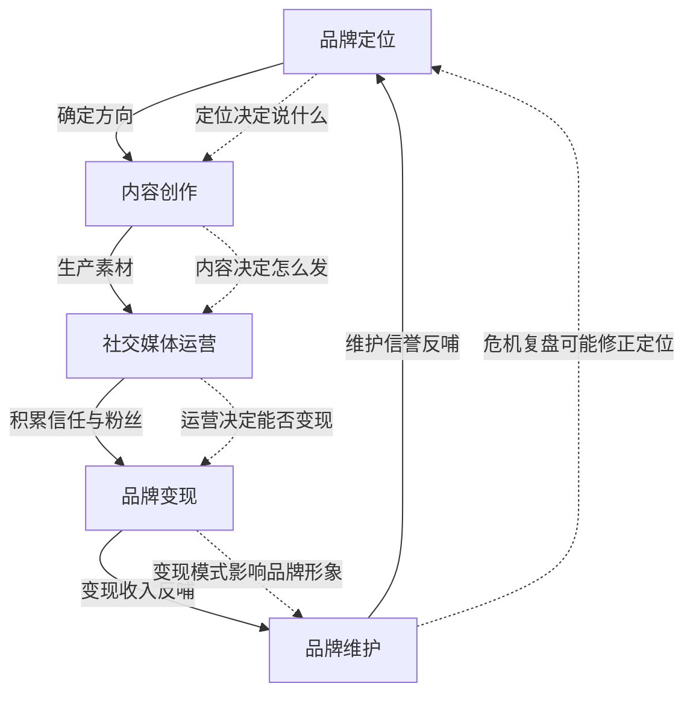
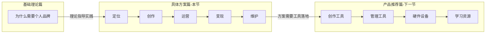

## 本节小结

本节从品牌定位到危机管理，完整铺设了个人品牌建设的五条执行主线。下面对每条主线做深度回顾，梳理它们之间的协同关系，给出自检清单和行动路线图，帮助你把分散的知识点串联成可落地的系统工程。

---

### 一、五条主线核心回顾

#### 1. 品牌定位与规划——找到"你是谁"

品牌定位是整个工程的地基。本节第一部分给出了从自我分析到定位输出的完整工作流：

- **能力矩阵**：从专业能力、辅助技能、软技能、跨界技能四个维度盘点个人资产，用"水平 × 需求 × 热爱"三重筛选找到品牌核心能力。
- **独特经历挖掘**：通过职业经历、学习路径、跨界融合、生活底色四个维度提炼不可复制的故事素材，再用"相关性 × 连接性 × 价值性"三重过滤锁定品牌故事线。
- **价值观排序**：从24个核心价值观中选出5个并排序，用冲突测试、底线测试、一致性测试确保价值观不是装饰品，而是决策指南。
- **定位公式**：最终输出"我是\[身份\]，帮助\[受众\]解决\[问题\]，通过\[方法\]"的一句话定位语，附带品牌手册（使命、愿景、价值主张、视觉规范）。

**关键教训**：定位不是灵感一现，而是结构化的自我审计。定位错了，后面所有努力都是在错误方向上加速奔跑。

#### 2. 内容创作策略——建立"说什么"

内容是品牌的载体，没有内容的品牌等于没有声音。本节第二部分覆盖了内容全链条：

- **五大内容类型**：知识分享（建立权威）、经验分享（建立情感）、观点表达（引发讨论）、实用工具（驱动收藏转发）、故事型（建立共鸣），不同类型服务于不同的品牌目标。
- **六步创作流程**：选题→调研→结构化→创作→优化→发布，每一步都有具体操作方法和判断标准。
- **标题工程学**：数字型、问题型、对比型、故事型、悬念型五大标题模式，解决"用户会不会点"的问题。
- **平台适配**：公众号的深度长文、小红书的精炼图文、抖音的前3秒抓人、B站的章节化讲解、知乎的专业论据——同一个选题在不同平台需要完全不同的表达方式。

**关键教训**：好内容不只是"写得好"，而是"写得对"——对的类型、对的角度、对的平台、对的表达。

#### 3. 社交媒体运营——解决"怎么发"

内容创作是"生产"，运营是"流通"。没有运营，再好的内容也石沉大海。本节第三部分覆盖了运营的四大维度：

- **运营节奏**：日更 vs 周更的选择逻辑，三个黄金时间段（通勤、午休、晚间），以及内容日历模板的使用。
- **互动管理**：评论回复的时效要求（2小时内）、回复质量标准、私信自动回复设置、社群运营策略。
- **数据分析**：关注数、互动率、完播率、转化率四大关键指标，以及"每周分析→对比类型→提炼共性→调整策略"的闭环方法。
- **增长策略**：内容驱动增长、互动驱动增长、跨平台引流、合作互推四种路径，分别解决不同阶段的增长瓶颈。

**关键教训**：运营的核心不是"发更多内容"，而是"让对的内容到达对的人"。

#### 4. 品牌变现路径——实现"怎么赚"

品牌建设的终极目标之一是商业变现，但变现不是割韭菜，而是价值交换的自然结果。本节第四部分列出了四大变现通道：

- **知识付费**：在线课程（体系化输出，几十到几千元）、付费社群（持续互动，几十到几千元/年）、一对一咨询（个性化服务，几百到几千元/小时）。
- **广告代言**：品牌合作（基于粉丝数和互动率收费）、产品代言（需要高影响力和信任度）。
- **电商带货**：自营产品（实体周边/数字模板）、联盟营销（推荐他人产品赚佣金）。
- **演讲出版**：付费演讲（行业影响力变现）、出版书籍（品牌背书的终极形式）。

**关键教训**：变现的前提是信任。没有信任基础的变现等于透支品牌资产。先给价值，再谈价格。

#### 5. 品牌维护与危机管理——守住"是什么"

品牌是慢功夫，但可以瞬间崩塌。本节第五部分强调了维护和危机两个层面：

- **日常维护**：内容一致性（质量/风格/价值观不漂移）、视觉更新（保持新鲜感）、关系维护（粉丝/合作方/同行）、持续学习（能力不过时）。
- **危机管理三阶段**：预防（审核机制+谨慎表态+信任资本积累）、应对（及时回应+真诚道歉+证据澄清+专业支持）、恢复（优质内容重建+适度降温+复盘教训）。

**关键教训**：危机管理的核心不是"灭火"，而是"防火"——日常积累的信任资本是最好的防火墙。

---

### 二、五条主线的协同关系

这五条主线不是独立的模块，而是一个因果递进的系统。理解它们之间的协同关系，才能避免"只做了一半"的常见陷阱。

| 连接点 | 前置环节 | 后续环节 | 协同机制 |
|--------|---------|---------|---------|
| 定位→内容 | 品牌定位明确"我是谁" | 内容创作据此确定"说什么" | 定位不清则内容散乱，什么都发等于什么都没发 |
| 内容→运营 | 内容产出提供传播素材 | 运营分发让内容触达受众 | 没有好内容，运营只是噪音；没有运营，好内容无人看见 |
| 运营→变现 | 运营积累粉丝和信任 | 变现将信任转化为收入 | 粉丝量和信任度决定了变现方式的选择空间 |
| 变现→维护 | 变现增加资源投入 | 维护保护品牌长期价值 | 变现过度会损害品牌，维护不足则变现不可持续 |
| 维护→定位 | 维护中的危机复盘 | 可能触发定位调整 | 市场变化、危机教训可能要求重新审视品牌定位 |

**最常见的断裂点**是"内容→运营"：很多人能创作好内容，但不重视运营，导致内容影响力远低于应有水平。第二个断裂点是"运营→变现"：粉丝涨到一定量级后不知道如何商业化，或者急于变现伤害了品牌信任。

---

### 三、执行自检清单

用以下清单对你的个人品牌建设现状做一次全面体检。每个问题的回答都是"是/否/部分"，标注"部分"和"否"的条目就是你接下来的重点改进方向。

#### 定位维度

- [ ] 我能用一句话说清楚"我是谁，帮谁，解决什么问题"
- [ ] 我做过完整的能力矩阵盘点，知道自己的核心优势
- [ ] 我梳理过自己的独特经历，找到了品牌故事素材
- [ ] 我的核心价值观经过冲突测试和底线测试
- [ ] 我有明确的目标受众画像（年龄/职业/痛点/平台偏好）
- [ ] 我分析过竞争对手，找到了自己的差异化定位

#### 内容维度

- [ ] 我有明确的内容类型组合（知识/经验/观点/工具/故事的比例）
- [ ] 我有一套可重复的选题方法，不是每次临时想
- [ ] 我的标题创作有模式可循，不是随机发挥
- [ ] 我针对不同平台做了内容适配，不是一稿多发
- [ ] 我有内容素材库，积累的素材可以随时调用
- [ ] 我的内容有个人风格，辨识度足够高

#### 运营维度

- [ ] 我有固定的内容发布节奏，不是想发就发
- [ ] 我会在发布后2小时内回复评论
- [ ] 我每周分析一次数据，并据此调整策略
- [ ] 我有至少一个活跃的粉丝社群
- [ ] 我有跨平台引流策略
- [ ] 我与同领域的创作者有合作关系

#### 变现维度

- [ ] 我已经明确至少一种适合自己的变现模式
- [ ] 我的定价策略经过市场验证（不是拍脑袋定的）
- [ ] 我的变现产品与品牌调性一致
- [ ] 我不会为了短期收入损害长期品牌信任
- [ ] 我有"免费内容→付费产品"的转化路径设计

#### 维护维度

- [ ] 我的内容风格、视觉形象保持一致
- [ ] 我有内容发布的审核机制（避免踩雷）
- [ ] 我知道如果遇到危机，第一时间该怎么做
- [ ] 我定期更新自己的知识体系，保持专业能力领先
- [ ] 我每季度复盘一次品牌建设的整体方向

---

### 四、按阶段的行动路线图

个人品牌建设不是一次性工程，而是分阶段递进的长期项目。以下是推荐的行动路线：

#### 阶段一：地基期（第1-3个月）

**核心任务**：完成品牌定位，建立内容生产体系。

| 周次 | 重点行动 | 产出物 |
|------|---------|--------|
| 第1周 | 完成能力矩阵盘点、经历梳理、价值观排序 | 个人资产盘点表 |
| 第2周 | 确定目标受众画像、分析竞品 | 受众画像文档 + 竞品分析报告 |
| 第3周 | 输出一句话定位、品牌手册 | 品牌手册v1.0 |
| 第4-6周 | 选定1-2个核心平台，建立账号，完善资料 | 平台账号上线 |
| 第7-8周 | 制作第一批内容（5-10篇），测试风格 | 初始内容库 |
| 第9-12周 | 建立内容日历，进入稳定发布节奏 | 固定发布频率 |

**阶段成果**：品牌定位清晰，内容体系运转，账号开始积累基础内容。

#### 阶段二：增长期（第4-9个月）

**核心任务**：优化内容策略，实现粉丝增长。

| 重点行动 | 频率 | 关键指标 |
|---------|------|---------|
| 内容创作与发布 | 每周2-5次 | 发布量达标率 |
| 数据分析与复盘 | 每周1次 | 互动率趋势 |
| 互动管理 | 每天 | 评论回复率 > 80% |
| 跨平台引流 | 持续 | 各平台粉丝增长率 |
| 与同行合作 | 每月1-2次 | 合作带来的新增粉丝 |
| 选题库扩充 | 持续 | 选题储备 > 30个 |

**阶段成果**：核心平台粉丝破千，互动率稳定，内容风格成型。

#### 阶段三：变现期（第10-18个月）

**核心任务**：设计变现路径，实现商业化。

| 重点行动 | 说明 |
|---------|------|
| 设计免费→付费转化路径 | 免费内容引流 → 低价产品体验 → 高价产品深度服务 |
| 推出第一个付费产品 | 优先选择低门槛产品（如电子书、模板、小课）验证需求 |
| 建立付费社群 | 用社群沉淀核心用户，提供持续价值 |
| 探索广告/合作机会 | 筛选与品牌调性匹配的合作，拒绝不合适的合作 |

**阶段成果**：至少一条变现路径跑通，有稳定的月度收入。

#### 阶段四：生态期（第18个月以后）

**核心任务**：构建品牌生态，实现可持续增长。

- **内容IP化**：将内容体系化，形成可复用的知识产品（课程体系、方法论框架）。
- **矩阵化运营**：从单一平台扩展到多平台矩阵，覆盖不同受众圈层。
- **团队化运作**：当个人产能达到瓶颈时，引入助手或团队，从"一人品牌"升级为"品牌工作室"。
- **品牌授权与联盟**：与其他品牌联名、授权，扩大影响力边界。
- **持续迭代**：每半年做一次品牌复盘，根据市场变化和个人成长调整定位。

---

### 五、本节与其他章节的衔接

基础理论篇回答了"为什么"和"是什么"，具体方案篇回答了"怎么做"，而下一节的产品推荐篇将回答"用什么做"。工具不是目的，但合适的工具能让执行效率提升数倍。例如：

- 定位阶段需要用到思维导图工具（如 XMind、ProcessOn）做能力矩阵
- 内容创作阶段需要排版工具（如 Markdown 编辑器、Canva）提升产出效率
- 运营阶段需要数据分析工具（如新榜、飞瓜）支撑决策
- 变现阶段需要支付和课程平台（如小鹅通、知识星球）实现商业化
- 维护阶段需要舆情监控工具及时发现潜在危机

下一节将针对每个环节推荐具体的工具和平台选择建议。

---

### 六、写在最后

建立个人品牌是一个系统工程，需要持续的投入和耐心。不要期望一夜之间成为"网红"，而要专注于长期的价值创造。最好的品牌是那些真正为他人创造价值的品牌——当你的内容、你的服务、你的存在本身就在帮助别人变得更好时，品牌的增长是自然而然的结果。

记住三句话：

1. **定位是一切的起点**——不知道自己是谁，别人更不会知道。
2. **内容是品牌的血液**——没有持续的优质输出，品牌就是一具空壳。
3. **信任是最硬的通货**——所有短期行为的尽头，都是信任的消耗或积累。

下一步，我们将进入产品推荐篇，帮你找到趁手的工具，把方案落地为行动。
