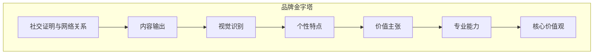
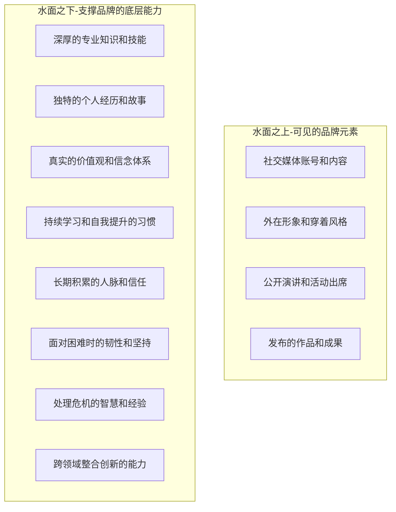
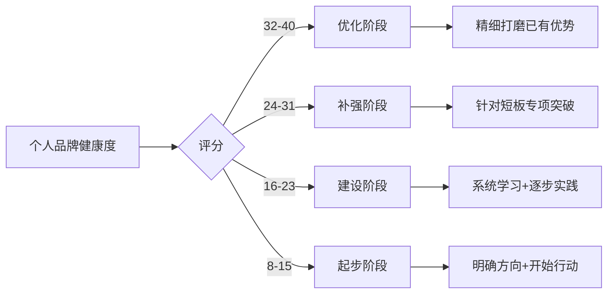

## 一、个人品牌的定义与本质

### 1.1 什么是个人品牌

#### 1.1.1 基础定义

个人品牌是你在他人心中留下的"印象总和"——不是你觉得自己是什么样的人，而是别人认为你是什么样的人。更准确地说，个人品牌是你所展现的专业能力、价值观、个性特点和为他人创造的价值的综合体现。

这个定义包含三层关键含义：

1. **它是他人认知的产物**：个人品牌存在于他人的头脑中，而非你的自我认知里。你可以在镜子前告诉自己"我很专业"，但如果你的客户、同事和合作伙伴不这么认为，你的个人品牌就不是"专业的"。
2. **它是多维度的综合**：个人品牌不是单一标签（如"技术高手"），而是多个维度叠加形成的立体画像。一个人可能同时是"擅长架构设计的、说话直率的、喜欢开源的技术人"。
3. **它是动态变化的**：个人品牌不是一成不变的，它会随着你的成长、环境的变化和他人的反馈而持续演变。

管理学大师汤姆·彼得斯（Tom Peters）在1997年《Fast Company》杂志发表的《The Brand Called You》一文中首次系统提出"个人品牌"概念，他写道："无论你处于什么年龄，处于职业生涯的什么阶段，你都需要像管理品牌一样管理自己。"这篇文章被视为个人品牌领域的奠基之作。

#### 1.1.2 个人品牌的本质：信任货币

个人品牌的本质是**信任**。这种信任体现在三个层面：

| 信任层次 | 含义 | 举例 |
|---------|------|------|
| 能力信任 | 相信你能做好某件事 | "找他写代码，bug少、交付快" |
| 品格信任 | 相信你的人品和底线 | "跟他合作，不会吃亏" |
| 一致性信任 | 相信你每次都能保持水准 | "他的文章篇篇都有干货" |

这三层信任像齿轮一样互相咬合。只有能力信任，别人会觉得你"聪明但不可靠"；只有品格信任，别人会觉得你"人不错但帮不上忙"；只有能力+品格但缺乏一致性，别人会觉得"他有时很好有时不行，不太确定"。三者兼备时，你的个人品牌就成为了一种"信任货币"——别人不需要深入了解你，只要看到你的名字，就愿意给予机会。

这种信任货币有真实的经济价值。LinkedIn的数据显示，拥有完整个人资料的专业人士获得的机会比不完整的高出40倍。一份Edelman信任度调查显示，63%的消费者更信任"像专家一样的个人"而非"企业品牌"传递的信息。

#### 1.1.3 数字时代的品牌放大效应

在数字时代，个人品牌的重要性被指数级放大。搜索引擎和社交媒体使得关于你的信息前所未有地透明和可获取。

具体来看，有三个结构性变化：

**第一，先搜后见已成常态。** 无论是求职、合作还是社交，对方很可能在见到你之前就已经通过网络搜索形成了对你的初步印象。2023年CareerBuilder的调查显示，70%的雇主会在面试前搜索候选人的社交媒体资料，57%的雇主发现过导致他们不录用某人的在线内容。这意味着你已经在"被品牌化"——问题只是你是否在主动管理这个过程。

**第二，影响力半径从"圈子"扩展到"全球"。** 前互联网时代，一个人的影响力半径受限于物理接触范围，通常不超过几百人。社交媒体时代，一条推文可能被百万人看到。这意味着个人品牌的上限被大幅抬高，同时竞争也空前激烈。

**第三，品牌建立的周期被压缩。** 传统媒体时代，建立全国性的个人知名度可能需要十年以上。而在社交媒体时代，一个有价值的短视频可以在一夜之间让你被数百万人认识。当然，知名度不等于品牌——速成的知名度如果缺乏深层的价值支撑，也会迅速消散。

#### 1.1.4 个人品牌的历史演变

个人品牌的发展经历了四个阶段，每个阶段的底层逻辑截然不同：

| 阶段 | 时间跨度 | 核心载体 | 品牌逻辑 | 代表现象 |
|------|---------|---------|----------|---------|
| 口碑时代 | 互联网之前 | 面对面社交、口碑 | "认识你的人说什么" | 行业师傅、地方名医 |
| 门户时代 | 1995-2005 | 个人网站、博客 | "你能展示什么" | 技术博客、个人主页 |
| 社交时代 | 2005-2015 | 微博、微信、Facebook | "你能传播什么" | 大V、KOL、网红 |
| 算法时代 | 2015至今 | 短视频、AI推荐 | "算法推什么" | 短视频达人、知识IP |

每个新阶段并非取代前一阶段，而是在其基础上叠加。今天建设个人品牌，需要同时经营口碑、网站、社交和算法四个层面。

### 1.2 个人品牌的构成要素

一个完整的个人品牌由七大要素构成，它们之间的关系可以用"品牌金字塔"来理解——底层是基础，顶层是结果。

#### 1.2.1 核心价值观：品牌的地基

核心价值观是个人品牌最底层的地基，决定了你在面临选择时的取舍。它不是你"宣称"相信什么，而是你在压力下"真正"坚守什么。

核心价值观需要满足三个条件：
- **真实性**：你真的相信它，而不是因为它"听起来不错"
- **一致性**：你在不同场景下都践行它
- **可识别性**：别人能通过你的言行感受到它

举例来说，"追求卓越"是一个常见的价值观表述，但如果你的项目经常延期交付质量一般的成果，这个价值观就是虚假的。而"宁可少接项目也要保证每个项目的质量"则是一个具体的、可验证的价值观。

**自我诊断方法：** 回忆你最近三次在工作中感到"这件事不对"的时刻——那背后往往就是你的核心价值观在发声。把这些时刻提炼出来，找出共同点，就是你的真实价值观。

#### 1.2.2 专业能力：品牌的硬核

专业能力是个人品牌的基础，没有扎实的专业能力，品牌就是空中楼阁。

专业能力的评估可以从三个维度进行：

| 维度 | 含义 | 衡量标准 | 提升路径 |
|------|------|---------|---------|
| 深度 | 某个领域的精深程度 | 能解决同行中90%的人解决不了的问题 | 深耕单一领域3-5年 |
| 广度 | 跨领域的知识范围 | 能在2-3个相邻领域进行有效对话 | 系统学习+跨界项目实践 |
| 实战经验 | 解决真实问题的能力 | 有可验证的成功案例和失败教训 | 主动承担有挑战的项目 |

很多人在建立个人品牌时，错误地把精力花在"包装"上，而忽略了能力的提升。这就像给一辆动力不足的汽车喷漆——看起来好看，但跑不快。专业能力的建立没有捷径，需要长期的学习和实践积累。但"没有捷径"不代表"没有方法"——后面章节会详细讲解如何通过刻意练习、项目驱动和导师反馈来加速专业能力的成长。

#### 1.2.3 价值主张：品牌的承诺

价值主张回答一个核心问题："你为谁解决什么问题？"清晰的价值主张能够让人们快速理解"你能为我做什么"。

一个有效的价值主张公式是：

> 我帮助 [目标人群] 通过 [方法/途径] 实现 [具体结果]

对比以下两个表述：

| 模糊的价值主张 | 清晰的价值主张 |
|--------------|--------------|
| "我教你编程" | "我帮助零基础的职场人在90天内掌握Python数据分析，能独立完成数据报告" |
| "我做设计" | "我帮助DTC品牌在3个月内建立统一的视觉识别系统，提升品牌辨识度30%" |
| "我做咨询" | "我帮助B轮前的SaaS创业公司优化定价策略，平均提升ARR 25%" |

价值主张的构建需要回答三个核心问题：你为谁服务（目标人群的精确画像）？你提供什么价值（可衡量的结果）？你与竞争对手有什么不同（差异化优势）？

#### 1.2.4 个性特点：品牌的辨识度

在信息过载的时代，有辨识度的品牌更容易被记住。个性特点不是刻意表演出来的，而是你真实自我的自然流露。

个性特点之所以重要，有一个心理学原理支撑——**单纯曝光效应**（Mere Exposure Effect）。心理学家Robert Zajonc在1968年的实验证明，人们对重复接触到的事物会产生偏好。但"重复曝光"的前提是"能被记住"。如果你的个性没有辨识度，别人看到你的内容也记不住是你写的，曝光就白费了。

挖掘自己个性特点的方法：

1. **三词测试**：请10位朋友各用三个词形容你，找出出现频率最高的3个词
2. **正面反馈提取法**：回顾你收到的正面评价，提取其中反复出现的关键词
3. **表达偏好分析**：你最享受的表达方式是什么——是讲段子、画图、写长文还是做视频？
4. **冲突场景回忆**：当你与别人意见不一致时，你最本能的反应方式是什么？这往往暴露你最真实的个性

**误区警示：** 个性特点不等于"人设"。人设是刻意构建的、可能与真实自我不符的形象；个性特点是真实自我的自然表达。人设的风险在于——你必须时刻"演"，一旦露出破绽，信任就会崩塌。而基于真实个性的品牌，即使犯了错，别人也会更容易原谅，因为"这就是他"。

#### 1.2.5 视觉识别：品牌的外衣

视觉是人们接触品牌的第一印象。研究表明，人们在看到一个页面的前50毫秒内就会形成对它的视觉判断（Gitte Lindgaard, 2006），而这个判断会深刻影响后续的认知。

个人品牌的视觉识别系统包含四个层次：

1. **核心视觉**：头像、个人LOGO——这是最基础的视觉锚点，所有平台应该保持一致
2. **应用视觉**：封面图、文章模板、PPT模板——形成统一的排版和色彩风格
3. **动态视觉**：视频片头片尾、字幕风格、动效——在视频内容中保持一致性
4. **环境视觉**：演讲背景、直播背景、办公环境——线下和视频会议中的视觉一致性

视觉一致性的核心原则是"3秒识别"：目标受众在看到你的任何内容后，3秒内能认出"这是你的"。达到这个标准，你的视觉识别系统才算合格。

#### 1.2.6 内容输出：品牌的载体

内容是品牌的"货币"——通过内容，你向世界证明你的专业能力和价值。

有效的内容输出需要建立"内容金字塔"结构：

| 层级 | 内容类型 | 频率 | 目的 | 示例 |
|------|---------|------|------|------|
| 顶层 | 旗舰内容 | 季度/年度 | 建立权威 | 系列课程、白皮书、书籍 |
| 中层 | 常规内容 | 每周/每两周 | 保持存在感 | 深度文章、系列短视频、播客 |
| 底层 | 碎片内容 | 每天 | 维持互动 | 朋友圈、评论、转发点评 |

三层内容之间是相互支撑的关系：碎片内容引流到常规内容，常规内容引流到旗舰内容。很多人的内容策略只有底层——每天发朋友圈，但没有能让人"深入阅读"的中层内容，更没有能"全面了解你"的旗舰内容。这样的品牌是浅层的，难以建立深度信任。

#### 1.2.7 社交证明与网络关系：品牌的放大器

社交证明是"别人替你说好话"，其说服力远超自我宣传。心理学家Robert Cialdini在《影响力》一书中将"社会认同"列为六大影响力原则之一——人们在不确定时，会参考他人的行为来做出决策。

社交证明可以分为四个层次，从低到高：

| 层次 | 类型 | 可信度 | 获取难度 | 示例 |
|------|------|--------|---------|------|
| 基础 | 互动数据 | 低 | 容易 | 点赞、评论、转发 |
| 专业 | 行业认可 | 中 | 中等 | 行业认证、媒体报道、受邀演讲 |
| 权威 | 专家背书 | 高 | 困难 | 知名人物推荐、获奖、学术引用 |
| 大众 | 规模验证 | 中高 | 困难 | 客户案例集、用户规模数据 |

网络关系则是社交证明的来源。管理学中的"弱关系理论"（Mark Granovetter, 1973）指出：真正给你带来新机会的，往往不是亲密的"强关系"（家人、好友），而是"弱关系"（不太熟的人）。因为强关系和你处在同一个信息圈里，而弱关系能连接到完全不同的信息和机会网络。

因此，网络关系的经营策略应该是：

- **向上链接**：与比你优秀的人建立联系，获取信息差和机会
- **横向合作**：与同级别的人互相支持，共同成长
- **向下赋能**：帮助后辈成长，建立忠实的社群基础

### 1.3 个人品牌与企业品牌的区别

个人品牌与企业品牌有理论上的共通性，但在实践中存在根本差异。理解这些差异，能避免用企业品牌的思路来"做"个人品牌。

#### 1.3.1 相同点：品牌管理的基本逻辑

| 维度 | 企业品牌 | 个人品牌 |
|------|---------|---------|
| 定位 | 需要清晰的市场定位 | 需要清晰的个人定位 |
| 价值输出 | 持续提供产品/服务价值 | 持续输出内容/能力价值 |
| 信任 | 通过产品质量建立信任 | 通过专业表现建立信任 |
| 一致性 | 统一的品牌形象 | 统一的个人风格 |
| 长期性 | 品牌建设需要数十年 | 个人品牌需要持续积累 |

#### 1.3.2 差异点：六个关键区别

**区别一：载体不同。** 企业品牌的载体是产品和服务，个人品牌的载体是你这个人本身。这意味着个人品牌有更强的情感属性——人们与"人"建立连接比与"品牌"建立连接更容易。哈佛商学院的研究显示，消费者对个人品牌的内容分享意愿比企业品牌高出2-3倍，因为分享个人品牌的内容更像是"向朋友推荐一个有趣的人"，而分享企业品牌的内容更像是"在帮公司做广告"。

**区别二：风险结构不同。** 个人品牌的"人设"风险远高于企业品牌。企业犯了错，可以换CEO、改策略、发声明，品牌还有挽回的余地。但个人品牌与你深度绑定——你的每一次公开发言、每一个行为都在影响品牌。一旦出现信任危机，修复难度更大，因为别人会质疑"这是真实的你吗？"

**区别三：决策速度不同。** 企业品牌的一次campaign需要市场部提案、法务审核、领导审批，可能耗时数周。个人品牌从想法到执行可能只需要几分钟。这既是优势（快速响应热点、高频互动），也是风险（冲动发言可能造成不可挽回的伤害）。

**区别四：变现路径不同。** 企业品牌的变现路径相对固定：卖产品、卖服务、收广告费。个人品牌的变现路径更加多元：知识付费、咨询服务、代言合作、课程出版、社群运营、投资背书、企业合伙等。一个成熟的个人品牌可能同时运行3-5条变现路径。

**区别五：替代成本不同。** 企业品牌可以被竞争对手模仿——你出了一款爆品，别人可以三个月后出个类似的。但个人品牌具有不可替代性：你可以复制一个人的技能，但无法复制他的经历、性格、关系网络和在人们心中的位置。这是个人品牌最大的护城河。

**区别六：生命周期不同。** 企业品牌的寿命可以超越创始人（如可口可乐、IBM），但个人品牌与个人的生命周期绑定。这引出一个重要议题：如何将个人品牌"资产化"——通过团队化、IP化、产品化等方式，让品牌价值在一定程度上脱离个人的时间和精力投入。

### 1.4 个人品牌的"冰山模型"

个人品牌就像一座冰山，可见的部分只是冰山一角，真正支撑品牌的是水面下的部分。

冰山模型揭示了个人品牌建设中最常见的误区：**只做表面功夫**。

很多人在建设个人品牌时，把精力集中在水面之上——精心设计头像、写漂亮的简介、拍好看的照片、学习爆款标题公式。这些工作当然有价值，但如果忽略了水面之下的部分，结果往往是"金玉其外，败絮其中"——品牌看起来不错，但经不起深入检验。当有人真正与你合作、听你深度分享、遇到需要真本事的挑战时，缺乏底层支撑的品牌就会"塌房"。

**水面之上与水面之下的正确关系是：**

- 水面之下决定你能走多远——没有底层能力支撑的品牌是空中楼阁
- 水面之上决定你能走多快——酒香也怕巷子深，你需要被看见
- 两者的比例应该是"七分修炼，三分表达"——先把底层打扎实，再去做传播

一个实用的自检方法是"面试测试"：假设有一个你非常尊重的行业前辈要花2小时深度了解你，你能不能拿出让他信服的内容？如果能，说明你的水面之下足够扎实；如果不能，说明你需要先把底层能力补上来。

### 1.5 个人品牌的价值等式

理解个人品牌的价值，可以用以下公式来表达：

> **个人品牌价值 = 专业能力 × 影响力 × 信任度 × 独特性**

这四个要素之间是**乘法关系**，意味着任何一个要素趋近于零，品牌价值都会趋近于零。同时，每个要素的提升都会倍增品牌的价值。

| 要素 | 决定什么 | 为零的后果 | 提升的方法 |
|------|---------|-----------|-----------|
| 专业能力 | 你能不能提供价值 | 能力不足则品牌无根基 | 刻意练习、项目实战、导师指导 |
| 影响力 | 你能触达多少人 | 能力再强也没人知道 | 内容输出、社群运营、跨平台分发 |
| 信任度 | 多少人愿意接受你 | 有人看到但不相信 | 持续兑现承诺、积累社交证明 |
| 独特性 | 你能否被记住和选择 | 有信任但无法脱颖而出 | 深耕细分领域、强化个性特点 |

这个公式揭示了两个关键洞察：

**洞察一：偏科者的困境。** 有些人专业能力很强（技术大牛），但不善于传播，影响力趋近于零，品牌价值大打折扣。有些人影响力很大（网红），但缺乏专业能力，信任度不高，品牌难以持久。最健康的发展路径是四个要素同步推进，虽然可以有优先级，但不能有"零分项"。

**洞察二：乘法的杠杆效应。** 假设你的专业能力从6分提升到8分（提升了33%），同时影响力从4分提升到6分（提升了50%），品牌价值从 6×4×5×3 = 360 变成 8×6×5×3 = 720——翻了一倍。这意味着组合式的提升比单一维度的极致提升更有效。

### 1.6 个人品牌的理论基础

个人品牌并非只是一个流行概念，它有扎实的学术和理论根基。理解这些理论基础，能让你在建设个人品牌时做出更有依据的决策。

#### 1.6.1 品牌识别理论（Kapferer Brand Identity Prism）

法国学者Jean-Noël Kapferer在1986年提出的品牌识别棱镜模型，原本用于企业品牌分析，但完全适用于个人品牌。该模型认为品牌由六个维度构成：

| 维度 | 含义 | 个人品牌中的对应 |
|------|------|----------------|
| 物理特征 | 品牌的功能和属性 | 你的专业技能和能力 |
| 个性 | 品牌的性格 | 你的性格特点和表达风格 |
| 关系 | 品牌与消费者的关系 | 你与受众的互动方式 |
| 文化 | 品牌背后的价值观体系 | 你的核心信念和原则 |
| 自我形象 | 消费者理想中的自己 | 受众跟随你后期望成为的样子 |
| 外在形象 | 品牌在消费者眼中的形象 | 别人眼中真实的你 |

这六个维度和谐统一时，品牌最为强大。如果你的"个性"（在社交媒体上表现得很随和）与"外在形象"（别人眼中你很傲慢）不一致，就说明品牌存在"裂缝"，需要调整。

#### 1.6.2 社会认同理论（Social Identity Theory）

Henri Tajfel在1979年提出的社会认同理论指出：人们通过所属群体来定义自己。当一个人说"我是产品经理"或"我是开源社区成员"时，他是在用群体身份来表达自我。

对个人品牌的意义在于：你的品牌定位应该与某个有意义的群体身份挂钩。"我是一个开发者"的定位太宽泛，"我是一个专注于Rust系统编程的开发者"则连接到了一个更具体、更有归属感的群体。群体认同越强，受众对你的品牌忠诚度越高。

#### 1.6.3 信号理论（Signaling Theory）

Michael Spence在1973年提出的信号理论最初用于解释劳动力市场中的信息不对称，但完美适用于个人品牌场景。

在信息不对称的环境中（比如一个陌生人第一次看到你的内容），你需要发送"可信的信号"来证明自己的能力。信号的可信度取决于它是否"成本高昂"——也就是说，只有真正有能力的人才能发出这样的信号。

举例来说：
- "我会编程"——这是一个低成本信号，谁都能说
- "我的开源项目有5000个star"——这是一个高成本信号，只有真正有能力的人才能做到
- "我在Google工作了5年"——这是一个高成本信号，因为Google的招聘标准本身就是一个过滤器

个人品牌建设的关键任务之一，就是持续积累"高成本信号"——那些只有你具备的能力才能产生的成果。

### 1.7 常见误区与纠正

在个人品牌建设的实践中，以下误区最为普遍：

#### 误区一：个人品牌 = 自我营销

**错误理解：** 个人品牌就是在网上多发内容、多刷存在感、多做自我宣传。

**纠正：** 自我营销只是个人品牌的"水面之上"部分。没有底层能力支撑的自我营销，就像吹一个没有底的气球——吹得越大，漏得越快。个人品牌 = 底层实力 × 有效表达。两者缺一不可，但底层实力永远是乘号前面的基数。

#### 误区二：个人品牌需要"完美人设"

**错误理解：** 建设个人品牌就要展示完美的自己——永远专业、永远正确、永远积极向上。

**纠正：** "完美人设"是最脆弱的品牌策略。因为它有两个致命问题：（1）维持完美太累，你不可能永远不犯错；（2）完美缺乏亲近感，人们更愿意信任"有血有肉的真实的人"。研究表明，适度展示脆弱性（vulnerability）反而能增强信任——心理学家称之为"出丑效应"（Pratfall Effect）。一个偶尔犯错但坦诚面对的专家，比一个"永远正确"的完美形象更有吸引力。

#### 误区三：个人品牌是年轻人的事

**错误理解：** 个人品牌是网红、博主这些"年轻人"玩的，跟传统行业的资深人士无关。

**纠正：** 个人品牌适用于所有人和所有行业。一位有30年经验的医生、一位资深的财务顾问、一位退休的工程师——他们都有个人品牌，只是他们可能没有意识到这一点。事实上，资深人士在建设个人品牌方面有天然优势：更深厚的积累、更丰富的案例、更高的初始信任度。

#### 误区四：个人品牌一旦建立就不需要维护

**错误理解：** 等我出了名、有了粉丝，品牌就自动运转了。

**纠正：** 个人品牌是"逆水行舟，不进则退"。在信息爆炸的时代，人们的注意力极度稀缺。如果你停止输出，三个月后别人就开始忘记你，一年后你的品牌就基本归零。品牌维护的投入可能比品牌建立阶段还要大——因为建立阶段有"新鲜感"的加持，维护阶段需要持续提供价值来对抗"审美疲劳"。

#### 误区五：多平台分发 = 把同一内容复制粘贴到所有平台

**错误理解：** 为了最大化影响力，把同一篇文章同时发到公众号、知乎、头条、微博。

**纠正：** 每个平台有不同的内容生态和用户习惯。公众号适合深度长文，知乎适合专业问答，抖音适合短而有趣的视频，B站适合中长视频。直接复制粘贴不仅效果差（因为格式和调性不匹配），还可能被平台算法降权（判定为低质搬运内容）。正确的做法是"一鱼多吃"——同一个核心内容，针对不同平台的特点进行改编和重新包装。

### 1.8 个人品牌的健康度自检

在深入学习后续的建设方法之前，先做一个个人品牌健康度的自检。这个自检帮助你了解自己的起点在哪里。

**自检清单（每项1-5分）：**

| 序号 | 检查项 | 1分（很差） | 3分（一般） | 5分（优秀） |
|------|--------|-----------|-----------|-----------|
| 1 | 专业能力 | 还在学习基础 | 能独立完成工作 | 被同行认可为专家 |
| 2 | 价值主张 | 说不清自己能做什么 | 大致知道方向 | 一句话能让对方理解 |
| 3 | 个性辨识度 | 没有明显的个人特点 | 有一些特点但不突出 | 别人一看就知道是你 |
| 4 | 视觉一致性 | 各平台风格各异 | 大致统一 | 3秒内可识别 |
| 5 | 内容输出 | 很少输出 | 偶尔输出 | 有规律的高质量输出 |
| 6 | 社交证明 | 几乎没有 | 有一些口碑 | 有系统性的证明素材 |
| 7 | 网络关系 | 圈子很小 | 有一些行业人脉 | 有深度的行业连接 |
| 8 | 线上可搜索性 | 搜索自己找不到什么 | 能找到一些零散信息 | 搜索结果是精心经营的 |

**评分解读：**
- 32-40分：个人品牌基础扎实，进入优化阶段
- 24-31分：有一定基础但存在明显短板，需要针对性补强
- 16-23分：品牌意识已萌芽，需要系统性建设
- 8-15分：尚未开始品牌建设，好消息是——一张白纸比一张画错的纸更好画

完成自检后，记录下你的得分和最薄弱的2-3个维度。在后续章节中，你会找到针对每个维度的具体建设方法。

***

**本章小结：** 个人品牌的本质是在他人心中建立"能力信任+品格信任+一致性信任"的三层信任体系。它由核心价值观、专业能力、价值主张、个性特点、视觉识别、内容输出和社交证明七大要素构成，遵循"品牌价值 = 专业能力 × 影响力 × 信任度 × 独特性"的价值等式。理解这些基础概念，是后续所有品牌建设行动的前提。
