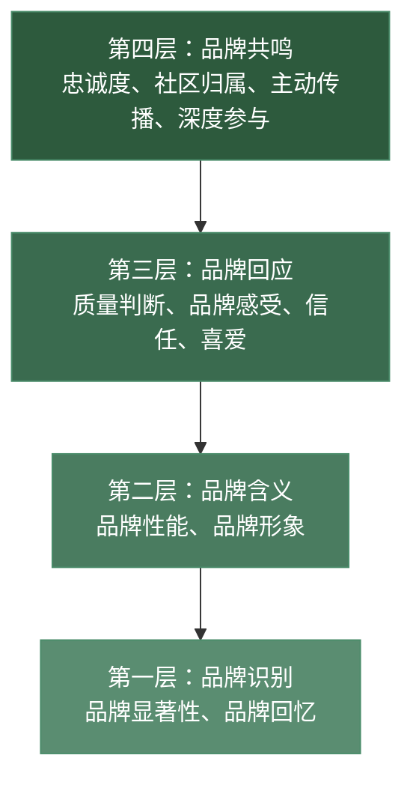
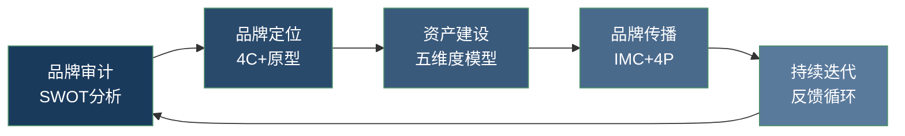

## 二、品牌营销理论

品牌营销理论是个人品牌建设的"底层操作系统"。很多人谈品牌只想到logo和口号，但真正驱动品牌价值的是背后一整套经过验证的理论体系。本节将系统拆解品牌营销的核心理论，并逐一映射到个人品牌的实际场景——从艾克的品牌资产模型到凯勒的品牌共鸣金字塔，从品牌原型到数字时代的整合传播，每一套理论都给出可以直接落地的操作框架。

---

### 2.1 品牌资产理论

品牌资产（Brand Equity）理论由美国学者大卫·艾克（David A. Aaker）在1991年提出，是品牌管理领域最具影响力的理论框架之一。艾克认为，品牌资产不是无形的"感觉"，而是可以被测量、管理和增值的战略资产。

#### 2.1.1 品牌资产的五个维度

艾克将品牌资产拆解为五个相互关联的维度。以下逐一说明其在个人品牌中的含义和操作方法：

**维度一：品牌认知度（Brand Awareness）**

品牌认知度衡量的是目标受众对品牌的识别和回忆能力。在个人品牌语境中，它回答的是"多少人知道你、在什么场景下想到你"这个问题。

认知度分为四个递进层次：

| 层次 | 定义 | 个人品牌示例 | 达成难度 |
|------|------|-------------|---------|
| 无认知 | 完全不知道你的存在 | 搜索"Python教学"时找不到你 | — |
| 辅助认知 | 看到名字有印象 | "这个名字好像在哪见过" | ★★ |
| 非辅助认知 | 主动联想到你 | "说到Python教学，我想到那个人" | ★★★★ |
| 首选认知 | 第一个想到你 | "学Python？你一定要看他的课" | ★★★★★ |

从无认知到首选认知，需要持续、一致、多渠道的内容输出。具体策略见本章第四节"品牌定位理论"。

**维度二：品牌联想（Brand Associations）**

品牌联想是人们想到你时，脑海中浮现的所有形象、情感和记忆的总和。它是品牌资产中最丰富、最有管理空间的维度。

品牌联想的三种类型：

- **属性联想**：受众对你的直接特征认知。例如"这个人很专业""说话很犀利""内容很实用"。属性联想是最基础的联想层，决定了你的"第一印象"。
- **利益联想**：受众认为你能带来的具体价值。例如"看他的文章能学到东西""跟着他做能赚钱""听他说话心情好"。利益联想决定了受众是否愿意持续关注你。
- **态度联想**：受众对你的情感态度。例如"信任他""佩服他""喜欢他"。态度联想是最深层的联想，决定了受众是否会主动传播你的品牌。

管理品牌联想的核心方法是"一致性强化"——在所有触点上重复传递同一组核心联想。比如你定位为"实战型Python讲师"，那么你的文章风格、视频内容、社群互动、甚至朋友圈，都应该强化"实战"这个联想，而不是今天聊Python、明天聊星座、后天聊美食。

**维度三：感知质量（Perceived Quality）**

感知质量是受众对你提供价值的主观评价，它不等于客观质量，但往往比客观质量更重要。一个技术水平一般但表达能力极强的讲师，可能比一个技术顶尖但讲课无聊的讲师获得更高的感知质量评价。

感知质量的驱动因素：

- **内容深度**：是否覆盖了受众需要的知识点
- **表达清晰度**：是否易于理解和消化
- **专业展示**：是否有案例、数据、证书等佐证
- **服务体验**：互动是否及时、态度是否专业
- **视觉呈现**：排版、设计、视频质量是否专业

提升感知质量的"展示策略"：不要只埋头提升客观质量，还要学会"让受众感知到质量"。具体方法包括：展示工作过程（不是只展示结果）、引用权威背书（行业大咖推荐、数据报告）、对比展示（用前后对比突出改善）、细节呈现（展示你比别人多做的那一步）。

**维度四：品牌忠诚度（Brand Loyalty）**

品牌忠诚度是品牌资产的核心——没有忠诚度的品牌，就像一个底部有洞的水桶，无论注入多少新流量都留不住。

忠诚度的五个层次（金字塔模型，从底部到顶部）：

          ┌──────────┐
          │  倡导者   │ ← 主动推荐你给他人
          ├──────────┤
          │  情感型   │ ← 对你产生情感连接
          ├──────────┤
          │  满意型   │ ← 认可你的价值
          ├──────────┤
          │  习惯型   │ ← 偶尔看看你的内容
          ├──────────┤
          │  随机型   │ ← 偶然接触，无固定行为
          └──────────┘

从随机型到倡导者的跃迁路径：

1. **随机→习惯**：通过稳定的内容更新节奏培养用户习惯（比如每天早上8点发一条干货）
2. **习惯→满意**：通过高质量内容让用户感受到"看你的东西有价值"
3. **满意→情感**：通过故事、互动、社群让用户与你建立情感连接
4. **情感→倡导**：通过社群身份认同和口碑激励让用户主动传播

**维度五：其他专有资产（Other Proprietary Assets）**

其他专有资产是你拥有的、竞争对手难以复制的独特资源。在个人品牌领域，这些资产包括：

- **独特方法论**：你原创的思考框架、教学体系、工作流程
- **标志性元素**：你的口头禅、视觉符号、内容风格
- **核心社群**：你的铁杆粉丝群、私域流量池
- **行业人脉**：与行业KOL、平台方的合作关系
- **内容资产**：你积累的文章、视频、课程等数字资产
- **数据资产**：你收集的用户画像、行为数据、反馈数据

#### 2.1.2 个人品牌资产评估实操表

定期（建议每季度）用以下表格评估你的品牌资产状态，追踪变化趋势：

| 维度 | 评估问题 | 评分标准 | 当前评分 | 目标评分 |
|------|---------|---------|---------|---------|
| 认知度 | 目标受众中有多少人知道你？ | 1=几乎无人知 10=行业标杆 | | |
| 品牌联想 | 想到你时，受众脑海中浮现什么？ | 1=模糊混乱 10=清晰聚焦 | | |
| 感知质量 | 受众如何评价你的专业水平？ | 1=不专业 10=顶级专家 | | |
| 品牌忠诚度 | 有多少人持续关注并推荐你？ | 1=无人关注 10=大量倡导者 | | |
| 专有资产 | 你拥有什么不可复制的独特资源？ | 1=没有壁垒 10=深度护城河 | | |

评分建议：用数据辅助评估。认知度可以用"搜索你的名字时的结果数量"或"社交媒体粉丝数"量化；感知质量可以用"内容互动率""用户评价分数"量化；忠诚度可以用"复购率""NPS净推荐值"量化。

#### 2.1.3 凯勒的品牌共鸣模型（CBBE模型）

凯勒（Kevin Lane Keller）在艾克的基础上提出了"基于顾客的品牌资产模型"（Customer-Based Brand Equity，CBBE），从消费者心理的角度构建了一个四层金字塔：

**第一层：品牌识别（Who are you?）**
确保受众能识别和回忆你的品牌。这是最基础的层次——如果受众连你是谁都不知道，后续一切都是空谈。

**第二层：品牌含义（What are you?）**
建立品牌联想，包括品牌性能（你做什么做得好）和品牌形象（你给人什么感觉）。在个人品牌中，这一步要回答"你代表什么"。

**第三层：品牌回应（What about you?）**
引导受众对品牌做出正面评价和情感反应。质量判断（"他很专业"）和品牌感受（"看他内容很开心"）是这一层的核心。

**第四层：品牌共鸣（What about you and me?）**
建立品牌与受众之间的深度心理联系。共鸣的最高形态是"忠诚的倡导者"——受众不仅自己认可你，还会主动向他人推荐你。

CBBE模型对个人品牌的核心启示：品牌建设是一个自下而上的过程，不能跳过底层直接追求"共鸣"。很多人一上来就想建社群、搞私域，但品牌识别和品牌含义都没建立起来，社群自然做不起来。

---

### 2.2 品牌故事理论

故事是人类最古老的沟通方式。神经科学研究（Paul Zak, 2015）表明，听故事时大脑会释放催产素（Oxytocin），这种"信任荷尔蒙"能显著提升听者对讲述者的信任感和共情能力。这意味着，好的故事不仅是"信息传递"，更是"神经化学层面的影响"。

#### 2.2.1 品牌故事的核心结构

所有有力量的品牌故事都遵循一个基本结构，可以概括为"四要素模型"：

**要素一：主角（Protagonist）**
你，品牌的主人。你就是故事的主角。但要注意——好的品牌故事不是"我有多厉害"的自夸，而是"我和你（受众）有同样的经历和困境"的共鸣。

**要素二：冲突（Conflict）**
你面临的问题和挑战。冲突是故事的引擎——没有冲突就没有张力，没有张力就没有吸引力。冲突越真实、越具体、越有共鸣，故事就越有力量。

**要素三：转折（Transformation）**
你如何克服挑战、实现突破。转折是故事的高潮，它展示了你的能力、方法和毅力。转折部分要具体——你做了什么、用了什么方法、花了多长时间、遇到了什么新的困难。

**要素四：价值（Value）**
你的故事对受众的意义。好的品牌故事不是自说自话，而是"我经历过这些，所以我能帮你也走出来"。

#### 2.2.2 四种核心品牌故事类型

| 类型 | 核心作用 | 关键要素 | 适用场景 |
|------|---------|---------|---------|
| 起源故事 | 建立初心和使命感 | 你为什么开始做这件事、最初的触发事件 | "关于我"页面、个人介绍、首次公开演讲 |
| 突破故事 | 展示能力和韧性 | 重大挑战→艰难尝试→关键突破→收获成长 | 产品发布会、课程宣传、求职面试 |
| 使命故事 | 传递价值观和长期承诺 | 你的信念、坚持的理由、为之付出的代价 | 年度总结、公开信、社群价值观建设 |
| 客户故事 | 提供社交证明 | 客户的困境→你的介入→具体变化→量化结果 | 案例展示、用户证言、营销推广 |

**案例：起源故事的写法**

一个有效的起源故事模板：

> **[身份/状态]** → **[触发事件]** → **[行动]** → **[结果]** → **[使命]**

示例：
> "我曾经是一名月薪5000的普通文员（身份），每天重复着没有成就感的工作。直到有一天，我看到一个和我背景相似的人通过学习数据分析成功转行，年薪翻了三倍（触发事件）。我花了六个月系统学习SQL、Python和数据可视化，同时在博客上记录学习过程（行动）。八个月后，我拿到了一家互联网公司的数据分析师offer，月薪15000（结果）。从那以后，我开始做数据分析教学，因为我相信：任何普通人，只要方法对、够坚持，都能实现职业跃迁（使命）。"

这个故事有效的原因：有具体数字（5000→15000）、有可复制的方法（SQL+Python+可视化）、有情感共鸣（普通人也能做到）、有清晰的使命（方法对+够坚持=成功）。

#### 2.2.3 品牌故事的神经科学基础

为什么故事比数据更有说服力？以下是关键的科学研究结论：

- **催产素效应**（Paul Zak, Claremont Graduate University）：当受试者听到有情感张力的故事时，大脑释放催产素，显著提升信任感和共情行为。实验显示，听完故事后受试者的捐款金额平均增加了一倍。
- **神经耦合**（Uri Hasson, Princeton University）：讲述者和听众的大脑活动会趋于同步——讲述者脑中被激活的区域，听众脑中对应区域也会被激活。故事越生动，耦合程度越高。
- **故事优势效应**（Narrative Superiority Effect）：人类记忆故事的能力远超记忆数据。研究表明，用故事包装的信息的记忆保留率是纯数据的22倍。

#### 2.2.4 品牌故事的常见误区

| 误区 | 问题 | 正确做法 |
|------|------|---------|
| 只讲成功 | 缺乏真实感和共鸣 | 包含真实的困难和失败 |
| 过于自夸 | 让受众觉得在吹牛 | 让受众成为"共同主角" |
| 细节缺失 | 故事空洞不可信 | 加入具体的时间、地点、数字 |
| 脱离受众 | 你的故事跟受众没关系 | 选择受众有共鸣的经历 |
| 一次讲完 | 浪费了叙事资源 | 将大故事拆成多个小故事系列化输出 |
| 编造故事 | 一旦被揭穿，品牌崩塌 | 基于真实经历，可以润色但不能编造 |

---

### 2.3 SWOT分析在个人品牌中的应用

SWOT分析是战略管理的经典工具，由Albert Humphrey在1960年代于斯坦福研究院提出。它将影响个人品牌的因素分为内部因素（优势/劣势）和外部因素（机会/威胁），帮助你从全局视角制定策略。

#### 2.3.1 四个维度的深度拆解

**优势（Strengths）——你的"护城河"**

优势是你相对于竞争者的差异化能力。识别优势时，避免泛泛的"我很努力""我热爱学习"，要找到具体的、可验证的、难以复制的能力：

- 你拥有什么独特的专业技能组合？（例如：同时懂编程和设计）
- 你有什么独特的经历或背景？（例如：在3个国家工作过）
- 你拥有哪些稀缺资源？（例如：行业头部人脉、独家数据）
- 你收到过哪些一致性的正面评价？（同事/客户反复提到的优点）
- 你的什么特质让你在同行中脱颖而出？

**劣势（Weaknesses）——需要正视的短板**

劣势不是"性格缺陷清单"，而是影响品牌建设的具体能力差距：

- 你的哪些能力不足会直接影响受众体验？（例如：表达能力差导致课程不好懂）
- 你缺乏哪些品牌建设必需的资源？（例如：没有视频拍摄设备、没有设计能力）
- 你的哪些习惯可能损害品牌形象？（例如：更新不稳定、经常迟到）
- 与同领域竞争者相比，你明显落后的是什么？

**机会（Opportunities）——可以借力的风口**

机会分析需要你跳出个人视角，关注行业和平台层面的变化：

- 你所在的领域正在经历什么增长？（例如：AI应用需求爆发）
- 哪些新平台/新形式正在崛起？（例如：短视频、播客、AI辅助创作）
- 哪些受众需求尚未被充分满足？（例如：B端技术人才的软技能培训）
- 哪些政策/技术变化对你有利？（例如：远程工作普及让在线教育需求增加）
- 有哪些潜在的合作伙伴可以加速你的品牌成长？

**威胁（Threats）——需要警惕的风险**

威胁分析要诚实面对你无法控制的外部风险：

- 谁是你的直接竞争者？他们在做什么？
- AI等技术是否可能替代你的核心价值？
- 平台政策变化是否可能影响你的分发渠道？
- 你的领域是否有"天花板"或"衰退"迹象？
- 哪些负面事件可能损害你的品牌声誉？

#### 2.3.2 SWOT矩阵与四类策略

完成四维分析后，交叉组合形成四类策略：

| | 机会（O） | 威胁（T） |
|---|----------|----------|
| **优势（S）** | **SO策略（进攻型）**：用优势抓住机会。例如：你擅长编程+AI需求爆发 → 转型AI应用教学 | **ST策略（防御型）**：用优势化解威胁。例如：你有深度内容壁垒+短视频冲击 → 强化"深度"差异化 |
| **劣势（W）** | **WO策略（改进型）**：弥补劣势抓住机会。例如：你不擅长视频+短视频崛起 → 学习视频制作或找合作 | **WT策略（规避型）**：最小化劣势+规避威胁。例如：内容单一+竞争加剧 → 聚焦细分赛道减少正面竞争 |

#### 2.3.3 SWOT分析实操模板

以下是可直接使用的SWOT分析模板，建议每季度填写一次，追踪策略调整：

个人品牌SWOT分析
日期：____年____月____日

【优势 Strengths】
1. [具体优势] → 对品牌的价值：___
2. [具体优势] → 对品牌的价值：___
3. [具体优势] → 对品牌的价值：___

【劣势 Weaknesses】
1. [具体劣势] → 影响程度：高/中/低 → 改善计划：___
2. [具体劣势] → 影响程度：高/中/低 → 改善计划：___
3. [具体劣势] → 影响程度：高/中/低 → 改善计划：___

【机会 Opportunities】
1. [具体机会] → 时间窗口：___ → 抓住机会需要的资源：___
2. [具体机会] → 时间窗口：___ → 抓住机会需要的资源：___

【威胁 Threats】
1. [具体威胁] → 发生概率：高/中/低 → 应对方案：___
2. [具体威胁] → 发生概率：高/中/低 → 应对方案：___

【策略制定】
SO策略（进攻）：___
ST策略（防御）：___
WO策略（改进）：___
WT策略（规避）：___

【本季度重点行动】
1. ___
2. ___
3. ___

---

### 2.4 品牌原型理论

品牌原型（Brand Archetypes）理论源自瑞士心理学家卡尔·荣格（Carl Jung）的原型心理学。荣格认为，人类集体无意识中存在12种基本原型，每种原型都对应着人类内心深处的某种渴望和恐惧。将原型理论应用于品牌建设，可以帮助你建立更深层的情感连接。

#### 2.4.1 12种品牌原型

| 原型 | 核心渴望 | 代表特质 | 个人品牌示例 |
|------|---------|---------|-------------|
| 英雄（Hero） | 证明自己的价值 | 勇敢、坚韧、激励 | 健身博主、创业导师、逆袭故事 |
| 智者（Sage） | 发现真理 | 智慧、理性、洞察 | 知识博主、分析师、研究者 |
| 探索者（Explorer） | 自由和发现 | 冒险、独立、好奇 | 旅行博主、独立开发者、自由职业者 |
| 创造者（Creator） | 创造新事物 | 创意、想象力、原创 | 设计师、艺术家、产品人 |
| 统治者（Ruler） | 控制和秩序 | 权威、领导力、高端 | 商业领袖、高端顾问、行业权威 |
| 照顾者（Caregiver） | 保护和关爱 | 温暖、体贴、无私 | 育儿博主、心理咨询师、教育者 |
| 普通人（Everyman） | 归属感 | 真实、亲和、平等 | 生活博主、社区运营、平民偶像 |
| 叛逆者（Rebel） | 打破规则 | 颠覆、大胆、反传统 | 科技评测、独立评论人、行业颠覆者 |
| 魔法师（Magician） | 实现梦想 | 转化、启发、神奇 | 转型教练、灵性导师、技术布道者 |
| 情人（Lover） | 亲密和体验 | 感性、热情、感官 | 美食博主、美妆博主、情感博主 |
| 弄臣（Jester） | 享受当下 | 幽默、轻松、反讽 | 搞笑博主、段子手、脱口秀演员 |
| 天真者（Innocent） | 安全和幸福 | 乐观、纯真、正能量 | 心灵鸡汤、生活方式、治愈系 |

#### 2.4.2 如何选择你的品牌原型

选择原型的三个原则：

**原则一：匹配你的核心性格。** 原型不是"演"出来的，而是你真实性格的放大。如果你天生幽默风趣，硬要装"智者"只会让人觉得别扭。

**原则二：匹配受众的心理需求。** 你的受众内心渴望什么？如果他们是迷茫的职场新人，"智者"或"英雄"原型更能吸引他们；如果他们是压力山大的中年人，"照顾者"或"弄臣"可能更有效。

**原则三：可以混合，但要有主次。** 大多数成功的个人品牌都混合了2-3种原型，但一定有一个主导原型。例如："智者70%+创造者30%"——一个有原创方法论的知识型博主。

#### 2.4.3 原型一致性检查

选定原型后，用以下清单检查你的所有品牌触点是否一致：

- [ ] 个人简介/介绍是否符合原型调性？
- [ ] 内容风格是否与原型一致？（智者→深度分析；弄臣→轻松幽默）
- [ ] 视觉设计是否匹配原型？（统治者→简洁高端；创造者→色彩丰富）
- [ ] 互动方式是否符合原型？（照顾者→温暖耐心；叛逆者→犀利直接）
- [ ] 产品/服务定价是否匹配原型？（普通人→平价亲民；统治者→高客单价）

---

### 2.5 营销理论在个人品牌中的应用

#### 2.5.1 4P营销理论

4P理论由杰罗姆·麦卡锡（E. Jerome McCarthy）在1960年提出，是营销学的基石。将4P映射到个人品牌：

**产品（Product）——你提供的核心价值**

个人品牌的"产品"是一个多层次的价值体系：

- **核心产品**：你解决的根本问题。例如："帮助程序员提升职场竞争力"
- **形式产品**：你的内容/服务的具体形态。例如：技术文章、视频课程、一对一辅导
- **附加产品**：超出预期的附加价值。例如：社群答疑、学习资料包、就业推荐

产品策略的关键：持续迭代。你的"产品"需要根据受众反馈不断优化。定期收集用户反馈（问卷、评论、私信），建立"需求→开发→反馈→优化"的闭环。

**价格（Price）——价值交换的筹码**

个人品牌的"价格"有两种形式：

- **注意力价格**：受众花时间消费你的免费内容。降低注意力价格的方法：内容结构化、标题清晰、段落简短、多用图表。
- **金钱价格**：受众为你的付费内容/服务付费。定价策略取决于品牌定位：高端定位→高客单价、少量客户；大众定位→低客单价、规模化。

定价心理学要点：
- 锚定效应：先展示高价产品，再展示目标产品，后者会显得"更便宜"
- 价格锚点：用"每天不到一杯咖啡的钱"来降低用户的感知成本
- 三档定价：提供基础版、标准版、高级版三个价格选项，大多数人会选择中间档

**渠道（Place）——触达受众的路径**

渠道策略的核心是"在哪里能找到你的目标受众"。常见渠道及其特点：

| 渠道类型 | 代表平台 | 优势 | 劣势 | 适合阶段 |
|---------|---------|------|------|---------|
| 短视频 | 抖音、B站、YouTube | 流量大、传播快 | 制作成本高、竞争激烈 | 扩大认知 |
| 图文社区 | 知乎、小红书、公众号 | 深度内容承载强 | 增长较慢 | 建立专业形象 |
| 长文博客 | 个人网站、Medium | SEO友好、完全可控 | 需要长期积累 | 深度内容沉淀 |
| 音频播客 | 小宇宙、Apple Podcast | 伴随性强、用户粘性高 | 发现机制弱 | 深度连接 |
| 私域社群 | 微信群、知识星球 | 高粘性、高转化 | 规模有限 | 深度服务和变现 |
| 线下活动 | 讲座、Workshop、行业大会 | 面对面建立信任 | 覆盖范围有限 | 建立权威感 |

渠道组合建议：不要全平台铺开。选择1-2个主力渠道深耕，1-2个辅助渠道分发。例如：知乎（主力深度内容）+ 抖音（辅助扩大曝光）+ 微信社群（深度服务和变现）。

**推广（Promotion）——让受众知道你**

推广策略需要与品牌定位一致。以下是个人品牌常用的推广方式：

- **内容营销**：通过高质量内容自然吸引受众（成本最低、效果最持久）
- **SEO优化**：让你的内容在搜索引擎中排名靠前（长尾流量来源）
- **社群运营**：在相关社群中提供价值、建立存在感（精准获客）
- **合作互推**：与同领域但不直接竞争的创作者交换资源（互利共赢）
- **付费推广**：通过广告投放加速曝光（需要预算，但效率高）
- **媒体/PR**：接受采访、发表专栏、参加播客（建立权威背书）

#### 2.5.2 4C营销理论

4C理论由罗伯特·劳特朋（Robert Lauterborn）在1990年提出，将视角从品牌方转向消费者。对于个人品牌来说，4C比4P更具指导意义，因为个人品牌的核心就是"为受众创造价值"。

**客户需求（Customer Needs & Wants）**

不是你想讲什么，而是受众需要听什么。识别客户需求的方法：

- 分析你所在领域的热门问题（知乎热榜、Quora、Reddit、Stack Overflow）
- 观察竞品内容的高互动话题（什么内容获得了最多点赞和评论）
- 直接问受众（问卷调查、社群投票、一对一访谈）
- 分析搜索数据（百度指数、Google Trends、5118等工具）

**成本（Cost to the Customer）**

受众的"成本"远不止金钱。降低受众成本是提升品牌吸引力的关键杠杆：

- **时间成本**：你的内容是否足够精炼？能否用10分钟讲清楚别人用1小时才能讲明白的东西？
- **注意力成本**：你的内容结构是否清晰？标题和开头是否能快速抓住注意力？
- **学习成本**：你的内容是否有门槛？能否为不同水平的受众提供不同层次的内容？
- **机会成本**：受众选择你，就放弃了选择别人。你是否能证明"选我比选别人更值"？

**便利性（Convenience）**

便利性决定了受众的"体验成本"：

- 内容是否容易找到？（SEO、平台推荐、社群分享）
- 内容是否容易消费？（排版清晰、视频字幕、音频文稿）
- 内容是否容易使用？（提供模板、清单、可执行的步骤）
- 付费流程是否顺畅？（支付方式多样、退款政策清晰）
- 售后服务是否便捷？（答疑渠道清晰、响应及时）

**沟通（Communication）**

个人品牌强调双向沟通而非单向传播。有效的品牌沟通包括：

- **倾听**：认真阅读每一条评论和私信，理解受众的真实想法
- **回应**：及时、真诚、有温度地回复受众的提问和反馈
- **共创**：邀请受众参与内容选题、产品设计、功能测试
- **透明**：公开你的工作进展、收入情况、遇到的困难（适度的透明建立信任）

#### 2.5.3 整合营销传播理论（IMC）

整合营销传播（Integrated Marketing Communications, IMC）由唐·舒尔茨（Don E. Schultz）在1993年提出，核心理念是"用一个声音说话"。

在个人品牌中的应用：

**一致性矩阵**：确保以下要素在所有平台和内容形式中保持一致：

| 一致性要素 | 说明 | 检查方法 |
|-----------|------|---------|
| 定位语 | 一句话描述你是谁 | 所有平台的"一句话介绍"是否一致？ |
| 视觉风格 | 配色、字体、图片风格 | 跨平台的视觉是否统一？ |
| 语言风格 | 正式/口语、专业/通俗 | 不同内容中的语气是否一致？ |
| 核心价值观 | 你倡导什么、反对什么 | 你的内容是否始终在传递同一组价值观？ |
| 价值承诺 | 受众关注你能得到什么 | 你的内容是否持续兑现这个承诺？ |

**全渠道传播的"7-11-4法则"**：营销研究表明，受众平均需要接触品牌7次以上才会产生信任、11次以上才会考虑购买、4次以上的深度互动才会形成忠诚。这意味着你的内容需要在多个渠道重复触达同一受众——这就是IMC强调"一个声音"的原因：如果每次触达传递的信息不一致，7次触达的效果可能还不如1次。

---

### 2.6 品牌营销理论的整合应用框架

理解了以上理论后，关键是如何将它们整合成一个可执行的品牌建设框架。以下是将多种理论融合的"五步法"：

**第一步：品牌审计（SWOT分析）**

每季度做一次SWOT分析，了解你的品牌现状和外部环境。这一步回答"我在哪里"。

**第二步：品牌定位（4C+原型理论）**

基于SWOT分析，用4C理论理解受众需求，选择你的品牌原型和定位。这一步回答"我要成为谁"。

**第三步：品牌资产建设（艾克五维度）**

围绕五个维度系统提升品牌资产：先建认知度（让更多人知道你），再建品牌联想（让人们对你有清晰印象），同时提升感知质量（让人觉得你专业），最终培养忠诚度（让人主动推荐你）。这一步回答"我要怎么建"。

**第四步：品牌传播（IMC+4P）**

用IMC理论确保"一个声音"，用4P理论优化产品、定价、渠道和推广。这一步回答"我要怎么传播"。

**第五步：品牌迭代（持续反馈循环）**

通过用户反馈、数据分析和定期评估（品牌资产评估表+CBBE模型），持续优化品牌建设策略。这一步回答"我要怎么进化"。

### 2.7 常见误区与纠正

| 误区 | 错误做法 | 正确做法 |
|------|---------|---------|
| "理论无用" | 凭感觉做品牌，没有框架指导 | 用理论框架指导决策，减少试错成本 |
| "只看数据" | 完全依赖数据，忽视品牌直觉和创意 | 数据是参考，不是决策的唯一依据 |
| "一步到位" | 品牌定位确定后永远不变 | 每季度复盘，根据环境变化微调定位 |
| "全平台铺开" | 同时运营10个平台，每个都做不好 | 聚焦1-2个主力平台深耕 |
| "只管输出" | 只发布内容，不关注受众反馈 | 建立双向沟通机制，定期收集反馈 |
| "模仿成功者" | 照搬KOL的风格和策略 | 分析底层逻辑，结合自身特质定制方案 |
| "品牌=视觉" | 把品牌建设等同于设计logo和美化页面 | 品牌的核心是价值和关系，视觉只是载体 |
| "急于变现" | 刚有几百粉丝就开始卖课 | 先建立信任和价值，变现是水到渠成的结果 |

---

本节系统梳理了品牌营销的核心理论体系——从艾克的品牌资产五维度到凯勒的共鸣金字塔，从品牌原型到整合营销传播。这些理论不是"纸上谈兵"，而是无数品牌实践验证过的底层规律。下一节将在此基础上，深入探讨品牌定位的具体方法和实操策略。
