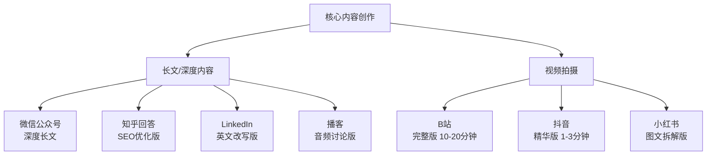
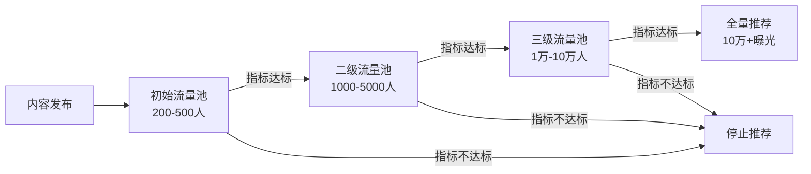

## 三、社交媒体时代的特点

个人品牌的建立和传播离不开社交媒体。要有效利用社交媒体，首先需要深刻理解这个时代的底层逻辑——信息如何流动、注意力如何分配、平台如何运作。本节将从注意力经济的本质出发，逐一拆解主流平台的运作机制、算法逻辑和运营要点，帮助你建立对社交媒体生态的系统认知。

### 3.1 注意力经济：信息时代的硬通货

#### 3.1.1 从稀缺到争夺：注意力经济的底层逻辑

1971年，诺贝尔经济学奖得主赫伯特·西蒙（Herbert A. Simon）提出了一个影响深远的判断："信息的丰富意味着注意力的贫乏。"（A wealth of information creates a poverty of attention.）这句话在半个世纪后的今天，已经成为互联网经济的核心定律。

注意力经济（Attention Economy）的本质是：在信息爆炸的环境中，人类的注意力总量是有限的，它成为比信息本身更稀缺的资源。根据加州大学圣迭戈分校的研究，现代人每天接收的信息量约为34GB，相当于阅读约174份报纸的内容。然而，人类的认知处理能力并没有随之增长——心理学研究表明，人的注意力带宽在任一时刻只能处理4-7个信息单元（乔治·米勒的"神奇数字7±2"）。

这种供需失衡创造了一个全新的经济形态：注意力成为商业价值链的核心节点。所有的商业模式，无论是广告、电商还是知识付费，本质上都是在争夺注意力、经营注意力、变现注意力。

对于个人品牌而言，这意味着一个根本性的认知转变：你的价值不仅在于你"知道什么"或"能做什么"，更在于你"能否被看见"。酒香也怕巷子深——在注意力经济中，传播力是与专业力同等重要的核心竞争力。

#### 3.1.2 注意力的获取、锁定与转化

注意力管理不是一次性行为，而是一个持续的漏斗模型。我们可以将它分为三个递进层次：

**第一层次：吸引注意力（Awareness）**

在信息洪流中，用户平均只花1.7秒决定是否点击一条内容（微软广告研究数据），3-10秒决定是否继续阅读。这意味着你的内容必须在极短时间内完成"拦截"。

吸引注意力的核心法则是"反差"——提供与受众预期不同的内容。反差可以来自多个维度：

- **信息反差**：提供颠覆常识的数据或观点（如"90%的简历都在3秒内被淘汰"比"简历很重要"更具冲击力）
- **视觉反差**：使用与平台主流风格不同的排版、配色或封面设计
- **情感反差**：在严肃话题中注入幽默，或在轻松话题中引发深度思考
- **身份反差**：展现与典型身份不一致的能力（如程序员做美妆博主、医生教炒股）

吸引注意力的具体手段包括：高信息密度的标题、前3秒的强钩子（短视频）、高质量的首图和封面（图文平台）、争议性或悬念性的开场白。

**第二层次：锁定注意力（Engagement）**

吸引了注意力之后，你需要在3-10秒内证明"你值得被关注"。这是注意力漏斗中最关键的转化环节。

锁定注意力的核心是"快速给出价值信号"——让受众在最短时间内感知到你内容的价值。具体方法：

- **结构化承诺**：在开头告诉读者"看完这篇你将获得什么"，给出明确的价值预期
- **信息密度**：前20%的内容应包含至少30%的核心信息量，避免铺垫过长
- **互动钩子**：提问、投票、挑战等互动元素，让受众从被动消费变为主动参与
- **进度暗示**：使用"第一个方法""核心要点"等标记，让受众知道内容正在推进

**第三层次：培养注意力习惯（Habit Formation）**

最高层次的注意力管理是让受众养成关注你的习惯——你的内容成为他们日常生活的一部分。这是个人品牌最强大的护城河，因为习惯意味着高粘性和低流失率。

培养习惯的核心是"固定节奏 + 持续价值"：

- **固定节奏**：在固定的时间发布固定类型的内容。周一干货、周三案例、周五互动——这种可预期的节奏会形成用户的心理"期待"。研究表明，当用户对某个内容源形成期待时，主动搜索该内容的概率提高3-5倍
- **持续价值**：每次内容都能兑现承诺，创造正向反馈循环。一次失望就可能导致取消关注
- **社区归属**：通过评论区互动、粉丝社群、专属内容等方式，让用户从"看你"变为"属于你"

#### 3.1.3 注意力管理的量化指标

注意力管理不能靠直觉，需要数据驱动。以下是核心的量化指标：

| 指标层级 | 核心指标 | 计算方式 | 健康基准 |
|---------|---------|---------|---------|
| 吸引层 | 点击率（CTR） | 点击数/曝光数 | 图文>3%，视频>5% |
| 吸引层 | 封面停留时间 | 首屏停留时长 | >2秒 |
| 锁定层 | 完播率/阅读完成率 | 完整消费人数/点击人数 | 视频>30%，文章>40% |
| 锁定层 | 互动率 | 互动数/曝光数 | >3% |
| 转化层 | 关注转化率 | 新关注数/曝光数 | >1% |
| 习惯层 | 回访率 | 内容回访用户/总用户 | >15% |
| 习惯层 | 打开率（公众号） | 阅读数/关注数 | >5% |

### 3.2 主流社交媒体平台深度分析

理解每个平台的底层逻辑、用户画像和内容生态，是个人品牌运营的基础。以下对主流平台进行系统性分析，不仅告诉你"是什么"，更告诉你"为什么"和"怎么做"。

#### 3.2.1 微信公众号

**平台定位**：中文互联网最大的深度内容平台，个人品牌的核心阵地。

**用户画像**：
- 月活用户超过13亿（含微信整体生态），公众号日活阅读用户约5亿
- 年龄分布广泛，25-45岁为阅读主力
- 用户教育水平和消费能力整体偏高
- 阅读场景以碎片化时间为主（通勤、午休、睡前）

**算法与分发机制**：
微信公众号的内容分发经历了三个阶段。早期（2012-2018）完全依赖订阅关系，粉丝看到什么取决于你发了什么。中期（2018-2022）引入"看一看"和社交推荐，好友的在看和分享开始影响曝光。现阶段（2023至今），"推荐"流量占比显著增加，算法开始基于内容质量和用户兴趣进行个性化推荐，但社交关系仍然是权重最高的分发因素。

**关键影响因素**：
- 社交推荐（好友在看、分享）权重最高
- 打开率和完读率影响后续推荐量
- 标题和封面图影响打开率，但"标题党"会被限流
- 发布时间影响初始打开率（推荐早8点、中午12点、晚8-10点）
- 原创标识有助于获得推荐加权

**变现路径**：
微信公众号是变现最成熟的中文内容平台。主要变现方式包括：流量主广告（阅读量达到500可开通，按点击计费，单次点击0.5-5元）、付费阅读（设置单篇或合集付费）、品牌广告接单（1万粉以上有商业合作机会）、导流私域（将读者导入个人微信或社群，进行后续转化）、知识付费（通过课程、训练营、会员制变现）。

**适合谁**：擅长文字表达、愿意投入时间打磨深度内容的创作者。特别是知识分享类、行业分析类、教育类个人品牌。

**运营要点**：
- 内容质量是核心——一篇10万+的深度文章带来的品牌价值远超100篇水文
- 重视标题的"信息承诺"而非"情绪刺激"，后者短期有效但损害长期信任
- 每篇文章应包含至少一个可被读者分享给朋友的"金句"或"洞察"
- 善用合集功能构建系统化内容体系
- 将读者引导至个人微信或社群，建立更强的连接

#### 3.2.2 小红书

**平台定位**：中国最大的生活方式分享平台，"种草"文化的发源地。

**用户画像**：
- 月活用户超过3亿，日活用户约1.2亿
- 以18-35岁女性为主（约70%），但男性用户占比持续提升
- 一二线城市用户占比超过60%，消费能力整体偏高
- 用户使用目的明确：搜索决策信息、发现生活方式、获取实用攻略

**算法与分发机制**：
小红书采用"双列信息流+搜索"的分发模式。内容发布后，平台先将其推送给一小批匹配用户（初始流量池约200-500人），根据互动数据决定是否扩大推荐。与抖音不同的是，小红书的搜索流量占比极高（约40%），这意味着SEO优化（标题关键词、标签设置）至关重要。

**核心指标权重**：收藏 > 评论 > 点赞 > 分享 > 关注。收藏率是小红书算法最看重的指标，因为它代表内容的实用价值。一篇被大量收藏的笔记会获得持续的搜索推荐流量。

**内容形式**：
- 图文笔记：封面图决定点击率，正文决定收藏率。建议比例3:4（竖版），信息密度高
- 视频笔记：1-5分钟为佳，真人出镜的教程类和vlog类效果最好
- 合集功能：将相关笔记组织为合集，提升用户停留时间和关注转化

**变现路径**：
小红书的商业化程度较高。主要方式包括：品牌合作（通过蒲公英平台接单，1000粉即可开通）、商品橱窗（直接带货，适合测评和好物推荐类账号）、付费专栏（知识付费功能）、私域导流（引导至微信进行高客单价转化）、直播带货（小红书直播电商增长迅速）。

**适合谁**：生活方式、美妆护肤、穿搭时尚、家居装修、美食烘焙、旅行探店等领域。也是知识类博主的优质平台——"干货笔记"在小红书的搜索流量中表现极好。

**运营要点**：
- 封面图是第一生产力——高清、信息量大、风格统一的封面图能显著提升点击率
- 善用关键词布局：标题包含核心关键词，正文自然嵌入长尾关键词，标签覆盖相关搜索词
- 收藏率是核心指标——在内容中提供"值得收藏"的干货（清单、攻略、模板、对比表格）
- 评论区互动直接影响推荐量，及时回复每一条评论
- 保持更新频率：初期建议每天1篇，稳定后每周3-5篇

#### 3.2.3 抖音

**平台定位**：中国最大的短视频平台，日活用户超过7亿，是流量最密集的公域池。

**用户画像**：
- 日活超过7亿，覆盖最广泛的中文用户群体
- 用户年龄分布广泛，18-50岁均有大量活跃用户
- 三四线城市用户占比超过50%，下沉市场渗透率极高
- 用户使用目的以娱乐消遣为主，但知识学习需求增长迅速

**算法与分发机制**：
抖音的核心算法逻辑是"去中心化推荐"——不看你有多少粉丝，只看你的内容质量。每条视频发布后进入初始流量池（约200-500播放），算法根据以下指标决定是否推向更大的流量池：

- **完播率**（权重最高）：有多少人完整看完你的视频？完播率>30%是进入下一级流量池的基本门槛
- **互动率**：点赞、评论、分享、收藏的综合比率
- **分享率**：分享到私信或朋友圈的比率——分享是最高级别的认可
- **关注率**：看完视频后关注你的比率
- **负反馈率**：不感兴趣、举报等负面信号

算法的推荐模型可以用一个简化的公式理解：推荐权重 = 完播率 × 0.3 + 点赞率 × 0.2 + 评论率 × 0.2 + 分享率 × 0.15 + 关注率 × 0.15。注意这个权重并非官方公布，而是行业研究的经验总结，不同类目和时期会有调整。

**内容形式**：
- 短视频：15秒-3分钟，前3秒是生死线——如果前3秒无法吸引注意，用户会直接划走
- 中视频：1-10分钟，知识类和教程类内容的主战场
- 图文：近两年新增的图文内容形式，类似小红书笔记
- 直播：互动性强，适合建立深度连接和即时变现

**变现路径**：
抖音的变现生态非常完善。主要包括：直播打赏和带货（最大的变现渠道）、星图广告（品牌合作，1万粉可开通）、商品橱窗（短视频带货）、付费课程（抖音学浪平台）、私域导流（引流至微信）、账号交易（粉丝量达到一定规模后有交易价值）。

**适合谁**：有视频表达能力、能快速产出内容的创作者。知识类博主在抖音有巨大机会——"知识短视频"是抖音重点扶持的内容类目。

**运营要点**：
- 前3秒是核心——用反常识数据、提问、冲突开场来抓住注意力
- 完播率是最重要的算法指标——视频时长越短越容易获得高完播率，但也要保证信息密度
- 蹭热点是获取初始流量的有效手段，但热点内容的粉丝转化率通常较低
- 建立辨识度：统一的开场白、视觉风格、表达方式
- 保持高频更新：日更是获取算法推荐的基本要求，至少每周3-5条

#### 3.2.4 B站（哔哩哔哩）

**平台定位**：中国最大的年轻文化视频社区，知识类内容的"最高学府"。

**用户画像**：
- 月活用户超过3.4亿，日活用户约1亿
- 以Z世代（18-30岁）为核心用户群，平均年龄约22岁
- 一二线城市用户占比高，大学及以上学历用户占比超过70%
- 用户学习意愿极强——B站被称为"中国年轻人的学习平台"

**算法与分发机制**：
B站的推荐算法与抖音有显著差异。B站更重视"完播率"和"互动深度"，而非单纯的点击量。具体来说：

- **完播率**：中长视频的核心指标。一个10分钟的视频，如果平均观看时长达到6分钟以上（60%完播率），算法会大幅增加推荐
- **互动深度**：弹幕 > 评论 > 投币 > 收藏 > 点赞。B站独有的"投币"机制代表用户的高度认可，权重远高于普通点赞
- **长期价值**：B站内容的生命周期远长于抖音。一条优质视频可以持续获得推荐流量数月甚至数年
- **粉丝关系**：B站的粉丝关系比抖音更紧密，粉丝的二次传播（分享、转载）对推荐有显著影响

**内容形式**：
- 中长视频（5-30分钟）是B站的主流形式
- 知识区和科技区是增长最快的内容品类
- 专栏（图文形式）是B站的补充内容形式
- 直播和动态是增强粉丝互动的工具

**变现路径**：
B站的变现能力相对较弱但正在改善。主要方式包括：创作激励计划（按播放量和互动量分配收益，但单价较低）、花火平台（品牌合作广告）、充电计划（粉丝打赏）、付费课程（B站课堂）、电商导流（引导至淘宝等平台）、直播收益。

**适合谁**：能够制作高质量中长视频的知识类创作者。特别是技术教学、学术科普、行业深度分析、技能教程等领域。

**运营要点**：
- 内容深度是B站的核心竞争力——用户愿意花10-30分钟看一个有深度的视频
- 系列化内容效果极好——通过系列视频培养用户持续关注
- 标题和封面的"反差感"是获取点击的关键——B站用户对标题党有一定容忍度但反感低质量内容
- 善用弹幕互动——在视频中留下弹幕讨论的话题点
- 内容生命周期长，适合"时间换空间"的策略——不必追求爆款，持续产出高质量内容就能积累

#### 3.2.5 知乎

**平台定位**：中文互联网最大的问答和知识分享平台，SEO价值极高的长尾流量池。

**用户画像**：
- 月活用户超过1亿
- 以高学历、高收入、高消费力的"三高"用户为核心
- 25-40岁用户占比超过60%
- 用户使用目的以搜索信息、获取专业解答为主

**算法与分发机制**：
知乎的内容分发有两个流量入口：站内推荐和搜索引擎。知乎内容在百度、搜狗等搜索引擎中的排名极高，这意味着一篇优质回答可以持续获得数年的搜索流量。

站内推荐的核心指标：回答的赞同数、评论数、专业度标签、作者等级。知乎的算法对"专业性"有明显的偏好——来自高权重作者（盐值高、创作等级高）的回答更容易获得推荐。

**内容形式**：
- 问答（核心形式）：回答别人的问题，是知乎最基本的内容单元
- 文章：独立发布的长文，适合系统化的知识分享
- 视频：知乎鼓励视频创作，但图文仍是主力
- 想法：类似微博的短内容形式
- 盐选专栏：付费内容形式

**变现路径**：
知乎的变现方式相对有限但质量较高。主要包括：知+自选（付费推广，适合商业内容）、品牌合作（品牌软文和问答植入）、盐选付费内容（写付费专栏或小说）、引流变现（通过知乎导流到微信或个人网站）、付费咨询（一对一问答）。

**适合谁**：专业知识丰富、文字功底扎实、擅长结构化表达的创作者。特别适合咨询师、律师、医生、工程师、金融从业者等专业人群。

**运营要点**：
- 选择高搜索量的问题回答——知乎的长尾流量价值远超站内推荐
- 回答要有深度——知乎用户对浅薄内容的容忍度极低
- 建立专业人设——在垂直领域持续深耕，获得官方认证标签
- 长期主义——知乎的增长曲线是"慢启动"型，需要3-6个月的积累
- 善用"一句话"开头吸引注意力——知乎回答的前两行决定了是否有更多人展开阅读

#### 3.2.6 微博

**平台定位**：中国最大的公开社交媒体平台，热点事件的首发地和舆论场。

**用户画像**：
- 月活用户超过5.9亿，日活用户约2.5亿
- 用户年龄分布广泛，18-40岁为主力
- 用户表达欲强，参与公共讨论的意愿高
- 以娱乐、时事、社会话题为主要内容消费方向

**算法与分发机制**：
微博的内容分发是"热点驱动+社交关系"的混合模型。微博热搜是最大的流量入口，登上热搜的内容可以在短时间内获得数亿曝光。日常内容的分发则主要依赖社交关系和兴趣推荐。

**适合谁**：适合需要快速传播、制造话题、参与公共讨论的个人品牌。特别是时事评论员、行业意见领袖、娱乐文化类创作者。

**运营要点**：
- 热点反应速度是关键——在热点事件发生后2小时内发表观点，能获得最大曝光
- 互动性极强——积极回复评论、参与话题讨论是涨粉的核心
- 微博适合"引爆"但不适合"沉淀"——适合做事件营销和话题传播，长期品牌建设需要配合其他平台

#### 3.2.7 LinkedIn（领英）

**平台定位**：全球最大的职业社交平台，B2B个人品牌的核心阵地。

**用户画像**：
- 全球会员超过10亿，中国用户约6000万
- 以职场人士、企业高管、招聘者为核心用户
- 用户使用目的明确：职业发展、行业交流、商务拓展
- 用户消费能力和决策权整体偏高

**算法与分发机制**：
LinkedIn的内容分发以"职业相关性"和"互动深度"为核心。平台偏好原创内容、行业洞察、个人经验分享。LinkedIn的算法对"知识型内容"（带有多段文字的长帖）有明显的加权——纯文本长帖的平均曝光量比带链接的帖子高出2-3倍。

**适合谁**：有国际化需求的职场人士、B2B业务从业者、企业高管、行业专家。

**运营要点**：
- 使用英文发布内容，覆盖全球受众
- 长文本帖+个人故事是LinkedIn最有效的内容形式
- 在评论区与行业人士互动是扩大影响力的关键
- LinkedIn的内容生命周期长——一条优质帖子可以在一周内持续获得曝光

#### 3.2.8 播客（小宇宙、喜马拉雅、Apple Podcasts）

**平台定位**：深度内容消费的音频平台，高知人群的"第二屏幕"。

**用户画像**：
- 以25-40岁高知人群为核心用户
- 使用场景以通勤、运动、家务等"伴随性场景"为主
- 用户忠诚度极高——订阅播客的行为本身就是深度认可
- 消费能力整体偏高

**为什么播客值得做**：播客是所有内容形式中"信任传递效率"最高的。音频的亲密感远超图文和视频——听众每天在耳机里听你说话30-60分钟，这种陪伴感会快速建立深度信任。播客听众的平均关注转化率和商业转化率都远高于其他平台。

**适合谁**：有深度观点、擅长对话交流的创作者。特别适合行业访谈、知识解读、故事叙述类内容。

**运营要点**：
- 音频质量是基础——一个好的麦克风和安静的录制环境比内容更重要
- 固定更新节奏——每周1-2期是播客的黄金频率
- 邀请嘉宾是快速扩大影响力的方式——嘉宾会把你的播客分享给他的受众
- 将播客内容二次加工为图文和短视频，实现多平台分发

### 3.3 平台选择策略与矩阵构建

#### 3.3.1 平台选择的决策框架

选择平台不是凭感觉，而是需要系统性的决策。以下是四个核心维度的评估框架：

**维度一：目标受众匹配度**

你的目标受众在哪个平台最集中？这是一切决策的起点。通过以下方法研究受众分布：

- 使用各平台的搜索功能，搜索你的领域关键词，观察相关内容的数量和互动情况
- 查看你的同行和竞争对手主要在哪些平台活跃
- 使用百度指数、微信指数等工具，分析不同平台上的搜索热度
- 在社交平台上直接询问你的受众"你常用哪些平台"

**维度二：内容形式适配度**

你的核心能力和内容形式更适合哪个平台？

| 内容形式 | 最佳平台 | 次优平台 | 不推荐 |
|---------|---------|---------|-------|
| 深度长文 | 微信公众号、知乎 | B站专栏、头条号 | 抖音、微博 |
| 短视频（<1分钟） | 抖音、快手 | 小红书、视频号 | 知乎、公众号 |
| 中长视频（5-30分钟） | B站、YouTube | 视频号、知乎 | 微博、小红书 |
| 图文笔记 | 小红书 | 微信公众号、知乎 | 抖音、B站 |
| 音频内容 | 小宇宙、喜马拉雅 | Apple Podcasts | 抖音、小红书 |
| 行业洞察 | LinkedIn、知乎 | 微信公众号、微博 | 快手、小红书 |

**维度三：精力投入回报比**

运营多个平台需要大量精力。建议采用"1+2"策略：

- 1个主平台：投入80%的精力，做到该平台同类账号的前20%
- 2个辅助平台：投入20%的精力，主要用于内容分发和引流
- 随着个人品牌的发展，逐步扩展到更多平台

**维度四：平台生命周期**

选择处于上升期的平台能享受增长红利。判断方法：
- 看平台的用户增长趋势（月活数据是否持续增长）
- 看平台对新创作者的扶持力度（是否提供流量扶持计划）
- 看平台的商业化成熟度（变现渠道是否完善）
- 看内容供给的饱和度（竞争是否已经白热化）

#### 3.3.2 多平台协同的"内容中台"策略

在多个平台运营不等于在每个平台从零开始创作。高效的做法是建立"内容中台"——以一个核心内容为基础，根据各平台特点进行适配性改造。

**内容中台的操作流程**：

1. **创作核心内容**：选择一个主题，以你最擅长的形式创作核心内容（长文或视频）
2. **平台适配改造**：根据各平台的特点进行二次加工——调整标题、长度、格式、封面
3. **差异化发布**：不同平台的发布时间错开1-3天，避免被识别为"搬运"
4. **数据回流**：收集各平台的数据反馈，优化下次的核心内容创作方向

### 3.4 社交媒体算法机制深度解析

#### 3.4.1 推荐算法的通用模型

虽然各平台的具体算法不同，但底层的推荐逻辑高度相似。大多数平台采用"阶梯式推荐"（也叫"赛马机制"）模型：

这个模型包含两个关键信息：

第一，**内容质量决定天花板**。算法不会因为你是大V就给你更多推荐——每条内容都从初始流量池开始，用数据证明自己的价值后才能"晋级"。这意味着即使是0粉丝的新账号，也能通过一条优质内容获得百万曝光。

第二，**初始互动至关重要**。内容发布后的第一个小时是"黄金时间"——初始流量池的反馈数据直接决定了内容的命运。因此，发布时间的选择（选在受众最活跃的时间段）、发布后的互动引导（引导粉丝评论和分享）是运营的关键细节。

#### 3.4.2 各平台算法的核心差异

| 维度 | 抖音 | 小红书 | 微信公众号 | B站 | 知乎 |
|-----|------|-------|----------|-----|-----|
| 最核心指标 | 完播率 | 收藏率 | 社交分享 | 完播率+投币 | 赞同数+专业度 |
| 流量来源 | 公域为主 | 公域+搜索 | 私域+推荐 | 公域+关注 | 搜索+推荐 |
| 内容生命周期 | 短（3-7天） | 中（1-3个月） | 短（24-48小时） | 长（数月-数年） | 极长（数年） |
| 粉丝权重 | 低 | 中 | 高 | 高 | 中 |
| 新号机会 | 极高 | 高 | 低 | 中 | 中 |
| 更新频率要求 | 高（日更） | 中（3-5次/周） | 低（1-2次/周） | 低（1-2次/周） | 中（2-3次/周） |

#### 3.4.3 算法友好的内容创作原则

理解算法不是为了"讨好"算法，而是理解平台在什么样的机制下给用户推荐有价值的内容。以下原则在所有平台通用：

**原则一：高信息密度**。算法通过用户行为数据（停留时长、完播率）判断内容质量。信息密度高的内容，用户的停留时间更长、完播率更高，算法就会给予更多推荐。

**原则二：强互动引导**。算法通过互动率（点赞、评论、分享）判断内容的社交价值。在内容中自然地引导互动（提问、投票、争议性观点），能显著提升互动率。注意：引导要自然，生硬的"点赞关注"反而适得其反。

**原则三：垂直一致性**。算法会通过你的历史内容建立你的"账号标签"，并将你的新内容推荐给对这个标签感兴趣的用户。如果内容领域频繁跳跃（今天做美食，明天做科技），算法无法给你准确定位，推荐效率会大幅降低。

**原则四：发布时间优化**。不同平台、不同受众的活跃时间不同。通用的黄金发布时间：
- 早7-9点（通勤高峰）
- 中午12-13点（午休时间）
- 晚20-22点（下班后的放松时间）
- 周末全天（尤其是周六上午和周日晚上）

但最佳做法是通过平台提供的数据分析工具，找到你的特定受众的活跃时间，并在这个时间发布内容。

#### 3.4.4 算法认知的常见误区

**误区一："买粉能提升推荐"**。恰恰相反。买来的"僵尸粉"不会与你的内容互动，这会拉低互动率，导致算法降低你的推荐权重。1000个真实活跃粉丝的价值远高于10万个买来的僵尸粉。

**误区二："发布时间不重要"**。发布时间对初始流量池的反馈数据有直接影响。在受众最活跃的时间发布，能获得更高的初始互动率，从而获得更多推荐。但发布时间不是决定性因素——优质内容在任何时间发布都能获得推荐，只是好时间能放大效果。

**误区三："完播率低是因为内容不好"**。完播率受多个因素影响：视频时长（短视频完播率天然高于长视频）、选题（大众选题比小众选题完播率高）、开头（前3秒没有钩子会导致大量流失）。优化完播率需要从多维度入手，不能简单归因于"内容不好"。

**误区四："算法会打压老账号"**。算法不会主动打压任何账号。老账号感觉流量下降，通常是因为内容质量没有跟上用户口味的变化，或者竞争对手增加了。解决方案不是"换个新号"，而是优化内容策略。

### 3.5 内容格式生态与趋势

#### 3.5.1 主要内容格式对比

不同的内容格式有不同的传播特性和适用场景。理解这些差异，有助于你选择最适合自己的内容形式。

| 内容格式 | 信息传递效率 | 信任建立速度 | 制作门槛 | 内容生命周期 | 适合场景 |
|---------|-----------|-----------|---------|-----------|---------|
| 长文（3000+字） | 极高 | 中 | 低（写作能力） | 中长 | 深度分析、教程、系统化知识 |
| 短视频（<60秒） | 低 | 低 | 中 | 短 | 吸引注意、热点传播、轻松内容 |
| 中视频（5-30分钟） | 高 | 高 | 高 | 长 | 教程、深度对话、案例分析 |
| 图文笔记 | 中 | 中 | 中 | 中 | 攻略、测评、清单 |
| 音频播客 | 中高 | 极高 | 中 | 长 | 深度对话、知识分享、故事叙述 |
| 直播 | 中 | 极高 | 高 | 短（需实时） | 互动、带货、即时解答 |

#### 3.5.2 内容格式的演变趋势

社交媒体的内容格式正在经历几个显著趋势：

**短视频的"知识化"**：早期短视频以娱乐为主，现在知识类短视频增长迅速。抖音、快手、小红书都在大力扶持知识内容。这意味着即使你是"严肃"领域的创作者，短视频也不再是禁区。

**长视频的"复兴"**：B站的持续增长、YouTube Shorts对长视频的带动效应，都说明用户对深度内容的需求并未消失。长视频的商业价值（广告时长、信任建立效率）远高于短视频。

**音频内容的"破圈"**：播客从小众走向主流。中国播客用户在近3年增长了超过3倍。音频内容的制作门槛低、信任建立效率高、用户忠诚度强，是非常值得投入的赛道。

**AI辅助内容的兴起**：AI工具正在改变内容创作的效率。用AI辅助选题研究、大纲生成、素材收集、多平台适配，可以大幅提升产出效率。但要注意：AI辅助创作的内容如果缺乏独特的个人视角和真实经验，长期来看竞争力有限。

### 3.6 社交聆听与舆情管理

#### 3.6.1 什么是社交聆听

社交聆听（Social Listening）是指系统性地监控、分析和回应社交媒体上与你品牌相关的所有讨论。它不是"偶尔看看评论区"，而是建立一套持续运转的监测体系。

社交聆听的价值体现在三个层面：

- **品牌健康度监控**：实时了解别人在怎样谈论你——正面评价可以强化优势，负面评价可以及时处理
- **受众需求洞察**：你的目标受众在讨论什么问题？有什么需求未被满足？这些是最精准的选题来源
- **竞争情报收集**：你的竞争对手在做什么？他们的受众如何评价他们？哪些方面做得好，哪些方面有不足？

#### 3.6.2 社交聆听的系统化方法

**第一层：被动聆听（基础级）**

- 开启所有平台的通知和消息提醒，第一时间看到@提及和私信
- 每天固定时间（建议早晚各一次）查看各平台的评论区，逐条阅读并记录反馈
- 关注平台的消息中心，查看是否有品牌相关的搜索或讨论

**第二层：主动监测（进阶级）**

- 设置关键词提醒：在百度搜索、微信搜一搜、微博等平台设置与你品牌名、真名、核心领域相关的关键词提醒
- 使用平台自带的搜索功能，定期搜索你的品牌名和相关话题
- 关注行业KOL和竞争对手的动态，观察行业趋势
- 加入目标受众的社群（微信群、QQ群、贴吧），观察他们在讨论什么

**第三层：系统化工具（专业级）**

当你的个人品牌发展到一定规模时，需要借助专业工具提升效率：

- **新榜**：微信公众号、抖音、B站等平台的数据监测和分析工具，可以追踪竞品的阅读量、互动量、发布频率等关键指标
- **蝉妈妈/飞瓜数据**：抖音和小红书的第三方数据分析工具，可以监测竞品的直播数据、带货数据、内容表现
- **百度指数/微信指数/抖音热点**：用于分析关键词的搜索热度趋势，判断话题的流行度和时效性
- **5118**：关键词挖掘和竞品分析工具，特别适合知乎和百度SEO优化
- **鹰眼速读/识微商情**：企业级舆情监测工具，适合有一定规模的个人品牌

#### 3.6.3 舆情管理的"3R"框架

当负面舆情出现时，需要冷静、系统地应对。以下是"3R"应对框架：

**Recognize（识别）**：快速判断舆情的性质和严重程度。是事实性的投诉还是情绪化的攻击？是个别现象还是群体性事件？影响范围有多大？

**Respond（回应）**：根据舆情性质选择回应策略。对于事实性问题，应坦诚承认并给出解决方案；对于误解，应耐心解释并提供证据；对于恶意攻击，应保持冷静，避免情绪化回应。回应的速度很重要——在舆情爆发后的2-4小时内做出首次回应是最佳窗口期。

**Repair（修复）**：舆情平息后的修复工作同样重要。总结经验教训，完善相关流程，将危机转化为展示品牌责任感的机会。一次妥善处理的危机，反而能增强受众的信任。

### 3.7 创作者经济与平台变现生态

#### 3.7.1 创作者经济的规模与结构

创作者经济（Creator Economy）是指以个人创作者为核心的价值创造和分配体系。据估计，全球创作者经济的市场规模已超过2500亿美元，中国的内容创作者数量超过2000万。

创作者经济的收入结构呈金字塔形：

- **顶层（约1%）**：年收入超过100万的头部创作者，拥有成熟的商业模式和团队
- **中层（约9%）**：年收入10-100万的腰部创作者，通常拥有10万+的粉丝基础
- **底层（约90%）**：年收入低于10万的长尾创作者，多数尚未建立稳定的变现模式

这个金字塔结构意味着两件事：第一，从底层到中层的跃迁是最大的挑战——你需要找到可持续的变现模式；第二，你不需要成为头部才能过上好日子——10万精准粉丝足够支撑一个体面的个人品牌事业。

#### 3.7.2 各平台的变现能力对比

| 平台 | 广告变现 | 电商带货 | 知识付费 | 私域导流 | 整体变现成熟度 |
|-----|---------|---------|---------|---------|-------------|
| 微信公众号 | ★★★★ | ★★ | ★★★★★ | ★★★★★ | 极高 |
| 抖音 | ★★★ | ★★★★★ | ★★★ | ★★★ | 高 |
| 小红书 | ★★★★ | ★★★★ | ★★ | ★★★★ | 高 |
| B站 | ★★ | ★★ | ★★★ | ★★★ | 中 |
| 知乎 | ★★★ | ★ | ★★★ | ★★★★ | 中 |
| 微博 | ★★★ | ★★ | ★ | ★★ | 中 |
| LinkedIn | ★★★★（B2B） | ★ | ★★★ | ★★★★ | 中高 |
| 播客 | ★★ | ★ | ★★★★ | ★★★ | 中低 |

### 3.8 数据驱动的社交媒体运营

#### 3.8.1 核心数据指标体系

有效的社交媒体运营需要建立完整的数据追踪体系。以下是核心指标：

**曝光指标**（衡量触达范围）：阅读量/播放量、曝光次数、推荐流量占比、搜索流量占比。

**互动指标**（衡量内容质量）：点赞率、评论率、分享率、收藏率、完播率、平均观看时长。

**增长指标**（衡量品牌发展）：新增关注数、取消关注数（取关率）、粉丝净增长率、粉丝活跃度。

**转化指标**（衡量商业价值）：导流点击率、私域添加率、课程购买率、广告报价（CPM）。

#### 3.8.2 数据分析的实操流程

**步骤一：建立数据仪表盘**

每周花30分钟，将各平台的核心数据记录到一个统一的表格中。推荐的数据记录格式：

日期 | 平台 | 发布内容 | 阅读量 | 互动量 | 新增粉丝 | 关键事件

**步骤二：识别关键趋势**

连续记录4周后，你可以开始识别关键趋势：
- 哪类选题的阅读量最高？
- 哪个时间段的发布效果最好？
- 哪种内容形式的互动率最高？
- 粉丝增长的来源主要是什么？

**步骤三：形成数据假设并验证**

基于数据分析形成可验证的假设。例如："视频教程比图文教程的互动率高20%"——然后在接下来的一周内用对照实验验证这个假设。

**步骤四：迭代优化**

将验证有效的策略固化为标准操作流程（SOP），将验证无效的策略淘汰。持续这个"假设-验证-优化"的循环，你的内容表现会持续提升。

#### 3.8.3 避免数据陷阱

**陷阱一：虚荣指标**。阅读量和粉丝数是最容易看到的指标，但不一定是最有价值的指标。1万精准粉丝的变现能力可能超过100万泛粉。关注与你的核心目标直接相关的指标。

**陷阱二：短期波动**。单条内容的数据波动是正常的——算法推荐具有随机性，不要因为一条内容的数据不好就否定整个策略。关注周度和月度的趋势，而不是单条内容的表现。

**陷阱三：盲目对标**。看到同行的爆款内容就盲目模仿，忽略了自身的差异性。数据对标应该基于你的历史数据，而非他人的表现。

### 3.9 常见误区与纠正

#### 误区一："全平台铺开就是好策略"

很多初学者同时注册所有平台，结果每个平台都做得半死不活。正确的做法是先聚焦1-2个平台，做出成绩后再扩展。资源有限时，集中比分散有效100倍。

#### 误区二："有了内容就有了一切"

"酒香也怕巷子深"在社交媒体时代尤其适用。好内容需要好分发——标题优化、发布时间、互动引导、平台规则理解，这些"分发能力"与"内容能力"同等重要。

#### 误区三："粉丝数=影响力"

粉丝数只是"潜在触达人数"，真正的影响力取决于互动率和转化率。一个拥有1000个铁杆粉丝的账号，比一个拥有10万僵尸粉的账号更有价值。

#### 误区四："算法是黑箱，只能靠运气"

算法不是随机的——它是有规律可循的。通过理解算法的核心指标（完播率、互动率、停留时长等），你可以系统性地优化内容策略，大幅提高被推荐的概率。

#### 误区五："追热点是万能的"

热点能带来短期流量，但热点内容的粉丝转化率通常较低——因为受众是因为话题而来，不是因为你而来。热点可以作为引流工具，但个人品牌的长期建设依赖于垂直领域的持续深耕。

#### 误区六："负面评论都是坏事"

适度的争议和不同声音反而能提升内容的互动率和讨论度。关键是区分"有价值的批评"和"恶意的攻击"。对有价值的批评应该开放讨论，对恶意攻击应该果断处理。

### 3.10 本节小结

社交媒体时代的本质是注意力经济——在信息过载的环境中，能够吸引、锁定和转化注意力的人拥有最大的竞争优势。本节的核心要点：

1. **注意力管理的三层漏斗**：吸引→锁定→培养习惯，每一层都有对应的策略和指标
2. **平台选择是战略决策**：不是"在哪里都发一遍"，而是根据受众、内容形式和精力进行系统选择
3. **算法是可理解的**：核心逻辑是"内容质量决定推荐量"，理解具体指标后可以有针对性地优化
4. **多平台协同**：采用"内容中台"策略，一个核心内容适配多个平台，效率最高
5. **社交聆听是持续工程**：建立系统化的监测体系，及时了解品牌状况和受众需求
6. **数据驱动决策**：建立数据追踪体系，用"假设-验证-优化"的循环持续提升

在理解了社交媒体时代的底层逻辑之后，下一节将深入探讨影响力的本质——它是如何产生、传播和转化的。
