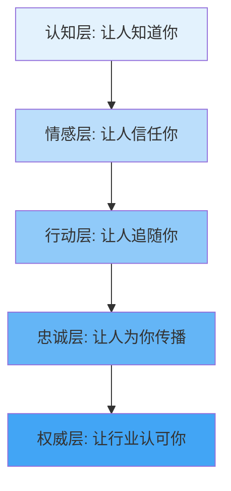
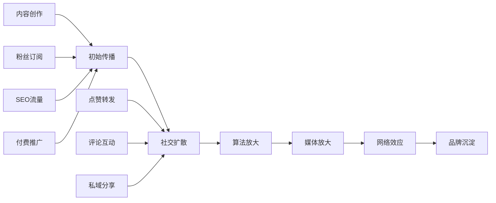
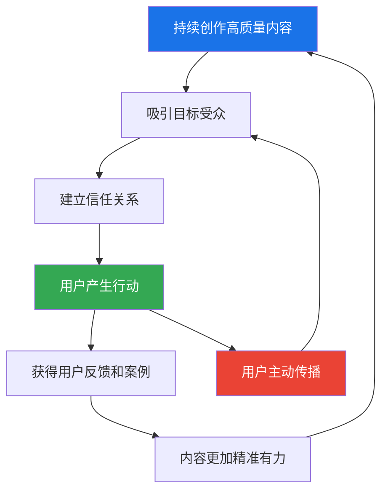

## 四、影响力的本质与传播

影响力是个人品牌的核心资产——它决定了你能调动多少资源、驱动多少行动、创造多大价值。本章从影响力的本质出发，层层递进，涵盖影响力的定义与公式、层次模型、心理学原理、传播机制、内容传播规律、网络效应与临界点，最终落脚到影响力的实际构建与衡量方法。

### 4.1 什么是影响力

#### 4.1.1 影响力的定义

影响力（Influence）是影响他人思想、情感和行为的能力。它不是强制性的控制权，而是一种基于信任和价值的软性力量。在个人品牌的语境中，影响力有三个关键维度：

- **广度（Reach）**：你能影响多少人
- **深度（Depth）**：你对每个人的影响程度有多深
- **持续性（Duration）**：你的影响能持续多久

真正的影响力来自于你为他人创造的价值。当你持续提供有价值的内容、帮助他人解决问题、引导他人做出更好的决策时，你的影响力就会自然增长。影响力不是你自封的，而是他人赋予你的——当人们因为你的内容而改变想法、采取行动时，你就拥有了影响力。

#### 4.1.2 影响力的核心公式

$$\text{影响力} = \text{触达范围} \times \text{信任深度} \times \text{行动转化率}$$

| 因素 | 含义 | 提升方法 |
|------|------|----------|
| 触达范围 | 能覆盖多少人 | 多平台分发、SEO优化、热点借势、付费推广 |
| 信任深度 | 对每个人的影响程度 | 持续输出高质量内容、展示专业能力、保持真诚透明 |
| 行动转化率 | 多少人因你而行动 | 提供明确的行动指引、降低行动门槛、制造紧迫感 |

三个因素缺一不可。触达范围再大，如果信任深度不够，内容就只是"噪音"；信任深度再高，如果触达范围太小，影响力就被局限在小圈子里；两者都具备但没有行动转化率，影响力就无法产生实际价值。

#### 4.1.3 影响力 vs 权力 vs 流量

很多人混淆影响力、权力和流量，但它们有本质区别：

| 维度 | 影响力 | 权力 | 流量 |
|------|--------|------|------|
| 来源 | 信任与价值 | 职位与制度 | 曝光与注意力 |
| 持久性 | 长期可持续 | 依赖职位，离开即失 | 短暂，注意力转移即消散 |
| 驱动方式 | 自愿追随 | 被动服从 | 被动消费 |
| 可迁移性 | 高，跨平台跨领域 | 低，限于管辖范围 | 低，依赖特定平台 |
| 变现路径 | 多元且稳定 | 受限于合规 | 广告模式单一 |

一个拥有百万粉丝但信任度低的博主，影响力可能不如一个只有一万铁粉的深度创作者。流量是影响力的必要条件，但远非充分条件。

### 4.2 影响力的层次模型

影响力不是一步到位的，它存在清晰的层次递进关系：

#### 4.2.1 认知层——让人知道你的存在

认知层是影响力的地基。没有认知，后续一切无从谈起。这个阶段的核心任务是"被看见"。

**具体表现**：
- 有人在搜索某个问题时，发现了你的内容
- 有人在社交媒体的信息流中看到了你的帖子
- 有人从朋友口中听到了你的名字

**衡量指标**：
- 粉丝数、关注者数
- 内容阅读量、播放量
- 搜索引擎排名
- 品牌提及次数

**关键策略**：
- 选择与目标受众匹配的平台，不要盲目追求全平台覆盖
- 持续稳定的内容输出，建立"存在感"
- 研究平台算法，利用推荐机制扩大曝光
- 借助热点事件获得初始流量

**常见误区**：很多创作者停留在认知层，不断追求"涨粉"，却忽略了内容质量和信任建设。100万"知道你"但"不信任你"的粉丝，商业价值远低于10万信任你的粉丝。

#### 4.2.2 情感层——让人喜欢你、信任你

从认知到情感的跨越，是影响力的第一次质变。这个阶段的核心任务是"被喜欢、被信任"。

**具体表现**：
- 用户主动关注你的动态，而不是被动刷到
- 用户在评论区与你互动，表达认同
- 用户在遇到问题时，第一时间想到你

**衡量指标**：
- 互动率（评论、点赞、分享的比例）
- 私信数量与质量
- 用户留存率、取关率
- 品牌情感分析（正面/中性/负面评论比例）

**关键策略**：
- 展示真实的个性和价值观，不要做"完美的假人"
- 认真回复评论和私信，建立双向互动
- 分享个人经历和故事，增加真实感和亲近感
- 在争议话题上明确立场，吸引"同频"的人

**关键认知**：信任需要时间积累，但可以在瞬间崩塌。一次虚假内容、一次不诚信行为，可能摧毁多年积累的信任。所以"一致性"比"爆发力"更重要。

#### 4.2.3 行动层——让人因你而行动

行动层是影响力从"认知"转化为"价值"的关键节点。这个阶段的核心是"驱动行为改变"。

**具体表现**：
- 用户按照你的建议去执行
- 用户购买你推荐的产品或服务
- 用户改变了自己的某个习惯或认知

**衡量指标**：
- 转化率（从关注到购买、从阅读到执行）
- 推荐采纳率
- 用户行为变化的反馈
- 收入、成交额

**关键策略**：
- 提供清晰的、可执行的行动步骤，而不是模糊的建议
- 降低行动门槛——让用户"试一试"而不是"全面改变"
- 利用西奥迪尼的影响力原则（见4.3节）驱动行动
- 提供"第一批吃螃蟹"的案例和见证

#### 4.2.4 忠诚层——让人持续追随你

忠诚层是品牌资产的核心。这些用户不仅持续消费你的内容，还主动为你传播和辩护。

**具体表现**：
- 用户从关注者变成了"粉丝"，甚至是"拥护者"
- 用户主动向他人推荐你
- 用户在你遭受攻击时主动为你辩护
- 用户愿意为你的产品支付溢价

**衡量指标**：
- 粉丝推荐率（Net Promoter Score, NPS）
- 社群活跃度
- 复购率、续费率
- UGC（用户生成内容）数量

**关键策略**：
- 建立社群，让用户之间产生连接（不仅仅与你连接）
- 给予忠诚用户"特殊身份"（会员、内测用户、大使）
- 持续提供超额价值，超越预期
- 让用户参与内容创作和品牌决策

#### 4.2.5 权威层——让行业认可你

权威层是影响力的最高形态。你的影响力不再局限于自己的粉丝圈，而是扩展到了整个行业。

**具体表现**：
- 媒体主动报道你
- 行业峰会邀请你做嘉宾
- 同行引用你的观点和理论
- 你的名字成为某个领域的代名词（如"提到XX就想到你"）

**衡量指标**：
- 媒体报道次数与质量
- 行业会议邀请数
- 学术/行业引用次数
- 搜索引擎中"姓名+领域"的搜索量

**关键策略**：
- 出版书籍或发表行业报告，沉淀知识资产
- 发展原创理论框架，而不只是"搬运"他人观点
- 主动参与行业对话，贡献有分量的观点
- 与行业内的其他权威建立合作关系

### 4.3 西奥迪尼影响力六原则在个人品牌中的应用

罗伯特·西奥迪尼（Robert Cialdini）在经典著作《影响力》中提出的六大原则，是理解人类行为决策的心理学基石。下面逐一拆解其在个人品牌中的具体应用。

#### 4.3.1 互惠原则（Reciprocity）

**原理**：人们倾向于回报他人的善意。当你先给予了价值，对方会感到一种"亏欠感"，更愿意回报你。

**个人品牌应用**：
- **免费内容策略**：先提供大量高质量的免费内容（文章、教程、工具），当用户从你的免费内容中获益后，他们更愿意购买你的付费产品
- **主动帮助**：在社群中主动回答问题、分享资源，不求回报——但这会在未来产生回报
- **超额交付**：承诺10分，交付15分。让用户感到"超出预期"，他们会通过复购和推荐来回报你

**实操案例**：
一个编程教学博主，长期在B站免费发布高质量教程，每期教程的评论区他都会认真回复每一个技术问题。两年后，他推出付费课程时，第一批学员几乎全部来自免费观众。转化率达到8%，远高于行业平均的1-2%。

**注意事项**：互惠必须是真诚的，不是"表演性给予"。如果你的每一次"给予"都带有明显的销售目的，用户会感受到虚伪，效果适得其反。

#### 4.3.2 承诺与一致性原则（Commitment & Consistency）

**原理**：人们倾向于保持言行一致。一旦做出了某种承诺或选择了某种立场，后续行为会自动倾向于与之一致。

**个人品牌应用**：
- **阶梯式承诺**：先让用户做小承诺（关注、点赞、加入社群），再逐步引导到更大的承诺（购买、推荐）。每一步都让用户确认"我是认同这个人的"
- **公开声明**：鼓励用户公开自己的学习目标或改变计划——公开承诺比私下承诺更有约束力
- **身份认同**：帮助用户建立身份标签。例如，"我是XX的学员"这个身份标签，会驱动用户做出与"好学员"身份一致的行为

**实操模板**——社群入门承诺阶梯：
1. 加入社群（微承诺）→ 阅读社群规则（自我确认）
2. 自我介绍（中等承诺）→ 说出自己的学习目标
3. 参与打卡（行动承诺）→ 养成每日学习习惯
4. 分享学习成果（公开承诺）→ 强化身份认同
5. 付费进阶课程（经济承诺）→ 完成深度转化

#### 4.3.3 社会认同原则（Social Proof）

**原理**：当人们不确定该如何行动时，会参考他人的行为。"别人都在做"是一个强大的决策捷径。

**个人品牌应用**：
- **数据展示**：在合适的位置展示粉丝数、学员数、好评数等社交证明
- **用户见证**：收集和展示用户的真实反馈、成功案例、使用前后对比
- **KOL背书**：获得行业知名人士的认可和推荐
- **媒体引用**：展示你的内容被权威媒体引用或报道的证据

**具体做法**：
- 在个人简介中写明"帮助XXX人实现了XXX"
- 在产品页面展示用户评价和案例
- 在社群中定期分享学员的成长故事
- 在内容中引用"XX位读者告诉我..."

**风险提示**：社交证明必须真实。虚假的粉丝数、编造的用户评价，一旦被揭露，对品牌的打击是毁灭性的。

#### 4.3.4 喜好原则（Liking）

**原理**：人们更容易被自己喜欢的人影响。"喜欢"的来源包括：相似性、熟悉感、赞美、外表吸引力、合作关系。

**个人品牌应用**：
- **找到共同点**：分享你与受众相似的经历、困境、价值观，拉近距离
- **增加熟悉感**：保持稳定的更新频率和视觉风格，让受众"习惯"你的存在
- **真诚赞美**：对用户的成就、进步给予真诚的认可和鼓励
- **人格化品牌**：展示工作之外的生活面——兴趣爱好、日常趣事、偶尔的脆弱面

**提升喜好的关键行为**：
1. 记住老粉丝的名字和经历（在社群中尤为重要）
2. 使用受众熟悉的语言和表达方式，而不是高高在上的"专家腔"
3. 在内容中适度自嘲，展示不完美的一面
4. 关注和参与受众的动态，而不是单向输出

#### 4.3.5 权威原则（Authority）

**原理**：人们倾向于服从权威。当一个人被认为在某个领域具有专业知识或地位时，他的话更有说服力。

**个人品牌应用**：
- **专业展示**：在个人简介、内容中展示相关的专业资质、从业年限、成就
- **内容权威性**：引用权威数据、研究论文、行业报告来支撑你的观点
- **外在信号**：在视觉呈现上体现专业感——排版质量、数据可视化、专业术语的正确使用
- **第三方认可**：行业奖项、媒体报道、大V背书都是权威的"证明物"

**权威感的三个来源**：

| 来源 | 说明 | 示例 |
|------|------|------|
| 专业权威 | 你确实具备该领域的深厚知识 | 10年从业者、发表过行业报告 |
| 经验权威 | 你亲身经历过并取得了成果 | 从0做到百万营收、从素人到行业TOP |
| 关联权威 | 你与权威人物/机构有关联 | 某知名企业前员工、某大师的弟子 |

**注意事项**：权威感应该是"展示"出来的，而不是"吹嘘"出来的。过度包装、虚构履历，一旦被质疑，权威感会瞬间崩塌。

#### 4.3.6 稀缺原则（Scarcity）

**原理**：人们更珍惜稀缺的东西。当机会变得"限时""限量""即将失去"时，人们的行动意愿会急剧上升。

**个人品牌应用**：
- **限时优惠**：课程/产品的限时折扣，制造紧迫感
- **限量名额**：小班制、私教、一对一辅导等限额服务
- **独家内容**：只有付费会员或社群成员才能获取的独家资源
- **即将失去**："这套方法论明年会涨价""这批名额用完就要等下一期"

**正确的稀缺 vs 错误的稀缺**：

| 正确的稀缺 | 错误的稀缺 |
|------------|------------|
| 确实存在产能限制（一对一辅导只有24小时） | 人为制造虚假的"限量" |
| 稀缺性与价值相匹配 | "只剩最后3个名额"但实际一直有货 |
| 提前告知并合理安排 | 临时突然"加开一期"稀释稀缺感 |
| 让用户感受到真实的时间/数量压力 | 频繁使用导致用户产生"稀缺疲劳" |

稀缺原则的力量在于"真实"。如果你的"限量"是假的，用户的信任会被永久损伤。

### 4.4 影响力的传播机制

理解影响力如何传播，才能主动设计传播策略，而不是被动等待"自然增长"。

#### 4.4.1 传播路径模型

#### 4.4.2 五种核心传播机制详解

**机制一：口碑传播（Word of Mouth）**

口碑传播是最古老也最有效的传播方式。它的本质是"用信任传递信任"——当一个朋友向你推荐某个博主时，你天然地信任这个推荐，因为你们之间已经存在信任关系。

口碑传播的三个触发条件：
1. **超预期体验**：用户获得了超出预期的价值（"没想到这个免费内容质量这么高！"）
2. **社交货币**：分享你的内容能让推荐者在社交中"加分"（"我知道一个很厉害的XX博主"）
3. **利他动机**：推荐者真心认为这能帮助被推荐者

**如何激活口碑传播**：
- 在内容中加入"值得分享的理由"——独特的观点、实用的工具、震撼的数据
- 设计"推荐奖励"机制——推荐返利、推荐解锁专属内容
- 主动创造"分享时刻"——让用户在某个节点有强烈的分享欲望

**机制二：社交网络传播**

社交网络的传播本质是"链式反应"——A分享给B和C，B分享给D和E，C分享给F和G。关键在于每一步的"分享率"（K-factor）。

**病毒系数（K-factor）公式**：
$$K = \text{每个用户的分享数} \times \text{分享转化率}$$

当 K > 1 时，内容进入指数增长；当 K < 1 时，传播会逐渐衰减。

**提升社交网络传播的策略**：
- 内置分享机制（一键转发、生成分享海报）
- 内容中设置"钩子"（引用朋友、@相关人、互动问答）
- 鼓励用户生成内容（UGC），每个用户都是一个传播节点

**机制三：算法推荐传播**

每个内容平台都有自己的推荐算法，理解算法的底层逻辑是获取免费流量的关键。

**主流平台算法的共性**：
- **冷启动**：新内容先推给一小批用户（通常是你粉丝中的一部分）
- **数据反馈**：根据这批用户的互动数据（完播率、点赞率、评论率、分享率）判断内容质量
- **分层推荐**：数据好的内容推给更多人，数据差的内容停止推荐
- **标签匹配**：内容标签与用户兴趣标签匹配度越高，推荐越精准

**算法友好的内容策略**：
1. 标题和封面要有"点击欲"，提升初始点击率
2. 内容前5秒（或前3行）要抓住注意力，提升完播率/完读率
3. 在内容中设置互动引导（提问、投票、"你觉得呢？"），提升评论率
4. 内容结尾设置分享钩子（"转发给你身边需要的人"），提升分享率
5. 保持稳定的更新频率，获得算法的"稳定发布者"加权

**机制四：媒体放大传播**

当你的影响力达到一定阈值后，媒体会成为你的"放大器"。媒体的报道会带来大量新受众，同时提供强有力的社会证明。

**如何吸引媒体关注**：
- 有独特的观点或数据（"XX领域首个提出XX理论的人"）
- 有可报道的故事（创业故事、逆袭经历、社会影响力项目）
- 主动向媒体提供素材（新闻稿、专访邀请、行业报告）
- 在热点事件中提供专业解读

**机制五：网络效应传播**

网络效应是指用户越多，每个用户获得的价值越大。在个人品牌中，网络效应主要体现在社群中。

**直接网络效应**：社群成员越多，成员之间互相连接的机会越多，每个人获得的价值越大。

**间接网络效应**：社群规模越大，产生的内容和资源越丰富，吸引更多的新成员加入。

**如何构建网络效应**：
- 设计促进成员之间互动的机制（话题讨论、项目协作、互评互助）
- 建立"去中心化"的社群结构，让成员之间也能产生价值连接
- 培养社群内的KOC（关键意见消费者），让他们成为社群活力的来源

### 4.5 内容传播的规律

内容传播不是随机的。沃顿商学院市场营销学教授乔纳·伯杰（Jonah Berger）在《疯传》一书中总结了内容病毒式传播的六大驱动力（STEPPS模型）。以下是其中对个人品牌创作者最有指导意义的几条规律。

#### 4.5.1 情绪驱动（Emotion）

能够引发强烈情绪的内容更容易被分享。但不同类型的"情绪"对传播的影响截然不同：

| 情绪类型 | 传播效果 | 原因 | 示例 |
|----------|----------|------|------|
| 高唤醒正面情绪（敬畏、兴奋、幽默） | 高传播 | 激发行动欲望 | 令人惊叹的创业故事、搞笑的技术段子 |
| 低唤醒正面情绪（满足、平静） | 低传播 | 不激发分享欲望 | "今天天气不错"式的内容 |
| 高唤醒负面情绪（愤怒、焦虑） | 高传播 | 激发"警告他人"的本能 | "XX行业黑幕曝光""你的数据正在被XX泄露" |
| 低唤醒负面情绪（悲伤） | 低传播 | 让人退缩而非分享 | 纯粹的悲惨故事没有出口 |

**实操建议**：
- 如果你做知识类内容，可以加入"敬畏"（wow！原来如此！）和"兴奋"（这个方法太牛了！）
- 如果你做社会评论类内容，可以适度利用"愤怒"（这件事不公平！），但要避免沦为纯煽动
- 避免"平淡无感"——如果读完之后用户没有任何情绪波动，内容就不具备传播力

#### 4.5.2 实用价值（Practical Value）

能够解决实际问题的内容更容易被收藏和分享。"干货"类内容的收藏率通常远高于分享率——因为人们收藏是为了"自己用"，分享是为了"帮别人"。

**高实用价值内容的特征**：
- 解决一个具体的、高频的问题
- 提供可直接执行的步骤或模板
- 有明确的结果预期（"按照这个方法，3天内可以XXX"）
- 节省用户的时间或金钱

**实操框架——STAR内容法**：
- **S（Situation）**：描述具体的使用场景（"当你面对XX情况时"）
- **T（Task）**：明确要解决的任务（"你需要完成XX"）
- **A（Action）**：给出具体的行动步骤（"第一步XXX，第二步XXX"）
- **R（Result）**：展示预期结果（"按照这个方法，最终会XXX"）

#### 4.5.3 社交货币（Social Currency）

人们分享内容，往往是为了塑造自己在他人眼中的形象。能够帮助分享者"加分"的内容，就是社交货币。

**五种社交货币**：
1. **知识货币**：分享者显得"有见识"（"你知道吗？XX其实..."）
2. **品味货币**：分享者显得"有品味"（小众好物推荐、深度影评）
3. **道德货币**：分享者显得"有正义感"（公益内容、社会议题）
4. **幽默货币**：分享者显得"有趣"（段子、搞笑视频）
5. **身份货币**：分享者显得"属于某个圈层"（行业黑话、圈内梗）

**如何创造社交货币**：
- 提供"别人不知道的信息差"
- 设计"可截图、可转发"的金句和数据
- 创造"圈内人"才懂的梗和术语
- 内容开头就让分享者感到"这会让我显得很酷"

#### 4.5.4 故事力量（Stories）

讲述故事比罗列事实有效得多。斯坦福大学的研究表明，故事的记忆效果是纯数据的22倍。原因在于：故事同时激活了大脑的情感区域和逻辑区域，而纯数据只激活逻辑区域。

**个人品牌中的故事类型**：

| 故事类型 | 作用 | 示例 |
|----------|------|------|
| 起源故事 | 建立信任和亲近感 | "我是怎么从零开始的" |
| 客户故事 | 提供社会证明 | "我的学员从月薪5K到月入5W" |
| 失败故事 | 增加真实感和可信度 | "我犯过的最大的错误" |
| 挑战故事 | 激励和引发共鸣 | "我如何在3个月内从0做到1万粉" |
| 幕后故事 | 增加亲密感和好奇心 | "一篇爆款文章的创作过程" |
| 愿景故事 | 传递价值观和使命感 | "我希望通过XX改变XX" |

**讲故事的SCQA框架**：
- **S（Situation）**：背景——"在XX的环境下..."
- **C（Complication）**：冲突——"但是遇到了XX问题..."
- **Q（Question）**：问题——"该如何解决？"
- **A（Answer）**：答案——"最终我发现/创造了XX方法..."

#### 4.5.5 视觉吸引（Visual Hook）

在信息过载的时代，视觉元素是内容"被看到"的第一道门槛。

**视觉吸引的层次**：
1. **第一层：停留**——封面/缩略图让用户在信息流中停下来看
2. **第二层：理解**——图表、图示帮助用户快速理解复杂信息
3. **第三层：记忆**——视觉设计成为品牌标识的一部分（配色、字体、布局风格统一）

**视觉优化清单**：
- 封面图使用高对比色和大字标题
- 长文章每300-500字插入一个视觉元素（图表、截图、示意图）
- 使用统一的品牌视觉风格（配色方案不超过3种主色）
- 数据用图表展示而不是纯文字描述
- 重要观点用醒目的格式标注（加粗、引用框、高亮）

### 4.6 网络效应与临界点

#### 4.6.1 网络效应的本质

网络效应是指一个产品或服务的价值随着用户数量的增加而增加。在个人品牌中，网络效应体现在社群运营中——当你的社群规模达到某个临界点时，社群的吸引力会急剧增长。

**网络效应的类型**：

| 类型 | 机制 | 个人品牌中的体现 |
|------|------|------------------|
| 直接网络效应 | 用户越多，每个用户的价值越大 | 社群成员越多，可连接的同行越多 |
| 间接网络效应 | 用户越多，互补产品/内容越丰富 | 社群越大，UGC内容越多，吸引力越强 |
| 数据网络效应 | 用户越多，产品越智能 | 用户反馈越多，你的内容越精准 |
| 双边网络效应 | 供需双方互相增强 | 学员越多，吸引的讲师/嘉宾越优质 |

#### 4.6.2 临界点理论（Tipping Point）

马尔科姆·格拉德威尔在《引爆点》中提出，一个想法、产品或行为的传播会在某个临界点发生质变——从"缓慢增长"突然变成"指数增长"。

对于个人品牌，存在三个关键临界点：

**临界点一：1000个铁杆粉丝**

凯文·凯利（Kevin Kelly）在2008年提出的著名理论：你不需要百万粉丝，只需要1000个愿意为你付费的铁杆粉丝，就能维持一个体面的生活。

具体计算：
- 假设每个铁杆粉丝每年在你身上花费1000元
- 1000人 × 1000元/年 = 100万元/年
- 这足以在大多数城市维持体面的生活

**如何找到和培养铁杆粉丝**：
1. 明确你的"超级用户画像"——他们是谁？有什么痛点？愿意为什么付费？
2. 为这1000人创作内容，而不是为100万人——深度比广度更重要
3. 建立与铁杆粉丝的直接连接（社群、一对一交流）
4. 提供分层价值——免费内容吸引注意力，付费内容创造深度价值

**临界点二：社交传播临界点**

当你的内容分享率超过某个阈值时，内容会进入"病毒式传播"模式。这个阈值取决于你的内容质量和受众的社交网络密度。

判断是否接近社交传播临界点的信号：
- 内容的分享率持续高于5%（行业平均通常在1-3%）
- 出现了"自发的二次创作"（有人基于你的内容做了解读、翻译、改编）
- 开始有"圈外人"看到你的内容（通过朋友转发）
- 平台算法开始持续推荐你的内容

**临界点三：行业影响力临界点**

当你在某个领域被足够多的人认可时，机会会主动找上门来。这是一个"马太效应"的起点——越有名，越容易获得更大的名声。

达到行业影响力临界点的标志：
- 媒体主动联系你做采访
- 行业峰会邀请你做演讲嘉宾
- 竞品和同行开始关注你的动态
- "XX（你的名字）"成为搜索引擎中的独立搜索词

#### 4.6.3 跨越临界点的策略

理解临界点理论的实践意义在于：在达到临界点之前，你需要耐心积累；一旦突破临界点，增长会加速到来。

**跨越临界点的四个关键行动**：

1. **建立"种子用户"核心圈**：在正式对外传播前，先培育50-100个高度认同你的核心用户。他们的早期传播会帮你度过冷启动阶段
2. **创造"引爆内容"**：不是每条内容都要追求爆款，但你需要有意识地打造1-2条"引爆内容"——投入最多精力，覆盖最广话题，情感冲击最强
3. **借势临界点事件**：行业热点、社会事件、平台政策变化都是可能的"引爆点"。提前准备，当机会出现时迅速出击
4. **坚持到临界点**：大部分人不是没有能力，而是在到达临界点之前放弃了。数据显示，90%的个人品牌在积累前1000个铁杆粉丝的过程中就放弃了

### 4.7 影响力的衡量与评估

影响力不能只靠"感觉"来判断，需要一套可量化的衡量体系。

#### 4.7.1 影响力评估矩阵

| 维度 | 指标 | 数据来源 | 评估周期 |
|------|------|----------|----------|
| 广度 | 粉丝总数、阅读量、曝光量 | 平台后台 | 月度 |
| 深度 | 互动率、完播率、私信量 | 平台后台 | 周度 |
| 转化 | 点击率、购买转化率、报名率 | 数据分析工具 | 每次活动 |
| 忠诚 | 复购率、NPS评分、社群活跃度 | 问卷、后台 | 季度 |
| 权威 | 媒体引用、行业邀请、同行提及 | 舆情监控 | 季度 |

#### 4.7.2 影响力评估的常见误区

1. **粉丝数崇拜**：粉丝数量不等于影响力质量。10万僵尸粉 < 1000个活跃铁粉
2. **阅读量陷阱**：高阅读量可能来自算法推荐的"偶然流量"，不代表品牌忠诚度
3. **短期数据焦虑**：影响力是长期资产，不应以单周或单月的数据来评判
4. **忽略质性反馈**：一条走心的用户私信，其信息量可能大于1000个点赞
5. **盲目对标**：不同领域的影响力基准差异巨大，不应跨领域直接比较数字

### 4.8 影响力构建的常见误区与纠正

#### 误区一：追求数量而非质量

**表现**：疯狂追求涨粉，用标题党、蹭热点的方式吸引流量，结果粉丝画像混乱，转化率极低。

**纠正**：先明确"你的1000个铁杆粉丝是谁"，然后为他们创作内容。宁可增长慢一些，也要确保每一个关注者都是"对的人"。

#### 误区二：只输出不互动

**表现**：把社交媒体当作"广播电台"，只发内容不回复评论，不参与社群讨论。

**纠正**：影响力是双向的。每天至少花30分钟回复评论、参与讨论、私信交流。互动是建立信任的核心行为。

#### 误区三：过早追求变现

**表现**：在影响力积累的初期就开始密集推销产品，让关注者感觉"被当韭菜"。

**纠正**：在信任建立之前，变现会消耗信任。遵循"80/20法则"——80%的内容提供免费价值，20%的内容进行商业转化。

#### 误区四：内容同质化

**表现**：所有内容都在"搬运"或"复述"他人观点，没有原创性和独特性。

**纠正**：影响力的核心是"差异化价值"。你需要有自己独特的观点、方法论或风格。问自己："如果我停更，谁会提供替代内容？"如果你的答案是"很多人"，说明你的内容还不够独特。

#### 误区五：忽视负面反馈

**表现**：只关注正面评价，忽略或删除批评性评论。

**纠正**：负面反馈是最有价值的成长素材。区分"恶意攻击"和"建设性批评"，从后者中学习改进。对恶意攻击，保持沉默或礼貌回应，不要卷入骂战。

#### 误区六：过度依赖单一平台

**表现**：所有内容和粉丝都集中在一个平台上，一旦平台政策变化或封号，影响力归零。

**纠正**：建立"平台 + 私域"的双轨制。社交媒体用于触达和吸引，私域（社群、邮件列表、个人网站）用于沉淀和转化。至少将30%的精力放在私域建设上。

### 4.9 进阶：影响力的系统化构建

#### 4.9.1 影响力飞轮

当影响力各要素形成正循环时，会产生"飞轮效应"——每一圈转动都会为下一圈提供动力。

飞轮的关键在于：每个环节都不能断裂。一旦某个环节（如内容质量、用户信任、行动转化）出了问题，飞轮就会减速甚至停转。

#### 4.9.2 影响力资产化

最终，影响力应该被沉淀为可积累、可传承的资产：

| 资产类型 | 说明 | 沉淀方式 |
|----------|------|----------|
| 内容资产 | 你的文章、视频、课程 | 建立个人网站或知识库，长期存档 |
| 社群资产 | 你的忠实用户群体 | 建立会员制社群，沉淀用户关系 |
| 品牌资产 | 你的名字和品牌形象 | 统一视觉风格、语调、价值观 |
| 方法论资产 | 你独创的理论框架 | 出版书籍、发表行业报告 |
| 人脉资产 | 你积累的行业关系 | 定期维护关系网，互利互助 |

当你的影响力被沉淀为这些资产后，即使你暂时离开某个平台，影响力也不会消失——因为它已经不依赖于任何单一的外部条件。

### 4.10 本节小结

影响力是个人品牌的核心资产，它遵循"认知→情感→行动→忠诚→权威"的层次递进模型。构建影响力需要理解西奥迪尼六大心理学原则，掌握五种传播机制的运作逻辑，遵循内容传播的科学规律，并耐心积累直到突破临界点。

影响力不是一朝一夕的事，但它是可以系统化构建的。每一条高质量内容、每一次真诚互动、每一个成功案例，都在为你的影响力飞轮增加动力。关键是：坚持做对的事，直到飞轮自己转起来。
