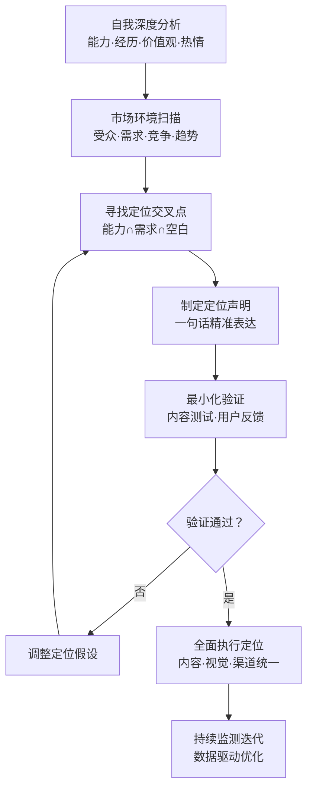
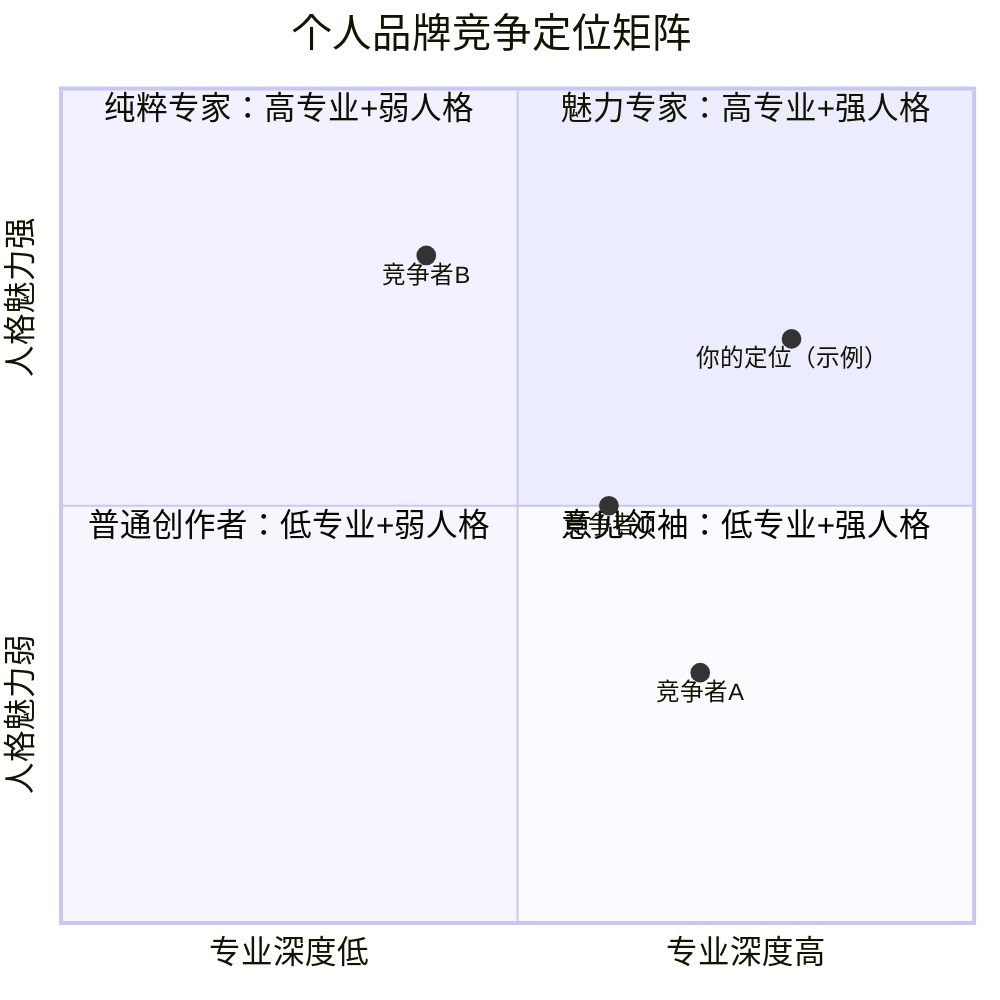
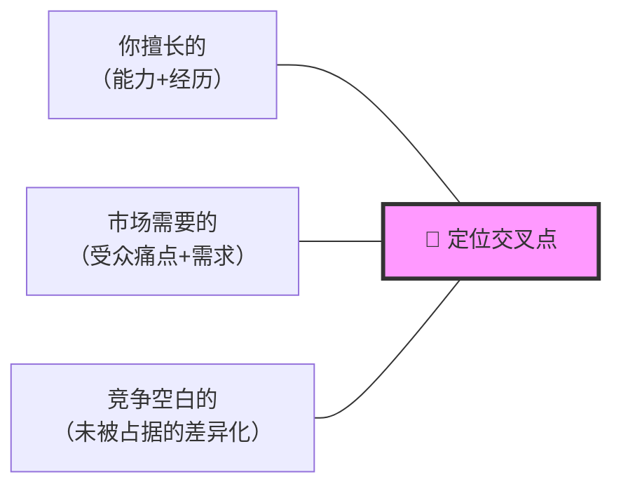
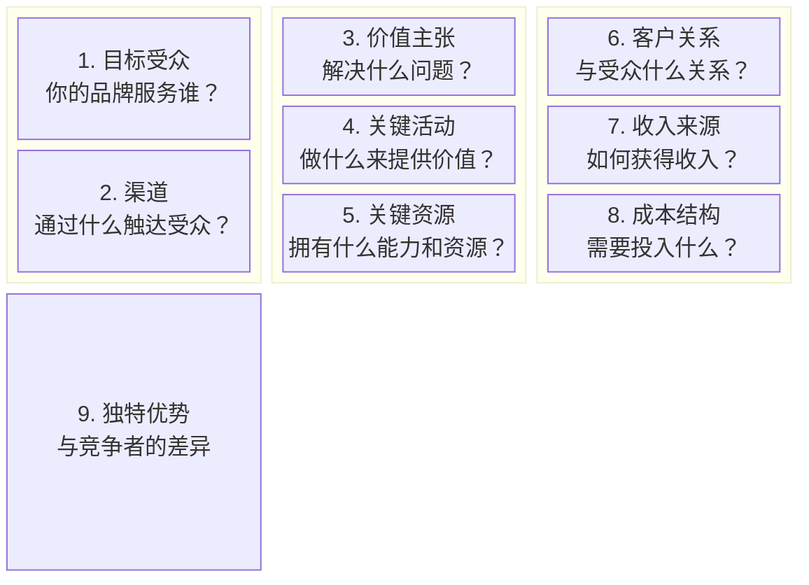
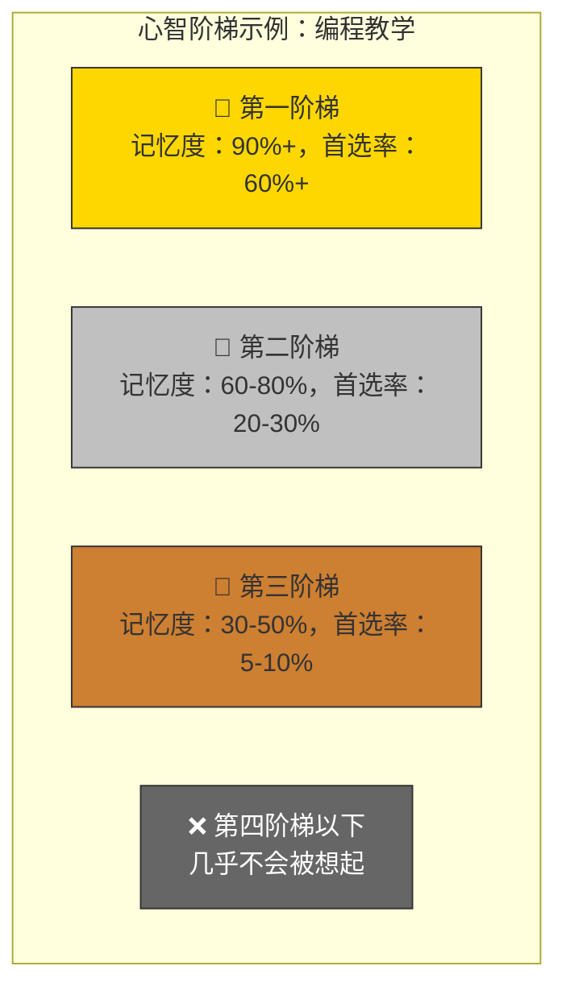

## 五、品牌定位理论

### 5.1 定位的本质

#### 5.1.1 经典定义与起源

品牌定位（Brand Positioning）是"在目标受众的心智阶梯中占据一个独特、有价值的位置"。这一概念最早由美国营销学家艾·里斯（Al Ries）和杰克·特劳特（Jack Trout）在1969年提出，1981年出版的《定位：攻占心智》（Positioning: The Battle for Your Mind）将其系统化，被美国营销学会评为"有史以来对美国营销影响最大的观念"。

定位理论的核心命题是：**品牌战争不是发生在市场上，而是发生在消费者的心智（Mind）中**。你不需要真的比竞争对手"更好"，你需要在受众心中"被认知为更好"。

#### 5.1.2 为什么定位如此重要

在信息爆炸的时代，定位的重要性达到了前所未有的高度：

**信息过载的现实**：根据微软研究院的数据，现代人每天接触的信息量相当于174份报纸的内容。大脑为了自我保护，会自动过滤掉绝大部分信息，只保留那些与自己高度相关、有独特价值的内容。这意味着，如果你的品牌定位模糊、缺乏辨识度，你将被大脑的过滤机制直接忽略。

**注意力经济的竞争**：赫伯特·西蒙（Herbert Simon）早在1971年就预言："信息的丰富意味着注意力的匮乏。"今天的竞争本质上是争夺注意力的竞争。清晰的定位是突破注意力屏障的最有效武器。

**决策简化的需求**：面对无数选择时，人们倾向于用简单的分类来简化决策。定位就是在受众心中建立一个明确的分类标签——"这个人是做X的"。当受众产生X相关的需求时，你的名字会自动浮现在脑海中。

#### 5.1.3 定位的心理学基础

定位之所以有效，根植于人类认知的基本规律：

| 认知规律 | 说明 | 定位应用 |
|---------|------|---------|
| **心智阶梯效应** | 人们会将同类事物排列成"阶梯"，通常只记住前2-3名 | 力争成为细分领域的第一或第二 |
| **首因效应** | 第一个进入心智的品牌会获得持久优势 | 率先占据空白定位，比模仿更有价值 |
| **简化原则** | 大脑倾向于用最简标签归类信息 | 定位必须简洁、易记、一句话说清 |
| **验证偏见** | 人们倾向于寻找证实已有判断的证据 | 一旦定位确立，强化比改变更有效 |
| **损失厌恶** | 放弃已有认知的成本高于接受新认知 | 改变已有定位的难度远大于新建定位 |

### 5.2 定位的战略框架

定位不是一个灵感闪现的瞬间，而是一套系统化的战略流程。

#### 第一步：自我深度分析

自我分析是定位的根基。你需要从四个维度系统地挖掘自己的独特性：

**能力维度（我能做什么）**
- 专业技能清单：列出你所有的专业技能，按熟练度排序
- 能力独特性评估：哪些能力是你有而大多数人没有的？
- 能力组合价值：多个能力的组合是否产生了独特的价值？

**经历维度（我经历过什么）**
- 关键转折点：改变你人生轨迹的重大事件
- 独特路径：你的职业/生活路径与主流有何不同？
- 故事素材：哪些经历可以成为品牌故事的核心？

**价值观维度（我相信什么）**
- 非谈判底线：你绝对不会妥协的原则是什么？
- 使命驱动：你最想为世界带来什么改变？
- 态度立场：你对所在领域的核心观点是什么？

**热情维度（我热爱什么）**
- 心流体验：什么时候你会忘记时间的流逝？
- 自发学习：什么领域你愿意花自己的时间去研究？
- 持续动力：什么话题你聊起来永远不会疲倦？

**实操工具：个人独特性审计表**

| 审计维度 | 具体内容 | 独特性评分（1-5） | 受众价值评分（1-5） | 可持续性评分（1-5） |
|---------|---------|-----------------|-------------------|-------------------|
| 专业能力 1 | （填写） | _ | _ | _ |
| 专业能力 2 | （填写） | _ | _ | _ |
| 独特经历 1 | （填写） | _ | _ | _ |
| 独特经历 2 | （填写） | _ | _ | _ |
| 核心价值观 | （填写） | _ | _ | _ |
| 深层热情 | （填写） | _ | _ | _ |

评分标准：1=普通/低价值/短期，3=较独特/有价值/中期，5=极独特/高价值/长期。
三项均分≥3.5的维度是定位的优先候选方向。

#### 第二步：市场环境扫描

**目标受众画像**

不要停留在"25-35岁白领"这种粗粒度的描述。你需要构建深层的受众画像：

- **人口统计**：年龄、性别、职业、收入、城市层级
- **心理特征**：价值观、生活方式、消费态度
- **痛点清单**：他们面临的具体问题和困扰
- **信息行为**：他们在哪里获取信息？信任什么渠道？
- **决策因素**：他们在选择关注对象时最看重什么？

**竞争环境分析**

使用竞争矩阵系统地分析你所在领域的竞争格局：

**竞争分析清单**：
1. 列出你所在领域的Top 10创作者/品牌
2. 分析每个竞争者的核心定位、内容风格、受众群体
3. 识别已占据的定位和空白的定位
4. 评估每个空白定位的市场潜力和进入难度
5. 选择2-3个最有潜力的定位方向进入下一步

#### 第三步：找到定位交叉点

定位的黄金交叉点需要同时满足三个条件：

**交叉点的检验标准**：
- 唯一性：在你的目标受众心中，这个定位是否有直接的竞争者？
- 相关性：目标受众是否真的关心这个定位所承诺的价值？
- 可信性：你是否有足够的能力和证据支撑这个定位？
- 持久性：这个定位是否能在3-5年内持续有效？
- 可延展性：这个定位是否有足够的空间让你成长和扩展？

#### 第四步：制定定位声明

定位声明（Positioning Statement）是定位策略的核心输出物。它不是公开的宣传语，而是指导你所有品牌决策的战略文件。

**定位声明公式**：

> 对于 [目标受众]，[你的名字] 是 [品类/领域] 中能够提供 [核心价值/独特利益] 的品牌，因为 [支撑理由/差异化证据]。

**定位声明示例**：

| 要素 | 示例（知识类博主） | 示例（自由设计师） |
|-----|------------------|------------------|
| 目标受众 | 想要转型的互联网产品经理 | B轮前的科技创业公司 |
| 品类/领域 | 职业成长内容 | 品牌视觉设计 |
| 核心价值 | 从0到1建立产品经理思维体系 | 用极简设计提升品牌专业感 |
| 支撑理由 | 10年一线产品经验，服务过3亿用户产品 | 服务过50+初创企业，累计设计200+品牌 |

**定位声明的四重检验**：
1. **清晰度检验**：给一个完全不了解你的人看，他能在30秒内理解你的定位吗？
2. **差异化检验**：把你的名字换成竞争对手的，声明依然成立吗？如果成立，说明差异化不够。
3. **吸引力检验**：目标受众看到这个定位，会立刻产生"这个人值得关注"的冲动吗？
4. **证据检验**：你能提供至少3个具体案例或数据来支撑这个定位声明吗？

#### 第五步：最小化验证

不要等到"完美"再推出定位，而是用最小化的方式快速验证：

**验证方法一：内容测试法（2-4周）**
- 围绕你的定位方向，连续发布10-15条内容
- 观察互动数据：哪些内容的互动率、转发率、收藏率最高？
- 分析评论关键词：受众的反馈是否符合你的定位预期？
- 对比不同定位角度的表现，选择数据最优的方向

**验证方法二：对话测试法（1-2周）**
- 向20-30个目标受众描述你的定位
- 观察他们的即时反应：困惑？感兴趣？无感？
- 记录他们追问的问题——这些问题揭示了定位的吸引力点和盲区
- 收集他们对你定位的复述——如果他们能用自己的话准确复述，说明定位足够清晰

**验证方法三：AB测试法（4-6周）**
- 准备2-3个不同的定位角度
- 在同一平台、同一时间段，用相似的内容形式分别测试
- 每个角度至少发布15条内容
- 用数据（互动率、粉丝增长、私信量）决定最优定位

**验证成功的信号**：
- 目标受众主动找你咨询
- 有人向别人推荐你时，能用你的定位来介绍
- 竞争者开始模仿你的定位角度
- 你收到的私信/评论与你的定位高度相关

**验证失败的信号**：
- 你需要反复解释自己的定位
- 收到的互动与定位方向无关
- 目标受众对你的内容反应冷淡
- 你自己在执行定位时感到勉强或不自然

### 5.3 七种定位策略

每种定位策略都有其适用场景、优势和风险。以下是系统化的定位策略分类：

#### 5.3.1 差异化定位

**核心逻辑**：在成熟的竞争格局中，找到竞争对手没有占据的角度，建立"唯一性"认知。

**适用场景**：大领域竞争激烈，但存在未被充分满足的细分需求。

**操作要点**：
1. 列出所在领域所有主流定位
2. 找到主流定位的对立面或互补面
3. 验证差异化角度是否有足够的受众基础
4. 用鲜明的内容风格强化差异化感知

**经典案例**：
- 所有人讲"高效学习"，你讲"慢学习：用3年时间精通一个领域"
- 所有人讲"快速涨粉"，你讲"不涨粉的1000铁粉策略"
- 所有人讲"职场晋升"，你讲"内向者的职场生存指南"

**优势**：竞争小、辨识度高、容易建立忠诚度
**风险**：差异化的点如果受众不关心，则无法起量

#### 5.3.2 细分定位

**核心逻辑**：在大领域中切出一个足够小但有真实需求的细分市场，成为该细分的头部。

**适用场景**：大领域竞争激烈，但某个细分领域缺乏专业内容。

**操作要点**：
1. 用"领域×人群×场景"三维度组合找到细分市场
2. 评估细分市场的规模（能否支撑你的目标收入）
3. 评估细分市场的成长性（是否在扩大）
4. 确认细分市场的用户是否愿意付费

**经典案例**：
- 摄影 → 手机美食摄影
- 编程 → Python自动化办公
- 设计 → Notion模板设计
- 心理学 → 二胎妈妈的情绪管理

**优势**：竞争小、容易建立权威、用户精准度高
**风险**：天花板明显，做大后需要向相邻领域扩展

#### 5.3.3 跨界定位

**核心逻辑**：将两个不同领域的知识结合，创造"1+1>2"的独特价值。

**适用场景**：你拥有两个不同领域的专业积累，且两个领域之间存在交叉需求。

**操作要点**：
1. 列出你的两个最强领域
2. 找到两个领域的交叉应用场景
3. 评估交叉应用是否创造了新的价值（而非简单的拼凑）
4. 确认目标受众是否对这种跨界组合有需求

**经典案例**：
- 设计思维 × 产品管理 = 用户驱动的产品策略
- 行为经济学 × 个人理财 = 反直觉的财富增长法
- 认知科学 × 学习方法 = 基于脑科学的高效学习
- 编程 × 数据分析 × 投资 = 量化投资入门

**优势**：独特性极高、难以模仿、内容维度丰富
**风险**：对创作者要求高，两个领域都需要有足够的专业深度

#### 5.3.4 人格定位

**核心逻辑**：以你的人格特质作为品牌核心，让"你是谁"成为最大的吸引力。

**适用场景**：你的人格特质鲜明、有辨识度，且与目标受众的审美/价值观匹配。

**操作要点**：
1. 识别你最鲜明的3个人格特质
2. 评估这些特质是否具有吸引力（魅力型而非劝退型）
3. 在内容中持续、一致地展现这些人格特质
4. 用人格特质过滤受众——吸引对的人，排斥不对的人

**经典案例**：
- "毒舌但真诚的产品测评"——用犀利的评价风格建立信任
- "社恐程序员的技术分享"——用内向者的共鸣建立连接
- "爱较真的数据分析师"——用严谨的态度建立权威

**优势**：难以模仿（人格不可复制）、粉丝忠诚度高、信任感强
**风险**：人格定位依赖持续的内容输出，压力大；人格与品牌绑定过深，个人行为会直接影响品牌形象

#### 5.3.5 经历定位

**核心逻辑**：以你的真实经历作为品牌核心，用故事建立情感连接和可信度。

**适用场景**：你有一段独特、有感染力的经历，且这段经历与你的专业领域相关。

**操作要点**：
1. 找到你经历中最具戏剧性或最有共鸣的转折点
2. 提炼经历中的核心教训和方法论
3. 将经历包装为可传播的故事线
4. 让经历成为你所有内容的"信用背书"

**经典案例**：
- "从农村娃到硅谷工程师的成长之路"
- "负债50万到年入百万的创业复盘"
- "三本毕业如何进入世界500强"
- "从120公斤到跑完马拉松的蜕变日记"

**优势**：真实性强、情感共鸣好、记忆点突出
**风险**：经历有"时效性"，需要不断产出新的经历或深度挖掘已有经历

#### 5.3.6 价值观定位

**核心逻辑**：以你的核心价值观作为品牌旗帜，吸引价值观相同的人形成社群。

**适用场景**：你有明确、坚定的价值观立场，且该价值观在目标受众中有共鸣。

**操作要点**：
1. 明确你的核心价值观（不超过3个关键词）
2. 在内容中持续表达和践行这些价值观
3. 对违背你价值观的事情明确表态
4. 用价值观筛选受众——认同你的人会成为铁杆粉丝

**经典案例**：
- "倡导极简生活的践行者"——持续分享极简主义理念和实践
- "反对内卷的效率专家"——用反主流的态度建立差异化
- "技术向善的布道者"——强调技术伦理和社会责任

**优势**：粉丝忠诚度极高、社群凝聚力强、品牌有灵魂
**风险**：价值观定位需要言行一致，一旦出现"人设崩塌"后果严重

#### 5.3.7 方法论定位

**核心逻辑**：以你原创的方法论或思维框架作为品牌核心，建立"方法论=你的品牌"的强关联。

**适用场景**：你在实践中总结出了一套行之有效的方法论，且该方法论有独创性。

**操作要点**：
1. 将你的方法论结构化、命名化
2. 用简洁的模型或框架呈现方法论
3. 围绕方法论产出系列内容，强化认知
4. 用成功案例证明方法论的有效性

**经典案例**：
- "PDCA个人效率系统"
- "GTD时间管理法"（David Allen）
- "OKR目标管理个人版"
- "费曼学习法实践指南"

**优势**：专业性极强、有知识产权壁垒、方法论本身就是传播载体
**风险**：方法论需要经得起检验，否则会遭到质疑；需要持续迭代升级

#### 5.3.8 定位策略对比总览

| 策略类型 | 核心资产 | 适用条件 | 竞争壁垒 | 扩展空间 | 风险等级 |
|---------|---------|---------|---------|---------|---------|
| 差异化定位 | 独特角度 | 成熟市场有空白 | 中等 | 中等 | 低 |
| 细分定位 | 细分权威 | 细分有真实需求 | 中等 | 较低（需扩展） | 低 |
| 跨界定位 | 复合能力 | 双领域专业积累 | 高 | 高 | 中 |
| 人格定位 | 人格魅力 | 人格特质鲜明 | 极高 | 中等 | 中高 |
| 经历定位 | 真实故事 | 有独特经历 | 高 | 中等 | 中 |
| 价值观定位 | 精神认同 | 价值观有共鸣 | 高 | 高 | 高 |
| 方法论定位 | 原创框架 | 有实践总结能力 | 极高 | 高 | 中 |

**选择建议**：初学者优先选择差异化或细分定位（门槛低、见效快）；有独特经历的优先考虑经历定位（天然优势）；有深度积累的考虑方法论或跨界定位（壁垒高）。

### 5.4 个人品牌画布

个人品牌画布（Personal Brand Canvas）是将定位策略转化为可执行规划的系统工具。它借鉴了商业模式画布（Business Model Canvas）的框架，针对个人品牌进行了适配。

**九要素详细填写指南**：

| 要素 | 核心问题 | 填写要点 | 常见错误 |
|-----|---------|---------|---------|
| 目标受众 | 我的核心受众是谁？ | 用具体画像代替笼统描述 | 定义太宽泛（如"所有人"） |
| 价值主张 | 我为受众解决什么问题？ | 用"痛点+解决方案"的格式 | 只说功能不说价值 |
| 关键活动 | 我日常做什么？ | 列出3-5项核心活动 | 列太多，失去焦点 |
| 关键资源 | 我有什么？ | 能力、经验、人脉、平台 | 只列能力不列资源 |
| 渠道 | 我在哪里触达？ | 选2-3个主力渠道 | 全平台铺开，精力分散 |
| 客户关系 | 我与受众什么关系？ | 师徒/同伴/顾问/偶像 | 没有明确定义关系模式 |
| 收入来源 | 怎么赚钱？ | 广告/课程/咨询/产品/社群 | 只靠单一收入源 |
| 成本结构 | 花什么？ | 时间、金钱、机会成本 | 只算金钱成本 |
| 独特优势 | 我凭什么赢？ | 用定位声明的答案 | 列了一堆但都不独特 |

**画布填写建议**：
- 第一次填写时，每格用关键词和短句快速完成，不要追求完美
- 填完后审视九格之间的逻辑一致性——价值主张是否与关键活动匹配？渠道是否与目标受众匹配？
- 每季度回顾一次，根据实际情况更新
- 找3-5个信任的朋友/同行评审你的画布，收集反馈

### 5.5 定位的进阶理论

#### 5.5.1 心智阶梯与品类法则

定位理论的核心发现之一是"心智阶梯"（Mind Ladder）：人们在心中为每个品类只保留2-3个位置。

**品类法则**：如果你不能在现有品类中成为第一，就创建一个新品类成为第一。

| 策略 | 说明 | 举例 |
|-----|------|-----|
| 成为第一 | 率先占据空白品类 | 第一个系统讲"AI写作"的中文博主 |
| 创建新品类 | 细分或组合出新品类 | "AI写作"→"AI小说写作" |
| 对立定位 | 站在第一的对立面 | "反对AI写作，回归手工写作" |
| 关联定位 | 将自己与第一关联 | "XX（行业第一）的实战版" |

#### 5.5.2 定位的动态演进

定位不是一成不变的刻在石头上的文字。随着你的成长和市场的变化，定位需要有策略地演进：

**定位演进的三个阶段**：

| 阶段 | 目标 | 定位特征 | 持续时间 |
|-----|------|---------|---------|
| 立足期 | 建立认知 | 窄而深，聚焦单一品类 | 6-18个月 |
| 成长期 | 扩大影响 | 在核心定位基础上扩展2-3个相关方向 | 12-24个月 |
| 成熟期 | 生态化 | 从品类定位升级为价值观/理念定位 | 持续迭代 |

**定位升级的正确方式**：不是推翻原来的定位，而是在原定位的基础上做加法。

- 立足期：我是"专注Python自动化办公的博主"
- 成长期：我是"专注效率工具的技术博主"（Python自动化 → 效率工具）
- 成熟期：我是"用技术提升个人效能的布道者"（效率工具 → 技术效能理念）

**定位升级的错误方式**：
- ❌ 从"Python自动化"突然变成"投资理财"——受众完全迷失
- ❌ 同时定位为"设计师+程序员+作家+投资人"——什么都不是
- ❌ 频繁更换定位——受众信任崩塌

#### 5.5.3 多平台定位的一致性

在多个平台上运营时，定位的核心必须保持一致，但呈现方式可以适配平台特性：

| 平台 | 内容形式 | 定位呈现方式 | 注意事项 |
|-----|---------|------------|---------|
| 公众号 | 长文 | 深度阐述定位相关的专业内容 | 保持调性统一 |
| 小红书 | 图文笔记 | 用视觉化的方式展现定位 | 适应平台的年轻调性 |
| B站 | 视频 | 用人格化的表达强化定位 | 视频比文字更依赖人格魅力 |
| 知乎 | 回答/文章 | 用专业知识回答定位相关问题 | 体现专业深度 |
| 抖音 | 短视频 | 用15-60秒的碎片内容强化定位标签 | 简洁、有冲击力 |

**核心原则**：平台是渠道，定位是灵魂。在不同平台上，你的"声量"可以不同，但"声音"必须一致。

### 5.6 定位的常见陷阱与破解

#### 陷阱一：定位模糊——"我什么都做"

**症状**：介绍自己时用"和"连接3个以上的身份标签；内容覆盖5个以上的领域；受众无法用一句话描述你是做什么的。

**根因**：害怕"选了A就失去B的机会"，本质上是不愿做取舍。

**破解方法**：
1. 列出你所有的定位候选方向
2. 用"独特性×受众价值×市场需求"三维度打分
3. 选择得分最高的1个作为主定位
4. 其他方向可以作为"副线"偶尔涉及，但不超过总内容的20%

#### 陷阱二：定位过窄——"市场太小了"

**症状**：定位非常精准，但目标受众基数太小；内容产出很快触及天花板；增长停滞。

**根因**：把"细分"等同于"极小众"，没有评估市场的规模。

**破解方法**：
1. 在定位确定前，用搜索指数、社群规模、竞品数据估算受众规模
2. 确保目标受众基数至少在10万人以上（互联网领域）
3. 选择有扩展空间的定位——今天的窄定位是明天扩展的起点
4. 规划"定位扩展路径"：窄定位→相邻扩展→品类升级

#### 陷阱三：定位漂移——"我变了"

**症状**：每隔2-3个月就调整定位方向；粉丝搞不清你到底是做什么的；私信问"你现在主要做啥"。

**根因**：把"兴趣的转移"误认为"定位的进化"。

**破解方法**：
1. 区分"定位的核心"和"内容的表层"——核心不变，表层可以调整
2. 每次想改变定位时，先问自己：是受众需求变了，还是我兴趣变了？
3. 如果是兴趣变了，用副线内容满足兴趣，不动主定位
4. 除非数据持续6个月以上显示定位失效，否则不轻易改变核心定位

#### 陷阱四：定位自嗨——"我觉得很好"

**症状**：自我感觉定位很独特，但受众反应冷淡；内容产出很多但互动很低；需要反复解释自己的定位。

**根因**：定位基于自我认知而非受众需求，"我觉得有价值"不等于"受众觉得有价值"。

**破解方法**：
1. 在定位确定前，至少与20个目标受众深度交流
2. 用"5秒测试"验证：给受众看你的定位声明5秒，然后问他们记住了什么
3. 持续监测数据——互动率、私信内容、转发率是定位吸引力的真实指标
4. 定位的出发点必须是"受众需要什么"，而不是"我想表达什么"

#### 陷阱五：定位雷同——"跟别人一样"

**症状**：你的定位描述换上竞争对手的名字完全成立；受众分不清你和别人的区别；在搜索结果中淹没在同类内容中。

**根因**：选择了已经被充分占据的定位，没有找到差异化角度。

**破解方法**：
1. 做一次"竞争者定位替换测试"——把你的定位声明换成竞争者的名字，看是否依然成立
2. 如果成立，说明差异化不够，需要重新寻找独特角度
3. 差异化不一定在内容本身，也可以在表达方式、受众细分、价值观立场上
4. 记住：在定位领域，"不同"比"更好"更有价值

#### 陷阱六：定位分裂——"线上线下两个样"

**症状**：线上定位和线下定位不一致；不同平台的定位有冲突；团队/合作者对定位理解不同。

**根因**：缺乏统一的定位文档和执行标准。

**破解方法**：
1. 将定位声明书面化，作为所有决策的参考文件
2. 制定"定位一致性检查清单"，在发布任何内容前对照审核
3. 让团队/合作者理解并认同你的定位
4. 定期做"定位一致性审计"——随机抽取近期10条内容，检查是否与定位一致

### 5.7 从定位到执行

定位是战略的起点，但"说到"和"做到"之间还有巨大的鸿沟。以下是将定位转化为持续行动的执行框架：

**定位执行的四个层面**：

| 层面 | 内容 | 检查标准 |
|-----|------|---------|
| 内容层面 | 所有内容围绕定位展开 | 80%以上的内容与定位直接相关 |
| 视觉层面 | 头像、封面、排版风格统一 | 视觉元素与定位调性匹配 |
| 语言层面 | 用语风格、表达方式统一 | 受众能通过文字风格认出你 |
| 行为层面 | 线上线下言行一致 | 所有公开行为不违背定位 |

**每日定位自检三问**：
1. 今天发布的内容是否强化了我的定位？
2. 今天的互动是否让受众更清楚我是做什么的？
3. 今天的决策是否与我的定位一致？

**定位是个人品牌建设中最关键的战略决策**。一个清晰、独特、有吸引力的定位，是所有后续内容创作、流量获取、商业变现的基础。花足够的时间做好定位，比急于产出内容更重要——方向对了，每一步都是前进；方向错了，越努力离目标越远。

***
