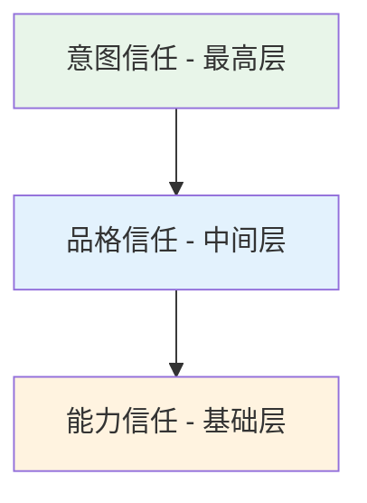
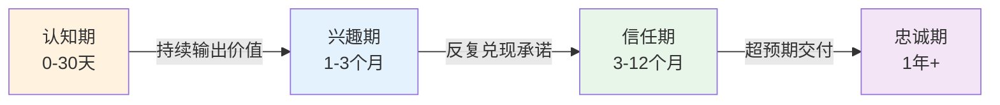

## 六、信任建立理论

信任是个人品牌最核心的无形资产。没有信任，再高的知名度也只是空中楼阁——人们认识你，但不会选择你。信任决定了受众是否愿意点击你的内容、购买你的产品、接受你的建议、向他人推荐你。本章系统拆解信任的底层构成、建立路径、维护机制和修复策略，帮你构建坚不可摧的信任体系。

### 6.1 信任的本质与构成

#### 6.1.1 什么是信任

从心理学角度看，信任是一种**基于不确定性的心理预期**——当你无法完全验证对方的行为时，你选择相信对方会按照你的期望行事。信任的本质是一种**风险承担**：我把我的时间、金钱、情感或声誉托付给你，基于对你未来行为的正面预期。

哈佛商学院教授弗朗西斯·福山在《信任》一书中指出：信任是社会资本的核心组成部分，高信任社会的交易成本远低于低信任社会。映射到个人品牌领域：**信任度越高，受众的决策成本越低，转化效率越高。**

#### 6.1.2 信任的三层模型

个人品牌中的信任由三个层次构成，它们逐层递进、相互支撑：

**第一层：能力信任（Competence Trust）**

能力信任是信任体系的地基——人们相信你有能力解决问题、提供价值。

能力信任的建立渠道：

| 渠道 | 具体方式 | 权重 |
|------|----------|------|
| 专业内容 | 深度文章、技术解析、行业洞察 | ★★★★★ |
| 成功案例 | 客户成果、项目数据、前后对比 | ★★★★★ |
| 资质背书 | 学历、证书、从业年限、获奖 | ★★★★ |
| 第三方认可 | 媒体报道、专家推荐、同行引用 | ★★★★ |
| 作品展示 | 开源项目、出版物、演讲视频 | ★★★★ |
| 背景履历 | 知名公司经历、核心项目参与 | ★★★ |

关键原则：能力信任需要**可验证的证据**，而非自我声明。"我是专家"没有说服力，但"我帮助300+企业提升了40%的转化率"有说服力。

**第二层：品格信任（Character Trust）**

品格信任是信任体系的骨架——人们相信你是诚实、正直、可靠的。

品格信任的四个支柱：

- **诚实（Honesty）**：不夸大、不隐瞒、不欺骗。当产品有缺陷时主动告知，当能力有边界时坦然承认。
- **正直（Integrity）**：言行一致，价值观稳定。不在背后做与公开表态相反的事情。
- **可靠（Reliability）**：承诺的事情一定做到，约定的时间一定遵守，交付的质量一定达标。
- **善意（Benevolence）**：真心为受众着想，而非只考虑自身利益。在可以多收费时选择合理定价，在可以省事时选择用心交付。

品格信任比能力信任更难建立——能力可以通过一两次惊艳表现快速证明，但品格需要长期一致性行为才能验证。然而品格信任也更持久：即使你暂时犯了能力上的错误，如果人们信任你的品格，他们会给你改正的机会。

**第三层：意图信任（Intentional Trust）**

意图信任是信任体系的顶端——人们相信你的出发点是为他们好，而非单纯利己。

意图信任是最深层的信任形式。当受众建立意图信任后，他们不仅会购买你的产品，还会主动维护你的声誉、原谅你的小失误、抵制对你的恶意攻击。

意图信任的建立信号：

- 在没有商业回报的情况下依然提供高价值内容
- 主动推荐竞争对手的产品，如果你认为那更适合受众的需求
- 在自己的利益和受众的利益冲突时，优先考虑受众
- 对付费用户和免费用户同样尊重和用心
- 主动退费或补偿，即使对方没有提出要求

#### 6.1.3 信任公式

大卫·梅斯特在《可信赖的顾问》中提出了经典的信任公式，可以精确地量化信任的构成：

信任 = (可信度 + 可靠性 + 亲近感) / 自我导向

| 变量 | 含义 | 在个人品牌中的体现 |
|------|------|-------------------|
| 可信度（Credibility） | 你说的话我信 | 专业内容深度、案例真实性、数据准确性 |
| 可靠性（Reliability） | 你做的事我放心 | 内容更新频率、交付质量稳定、承诺兑现率 |
| 亲近感（Intimacy） | 我感觉你理解我 | 互动温度、共情表达、个性化回应 |
| 自我导向（Self-Orientation） | 你只关心自己 | 过度营销、频繁推销、内容全是自夸 |

这个公式的启示在于：**分母（自我导向）的破坏力远大于分子（可信度+可靠性+亲近感）的建设力。** 一个极度自我导向的人，即使能力再强、品格再好，也很难获得深层信任。反过来，降低自我导向（真诚利他），即使其他维度还在建设中，信任也能快速增长。

### 6.2 信任建立的完整路径

#### 6.2.1 信任发展的四个阶段

受众与个人品牌之间的信任关系，经历四个明确的阶段：

**阶段一：认知期（Awareness）**

受众通过搜索、推荐、偶然刷到等方式第一次接触你的内容。这个阶段的核心任务是**在10秒内传递清晰的价值主张**。

认知期的关键指标：
- 首次内容的完读率/完播率
- 首次触达后的关注转化率
- 受众对"你是谁、你能帮我做什么"的认知清晰度

认知期的致命错误：
- 内容定位模糊，让人不知道你到底是做什么的
- 开场太长，还没进入价值就流失了受众
- 过早推销，在对方还不了解你时就要求付费

**阶段二：兴趣期（Interest）**

受众开始对你产生好奇，主动查看你的历史内容，关注你的动态更新。这个阶段的核心任务是**用持续的高质量内容证明你的价值不是偶然**。

兴趣期的关键策略：
- 建立内容矩阵：有深度的长文 + 有观点的短评 + 有温度的日常
- 保持稳定的更新频率：让受众形成期待习惯
- 展示专业广度：不只会一个点，而是对整个领域有系统认知
- 制造"啊哈时刻"：让受众在你的内容中获得意想不到的认知突破

兴趣期的关键指标：
- 回访率（受众是否多次来看你的内容）
- 互动率（评论、点赞、转发的意愿）
- 内容收藏率（认为内容值得留着以后看）

**阶段三：信任期（Trust）**

受众开始信任你的判断，愿意根据你的建议采取行动——购买你推荐的产品、采用你分享的方法、报名你的课程。这个阶段的核心任务是**反复兑现承诺，用结果证明你的可靠性**。

信任期的信任加速器：
- 展示客户/学员的真实成果（带数据）
- 提供低风险的首次体验（免费试用、试听、体验课）
- 使用社会证明（"已有10,000+人验证"）
- 给出明确的承诺和保障（不满意退款）

信任期的关键指标：
- 转化率（从关注到付费的转化比例）
- 客单价（用户愿意为你的产品付多少钱）
- 退费率（退费率越低，信任越强）

**阶段四：忠诚期（Loyalty）**

受众成为品牌的拥护者，主动传播你的内容、推荐你的产品、维护你的声誉。忠诚期的受众不仅自己持续消费，还成为你最有效的"免费销售员"。

忠诚期的维护策略：
- 建立社群归属感，让忠实粉丝之间也形成连接
- 给予老用户特殊权益（优先体验、专属折扣、参与共创）
- 定期收集反馈，让忠实粉丝感到被重视
- 持续进化，不让忠实粉丝感到"你停滞了"

忠诚期的关键指标：
- 复购率
- 推荐率（NPS净推荐值）
- 用户生命周期价值（LTV）

#### 6.2.2 信任建立的时间线

不同类型的信任需要不同的建立周期：

| 信任类型 | 建立时间 | 破坏时间 | 修复难度 |
|----------|----------|----------|----------|
| 能力信任 | 数周至数月 | 一次重大失误 | 中等——重新证明能力即可 |
| 品格信任 | 数月至数年 | 一次诚信事件 | 很高——需要长期一致性行为 |
| 意图信任 | 一至数年 | 一次利益冲突 | 极高——可能无法完全修复 |

这意味着：**建立信任是长期工程，破坏信任是瞬间事件。** 你需要用数百次一致性行为建立的信任，可能因为一次严重的背叛瞬间崩塌。

#### 6.2.3 信任建立的加速度策略

虽然信任建立本质上需要时间，但以下策略可以加速这一过程：

**策略一：借力背书（Borrowed Trust）**

利用已有的信任关系来加速新信任的建立。具体方式包括：
- 与知名人士联合创作内容或共同出席活动
- 获得权威机构的认证或推荐
- 在知名平台发表内容（平台的信任背书转移到你身上）
- 请已有信任关系的客户做推荐人

**策略二：高频低风险接触（Micro-Trust）**

通过大量低风险的互动来逐步积累信任。每次互动都不需要受众承担多大风险，但次数多了，信任自然积累：
- 每天发一条有价值的短内容
- 每周做一次免费直播答疑
- 每次回复评论都认真且有深度
- 每次承诺的小事（"明天更新"）都做到

**策略三：透明化运营（Radical Transparency）**

通过公开通常不会公开的信息来快速建立信任：
- 公开收入数据和商业模式
- 公开产品开发过程（包括失败的部分）
- 公开用户评价（包括负面评价）
- 公开决策过程和背后的思考逻辑

透明化的威力在于：它同时提升了可信度（有数据佐证）、降低了自我导向（坦诚缺点表明不是只想赚钱）、增加了亲近感（展示真实的人而非包装的形象）。

### 6.3 信任维护的系统工程

#### 6.3.1 一致性管理

一致性是信任的基石。人们需要知道他们可以依赖你——你今天说的话和明天说的话不能矛盾，你对外的标准和对内的标准不能不同。

**一致性管理的四个维度：**

| 维度 | 含义 | 违反后果 |
|------|------|----------|
| 言行一致 | 说到做到，承诺兑现 | 被视为"画饼"，丧失可信度 |
| 内容一致 | 价值观和立场稳定 | 被视为"见风使舵"，丧失品格信任 |
| 质量一致 | 每次交付的标准不下降 | 被视为"割韭菜"，丧失能力信任 |
| 态度一致 | 对所有人同样尊重 | 被视为"势利眼"，丧失意图信任 |

一致性管理的实操方法：
- 建立个人品牌手册（Personal Brand Bible），明确你的核心价值观、表达风格、承诺底线
- 每次发布内容前用品牌手册做一致性检查
- 建立承诺追踪表，记录对受众的所有承诺及兑现状态
- 定期回顾过去3个月的内容，检查是否有自相矛盾的地方

#### 6.3.2 透明度管理

透明度是信任的加速器，但需要把握尺度——过度透明可能适得其反。

**应该透明的内容：**
- 商业模式和收入来源（受众会自己猜，不如你主动说）
- 产品的真实优缺点（主动说缺点反而增加可信度）
- 失败的经历和教训（展示真实比展示完美更有信任感）
- 你的能力边界（"这个我不擅长"比硬撑更让人信任）

**应该保持私密的内容：**
- 个人隐私（家庭、健康等与品牌无关的信息）
- 商业机密（合作伙伴的具体合同条款等）
- 他人隐私（未经允许不公开他人的信息）
- 未经验证的信息（不确定的事不要随便说）

#### 6.3.3 回应性管理

回应性体现了你对受众的重视程度。在数字时代，回应速度和质量直接影响信任。

**回应性分级管理：**

| 优先级 | 场景 | 响应时间要求 |
|--------|------|-------------|
| P0 紧急 | 产品重大问题、负面舆情 | 1小时内 |
| P1 重要 | 付费用户咨询、合作邀请 | 24小时内 |
| P2 正常 | 普通评论、社交互动 | 48小时内 |
| P3 低优 | 一般私信、无关@ | 一周内或选择性回复 |

回应质量比速度更重要。一条精心撰写的回复胜过十条敷衍的"收到"。好的回应应该：体现你真正理解了对方的问题、提供有实质帮助的信息、让对方感到被尊重和重视。

#### 6.3.4 超预期策略

超预期是信任的核武器。当人们收到比预期更多的价值时，他们对你的信任会跃升式增长，同时自发产生推荐行为。

超预期的实施场景：
- 付费产品中附赠额外的实用资源
- 咨询服务中多给30分钟免费深度分析
- 课程结束后持续30天的免费答疑
- 在对方没有要求的情况下主动跟进效果
- 节日或里程碑时给忠实用户手写感谢信

超预期的核心原则：**小而真诚优于大而刻意。** 一个恰到好处的小惊喜（记住对方上次提到的问题并主动跟进），比一个刻意的大手笔（送昂贵但无关的礼物）更能建立深层信任。

### 6.4 信任修复策略

#### 6.4.1 信任受损的常见场景

| 场景 | 严重程度 | 修复可能性 |
|------|----------|-----------|
| 内容出现事实性错误 | 低 | 高——及时更正即可 |
| 承诺未兑现（延期/质量不达标） | 中 | 中高——真诚道歉+补偿 |
| 被质疑抄袭/造假 | 高 | 中——需要有力的证据自证 |
| 出现利益冲突（如暗广） | 高 | 中——需要坦诚沟通+改变行为 |
| 重大道德事件（欺骗/伤害受众） | 极高 | 极低——可能无法完全修复 |

#### 6.4.2 信任修复的五步法

当信任受损时，修复过程需要系统化执行：

**第一步：快速响应（0-24小时）**

不要沉默。沉默在受众眼中等同于默认或逃避。在事件发生后的24小时内，至少发布一个初步声明，表明你已经知道问题、正在调查、会尽快给出完整回应。

**第二步：真诚道歉**

真诚的道歉包含四个要素：
1. **承认错误**：明确说出你做错了什么，不模糊、不转移
2. **表达歉意**：让受众感受到你对错误的真实愧疚
3. **解释原因**（不是借口）：说明问题发生的背景，但不推卸责任
4. **承诺改进**：给出具体的改进措施和时间线

反面案例："如果我的言行让您感到不舒服，我深表歉意。"——这不是道歉，这是把责任推给了受众的感受。

正面案例："我在上周的直播中推荐了一款未经充分测试的产品，导致多位用户购买后遇到问题。这是我的失误——我应该在推荐前做更充分的验证。我已经联系厂家为所有购买用户办理退款，同时我将在未来的推荐流程中增加实际使用测试环节。"

**第三步：行动证明**

语言的道歉只是第一步。受众需要看到你**实际的改变**：
- 如果是质量问题，建立更严格的品控流程
- 如果是诚信问题，引入第三方监督或审核机制
- 如果是态度问题，公开改变后的标准和执行情况

**第四步：持续沟通**

修复期间保持定期的进展更新，让受众看到你在持续改进。不要道歉一次就消失——那会让道歉显得只是为了灭火而非真心改变。

**第五步：接受后果**

有些信任损失是不可逆的。如果受众选择离开，尊重他们的决定，不要纠缠或施压。从错误中学习，把教训内化为品牌的免疫力，然后继续前行。

#### 6.4.3 信任修复的心理学机制

根据Kim等学者（2004）的研究，信任修复的效果取决于两个关键因素：

- **归因方式**：受众如何解释你的错误。如果是情境因素（"他当时确实不知情"），修复相对容易；如果是品格因素（"他就是不诚实"），修复极其困难。
- **信任类型**：能力信任的违背比品格信任的违背更容易修复。"他做错了"比"他骗了我们"更容易被原谅。

这意味着：信任修复的核心策略是**把品格问题转化为能力问题**。"我判断失误了"比"我没想骗你"更有说服力，因为前者承认的是能力不足（可以提升），后者暗示的是品格质疑（难以自证）。

### 6.5 数字时代的信任信号体系

#### 6.5.1 线上信任的独特挑战

与线下信任不同，线上信任面临三个独特挑战：

1. **无法面对面验证**：受众无法通过你的表情、肢体语言、气场来判断你是否可信
2. **信息过载**：受众每天接触大量内容，留给你的信任建立窗口极短
3. **可匿名攻击**：竞争对手或恶意者可以轻易发布负面信息，且难以追溯

#### 6.5.2 数字信任信号清单

在数字环境中，以下信号直接影响受众对你的信任判断：

**高信任信号（加分项）：**
- 持续3年以上的稳定内容输出
- 可验证的真实案例和数据
- 知名平台或机构的背书
- 大量真实的正面用户评价
- 本人出镜的视频内容
- 主动公开联系方式和真实身份
- 持续互动且回复有深度

**低信任信号（减分项）：**
- 内容风格突变（可能被质疑换了运营者）
- 评论区清一色好评（疑似控评或刷量）
- 承诺过于夸张（"保证月入十万"）
- 无法找到任何第三方独立评价
- 频繁更换账号或删除历史内容
- 回避关键问题或答非所问
- 信息无法交叉验证

#### 6.5.3 信任度自检清单

定期用以下清单检查你的信任状态：

□ 最近3个月是否有过承诺未兑现的情况？
□ 最近发布的内容中是否有事实性错误未更正？
□ 评论区是否有未回复的重要问题？
□ 是否有正在酝酿但未公开的负面事件？
□ 最近的内容质量是否出现下滑趋势？
□ 是否有受众反馈你"变了"？
□ 你的推荐/合作是否都有真实体验背书？
□ 你的商业模式是否对受众完全透明？
□ 你是否在利益和受众需求冲突时做了正确选择？
□ 你是否有3个以上可以公开引用的客户成功案例？

如果有3个以上的项目打了勾，你的信任体系正在发出警报，需要立即采取修复措施。

### 6.6 常见误区与纠正

**误区一："只要内容好，信任自然来"**

纠正：内容质量是信任的必要条件，但不是充分条件。你还需要一致性、互动性、透明度等维度的配合。很多有才华的创作者因为忽视了信任的其他维度，始终无法将影响力转化为商业价值。

**误区二："信任一旦建立就不会消失"**

纠正：信任是动态的，需要持续维护。停止输出、质量下滑、行为不一致都会导致信任衰减。信任像肌肉——不锻炼就会萎缩。

**误区三："负面评价会毁掉信任"**

纠正：合理的负面评价反而能增强信任——它表明你的评价体系是真实的。真正毁掉信任的不是负面评价本身，而是你对负面评价的处理方式。删评论、控评、攻击批评者，这些行为比差评本身破坏力大得多。

**误区四："快速涨粉就是建立了信任"**

纠正：粉丝数量和信任度是两个完全不同的指标。10万不信任你的粉丝，商业价值远低于1万信任你的粉丝。盲目追求数量而忽视信任质量，是很多个人品牌"有流量无变现"的根本原因。

**误区五："模仿大V的风格就能建立信任"**

纠正：信任建立在真实之上。模仿他人的风格会让你失去真实性，而真实性是品格信任和意图信任的基础。你可以学习大V的方法论，但必须用你自己的方式表达。

### 6.7 进阶：信任的量化与监控

#### 6.7.1 信任度量指标体系

| 指标 | 计算方式 | 健康值参考 |
|------|----------|-----------|
| 内容信任指数 | 收藏率 + 完读率 + 二次分享率 | >15% |
| 互动信任指数 | 有效评论率（非水评论） / 总评论数 | >30% |
| 转化信任指数 | 付费转化率（无促销情况下） | >3% |
| 忠诚信任指数 | 复购率 + 推荐率 | 复购>40%, NPS>50 |
| 危机信任指数 | 负面事件后30天的取关率 | <5% |

#### 6.7.2 信任审计流程

每季度做一次完整的信任审计：

1. **数据采集**：收集上述5个信任指标的最新数据
2. **趋势分析**：与上季度对比，识别趋势（上升/稳定/下降）
3. **用户访谈**：找5-10个不同类型的关注者做深度访谈
4. **竞品对比**：对比同领域其他个人品牌的信任表现
5. **行动清单**：根据分析结果制定下季度的信任提升计划

#### 6.7.3 信任与商业变现的关系

信任直接决定了你的商业变现天花板：

- **零信任变现**：纯靠流量和低价促销，客单价极低，复购率接近0
- **低信任变现**：可以卖标准化产品，但无法卖高价产品或服务
- **中信任变现**：可以卖课程、咨询等中客单价产品，有一定的复购
- **高信任变现**：可以卖高价定制服务、年度会员、高端社群，复购率高且用户愿意溢价
- **极高信任变现**：用户不看产品直接买（"你出的我都买"），推荐转化率极高

这也是为什么本章放在个人品牌理论的核心位置——**信任是所有商业变现的前提条件，没有例外。**

***

> **本章小结**：信任 = (可信度 + 可靠性 + 亲近感) / 自我导向。信任经历认知→兴趣→信任→忠诚四个阶段，建立需要数月到数年，破坏只需一瞬间。维护信任靠一致性、透明度、回应性和超预期；修复信任靠快速响应、真诚道歉和持续行动证明。在数字时代，信任信号体系的建设和定期审计是个人品牌长青的关键基础设施。
