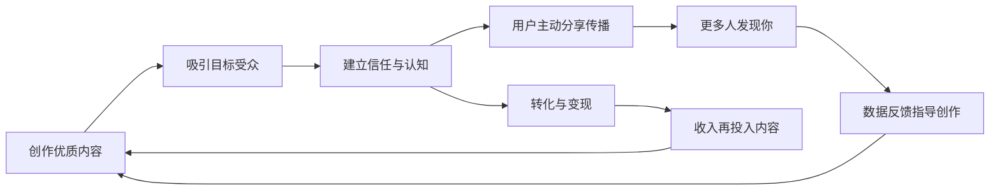
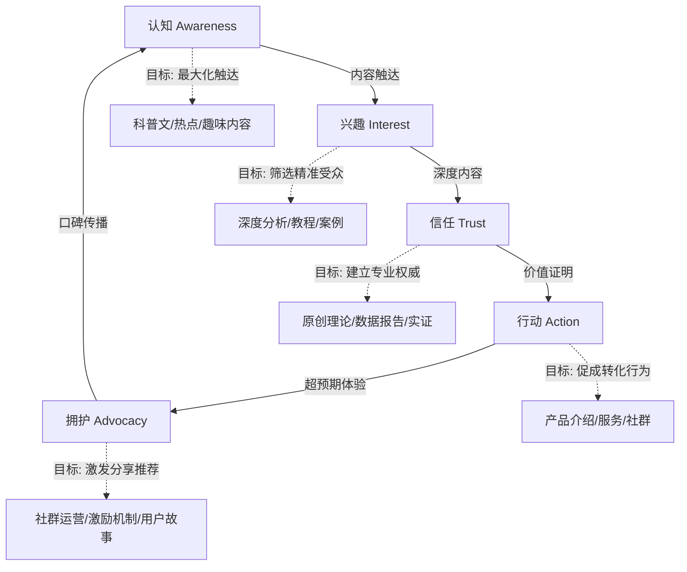
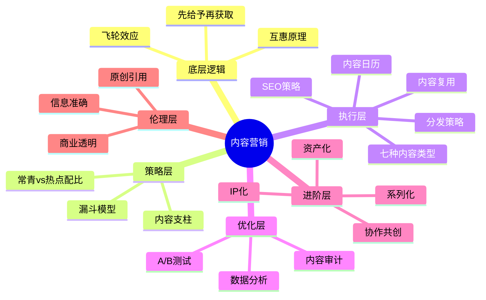

## 七、内容营销理论

内容营销是个人品牌建设的核心引擎。它不是简单地"发内容"，而是一套系统化的方法论——通过持续创作有价值的内容，在目标受众心智中建立认知、培养信任、驱动行动。本章将从底层原理到高阶策略，系统拆解内容营销的完整知识体系。

### 7.1 内容营销的本质与底层逻辑

#### 7.1.1 什么是内容营销

内容营销（Content Marketing）是通过规划、创作、分发有价值的内容来吸引和留住明确定义的受众，最终驱动其采取可盈利行为的战略营销方法。美国内容营销协会（CMI）的定义强调三个关键词：**有价值**、**明确定义的受众**、**驱动行动**。

与传统广告的本质区别在于注意力的获取方式：

| 维度 | 传统广告 | 内容营销 |
|------|----------|----------|
| 注意力模式 | 打断式（Push）：强行插入用户注意力流 | 吸引式（Pull）：用户主动选择消费 |
| 价值交换 | 单向灌输：品牌→用户 | 双向价值：品牌提供价值，用户给予信任 |
| 时间效应 | 即时但短暂：预算停则效果停 | 积累型：内容持续产生价值 |
| 成本曲线 | 线性增长：量越大成本越高 | 边际递减：积累越多获客成本越低 |
| 信任建立 | 弱：用户知道是广告，天然防备 | 强：通过内容建立专业认同和情感连接 |
| 可控性 | 高：预算直接决定曝光 | 中：依赖内容质量和算法推荐 |
| 生命周期 | 短：广告下线即消失 | 长：优质内容数年后仍有流量 |

#### 7.1.2 "先给予，再获取"的底层机制

内容营销的核心理念是"先给予，再获取"（Give First, Ask Later）。这个理念背后有坚实的心理学基础：

**互惠原理（Reciprocity）**。罗伯特·西奥迪尼在《影响力》中指出，当人们收到免费的价值时，会产生一种回报的心理负债感。你持续提供高质量的免费内容，受众会在潜意识中觉得"欠你一份人情"，这大大降低了后续转化的心理阻力。

**认知一致性（Cognitive Consistency）**。当一个人持续消费你的内容并认同你的观点，他会倾向于保持行为和认知的一致——关注你、推荐你、购买你的产品。这正是内容营销从"免费内容"到"付费转化"的心理路径。

**权威效应（Authority Effect）**。持续在某一领域输出专业内容，受众会自动将你归类为该领域的权威。这种"被认知的权威"不需要任何官方认证，它是通过内容积累自然形成的。

#### 7.1.3 内容营销的飞轮效应

成熟的内容营销不是线性增长，而是飞轮效应：

飞轮的初始推动最费力——在0到1000个粉丝阶段，你需要付出远超回报的努力。但一旦飞轮转起来，每一个优质内容都会为下一个内容提供初始流量基础，增长曲线从线性变为指数。

### 7.2 内容营销漏斗模型

#### 7.2.1 认知-兴趣-信任-行动-拥护五阶段模型

传统营销漏斗是AIDA模型（注意-兴趣-欲望-行动），但对个人品牌而言，需要扩展为五阶段模型，因为内容营销的最终目标不仅是转化，更是让用户成为你的传播者：

**认知阶段（Awareness）**：受众第一次接触到你的内容。这个阶段的关键指标是触达量和内容消费率。内容应以"广"为主——科普性、普适性、低认知门槛。一篇《为什么你的工作效率总是提不上去？》比《基于GTD框架的二维四象限时间矩阵优化》更容易在认知阶段发挥作用。

**兴趣阶段（Interest）**：受众开始主动寻找你的更多内容。关键指标是关注转化率和内容浏览深度。此时应提供有深度的垂直内容，展现你的专业能力。受众在此阶段的关键心理活动是："这个人说的话有道理，我想看看他还有什么观点。"

**信任阶段（Trust）**：受众将你视为领域权威。关键指标是互动率（评论、私信、提问）和停留时长。此时应展示原创见解、系统化知识、真实数据。信任不是一次建立的，它是通过反复的"承诺-兑现"循环累积的——你说的内容被验证是正确的，你就获得了信任。

**行动阶段（Action）**：受众采取你期望的行为——购买产品、加入社群、预约咨询。关键指标是转化率和客单价。此阶段的内容需要降低决策风险：免费试用、案例证明、退款保证等都是降低心理门槛的手段。

**拥护阶段（Advocacy）**：受众主动向他人推荐你。关键指标是推荐率和用户生成内容数量。这是内容营销的最高境界——你的受众成为你的免费营销团队。实现这一阶段需要：超预期的价值交付、社群归属感、以及分享的便利性。

#### 7.2.2 不同阶段的内容矩阵

| 漏斗阶段 | 内容类型 | 发布频率 | 平台选择 | 关键指标 |
|----------|---------|---------|---------|---------|
| 认知 | 科普文章、热点评论、趣味视频、信息图 | 高频（日更或隔日更） | 抖音、小红书、微博等公域平台 | 曝光量、点击率 |
| 兴趣 | 深度分析、系列教程、对比评测、行业报告 | 中频（周更） | 公众号、B站、知乎 | 关注率、完播率、收藏率 |
| 信任 | 原创理论、数据白皮书、直播答疑、案例详解 | 中低频（双周更） | 公众号、播客、YouTube | 互动率、停留时长、NPS |
| 转化 | 产品演示、服务说明、客户证言、限时优惠 | 低频（月度活动） | 私域（社群、邮件、个人号） | 转化率、客单价 |
| 拥护 | 社群活动、用户故事、共创内容、激励计划 | 持续运营 | 社群、UGC平台 | 推荐率、复购率、UGC量 |

### 7.3 内容支柱理论

#### 7.3.1 什么是内容支柱

内容支柱（Content Pillars）是你的内容宇宙中的核心主题集群——你持续输出内容的3-5个核心领域。每个内容支柱对应一个你希望在受众心智中占据的认知位置。

内容支柱不是随意选择的，它必须同时满足四个条件：

**与品牌定位强关联**。内容支柱是品牌定位的内容化表达。如果你的定位是"个人效率教练"，你的内容支柱就应该围绕效率、习惯、工具等主题，而不是突然开始谈投资理财。每次偏离支柱，都是在稀释你的品牌认知。

**具备持续创作空间**。一个合格的内容支柱应该能支撑至少50-100篇独立内容。如果一个主题三五篇就写完了，它不适合作为内容支柱，更适合作为一个子话题。

**存在受众需求**。你自己对某个主题感兴趣不等于受众也需要。用搜索数据、社交讨论热度、竞品内容互动数据来验证受众需求的真实性。

**你能提供独特视角**。同一主题有无数人在写，你必须有区别于他人的视角——可以是独特的经历、独到的方法论、或者独有的数据和案例。

#### 7.3.2 内容支柱的构建方法

**第一步：能力盘点**。列出你在某个领域所有的知识、技能、经验。不需要是"世界上最厉害的人"，你只需要比你的目标受众多走三五步。

**第二步：受众需求调研**。通过以下渠道收集受众的真实需求：
- 搜索引擎：Google Trends、百度指数查看搜索趋势
- 社交平台：知乎、小红书评论区的高频问题
- 竞品分析：竞品内容的高互动话题
- 直接调研：问卷、一对一访谈、社群讨论

**第三步：交叉匹配**。在"你能提供的"和"受众需要的"之间找到交集。交集区域就是你的内容支柱所在。

**第四步：差异化校验**。在每个候选支柱下，搜索现有内容。如果你发现大量高质量内容已经存在，你需要找到差异化的角度——不是做得更多，而是做得不同。

**第五步：命名与体系化**。为每个内容支柱建立清晰的命名和子话题树。示例——一位个人效率教练的内容支柱体系：

| 内容支柱 | 子话题示例 | 内容容量预估 | 差异化角度 |
|----------|-----------|------------|-----------|
| 时间管理 | 番茄工作法、时间块、精力管理、会议效率 | 80+篇 | 结合程序员工作场景 |
| 目标设定与执行 | OKR、年度规划、周回顾、里程碑管理 | 60+篇 | 用数据追踪目标进度 |
| 习惯养成 | 微习惯、习惯叠加、环境设计、戒除坏习惯 | 50+篇 | 基于行为科学理论 |
| 效率工具与系统 | Notion、Obsidian、自动化、数字极简 | 70+篇 | 提供模板和工作流 |
| 心态与精力管理 | 拖延症、倦怠期、认知负荷、深度工作 | 40+篇 | 结合心理学和神经科学 |

#### 7.3.3 内容支柱的动态调整

内容支柱不是一成不变的。每季度做一次审视：
- 哪些支柱的内容互动数据最好？可以适当加大投入。
- 哪些支柱的创作枯竭了？可能需要缩小范围或更换。
- 受众需求是否发生了变化？新趋势是否值得新增支柱？
- 你的能力成长是否需要调整支柱？从5个精简为3个，或从3个扩展为5个。

### 7.4 内容类型学：七种核心内容类型

理解不同内容类型的特点和适用场景，是高效内容创作的基础。每种类型在漏斗中的位置、创作难度、传播特性都不同。

#### 7.4.1 教育型内容（Educational）

**定义**：传授知识、技能、方法的内容。
**目的**：建立专业权威，帮助受众解决具体问题。
**典型形式**：教程、指南、课程、技巧分享。
**漏斗位置**：兴趣-信任阶段。
**创作要点**：由浅入深，有明确的学习路径；提供可执行的步骤；加入练习或作业提高参与度。

#### 7.4.2 启发型内容（Inspirational）

**定义**：激发受众情感、提供精神力量的内容。
**目的**：建立情感连接，增强认同感。
**典型形式**：个人故事、逆袭经历、名言解读、价值观分享。
**漏斗位置**：认知-兴趣阶段。
**创作要点**：真实比完美更重要；要有具体的困难和转折；结尾给出可行动的启示。

#### 7.4.3 娱乐型内容（Entertaining）

**定义**：以趣味性和消遣为核心的内容。
**目的**：扩大触达范围，降低传播门槛。
**典型形式**：段子、梗图、情景剧、挑战、吐槽。
**漏斗位置**：认知阶段。
**创作要点**：与品牌调性一致；不要为了娱乐而娱乐；适度融入品牌信息。

#### 7.4.4 说服型内容（Persuasive）

**定义**：论证某个观点、说服受众采取行动的内容。
**目的**：推动受众从兴趣到行动。
**典型形式**：案例研究、对比分析、客户证言、产品评测。
**漏斗位置**：信任-行动阶段。
**创作要点**：用数据和案例支撑论点；预判并回应反对意见；明确的行动号召（CTA）。

#### 7.4.5 新闻型内容（Newsjacking）

**定义**：对行业动态、热点事件的及时评论和解读。
**目的**：获得短期流量，展示行业敏感度。
**典型形式**：热点评论、事件分析、趋势预测。
**漏斗位置**：认知阶段。
**创作要点**：速度是关键——24小时内发布；要有独特角度而非重复信息；关联到你的专业领域。

#### 7.4.6 互动型内容（Interactive）

**定义**：需要受众参与才能完成的内容。
**目的**：提高参与度和记忆度，收集受众数据。
**典型形式**：投票、测试、问答、挑战赛、共创活动。
**漏斗位置**：兴趣-信任阶段。
**创作要点**：降低参与门槛；结果要有分享价值；通过互动收集有价值的受众洞察。

#### 7.4.7 用户生成内容（UGC）

**定义**：由用户/粉丝创作的与品牌相关的内容。
**目的**：提供社会证明，扩大传播范围。
**典型形式**：使用反馈、二次创作、推荐分享、社群打卡。
**漏斗位置**：拥护阶段。
**创作要点**：提供创作模板降低门槛；设立激励机制；及时转发和认可优质UGC。

### 7.5 常青内容与热点内容的配比策略

#### 7.5.1 常青内容的特征与价值

常青内容（Evergreen Content）是指那些长期有价值、不受时间影响的内容。它的搜索需求稳定，生命周期可达数年，是SEO流量的基石。

**常青内容的核心特征**：
- 主题的搜索需求长期存在（"如何写简历"在任何时候都有人搜索）
- 内容不会因时间推移而过时
- 可以反复更新和刷新，延长生命周期
- 随时间积累权重，搜索排名会持续提升

**常青内容的典型形式**：入门指南、终极教程、原理解析、方法论框架、工具对比评测、常见问题解答（FAQ）。

**创作常青内容的关键**：选择那些搜索量稳定且竞争度可接受的主题；内容要足够全面和深入——宁可一篇万字长文覆盖一个主题的方方面面，也不要拆成十篇碎片文章；定期更新数据和案例，保持时效性。

#### 7.5.2 热点内容的特征与策略

热点内容（Trending Content）与当前事件、话题相关。传播速度快，短期内关注度极高，但生命周期通常不超过一周。

**热点内容的核心策略——"快、准、转"**：
- **快**：速度是第一要素。热点的黄金窗口通常只有24-48小时。
- **准**：必须与你的专业领域相关。蹭不相关的热点会稀释品牌认知。
- **转**：热点内容中要植入你的专业视角，把流量转化为对你专业能力的认知。

**热点内容的风险**：
- 事实错误：热点初期信息混乱，容易传播不实信息。务必标注信息来源。
- 价值观翻车：某些热点涉及敏感话题，不当言论可能引发负面舆论。
- 同质化：所有人在写同一个热点，你的角度必须独特。

#### 7.5.3 黄金配比原则

**推荐比例：常青内容70%，热点内容30%**。

这个比例是动态的：
- 新手期（0-1000粉丝）：常青60%+热点40%——需要热点流量加速起步
- 成长期（1000-10000粉丝）：常青70%+热点30%——稳定内容基调
- 成熟期（10000+粉丝）：常青80%+热点20%——已有稳定流量基础，热点是锦上添花

### 7.6 内容复用策略（Content Repurposing）

#### 7.6.1 内容复用的底层逻辑

内容复用不是简单的"复制粘贴"，而是将一份核心内容根据平台特性、受众习惯、内容形式进行**适配性再创作**。其核心价值在于：

**降低创作边际成本**。一份深度内容的创作成本可能需要10小时，但将其复用为5种形式的边际成本只有额外2-3小时——总投入12-13小时产出5份内容，远优于单独创作5份内容需要的50小时。

**覆盖不同消费场景**。同一个受众在不同平台上有不同的消费习惯：通勤时听播客，午休时刷短视频，晚上深度阅读长文。内容复用让你在每个场景都能触达他。

**强化记忆效果**。同一个核心观点通过不同形式反复出现，会加深受众的记忆。心理学中的"间隔重复效应"在内容营销中同样适用。

#### 7.6.2 内容复用的标准流程

以一篇5000字的深度文章为例，展示完整的复用流程：

原始内容：深度文章（5000字）
│
├─→ 公众号长文（4000-6000字）
│     调整：优化标题和开头，加入配图，分段适配手机阅读
│
├─→ 知乎回答（1500-3000字）
│     调整：提取核心论点，用知乎体改写，加入个人经验
│
├─→ 小红书图文笔记（500-800字+6-9张图）
│     调整：提炼3-5个关键点，制作信息图卡，加入表情符号
│
├─→ 短视频脚本（1-3分钟口播）
│     调整：选择1个最有冲击力的观点，设计开头钩子，口播化表达
│
├─→ 播客节目（15-30分钟）
│     调整：对话形式展开讨论，加入案例故事，更口语化
│
├─→ 社群精华（200-500字）
│     调整：提炼核心金句，设计讨论问题，引导互动
│
├─→ 朋友圈/微博（50-150字）
│     调整：一句话核心观点+引导语+链接
│
└─→ 邮件Newsletter（800-1500字）
      调整：加入个人感想和幕后故事，增加亲切感

#### 7.6.3 内容复用的注意事项

**避免过度复用**。同一个核心内容的复用不要超过6-8种形式，否则边际效用递减，且容易让关注你多平台的受众产生审美疲劳。

**适配而非复制**。每个平台的用户阅读习惯、内容格式、算法偏好都不同。小红书需要视觉化、碎片化；知乎需要专业深度；抖音需要强刺激的开头。直接复制粘贴是最差的做法。

**差异化钩子**。同一内容在不同平台应使用不同的开头钩子。因为你的跨平台受众可能看到同一个主题在不同平台的内容，差异化钩子避免了"我已经看过了"的疲劳感。

**控制时间差**。原始内容发布后，建议间隔1-3天再发布复用版本，避免内容过于集中导致信息过载。

### 7.7 内容日历与发布节奏

#### 7.7.1 内容日历的作用

内容日历（Content Calendar）是将内容策略落地为具体执行计划的管理工具。它的核心价值是：

**对抗创作的随意性**。没有日历，创作就变成了"有灵感就写，没灵感就停"。日历将创作从依赖灵感变为依赖系统——即使没有灵感，你也有明确的任务清单。

**保持输出的一致性**。算法和受众都偏爱稳定的内容输出节奏。间歇性的"爆发-消失"模式会让算法降低对你的推荐权重，也会让受众对你失去信任。

**实现内容的系统化**。有了日历，你可以从全局视角审视内容的平衡——不同类型、不同支柱、不同平台的内容是否配比合理。

#### 7.7.2 内容日历的设计框架

一个实用的内容日历应包含以下字段：

| 字段 | 说明 | 示例 |
|------|------|------|
| 发布日期 | 具体到某一天 | 2025-03-15 |
| 发布时间 | 精确到小时 | 20:00 |
| 内容支柱 | 属于哪个核心主题 | 时间管理 |
| 内容标题 | 工作标题（发布时可调整） | 为什么你的番茄工作法总是失败 |
| 内容类型 | 教育/启发/说服/互动等 | 教育型 |
| 漏斗阶段 | 认知/兴趣/信任/行动/拥护 | 兴趣 |
| 内容形式 | 文章/视频/图文/音频等 | 公众号长文 |
| 目标平台 | 主发布平台 | 微信公众号 |
| 复用计划 | 是否复用及复用形式 | 知乎+小红书 |
| 核心关键词 | SEO关键词 | 番茄工作法、专注力 |
| 行动号召 | 期望受众做什么 | 关注+收藏 |
| 状态 | 规划中/创作中/审核中/已发布 | 创作中 |
| 数据记录 | 发布后的数据表现 | 阅读3200、转发85 |

#### 7.7.3 发布节奏的科学

**每日发布**：适合有团队支撑或创作能力极强的个人。对个人品牌而言，日更的压力很大，但可以在同一平台上发布不同深度的内容（如：周一深度文章，周三互动话题，周五轻松分享）。

**隔日发布**：对大多数人最可持续的节奏。有足够的时间创作高质量内容，同时保持足够的出现频率。

**每周2-3次**：适合深度内容创作者。宁可少而精，也不要为了频率牺牲质量。

**关键原则**：**频率可以低，但必须稳定**。与其日更一个月然后消失三个月，不如每周稳定更新一篇深度内容持续一年。算法和受众都讨厌不确定性。

### 7.8 内容SEO策略

#### 7.8.1 关键词研究基础

关键词是内容与搜索意图之间的桥梁。好的关键词研究应该同时满足三个条件：**有搜索量**（有人在搜索）、**有相关性**（与你的领域相关）、**有可行性**（竞争度在你的能力范围内）。

**关键词类型**：
- **短尾关键词**（1-2词）：如"时间管理"。搜索量大，竞争激烈，转化意图模糊。
- **中尾关键词**（3-4词）：如"时间管理方法"。搜索量中等，竞争适中。
- **长尾关键词**（5+词）：如"程序员如何用番茄工作法提高效率"。搜索量小，竞争低，转化意图明确。

**个人品牌的关键词策略**：以长尾和中尾关键词为主，短尾关键词为辅。原因很简单——个人品牌很难在短尾关键词上与大品牌竞争，但在长尾关键词上，一篇深度、原创、有经验支撑的内容完全可以获得好的排名。

#### 7.8.2 内容SEO的核心要素

**标题优化**：标题是SEO权重最高的元素。标题应包含核心关键词，同时具备点击吸引力。格式参考：`数字+痛点+解决方案`，如"5个时间管理陷阱（以及如何用番茄工作法避免它们）"。

**内容结构**：搜索引擎通过标题层级（H1-H4）理解内容的结构和层次。每个章节的标题应包含相关关键词的变体，而不是使用无意义的标题如"第一部分"。

**内部链接**：在内容中自然地链接到你的其他相关内容。这不仅帮助搜索引擎理解你网站的结构，还能提高用户在你网站上的停留时间和页面浏览深度。

**内容深度**：搜索引擎越来越偏好全面、深入的内容。一篇覆盖某个主题方方面面的长文，通常比十篇碎片文章更容易获得好的排名。这就是所谓的"10x内容"策略——你的内容要比现有排名前10的内容好10倍。

**更新频率**：搜索引擎偏好持续更新的内容。定期刷新旧内容（更新数据、补充新案例、扩展新章节）是性价比最高的SEO策略之一。

### 7.9 内容分发策略

#### 7.9.1 自有渠道 vs 赢得渠道 vs 付费渠道

| 渠道类型 | 定义 | 示例 | 优势 | 劣势 |
|----------|------|------|------|------|
| 自有渠道（Owned） | 你完全控制的平台 | 个人网站、公众号、邮件列表 | 完全控制，无平台风险 | 需要自己获取流量 |
| 赢得渠道（Earned） | 通过内容质量获得的曝光 | 搜索排名、口碑推荐、媒体转载 | 信任度高，成本低 | 不可控，需要时间积累 |
| 付费渠道（Paid） | 花钱获得的曝光 | 信息流广告、KOL合作、投放 | 可控，见效快 | 成本高，停投即停效 |
| 共享渠道（Shared） | 在第三方平台发布的内容 | 知乎、小红书、B站、抖音 | 借平台流量，起步快 | 受平台规则制约 |

**个人品牌的内容分发优先级**：自有渠道 > 共享渠道 > 赢得渠道 > 付费渠道。

为什么自有渠道排第一？因为平台可能会改变算法、提高门槛甚至封号。你的邮件列表、个人网站是唯一真正属于你的资产。所有在共享渠道获得的流量，最终都应该导向你的自有渠道。

#### 7.9.2 内容分发的"水花模型"

以一个核心内容为石子投入水中，涟漪逐层扩散：

**第一圈（即时分发）**：内容发布当天，在核心平台首发+社群分享+朋友圈推荐。
**第二圈（48小时内）**：复用版本在其他平台发布+主动分享到相关社群+互动回应评论。
**第三圈（一周内）**：向行业媒体投稿+与其他创作者互推+引用内容在其他文章中。
**第四圈（长期）**：SEO优化带来的持续搜索流量+内容被持续引用和链接。

### 7.10 内容营销的数据分析

#### 7.10.1 核心指标体系

内容营销需要追踪的指标分为四个层次：

**传播指标**（你的内容被多少人看到）：
- 曝光量/阅读量：内容被展示或打开的次数
- 触达人数：去重后的独立用户数
- 分享率：分享次数/阅读次数

**互动指标**（你的内容多大程度引起共鸣）：
- 点赞率：点赞数/阅读数
- 评论率：评论数/阅读数
- 收藏率：收藏数/阅读数
- 平均阅读时长/完播率

**转化指标**（你的内容多大程度驱动了行动）：
- 关注转化率：新增关注/阅读量
- 私域转化率：添加微信/阅读量
- 付费转化率：付费用户/总受众
- 内容带来的直接收入

**品牌指标**（你的内容多大程度建立了品牌认知）：
- 品牌搜索量：你的品牌名被搜索的次数变化
- 提及量：他人在内容中提到你的次数
- NPS（净推荐值）：用户愿意向他人推荐你的程度
- 品牌联想：受众提到你时联想到的关键词

#### 7.10.2 数据驱动的内容优化

**内容审计**（每季度一次）：
1. 列出本季度所有已发布内容
2. 按核心指标排序，找出Top 20%和Bottom 20%
3. 分析Top 20%的共同特征（主题、形式、标题风格、发布时间）
4. 分析Bottom 20%的问题所在（是选题不行？标题不行？发布时间不行？）
5. 将发现应用到下一季度的内容规划

**A/B测试**：对于关键内容元素（标题、封面、发布时间、CTA），设定A/B测试。每次只测试一个变量，积累数据后形成你的"最佳实践手册"。

**内容归因**：追踪每一篇内容在转化路径中的角色。有些内容虽然直接转化率低，但在"首次触达"或"中间培育"阶段表现优秀——这些内容同样重要，不应该因为直接转化数据差而被砍掉。

### 7.11 内容营销的常见误区

#### 误区一：追求数量而忽视质量

**错误表现**：为了日更而发布低质量内容，每篇都是浅尝辄止的500字短文。

**正确做法**：宁可一周一篇3000字的深度内容，也不要每天一篇500字的流水账。搜索引擎和社交算法都越来越偏好深度内容。一个残酷的事实是：95%的500字内容不会被任何人看到，但一篇优秀的5000字长文可能持续带来数年的流量。

#### 误区二：只做自己想做的，不做受众需要的

**错误表现**：创作者只写自己感兴趣的话题，忽略受众的真实需求。

**正确做法**：用数据验证需求。你对某个话题的热爱不能证明受众也需要它。在投入大量时间创作之前，先用搜索数据、社群讨论、竞品内容互动数据验证需求。

#### 误区三：过度依赖单一平台

**错误表现**：所有内容只在一个平台发布，且没有备份。

**正确做法**：核心内容在自有渠道（个人网站/公众号）首发，然后复用到其他平台。同时建立邮件列表——它是唯一不受算法影响的触达方式。

#### 误区四：忽视内容的可发现性

**错误表现**：精心创作了内容但不做SEO优化、不起好标题、不设计封面。

**正确做法**：内容创作和内容优化应该投入相同的时间。一篇50分的内容加上90分的标题和SEO，可能比一篇90分的内容加上30分的标题获得更多曝光。当然，长期来看内容质量是根本——但酒香也怕巷子深。

#### 误区五：急于变现，过早收割

**错误表现**：还没建立足够的信任就开始频繁推送产品、课程、社群。

**正确做法**：遵循"80/20法则"——80%的内容提供免费价值，20%的内容涉及变现。在信任建立之前过早变现，会严重损害品牌信任度。

#### 误区六：不做复盘，凭感觉创作

**错误表现**：从来不看数据，凭直觉决定下一个选题。

**正确做法**：每月做一次内容数据复盘，用数据指导选题方向。你的直觉可能对，但数据从不撒谎。

### 7.12 内容营销的进阶策略

#### 7.12.1 内容系列化

将内容组织为系列，而非独立的文章。系列内容的优势：

**提升留存**：读者看完第一篇后，有动力去看第二篇、第三篇。系列内容天然创造了一个"追剧"的阅读体验。

**降低创作压力**：系列内容的主题已经确定，你只需要在一个主题下深入，不必每次从零开始构思选题。

**建立体系感**：系列内容展示的是系统化的知识，而非碎片化的观点。这对建立专业权威至关重要。

**系列内容的设计要点**：
- 有明确的总主题和清晰的逻辑主线
- 每篇独立可读，但系列阅读体验更好
- 在每篇结尾预告下一篇，创造期待感
- 设计一个总目录或导图，方便新读者入门

#### 7.12.2 内容IP化

当你的内容积累到一定体量，可以将其提炼为可辨识的内容IP——标志性的系列、框架、概念、术语。例如：
- 标志性框架：某个你原创的方法论（如"三维时间管理矩阵"）
- 标志性系列：固定的栏目名和形式（如"每周效率提升一招"）
- 标志性概念：你创造或重新定义的术语（如"数字断舍离"）
- 标志性风格：独特的表达方式（如某位博主标志性的开头问候语）

内容IP的价值在于**可识别性**——受众在海量信息中一眼就能认出"这是你的内容"，这种辨识度是个人品牌最坚固的护城河。

#### 7.12.3 内容协作与共创

**嘉宾访谈**：邀请领域专家进行对话，借力他们的专业和流量。
**联合创作**：与互补领域的创作者合作产出内容，共享受众。
**社群共创**：让受众参与内容创作（投票选题、征集案例、协作写作），提高归属感和传播意愿。

内容协作的核心原则是**价值对等**——合作双方都能从中获得明确的价值。不要只想着"借别人的流量"，也要想"我能为对方提供什么"。

#### 7.12.4 内容资产化思维

将内容视为可积累、可增值的资产，而非一次性的消耗品：

**内容库建设**：按主题和类型组织你的内容库，方便检索、更新和复用。
**知识沉淀**：将分散的内容整合为系统化的知识产品（电子书、课程、工具包）。
**长尾价值**：每一篇优质内容都是一个永久的"销售员"，持续为你带来搜索流量和新受众。
**内容版权**：重视你的原创内容版权，必要时进行版权登记，防止被抄袭后无法维权。

### 7.13 内容营销伦理

#### 7.13.1 信息准确性

作为内容创作者，你对受众负有信息准确性的责任。具体实践：
- 引用数据时标注来源，方便受众核实
- 区分事实与观点——事实需要证据，观点需要论证
- 当发现已发布内容存在错误时，及时更正并说明
- 对不确定的信息使用限定语，避免绝对化的表述

#### 7.13.2 原创与引用

- 他人原创内容必须明确标注来源和作者
- 大段引用需要获得授权，即使标注了来源
- "洗稿"（对他人内容进行表面改写但实质未变）是不道德的行为
- 合理使用开放版权内容（CC协议），遵守对应的使用条款

#### 7.13.3 商业透明

当内容中包含商业合作、广告推广、付费推荐时，必须明确告知受众。隐瞒商业关系会严重损害信任。在中国，《广告法》和《互联网广告管理办法》对此有明确的法律要求。

### 7.14 内容营销理论总结

内容营销是一场长跑，而非短跑冲刺。它的核心逻辑可以用一句话概括：**持续为正确的人提供正确的内容，信任和影响力就会自然生长**。

回顾本章的核心框架：

记住一个核心公式：**内容营销效果 = 内容质量 × 发布频率 × 分发效率 × 持续时间**。四个变量缺一不可，但最被低估的往往是最后一个——"持续时间"。大多数人不是做不好内容营销，而是在飞轮转起来之前就放弃了。

