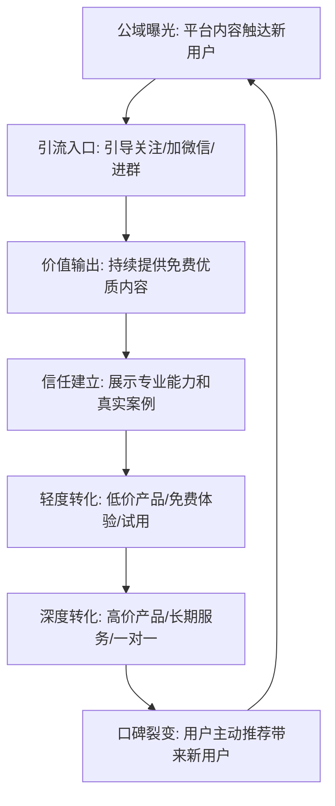
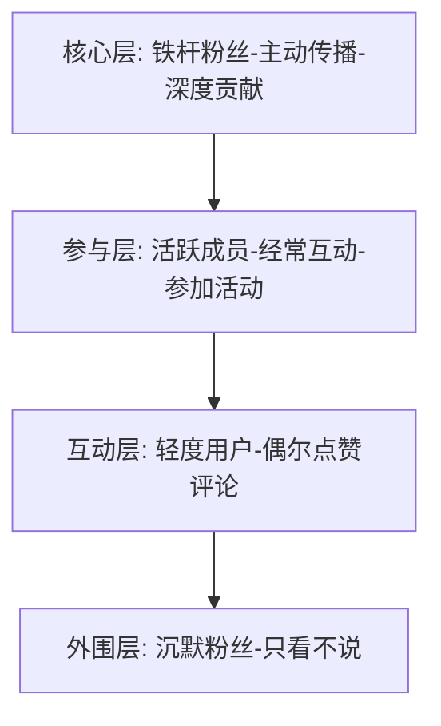

## 八、社交媒体营销理论

社交媒体不仅是发布内容的渠道，更是构建个人品牌生态的核心基础设施。本章从底层原理到平台实操，系统讲解社交媒体营销的完整知识体系，帮助你从"凭感觉发帖"进化为"有策略地经营"。

### 8.1 社交媒体营销的本质

社交媒体营销是利用社交媒体平台建立品牌认知、与受众深度互动、传播核心价值并最终实现商业目标的系统化营销方式。它不是传统营销搬到线上那么简单，而是一次传播范式的根本变革。

#### 8.1.1 社交媒体营销与传统营销的本质区别

理解这种区别，才能理解为什么社交媒体营销需要完全不同的思维方式。

| 维度 | 传统营销 | 社交媒体营销 |
|------|----------|-------------|
| 传播方向 | 单向（品牌→受众） | 双向（品牌↔受众） |
| 传播速度 | 按计划排期（天/周级） | 实时传播（分钟/小时级） |
| 受众角色 | 被动接收者 | 主动参与者、内容共创者 |
| 反馈机制 | 滞后（问卷、销售数据） | 即时（评论、私信、转发） |
| 成本结构 | 高固定成本（广告位购买） | 低门槛进入，内容和时间成本为主 |
| 精准度 | 粗放（按媒体受众画像） | 精细（按用户行为数据） |
| 关系深度 | 品牌与消费者无直接关系 | 可建立个人化深度关系 |
| 效果衡量 | 难以精确归因 | 全链路数据追踪 |

#### 8.1.2 社交媒体营销的四大核心特征

**双向性：从"我说你听"到"共同对话"**

传统营销是单向广播，品牌对着观众喊话。社交媒体营销是双向对话，品牌需要真正倾听受众的声音。这意味着：你的每一条内容都应该有引发对话的设计意图；你需要认真回复评论和私信，而不是发完就走；受众的反馈（包括批评）是改进产品和内容的宝贵输入。

举个具体例子：一位健身博主发了一条减脂餐视频，评论区有人问"上班族没有时间做怎么办？"。如果博主只是忽略这条评论，就错过了一个内容灵感。如果博主回复"这是个好问题，我来出一期5分钟快手减脂餐"，然后再真的出一期——这就是双向互动的力量。用户感到被倾听，博主获得了一个高需求内容主题。

**即时性：速度是双刃剑**

一条内容可以在几小时内触达数百万人，这是前所未有的传播速度。正面看：一篇好内容可以一夜之间让你从无名小卒变成现象级博主。负面看：一句失言也可以在几小时内引发全网声讨。

这种即时性要求你具备两种能力：
- **快速响应能力**：热点事件发生时，你能在2-4小时内产出相关内容（而不是等三天）
- **危机预判能力**：发布前评估内容的风险面，建立危机应对预案

**社区性：从"粉丝经济"到"社区经济"**

社交媒体的本质不是媒体，而是社区。人们在社交媒体上消费内容只是表层需求，深层需求是：寻找同类（"这里有人和我一样"）、获得归属感（"我是这个群体的一部分"）、建立社交资本（"我分享的内容能获得认可"）。

成功的社交媒体营销不是"积累粉丝数"，而是"构建社区"。粉丝是单向的（他们关注你），社区是多向的（成员之间也互相连接）。当你的受众之间开始自发互动、互相帮助时，你的社区就真正活了。

**算法驱动性：理解"看不见的手"**

你在社交媒体上发布的每一条内容，能否被看到、被多少人看到，主要不是由你的粉丝数决定的，而是由平台算法决定的。算法是社交媒体平台的"看不见的手"，它决定了内容的分发逻辑。

理解算法的核心原则：
- **平台目标优先**：算法的终极目标是让用户在平台上花更多时间。任何能让用户停留更久的内容类型，算法都会优先推荐
- **互动信号权重高**：点赞、评论、转发、完播率、收藏——这些互动信号是算法判断内容质量的核心指标
- **新鲜度衰减**：大部分平台都有时间衰减机制，新内容比老内容更容易获得推荐
- **垂直度奖励**：持续在某个领域发布内容的账号，会被算法标记为"该领域专家"，获得更精准的推荐

### 8.2 主流社交媒体平台的特性与策略

不同平台有不同的算法逻辑、用户行为和内容偏好。"一套内容全平台分发"是最常见的错误做法。你需要理解每个平台的特性，然后制定针对性的策略。

#### 8.2.1 平台选择矩阵

| 平台 | 核心优势 | 适合的内容类型 | 用户画像 | 变现路径 |
|------|----------|---------------|----------|----------|
| 微信公众号 | 深度内容、私域沉淀 | 长文、深度分析 | 25-45岁，职场人士 | 广告、课程、咨询 |
| 小红书 | 种草决策、女性用户 | 图文笔记、生活方式 | 18-35岁，女性为主 | 品牌合作、电商导流 |
| 抖音 | 流量爆发力、下沉市场 | 短视频、直播 | 全年龄段，大众化 | 直播带货、广告 |
| B站 | 年轻社区、深度内容 | 中长视频、知识科普 | 18-30岁，Z世代 | 充电、品牌合作 |
| 知乎 | 专业问答、长尾流量 | 专业回答、专栏 | 25-40岁，高学历 | 知识付费、咨询 |
| 微博 | 热点传播、公共讨论 | 短文本、热点评论 | 全年龄段 | 广告、话题营销 |
| 视频号 | 微信生态、中老年市场 | 短视频、直播 | 30-60岁，微信用户 | 直播带货、私域导流 |

#### 8.2.2 平台选择策略

不是所有平台都适合你。选择平台时考虑三个维度：

**维度一：你的目标受众在哪里？**

你的受众画像（年龄、性别、职业、兴趣）决定了他们活跃的平台。面向年轻Z世代做游戏内容，B站是首选；面向职场白领做管理知识，微信公众号和知乎更合适；面向女性用户做美妆穿搭，小红书是必选。

**维度二：你的内容形式优势是什么？**

如果你擅长写作，微信公众号和知乎是主战场；如果你颜值高、表达力强，抖音和视频号更适合；如果你擅长制作精良的视频，B站是最佳选择；如果你善于用图片讲故事，小红书最适合。

**维度三：你的变现路径是什么？**

不同平台的变现效率差异巨大。知识付费类变现，微信公众号和知乎的转化率最高；电商带货，抖音和视频号的效率最高；品牌合作，小红书和B站的商业价值最高。

**实际建议**：先选1-2个主平台深耕，而不是五个平台同时铺开。一个平台做透了，再扩展到第二个平台。大部分成功的个人品牌，都是先在一个平台上建立了不可替代的地位，然后才跨平台扩张的。

### 8.3 社交媒体营销的战略框架

社交媒体营销不是随意发帖，而是有系统、有策略的运营。一个完整的社交媒体营销战略包含六个要素。

#### 8.3.1 目标设定：用SMART原则定义你的社交媒体目标

你的社交媒体目标应该是具体的、可衡量的、可实现的、相关的、有时限的。

| 错误目标 | 正确目标 |
|----------|----------|
| "增加粉丝" | "3个月内小红书粉丝从5000增长到2万" |
| "提高影响力" | "6个月内微信公众号篇均阅读量从500提升到2000" |
| "做短视频" | "每周发布3条抖音视频，3个月内单条平均播放量达到1万" |
| "变现" | "通过私域社群在Q4实现月均收入5万元" |

常见目标类型及其关键指标：

- **品牌曝光**：关注量、曝光量、品牌搜索量
- **受众互动**：互动率（点赞+评论+转发/曝光量）、评论质量、UGC产出量
- **流量获取**：外链点击量、落地页访问量、注册转化率
- **线索收集**：私信咨询量、表单提交量、社群入群量
- **直接转化**：成交额、客单价、复购率

#### 8.3.2 受众研究：绘制你的用户画像

不了解受众的内容创作是盲目的。你需要回答以下问题：

**基础画像**：
- 年龄段是什么？（决定内容风格和表达方式）
- 性别比例如何？（决定选题和视觉风格）
- 地域分布在哪里？（决定语言习惯和文化背景）
- 职业和收入水平？（决定消费能力和需求层次）

**行为特征**：
- 他们活跃在哪些平台？什么时间段最活跃？
- 他们喜欢什么类型的内容？（干货型、故事型、娱乐型）
- 他们关注哪些同类博主？为什么关注？
- 他们的内容消费习惯是什么？（碎片浏览还是深度阅读）
- 他们愿意为什么样的内容付费？

**痛点和需求**：
- 他们面临什么问题和挑战？
- 他们想实现什么目标？
- 他们在哪些问题上感到困惑和迷茫？
- 他们为解决这些问题尝试过什么方法？为什么没成功？

**获取受众洞察的实操方法**：
1. **评论区分析**：仔细阅读你自己和竞品的评论区，用户的真实需求都藏在评论里
2. **私信整理**：把收到的私信和咨询分类整理，高频问题就是内容选题的金矿
3. **社群观察**：在目标用户聚集的社群里潜水，观察他们讨论什么、抱怨什么、渴望什么
4. **问卷调研**：定期向你的受众发放简短问卷（5-10题），直接获取需求信息
5. **数据工具**：使用平台自带的创作者数据中心，分析粉丝的活跃时间、内容偏好、互动行为

#### 8.3.3 内容策略：构建你的内容体系

内容是社交媒体营销的核心资产。你需要一个系统化的内容策略，而不是想到什么发什么。

**内容支柱（Content Pillars）**

内容支柱是你的内容分类体系，通常包含3-5个主题方向。每个支柱占内容总量的一定比例。

以一位个人成长博主为例，内容支柱可以是：
- **专业干货**（40%）：时间管理、习惯养成、认知提升等实用方法论
- **个人故事**（25%）：自己的成长经历、失败教训、突破时刻
- **热点评论**（15%）：结合时事热点输出个人观点
- **互动内容**（10%）：问答、投票、挑战等引发参与的内容
- **产品/服务推广**（10%）：课程、社群、咨询等商业内容

**内容日历（Content Calendar）**

内容日历是你的发布计划，它解决了"今天发什么"的问题。

周一：专业干货（图文长文）
周三：个人故事/热点评论（短视频或图文）
周五：专业干货（图文长文或视频）
周日：互动内容（问答、投票）

制作内容日历的步骤：
1. 确定每周发布频率（建议新手2-3条/周，成熟期5-7条/周）
2. 按内容支柱分配每个发布日的主题类型
3. 提前规划1-2周的具体选题
4. 预留灵活空间用于追热点

**内容创作的"钩子-价值-行动"框架**

每一条内容都应该遵循这个结构：

1. **钩子（Hook）**：前3秒/前2行决定用户是否继续看下去。有效的钩子类型包括：提问式（"你有没有想过为什么……"）、冲突式（"99%的人都不知道的事实"）、故事式（"三年前我还是一个月薪3000的……"）、数字式（"用这个方法，我一个月涨了1万粉"）
2. **价值（Value）**：正文部分提供实质内容。确保每一条内容至少包含一个可执行的知识点或一个有启发性的观点
3. **行动（CTA）**：结尾引导用户采取行动。可以是"点赞收藏"、"评论你的看法"、"关注我获取更多"、"点击链接了解详情"

#### 8.3.4 互动策略：从单向广播到双向对话

互动不是"回复评论"那么简单，而是一套系统的用户关系管理方法。

**主动互动**：
- 在每条内容发布后的1小时内，主动回复每一条评论
- 在同领域博主的评论区留下有价值的评论（不要打广告，而是真正贡献观点）
- 在社群里主动发起话题讨论
- 定期私信核心粉丝，了解他们的需求

**被动互动**：
- 建立评论回复模板库，提高效率但保持个性化
- 设置关键词自动回复（如私信自动回复常见问题）
- 对负面评论的处理：先私信沟通，公开回复只用于澄清事实

**互动率提升技巧**：
- 在内容结尾设置开放式问题（"你遇到过这种情况吗？你是怎么处理的？"）
- 制造争议性但不越界的讨论（"早起和晚睡，哪个效率更高？"）
- 鼓励用户分享自己的经验（"评论区分享你的故事，我选出最有启发性的3个"）
- 做投票和选择题（"你选A还是B？"）

#### 8.3.5 投放策略：付费推广的正确姿势

付费推广不是"有钱就能买到流量"，而是"用钱放大已经验证有效的内容"。

**什么时候该用付费推广？**
- 一条自然流量表现优秀的内容（互动率高于平均值2倍以上），值得用付费推广放大效果
- 你有明确的转化目标（如课程销售、社群招募），需要精准触达目标受众
- 你在新平台冷启动阶段，需要初始流量打破"零关注"困境

**投放的基本原则**：
1. **先测后投**：小额测试（50-100元），观察数据效果，确认ROI为正后再加大投入
2. **精准定向**：不要追求"广撒网"，而是精准定位目标受众的年龄、兴趣、行为标签
3. **内容为王**：再好的投放策略也救不了差内容。投放的前提是内容本身足够优秀
4. **数据驱动**：追踪每一分投入带来的回报（关注成本、点击成本、转化成本），及时调整

#### 8.3.6 分析优化：用数据驱动决策

不看数据的社交媒体运营就像蒙着眼睛开车。你需要建立定期的数据分析机制。

**核心指标体系**：

| 指标类别 | 核心指标 | 计算方式 | 健康基准 |
|----------|----------|----------|----------|
| 曝光指标 | 曝光量、播放量 | 平台统计 | 持续增长趋势 |
| 互动指标 | 互动率 | (点赞+评论+转发)/曝光 | 微信3-8%，抖音3-5% |
| 增长指标 | 粉丝增长率 | 新增粉丝/总粉丝 | 周增长1-3% |
| 转化指标 | 点击率 | 点击数/曝光数 | 1-3% |
| 留存指标 | 粉丝留存率 | 未取关粉丝/总粉丝 | >95%/月 |
| 变现指标 | 单粉价值 | 总收入/总粉丝数 | 因行业而异 |

**数据分析的节奏**：
- **每日**：检查发布内容的基础数据（播放量、互动量）
- **每周**：对比本周与上周的整体数据趋势，找出表现最好和最差的内容
- **每月**：全面复盘，分析内容类型、发布时间、标题策略对数据的影响
- **每季度**：调整整体策略方向，更新内容支柱和发布频率

### 8.4 私域流量理论

公域流量是租来的，私域流量是自己的。理解私域流量理论，是个人品牌可持续变现的关键。

#### 8.4.1 公域流量与私域流量的本质区别

| 维度 | 公域流量 | 私域流量 |
|------|----------|----------|
| 控制权 | 平台控制 | 自己控制 |
| 触达成本 | 每次都需要付费或内容竞争 | 触达成本接近零 |
| 用户关系 | 弱关系（平台用户） | 强关系（你的用户） |
| 转化率 | 低（1-3%） | 高（5-20%） |
| 典型场景 | 抖音推荐页、小红书发现页 | 微信好友、微信群、邮件列表 |
| 流量属性 | 一次性、不稳定 | 可反复触达、稳定 |

#### 8.4.2 私域流量的核心价值

**自主可控**：不受平台算法变化的影响。2021年某平台算法大改，无数百万粉大号的曝光量一夜之间暴跌80%。但那些有私域流量池的博主，依然能够通过微信触达自己的核心用户。

**成本递减**：获取一个公域流量用户的成本每年都在涨（以微信公众号为例，单个关注成本从2015年的0.5元涨到了2024年的5-15元）。但私域流量一旦建立，维护成本极低——一条朋友圈就能触达所有好友。

**转化率碾压**：公域用户的转化率通常在1-3%，私域用户的转化率可以达到5-20%。原因是私域用户已经通过长期内容消费建立了信任，从"陌生人"变成了"熟人"。

**数据资产**：私域用户的行为数据（谁买了什么、谁咨询了什么、谁最活跃）是你最宝贵的数据资产，可以帮助你精准优化产品和服务。

#### 8.4.3 个人品牌的私域流量池建设

**微信生态（核心阵地）**

微信个人号是个人品牌最强大的私域流量池，因为它具备最强的关系沉淀能力。

- **微信好友**：最高价值的私域资产。建议用工作微信（而非私人微信）承载，设置专业的头像、签名和朋友圈封面
- **微信群**：按用户分层建群（如免费交流群、付费会员群、VIP学员群），不同群提供不同层级的价值
- **朋友圈**：最高效的日常触达渠道。建议每天发布3-5条朋友圈，内容比例为：干货分享40%、生活日常30%、产品推广20%、用户反馈10%

**邮件列表（被低估的渠道）**

在中国市场，邮件列表常被忽视，但在知识付费和个人品牌领域，邮件依然是高转化率的触达方式。

- 邮件打开率稳定在20-40%（远高于公众号1-5%的打开率）
- 邮件不受平台算法影响，发出就能到达
- 适合发布深度内容、课程通知、限时优惠等

**付费社群（高价值私域）**

付费社群是筛选高价值用户的有效机制。付费门槛天然过滤了"只看不买"的用户，留下的都是真正认可你价值的核心用户。

#### 8.4.4 私域流量的运营漏斗

私域流量运营遵循一个明确的漏斗模型：

**运营核心原则**：价值输出→信任建立→关系维护→商业转化。私域流量运营的核心不是"卖东西"，而是"提供价值"。只有持续为私域用户提供有价值的内容和服务，才能维持私域的活跃度和信任度。

一个常见的错误是：把用户加到微信后，立刻开始推销产品。正确的做法是：先用7-14天持续提供免费价值（干货文章、问题解答、资源分享），让用户感受到"加你微信是有价值的"，然后再自然地引入产品推荐。

### 8.5 社群运营理论

社群是个人品牌最有价值的资产之一。一个活跃的社群不仅能够为你提供持续的反馈和支持，还能成为品牌传播和商业变现的核心阵地。

#### 8.5.1 社群的层次模型

不是所有关注你的人都是同等价值的。理解社群的层次结构，才能对不同层级的用户采取不同的运营策略。

**外围层（沉默粉丝）**：关注你但从不互动的用户。他们占总粉丝数的60-80%，不代表没有价值——他们可能在默默消费你的内容。运营策略：通过爆款内容激活他们。

**互动层（轻度用户）**：偶尔点赞、评论的用户。他们对你的内容有一定认可，但还没有深度参与。运营策略：通过互动和回复增加他们的参与感，引导他们进入参与层。

**参与层（活跃成员）**：经常参加你的活动、购买你的产品、在社群里发言的用户。运营策略：给予更多关注和特权，培养他们成为核心层。

**核心层（铁杆粉丝）**：深度认同你的品牌，主动为你传播，愿意付费支持你的一切产品。他们是你最宝贵的资产。运营策略：给予最高级别的一对一关注，邀请他们参与内容共创和产品设计。

#### 8.5.2 社群运营的核心原则

**价值优先**：社群存在的首要目的是为成员提供价值，而不是为你提供收益。如果你的社群只是你发布广告的渠道，成员会很快流失。价值可以是：独家内容、问题解答、资源分享、人脉连接、情感支持。

**规则清晰**：建立明确的社群规则，并在成员加入时清楚告知。规则应包括：禁止行为（广告、人身攻击、政治敏感话题）、鼓励行为（分享经验、提问互助）、违规处理方式（警告→禁言→移出）。

**参与感**：让每个成员都有参与感和归属感，而不是被动接收信息。具体方法：定期组织主题讨论、设立成员分享日、鼓励成员之间互相帮助、让活跃成员担任群管理角色。

**仪式感**：建立社群的专属仪式，增强凝聚力。例如：每日早安打卡、每周五的分享会、每月的线下聚会、每年的周年庆活动。仪式感让社群从"一个群"变成"一个有归属感的社区"。

**淘汰机制**：定期清理不活跃或违反规则的成员。这看起来反直觉，但保持社群质量比追求人数更重要。一个100人的高质量社群，远比一个5000人的死群更有价值。

#### 8.5.3 社群生命周期管理

社群不是建了就能一直活跃的，它有明确的生命周期。

| 阶段 | 特征 | 持续时间 | 运营重点 |
|------|------|----------|----------|
| 创建期 | 成员兴奋，互动频繁 | 1-2周 | 建立规则、自我介绍、破冰活动 |
| 成长期 | 快速增长，话题多样 | 1-3个月 | 内容沉淀、培养核心成员 |
| 成熟期 | 稳定互动，形成文化 | 3-12个月 | 深度价值输出、商业化探索 |
| 衰退期 | 活跃度下降，广告增多 | 不定 | 变革创新、引入新鲜血液 |
| 重生/关闭 | 转型或解散 | - | 平稳过渡、保护品牌声誉 |

#### 8.5.4 社群变现模式

| 变现模式 | 说明 | 适用阶段 | 单群月收入参考 |
|----------|------|----------|--------------|
| 付费入群 | 收取入群门槛费 | 成熟期 | 取决于定价和人数 |
| 社群课程 | 在群内开设系列课程 | 成长期起 | 5,000-50,000元 |
| 产品团购 | 组织成员团购产品/服务 | 成熟期 | 3,000-30,000元 |
| 咨询服务 | 一对一或小组咨询 | 成熟期 | 10,000-100,000元 |
| 会员制 | 月度/年度会员费 | 成熟期 | 持续性收入 |
| 品牌合作 | 与品牌合作推广 | 成熟期 | 视影响力而定 |

### 8.6 内容创作的方法论

内容创作是社交媒体营销的核心能力。这里提供一套可复制的内容创作方法论。

#### 8.6.1 选题方法

选题决定了内容的上限。好选题的标准：受众有需求、你有独特视角、具备传播潜力。

**五种高效选题方法**：

1. **痛点挖掘法**：从受众的评论、私信、社群讨论中提取高频问题，每个问题就是一个选题
2. **热点借势法**：追踪行业热点和公共事件，用你的专业视角解读。关键是要快（2-4小时内发布）且有独特观点
3. **竞品分析法**：分析同领域头部博主的高互动内容，理解什么话题受欢迎，然后用自己的角度重新诠释
4. **系列化法**：将一个大主题拆分为系列内容（如"30天早起挑战"、"职场沟通10讲"），系列内容能培养用户的持续关注习惯
5. **跨界嫁接法**：将不同领域的知识嫁接到你的领域（如用心理学原理讲营销、用军事策略讲管理），新鲜感是传播的催化剂

#### 8.6.2 标题/封面的优化

标题和封面决定了内容的点击率。在信息流中，用户平均只花0.5-1秒决定是否点击你的内容。

**标题公式**：
- 数字+结果："用这5个方法，我3个月减了20斤"
- 痛点+方案："每天都很累？可能是你的时间管理方式错了"
- 好奇心缺口："大多数人都不知道的Excel隐藏功能"
- 权威背书："哈佛大学推荐的10个高效学习法"
- 对比冲突："月薪3千和月薪3万的人，差距在哪里"

**封面设计原则**：
- 文字清晰可读（手机屏幕上要能看清）
- 色彩对比强烈（在信息流中脱颖而出）
- 信息量适中（不超过20个字的封面文案）
- 风格统一（形成视觉识别度）

#### 8.6.3 内容创作的效率工具

| 工具类型 | 推荐工具 | 用途 |
|----------|----------|------|
| 选题灵感 | 5118、新榜、蝉妈妈 | 分析热门话题和竞品数据 |
| 文案写作 | AI写作助手、石墨文档 | 提高写作效率 |
| 图片设计 | Canva、稿定设计、创客贴 | 制作社交媒体图片 |
| 视频剪辑 | 剪映、CapCut、Premiere | 视频内容制作 |
| 数据分析 | 平台创作者中心、灰豚数据 | 内容数据分析 |
| 排期管理 | Notion、飞书、Excel | 内容日历管理 |

### 8.7 社交媒体营销的常见误区

以下是社交媒体营销中最常见的错误，以及对应的纠正方法。

**误区一：盲目追求粉丝数量**

很多创作者把"涨粉"作为唯一目标，甚至花钱买粉。但粉丝数量不等于影响力，1000个精准的铁杆粉丝，远比10万个僵尸粉有价值。纠正方法：关注互动率和转化率，而不是粉丝数。凯文·凯利的"1000个铁杆粉丝"理论指出，只需要1000个愿意为你付费的核心粉丝，就足以维持一个全职创作者的生计。

**误区二：全平台铺开，每个平台都做不好**

新手常见的错误是"抖音也做、小红书也做、公众号也做、B站也做"，结果每个平台都是浅尝辄止，没有一个平台做透。纠正方法：先选1个主平台做到该领域的头部，再扩展到第二个平台。跨平台分发不是"同一个内容发五遍"，而是"同一个核心观点，用五个平台的语言重新表达"。

**误区三：只发内容不做互动**

很多创作者每天花3小时创作内容，但只花5分钟回复评论。社交媒体的核心是"社交"，不是"媒体"。纠正方法：把互动时间纳入你的日常工作计划。建议互动时间不低于创作时间的30%。发布后的1小时是互动的黄金期，这段时间要积极回复每一条评论。

**误区四：急于变现，忽视价值积累**

加了微信好友就开始推销产品，建了社群就开始收费——这种做法会迅速透支信任。纠正方法：遵循"先给后取"原则。在变现之前，至少提供3-6个月的免费价值。让用户先感受到你的价值，再自然地引入商业变现。

**误区五：忽视数据分析，凭感觉运营**

"我觉得这条内容应该不错"——这是最危险的判断方式。你的直觉不一定准确，数据不会骗人。纠正方法：建立定期数据分析的习惯。每周花1小时分析数据，找出哪些内容表现好、为什么好，然后复制成功经验。

**误区六：内容同质化，没有个人特色**

模仿头部博主的内容形式可以快速起步，但如果始终没有自己的风格，就永远只能是"低配版XXX"。纠正方法：在模仿的基础上逐步注入个人特色——你的表达方式、你的独特观点、你的个人故事。差异化的关键是"你这个人"，而不仅仅是"你做的内容"。

### 8.8 社交媒体营销的进阶策略

当你已经掌握了基础策略，以下进阶策略可以帮助你突破增长瓶颈。

#### 8.8.1 个人IP化运营

个人品牌的终极形态是IP化——让受众不仅认可你的内容，更认可你这个人。

IP化的关键要素：
- **辨识度**：独特的视觉风格（封面设计、色调）、语言风格（口头禅、表达方式）、内容形式（固定的栏目、片头片尾）
- **一致性**：所有平台的形象、语气、价值观保持一致。用户在任何平台看到你，都能立刻认出"这是同一个人"
- **人格化**：展现真实的自己，包括优点和缺点。完美的人设容易崩塌，真实的人格才有生命力
- **故事性**：你的成长故事、转变经历、价值主张——这些构成了你的品牌叙事

#### 8.8.2 跨平台联动策略

当你在多个平台运营时，跨平台联动可以产生1+1>2的效果。

**内容联动**：在A平台预告B平台的独家内容，引导用户跨平台关注。例如，在抖音短视频结尾说"完整版教程在我公众号"。

**流量联动**：不同平台的流量特性不同。用抖音/小红书的推荐流量获取新用户，用微信公众号/社群沉淀和转化用户。

**数据联动**：整合多平台的用户数据，构建完整的用户画像。了解用户在不同平台的行为差异，制定更精准的策略。

#### 8.8.3 社交媒体营销的自动化与规模化

当你的时间精力成为增长瓶颈时，需要考虑自动化和规模化。

**内容创作自动化**：
- 使用模板化流程批量制作内容（如封面模板、文案框架）
- 建立素材库，积累可复用的图片、视频片段、文案段落
- 使用AI工具辅助创作（选题推荐、文案优化、图片生成）

**运营流程自动化**：
- 使用社群管理工具自动回复常见问题
- 使用排期工具提前安排一周的内容发布
- 使用数据工具自动收集和整理运营数据

**团队化运营**：
- 从一个人做所有事，到分工协作（内容创作、社群运营、数据分析由不同人负责）
- 核心不可外包的：你的个人观点、你与核心用户的关系、你的品牌方向
- 可以外包的：图片设计、视频剪辑、数据整理、日常社群管理

### 8.9 本章小结

社交媒体营销理论的核心要点：

1. **本质理解**：社交媒体营销的本质是双向互动、实时传播、社区构建和算法博弈
2. **平台选择**：根据受众画像、内容形式和变现路径选择1-2个主平台深耕
3. **战略框架**：目标设定→受众研究→内容策略→互动策略→投放策略→分析优化
4. **私域优先**：公域获客、私域沉淀，用私域流量实现可持续的低成本触达和高转化
5. **社群运营**：理解社群层次模型，对不同层级用户采取不同运营策略
6. **内容为王**：好选题+好标题+好内容+好互动=好的社交媒体营销
7. **避开误区**：不追虚荣指标、不急于变现、不忽视数据、不丧失个人特色
8. **持续进化**：从基础运营到IP化、跨平台联动、自动化规模化，不断突破增长天花板

记住：社交媒体营销是一场马拉松，不是百米冲刺。持续输出价值、真诚对待受众、用数据驱动决策——时间会给你回报。
