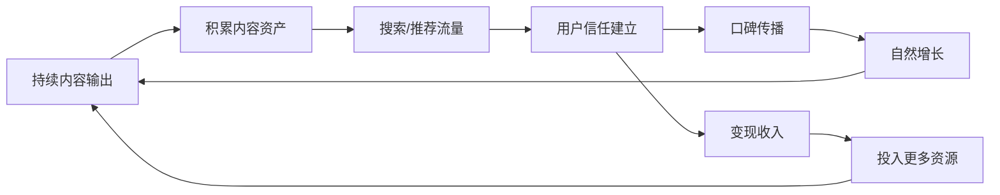
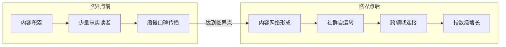
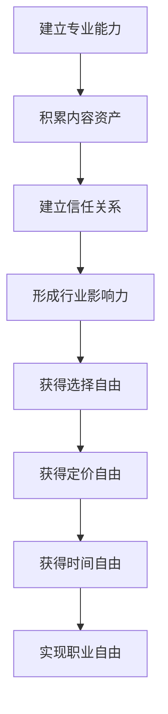

## 九、个人品牌的长期价值

个人品牌最本质的特征不是短期曝光，而是**随时间持续增值**。与流量红利、平台算法、热点话题这些转瞬即逝的变量不同，个人品牌一旦建立，就会形成一套自我强化的价值系统——越用越强，越久越值钱。

理解个人品牌的长期价值，不是为了给自己打鸡血，而是为了在"看不到回报"的漫长积累期里，拥有正确的预期和坚持的底气。本章从六个维度拆解个人品牌的长期价值机制，并给出可落地的策略框架。

---

### 9.1 复利效应：时间是最强大的杠杆

#### 9.1.1 复利的底层逻辑

复利不只是一个金融概念，它是所有"积累型资产"的通用增长模型。个人品牌的价值增长完全符合复利公式：

$$\text{品牌价值} = V_0 \times (1 + r)^t$$

其中：
- $V_0$ = 初始投入（内容质量 × 初始触达）
- $r$ = 增长率（口碑传播率 × 内容迭代能力）
- $t$ = 持续时间

关键洞察：**增长率 $r$ 的微小差异，在时间指数的放大下，会产生巨大的终值差距。** 假设两个人同时起步，A 的年增长率为 20%，B 为 30%，10 年后的品牌价值差距不是 10%，而是：

| 年份 | A（20%增长率） | B（30%增长率） | 差距倍数 |
|------|---------------|---------------|---------|
| 第1年 | 1.20 | 1.30 | 1.08× |
| 第3年 | 1.73 | 2.20 | 1.27× |
| 第5年 | 2.49 | 3.71 | 1.49× |
| 第10年 | 6.19 | 13.79 | 2.23× |

仅 10 个百分点的年增长率差异，10 年后就变成了 2.23 倍的终值差距。这就是为什么**内容质量的微小提升、传播效率的点滴优化**都值得持续投入。

#### 9.1.2 复利的三个阶段

个人品牌的复利效应并非均匀分布，而是呈现明显的阶段性特征：

**第一阶段：投入期（0-12个月）**

投入产出比极低，甚至为负。你可能写了几百篇文章、拍了几十个视频，但粉丝增长缓慢、变现几乎为零。这是 90% 的人放弃的阶段。

这个阶段的核心任务不是追求增长，而是：
- 找到自己的内容方向和风格定位
- 建立稳定的内容生产节奏
- 积累第一批种子用户（哪怕只有 100 人）

**第二阶段：加速期（1-3年）**

内容资产开始产生复利。早期的文章持续带来搜索流量，口碑传播开始形成，老粉丝带来新粉丝。增长曲线从线性转向指数。

这个阶段的关键动作：
- 将爆款内容体系化、产品化
- 建立社群，将流量转化为关系
- 开始测试变现模型

**第三阶段：飞轮期（3年以上）**

品牌形成自运转的飞轮：内容吸引流量 → 流量建立信任 → 信任产生变现 → 变现反哺内容 → 内容吸引更大流量。此时即使你短期停止输出，品牌价值也不会立刻归零，因为存量内容和信任关系仍在持续工作。

#### 9.1.3 加速复利的五个策略

1. **提高内容的"半衰期"**：优先创作常青内容（evergreen content），而非追热点。一篇"Python 入门指南"的生命周期可能是 3-5 年，而一条热点评论的生命周期只有 3-5 天。

2. **建立内容之间的链接网络**：每篇新内容都应该与旧内容产生关联，形成知识图谱。这不仅提升 SEO 权重，也让用户的浏览深度从 1 页变成 5-10 页。

3. **将内容转化为可复用的资产**：一系列文章可以整合为电子书，一个方法论可以开发为课程，一套工具可以开源为项目。资产的复用性越高，复利效应越强。

4. **培养"内容代理人"**：当你的观点足够深入，其他创作者会引用你、讨论你、反驳你——这些都是免费的品牌曝光，且不需要你投入任何时间。

5. **记录和复盘增长数据**：每月记录核心指标（搜索流量、粉丝增长、变现收入），用数据验证哪些内容产生了真正的复利，然后加倍投入。

---

### 9.2 护城河效应：不可复制的竞争壁垒

#### 9.2.1 为什么个人品牌是最强护城河

在商业世界里，护城河（moat）指的是竞争对手难以逾越的竞争优势。巴菲特提出的四大护城河——品牌、转换成本、网络效应、成本优势——在个人品牌领域全部适用，且更加坚固。

原因很简单：**个人品牌的护城河是"人"本身。** 企业品牌可以被抄袭，产品功能可以被模仿，但一个人的经历、人格、思维方式、社群关系，是绝对无法被复制的。

#### 9.2.2 个人品牌的六层护城河

从浅到深，个人品牌的护城河可以分为六个层次：

| 层次 | 护城河类型 | 可复制性 | 建设周期 | 防御强度 |
|------|-----------|---------|---------|---------|
| 第一层 | 内容资产 | 高（可洗稿） | 6-12个月 | ★☆☆☆☆ |
| 第二层 | 风格与辨识度 | 中（可模仿） | 1-2年 | ★★☆☆☆ |
| 第三层 | 信任关系 | 低（需时间） | 2-3年 | ★★★☆☆ |
| 第四层 | 专业方法论 | 极低（需积累） | 3-5年 | ★★★★☆ |
| 第五层 | 社群网络 | 极低（需经营） | 3-5年 | ★★★★☆ |
| 第六层 | 行业话语权 | 几乎不可能 | 5-10年 | ★★★★★ |

**关键认知：大多数人只停留在第一层，靠内容数量竞争。真正的护城河建设，是从第三层开始的。**

#### 9.2.3 深层护城河的建设方法

**信任关系的建设**

信任不是一句"我很专业"就能建立的。它需要四个要素同时满足：

1. **一致性**：你说的和你做的长期一致。如果你倡导极简生活，自己的生活方式却极度奢华，信任就会崩塌。
2. **透明度**：愿意分享失败和不足，而非只展示成功。一个敢于公开自己踩坑经历的人，比一个永远正确的人更值得信任。
3. **利他性**：持续为受众提供真实价值，而非只想着收割。免费内容的质量要高于很多人的付费内容。
4. **时间验证**：以上三点需要持续数年才能被验证。三年的持续输出，比三个月的爆发更有说服力。

**专业方法论的建设**

方法论是个人品牌最深的护城河之一。它不是"我知道很多知识"，而是"我有一套独特的解决问题的框架"。

- 提炼出你反复使用的思维模型
- 给你的方法论命名（如"番茄工作法""GTD"）
- 用案例证明方法论的可复现性
- 将方法论体系化为课程或书籍

**行业话语权的建设**

话语权是护城河的最高形式。当你在某个领域拥有话语权时，你的观点会成为行业共识的一部分，你的判断会影响其他人的决策。

- 在行业关键议题上持续发声
- 参与行业标准和规范的制定
- 成为媒体和机构的首选专家
- 培养下一代行业人才

---

### 9.3 网络效应：品牌价值的指数放大器

#### 9.3.1 网络效应的基本原理

网络效应（network effect）是指：一个产品或服务的价值随着用户数量的增加而增加。个人品牌同样存在网络效应，而且比产品网络效应更加深刻。

对于个人品牌，网络效应体现在三个层面：

**内容网络效应**

你的每一篇内容都不是孤立存在的，而是与之前的内容形成网络。当你的内容体系足够庞大和系统时，新用户会被"吸"进你的内容宇宙——从一篇文章进入，然后发现更多相关文章，最终成为长期关注者。

这意味着：你发布的第 100 篇文章的价值，不仅取决于它自身的质量，还取决于前 99 篇文章形成的网络密度。

**关系网络效应**

你的粉丝之间会形成社群关系。当你的社群中，粉丝之间开始互相帮助、互相连接时，社群的价值就不再仅仅依赖于你个人——它成为了自我运转的价值网络。你既是网络的中心节点，也是网络价值的最大受益者。

**推荐网络效应**

当你在某个领域建立了足够强的品牌，其他领域的品牌会主动寻求合作。这种跨领域的连接会带来全新的受众群体，形成"强者愈强"的正反馈。

#### 9.3.2 网络效应的临界点

网络效应存在一个关键的临界点——在此之前，网络的价值增长缓慢；在此之后，网络的价值呈爆发式增长。

如何判断是否到达临界点：
- 搜索流量占比超过 50%（说明内容资产开始自主工作）
- 自然增长的粉丝数超过主动推广带来的粉丝数
- 有陌生人主动在其他平台讨论你的内容
- 开始收到未主动联系过的合作邀请

#### 9.3.3 强化网络效应的实操策略

1. **建立内容间的双向链接**：不只是新文章引用旧文章，还要回头更新旧文章，加入新文章的链接。这让搜索引擎和用户都能在你的内容网络中深度漫游。

2. **创建社群而非仅仅"粉丝群"**：粉丝群以你为中心，社群以价值交换为中心。鼓励成员之间互相连接、分享经验，你提供平台和规则。

3. **设计"用户生成内容"（UGC）机制**：让受众参与到你的内容创作中——提问、投稿、案例分享、经验交流。这不仅减轻你的创作压力，还让受众变成品牌的共建者。

4. **跨平台布局但保持一致**：在不同平台触达不同人群，但核心信息和价值观保持一致。当一个用户在多个平台都看到你时，信任建立的速度会大幅加快。

---

### 9.4 多元变现：收入结构的长期优化

#### 9.4.1 变现层次模型

个人品牌的变现不是一步到位的，而是随着品牌成熟度的提升逐步解锁：

| 品牌阶段 | 变现方式 | 收入特征 | 依赖程度 |
|---------|---------|---------|---------|
| 起步期 | 平台补贴、小额打赏 | 不稳定，金额小 | 高度依赖平台 |
| 成长期 | 广告合作、带货 | 中等，有波动 | 依赖广告主 |
| 成熟期 | 课程、咨询、社群 | 稳定，利润率高 | 依赖自身产品 |
| 飞轮期 | IP授权、投资、生态 | 被动收入为主 | 系统自运转 |

#### 9.4.2 六大变现通道详解

**通道一：知识付费**

知识付费是个人品牌最自然的变现方式。它的核心逻辑是：你通过免费内容证明了自己的专业能力，用户愿意为更系统、更深入的付费内容买单。

知识付费的三种形态：
- **课程**：结构化的知识传递，适合标准化内容。录播课程的边际成本几乎为零，是性价比最高的变现方式。
- **咨询**：一对一或一对多的个性化服务，适合高价值、高定制化的内容。客单价高，但时间成本也高。
- **社群**：持续性的价值交付，包括内容、讨论、资源对接。社群的关键是"持续交付价值"，而非"收完会员费就不管了"。

**通道二：广告与代言**

当你的受众足够精准、信任度足够高时，广告合作的价值不仅体现在曝光量，更体现在转化率。一个拥有 10 万精准粉丝的博主，其广告转化率可能超过拥有 100 万泛粉丝的博主。

**通道三：电商与带货**

电商带货的本质是"信任变现"——用户因为信任你，所以信任你推荐的商品。但这里有一个关键红线：**永远不要推荐你自己不会用的东西。** 一次烂推荐可能毁掉几年积累的信任。

**通道四：演讲与出版**

线下演讲和图书出版不仅带来直接收入，更重要的是提升品牌的专业权威性。一场高质量的行业演讲，可能比一百篇文章更能建立行业话语权。

**通道五：投资与合作**

当品牌影响力达到一定级别，你可以用品牌入股、联名合作、战略投资等方式参与更有价值的商业项目。此时你的品牌本身就是一种"资本"。

**通道六：职业溢价**

即使你不走创业路线，个人品牌也能在职场中产生巨大价值：更高的薪资谈判筹码、更多的猎头关注、更快的晋升速度、更好的人脉资源。

#### 9.4.3 变现的长期策略

**不要过早变现。** 在品牌价值还没有充分建立时就急于变现，是最常见的品牌损伤行为。用户会觉得你"从分享者变成了推销员"，信任感会急剧下降。

正确的做法是：
1. 先用 6-12 个月建立内容信任
2. 从最小、最自然的变现方式开始（如小额打赏）
3. 逐步测试不同变现模型，观察用户反馈
4. 将验证成功的模型系统化、规模化
5. 始终保持免费内容的质量和数量，确保核心价值不打折

---

### 9.5 人生资产：穿越周期的底层竞争力

#### 9.5.1 个人品牌与其他资产的对比

| 资产类型 | 是否可带走 | 是否抗通胀 | 是否随时间增值 | 是否受经济周期影响 |
|---------|-----------|-----------|-------------|----------------|
| 房产 | ✗ | 部分 | 看地段 | 大 |
| 股票 | ✓ | 部分 | 看标的 | 大 |
| 存款 | ✓ | ✗ | ✗ | 中 |
| 技能 | ✓ | ✓ | 看领域 | 中 |
| 人脉 | 部分 | ✓ | ✓ | 小 |
| **个人品牌** | **✓** | **✓** | **✓** | **小** |

个人品牌是少数同时满足"可携带、抗贬值、随时间增值"三个条件的资产。你换城市、换行业、换工作，你的个人品牌都会跟着你——它不是挂在某个公司名下的附属品，而是属于你自己的核心资产。

#### 9.5.2 个人品牌的抗周期能力

在经济下行期，个人品牌的抗周期能力尤为突出：

- **裁员潮中**：拥有个人品牌的人更容易找到新机会，甚至被猎头主动联系
- **行业衰退时**：个人品牌可以帮你跨行业迁移，因为你的影响力不局限于单一领域
- **创业失败后**：个人品牌是"最后的安全网"，让你有机会东山再起
- **年龄焦虑时**：个人品牌是"越老越值钱"的少数资产之一，经验和口碑会随年龄增长

#### 9.5.3 人生资产的代际传递

个人品牌的终极形态，是超越个人生命周期的价值传递。这听起来可能有些远大，但确实有一些具体的表现：

- 你的方法论和思想体系可以被后人学习和传承
- 你建立的社群可以持续运转，即使你不再直接参与
- 你的品牌名称和标识可以成为一种"文化符号"
- 你的学生和追随者会延续你的理念和影响力

这并非空想——想想那些已经去世但影响力依然巨大的人物：德鲁克的管理思想、稻盛和夫的经营哲学、查理·芒格的投资智慧。他们的"个人品牌"早已超越了个人，成为一种持久的知识资产。

---

### 9.6 职业自由：最终极的长期回报

#### 9.6.1 什么是职业自由

职业自由是个人品牌长期价值的最高体现，它包含三个层次：

1. **选择自由**：你可以选择做什么工作、和谁合作、在哪里工作，而不是被迫接受。
2. **定价自由**：你不再按照市场平均水平定价，而是按照你提供的独特价值定价。
3. **时间自由**：你的收入不再与工作时间严格挂钩，而是与品牌价值挂钩。

#### 9.6.2 职业自由的实现路径

每个阶段的典型表现：

**选择自由**的标志：你开始拒绝不合适的合作邀请，而不是求着别人给你机会。

**定价自由**的标志：你的报价高于市场平均水平，但客户仍然觉得值得。

**时间自由**的标志：你可以在不工作的时候，收入仍然在增长（被动收入 > 主动收入）。

#### 9.6.3 保持长期价值的五个习惯

个人品牌的长期价值不是一劳永逸的。它需要持续维护和更新。以下是五个必须养成的习惯：

1. **每周至少输出一次高质量内容**：保持品牌的"心跳"。即使频率降低，质量也不能降低。
2. **每季度更新一次个人定位**：行业在变、受众在变、你自己也在变，定位需要定期校准。
3. **每年学习一个新领域的知识**：跨界知识是个人品牌差异化的最大来源。
4. **维护核心社群关系**：定期与核心粉丝、合作伙伴、行业同行保持互动。
5. **定期复盘品牌数据**：关注搜索排名、流量趋势、用户反馈，用数据指导优化方向。

---

### 9.7 常见误区：那些损害长期价值的短视行为

#### 误区一：追求粉丝数量而非质量

10 万泛粉丝 < 1 万精准粉丝。泛粉丝不会买你的产品、不会传播你的内容、不会成为你的社群成员。精准粉丝才是品牌价值的真正基础。

**纠正方法**：用"目标受众画像"指导内容创作，宁可小众精准，不要大众模糊。

#### 误区二：追热点丢失品牌调性

为了蹭流量而频繁发布与品牌定位无关的热点内容，会让核心受众感到困惑："这个人到底是干什么的？"

**纠正方法**：热点可以追，但必须与你的品牌定位相关。如果无法找到关联角度，宁可不追。

#### 误区三：过早过度变现

在信任没有充分建立时就密集推销产品，是品牌信任崩塌的最快方式。

**纠正方法**：遵循"80/20 法则"——80% 的内容提供纯价值，20% 的内容涉及变现。

#### 误区四：忽视存量内容维护

发布后就不管的内容，会随着时间推移变得过时、错误，反而损害品牌信誉。

**纠正方法**：每季度对存量内容进行一次审查，更新过时信息，删除已无价值的内容。

#### 误区五：缺乏一致性

频繁更换内容方向、风格调性、发布平台，会让受众无所适从。个人品牌的核心就是"一致性"——受众需要知道他们能从你这里持续获得什么。

**纠正方法**：在起步阶段就确定好"品牌承诺"（我为谁提供什么价值），然后至少坚持一年不变。

---

### 9.8 长期价值评估框架

如何量化评估你的个人品牌的长期价值？以下是一个可操作的评估框架：

| 评估维度 | 指标 | 数据来源 | 健康基准 |
|---------|------|---------|---------|
| 内容资产 | 存量内容数、搜索排名 | Google Analytics、平台后台 | 持续增长，TOP10 关键词≥20个 |
| 信任度 | 复购率、推荐率、好评率 | 社群数据、课程数据 | 复购率≥30%，推荐率≥20% |
| 影响力 | 被引用次数、合作邀请数 | 搜索监测、邮件统计 | 月均≥3次非主动合作邀请 |
| 变现能力 | 月收入、客单价、收入来源数 | 财务记录 | 被动收入占比逐步提升 |
| 网络效应 | 社群活跃度、UGC 内容量 | 社群后台 | 成员自发内容≥20% |
| 抗风险能力 | 平台依赖度、收入集中度 | 平台数据、财务记录 | 单一平台依赖度<50% |

每半年用这个框架做一次全面评估，找出薄弱环节，制定改进计划。

---

### 本章小结

个人品牌的长期价值体现在六个维度：

1. **复利效应**——时间放大微小的持续投入，产生巨大的终值回报
2. **护城河效应**——从内容资产到行业话语权，层层递进的竞争壁垒
3. **网络效应**——内容网络、关系网络、推荐网络的指数级放大
4. **多元变现**——从平台补贴到生态系统的收入结构升级
5. **人生资产**——穿越周期、可携带、抗贬值的核心竞争力
6. **职业自由**——选择自由、定价自由、时间自由的终极回报

记住：**个人品牌不是一条路，而是一条河。** 它的价值不在于某一个时间点的水位，而在于它持续流动、持续汇聚、持续生长的能力。耐心建设，时间会给你最好的回报。
