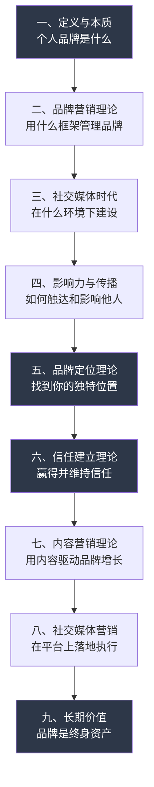
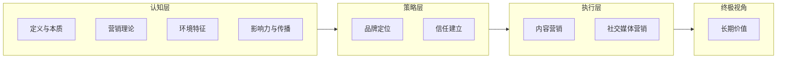

## 本节小结

基础理论是个人品牌建设的地基。没有理论指导的实践是盲目的——你可能投入大量时间精力，却因为方向错误而事倍功半。本节用九个章节构建了个人品牌的完整认知框架，下面将核心内容提炼为可操作的知识地图，并帮助你建立从理论到实践的桥梁。

### 知识体系全景图

九个章节并非孤立存在，它们构成了一个层层递进的逻辑链：

这个链条回答了九个核心问题：

| 序号 | 核心问题 | 关键概念 |
|------|----------|----------|
| 一 | 个人品牌到底是什么？ | 信任货币、冰山模型、价值等式 |
| 二 | 用什么理论框架来管理品牌？ | 品牌资产五维度、品牌故事、SWOT、品牌原型 |
| 三 | 当前环境有什么特点？ | 注意力经济、平台矩阵、算法机制 |
| 四 | 如何触达并影响他人？ | 影响力五层次、西奥迪尼六原则、网络效应 |
| 五 | 如何找到自己的独特位置？ | 定位声明、七种定位策略、个人品牌画布 |
| 六 | 如何赢得并维持信任？ | 信任三层模型、信任公式、信任修复五步法 |
| 七 | 用什么方式持续输出价值？ | 内容漏斗、内容支柱、常青内容与热点内容 |
| 八 | 如何在平台上落地执行？ | 私域流量、社群运营、社交媒体战略框架 |
| 九 | 长期来看品牌值什么？ | 复利效应、护城河、多元变现、人生资产 |

### 九章核心要点提炼

#### 第一章：个人品牌的定义与本质

个人品牌不是你对自己的描述，而是你在他人心中留下的"印象总和"。它具备三层属性：他人认知的产物（而非自我认知）、多维度的立体画像（而非单一标签）、动态演变的活体（而非固定标签）。

品牌由七个要素构成：核心价值观（地基）、专业能力（硬核）、价值主张（承诺）、个性特点（辨识度）、视觉识别（外衣）、内容输出（载体）、社交证明与网络关系（放大器）。冰山模型揭示了一个关键事实——水面上的可见部分（外在形象、公开内容）仅占品牌的一小部分，水面下的价值观、专业积累、人格特质才是决定性力量。

理解这些，你就不会把个人品牌等同于"包装自己"或"自我营销"。品牌的本质是信任货币——你能为他人解决多大的问题、提供多大的价值，你的品牌就有多大的"购买力"。

#### 第二章：品牌营销理论

品牌管理需要科学框架而非凭感觉行事。本章提供了四套核心工具：

**品牌资产五维度**（知名度、品质感知、联想度、忠诚度、其他专属资产）让你能量化评估自己品牌的健康程度。**品牌故事**不是编造传奇经历，而是用"冲突→转变→结果"的结构，将你的真实经历转化为引发共鸣的叙事。**SWOT分析**帮你清醒地认识自身优劣势和外部机会威胁，避免在定位时犯"自嗨"的错误。**品牌原型理论**（12种原型，如英雄、智者、创造者等）提供了选择品牌人格的参考系——你的原型决定了你的语言风格、视觉调性和受众预期。

此外，4P（产品、价格、渠道、促销）和4C（顾客、成本、便利、沟通）理论帮助你从不同角度审视品牌策略，整合营销传播（IMC）确保你在所有触点传递一致的品牌信息。

#### 第三章：社交媒体时代的特点

当前环境有三个核心特征：注意力是最稀缺的资源、算法决定了内容的生死、多平台协同是标配而非选择。

本章深度分析了微信公众号、小红书、抖音、B站、知乎、微博、LinkedIn、播客八大平台的用户画像、内容偏好、算法逻辑和变现路径。平台选择的核心原则是"你的目标受众在哪里，你就去哪里"，而非追逐流量最大的平台。多平台运营的关键是"内容中台"策略——一次创作核心内容，然后根据不同平台的特点进行适配分发。

理解算法机制（协同过滤、内容标签、用户画像、冷启动机制）是必修课。算法不是敌人，而是你的分发杠杆。算法友好的内容创作原则：高完播率、高互动率、高分享率、持续更新。

#### 第四章：影响力的本质与传播

影响力不是粉丝数量，而是"让他人因你而行动的能力"。影响力分五个层次递进：认知层（让人知道你）→ 情感层（让人喜欢你）→ 行动层（让人因你而行动）→ 忠诚层（让人持续追随你）→ 权威层（让行业认可你）。每一层都需要不同的策略和时间投入。

西奥迪尼的六原则（互惠、承诺与一致性、社会认同、喜好、权威、稀缺）是影响力操作的实用工具箱。传播机制方面，关键在于让内容具备"社交货币"属性——人们分享内容的本质是在管理自己的社交形象，如果你的内容能帮助他们做到这一点，传播就是自然的结果。

#### 第五章：品牌定位理论

定位的本质是在目标受众的心智中占据一个独特且有价值的位置。定位不是你说了算，而是受众的认知说了算。定位五步法：自我深度分析 → 市场环境扫描 → 找到定位交叉点 → 制定定位声明 → 最小化验证。

七种定位策略（差异化、细分、跨界、人格、经历、价值观、方法论）提供了不同的切入角度。个人品牌画布是将定位可视化的实用工具，它将品牌的核心要素（目标受众、价值主张、关键活动、渠道、收入来源等）整合在一张画布上，确保你的定位经得起推敲。

定位的常见陷阱：贪大求全（什么都想做 = 什么都不是）、追热点漂移（今天AI明天养生）、只看自己不看市场、有定位无验证。

#### 第六章：信任建立理论

信任是个人品牌的核心货币。信任的三层模型：能力信任（你能解决问题吗）、意图信任（你的动机是好的吗）、品格信任（你是诚实一致的人吗）。信任公式：信任 =（专业度 + 可靠度 + 亲密度）÷ 自私度。分母是自私度——越以自我为中心，信任越低。

信任建立的四个阶段：计算型信任（基于利益得失）→ 知识型信任（基于了解和预测）→ 认同型信任（基于价值观共鸣）→ 建立型信任（无条件信任）。从计算到认同，通常需要6-18个月的持续投入。

信任修复比建立更难。五步法：承认问题 → 承担责任 → 解释原因（非借口）→ 提出补救方案 → 用行动证明改变。数字时代的信任信号清单（一致性、透明度、回应速度、社会证明、专业背书）是你日常自检的工具。

#### 第七章：内容营销理论

内容营销的核心理念是"先给予，再获取"——与传统广告的"打断"不同，内容营销通过提供价值来"吸引"目标受众。内容漏斗模型将内容分为三层：顶部（认知层，广覆盖）、中部（考虑层，建信任）、底部（转化层，促行动），不同类型的内容服务于漏斗的不同阶段。

内容支柱是你持续输出的3-5个核心主题，它们与品牌定位直接挂钩。常青内容（长期有价值）与热点内容（短期高关注）的合理比例建议为7:3。内容复用是效率的关键杠杆——一份核心内容适配为公众号长文、小红书图文、短视频、播客、社群分享等多种格式。

#### 第八章：社交媒体营销理论

社交媒体营销的本质是双向互动（而非单向传播）、即时响应（而非定时发布）、社区构建（而非粉丝积累）。完整的社交媒体营销战略包含六个要素：目标设定、受众研究、内容策略、互动策略、投放策略、分析优化。

私域流量是可以自主控制、反复触达、免费使用的流量。微信个人号、微信群、邮件列表、付费社群是个人品牌的核心私域阵地。社群运营的核心不是"管理"而是"服务"——价值优先、规则清晰、参与感、仪式感、淘汰机制是社群健康的五大支柱。

#### 第九章：个人品牌的长期价值

个人品牌遵循复利增长模型：**品牌价值 = 初始投入 × (1 + 增长率)^时间**。前期增长缓慢是正常的，关键在于坚持。护城河效应意味着品牌一旦建立，竞争对手无法复制你的人格、经历和信任关系。变现路径包括知识付费、广告代言、电商带货、演讲出版、投资合作、职业晋升等多元渠道。

最重要的一点：个人品牌是"人生资产"——它不会因经济波动贬值，反而随时间增值；它跟随你跨越工作、行业和城市的变化，是你最可靠的长期竞争力。

### 九章之间的内在逻辑

这九章不是简单的并列关系，而是形成了三个层次：

**认知层（第一至四章）**：解决"是什么"和"为什么"的问题。你需要先理解个人品牌的本质、掌握营销理论框架、认识当前环境特征、搞清楚影响力如何运作，才能做出正确的战略判断。

**策略层（第五至六章）**：解决"在哪里"和"凭什么"的问题。定位决定了你的战场，信任决定了你的根基。这两个是个人品牌的战略支点——定位错误则一切白费，信任缺失则无法持续。

**执行层（第七至八章）**：解决"怎么做"的问题。内容是品牌的载体，社交媒体是品牌的阵地。有了前面的认知和策略基础，执行才有方向。

**终极视角（第九章）**：解决"值不值得"的问题。复利、护城河、多元变现、人生资产——这些长期价值是你坚持投入的动力来源。

### 理论自检清单

在进入实践环节之前，用以下清单检验自己对理论的掌握程度。每个问题如果回答"不确定"，建议回看对应章节：

| 检查项 | 对应章节 | 自检问题 |
|--------|----------|----------|
| 品牌认知 | 第一章 | 我能否用一句话说清楚自己的品牌是什么？ |
| 营销框架 | 第二章 | 我是否做过SWOT分析并选定了品牌原型？ |
| 环境认知 | 第三章 | 我是否知道目标受众主要在哪个平台活跃？ |
| 影响力层级 | 第四章 | 我目前处于影响力五层次的哪一层？ |
| 品牌定位 | 第五章 | 我能否写出一句清晰的定位声明？ |
| 信任评估 | 第六章 | 用信任公式评估，我的分母（自私度）是否过高？ |
| 内容策略 | 第七章 | 我是否确定了3-5个内容支柱？ |
| 平台策略 | 第八章 | 我的私域流量池是什么？如何引导公域用户进入私域？ |
| 长期视角 | 第九章 | 我是否接受"前6个月可能看不到明显回报"的现实？ |

### 从理论到实践的桥梁

理论的价值在于指导实践。以下是将本节内容转化为行动的核心原则：

**不要跳过定位直接做内容**。很多人一上来就注册账号、开始发帖，结果内容杂乱无章，受众记不住你是谁。正确的顺序是：先搞清楚自己要服务谁、提供什么独特价值（第五章定位），再规划内容策略（第七章内容营销）。

**不要追求粉丝数量而忽视信任质量**。1000个真正信任你的粉丝，比10万个对你无感的粉丝有价值得多。信任是变现的前提，没有信任的流量只是数字（第六章信任理论）。

**不要在所有平台上均匀用力**。选择1-2个核心平台深耕，再用2-3个辅助平台做分发。核心平台要投入80%的精力，辅助平台用内容复用策略覆盖（第三章平台分析、第七章内容复用）。

**不要期望速成**。个人品牌的复利曲线意味着前6-12个月是"积累期"，你可能看不到明显的回报。但只要方向正确、内容持续，品牌价值会在某个临界点突然加速增长（第九章复利效应）。

**不要忽视私域建设**。公域流量是租来的，私域流量才是自己的。从第一天起就要有意识地将公域用户引导到私域（第八章私域流量）。

在下一节中，我们将把这些理论应用到实践中，为你提供完整的个人品牌建设方案——从定位到内容，从平台到变现，从0到1的完整路线图。

***
