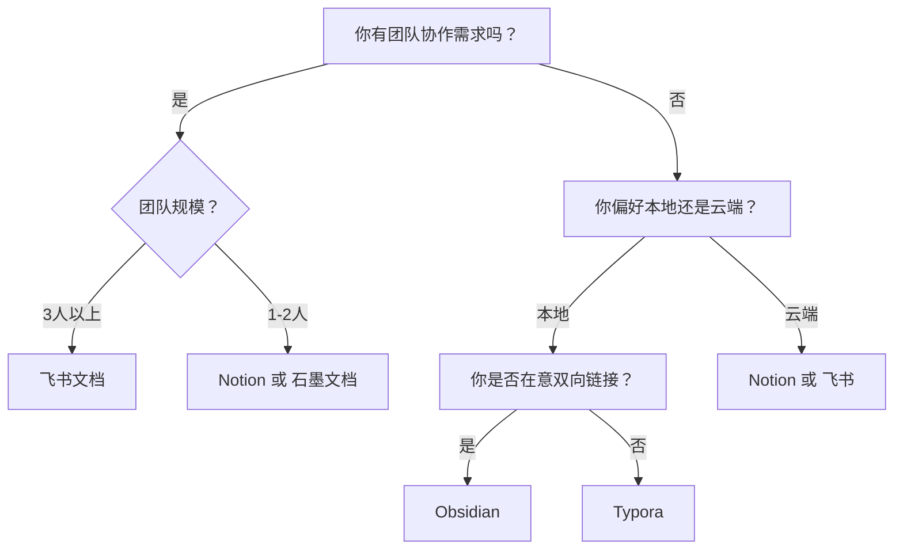
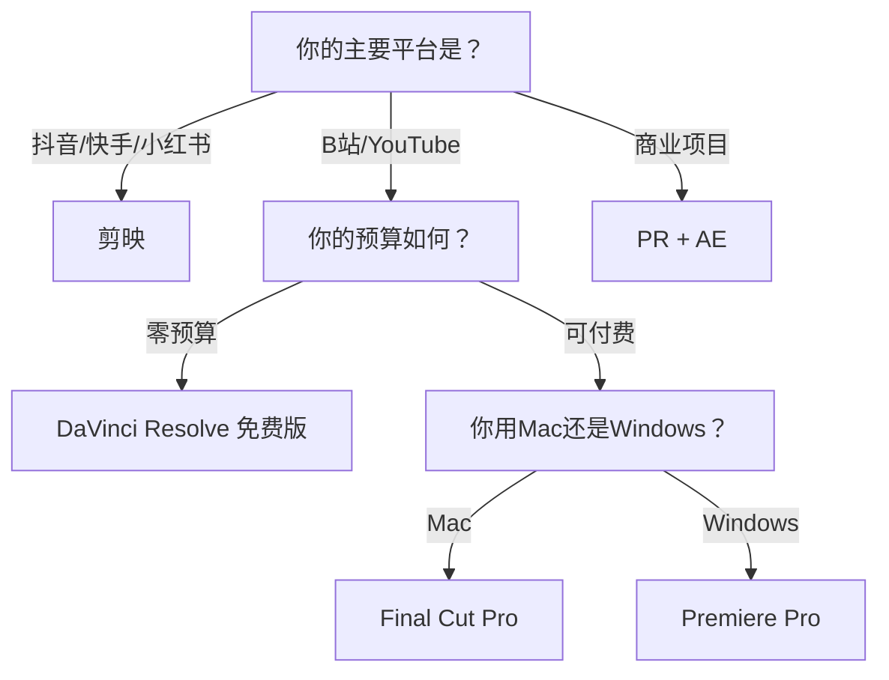
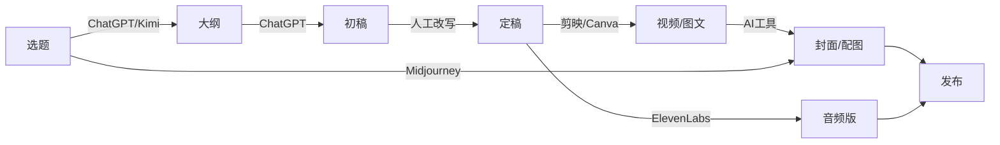

## 一、内容创作工具

内容创作是个人品牌的核心生产力。选择合适的工具，不是追求"最贵"或"最专业"，而是找到**与你的创作流程、技术能力和预算最匹配**的组合。本节按照内容形态分类，从写作、视频、图片、音频、AI辅助五个维度，给出详细的工具对比和选型建议。

### 1.1 写作工具

写作是所有内容创作的基础能力。无论是公众号长文、小红书笔记、知识星球分享还是视频脚本，背后都是文字功底。选择写作工具时，核心考量三个维度：**协作需求、内容管理、输出格式**。

#### 1.1.1 在线协作文档

**飞书文档**

| 维度 | 说明 |
|------|------|
| 核心优势 | 实时协作、多维表格、思维导图、项目管理一体化 |
| 适合场景 | 团队协作写作、内容日历管理、长文创作与审校 |
| 价格 | 个人版免费，企业版按人头收费 |
| 平台 | Web + 桌面客户端 + 移动端 |

飞书文档的最大优势在于它不只是一个文档工具，而是一个**协作中枢**。你可以用多维表格管理内容日历，用思维导图梳理选题框架，用评论和@功能实现团队审校流程。对于个人品牌创作者来说，即使是一个人运营，飞书的免费版也足够支撑日常写作和内容规划。

实操建议：建立一个"内容工厂"文件夹结构——「选题池 → 初稿 → 审校 → 已发布」，用多维表格跟踪每篇内容的状态、发布平台、数据表现。

**Notion**

| 维度 | 说明 |
|------|------|
| 核心优势 | All-in-one工作空间、数据库驱动、模板生态丰富 |
| 适合场景 | 个人知识库建设、内容规划、写作与素材管理 |
| 价格 | 个人版免费（限制文件上传5MB），Plus版约70元/月 |
| 平台 | Web + 桌面客户端 + 移动端 |

Notion的核心哲学是**模块化**——每一篇文档都是一个可以嵌套、关联、筛选的数据库条目。你可以建立一个"内容管理系统"：每篇文章是一个数据库条目，关联选题来源、目标平台、关键词、状态等字段，通过不同视图（看板、日历、画廊）管理整个创作流程。

实操建议：先从Notion官方模板库中的"Content Calendar"模板开始，逐步根据自己的工作流调整字段和视图。用Database的Relation功能将文章与素材库关联，避免重复整理。

**石墨文档**

| 维度 | 说明 |
|------|------|
| 核心优势 | 纯国产、稳定、对中文排版支持好 |
| 适合场景 | 日常写作、轻量协作、与国内生态对接 |
| 价格 | 基础版免费，高级版约100元/年 |
| 平台 | Web + 微信小程序 + 移动端 |

石墨文档的优势在于**轻量和稳定**。它没有Notion那么复杂的学习曲线，也没有飞书那么多功能，但作为纯写作工具，它做得很扎实。微信小程序的支持也让你在手机上可以快速记录灵感。

#### 1.1.2 Markdown编辑器

**Typora**

| 维度 | 说明 |
|------|------|
| 核心优势 | 所见即所得的Markdown体验、极简界面、支持多种导出格式 |
| 适合场景 | 专注写作、博客文章撰写、技术文档 |
| 价格 | 约90元（一次性购买，含终身更新） |
| 平台 | Windows / macOS / Linux |

Typora解决了一个Markdown编辑器的核心痛点：**实时预览**。你不需要左右分屏，也不需要切换模式，打字的同时就能看到最终排版效果。它支持数学公式（LaTeX）、代码高亮、表格、流程图（Mermaid），并且可以一键导出为PDF、HTML、Word等格式。

实操建议：配合Pandoc使用，Typora + Pandoc可以实现从Markdown到任意格式的转换，是知识管理的利器。

**Obsidian**

| 维度 | 说明 |
|------|------|
| 核心优势 | 双向链接、本地存储、插件生态丰富 |
| 适合场景 | 长期知识积累、第二大脑建设、写作素材管理 |
| 价格 | 个人版免费，Sync版约80元/月（可用iCloud/坚果云替代） |
| 平台 | Windows / macOS / Linux / iOS / Android |

Obsidian不仅仅是一个Markdown编辑器，它是一个**知识网络工具**。通过双向链接（`[[文章名]]`），你可以将零散的笔记编织成知识网络。对于个人品牌创作者，这意味着你可以建立一个"素材库"——每看到一个好案例、好金句、好数据，随手记一条笔记并打上标签，写文章时通过反向链接和图谱视图快速找到关联素材。

实操建议：建立三个核心Vault——「素材库」（案例、数据、金句）、「作品库」（已发布内容的存档）、「项目库」（在创作的内容）。用Dataview插件自动生成素材索引。

**VS Code + Markdown插件**

| 维度 | 说明 |
|------|------|
| 核心优势 | 免费、扩展性强、适合技术型创作者 |
| 适合场景 | 技术博客、开源文档、配合Git进行版本管理 |
| 价格 | 免费 |
| 平台 | Windows / macOS / Linux |

如果你本身是开发者或习惯用VS Code，它完全可以成为你的写作工具。安装Markdown All in One、Markdown Preview Enhanced等插件，配合Git做版本管理，可以直接推送文章到GitHub Pages或Hugo博客。

#### 1.1.3 写作工具选型决策

### 1.2 视频创作工具

视频是当前内容传播的主流形态。根据你的平台目标、内容类型和技术水平，选择完全不同层级的工具。

#### 1.2.1 新手友好型

**剪映**

| 维度 | 说明 |
|------|------|
| 核心优势 | 免费、模板丰富、AI功能强大（自动字幕、智能抠图） |
| 适合场景 | 抖音/快手/小红书短视频、口播视频、Vlog |
| 价格 | 免费（部分高级素材付费） |
| 平台 | 手机端 + 桌面端 + Web |

剪映是目前国内**用户量最大的视频编辑工具**，背靠抖音生态，它的模板库和音乐库直接对接了最流行的内容形式。核心优势在于：

- **AI自动字幕**：识别准确率95%以上，支持多种字幕样式
- **智能抠图**：一键去除背景，适合绿幕或纯色背景的口播
- **模板系统**：选择模板→替换素材→导出，3分钟出一条视频
- **图文成片**：输入文字自动生成视频，适合知识类内容

实操建议：先用模板快速出内容，同时学习基础的剪辑逻辑（镜头语言、节奏感、转场），等积累了50条以上视频经验后，再考虑升级工具。

**万兴喵影（Filmora）**

| 维度 | 说明 |
|------|------|
| 核心优势 | 操作简单、效果丰富、性价比高 |
| 适合场景 | 从新手向进阶过渡、个人品牌宣传视频 |
| 价格 | 约300元/年（常有终身版促销约500元） |
| 平台 | Windows / macOS |

万兴喵影定位在"比剪映专业，比PR简单"的中间地带。它的优势在于丰富的转场效果、文字动画和滤镜，适合制作**有质感但不需要极端精细**的视频。对于个人品牌建设来说，这个层级的工具已经足够。

#### 1.2.2 专业级

**Adobe Premiere Pro（PR）**

| 维度 | 说明 |
|------|------|
| 核心优势 | 行业标准、功能最全面、与Adobe全家桶联动 |
| 适合场景 | 高质量长视频、B站/YouTube内容、商业级项目 |
| 价格 | 约200元/月（单独订阅），全套约400元/月 |
| 平台 | Windows / macOS |

PR是影视行业的**事实标准**。它的优势不仅仅是功能强大，更在于与After Effects（特效）、Photoshop（图片处理）、Audition（音频处理）的无缝联动。如果你的内容需要复杂的时间线操作（多机位剪辑、嵌套序列、动态链接AE），PR是唯一选择。

核心工作流：素材管理（Media Browser）→ 粗剪（Source Monitor + Timeline）→ 精剪（Razor + Ripple Edit）→ 调色（Lumetri）→ 音频（Essential Sound）→ 导出（Media Encoder）。

学习曲线提醒：PR的学习曲线较陡，建议通过B站的"PR零基础到精通"系列课程系统学习，大约需要40-60小时才能熟练掌握核心功能。

**DaVinci Resolve（达芬奇）**

| 维度 | 说明 |
|------|------|
| 核心优势 | 调色功能业界最强、免费版功能已经非常完整 |
| 适合场景 | 对画面质感要求高的内容、电影级调色 |
| 价格 | 免费版完整可用，Studio版一次性约2500元 |
| 平台 | Windows / macOS / Linux |

DaVinci Resolve的调色系统是好莱坞电影工业的标准工具。对于个人品牌创作者，它的免费版已经包含了完整的剪辑（Edit）、调色（Color）、音频处理（Fairlight）、特效（Fusion）四个模块。如果你对视频的**画面质感**有追求（比如想要电影感的色调），达芬奇是最佳选择。

实操建议：从"Edit"页面开始学习，不要一开始就跳进"Color"页面的复杂调色系统。先用它作为剪辑工具，再逐步学习调色。

**Final Cut Pro**

| 维度 | 说明 |
|------|------|
| 核心优势 | Mac平台性能优化最佳、磁性时间线、一次买断 |
| 适合场景 | Mac用户的高质量视频创作 |
| 价格 | 约1998元（一次性购买，含后续更新） |
| 平台 | macOS 专属 |

Final Cut Pro的核心优势在于**与Apple硬件的深度整合**——利用Apple Silicon的神经引擎加速渲染，M系列芯片的MacBook Pro导出速度可以比PR快2-3倍。磁性时间线的设计也避免了PR中常见的轨道冲突问题。

#### 1.2.3 视频工具选型决策

**工具不是决定内容质量的关键因素**。B站大量百万粉UP主用剪映就能产出优质内容。先把内容做出来，再根据需要升级工具。

### 1.3 图片设计工具

个人品牌的视觉呈现，从封面图到社交媒体帖子，都离不开图片设计工具。

#### 1.3.1 在线设计平台

**Canva**

| 维度 | 说明 |
|------|------|
| 核心优势 | 模板海量（超过100万）、操作零门槛、支持团队协作 |
| 适合场景 | 社交媒体配图、公众号封面、简历、海报、PPT |
| 价格 | 免费版可用，Pro版约90元/年 |
| 平台 | Web + 移动端 + 桌面端 |

Canva是全球**月活超1.7亿**的在线设计平台。它的核心逻辑是"模板驱动设计"——选择模板→替换文字和图片→下载，即使完全没有设计基础，5分钟内也能产出专业级的视觉内容。

核心功能详解：
- **Brand Kit**（品牌套件）：一次性设置品牌色、Logo、字体，所有设计自动统一风格
- **Magic Resize**：一键将设计适配不同平台尺寸（公众号封面→小红书→抖音）
- **Content Planner**：内置社交媒体排期功能，设计完直接发布
- **AI功能**：Magic Write（AI文案）、Magic Eraser（智能擦除）、Text to Image（AI生成图片）

实操建议：Pro版的价值主要在于Brand Kit和Magic Resize，如果你运营3个以上平台，这个功能非常值得。

**稿定设计**

| 维度 | 说明 |
|------|------|
| 核心优势 | 中文模板最丰富、对国内平台尺寸适配最好 |
| 适合场景 | 中文社交媒体图片、电商主图、公众号排版 |
| 价格 | 免费版可用，会员约200元/年 |
| 平台 | Web + 移动端 |

如果Canva是全球设计工具的标杆，稿定设计就是**中文设计场景的优选**。它的模板库针对小红书、微信公众号、淘宝、抖音等国内平台做了专门优化，中文排版、中文字体的支持也比Canva更到位。

#### 1.3.2 专业设计软件

**Figma**

| 维度 | 说明 |
|------|------|
| 核心优势 | 协作能力强、组件化设计、社区资源丰富 |
| 适合场景 | UI/UX设计、品牌视觉系统搭建、高保真原型 |
| 价格 | 免费版可创建3个项目，Professional版约100元/月 |
| 平台 | Web（基于浏览器）+ 桌面客户端 |

Figma的专业性在于它的**组件系统和Auto Layout**。你可以创建一套品牌设计组件（按钮、卡片、文字样式），修改组件后所有引用处自动更新。如果你的个人品牌需要搭建一个完整的视觉体系（网站、PPT、社交媒体模板的统一风格），Figma是最佳工具。

**Adobe Photoshop**

| 维度 | 说明 |
|------|------|
| 核心优势 | 功能最全面、行业标准、插件生态最丰富 |
| 适合场景 | 精细图片处理、合成、修图、复杂视觉设计 |
| 价格 | 约200元/月 |
| 平台 | Windows / macOS |

Photoshop的功能深度远超日常设计需求。对于个人品牌创作者，最常用的功能集中在：**图层混合模式**（做出各种叠加效果）、**蒙版**（局部调整）、**液化**（人像精修）、**内容识别填充**（智能补全）。如果你只是做社交媒体配图，Photoshop属于杀鸡用牛刀。

#### 1.3.3 移动端修图

**醒图**

| 维度 | 说明 |
|------|------|
| 核心优势 | 操作直觉化、滤镜质量高、免费功能够用 |
| 适合场景 | 朋友圈/小红书/Instagram快速修图 |
| 价格 | 基础功能免费，部分高级滤镜付费 |
| 平台 | iOS / Android |

醒图的核心优势在于**滤镜质量和人像处理**。它的滤镜风格偏向日系/胶片质感，人像美颜算法自然不做作。对于日常分享型内容，醒图一个App就能满足90%的修图需求。

**Snapseed（指划修图）**

| 维度 | 说明 |
|------|------|
| 核心优势 | Google出品、完全免费、功能专业 |
| 适合场景 | 需要精细调整的照片后期 |
| 价格 | 完全免费，无广告 |
| 平台 | iOS / Android |

Snapseed的"局部调整"功能是移动端独一份——你可以用手指在照片上选择特定区域，单独调整亮度、对比度、饱和度。这在风景照和产品照的后期处理中非常实用。

### 1.4 音频工具

音频内容（播客、有声书、知识付费音频）的制作门槛比视频低，但竞争也相对小，是个人品牌差异化的好切入点。

#### 1.4.1 录制与编辑

**Audacity**

| 维度 | 说明 |
|------|------|
| 核心优势 | 免费开源、功能完整、跨平台 |
| 适合场景 | 播客录制与编辑、音频降噪、格式转换 |
| 价格 | 完全免费 |
| 平台 | Windows / macOS / Linux |

Audacity是播客创作者的**入门首选**。它支持多轨编辑、降噪（Noise Reduction）、均衡器（EQ）调整、压缩（Compressor）等核心功能。对于播客来说，最关键的操作就三步：**降噪→压缩→均衡**，Audacity都能搞定。

实操建议（播客音频处理三步法）：
1. **降噪**：效果→降噪→获取噪声轮廓（选一段纯环境音）→确定→再次选中全部→降噪确定
2. **压缩**：效果→压缩器→阈值-12dB、比率3:1、启动时间10ms、释放时间100ms
3. **均衡**：效果→均衡器→80Hz以下高切（去除低频噪音）、3kHz附近微提升（增加人声清晰度）

**Adobe Audition**

| 维度 | 说明 |
|------|------|
| 核心优势 | 专业级音频处理、多轨混音、与PR联动 |
| 适合场景 | 高质量播客、音频后期制作、配乐混音 |
| 价格 | 约200元/月 |
| 平台 | Windows / macOS |

Audition的核心优势是**频谱编辑**——你可以在频谱视图中直接"看到"并"擦除"不需要的声音（比如突然的咳嗽声、关门声），这在Audacity中需要复杂的操作才能实现。

**GarageBand**

| 维度 | 说明 |
|------|------|
| 核心优势 | 苹果免费自带、内置音效和虚拟乐器 |
| 适合场景 | 播客录制、简单音乐配乐、入门音频制作 |
| 价格 | Mac/iOS免费自带 |
| 平台 | macOS / iOS |

GarageBand对Mac用户来说是最方便的录音工具——打开即用，不需要安装，内置的"Podcast"模板可以直接开始录制。

#### 1.4.2 音频发布平台

**喜马拉雅**

国内最大的音频平台，月活超3亿。适合知识付费、有声书、播客发布。核心优势在于流量大、变现渠道多（付费专辑、广告分成、直播打赏）。但内容审核较严格，适合长内容。

**小宇宙**

新兴播客平台，界面清爽，社区氛围好。适合深度对话类、个人表达类播客。推荐机制偏向优质内容，小体量创作者也有曝光机会。

**网易云音乐·播客**

依托网易云音乐的用户基础，适合将音乐品味和个人表达结合的创作者。

### 1.5 AI辅助创作工具

2024年以来，AI工具已经深度融入内容创作流程。善用AI不是偷懒，而是**放大你的创作效率**。

#### 1.5.1 文字生成与优化

**ChatGPT / Claude**

| 维度 | 说明 |
|------|------|
| 核心优势 | 对话式交互、逻辑推理能力强、支持长文生成 |
| 适合场景 | 选题头脑风暴、大纲搭建、初稿生成、文案润色 |
| 价格 | ChatGPT Plus约140元/月，Claude Pro约140元/月 |
| 平台 | Web + 移动端 |

AI写作的正确用法不是"让AI替你写"，而是**让AI帮你做80%的结构化工作，你专注20%的灵魂注入**：

- **选题扩展**：给出一个大方向，让AI生成20个具体选题
- **大纲搭建**：确定选题后，让AI生成文章结构，你再调整
- **素材补充**：写到某个知识点卡壳时，让AI补充背景资料
- **文案润色**：写完初稿后，让AI检查逻辑漏洞和表达优化
- **多平台改写**：一篇长文改写成公众号版、小红书版、知乎版

实操提示：给AI提供你的写作风格样本（3-5篇你满意的文章），让AI学习你的语感，生成的内容会更贴合你的个人风格。

**Kimi / 豆包**

| 维度 | 说明 |
|------|------|
| 核心优势 | 中文理解能力强、免费额度大 |
| 适合场景 | 中文内容创作、资料整理、快速问答 |
| 价格 | 基础版免费 |
| 平台 | Web + 移动端 |

国内大模型的优势在于对中文语境、网络用语、时事热点的理解更准确。Kimi的长文本处理能力（支持200万字上下文）特别适合处理资料整理和长文分析。

#### 1.5.2 图片生成

**Midjourney**

| 维度 | 说明 |
|------|------|
| 核心优势 | 图片质量最高、艺术风格丰富 |
| 适合场景 | 文章配图、品牌视觉素材、概念图 |
| 价格 | 基础版约70元/月 |
| 平台 | Discord + Web |

Midjourney生成的图片在**艺术性和视觉冲击力**上仍然领先。对于个人品牌来说，可以用它生成独特的配图风格，避免使用千篇一律的免费图库。

**Stable Diffusion（本地部署）**

| 维度 | 说明 |
|------|------|
| 核心优势 | 完全免费、可本地运行、可定制训练 |
| 适合场景 | 批量生成图片、定制特定风格、隐私敏感场景 |
| 价格 | 免费（需要较好的显卡） |
| 平台 | Windows / Linux（需要8GB以上显存的显卡） |

如果你需要大量生成特定风格的图片，且不希望依赖付费服务，Stable Diffusion是最佳选择。ComfyUI的工作流界面可以让你精确控制生成过程的每一步。

#### 1.5.3 视频与音频AI

**HeyGen / D-ID**

AI数字人视频生成工具。输入文字脚本，自动生成真人形象的口播视频。适合：不愿露脸但想做口播内容的创作者、批量生产知识类视频。

**ElevenLabs / 微软Azure语音**

AI语音合成工具，可以克隆你的声音。适合：播客制作、有声书朗读、视频配音。

**Suno / Udio**

AI音乐生成工具，输入文字描述即可生成完整音乐。适合：视频BGM、播客片头曲、品牌音效。

#### 1.5.4 AI工具组合工作流

一条内容从选题到发布，AI可以在5个环节提升效率。但**核心观点、情感表达和个人风格**必须由你亲自把控——这是AI无法替代的。

### 1.6 工具组合推荐方案

根据不同的创作者类型和预算，推荐以下工具组合：

#### 1.6.1 零预算方案

| 内容类型 | 推荐工具 | 说明 |
|----------|----------|------|
| 写作 | 飞书文档 + Obsidian | 飞书管协作，Obsidian管素材 |
| 视频 | 剪映（免费版） | 完全够用，先做内容 |
| 图片 | Canva（免费版） + 醒图 | Canva做设计，醒图修照片 |
| 音频 | Audacity | 功能完整，完全免费 |
| AI辅助 | Kimi（免费） + 豆包（免费） | 中文能力强，免费额度大 |

#### 1.6.2 进阶方案（月预算300元以内）

| 内容类型 | 推荐工具 | 说明 |
|----------|----------|------|
| 写作 | Notion Pro + Typora | Notion管全栈，Typora专注写 |
| 视频 | DaVinci Resolve（免费） | 调色能力远超免费工具 |
| 图片 | Canva Pro | Brand Kit + Magic Resize值得付费 |
| 音频 | Audacity + 小宇宙 | 录制+发布 |
| AI辅助 | ChatGPT Plus | 综合能力最强 |

#### 1.6.3 专业方案（月预算1000元以内）

| 内容类型 | 推荐工具 | 说明 |
|----------|----------|------|
| 写作 | Notion Pro + Obsidian Sync | 全链路知识管理 |
| 视频 | Final Cut Pro 或 PR | 专业级剪辑 |
| 图片 | Figma + Photoshop | 系统化设计+精细处理 |
| 音频 | Adobe Audition | 专业音频后期 |
| AI辅助 | ChatGPT Plus + Midjourney | 文字+图片AI全覆盖 |

### 1.7 常见误区

**误区一：工具越多越好**

很多创作者安装了一堆工具，结果每个都只用了20%的功能。正确的做法是：**先用一个工具做到极致，再根据瓶颈升级**。剪映用到发现"不够用"了，再换PR；飞书写到发现"不够灵活"了，再换Notion。

**误区二：追求最新最贵的工具**

工具只是生产力的放大器，不是生产力本身。一个用剪映产出100条优质视频的人，比一个用PR只做出10条的人，个人品牌建设效果强得多。

**误区三：忽略工具之间的衔接**

单个工具好用不够，工具之间的数据流转同样重要。比如：Notion管理选题→Typora写初稿→Canva做配图→剪映做视频→Notion记录数据。如果工具之间能顺畅衔接，你的创作效率会提升一个数量级。

**误区四：盲目跟风**

看到别人用某个工具产出好内容，就以为是工具的功劳。**内容质量来自你的思考深度和表达能力，不是来自工具**。选工具的原则始终是：匹配你的需求、习惯和预算。

### 1.8 进阶：搭建个人内容创作工作流

真正高效的创作者，不是靠单个工具，而是靠**一套工作流**。以下是经过验证的内容创作工作流模板：

**第一步：素材收集（持续进行）**

工具：Obsidian 或 Notion
- 看到好案例→截屏+记录来源+打标签
- 有灵感→立即用手机记录（飞书/Notion移动端）
- 好数据→截图+保存链接+写一句自己的解读

**第二步：选题规划（每周一次）**

工具：飞书多维表格 或 Notion数据库
- 从素材库中挑选可成文的选题
- 评估每个选题的：搜索需求（有没有人想看）、竞争程度（别人写过没有）、个人优势（你有没有独特见解）
- 排定本周的创作计划

**第三步：内容创作（每日执行）**

工具：Typora + AI辅助
- 大纲搭建（AI辅助，10分钟）
- 初稿写作（AI辅助+人工改写，1-2小时）
- 配图制作（Canva，20分钟）
- 视频制作（剪映，1-3小时，如果是视频内容）

**第四步：发布与复盘（每周一次）**

工具：各平台后台 + Notion记录
- 记录每篇内容的核心数据（阅读量、互动率、涨粉数）
- 分析哪些内容表现好，为什么
- 将表现好的内容拆解为可复制的方法论

这套工作流的核心是**让创作变成一个可重复、可优化的流程**，而不是每次创作都从零开始。

---

> 工具是船，内容是帆，个人品牌是你要到达的彼岸。选一条适合你的船，然后全力划桨。
