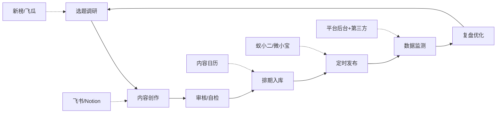
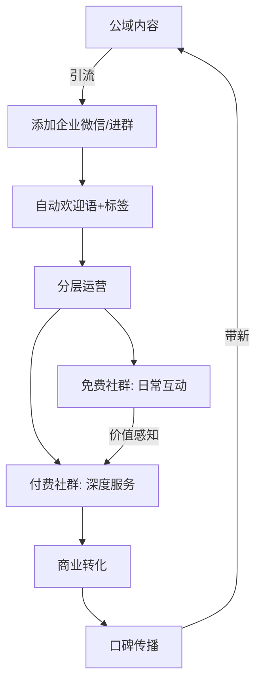

## 二、社交媒体管理工具

社交媒体管理远不止"发帖"这么简单。一个成熟的个人品牌运营者每天需要处理数据监测、内容排期、多平台分发、社群维护、竞品分析等多维度工作。单靠手动操作，效率低、易出错、难以规模化。合适的工具能将重复劳动自动化，将分散数据结构化，让你把精力集中在内容创作和策略思考上。

本节按功能域划分，覆盖三大核心场景：**数据监测与分析**、**排期与多平台发布**、**社群管理与私域运营**。每个场景从入门到专业逐级推荐，附选型维度和实战工作流，帮助你根据自身阶段做出最优选择。

### 2.1 为什么需要社交媒体管理工具

在推荐具体工具之前，先理解工具解决的核心问题：

| 痛点 | 手动操作的代价 | 工具带来的改变 |
|------|--------------|--------------|
| 多平台账号分散 | 每天登录5+平台分别操作，耗时1-2小时 | 统一仪表盘，10分钟完成全平台管理 |
| 数据碎片化 | 手工截图记录数据，无法做趋势分析 | 自动采集、可视化趋势、异常预警 |
| 发布时间靠感觉 | 凭经验猜最佳时间，错失流量高峰 | 基于历史数据推荐最优发布时间 |
| 内容排期混乱 | 临时找选题，质量波动大 | 内容日历提前规划，创作有节奏 |
| 竞品动态追踪难 | 手动关注竞品账号，容易遗漏 | 自动监测竞品内容、数据、策略变化 |
| 社群消息回复慢 | 逐一回复，高峰期容易漏消息 | 自动回复+关键词触发+批量管理 |
| 协作效率低 | 微信传文件、口头分配任务 | 在线协作、任务分配、审核流程 |

**工具的本质是杠杆**——用一次配置换取持续的效率提升。但工具不能替代策略和内容质量，它只是让你把正确的事情做得更快、更好。

### 2.2 数据监测与分析工具

数据是社交媒体运营的"仪表盘"。没有数据支撑的运营是盲目的——你不知道哪些内容有效、受众在什么时间活跃、竞品在做什么。数据分析工具的价值在于将平台散落的原始数据转化为可执行的洞察。

#### 2.2.1 综合数据平台

**新榜（newrank.cn）**

新榜是国内覆盖面最广的新媒体数据平台，支持微信公众号、抖音、快手、小红书、B站、微博等主流平台的数据监测。

- **核心功能**：全平台账号排行、内容热度追踪、行业趋势报告、广告投放监测、品牌声量分析
- **数据维度**：阅读量、点赞数、评论数、转发量、在看数等互动指标，以及粉丝增长趋势、内容发布频率等运营指标
- **适用场景**：了解行业大盘趋势、发现爆款内容规律、监测竞品账号表现、评估账号商业价值
- **价格体系**：基础查询免费；新榜有赚（广告撮合）免费入驻；数据API和高级监测功能按需付费，年费约3000-10000元不等
- **优势**：平台覆盖最全、历史数据积累深厚、行业报告有参考价值
- **局限**：部分深层数据（如精确粉丝画像）需要付费解锁；短视频数据更新有时滞后

**蝉妈妈（chanmama.com）**

蝉妈妈专注于抖音和快手生态，是短视频创作者和直播带货从业者的首选数据工具。

- **核心功能**：直播数据分析、短视频数据追踪、达人账号诊断、商品销量监控、选品库、抖音SEO关键词分析
- **数据维度**：直播间实时在线人数、GMV预估、粉丝画像、视频完播率趋势、带货转化率
- **适用场景**：短视频创作者优化内容策略、直播带货选品和定价、MCN机构管理达人矩阵
- **价格体系**：基础功能可免费试用；专业版约599元/月起；企业版需联系商务
- **优势**：短视频和直播数据最为深入、商品数据维度丰富
- **局限**：主要聚焦抖音和快手，公众号和B站覆盖较弱

**飞瓜数据（feigua.cn）**

飞瓜数据与蝉妈妈定位相似，但侧重点略有不同，在快手和B站数据上表现更强。

- **核心功能**：抖音/快手/B站数据监测、直播监控、达人排行榜、热门内容追踪、电商选品
- **数据维度**：视频播放量、互动率、粉丝增量、直播带货数据、话题热度
- **适用场景**：短视频内容创作参考、跨平台竞品分析、热点追踪
- **价格体系**：基础版免费（数据有延迟和限制）；专业版约300元/月起；旗舰版约800元/月
- **优势**：快手和B站数据覆盖优于蝉妈妈、性价比相对较高
- **局限**：数据精度和更新速度略逊于蝉妈妈

**西瓜数据（data.xiguaji.com）**

西瓜数据是国内最专业的微信公众号数据分析平台，深度聚焦公众号生态。

- **核心功能**：公众号阅读量预估、发文监测、阅读来源分析、广告投放效果监测、爆文追踪
- **数据维度**：文章阅读量、在看率、评论数、阅读来源比例（朋友圈/会话/搜一搜等）、粉丝画像
- **适用场景**：公众号运营者优化发文策略、评估公众号广告价值、追踪行业爆文
- **价格体系**：基础查询免费；VIP约200元/月起；SVIP约500元/月
- **优势**：公众号数据最深入、阅读量预估算法精准
- **局限**：仅覆盖微信生态，不做短视频平台

#### 2.2.2 平台自带分析工具

在花钱购买第三方工具之前，先充分利用各平台免费提供的官方数据分析功能：

**微信公众号后台**

- 用户分析：粉丝增长/取关趋势、性别地域分布、终端设备
- 内容分析：单篇文章的阅读量、分享量、收藏量、阅读来源拆分
- 菜单分析：自定义菜单的点击数据
- 消息分析：用户消息的关键词和趋势
- **使用技巧**：每周导出一次数据做长期趋势追踪，重点关注"阅读来源"判断内容传播路径

**抖音创作者服务中心**

- 作品数据：播放量、完播率、互动率、观众留存曲线（精确到秒）
- 粉丝画像：性别、年龄、地域、活跃时间
- 直播数据：观看人数、平均观看时长、打赏收入
- **使用技巧**：重点关注"观众留存曲线"，找到观众流失的节点，优化后续内容结构

**小红书专业号后台**

- 笔记数据：曝光量、点击量、互动量、收藏率
- 粉丝画像：年龄、地域、兴趣标签
- 搜索分析：用户搜索关键词和你的笔记在搜索中的排名
- **使用技巧**：利用"搜索分析"优化标题和正文中的关键词布局

**B站创作者后台**

- 数据概览：播放量、互动率、粉丝增长趋势
- 视频分析：观众留存曲线、弹幕热力图、流量来源
- 粉丝画像：年龄、性别、地域分布
- **使用技巧**：结合"弹幕热力图"和"观众留存曲线"，找到观众最感兴趣的片段，作为后续创作参考

#### 2.2.3 社交聆听工具

社交聆听（Social Listening）不只是看自己账号的数据，而是监测整个社交网络中与你品牌相关的讨论。这对于品牌声誉管理、行业趋势预判、用户需求挖掘至关重要。

**百度指数（index.baidu.com）**

免费工具，监测关键词在百度搜索中的热度趋势。适合判断一个话题的公众关注度变化。

- **核心用法**：输入你的品牌名或行业关键词，查看搜索趋势、地域分布、人群画像、相关搜索词
- **适用场景**：判断热点是否值得追、了解品牌搜索量变化、发现用户搜索意图

**微博指数（index.weibo.com）**

免费工具，监测关键词在微博平台的讨论热度。

- **核心用法**：追踪话题热度趋势、查看讨论人群画像、发现相关热门话题
- **适用场景**：微博运营者判断话题热度、舆情监测

**识微商情系统**

专业级舆情监测工具，覆盖全网（新闻、论坛、微博、微信、短视频等），适合品牌影响力较大、需要实时舆情预警的创作者或企业。

- **价格**：按监测关键词数量收费，通常年费万元以上
- **适用场景**：品牌危机预警、行业竞品全面监测、公关效果评估

#### 2.2.4 数据分析工具选型矩阵

| 维度 | 个人创作者（月入<5K） | 成长期创作者（月入5K-5W） | 专业/机构（月入5W+） |
|------|-------|--------|--------|
| 预算 | 0-200元/月 | 200-600元/月 | 600元/月以上 |
| 推荐方案 | 平台自带+新榜免费版 | 飞瓜/蝉妈妈1个+新榜 | 蝉妈妈+新榜+自建数据表 |
| 重点功能 | 基础数据趋势 | 深度数据+竞品分析 | 全面数据+API接入+定制报表 |
| 分析频率 | 每周1次 | 每周2-3次 | 每天 |

### 2.3 排期与多平台发布工具

当你的运营涉及3个以上平台时，手动逐个登录、逐个编辑、逐个发布的效率极低。排期和多平台发布工具的核心价值是：**一次编辑，多端分发；提前规划，按时执行。**

#### 2.3.1 国内多平台分发工具

**蚁小二（yixiaoer.cn）**

国内主流的多平台内容分发工具，支持图文和短视频一键发布到多个平台。

- **支持平台**：微信公众号、今日头条、百家号、企鹅号、搜狐号、网易号、大鱼号、知乎、微博、抖音、快手、小红书、B站等30+平台
- **核心功能**：
  - 一键多平台发布：编辑一次内容，自动适配各平台格式后批量发布
  - 定时发布：设定各平台的最优发布时间，到时自动发布
  - 账号管理：统一管理多个平台的多个账号
  - 数据看板：汇总各平台的发布数据（部分功能）
- **使用流程**：注册账号→绑定各平台账号→编辑内容并选择目标平台→设定发布时间→确认发布
- **价格**：基础版约100元/月；专业版约200元/月
- **优势**：平台覆盖广、操作简单、支持图文和短视频
- **局限**：部分平台（如小红书）的适配效果一般；批量发布可能被平台判定为低质内容
- **实操建议**：不要简单粗暴地"全平台同一内容"，至少针对各平台调整标题、封面和标签。蚁小二的价值在于减少重复操作，而不是取消个性化

**微小宝（weixiaobao.com）**

专注于微信公众号生态的运营管理工具，同时支持多账号管理。

- **核心功能**：
  - 多账号管理：一个界面管理多个公众号
  - 定时发布：设定文章发布日期和时间
  - 素材管理：建立图片、文章模板素材库
  - 数据分析：文章阅读数据追踪和对比
  - 粉丝互动：集中查看和回复各账号的消息和评论
- **适用场景**：同时运营多个公众号、需要定时发布、需要素材管理
- **价格**：基础版免费；高级版约99元/月
- **优势**：公众号功能深度优化、免费版功能够用
- **局限**：仅支持微信公众号生态，不做其他平台

**融媒宝**

较新的一款多平台分发工具，在界面设计和用户体验上较蚁小二有改进。

- **支持平台**：覆盖主流图文和视频平台
- **核心功能**：多平台一键发布、账号管理、定时发布、数据汇总
- **价格**：基础版免费（平台数量有限制）；专业版约150元/月
- **优势**：界面更现代、新用户上手更快
- **局限**：平台覆盖广度和成熟度不如蚁小二

#### 2.3.2 排期与内容日历工具

多平台分发解决的是"发布"动作的效率问题，而排期工具解决的是"规划"层面的组织问题。一个好的内容日历让你清楚每天、每周、每月该发什么，避免临时抱佛脚。

**Notion 内容日历模板**

Notion 提供灵活的内容日历管理方案，适合深度内容规划。

- **搭建方法**：
  1. 创建一个数据库视图，字段包括：日期、平台、内容类型、主题、标题、状态（规划中/创作中/已完成/已发布）、负责人、备注
  2. 切换到"日历视图"即可直观看到每月排期
  3. 切换到"看板视图"可以按状态拖拽管理内容进度
  4. 使用关联字段关联"内容素材库"和"数据追踪表"
- **优势**：高度自定义、与其他工作流无缝整合、支持团队协作
- **局限**：需要一定时间搭建和维护、非实时同步平台数据

**飞书多维表格**

飞书的多维表格是管理内容排期的另一种强大方案，尤其适合团队协作。

- **搭建方法**：创建多维表格→添加字段（日期、平台、内容类型、状态、优先级等）→设置看板视图/甘特图视图→添加自动化规则（如状态变更时自动通知）
- **优势**：与飞书文档、日历、消息深度整合；自动化规则强大；免费版功能充足
- **局限**：个人使用略显"重"，更适合团队

**Google Sheets / 腾讯文档 简易排期表**

如果不想引入复杂工具，用在线表格就能快速搭建内容排期系统。

内容排期表模板：

| 日期 | 平台 | 内容类型 | 选题/标题 | 素材状态 | 发布状态 | 数据反馈 |
|------|------|---------|----------|---------|---------|---------|
| 6/25 | 公众号 | 深度长文 | 如何构建个人IP | 已完成 | 已发布 | 阅读2500 |
| 6/25 | 小红书 | 图文笔记 | 5个品牌建设误区 | 创作中 | 待发布 | - |
| 6/26 | B站 | 教程视频 | 手把手搭建个人网站 | 拍摄中 | 规划中 | - |
| 6/27 | 抖音 | 短视频 | 一分钟了解IP打造 | 脚本已完成 | 规划中 | - |

#### 2.3.3 排期发布工具选型对比

| 工具 | 主要功能 | 平台覆盖 | 价格 | 适合谁 |
|------|---------|---------|------|--------|
| 蚁小二 | 多平台一键分发 | 30+平台 | ~100元/月起 | 运营3+平台的个人/团队 |
| 微小宝 | 公众号运营管理 | 仅微信 | 免费-99元/月 | 公众号运营为主的人 |
| 融媒宝 | 多平台分发 | 主流平台 | 免费-150元/月 | 预算有限的多平台运营者 |
| Notion | 内容日历/规划 | 不限 | 免费-70元/月 | 重规划、深度内容创作者 |
| 飞书 | 排期/协作/自动化 | 不限 | 免费 | 团队协作的内容运营 |

### 2.4 社群管理与私域运营工具

社群是个人品牌最核心的资产之一。公域流量受平台算法控制，随时可能减少；而社群是你的"自留地"，成员已经对你建立了信任，转化率远高于公域流量。社群管理工具帮你高效维护这个核心资产。

#### 2.4.1 企业级社群管理

**企业微信**

企业微信是国内个人品牌和中小企业进行私域运营的首选工具，也是微信官方推出的企业级通讯和客户管理平台。

- **核心功能**：
  - **客户联系**：员工用企业微信添加客户微信，客户关系归企业所有而非个人
  - **客户群**：创建可容纳500人的外部群，支持群公告、群机器人、自动回复
  - **客户朋友圈**：在企业微信中发布客户朋友圈，触达所有添加的客户
  - **欢迎语与自动回复**：新客户添加时自动发送欢迎语和资料
  - **标签管理**：给客户打标签（如"潜在客户"、"已付费"、"高互动"），实现精准运营
  - **数据统计**：员工添加客户数、回复消息数、客户流失率等运营指标
- **与个人微信的区别**：企业微信的客户关系属于企业（员工离职可交接），个人微信的属于个人；企业微信有官方API，可对接CRM和自动化工具
- **价格**：基础版完全免费；会话存档等高级功能需要付费
- **适用场景**：个人品牌的商业化运营、有团队的内容创业、需要客户管理和跟进的业务
- **实操建议**：用企业微信+个人微信组合运营——个人微信做"人设"和高频互动，企业微信做"管理"和规模化触达

**微伴助手**

微伴助手是企业微信的第三方SCRM（社交客户关系管理）工具，扩展了企业微信的自动化和精细化运营能力。

- **核心功能**：
  - 渠道活码：不同渠道（公众号、短视频、线下）用不同活码，自动标记来源
  - 自动打标签：根据客户行为（如点击链接、参与活动）自动打标签
  - SOP（标准运营流程）：设定客户添加后第1天、第3天、第7天分别发送什么内容
  - 群发助手：按标签筛选客户群发消息
  - 数据看板：客户增长、互动、转化全链路数据
- **价格**：基础版免费（功能有限）；专业版约2000-5000元/年
- **适用场景**：需要精细化私域运营、有付费转化需求、需要自动化触达的创作者

#### 2.4.2 付费社群平台

**知识星球（zsxq.com）**

知识星球是国内最主流的付费社群平台，适合知识类创作者建立付费社区。

- **核心功能**：
  - 付费加入：设定年费，用户付费后进入星球
  - 内容沉淀：所有内容按时间线沉淀，新成员可查看历史内容
  - 互动问答：成员提问，创作者和老成员回答
  - 精华内容：标记优质内容为精华，方便新成员快速获取高价值信息
  - 作业/打卡：支持发布作业和打卡任务
  - 文件分享：分享PDF、文档等资料
- **商业模式**：平台收取5%的费用（从创作者收入中扣除）
- **定价策略**：
  - 新手期：定价50-99元/年，降低入圈门槛，积累口碑
  - 成长期：定价99-299元/年，增加独家内容和服务
  - 成熟期：定价299-999元/年，提供高价值圈层和资源
- **适用场景**：有专业知识或技能的创作者、想要建立付费学习社群
- **运营技巧**：
  - 前期保持高频更新（每天1-2条），让新成员觉得"值了"
  - 设置"新人必读"精华帖，降低新成员的使用门槛
  - 鼓励老成员回答新人问题，形成互助氛围
  - 定期举办"问答日""分享日"等固定活动

**小报童（xiaobot.net）**

小报童是国内新兴的付费Newsletter平台，专注于"订阅制内容"模式。

- **核心功能**：
  - 订阅制：用户按月/按年付费订阅，定期收到创作者的长文推送
  - 分栏管理：可设置多个栏目，方便内容分类
  - 免费+付费分层：可设置部分免费内容吸引新读者，深度内容需付费
  - 邮件+微信推送：内容可通过邮件和微信模板消息触达订阅者
- **与知识星球的区别**：知识星球是"社群模式"（双向互动），小报童是"媒体模式"（单向推送为主）；知识星球适合深度互动和问答，小报童适合结构化长文和深度思考
- **价格**：平台收取5%的费用
- **适用场景**：擅长长文写作、有持续深度内容输出能力的创作者

#### 2.4.3 微信群管理工具

微信群仍然是国内最主流的免费社群载体。当群数量超过5个、群成员总数超过1000人时，手动管理会变得极其吃力。

**wetool（已停运，替代方案）**

wetool曾是最流行的微信群管理工具，但2020年被微信封禁。目前的替代方案：

- **微友助手**：群欢迎语、关键词自动回复、群数据统计、僵尸粉检测
- **WeTool Pro**（部分功能恢复）：群管理、好友管理、消息群发
- **企业微信群机器人**：免费方案，通过Webhook实现定时推送、关键词回复

**企业微信+群机器人（推荐的免费方案）**

用企业微信的群机器人功能可以实现低成本的社群自动化：

```bash
# 企业微信群机器人 Webhook 调用示例（发送每日早报）
curl -X POST 'https://qyapi.weixin.qq.com/cgi-bin/webhook/send?key=YOUR_KEY' \
  -H 'Content-Type: application/json' \
  -d '{
    "msgtype": "markdown",
    "markdown": {
      "content": "## 早安，品牌建设日报\n> 今日要点：...\n> 学习任务：..."
    }
  }'
```

#### 2.4.4 社群管理工具选型建议

你的情况是什么？

├── 只需免费社群
│   ├── 5个群以内 → 个人微信群 + 手动管理
│   ├── 5-20个群 → 企业微信 + 群机器人
│   └── 20个群以上 → 企业微信 + 微伴助手
│
├── 想建付费社群
│   ├── 重互动、重问答 → 知识星球
│   ├── 重深度长文、Newsletter风格 → 小报童
│   └── 重课程、重系统学习 → 小鹅通 / 荔枝微课
│
└── 需要全链路私域管理
    └── 企业微信 + 微伴助手 + 知识星球/小报童

### 2.5 社交媒体管理的进阶工作流

工具的真正价值不在于单个使用，而在于串联成工作流。以下是一套经过验证的社交媒体管理全流程工作流：

#### 2.5.1 内容生产流程



**选题调研阶段**：
1. 用新榜/蝉妈妈查看行业热门内容和竞品爆款
2. 用百度指数/微信指数判断话题热度趋势
3. 在粉丝群和评论区收集高频问题
4. 从知识星球/小报童的问答中挖掘选题

**内容创作阶段**：
1. 在Notion/飞书中撰写初稿
2. 使用AI工具（如Claude、ChatGPT）辅助扩展和润色
3. 制作配图（Canva/稿定设计）和视频（剪映/DaVinci Resolve）
4. 自检清单：标题是否吸引人？封面是否清晰？内容是否解决了受众问题？

**排期发布阶段**：
1. 根据内容日历安排发布时间
2. 用蚁小二/微小宝设置定时发布
3. 针对不同平台调整标题、标签、封面
4. 发布后在粉丝群做首轮传播

**数据复盘阶段**：
1. 发布后24小时记录首轮数据
2. 发布后7天记录长尾数据
3. 每月做一次内容表现汇总分析
4. 根据数据调整下月选题方向和发布策略

#### 2.5.2 私域运营流程



**SOP（标准运营流程）示例**：

| 时间节点 | 动作 | 工具 | 目标 |
|---------|------|------|------|
| 添加好友当天 | 发送欢迎语+个人介绍+福利资料 | 企业微信自动欢迎语 | 建立第一印象 |
| 第2天 | 推送一篇最有价值的内容 | 企业微信消息 | 展示专业度 |
| 第5天 | 邀请加入免费社群 | 群活码 | 进入日常触达池 |
| 第14天 | 推送付费社群/产品介绍 | 社群+私信 | 商业转化 |
| 每周 | 社群价值输出（干货/问答） | 知识星球/微信群 | 维护信任 |

### 2.6 常见误区与避坑指南

**误区一：工具越多越好**

很多初学者一口气注册十几个工具，结果每个都用不好。正确做法：先用免费工具（平台自带分析+Notion内容日历），遇到具体瓶颈再针对性引入付费工具。工具在精不在多。

**误区二：全平台同一内容一键分发**

蚁小二等工具支持一键分发，但各平台的内容偏好差异巨大：公众号偏深度长文、小红书偏图文种草、抖音偏短平快、B站偏长视频。一键分发不等于不做适配——至少调整标题、封面、标签，必要时调整内容结构。

**误区三：过度依赖工具数据**

工具数据有误差，尤其是第三方工具的阅读量预估、粉丝画像等，都基于算法推算而非精确统计。工具数据应作为"参考"而非"决策依据"，结合自己的直觉和粉丝反馈综合判断。

**误区四：忽视数据安全**

多平台管理工具需要你提供各平台的登录凭证（或扫码授权）。选择工具时务必注意：
- 优先选择官方推荐或大厂背景的工具
- 不要在不知名的小工具中输入主账号密码
- 定期检查账号授权列表，撤销不再使用的工具授权
- 核心账号（如主公众号、主抖音号）的授权要格外谨慎

**误区五：只建群不运营**

社群不是拉个群就完事了。没有持续价值输出的群，一周内就会变成"死群"或"广告群"。建群前先想清楚：你能为这个群提供什么持续的价值？你有多大的精力投入社群运营？如果精力有限，宁可不建群，也不要建一个没人管的群。

### 2.7 不同阶段的工具组合推荐

**入门期（0-1000粉丝）**：零成本起步

- 数据分析：各平台自带后台（免费）
- 内容排期：Google Sheets或腾讯文档自制排期表（免费）
- 社群管理：个人微信群（免费）
- 重点：聚焦1-2个平台，把内容做好，不急着铺开

**成长期（1000-1万粉丝）**：适度投入

- 数据分析：新榜免费版 + 平台后台（免费）
- 内容排期：Notion内容日历（免费版）
- 多平台分发：蚁小二基础版（约100元/月）
- 社群管理：企业微信（免费）
- 重点：开始多平台布局，引入基础工具提升效率

**成熟期（1万-10万粉丝）**：系统化运营

- 数据分析：蝉妈妈或飞瓜（约300-600元/月）+ 新榜
- 内容排期：Notion或飞书多维表格（免费或低成本）
- 多平台分发：蚁小二专业版（约200元/月）
- 社群管理：企业微信 + 知识星球或小报童
- 重点：数据驱动决策，建立私域运营体系

**专业期（10万+粉丝 / 全职创作者）**：全链路工具链

- 数据分析：蝉妈妈 + 新榜高级版 + 自建数据看板
- 内容排期：飞书多维表格 + 团队协作流程
- 多平台分发：蚁小二 + 各平台单独优化
- 社群管理：企业微信 + 微伴助手 + 知识星球 + 邮件列表
- 重点：工具链完整串联，团队协作标准化，数据驱动精细化运营

### 2.8 工具使用的核心原则

无论你处于哪个阶段，以下原则始终适用：

1. **内容为王，工具为辅**：工具提升的是效率，不是质量。如果内容本身没有价值，再好的工具也救不了你。永远优先投资内容能力的提升
2. **先免费后付费**：几乎所有工具都有免费版或试用期。先用免费版验证需求，确认瓶颈后再付费升级
3. **聚焦核心平台**：不要贪多。2-3个核心平台深度运营，远比5-6个平台蜻蜓点水效果好
4. **定期审计工具栈**：每季度检查一次你在用的工具，砍掉使用频率低的、性价比差的。工具维护本身也有成本
5. **关注数据安全**：谨慎授权、定期审查、核心账号多一层保护。数据泄露的代价远高于工具节省的时间

***
