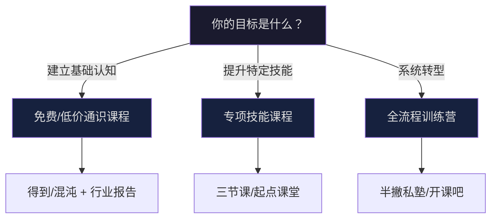
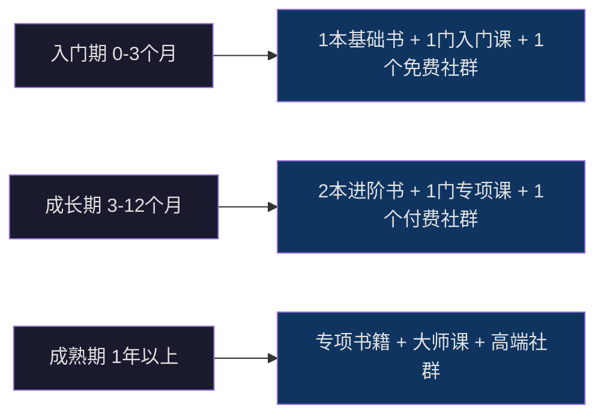
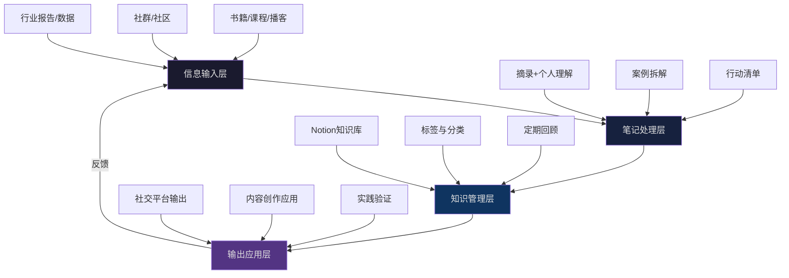

## 三、学习资源

个人品牌的建设是一个跨学科的系统工程，涉及品牌战略、内容创作、心理学、营销传播、视觉设计等多个领域。选择正确的学习资源，可以大幅缩短从新手到专家的路径，避免在低质量内容中浪费时间。

本节将学习资源按**书籍、在线课程、社群社区、播客与音频、工具型学习平台**五大类别系统梳理，并为每个资源标注**适用阶段、核心收获、投入产出比评估**，帮助读者根据自身所处阶段精准选择。

### 3.1 书籍推荐：构建底层认知框架

书籍是构建系统认知的最佳载体。与碎片化的文章和视频不同，经典书籍经过作者数年研究和编辑反复打磨，逻辑严密、体系完整。以下推荐按**基础→进阶→专项**三层排列，建议按顺序阅读。

#### 3.1.1 基础层：理解品牌与影响力的底层逻辑

**《定位》（Positioning: The Battle for Your Mind）**
- 作者：艾·里斯（Al Ries）、杰克·特劳特（Jack Trout）
- 核心价值：提出"占领心智"理论——品牌竞争的本质不是产品之争，而是认知之争。对个人品牌的直接启示是：你需要在目标受众心中占据一个清晰的、独特的认知位置。
- 关键概念：心智阶梯、聚焦法则、品类法则、二元法则。
- 阅读建议：重点读第一部分（心智之战）和最后部分（定位在实践中的应用），中间案例章可以快速浏览。全书约 20 万字，精读需 8-10 小时。
- 适配场景：如果你还不清楚"我的个人品牌应该定位在哪个领域"，这本书是必读的起点。

**《影响力》（Influence: The Psychology of Persuasion）**
- 作者：罗伯特·西奥迪尼（Robert B. Cialdini）
- 核心价值：从社会心理学角度揭示六大影响力原理——互惠、承诺与一致、社会认同、喜好、权威、稀缺。这些原理是个人品牌吸引和留住受众的心理基础。
- 关键概念：互惠原则（免费内容即互惠）、社会认同（粉丝数量和评价）、权威效应（专业背书）。
- 阅读建议：每个原则都有大量实验案例，建议边读边做笔记，将每个原则与自己的品牌策略对应。新版增加了"联盟"（Unity）作为第七原则。
- 适配场景：当你有内容但缺乏说服力，或想系统提升内容的转化效果时。

**《超级符号就是超级华与华方法》**
- 作者：华杉、华楠
- 核心价值：中国本土品牌方法论，强调用"超级符号"占领受众的感官和记忆。对个人品牌而言，你的视觉标识、口头禅、固定开场白都可以成为超级符号。
- 关键概念：超级符号、品牌寄生、文化母体。
- 阅读建议：前五章是方法论核心，后半部分是案例集合，可按需选读。语言通俗，实操性强。

#### 3.1.2 进阶层：掌握内容创作与传播方法

**《内容营销》（Content Inc.）**
- 作者：乔·普利齐（Joe Pulizzi）
- 核心价值：提出"先内容、后产品"的创业模型——通过持续输出优质内容积累受众，再基于受众需求开发产品。这与个人品牌"先立人设、再做变现"的路径完全吻合。
- 关键概念：内容营销金字塔、内容使命声明、六大变现模型。
- 实操指导：书中给出了从零起步的 6 个阶段——确定甜蜜点、确定内容倾斜、选择内容平台、构建受众基础、多元化渠道、 monetization。
- 适配场景：适合已经确定定位，但不知道如何系统规划内容策略的读者。

**《爆款文案》**
- 作者：关健明
- 核心价值：将文案写作拆解为可复用的公式——标题抓注意力、激发欲望、赢得信任、引导行动。每个环节都有具体的写作模板和案例拆解。
- 关键方法：FABE法则（特征-优势-利益-证据）、痛点放大公式、故事化文案结构。
- 实操指导：书中的 18 种标题公式可以直接套用，如"数字+悬念+利益点"型标题在各平台的点击率普遍高于普通标题 30%-50%。
- 适配场景：适合需要提升标题、推文、产品介绍等各类文案转化率的读者。

**《疯传》（Contagious: Why Things Catch On）**
- 作者：乔纳·伯杰（Jonah Berger）
- 核心价值：揭示内容病毒式传播的六大驱动力——社交货币、诱因、情绪、公共性、实用价值、故事。这六个要素是打造"爆款内容"的底层密码。
- 关键应用：设计内容时逐一检查是否具备这六个要素中的至少 3 个。例如，一篇"5 个被验证有效的涨粉技巧"具备实用价值（干货）、社交货币（转发显得专业）、情绪（焦虑驱动的行动）三个要素。
- 适配场景：适合内容质量不错但传播效果不佳的创作者。

#### 3.1.3 专项层：深入特定技能领域

**《文案训练手册》（The Copywriter's Handbook）**
- 作者：罗伯特·布莱（Robert W. Bly）
- 核心价值：文案写作的"字典级"工具书，涵盖标题写作、正文结构、销售信、网络文案等所有类型。比《爆款文案》更系统、更深入，适合想把文案当核心竞争力的人。
- 阅读建议：建议先通读建立框架，然后作为工具书按需查阅特定章节。

**《增长黑客》（Hacking Growth）**
- 作者：肖恩·埃利斯（Sean Ellis）、摩根·布朗（Morgan Brown）
- 核心价值：数据驱动的增长方法论。对个人品牌的启示是：用A/B测试思维优化内容策略，用数据而非直觉做决策。
- 关键概念：增长飞轮、北极星指标、AARRR模型（获客-激活-留存-推荐-变现）。
- 适配场景：适合已经有一定粉丝基础，想要系统性提升增长效率的进阶创作者。

**《短视频运营从入门到精通》**
- 核心价值：系统讲解短视频从选题策划、脚本写作、拍摄技巧到数据分析的全流程。涵盖抖音、快手、视频号、B站四大平台的差异化运营策略。
- 关键知识点：黄金3秒法则、完播率优化技巧、评论区互动引导、投流策略。
- 阅读建议：重点看选题策划和数据分析两章，拍摄技巧因设备差异可选择性阅读。

**《故事经济学》（Storynomics）**
- 作者：罗伯特·麦基（Robert McKee）、托马斯·格雷斯（Thomas Gerace）
- 核心价值：好莱坞编剧大师教你用故事思维做品牌营销。个人品牌的核心竞争力之一就是讲好自己的故事——你的起源故事、奋斗历程、转折时刻。
- 关键概念：故事的五大要素（主角、欲望、冲突、转变、结果）、品牌故事弧线。
- 适配场景：适合内容"有干货但没温度"、缺乏个人特色的创作者。

**《视觉锤》（Visual Hammer）**
- 作者：劳拉·里斯（Laura Ries）
- 核心价值：定位理论的视觉延伸——品牌需要一个视觉符号将语言钉（定位概念）钉入消费者心智。对个人品牌的启示：头像、配色、排版风格、视频开场画面都是你的"视觉锤"。
- 适配场景：适合想在视觉层面建立差异化识别的创作者。

### 3.2 在线课程：系统学习与实战训练

在线课程的核心价值不在于"知识传授"（书籍已经解决），而在于**结构化学习路径、实战作业反馈、同频学员交流**三个维度。以下按平台分类推荐，标注性价比和适用阶段。

#### 3.2.1 综合知识平台

| 平台 | 推荐课程 | 价格区间 | 核心优势 | 适用阶段 |
|------|----------|----------|----------|----------|
| 得到App | 《品牌营销》《写作训练营》《怎样成为时间管理的高手》 | 100-300元/课 | 知识密度高，讲师阵容强，有学习社区 | 入门-进阶 |
| 混沌学园 | 《创新思维》《商业模型》 | 1000-3000元/年 | 商业底层思维训练，适合想理解商业逻辑的创作者 | 进阶 |
| 樊登读书 | 品牌/营销/心理学相关书籍解读 | 365元/年 | 用45分钟讲透一本书，高效获取多领域知识框架 | 入门 |

**得到App使用建议**：
- 优先选择有"训练营"标签的课程，因为有作业批改和社群讨论，学习效果是纯音频课程的 3-5 倍。
- 刘润的《5分钟商学院》适合碎片时间学习商业基础，梁宁的《产品思维30讲》对理解用户需求非常有帮助。
- 避免同时订阅超过 3 门课程——信息过载会导致每门都浅尝辄止。

#### 3.2.2 新媒体与营销专项平台

| 平台 | 推荐课程 | 价格区间 | 核心优势 | 适用阶段 |
|------|----------|----------|----------|----------|
| 网易云课堂 | 《新媒体运营》《短视频制作》 | 100-500元/课 | 技能导向，实操性强，有免费试听章节 | 入门 |
| 起点课堂 | 《个人品牌打造》《内容营销》 | 200-800元/课 | 专注于新媒体和个人品牌，讲师多为一线操盘手 | 进阶 |
| 三节课 | 《新媒体运营》《增长黑客》《数据运营》 | 300-1000元/课 | 项目制教学，课程设计注重实战输出 | 进阶-高阶 |
| 半撇私塾 | 《新媒体运营全栈》 | 3000-5000元 | 全流程系统培训，含作品集和求职辅导 | 转行/全职 |

**课程选择的决策框架**：

#### 3.2.3 国际平台（适合有英文基础的读者）

| 平台 | 推荐课程 | 价格 | 核心优势 |
|------|----------|------|----------|
| Coursera | 《Brand Management》（伦敦大学）、《Digital Marketing》（伊利诺伊大学） | 免费旁听/49美元证书 | 大学级系统课程，理论扎实，有peer review作业 |
| Skillshare | 《Personal Branding》《Content Creation》 | 99美元/年 | 实战项目导向，创作者社区活跃 |
| MasterClass | 《Chris Voss谈谈判》、《Anna Wintour谈创造力》 | 180美元/年 | 顶级大师授课，虽非直接品牌课程但思维方式极具启发性 |
| HubSpot Academy | 《Content Marketing Certification》《Inbound Marketing》 | 完全免费 | 营销行业标准认证，LinkedIn上可展示，内容专业系统 |

**特别推荐 HubSpot Academy**：这是目前全球营销领域最权威的免费认证课程体系。完成认证后可以在 LinkedIn 个人资料中展示徽章，对建立专业形象有直接帮助。Content Marketing 认证课程约 6 小时，涵盖内容策略、内容创作、内容推广全流程，质量超过大多数付费课程。

#### 3.2.4 课程学习的正确方法

大多数人的课程完成率低于 10%。以下方法可以将学习效果提升 3-5 倍：

1. **先看目录，带着问题学**：不要从第一节课按顺序看。先浏览全部目录，标记你最需要的 3 个章节优先学习，带着具体问题去听课。
2. **边学边做，不囤课**：每学完一个模块，立刻在自己的账号上实践。学完"标题写作"就写 10 个标题发到群里测试；学完"选题策划"就列一周的选题计划。
3. **建立笔记系统**：用 Notion 或飞书建立课程笔记数据库，每门课程记录：核心观点、可执行行动项、灵感启发。定期回顾比学新课更重要。
4. **找学习搭档**：在课程社群中找 1-2 个进度相近的学习搭档，互相监督打卡、互评作业。独立学习的坚持率约 15%，有搭档的坚持率可达 60%。

### 3.3 社群与社区：获取实战经验和人脉

社群的核心价值是**信息差、人脉、氛围**。付费社群筛选掉了低意愿用户，留下的大多是认真做事的人，交流质量远高于免费群。

#### 3.3.1 高价值付费社群

**生财有术**
- 创始人：亦仁
- 定位：国内最活跃的互联网商业实战社群，核心价值是"信息差"和"连接"
- 价格：约 2000 元/年（每年续费）
- 核心内容：每周有嘉宾分享赚钱案例和实操复盘，涵盖自媒体、电商、知识付费、出海等各赛道
- 适合人群：已有一定基础，想要探索变现路径或寻找商业机会的创作者
- 使用建议：加入后不要贪多，每月重点研究 2-3 个与自己赛道相关的案例，提炼可复用的方法论。社群精华帖的信息密度远高于日常讨论，优先阅读精华内容。
- 投入产出比评估：如果你能将一个案例中的方法论落地执行，回报通常是学费的 10 倍以上。

**粥左罗成长社群**
- 创始人：粥左罗（从月薪5000到年入千万的新媒体人）
- 定位：个人成长和新媒体运营实战社群
- 价格：约 500 元/年
- 核心内容：每周拆解一个新媒体运营案例，分享写作、运营、变现的实操经验
- 适合人群：新媒体运营入门到进阶阶段的创作者
- 与生财有术的区别：粥左罗社群更聚焦于"内容创作"本身，生财有术更偏"商业变现"。如果你还在打磨内容阶段，粥左罗社群性价比更高。

**caoz的小密圈**
- 创始人：曹政（连续创业者，前百度技术总监）
- 定位：互联网商业分析与技术洞察
- 价格：约 365 元/年
- 核心内容：深度行业分析、技术趋势解读、商业逻辑拆解
- 适合人群：想提升商业思维深度的技术型创作者

#### 3.3.2 知识星球精选

知识星球是中文付费社群的最大聚合平台，选择时注意以下原则：

**选星标准（五看法则）**：
1. **看星球主背景**：是否在相关领域有真实成果（不是只有理论）
2. **看更新频率**：每周至少 2 次高质量更新的星球才值得加入
3. **看互动质量**：成员提问是否得到有效回复，而不是只看人数
4. **看精华帖数量**：精华帖比例越高，说明内容筛选越严格
5. **看退出率**：续费率超过 60% 的星球通常质量有保障

**各赛道推荐星球**：

| 赛道 | 推荐星球 | 年费 | 特点 |
|------|----------|------|------|
| 新媒体运营 | 粥左罗·新媒体运营圈 | 500元 | 写作方法+运营实操 |
| 自媒体变现 | 生财有术 | 2000元 | 案例拆解+信息差 |
| 设计/创意 | 设计便利店 | 299元 | 设计趋势+审美提升 |
| 技术写作 | caoz的小密圈 | 365元 | 商业分析+技术洞察 |
| 短视频 | 陈厂长·短视频运营 | 399元 | 平台算法+涨粉实操 |

#### 3.3.3 免费社区与开放资源

**即刻App**：
- 中文互联网最活跃的产品/运营/创业社区
- 关注"自媒体人"、"个人品牌"、"内容创作"等话题圈
- 免费，但需要主动参与讨论才能获得有价值的信息

**GitHub Awesome 列表**：
- 搜索 "awesome-personal-branding"、"awesome-content-creation" 获取持续更新的资源合集
- 适合技术型创作者，可以找到大量英文世界的一手资源

**Reddit 相关社区**：
- r/PersonalBranding：个人品牌策略讨论
- r/content_marketing：内容营销策略与案例
- r/socialmedia：社交媒体运营技巧
- r/Entrepreneur：创业与独立工作者社区

### 3.4 播客与音频：碎片时间的高效利用

播客是通勤、运动、家务等场景下的最佳学习媒介。以下是个人品牌领域质量最高的中文播客推荐。

#### 3.4.1 商业与品牌类

| 播客名称 | 主播 | 更新频率 | 核心内容 | 推荐指数 |
|----------|------|----------|----------|----------|
| 疯投圈 | 黄海、Rio | 每周 | 消费品牌深度分析，商业逻辑拆解 | ★★★★★ |
| 商业就是这样 | 商业周刊 | 每周 | 商业热点事件的深度解读 | ★★★★ |
| 枫言枫语 | Kenson、Nic | 每周 | 科技/互联网/商业趋势 | ★★★★ |
| 声东击西 | 徐涛、曾婕 | 每两周 | 文化/商业/科技交叉话题 | ★★★★ |

#### 3.4.2 内容创作与运营类

| 播客名称 | 核心内容 | 推荐指数 |
|----------|----------|----------|
| 乱翻书 | 互联网产品与商业分析 | ★★★★★ |
| 津津乐道 | 生活方式与消费文化 | ★★★★ |
| 三五环 | 职场/创业/个人成长 | ★★★★ |

#### 3.4.3 英文播客（高价值推荐）

| 播客名称 | 核心内容 | 推荐指数 |
|----------|----------|----------|
| Marketing Over Coffee | 每周15分钟，营销技巧速递 | ★★★★★ |
| The GaryVee Audio Experience | 个人品牌/社交媒体/创业思维 | ★★★★★ |
| The Tim Ferriss Show | 顶级人物访谈，方法论拆解 | ★★★★★ |
| How I Built This | 创业者品牌故事，NPR出品 | ★★★★ |

**播客学习方法**：
1. **倍速听**：1.5x-2x 速度可以在碎片时间内听完更多内容
2. **听完即写**：每听完一期，花 5 分钟写 3 条核心收获，发到社交平台（本身就是内容输出）
3. **建立播客笔记库**：用 Notion 记录每期的标题、核心观点、可执行行动项，方便日后检索

### 3.5 工具型学习平台：边用边学

有些学习资源不是"课程"或"书籍"，而是工具本身附带的学习体系。这些平台的优势是**边学边做，学完即产出**。

#### 3.5.1 设计学习平台

**Canva设计学院**：
- 免费，中英文内容均有
- 覆盖品牌设计基础、社交媒体图片设计、演示文稿设计
- 每个教程都配模板，学完即可产出可直接使用的设计作品
- 推荐学习路径：品牌色彩→社交媒体模板→信息图表设计

**Figma社区**：
- 免费，英文为主
- 海量免费设计模板和组件库
- 适合想建立统一视觉体系的创作者
- 推荐搜索关键词：social media kit、personal brand、content creator

#### 3.5.2 视频制作学习平台

**B站创作者学院**：
- 完全免费
- B站官方出品的创作者培训内容
- 涵盖选题、拍摄、剪辑、数据分析全流程
- 内容与B站平台深度绑定，适合B站创作者

**剪映创作学院**：
- 完全免费
- 剪映官方教程，从基础剪辑到高级特效
- 配合剪映模板使用，学习效率极高
- 适合短视频创作者快速入门剪辑

#### 3.5.3 写作学习平台

**Medium Writing Academy**：
- 免费（需注册Medium账号）
- 英文写作技巧系统教程
- 学习后可以直接在Medium上发布作品获取反馈
- 适合面向国际受众的创作者

**少数派写作工坊**：
- 部分免费，精品课约 199-399 元
- 聚焦数字生活和效率工具领域的写作
- 中文科技写作质量标杆
- 适合技术/效率/数字生活赛道的创作者

### 3.6 学习资源选择策略：避免知识焦虑

面对海量学习资源，最常见的错误是**囤积而不消化**。以下决策框架帮助你精准选择。

#### 3.6.1 按阶段匹配资源

**入门期（0-3个月）**：
- 目标：建立认知框架，消除信息差
- 推荐组合：《定位》或《影响力》（选一本精读）+ 得到App或网易云课堂入门课 + 即刻/免费社群
- 投入预算：0-500 元
- 关键动作：每周输出 1 篇学习笔记，发到社交平台

**成长期（3-12个月）**：
- 目标：掌握核心技能，建立内容体系
- 推荐组合：《内容营销》+《疯传》+ 专项课程 + 知识星球社群
- 投入预算：1000-3000 元
- 关键动作：将课程中学到的方法论在自己的账号上实践，用数据验证效果

**成熟期（1年以上）**：
- 目标：深化专业度，拓展商业视野
- 推荐组合：专项书籍（文案/增长/视觉）+ 国际大师课 + 高端付费社群
- 投入预算：3000-10000 元
- 关键动作：开始输出自己的方法论，从"学习者"转变为"分享者"

#### 3.6.2 资源投入的优先级矩阵

不是所有资源都值得同等投入。以下矩阵帮助你分配有限的时间和金钱：

| 优先级 | 资源类型 | 投入建议 | 原因 |
|--------|----------|----------|------|
| P0 最高 | 与你当前阶段匹配的实操课程 | 时间优先投入 | 直接影响产出质量 |
| P1 高 | 经典书籍（基础层） | 每月至少精读1本 | 建立底层认知框架 |
| P2 中 | 付费社群 | 选1-2个深度参与 | 信息差+人脉+氛围 |
| P3 低 | 播客/音频 | 碎片时间 | 补充视野，不占用核心时间 |
| P4 最低 | 免费文章/视频 | 按需查阅 | 信息密度低，容易陷入碎片化 |

#### 3.6.3 常见学习误区

**误区一：收藏等于学会**
- 症状：收藏夹里有上百篇文章、数十门课程，但从未完整学完任何一门
- 纠正：执行"清零法则"——每月 1 号清空收藏夹，只保留正在学习的 3 个资源。学到一半暂停的内容，要么本周内完成，要么果断放弃。

**误区二：追新不追深**
- 症状：每个新出的课程都想报名，每本畅销书都想买，但从未将任何一套方法论深度实践
- 纠正：选定一个方法论后，至少实践 3 个月再评估效果。同一领域的不同方法论往往大同小异，真正拉开差距的是执行力和迭代深度。

**误区三：只输入不输出**
- 症状：学了很多但感觉"没什么变化"，知识停留在"知道"层面
- 纠正：执行费曼学习法——每学完一个知识点，用自己的话写成一篇笔记或录一段语音分享出去。教是最好的学。

**误区四：忽视免费资源**
- 症状：认为只有付费课程才有价值，忽视了大量高质量的免费内容
- 纠正：HubSpot Academy、B站创作者学院、平台官方教程等免费资源的质量往往超过很多低质量付费课程。先充分利用免费资源建立基础，再有针对性地购买付费课程。

**误区五：孤立学习**
- 症状：独自看书、独自听课、独自实践，缺乏反馈和交流
- 纠正：加入至少一个学习社群，定期分享自己的实践成果并寻求反馈。他人的一句点评可能节省你数周的试错时间。

### 3.7 构建个人学习系统

零散的学习无法形成复利效应。你需要一个系统来管理学习过程。

#### 3.7.1 学习系统架构

#### 3.7.2 学习节奏建议

- **日课**：15-30 分钟播客/音频（碎片时间），完成即写 3 条收获
- **周课**：2-3 小时深度阅读或课程学习，写一篇学习复盘
- **月课**：精读 1 本书 + 完成 1 个课程模块 + 社群 1 次深度交流
- **季课**：回顾过去 3 个月的学习笔记，提炼核心方法论，调整学习方向

这套节奏的核心原则是：**输入-处理-输出形成闭环**。没有输出的学习是无效的，没有回顾的知识是会遗忘的。

***

> **本节小结**：学习资源本身不是目的，**将知识转化为可执行的行动并持续迭代**才是关键。入门期重框架（书籍+入门课），成长期重技能（专项课+社群），成熟期重视野（大师课+高端社群）。最重要的一条原则：少而精，学一门就用一门，用完再学下一门。
