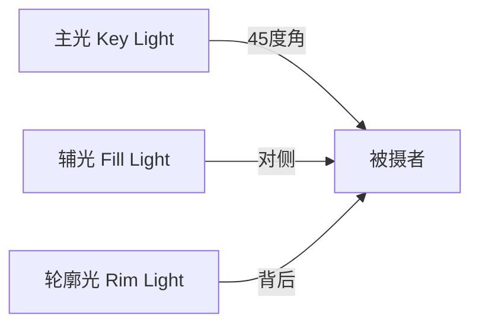

## 四、硬件设备推荐

硬件设备是个人品牌内容生产的物理基础。一套合理的设备组合，能让你的内容画质、音质、灯光效果从"凑合看"跃升到"专业感"，直接影响观众的留存率和信任度。但设备不是越贵越好——关键是匹配你的内容形式、更新频率和预算阶段。

### 设备投资的核心逻辑

很多新手创作者陷入"器材焦虑"，觉得没有好设备就做不出好内容。事实恰恰相反：**内容优先于设备，设备服务于内容**。一个有干货的手机视频，远比一个画质精美但空洞无物的相机视频更有传播力。

设备投资应遵循"木桶原则"——先补齐最短板：

| 内容形式 | 最优先设备 | 次优先设备 | 可后期补充 |
|---------|-----------|-----------|-----------|
| 图文/知识分享 | 手机/电脑 | 补光灯 | 麦克风（做视频时） |
| Vlog/短视频 | 手机+稳定器 | 麦克风 | 补光灯、相机 |
| 播客/音频 | 麦克风+声卡 | 隔音处理 | 监听耳机 |
| 直播 | 手机/相机 | 补光灯+麦克风 | 声卡、采集卡 |
| 专业视频 | 相机+镜头 | 灯光+麦克风 | 稳定器、滑轨 |

**分阶段投入建议**：

- **起步期（0-1000粉）**：手机+自然光+免费剪辑软件，总投入 0-500 元
- **成长期（1000-1万粉）**：补充麦克风和基础灯光，总投入 500-3000 元
- **加速期（1万-10万粉）**：升级相机或专业灯光，总投入 3000-10000 元
- **成熟期（10万粉+）**：按需升级专业设备，投入根据变现能力决定

---

### 4.1 拍摄设备

#### 4.1.1 手机——大多数创作者的首选

手机是最被低估的创作工具。2024年以后的旗舰手机，在良好光线下拍摄的画质已经能满足绝大多数平台的需求。手机的优势在于：随身携带、即拍即剪、自动对焦快、防抖性能好、无需额外学习成本。

**选购要点**：

- **主摄传感器大小**：传感器越大，进光量越多，暗光表现越好。1/1.3英寸以上为优秀
- **视频防抖**：OIS光学防抖+EIS电子防抖组合效果最佳
- **视频规格**：支持4K 30fps是基本要求，支持4K 60fps更佳
- **收音质量**：多麦克风阵列能提升收音清晰度，支持外接麦克风很重要
- **存储容量**：视频文件极大，建议256GB起步，512GB更从容

**2024-2025年推荐机型对比**：

| 机型 | 参考价格 | 影像亮点 | 适合场景 | 不足 |
|------|---------|---------|---------|------|
| iPhone 16 Pro/Pro Max | 7999-13999 | 4K 120fps、ProRes录制、动作按钮一键录制 | 全场景通用，后期生态强 | 价格高，长焦不如安卓旗舰 |
| 华为Pura 70 Ultra | 8999+ | 1英寸大底、伸缩镜头、长焦优秀 | 旅拍、风光、远距离拍摄 | 视频防抖一般，生态封闭 |
| 小米14/15 Ultra | 5999-6999 | 徕卡色彩调教、1英寸主摄、性价比高 | 日常Vlog、街拍、旅行 | 部分场景白平衡不稳定 |
| 三星S24 Ultra | 9999+ | 5倍光学变焦、8K视频、AI增强 | 商务场景、远距离拍摄 | 视频文件巨大，发热明显 |
| 一加12/13 | 3999-4999 | 哈苏调色、性价比高、视频性能均衡 | 预算有限的入门创作者 | 品牌调性偏数码圈 |
| Google Pixel 9 Pro | 约6000 | 计算摄影最强、夜景视频优秀 | 低光环境、Vlog | 国内购买渠道有限 |

**手机拍摄的隐藏技巧**：

1. **锁定曝光和对焦**：长按屏幕锁定AE/AF，避免画面忽明忽暗
2. **使用主摄而非超广角**：主摄画质最好，超广角边缘画质下降明显
3. **横屏还是竖屏**：抖音/快手/小红书用竖屏（9:16），B站/YouTube用横屏（16:9）
4. **飞行模式拍摄**：避免来电/消息通知打断录制
5. **外接存储**：iPhone支持外接SSD直接录制到外部存储，解决容量问题
6. **善用电影效果模式**：自动追焦+背景虚化，单人出镜时效果好

#### 4.1.2 相机——画质和创作自由度的飞跃

当你的内容对画质有更高要求，或者需要更灵活的镜头组合时，相机是必然的升级方向。相机相比手机的核心优势是：更大的传感器（更好的虚化和暗光表现）、可更换镜头（不同焦段适应不同场景）、更专业的色彩和编码格式。

**相机类型科普**：

- **卡片机/Vlog相机**：固定镜头，小巧便携，适合单人操作。代表：索尼ZV-1 II、佳能G7X Mark III
- **APS-C微单**：半画幅传感器，画质好且体积适中，性价比最高。代表：索尼ZV-E10 II、佳能R50、富士X-T50
- **全画幅微单**：传感器最大，画质天花板，但体积和价格都更高。代表：索尼A7C II、佳能R6 III、松下S5 II
- **电影机**：专业视频机，有风扇散热、无限录制、专业接口。代表：索尼FX30、佳能R5C、松下BS1H

**2024-2025年推荐机型详细对比**：

| 机型 | 参考价格(机身) | 传感器 | 视频规格 | 优势 | 不足 | 推荐镜头搭配 |
|------|--------------|--------|---------|------|------|------------|
| 索尼ZV-1 II | 约4990 | 1英寸 | 4K 30fps | 内置美颜、收音好、等效18-50mm广角 | 不可换镜头、暗光一般 | 固定镜头 |
| 索尼ZV-E10 II | 约5999 | APS-C | 4K 60fps | 可换镜头、S-Cinetone色彩、翻转屏 | 无机身防抖、EVF | E 16-50mm套头 + 适马30mm F1.4 |
| 佳能R50 | 约4799 | APS-C | 4K 30fps | 轻巧、翻转屏、色彩讨喜、价格亲民 | 4K裁切大、无机身防抖 | RF-S 18-45mm + RF 50mm F1.8 |
| 富士X-T50 | 约7990 | APS-C | 6.2K 30fps | 胶片模拟直出色彩、复古外观、防抖 | 对焦不如索尼、镜头贵 | XF 18-55mm + XF 35mm F1.4 |
| 松下S5 II | 约8998 | 全画幅 | 6K 30fps | 相位对焦、风扇散热、无录制限制、V-Log | 机身较重、镜头群较小 | 20-60mm套头 + 50mm F1.8 |
| 索尼A7C II | 约12499 | 全画幅 | 4K 60fps | 全幅最轻、AI对焦、五轴防抖 | 无双卡槽、小EVF | FE 28-60mm + FE 50mm F1.4 GM |

**镜头选择指南**：

镜头比机身更影响画面效果。一个好的镜头可以用很多年，跨越多代机身升级。

- **日常Vlog**：等效24-70mm变焦，一镜走天下
- **人像出镜**：等效35mm或50mm定焦，大光圈虚化背景
- **美食/产品**：等效90mm微距定焦，拍细节特写
- **室内空间**：等效16-24mm广角，拍环境和全景
- **户外旅行**：等效24-200mm大变焦，减少换镜头次数

#### 4.1.3 稳定器——运动拍摄的专业感保障

稳定器（Gimbal）通过电机和陀螺仪实时补偿手部抖动，让运动拍摄画面丝滑流畅。对于Vlog、旅行、街拍等需要边走边拍的场景，稳定器能大幅提升画面质感。

**稳定器类型**：

- **手机稳定器**：轻便，适合手机拍摄者。代表：DJI OM 7系列、智云Smooth 5
- **相机稳定器**：承重更大，适合微单/相机。代表：DJI RS 4系列、智云Crane系列
- **运动相机稳定器**：专为GoPro等设计。代表：DJI Action系列（自带增稳）

**手机稳定器推荐对比**：

| 型号 | 参考价格 | 承重 | 续航 | 特色功能 | 不足 |
|------|---------|------|------|---------|------|
| DJI OM 7 | 约999 | 300g | 约15h | 磁吸快拆、智能跟随6.0、全景合成 | 仅支持手机 |
| 智云Smooth 5 | 约599 | 300g | 约14h | 内置补光灯、手势控制、性价比高 | 跟随精度不如DJI |
| 飞宇Vimble 3 | 约499 | 280g | 约12h | 价格最低、延长杆设计 | 软件生态不如DJI |

**相机稳定器推荐对比**：

| 型号 | 参考价格 | 承重 | 续航 | 适合机型 | 特色 |
|------|---------|------|------|---------|------|
| DJI RS 4 Pro | 约4499 | 4.5kg | 约14h | 全画幅微单+镜头 | 自动轴锁、LiDAR跟焦 |
| DJI RS 4 | 约2999 | 3kg | 约14h | APS-C微单 | 性价比最优选择 |
| 智云Crane 4 | 约3299 | 4.5kg | 约12h | 全画幅微单 | 内置补光灯、竖拍切换 |

**稳定器使用要点**：

1. **调平是关键**：上机前必须仔细调平，否则电机负荷大、续航缩短、画面有"呼吸感"
2. **走路姿势**：膝盖微弯、脚步放轻、身体保持水平，像"忍者步"一样移动
3. **善用跟随模式**：PF（平移跟随）适合左右移动，L（全锁定）适合直线行走，F（全跟随）适合自由运镜
4. **配合延长杆**：低角度仰拍、高角度俯拍，延长杆能带来更丰富的视角

#### 4.1.4 运动相机与无人机——特殊视角的利器

**运动相机**适合第一视角Vlog、运动场景、恶劣环境：

| 型号 | 参考价格 | 防水 | 传感器 | 特色 |
|------|---------|------|--------|------|
| DJI Action 5 Pro | 约2399 | 20米裸机 | 1/1.3英寸 | 磁吸快拆、双屏、大底传感器 |
| GoPro Hero 13 | 约3398 | 10米裸机 | 1/1.9英寸 | 生态配件最丰富、HyperSmooth防抖 |
| Insta360 Ace Pro 2 | 约2798 | 12米裸机 | 1/1.3英寸 | 翻转屏、AI取景、隐形自拍杆 |

**无人机**适合旅拍、风光、建筑、城市航拍：

| 型号 | 参考价格 | 传感器 | 续航 | 特色 |
|------|---------|--------|------|------|
| DJI Mini 4 Pro | 约4788 | 1/1.3英寸 | 约34分钟 | 249g免注册、全向避障 |
| DJI Air 3 | 约6388 | 双1/1.3英寸 | 约46分钟 | 双焦段、长续航 |
| DJI Mavic 3 Pro | 约10388 | 4/3英寸哈苏 | 约43分钟 | 三焦段、专业影像 |

> **法规提醒**：在中国大陆，250g以上无人机需在民航局实名登记。城市中心、机场附近、军事管制区为禁飞区。飞行前务必查看当地法规。

---

### 4.2 录音设备

**声音质量比画质更容易被观众感知为"专业或业余"**。研究表明，观众能忍受画质一般但声音清晰的视频，却无法忍受画质精美但声音嘈杂的视频。声音是内容可信度的隐性指标——一个声音浑厚、清晰、无杂音的创作者，天然被认为更可信。

#### 4.2.1 麦克风——收音设备的核心

**麦克风类型科普**：

- **领夹麦克风（Lavalier）**：夹在衣领上，离嘴近，收音清晰，适合单人出镜
- **枪型麦克风（Shotgun）**：指向性强，适合固定机位和采访
- **手持麦克风**：适合舞台、街采、外景报道
- **桌面电容麦克风**：灵敏度高，适合播客、配音、直播
- **USB麦克风**：即插即用，适合桌面录音新手
- **XLR麦克风**：专业接口，需配合声卡/音频接口使用，音质天花板更高

**无线领夹麦克风推荐（Vlog/短视频首选）**：

| 型号 | 参考价格 | 传输距离 | 续航 | 降噪 | 特色 | 不足 |
|------|---------|---------|------|------|------|------|
| DJI Mic 2 | 约2299 | 250米 | 约6小时 | 智能降噪 | 32bit内录、安全音轨、触控屏 | 价格较高 |
| Rode Wireless PRO | 约2799 | 260米 | 约7小时 | 无 | 32bit浮点内录、时间码同步 | 无降噪功能 |
| 大疆DJI Mic | 约1599 | 250米 | 约5.5小时 | 智能降噪 | 性价比高、充电盒便携 | 不支持32bit内录 |
| Rode Wireless GO II | 约1999 | 200米 | 约7小时 | 无 | 双通道录制、板载录音 | 接口设计不便 |
| 猛玛Lark M1 | 约599 | 200米 | 约8小时 | 一键降噪 | 极致性价比、轻巧 | 品牌认知度低 |

**桌面麦克风推荐（播客/直播首选）**：

| 型号 | 参考价格 | 接口 | 指向性 | 适合场景 | 特色 |
|------|---------|------|--------|---------|------|
| Shure MV7+ | 约2499 | USB+XLR | 心型 | 播客、配音 | 动圈设计抗环境噪音、音色温暖 |
| Rode NT-USB+ | 约1399 | USB | 心型 | 播客、配音 | 自带防喷罩、音质纯净 |
| Blue Yeti | 约899 | USB | 多指向 | 多场景通用 | 四种指向性可调、入门经典 |
| 铁三角AT2020USB+ | 约1199 | USB | 心型 | 配音、ASMR | 人声还原准确、大振膜 |
| 舒尔SM7dB | 约4999 | XLR | 心型 | 专业播客 | 自带话放增益、行业标杆 |

**枪型麦克风推荐（相机机顶/采访）**：

| 型号 | 参考价格 | 供电方式 | 特色 | 适合场景 |
|------|---------|---------|------|---------|
| Rode VideoMic Pro+ | 约1699 | 内置锂电/AA | 超心型指向、高频增强 | 机顶Vlog |
| Rode NTG5 | 约3699 | 幻象电源 | 广播级音质、轻量 | 专业影视 |
| 森海塞尔MKE 600 | 约2999 | 幻象电源/AA | 噪底极低、声音自然 | 采访/纪录片 |

#### 4.2.2 声卡与音频接口——声音的信号中枢

声卡（音频接口）负责将麦克风的模拟信号转换为数字信号，同时提供幻象电源（给电容麦供电）、增益调节、监听输出等功能。对于USB麦克风用户，声卡不是必需品；但使用XLR麦克风或需要多路输入时，声卡是核心设备。

**声卡/音频接口推荐对比**：

| 型号 | 参考价格 | 输入通道 | 输出 | 采样率 | 适合场景 | 特色 |
|------|---------|---------|------|--------|---------|------|
| Focusrite Scarlett 2i2 (4代) | 约1099 | 2路XLR/TRS | 2路 | 192kHz | 音乐录制、播客 | 入门经典、稳定可靠 |
| 雅马哈AG03 MK2 | 约999 | 1路XLR+1路线路 | 2路 | 192kHz | 直播、游戏主播 | 内置DSP效果器、Loopback |
| 雅马哈AG06 MK2 | 约1399 | 2路XLR+2路线路 | 4路 | 192kHz | 多人直播 | 多路输入、物理推子 |
| Universal Audio Volt 2 | 约1599 | 2路XLR/TRS | 2路 | 192kHz | 专业录音 | 内置模拟压缩器 |
| MOTU M2 | 约1599 | 2路XLR/TRS | 2路 | 192kHz | 专业录音 | LED电平表、超低延迟 |
| Rode RodeCaster Duo | 约4299 | 2路XLR | 4路 | 48kHz | 播客制作 | 一体化播客工作站、物理推子、蓝牙 |

**声卡选购要点**：

1. **接口类型**：USB-C为当前主流，Thunderbolt延迟更低但价格更贵
2. **输入通道数**：单人播客1路够用，双人播客/采访需要2路，乐队录制需要4路以上
3. **幻象电源（48V）**：电容麦克风必需，动圈麦克风不需要
4. **Loopback功能**：直播必备，能让电脑音频和麦克风声音混合输出
5. **采样率和位深**：48kHz/24bit能满足绝大部分内容创作需求，不必追求192kHz

#### 4.2.3 配件与处理——让声音更专业

**必备配件**：

- **防风毛套**：户外拍摄必备，减少风噪。推荐Rode DeadCat V2（约199元）
- **防喷罩/防喷网**：减少"噗噗"的气流声（爆破音）。播客和配音必备，约30-100元
- **悬臂支架**：桌面麦克风的标配，解放双手、减少桌面震动传导。推荐Rode PSA1+（约799元）或国产平替（约100-200元）
- **减震架**：减少桌面震动和碰撞声传到麦克风，约50-200元
- **监听耳机**：实时监听录音质量，发现问题及时调整。推荐铁三角M50x（约999元）或索尼MDR-7506（约699元）

**环境隔音基础方案**：

不一定要做专业的录音棚，但基本的隔音处理能让声音质量大幅提升：

1. **选择小房间**：小空间比大空间更容易控制混响（衣柜旁边是天然的吸音区）
2. **挂厚窗帘**：吸收高频反射声，成本约200-500元
3. **铺地毯**：减少地面反射，成本约100-300元
4. **墙面吸音板**：聚酯纤维吸音板，12块装约100-200元，覆盖正对麦克风的墙面
5. **避开噪音源**：远离空调出风口、窗户、冰箱等持续噪音源
6. **录制房间音**：正式录制前录5秒"安静"的房间音，后期用作降噪采样

---

### 4.3 灯光设备

**灯光是画面质感的决定性因素**。同一台相机/手机，在不同灯光条件下拍出来的效果天差地别。好的灯光能让肤色均匀通透、产品色彩准确、画面层次分明。很多新手花大钱升级相机，却忽略了灯光——这是性价比最低的投资方向。

#### 4.3.1 灯光基础原理

**三点布光法**是影视行业几十年的经典布光方案，也是个人创作者必须掌握的基础：

- **主光（Key Light）**：最亮的光源，放在被摄者前方45度角位置（左前或右前），确定画面的主要光影关系
- **辅光（Fill Light）**：放在主光对侧，亮度约为主光的50-70%，减弱阴影但不消除
- **轮廓光（Rim Light）**：放在被摄者后方，勾勒出头发和肩部的轮廓，将人物与背景分离

**色温选择**：

- **3200K（暖光）**：适合营造温馨、亲切的氛围，美食、生活方式类内容
- **5600K（日光）**：最通用的色温，适合绝大多数场景
- **RGB可调**：适合需要创意色彩效果的场景，如科技评测、创意短视频

#### 4.3.2 灯光设备推荐

**环形补光灯**：

最简单的入门灯光方案，一盏灯就能搞定正面补光。适合直播、自拍、美妆教学。

| 型号 | 参考价格 | 功率 | 色温 | 特色 | 适合场景 |
|------|---------|------|------|------|---------|
| 神牛LR160 | 约299 | 16W | 3300-5600K | 性价比之选、可调色温 | 直播、自拍 |
| 南光Forza 60C | 约399 | 60W | RGB全色域 | 专业级亮度、色彩丰富 | 产品拍摄、创意布光 |
| 美颜灯18寸 | 约150-400 | 30-50W | 3200-5600K | 大直径柔光、带手机夹 | 美妆、直播 |

> **环形灯的局限**：环形灯会在眼球上形成明显的环形高光，且光线太平，缺乏立体感。进阶用户建议升级为柔光箱+LED面板灯组合。

**LED面板灯**：

比环形灯更灵活，可以调角度、加柔光罩，是视频创作者的主力灯光。

| 型号 | 参考价格 | 功率 | 色温范围 | CRI | 特色 |
|------|---------|------|---------|-----|------|
| 神牛SL60W | 约599 | 60W | 5600K固定 | 96+ | 入门常亮灯、COB光源 |
| 神牛SL150 II | 约1299 | 150W | 5600K | 96+ | 功率充足、可加各种灯罩 |
| 南光Forza 300B II | 约4699 | 350W | 2700-6500K | 97+ | 专业级双色温、亮度高 |
| 神牛ML60Bi | 约1399 | 60W | 2800-6500K | 96+ | 便携、双色温、电池供电 |
| Aputure Amaran 100d | 约1999 | 100W | 5600K | 96+ | 品控好、Sidus Link App控制 |

**柔光附件**：

裸灯直射会产生生硬的阴影，柔光附件将光线扩散为柔和的面光源，是灯光质量的关键：

| 附件类型 | 参考价格 | 柔光效果 | 适合场景 |
|---------|---------|---------|---------|
| 柔光箱（60x90cm） | 100-300元 | 柔和均匀 | 人像、口播 |
| 深口抛物面罩 | 200-500元 | 方向性强、有层次感 | 产品、人像 |
| 灯笼柔光罩 | 150-400元 | 360度柔光 | 直播、多人场景 |
| 柔光球 | 80-200元 | 向下柔光 | 桌面拍摄、美食 |
| 栅格/蜂巢 | 50-150元 | 控制光线扩散范围 | 背景光、轮廓光 |

#### 4.3.3 不同场景的布光方案

**方案一：单人口播/直播（入门级，总预算约500元）**

设备：1盏LED面板灯 + 柔光箱 + 1块反光板

布置：
1. 柔光箱放在正前方偏左45度，距离人约1.5米
2. 反光板放在右侧，补充阴影面光线
3. 背景保持简洁，避免杂物

效果：面部光线柔和均匀，阴影自然，适合绝大多数口播场景

**方案二：产品拍摄/美食视频（进阶级，总预算约1500元）**

设备：2盏LED灯 + 柔光箱 + 背景纸/布

布置：
1. 主灯在产品左前方45度，带柔光箱，作为主光
2. 辅灯在产品右后方，功率调低，打亮轮廓和背景
3. 底部放白色/黑色背景纸，根据产品色调选择
4. 必要时加反光板补细节

效果：产品立体感强，色彩准确，背景干净

**方案三：双人访谈/对话（专业级，总预算约3000元）**

设备：3盏LED灯 + 2个柔光箱 + 1个栅格

布置：
1. 两盏柔光灯分别放在两人前方45度，互相作为对方的主光
2. 第三盏灯从后方高处打轮廓光，带栅格控制范围
3. 房间天花板如有条件可挂白布做顶光反射

效果：两人面部光线均匀对称，有层次感，专业访谈质感

#### 4.3.4 灯光常见误区与纠正

| 常见错误 | 表现 | 正确做法 |
|---------|------|---------|
| 只用一盏正面灯 | 面部扁平无层次 | 加辅光或轮廓光，制造立体感 |
| 灯光太近 | 面部高光过曝、光线不均 | 灯光距离至少1米，加大光源面积 |
| 混合色温 | 画面忽蓝忽黄 | 统一所有光源色温，关闭室内其他灯 |
| 忽略背景光 | 背景灰暗、人物像贴上去的 | 单独给背景打一盏灯，与人物分离 |
| 灯光太亮 | 面部惨白、丢失细节 | 降低功率或拉远距离，用柔光罩扩散 |
| 忘记调白平衡 | 颜色偏差严重 | 在光源位置放灰卡，手动设定白平衡 |

---

### 4.4 辅助设备与配件

#### 4.4.1 存储设备

视频文件体积巨大，合理的存储方案能避免数据丢失和空间不足：

- **SD卡**：相机首选。推荐V60或V90速度等级，写入速度100MB/s以上。品牌推荐闪迪Extreme Pro、索尼TOUGH系列
- **SSD移动硬盘**：外录和素材备份首选。推荐闪迪E81（约699元/1TB）、三星T7 Shield（约599元/1TB）
- **NAS网络存储**：团队协作或大量素材管理。推荐群晖DS224+、威联通TS-264D
- **备份策略**：遵循3-2-1原则——3份副本、2种介质、1份异地。至少在电脑和移动硬盘各保留一份

#### 4.4.2 电池与供电

- **相机备用电池**：至少准备2-3块原厂或认证第三方电池
- **充电宝**：户外拍摄的续命神器。推荐20000mAh以上、支持PD快充的型号
- **充电头**：多口GaN充电头，一个头同时给相机/手机/稳定器充电。推荐安克/绿联65W以上多口充电器

#### 4.4.3 三脚架与支架

| 类型 | 参考价格 | 适合场景 | 推荐型号 |
|------|---------|---------|---------|
| 桌面三脚架 | 100-300 | 桌面直播、俯拍 | 曼富图PIXI、思锐T-005 |
| 便携三脚架 | 300-800 | 旅行Vlog、单人拍摄 | 思锐A1005、百诺IT19 |
| 专业三脚架 | 800-3000 | 固定机位、访谈 | 曼富图MVK500、利拍AIR |
| 悬臂支架 | 100-800 | 麦克风悬臂 | Rode PSA1+、国产悬臂架 |
| 手机支架/夹具 | 30-100 | 桌面固定手机 | 任意品牌 |
| L型快装板 | 100-300 | 快速切换横竖拍 | 通用型 |

#### 4.4.4 提词器

长视频口播和直播时，提词器能大幅减少NG次数，提高录制效率：

- **手机提词器**：反射玻璃+手机架，把文字反射到镜头前方，约200-500元。推荐泰讯/至像系列
- **平板提词器**：屏幕更大，字更多，适合长文案。约500-1500元
- **专业提词器软件**：搭配显示器使用。推荐提词宝（国产免费）、Teleprompter Premium（iOS）

**提词器使用技巧**：

1. 字号调大（不小于36号），避免眼球左右移动被观众察觉
2. 滚动速度配合语速，宁慢勿快
3. 在关键段落加标记，方便快速定位
4. 不要死读提词器——用自然语调，偶尔看镜头

---

### 4.5 不同预算的设备组合方案

#### 方案一：零预算起步（0元）

设备清单：
- 手机（已有）——拍摄+剪辑
- 窗边自然光——免费灯光
- 原装有线耳机——基础收音
- 手机支架：用书本堆叠替代

适合：图文创作、知识分享、试水阶段
局限：画质音质一般，受天气和时间限制

#### 方案二：基础入门（500-1500元）

设备清单：
- 手机（已有）
- 猛玛Lark M1领夹麦克风（约599元）
- 环形补光灯14寸（约150元）
- 手机三脚架（约100元）
- 背景布（约50元）

总计：约900元
适合：短视频口播、知识类Vlog、直播入门

#### 方案三：成长进阶（3000-6000元）

设备清单：
- 手机（已有）或索尼ZV-E10 II套机（约6499元）
- DJI Mic 2一拖二（约2299元）
- 神牛SL60W LED灯+柔光箱（约700元）
- 神牛SL60W LED灯×2（约1200元）
- 思锐便携三脚架（约500元）

总计：约4600-5600元
适合：专业Vlog、产品评测、知识付费课程录制

#### 方案四：专业配置（10000-20000元）

设备清单：
- 松下S5 II机身（约8998元）
- 适马28-70mm F2.8镜头（约3999元）
- DJI RS 4稳定器（约2999元）
- Rode Wireless PRO无线麦（约2799元）
- 神牛SL150 II主灯+南光辅灯（约2500元）
- 专业三脚架+悬臂支架（约1000元）

总计：约15000-20000元
适合：全职创作者、企业品牌、商业合作

---

### 4.6 设备维护与常见问题

**设备保养要点**：

1. **镜头清洁**：先用气吹吹去浮尘，再用镜头笔/镜头布擦拭，切勿直接用衣服擦
2. **防潮存放**：相机和镜头在不用时放入防潮箱，南方梅雨季节尤其重要
3. **电池保养**：锂电池不要完全放电，保持40-80%电量存放
4. **固件更新**：定期检查设备固件更新，经常修复bug和提升性能
5. **线材管理**：使用标签标注线材用途，避免拉扯损坏接口

**常见问题排查**：

| 问题 | 可能原因 | 解决方案 |
|------|---------|---------|
| 画面有横纹/闪烁 | 灯光频率与快门不匹配 | 快门设为灯光频率的倍数（50Hz灯用1/50快门） |
| 录音有电流声 | USB设备干扰或接地问题 | 使用独立声卡、换USB口、加铁氧体磁环 |
| 视频文件损坏 | SD卡写入中被拔出或卡速不够 | 换高速SD卡、录制结束后等几秒再关机 |
| 相机过热停录 | 长时间4K录制、散热不良 | 降低分辨率、加散热风扇、分段录制 |
| 稳定器抖动 | 未调平或负载过重 | 重新调平、检查镜头重量是否超限 |
| 灯光闪烁（视频中） | LED灯频闪 | 选购标注"无频闪"的灯具、或用高频LED |

---

### 4.7 设备购买渠道与时机

**靠谱的购买渠道**：

- **京东自营**：正品保障、售后方便，适合买贵重设备
- **品牌官网/旗舰店**：新品首发、有时有学生优惠
- **闲鱼二手**：相机和镜头可以考虑二手，节省30-50%。但要验货——检查快门次数、传感器坏点、镜头霉斑
- **拼多多百亿补贴**：手机和存储设备价格有优势，注意认准官方店铺
- **线下体验店**：相机和灯光建议先去线下试手感再购买

**最佳购买时机**：

- **618/双11**：全年最低价，尤其是相机和镜头
- **新品发布后1-2个月**：老款会大幅降价
- **春节后/开学季**：部分品牌有促销
- **避开首发期**：新品溢价严重，非刚需等1-2个月
