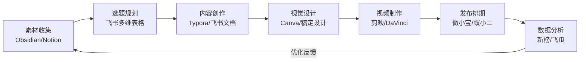
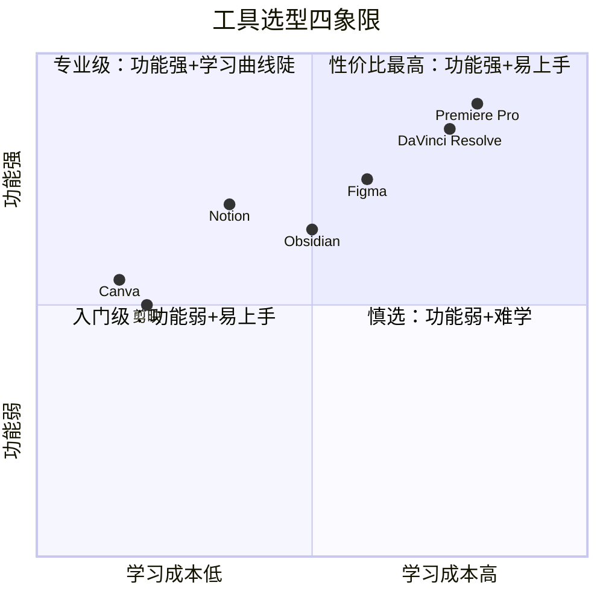
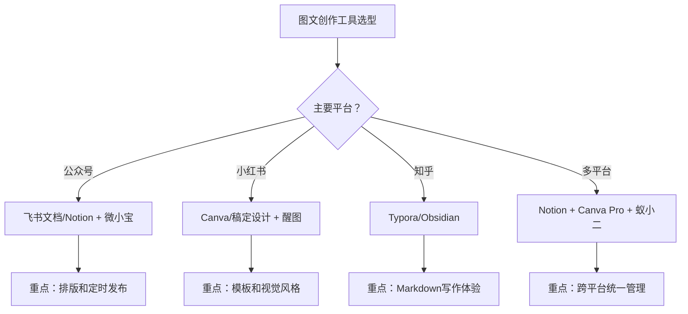
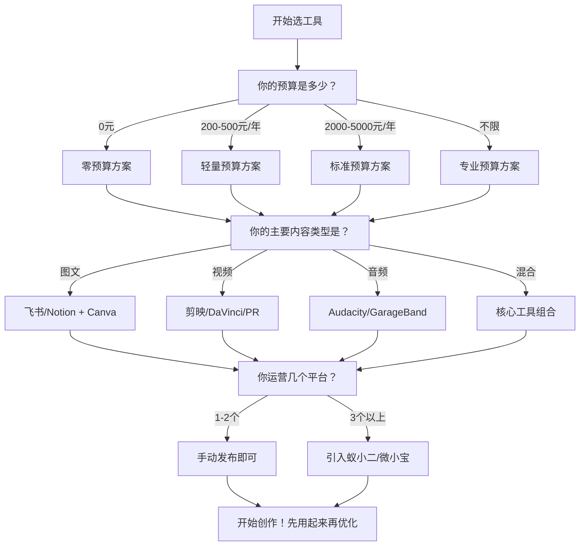
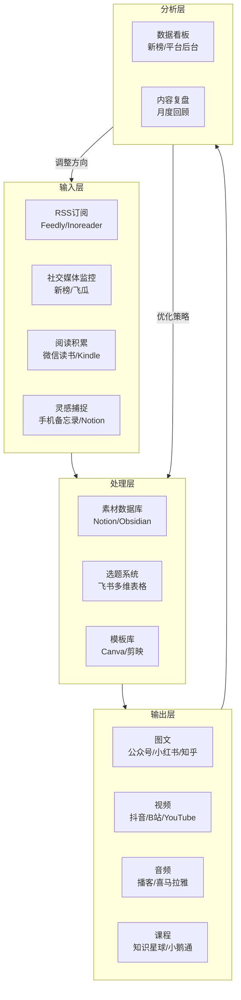

## 五、工具选择建议

前面四节分别介绍了内容创作工具、社交媒体管理工具、学习资源和硬件设备。但工具列表再丰富，如果不知道如何选择和组合，对你的帮助也有限。本节的核心任务是：帮你建立一套**工具选型的决策框架**，然后按不同阶段、不同场景、不同预算给出具体的组合方案，最后告诉你工具使用中常见的坑和正确的迭代策略。

### 5.1 工具选型的底层逻辑

在选工具之前，先理解三个底层原则。这三个原则决定了你选工具的效率——用对了，省时省钱；用错了，越买越焦虑。

#### 5.1.1 原则一：先有内容，再有工具

工具是放大器，不是发动机。一条用剪映剪的短视频，如果选题好、表达清晰，播放量可以碾压用PR精心制作但内容空洞的视频。很多新手犯的第一个错误就是：还没产出10条内容，就花大量时间研究工具、买设备、学软件。

**正确的顺序**：先用最低成本的工具跑通"创作→发布→反馈"的闭环，等到你明确知道"哪个环节需要提升"时，再针对性地升级工具。

具体判断标准：

| 阶段 | 判断依据 | 行动 |
|------|----------|------|
| 冷启动期（0-50条内容） | 还没找到稳定的内容方向 | 用免费工具，专注找感觉 |
| 验证期（50-200条内容） | 有了方向，但效率是瓶颈 | 升级1-2个核心工具 |
| 增长期（200条以上） | 明确知道哪个环节拖后腿 | 按需逐步升级全套工具 |

#### 5.1.2 原则二：工具组合 > 单个工具

没有一个工具能解决所有问题。真正高效的做法是建立一条**工具链**——每个工具负责一个环节，环节之间数据能顺畅流转。

一个典型的内容创作工具链如下：

评估工具链的关键指标是**环节之间的衔接成本**。如果从A工具导出的数据需要手动复制粘贴到B工具，这个衔接成本就很高。理想状态是：Notion写好文案→一键复制到剪映的字幕→Canva做的封面直接导入剪映→导出后通过蚁小二一键分发到多个平台。

#### 5.1.3 原则三：学习成本是隐性成本

一个功能强大但学习曲线陡峭的工具，如果你只用到它20%的功能，那80%的学习时间就是浪费。选工具时要评估三个维度：

**实操建议**：选择工具时，问自己一个问题——"我能在30分钟内用这个工具产出一条可用的内容吗？"如果答案是"不能"，说明学习成本太高，先从更简单的工具开始。

### 5.2 选型评估维度详解

面对琳琅满目的工具，如何科学地评估和对比？以下是六个核心评估维度。

#### 5.2.1 功能匹配度

功能匹配度是指工具的核心功能是否覆盖你的核心需求。不是功能越多越好，而是**你需要的功能是否足够好用**。

| 需求场景 | 核心功能需求 | 推荐工具 | 不推荐 |
|----------|-------------|----------|--------|
| 公众号长文写作 | 排版、插入图片、预览 | 飞书文档、石墨文档 | Word（格式兼容性差） |
| 小红书图文 | 模板丰富、尺寸适配 | Canva、稿定设计 | PS（杀鸡用牛刀） |
| 抖音短视频 | 模板、字幕、特效 | 剪映 | PR（学习成本太高） |
| B站长视频 | 精细剪辑、调色 | DaVinci Resolve、PR | 剪映（功能不够） |
| 播客制作 | 多轨编辑、降噪 | Audacity、GarageBand | 剪映（音频功能弱） |
| 多平台分发 | 一键同步、排期 | 蚁小二、微小宝 | 手动逐个平台发 |

#### 5.2.2 成本效益比

成本不只是购买价格，还包括**学习时间的机会成本**和**切换工具的迁移成本**。

**免费工具的真实成本**：

| 工具 | 货币成本 | 学习时间 | 隐性成本 |
|------|----------|----------|----------|
| 剪映 | 0元 | 2-3小时 | 部分功能有水印，导出格式有限 |
| Canva免费版 | 0元 | 1-2小时 | 无法使用Brand Kit，无法Magic Resize |
| 飞书文档 | 0元 | 30分钟 | 数据在字节跳动服务器，导出格式有限 |
| Audacity | 0元 | 3-5小时 | 界面较旧，部分操作不够直觉 |
| Obsidian | 0元 | 5-10小时 | 学习曲线较陡，社区插件质量参差不齐 |

**付费工具的投资回报判断**：

一个工具是否值得付费，取决于它能否帮你节省时间或提升质量。计算公式：

工具月费 ≤ 你的时薪 × 每月节省的小时数

举例：如果你的时薪是100元，Canva Pro的Magic Resize功能每月帮你节省5小时排版时间，那90元/年的费用（约7.5元/月）就非常值得。反过来，如果你每月只节省10分钟，那免费版就够了。

#### 5.2.3 生态与协作

工具的生态系统决定了它的长期价值。一个有活跃社区、丰富模板、持续更新的工具，比一个功能类似但没有生态的工具更有价值。

| 维度 | 评估要点 | 示例 |
|------|----------|------|
| 模板生态 | 是否有大量可复用的模板 | Canva（100万+模板）> 稿定设计（数十万模板） |
| 插件/扩展 | 是否支持功能扩展 | Obsidian（1000+插件）> Notion（集成有限） |
| 社区活跃度 | 遇到问题能否快速找到解决方案 | Notion社区 > 石墨文档社区 |
| 更新频率 | 工具是否在持续迭代 | 剪映（高频更新）> 很多老牌软件 |
| 数据导出 | 你的数据能否方便地迁移走 | Obsidian（本地Markdown）> Notion（需要导出） |

**数据所有权提醒**：优先选择数据存储在本地或开放格式的工具。如果你所有的内容都在某个在线平台上，一旦该平台调整政策、涨价或关闭，你可能面临巨大的迁移成本。

#### 5.2.4 跨平台支持

如果你需要在电脑、手机、平板之间切换工作，跨平台支持就非常重要。

| 工具 | Windows | macOS | Linux | iOS | Android | Web |
|------|---------|-------|-------|-----|---------|-----|
| Notion | ✅ | ✅ | ❌ | ✅ | ✅ | ✅ |
| 飞书文档 | ✅ | ✅ | ❌ | ✅ | ✅ | ✅ |
| Obsidian | ✅ | ✅ | ✅ | ✅ | ✅ | ❌ |
| Canva | ❌ | ❌ | ❌ | ✅ | ✅ | ✅ |
| 剪映 | ✅ | ✅ | ❌ | ✅ | ✅ | ✅ |
| Typora | ✅ | ✅ | ✅ | ❌ | ❌ | ❌ |
| DaVinci Resolve | ✅ | ✅ | ✅ | ❌ | ❌ | ❌ |

#### 5.2.5 AI能力集成

2024年以后，AI能力已经成为工具选型的重要考量。一个内置AI能力的工具，通常比"工具+外部AI"的组合更高效。

| 工具 | 内置AI能力 | 说明 |
|------|-----------|------|
| 剪映 | 自动字幕、智能抠图、图文成片 | AI功能最全面的视频工具 |
| Canva | Magic Write、Magic Eraser、Text to Image | 设计领域的AI先锋 |
| Notion | Notion AI（写作辅助、摘要、翻译） | 内置AI助手，无缝集成 |
| 飞书文档 | My AI（写作辅助、智能摘要） | 字节跳动AI能力加持 |
| WPS | AI写作、AI排版、AI数据分析 | 国产办公AI集成度最高 |

### 5.3 按创作者阶段的工具方案

#### 5.3.1 零基础新手套装（总投入：0元）

适用人群：刚起步，还没确定内容方向，想先跑通流程。

| 环节 | 推荐工具 | 选择理由 |
|------|----------|----------|
| 写作 | 飞书文档 | 免费、协作好、上手快 |
| 图片设计 | Canva免费版 + 醒图 | Canva做排版，醒图修照片 |
| 视频编辑 | 剪映 | 免费、模板多、AI字幕 |
| 音频处理 | Audacity | 免费、功能完整 |
| 数据分析 | 平台自带数据后台 | 公众号/抖音/小红书都有免费数据面板 |
| AI辅助 | Kimi + 豆包 | 免费、中文能力强 |
| 排期管理 | 手动发布 | 初期内容少，不需要自动化工具 |

**新手常见错误**：

- 错误一：一开始就买专业软件。你连自己的内容方向都没确定，PR和Photoshop只会分散你的注意力。
- 错误二：同时开太多平台。先选一个平台深耕，用免费工具跑通全流程，再扩展。
- 错误三：花大量时间学工具而不是做内容。工具学习遵循"用到再学"原则，不要系统性地看教程。

#### 5.3.2 进阶创作者套装（总投入：约200-400元/年）

适用人群：已有50条以上内容产出，明确了方向，需要提升效率和质量。

| 环节 | 推荐工具 | 费用 | 升级理由 |
|------|----------|------|----------|
| 写作 | Notion（免费版或Plus） | 0-70元/月 | 数据库驱动的内容管理比飞书更灵活 |
| 图片设计 | Canva Pro | 约90元/年 | Brand Kit统一品牌风格，Magic Resize省时 |
| 视频编辑 | DaVinci Resolve免费版 | 0元 | 调色能力远超剪映，适合追求质感 |
| 音频处理 | Audacity | 0元 | 够用，不需要升级 |
| 数据分析 | 新榜基础版 | 免费 | 行业数据和竞品分析 |
| AI辅助 | ChatGPT Plus或Kimi+ | 约140元/月 | 综合能力更强，适合深度创作 |
| 排期管理 | 微小宝免费版 | 0元 | 公众号定时发布 |

**进阶阶段的关键决策点**：

这个阶段最重要的不是买更多工具，而是**建立工具之间的衔接流程**。具体来说：

1. **统一素材管理**：选定一个主力工具（Notion或Obsidian），所有素材统一归档
2. **建立模板库**：把反复使用的排版、封面、字幕样式做成模板，复用而非重复劳动
3. **标准化发布流程**：从写作→设计→发布→数据复盘，每一步用什么工具、怎么交接，形成固定流程

#### 5.3.3 专业创作者/全职自媒体套装（总投入：约1000-2000元/月）

适用人群：全职做内容，有稳定的产出节奏，需要专业级工具支撑规模化运营。

| 环节 | 推荐工具 | 费用 | 专业价值 |
|------|----------|------|----------|
| 写作 | Notion Pro + Obsidian | 约70元/月 | 全链路知识管理，双链笔记构建素材网络 |
| 图片设计 | Figma + Photoshop | 约300元/月 | Figma搭建品牌视觉系统，PS精细处理 |
| 视频编辑 | Premiere Pro 或 Final Cut Pro | 200元/月或一次性1998元 | 多机位、动态链接、专业调色 |
| 音频处理 | Adobe Audition | 约200元/月 | 频谱编辑、专业降噪、多轨混音 |
| 数据分析 | 新榜 + 飞瓜 | 约500元/月 | 全平台数据监测和竞品分析 |
| AI辅助 | ChatGPT Plus + Midjourney | 约210元/月 | 文字+图片AI全覆盖 |
| 排期管理 | 微小宝 + 蚁小二 | 约200元/月 | 多平台自动化发布 |

**专业阶段的核心理念**：这个阶段的投入产出比取决于**工具链的自动化程度**。每省下的一小时手动操作，都可以用来创作更多内容或提升内容质量。

### 5.4 按内容类型的工具选型

不同的内容类型对工具的需求差异很大。以下是按内容类型的详细选型建议。

#### 5.4.1 图文内容创作者

适用平台：微信公众号、小红书、知乎、头条号

核心需求：写作效率、排版美观、封面设计

**工具组合实例（公众号 + 小红书）**：

1. 用Notion建立选题库和素材库
2. 在飞书文档中写长文（公众号版本）
3. 用Canva制作公众号封面和小红书配图
4. 用醒图处理产品/人像照片
5. 把长文精简改写为小红书笔记
6. 用微小宝排期公众号，手动发小红书

#### 5.4.2 视频内容创作者

适用平台：抖音、快手、B站、YouTube

核心需求：剪辑效率、视觉质感、音频质量

| 平台特征 | 推荐工具组合 | 说明 |
|----------|-------------|------|
| 抖音/快手（竖屏短视频） | 剪映 + 手机 | 模板驱动，追求速度，一天多更 |
| B站（横屏中长视频） | DaVinci Resolve + Audacity | 追求画面质感和音频品质 |
| YouTube（高质量长视频） | PR/FCP + Audition + Photoshop | 全流程专业化 |
| 多平台运营 | 剪映（日常）+ DaVinci（精品）| 80%用剪映快速出，20%用达芬奇打磨 |

**视频创作的"80/20"策略**：

不要每条视频都用专业工具精心制作。正确的做法是：

- **80%的日常内容**：用剪映快速产出，保持更新频率
- **20%的精品内容**：用DaVinci Resolve或PR精心制作，打造标杆作品
- 精品内容的数据表现会带动整个账号的权重，日常内容保持粉丝活跃度

#### 5.4.3 播客/音频内容创作者

适用平台：小宇宙、喜马拉雅、Apple Podcasts、网易云音乐

核心需求：录音质量、后期处理、分发效率

| 录音场景 | 推荐工具 | 配套硬件 |
|----------|----------|----------|
| 居家单人播客 | Audacity/GarageBand | 舒尔MV7 + 简易声学处理 |
| 外出采访 | 手机录音 + 后期处理 | 罗德Wireless Go II |
| 多人远程对谈 | Riverside.fm/Zencastr | 各自用USB麦克风 |
| 专业录音棚级 | Adobe Audition | 专业声卡 + 电容麦 + 声学装修 |

**播客工具链**：

录音（Audacity/GarageBand）→ 后期处理（降噪→压缩→均衡）→ 封面设计（Canva）→ 发布（小宇宙/喜马拉雅）→ 数据分析（平台后台）

#### 5.4.4 知识付费/课程创作者

适用平台：知识星球、小鹅通、得到、网易云课堂

核心需求：课程制作、内容交付、学员管理

| 工具类型 | 推荐工具 | 用途 |
|----------|----------|------|
| 课程录制 | OBS Studio（录屏）+ 剪映 | 录制讲解视频 |
| 课件制作 | Canva/PPT + Notion | 制作PPT和图文讲义 |
| 课程交付 | 小鹅通/知识星球 | 上架和销售课程 |
| 社群管理 | 企业微信 + 知识星球 | 学员互动和答疑 |
| 内容保护 | 平台自带防录屏 | 防止课程被盗版 |

### 5.5 按预算的工具组合方案

#### 5.5.1 零预算方案（0元/年）

适合：学生、副业试水、兴趣驱动的创作者

| 环节 | 工具 | 替代方案 |
|------|------|----------|
| 写作 | 飞书文档 | 石墨文档、WPS |
| 设计 | Canva免费版 | 稿定设计免费版 |
| 视频 | 剪映 | CapCut（海外版） |
| 音频 | Audacity | GarageBand（Mac） |
| AI辅助 | Kimi + 豆包 | 通义千问、文心一言 |
| 数据 | 平台自带后台 | 新榜免费版 |
| 排期 | 手动发布 | — |

**零预算的核心策略**：用时间换金钱。免费工具需要更多手动操作，但如果你的时间充裕（比如学生），这是最佳起步方式。

#### 5.5.2 轻量预算方案（200-500元/年）

适合：副业创作者、有少量收入的自媒体人

| 工具 | 年费 | 为什么值得付费 |
|------|------|---------------|
| Canva Pro | 约90元/年 | Brand Kit + Magic Resize，效率提升最明显的工具 |
| Notion Plus | 约70元/月（按需开通） | 更大的文件上传和协作人数 |
| Typora | 约90元（一次性） | Markdown写作体验最佳 |
| **合计** | **约250-450元/年** | — |

**轻量预算的核心策略**：把钱花在**效率提升最明显**的地方。Canva Pro的Magic Resize功能，如果你同时运营3个以上平台，一年能节省几十小时的排版时间，90元的投入回报率极高。

#### 5.5.3 标准预算方案（2000-5000元/年）

适合：有稳定收入的全职/半职创作者

| 工具 | 年费 | 核心价值 |
|------|------|----------|
| Canva Pro | 约90元/年 | 设计效率 |
| ChatGPT Plus | 约1680元/年 | AI创作辅助 |
| 新榜基础付费版 | 约1000元/年 | 数据分析 |
| DaVinci Resolve Studio | 约2500元（一次性） | 专业视频制作 |
| **合计** | **约3000-5000元/年** | — |

#### 5.5.4 专业预算方案（1-2万元/年及以上）

适合：全职自媒体人、小型工作室

| 工具组合 | 年费 | 核心价值 |
|----------|------|----------|
| Adobe全家桶（PR+PS+AU） | 约12000元/年 | 专业级全链路 |
| Figma Professional | 约1200元/年 | 品牌视觉系统 |
| 新榜 + 飞瓜 | 约6000元/年 | 深度数据分析 |
| ChatGPT Plus + Midjourney | 约2500元/年 | AI全覆盖 |
| 蚁小二 + 微小宝 | 约2400元/年 | 多平台自动化 |
| **合计** | **约15000-25000元/年** | — |

### 5.6 特殊场景的工具选型

#### 5.6.1 技术型创作者（程序员、设计师、工程师）

技术型创作者有独特优势：可以用代码和开源工具搭建定制化的内容创作流水线。

| 需求 | 开源/技术方案 | 优势 |
|------|-------------|------|
| 博客写作 | Hugo/Jekyll + VS Code + Git | 版本管理、自动化部署 |
| 图表绘制 | Mermaid/PlantUML | 代码生成图表，可版本控制 |
| 视频剪辑 | FFmpeg + DaVinci Resolve | FFmpeg批量处理，达芬奇精细剪辑 |
| 截图美化 | Shottr（Mac）/ Flameshot（Linux） | 代码截图、带注释 |
| 数据可视化 | ECharts/D3.js | 可交互的数据图表 |
| 自动化发布 | GitHub Actions + 各平台API | CI/CD式的内容发布 |

**技术型创作者的独家武器**：用脚本自动化重复工作。比如写一个Python脚本，自动把Markdown文章转换为公众号格式（含排版），再通过API定时发布。

#### 5.6.2 企业/团队运营

团队运营和个人创作的工具选型逻辑完全不同，核心差异在于**协作**和**权限管理**。

| 需求 | 推荐工具 | 关键能力 |
|------|----------|----------|
| 内容协作 | 飞书文档 | 多人实时编辑、评论审批流程 |
| 项目管理 | 飞书项目/Notion | 任务分配、进度追踪 |
| 素材管理 | 阿里云OSS/七牛 | 团队共享素材库 |
| 品牌一致性 | Canva Brand Kit/Figma | 统一视觉规范 |
| 多账号管理 | 微小宝/蚁小二 | 多平台多账号管理 |
| 数据看板 | 新榜企业版 | 团队级数据监测 |

#### 5.6.3 海外市场创作者

如果你面向海外市场（YouTube、Instagram、TikTok、Twitter/X），工具选择会有显著差异。

| 环节 | 国内版工具 | 海外版工具 |
|------|-----------|-----------|
| 视频编辑 | 剪映 | CapCut（功能相同，面向海外） |
| 设计 | 稿定设计 | Canva（英文模板更丰富） |
| 写作 | 飞书文档 | Notion、Google Docs |
| 数据分析 | 新榜、飞瓜 | TubeBuddy、Social Blade、Hootsuite |
| AI辅助 | Kimi、豆包 | ChatGPT、Claude |
| 社群 | 企业微信、知识星球 | Discord、Patreon |
| 邮件营销 | — | Mailchimp、ConvertKit |

### 5.7 工具迭代与迁移策略

#### 5.7.1 什么时候该升级工具

不要为了升级而升级。以下是明确的升级信号：

| 信号 | 说明 | 行动 |
|------|------|------|
| 频繁遇到功能限制 | 免费版的功能已经无法满足需求 | 升级到付费版或换专业工具 |
| 手动操作占比过高 | 超过30%的时间花在重复性操作上 | 引入自动化工具或升级 |
| 协作需求增加 | 从一个人变成团队运营 | 升级到支持协作的工具 |
| 内容质量遇到瓶颈 | 工具限制了内容质量的上限 | 升级到专业级工具 |
| 数据驱动决策 | 需要更精细的数据分析 | 引入专业数据工具 |

#### 5.7.2 工具迁移的注意事项

从一个工具迁移到另一个工具，最大的风险是**数据丢失和工作流中断**。

**迁移前的检查清单**：

1. **数据导出**：旧工具的数据能否完整导出？格式是否兼容新工具？
2. **历史内容**：已发布的内容需要迁移吗？还是只迁移未来的创作流程？
3. **学习成本**：新工具的学习周期有多长？是否安排了过渡期？
4. **并行期**：建议新旧工具并行使用2-4周，确认新工具完全可用后再停用旧工具
5. **备份**：迁移前一定要完整备份所有数据

**典型的迁移路径**：

| 迁移方向 | 触发原因 | 注意事项 |
|----------|----------|----------|
| 飞书→Notion | 需要更灵活的数据库功能 | 注意Notion的文件上传限制 |
| 剪映→DaVinci Resolve | 需要更专业的调色和剪辑 | 学习周期约2-4周 |
| Canva免费→Pro | 需要Brand Kit和Magic Resize | 同一工具升级，无迁移成本 |
| 手动排期→蚁小二 | 多平台运营效率低下 | 需要配置各平台账号授权 |
| Audacity→Audition | 需要更专业的音频处理 | 操作逻辑差异较大，需要适应期 |

#### 5.7.3 避免"工具焦虑"

工具焦虑的典型症状：

- 不断搜索"最好用的XX工具"，收藏了几十篇测评但一条内容都没做
- 每隔一两个月就换一套工具，工作流始终无法稳定
- 看到别人用某个新工具就心痒，觉得自己用的工具落后了

**对抗工具焦虑的方法**：

1. **锁定工具组合**：选好一套工具后，至少用3个月再考虑是否更换
2. **关注内容而非工具**：每天的创作时间应该远多于工具研究时间（建议至少8:2）
3. **接受"够用就好"**：80%的情况下，中等工具+持续输出 > 顶级工具+偶尔输出
4. **定期回顾**：每季度花1小时审视工具组合，看看有没有明确的瓶颈需要解决

### 5.8 工具选择决策流程图

把前面所有的分析浓缩成一张决策图，帮你快速做出选择：

### 5.9 常见误区与纠正

#### 误区一：工具决定内容质量

**现实**：工具只是放大器。一个有深度思考和独特表达的创作者，用最简单的工具也能产出优质内容。反过来，一个没有核心观点的人，用再专业的工具也只是做出精美的空壳。

**纠正方法**：在考虑升级工具之前，先问自己——"我的内容质量瓶颈真的是工具造成的吗？"大多数时候，瓶颈在于选题深度、写作功底或表达能力，而不是工具。

#### 误区二：一步到位买最贵的

**现实**：你买了PR不代表你能做出专业视频，你买了Photoshop不代表你能做出专业设计。工具的能力上限很高，但你的使用深度取决于你投入的学习时间。

**纠正方法**：遵循"螺旋式升级"策略——免费工具→发现瓶颈→针对性升级→再用一段时间→再发现瓶颈→再升级。每次升级只解决最紧迫的问题。

#### 误区三：每个环节都要用"最好的"工具

**现实**：如果你在每个环节都用"最好的"工具，你的工具链会变得极其复杂，光是学习和维护这些工具就要消耗大量精力。

**纠正方法**：识别你的核心产出环节（比如你是视频创作者，那视频剪辑就是核心环节），在核心环节投入最好的工具，在非核心环节用"够用就好"的工具。

#### 误区四：忽略数据备份和导出

**现实**：很多创作者把所有内容都放在一个在线平台上，从不做备份。一旦平台出问题（封号、调整政策、涨价、关闭），所有积累可能一夜归零。

**纠正方法**：

1. 重要内容同时保存在本地一份（Markdown/Word格式）
2. 定期导出在线平台的数据（Notion、飞书都支持导出）
3. 图片和视频素材在本地和云端各保留一份
4. 优先选择数据格式开放的工具（比如Obsidian用本地Markdown，迁移零成本）

#### 误区五：忽视工具之间的兼容性

**现实**：每个工具单独看都很好用，但组合在一起时可能出现格式不兼容、数据无法互通的问题。

**纠正方法**：在选定工具组合后，用一条真实的内容跑一遍完整流程（从创作到发布），测试每个环节之间的衔接是否顺畅。发现问题后调整工具选择或增加中间转换步骤。

### 5.10 进阶：构建你的个人内容创作系统

当你的个人品牌运营进入成熟阶段，你需要的不再是零散的工具，而是一套**系统化的内容创作基础设施**。

#### 5.10.1 系统架构

#### 5.10.2 系统化运营的关键要素

| 要素 | 说明 | 工具支撑 |
|------|------|----------|
| 内容日历 | 提前规划2-4周的选题 | 飞书多维表格/Notion数据库 |
| 素材库 | 持续积累案例、数据、金句 | Obsidian双向链接/Notion |
| 模板库 | 封面模板、排版模板、脚本模板 | Canva/剪映 |
| 发布SOP | 每个平台的发布流程标准化 | Notion模板/飞书文档 |
| 数据复盘 | 每周/每月回顾数据表现 | 新榜/平台后台 |
| 内容复用 | 一鱼多吃——长文改短、图文改视频 | AI工具辅助改写 |

#### 5.10.3 "一鱼多吃"的工具链

一条优质内容应该在多个平台以不同形式分发，最大化内容投资回报：

| 原始内容 | 改写形式 | 工具 |
|----------|----------|------|
| 3000字深度文章 | → 公众号长文 | 飞书文档排版 |
| 同一内容 | → 小红书精华笔记（800字+9图） | Canva做图 |
| 同一内容 | → 知乎回答 | Typora输出 |
| 同一内容 | → 抖音口播视频（60秒） | 剪映图文成片 |
| 同一内容 | → B站深度视频（10分钟） | DaVinci Resolve |
| 同一内容 | → 播客音频 | Audacity/AI语音 |
| 同一内容 | → 朋友圈金句海报 | Canva模板 |

这套"一鱼多吃"的工作流，可以让一条内容触达5-7个平台的受众，而额外的改写工作量通常只有原始创作的20-30%。

### 5.11 本节核心要点总结

| 要点 | 说明 |
|------|------|
| 先有内容，再有工具 | 工具是放大器，不是发动机 |
| 工具组合 > 单个工具 | 建立高效的工具链比选单个最好的工具更重要 |
| 学习成本是隐性成本 | 功能强大但学不会的工具等于零 |
| 螺旋式升级 | 免费起步→发现瓶颈→针对性升级 |
| 数据安全优先 | 优先选择数据可导出、格式开放的工具 |
| 避免工具焦虑 | 80%中等工具+持续输出 > 顶级工具+偶尔输出 |
| 系统化思维 | 从零散工具进化到个人内容创作系统 |
| 一鱼多吃 | 一条内容多平台多形式分发，最大化投资回报 |

***
