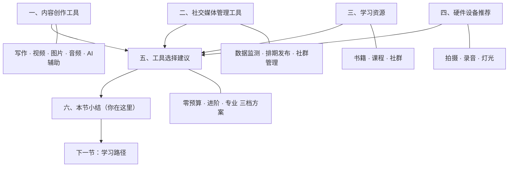
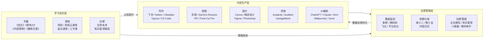

## 本节小结

本节从内容创作工具、社交媒体管理工具、学习资源、硬件设备四个维度，系统梳理了个人品牌建设所需的完整工具栈。工具是个人品牌的"基础设施"——选对工具、用好工具，能让你的创作效率提升一个数量级；但工具永远是手段而非目的，内容质量和持续输出才是个人品牌的核心驱动力。

下面从三个层面做总结：全节知识脉络回顾、核心原则提炼、以及下一节的衔接预告。

### 6.1 全节知识脉络回顾

本节五个子章节构成了一个完整的"工具选型→使用→决策"知识体系：

**第一个子章节——内容创作工具**，是整个工具栈的生产力核心。它覆盖了从文字到视频、从图片到音频的全部内容形态，并且引入了AI辅助创作这个关键变量。核心逻辑是：先明确你的主力内容形态（文字型、视频型、图文型、音频型），再选择对应的工具组合。写作工具从飞书/Notion到Obsidian/Typora，视频工具从剪映到PR/达芬奇，图片工具从Canva到Figma/PS，音频工具从Audacity到Audition——每一类都提供了从入门到专业的完整选型路径。AI工具（ChatGPT、Kimi、Midjourney等）则是横跨所有内容形态的效率放大器，贯穿选题→创作→改写→多平台适配的全流程。

**第二个子章节——社交媒体管理工具**，解决的是内容"做出来之后"的运营效率问题。它围绕三个核心场景展开：数据监测（新榜、蝉妈妈、飞瓜等，让你用数据驱动决策）、排期与多平台分发（蚁小二、微小宝、内容日历，让你的发布有节奏、有计划）、社群管理与私域运营（企业微信、知识星球、小报童，让你的核心受众沉淀为长期资产）。这部分的关键洞察是：公域流量靠内容，私域流量靠运营；社群不是拉个群就完事，而是需要持续的价值输出和精细化管理。

**第三个子章节——学习资源**，为工具使用提供了"软性支撑"。工具只是载体，真正决定你能否用好工具的是你的知识体系和认知水平。推荐的书籍（《定位》《影响力》《内容营销》等）解决"道"的层面——理解品牌建设的底层逻辑；在线课程（得到、网易云课堂、起点课堂等）解决"术"的层面——掌握具体操作技能；社群与社区（生财有术、知识星球等）解决"场"的层面——获得同行交流和持续学习的环境。

**第四个子章节——硬件设备推荐**，是内容创作的物理基础。对于视频型创作者，拍摄设备（手机/相机+稳定器）、录音设备（无线麦克风/USB麦克风）、灯光设备（LED补光灯）三大件缺一不可。关键原则是：不要在内容能力不足时就投入大量硬件，手机+自然光足以起步；当你的内容质量和创作频率稳定后，再根据瓶颈有针对性地升级设备。

**第五个子章节——工具选择建议**，将前四个子章节的内容整合为三档可直接执行的方案：零预算方案（0元）、进阶方案（月预算300元以内）、专业方案（月预算1000元以内）。这三档方案不是简单的"便宜到贵"，而是对应了个人品牌建设的三个阶段——起步验证期、成长放大期、专业运营期。每个阶段的工具组合都经过了实际创作者的验证。

### 6.2 六条核心原则

回顾整节内容，以下六条原则贯穿始终，值得反复强调：

**原则一：先免费后付费，先验证后投入。**

几乎所有推荐的工具都有免费版本或试用期。在个人品牌建设的早期，你的首要任务是验证方向——确认你的内容有人看、你的定位有人认、你的风格能持续。在这个阶段，免费工具完全够用。只有当你明确感受到免费版的功能瓶颈（比如Canva免费版缺少Brand Kit、剪映免费版缺少高级素材），且这个瓶颈确实阻碍了你的内容质量或创作效率时，才值得付费升级。盲目购买专业版工具，在你还没有稳定产出时，只会增加沉没成本和心理负担。

**原则二：内容为王，工具为辅。**

这是本节最重要的底层逻辑。工具提升的是效率，不是质量。一个用剪映+手机产出100条优质短视频的创作者，个人品牌建设效果远强于一个用PR+专业相机只做出10条的人。把80%的精力花在内容思考上（选题、角度、表达、价值），20%的精力花在工具优化上。当你发现"内容已经够好了，但制作效率太低"时，才是升级工具的正确时机。

**原则三：工具在精不在多。**

每个类别选择1-2个核心工具，深入掌握其80%以上的功能，比浅尝辄止地使用10个工具高效得多。工具切换本身有成本——学习新界面、迁移数据、适应新工作流。选定工具后，坚持使用至少3个月，形成肌肉记忆和稳定工作流，再评估是否需要更换。

**原则四：工具链的衔接比单个工具更重要。**

单个工具好用不够，工具之间的数据流转是否顺畅决定了整体效率。一套理想的工具链应该是：素材收集（Obsidian/Notion）→ 选题规划（飞书多维表格/Notion数据库）→ 内容创作（写作工具/视频工具）→ 视觉设计（Canva/稿定设计）→ 排期发布（蚁小二/微小宝）→ 数据监测（平台后台+新榜）→ 复盘优化（回到选题规划）。每个环节的输出能无缝成为下一个环节的输入，才是真正的高效工作流。

**原则五：按阶段匹配工具，不要越级消费。**

个人品牌建设是一个渐进过程，工具需求也随阶段变化。入门期（0-1000粉丝）的核心是"把内容做出来"，只需要最基础的免费工具；成长期（1000-1万粉丝）需要开始多平台布局和数据驱动，引入基础付费工具；成熟期（1万-10万粉丝）需要系统化运营和私域沉淀，工具栈全面升级；专业期（10万+粉丝）需要全链路工具链和团队协作。越级消费（入门期就买专业工具）不仅浪费钱，还会分散你对核心任务——内容创作——的注意力。

**原则六：定期审计，动态调整。**

每季度花1小时检查你在用的所有工具：哪些每天都在用？哪些注册后就没打开过？哪些的付费功能你真正用到了？砍掉使用频率低的、性价比差的，合并功能重叠的。工具栈应该是动态精简的，而不是只增不减的。

### 6.3 常见误区警示

结合本节各子章节中提到的误区，这里做一个统一汇总：

| 误区 | 正确做法 |
|------|---------|
| 安装一堆工具，每个只用20%功能 | 每类选1个核心工具，深入掌握80%功能 |
| 看到别人用某工具产出好内容就跟风 | 内容质量来自思考深度，不是工具；选匹配自己需求和习惯的 |
| 全平台同一内容一键分发不做适配 | 至少调整标题、封面、标签，必要时调整内容结构 |
| 买专业设备却内容能力不足 | 手机+自然光起步，等内容质量稳定后再针对性升级硬件 |
| 建了社群却不持续运营 | 建群前想清楚能提供什么持续价值；精力有限宁可不建 |
| 过度依赖工具数据做决策 | 第三方工具有误差，数据是参考而非决策依据，结合直觉和粉丝反馈 |
| 忽视工具之间的数据流转 | 搭建完整的工具链工作流，让每个环节的输出无缝衔接下一环节 |
| 只研究工具不产出内容 | 工具研究时间不超过总创作时间的10%，"做出来"比"做得完美"更重要 |

### 6.4 个人品牌工具栈全景图

将本节所有推荐的工具按照"内容生产→运营管理→学习成长"三条主线整合，形成如下全景图：

### 6.5 行动检查清单

在进入下一节之前，用以下清单确认你对本节内容的掌握程度：

**认知层面（道）：**
- [ ] 理解"工具是手段不是目的"的核心逻辑
- [ ] 理解"先免费后付费、先验证后投入"的阶段化思维
- [ ] 理解"内容为王，工具为辅"的优先级排序
- [ ] 理解"工具链衔接比单个工具更重要"的系统思维

**决策层面（法）：**
- [ ] 能根据自己的主力内容形态选择对应的工具组合
- [ ] 能根据自己的粉丝量级和预算匹配合适的工具档位
- [ ] 能识别自己的工具瓶颈并做出针对性升级决策
- [ ] 能搭建从素材收集到数据复盘的完整工作流

**操作层面（术）：**
- [ ] 已注册并开始使用至少1个写作/创作工具
- [ ] 已注册并开始使用至少1个数据分析工具（至少是平台自带后台）
- [ ] 已建立基础的内容排期表（哪怕只是在线表格）
- [ ] 已了解AI辅助创作工具的基本用法

**硬件层面（器）：**
- [ ] 已确认自己的拍摄设备方案（手机起步即可）
- [ ] 已了解录音和灯光设备的基本选型逻辑
- [ ] 明确"硬件升级的时机是内容质量稳定之后"

### 6.6 向下一节过渡

本节解决了"用什么工具"的问题，下一节——**学习路径**——将解决"怎么学、学什么、按什么顺序学"的问题。如果说工具是个人品牌的"硬件基础设施"，那么学习路径就是"软件操作系统"——它告诉你如何将这些工具真正转化为个人品牌建设的能力。

下一节将提供一条从零到一的完整学习路径，覆盖：品牌定位的方法论、内容创作的核心技能、平台运营的实操策略、商业变现的具体路径。每一个阶段都有明确的学习目标、推荐资源和里程碑检查点，确保你不会在信息洪流中迷失方向。
