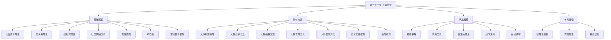
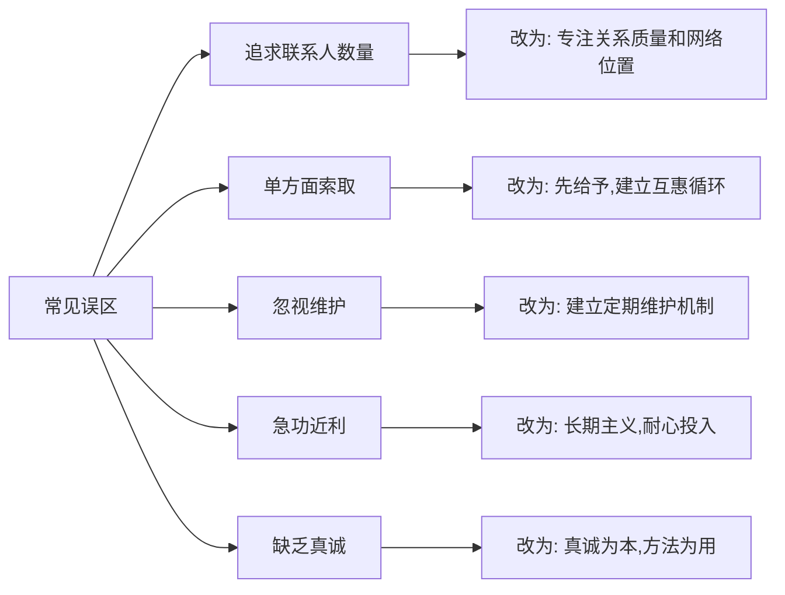

# 第二十一章 人脉经营

## 本章导读

人脉经营是一门被严重误解的学问。

多数人对"人脉"的第一反应是名片夹里的联系人数量、微信好友列表的长度、或是饭局上认识了多少老板。这种理解不仅是肤浅的，而且是有害的——它导致无数人在无效社交中消耗大量时间和精力，最终两手空空。

真正的人脉经营，是指你在一个社会关系网络中所占据的位置、所拥有的影响力、以及在关键时刻能够调动的资源总量。它不是"认识谁"的问题，而是"谁愿意帮你、谁能帮你、以及你如何让这种可能性最大化"的问题。

哈佛商学院的一项追踪研究显示，在职业生涯中获得晋升的人，其核心优势往往不是技术能力最强，而是社交网络最有效——他们能够在正确的时间连接到正确的人，获取正确的信息。斯坦福大学的研究者进一步指出，一个人的收入水平，只有12.5%可以用知识和技能来解释，剩下的87.5%归因于"人际工程"（human engineering）——即与人打交道的能力和社交网络的质量。

本章不是一本"社交技巧手册"。你不会在这里学到如何敬酒、如何寒暄、如何在电梯里向领导做自我介绍。本章要做的事情远比这些更有价值：**帮助你建立一套系统化的人脉经营认知框架，让你理解社交网络的底层运行规律，从而在实践中做出更明智的决策。**

## 为什么需要系统化的人脉经营？

在信息爆炸的时代，"人脉就是信息"这句话从未如此准确。一个人所掌握的信息质量，很大程度上取决于他所处的社交网络结构。以下是系统化人脉经营的四重价值：

### 第一重：信息不对称优势

绝大多数有价值的信息——未公开的职位机会、行业趋势的早期信号、关键决策者的偏好——都不是通过公开渠道传播的，而是通过人际网络中的信任通道传递。斯坦福社会学家马克·格兰诺维特的经典研究发现，56%的求职者是通过个人关系找到工作的，其中83%是通过"偶尔联系"的弱关系而非亲密好友。

这意味着，你的人脉网络结构——而不仅仅是规模——决定了你能获取什么样的信息。一个拥有跨行业弱关系的人，在信息获取上天然优于一个只在同行业强关系中打转的人。

### 第二重：信任降低交易成本

经济学的核心问题之一是交易成本，而交易成本的最大来源是信任缺失。当两个人之间存在信任关系时，合作的谈判成本、监督成本和执行成本都会大幅下降。

人脉网络本质上是一个分布式的信任系统。你的每一次守约、每一次帮助他人、每一次兑现承诺，都在这个系统中积累"信任资产"。这些资产在你需要合作、融资、招聘、推荐时，能够直接转化为经济价值。

### 第三重：资源杠杆效应

一个人的个人资源是有限的，但人脉网络提供的资源杠杆是无限的。通过人脉网络，你可以：

- 用一个电话解决别人花三个月才能解决的问题
- 用一次介绍获得别人投一百份简历都得不到的面试机会
- 用一个建议避免别人踩几十万的坑

这种杠杆效应不是"走后门"，而是网络结构赋予的位置优势。占据关键网络位置的人，天然拥有更高的资源杠杆。

### 第四重：认知边界拓展

你的认知上限，约等于你日常交流的五个人的平均水平。这不是鸡汤，而是社交学习理论（Social Learning Theory）的核心发现。人是通过观察、模仿和互动来学习的，你周围的人决定了你的参照系和思维框架。

系统化的人脉经营意味着有意识地构建一个多元化的交流圈——在行业深度上有人可以切磋技术，在认知广度上有人可以跨界启发，在人生经验上有人可以指点迷津。这种认知拓展不是读几本书能替代的，因为它涉及隐性知识（tacit knowledge）的传递——那些"只可意会不可言传"的经验和直觉。

## 人脉经营的底层逻辑

在进入具体的理论和方法之前，有必要先理解人脉经营的三个底层逻辑，它们贯穿本章所有内容：

### 逻辑一：价值交换是基础

一切持久的人脉关系都建立在价值交换之上。这里的"价值"不仅仅是金钱或资源，还包括信息、情感支持、身份认同、知识分享等多种形式。单方面索取的关系注定不可持续，因为被索取的一方最终会选择退出。

关键在于：**你不需要在所有维度上都提供价值，但你必须在至少一个维度上是不可替代的。** 一个技术专家可以不善社交，但只要他在技术领域的判断力足够稀缺，就会有大量人脉自然向他汇聚。

### 逻辑二：网络位置比个人能力更关键

社会学家罗纳德·伯特的结构洞理论揭示了一个反直觉的规律：在社交网络中，占据关键位置（连接不同圈子的桥梁位置）的人，往往比圈子内部能力最强的人拥有更大的竞争优势。

这不是说能力不重要，而是说能力需要通过正确的网络位置才能充分变现。一个能力平庸但占据了关键网络位置的人，可能比一个能力卓越但困在单一圈子里的人获得更多机会。

### 逻辑三：长期博弈优于短期交易

人脉经营是一个长期博弈的过程。急功近利的做法——刚认识就推销产品、有事才找人、只在需要帮忙时出现——在短期内可能偶尔奏效，但长期来看一定会透支你的社交信用。

最优策略是"先付出后回报"的长期博弈：先帮助他人积累社交信用，在需要时自然地动用这些信用。这种策略看起来"慢"，但因为积累了深厚的信任基础，实际效果远好于短期投机。

## 本章知识地图

本章按照"理论→方法→工具→路径"的逻辑结构，分为以下四大板块：

### 第一板块：基础理论（道）

基础理论是整章的地基。没有理论指导的实践是盲目的——你可能做了很多"社交"，但不知道为什么有效、为什么无效，也无法在环境变化时做出调整。

本板块涵盖七大核心理论：

| 理论 | 核心提出者 | 核心观点 | 实践意义 |
|------|-----------|----------|----------|
| 社会资本理论 | 布迪厄、科尔曼、帕特南 | 人脉是一种可积累、可转化的资本 | 用"投资"思维经营人脉，而非"消费"思维 |
| 弱关系理论 | 格兰诺维特 | 不太熟的人比亲密好友更可能带来新机会 | 有意识地维护和拓展弱关系网络 |
| 结构洞理论 | 罗纳德·伯特 | 连接不同圈子的桥梁位置产生竞争优势 | 主动占据跨圈子的连接点 |
| 社交网络分析 | 多位学者 | 社交网络结构可量化分析 | 用可视化工具审视和优化自己的网络结构 |
| 互惠原则 | 西奥迪尼等 | 人类有强烈的回报他人的倾向 | 先付出，建立互惠预期 |
| 邓巴数 | 罗宾·邓巴 | 人类能维持的稳定社交关系上限约150人 | 有限精力下分层管理人脉 |
| 理论整合框架 | — | 将以上理论整合为统一的认知框架 | 形成系统化的人脉经营思维模型 |

这些理论之间不是孤立的，而是相互补充、层层递进的。社会资本理论回答"人脉是什么"，弱关系理论回答"什么样的人脉更有价值"，结构洞理论回答"什么样的网络位置更有优势"，社交网络分析回答"如何量化和优化网络结构"，互惠原则回答"人脉运作的底层心理机制是什么"，邓巴数回答"人脉经营的物理边界在哪里"。理解了这些理论，你就拥有了分析任何人脉问题的底层工具。

### 第二板块：具体方案（法与术）

理论落地需要方法论和实操工具。本板块提供从"零基础"到"高段位"的完整方案体系：

**人脉构建策略**——从零开始如何建立有效的人脉网络。不是泛泛地"多参加活动"，而是明确不同类型人脉的构建方法：行业导师、同行伙伴、跨领域连接、弱关系维护，每种类型都有针对性的策略。

**人脉维护方法**——建立关系只是开始，维护才是关键。本节提供具体的关系维护频率、互动方式、价值传递方法，包括如何利用CRM工具系统化管理人脉。

**人脉拓展渠道**——在哪里找到有价值的人？线上（专业社区、社交媒体、知识付费社群）和线下（行业会议、兴趣社群、志愿者活动）的渠道矩阵，以及每个渠道的适用场景和操作要点。

**人脉管理工具**——当你的社交网络超过一定规模，靠大脑记忆和零散的通讯录已经不够。本节介绍从简单到专业的人脉管理工具和方法论。

**人脉变现方法**——人脉不是目的，而是手段。如何将积累的人脉转化为实际的商业机会、职业发展、知识获取和资源对接？本节提供具体的人脉变现路径和注意事项。

**日常实践框架**——将人脉经营融入日常生活的工作流设计，包括每日、每周、每月的人脉经营任务清单，以及如何在不增加过多负担的情况下持续维护人脉网络。

**进阶技巧**——面向已有一定人脉基础的读者，涉及个人品牌建设、社交杠杆运用、网络效应创造等高阶话题。

### 第三板块：产品推荐（器）

工欲善其事，必先利其器。本板块精选了人脉经营领域最值得投入时间的资源：

- **经典书籍**：从戴尔·卡耐基的《人性的弱点》到亚当·格兰特的《给予》，从社会资本的学术经典到当代的实操指南，每本书都标注了适用人群和核心收获
- **实用工具**：从简单的通讯录管理到专业的人脉CRM系统，覆盖不同规模和场景的需求
- **值得关注的博主和课程**：在人脉经营领域有真知灼见的内容创作者和培训资源
- **线下活动类型**：不同类型线下活动的社交价值分析，帮你选择最适合自己阶段的活动

### 第四板块：学习路径（践）

知道了理论、方法和工具，还需要一条清晰的执行路径。本板块将人脉经营的学习和实践划分为四个阶段：

| 阶段 | 时间跨度 | 核心目标 | 关键行动 |
|------|---------|----------|----------|
| 萌芽期 | 第1-3个月 | 建立认知框架，改变社交观念 | 学习基础理论，审视现有网络结构 |
| 成长期 | 第4-9个月 | 主动拓展，建立第一批关键关系 | 参加行业活动，建立弱关系网络，开始系统化记录 |
| 深耕期 | 第10-18个月 | 深化关系，占据关键网络位置 | 维护核心关系，发挥桥梁作用，建立个人品牌 |
| 收获期 | 第19个月以后 | 人脉网络产生自运转效应 | 人脉开始主动向你汇聚，网络效应显现 |

每个阶段都有具体的里程碑指标和检查清单，方便读者自我评估进度。

## 人脉经营中的五大误区

在正式进入各板块之前，有必要先澄清五个最常见的认知误区。这些误区是绝大多数人在人脉经营中"用力却无效"的根本原因：

### 误区一：人脉广=认识人多

**错误认知**：微信好友5000人、名片收了上千张，就是人脉广。

**事实真相**：人脉的有效性取决于两个因素——关系深度和网络位置。100个愿意在关键时刻帮你的人，远比10000个连你名字都记不住的"联系人"有价值。英国人类学家罗宾·邓巴的研究表明，人类能够维持的稳定社交关系上限约为150人（邓巴数），其中核心圈层仅约5人，亲密圈层约15人，好友圈层约50人。

**正确策略**：与其追求联系人数量，不如追求关系质量。将有限的精力投入到最值得维护的关系中。

### 误区二：只索取不付出

**错误认知**：人脉就是"能帮我办事的人"，需要的时候用一下。

**事实真相**：长期单方面索取的人会被社交网络自动隔离。社会交换理论（Social Exchange Theory）指出，人际关系的本质是价值交换——只有当双方都感知到"投入产出比"合理时，关系才会持续。

**正确策略**：践行"先给予"原则。在请求帮助之前，先想想自己能为对方提供什么价值。即使是微小的帮助——分享一篇有用的文章、介绍一个潜在客户——也能维持互惠平衡。

### 误区三：忽视关系维护

**错误认知**：关系建立后就不用管了，需要的时候自然能用。

**事实真相**：社会资本会随时间衰减。研究表明，如果超过6个月没有任何互动，关系的信任水平会显著下降。那些"很久不联系突然找你帮忙"的人，之所以让人反感，就是因为他们在透支已经衰减殆尽的社交信用。

**正确策略**：建立定期维护机制。不需要每次都是深度交流，一条节日祝福、一次朋友圈互动、一篇分享的文章，都是低成本的维护方式。

### 误区四：急功近利

**错误认知**：人脉经营应该快速见效，投入了就要有回报。

**事实真相**：最有价值的人脉关系通常需要1-3年的时间来培育。信任不是一朝一夕建立的，而是在反复的互动、合作和兑现承诺中逐渐积累的。那些试图通过一顿饭就建立深度关系的人，往往适得其反。

**正确策略**：用"种树"的心态经营人脉。今天种下的种子，可能在几年后才结出果实。保持耐心和持续投入。

### 误区五：缺乏真诚

**错误认知**：人脉经营就是"表演"，需要戴上面具社交。

**事实真相**：在长期博弈中，真诚是最高效的社交策略。虚伪的社交行为在短期内可能有效，但人们很快就会识破。社会心理学的研究反复证明，真诚是建立信任的最核心要素——没有信任，一切人脉经营都是空中楼阁。

**正确策略**：做真实的自己，但展示最好的一面。真诚不等于不讲究方法，而是在方法的基础上保持本心。

## 学习目标

完成本章的学习和实践后，你将能够：

1. **理解底层规律**：掌握社会资本、弱关系、结构洞等核心理论的内涵和相互关系，能够用理论框架分析任何人脉问题
2. **诊断网络现状**：用社交网络分析的方法审视自己当前的人脉结构，识别优势和短板
3. **制定经营策略**：根据自身所处的职业阶段和发展目标，制定有针对性的人脉经营计划
4. **掌握实操方法**：熟练运用人脉拓展、维护、管理和变现的具体方法和工具
5. **规避常见陷阱**：识别并避免人脉经营中的典型误区和风险行为
6. **建立长期系统**：设计一套可持续运转的人脉经营工作流，融入日常生活

## 阅读建议

本章内容量较大，建议按以下顺序阅读：

1. **先读本章概览**（即本节），建立全局认知
2. **再读基础理论**，重点理解社会资本理论和弱关系理论——这两个理论是后续所有内容的认知基础
3. **跳读具体方案**，根据自己的实际情况选择最需要的板块优先阅读。如果你刚开始建立人脉网络，从"人脉构建策略"读起；如果你已经有一定基础但不知道如何维护，直接看"人脉维护方法"
4. **参考产品推荐**，挑选适合自己的书籍和工具
5. **最后读学习路径**，制定个人的行动计划

**特别提醒**：不要试图一次性读完所有内容。人脉经营是一门实践学科，边读边做远比读完再做有效。每读完一个小节，就尝试将其中的方法应用到实际生活中，哪怕只是最简单的一步。

---

> 最好的人脉经营，不是"经营"出来的，而是在真诚地帮助他人、持续地创造价值的过程中自然生长出来的。当你成为了一个对他人有价值的人，人脉自然会向你汇聚。让我们从理解规律开始，走好这段旅程。
