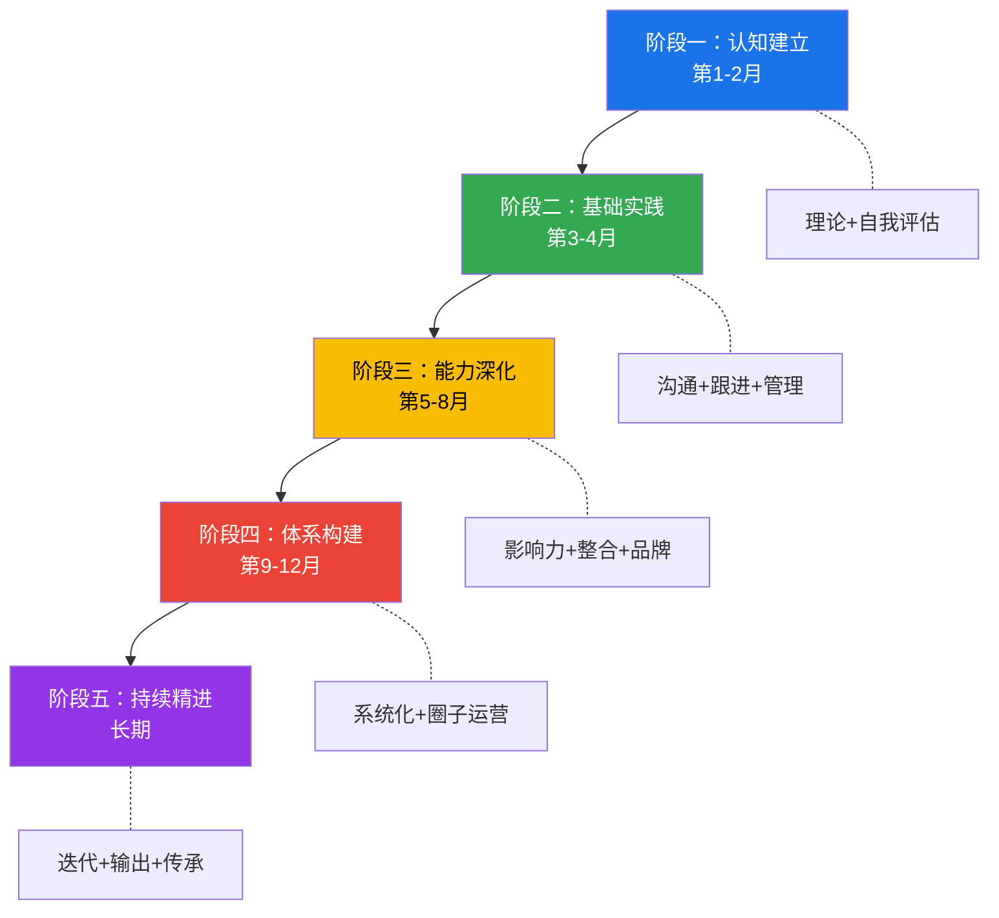
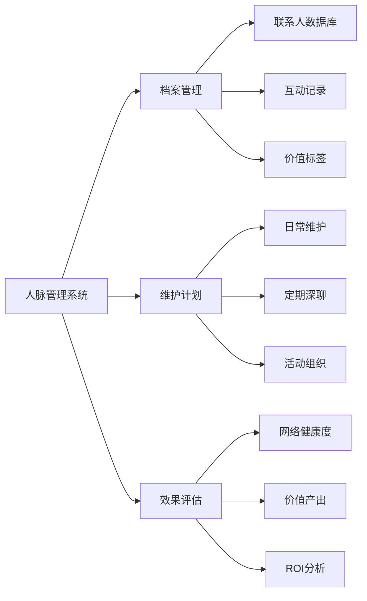

# 人脉经营 · 学习路径

> 人脉经营是一项需要循序渐进、持续精进的综合能力。本节提供一条从入门到精通的系统学习路径，包含具体的时间规划、学习资源、实操工具和检验标准，帮助你有计划、有步骤地提升人脉经营能力。

*** 

## 学习路径总览



每个阶段都有明确的**学习目标→知识输入→实践任务→阶段检验**闭环。不要跳过任何阶段——前一阶段的能力是后一阶段的基础。

| 阶段 | 时间 | 核心主题 | 能力指标 | 推荐投入 |
|------|------|----------|----------|----------|
| 认知建立 | 第1-2月 | 观念重塑+自我评估 | 能清晰阐述人脉经营的核心理论 | 每天30-60分钟 |
| 基础实践 | 第3-4月 | 沟通技巧+跟进方法 | 能独立完成一次完整的社交破冰→跟进流程 | 每天30-60分钟 |
| 能力深化 | 第5-8月 | 影响力+资源整合 | 能主动组织社交活动并完成人脉引荐 | 每天30-60分钟 |
| 体系构建 | 第9-12月 | 系统化+圈子运营 | 能运营一个30人以上的活跃社群 | 每天30分钟维护 |
| 持续精进 | 长期 | 迭代+输出+传承 | 能指导他人建立人脉网络 | 融入日常习惯 |

***

## 阶段一：认知建立（第1-2月）

### 为什么从认知开始

很多人脉经营失败的根源不是技巧不够，而是认知错误。常见的认知误区包括：

- **"人脉就是认识很多人"** → 真相：人脉的质量远比数量重要。邓巴数理论指出，人类能维持的稳定社交关系上限约为150人，其中真正亲密的不超过5人。
- **"社交就是应酬"** → 真相：真正的人脉经营是价值交换，不是酒桌上的推杯换盏。
- **"我没有社交天赋"** → 真相：社交是可以学习和训练的技能，与性格无关。内向者在深度社交上反而有天然优势。

建立正确认知，才能让后续的实践事半功倍。

### 学习目标

- 理解人脉经营的重要性和底层原理，能用自己的话解释弱关系理论、社交资本、邓巴数的核心观点
- 建立正确的人脉经营观念，摒弃"人脉=关系网"的错误认知
- 掌握基础的社交心理学知识，理解人为什么需要社交、社交行为背后的心理机制
- 完成个人社交现状的自我评估，找到起点和方向

### 学习内容

**（1）理论学习**

| 学习内容 | 学习资源 | 学习时间 | 重点掌握 |
|----------|----------|----------|----------|
| 人脉经营基础理论 | 本章"基础理论"部分 | 2小时 | 人脉的本质是价值网络，不是人情账户 |
| 社交心理学入门 | 《人性的弱点》（戴尔·卡耐基） | 每天30分钟，2周读完 | 6种让人喜欢你的方法，12种赢得他人认同的方式 |
| 弱关系理论 | 格兰诺维特《弱关系的力量》+ 本章"基础理论" | 2小时 | 弱关系在信息传递和机会获取上的独特价值 |
| 邓巴数与社交网络 | 《社交天性》（马修·利伯曼）+ 本章"基础理论" | 3小时 | 150/50/15/5四层社交圈的含义和维护策略 |
| 六度分隔理论 | 《链接》（巴拉巴西）相关章节 | 1.5小时 | 社交网络的结构特性，为什么"小世界"效应如此强大 |

**关键概念速查表：**

| 概念 | 定义 | 对人脉经营的启示 |
|------|------|------------------|
| 弱关系理论 | 格兰诺维特提出，弱关系比强关系更可能带来新信息和机会 | 不要只维护亲密关系，要主动拓展弱关系 |
| 邓巴数 | 人类大脑认知上限决定的稳定社交关系数约150人 | 社交圈有容量限制，要分层管理、重点投入 |
| 社交资本 | 社交关系中蕴含的可调用资源总量 | 人脉是资产，需要持续投入和经营 |
| 互惠原则 | 人类倾向于回报他人的善意 | 先付出、先提供价值，才能获得回报 |
| 社会认同 | 人们通过群体归属获得自我认同 | 找到或建立你的"部落"，深度融入 |
| 结构洞 | 社交网络中两个不相连群体之间的空隙 | 占据结构洞位置的人拥有信息优势和控制优势 |

**（2）自我评估**

在开始任何学习之前，先诚实地评估自己的现状。以下评估工具帮助你建立清晰的起点：

**工具一：社交圈盘点清单**

拿出一张纸或打开一个表格，按照邓巴数的四层结构，列出你当前的所有社交关系：

| 层级 | 容量 | 你的实际人数 | 代表人物 | 关系质量（1-5分） |
|------|------|-------------|----------|-------------------|
| 亲密层（至亲挚友） | 约5人 | ? | ? | ? |
| 亲近层（好朋友） | 约15人 | ? | ? | ? |
| 朋友层（经常联系） | 约50人 | ? | ? | ? |
| 熟人层（认识但不常联系） | 约150人 | ? | ? | ? |

**工具二：社交风格评估**

回答以下10个问题，每个问题选择A或B：

1. 参加一个全是陌生人的聚会，你会：A. 主动找人聊天 / B. 等别人来搭话
2. 你更享受：A. 和一大群人热闹 / B. 和两三个好友深聊
3. 认识新朋友后，你通常：A. 很快加微信并保持联系 / B. 不太会主动联系
4. 遇到有价值的信息，你习惯：A. 立刻分享给可能需要的人 / B. 自己看完就算了
5. 别人请你帮忙介绍人脉，你的第一反应：A. 乐意牵线 / B. 有点为难
6. 你的微信好友数量：A. 超过500人 / B. 不到500人
7. 你发朋友圈的频率：A. 每周至少1次 / B. 很少发或设置了三天可见
8. 你在社群中的角色：A. 活跃发言者/话题发起者 / B. 默默潜水的大多数
9. 你维护人脉的主要方式：A. 主动联系、定期问候 / B. 等别人联系我
10. 你对"社交"这个词的感受：A. 充满能量 / B. 有点消耗

计分：A较多 = 外向活跃型；B较多 = 内向深度型。两种类型没有优劣之分，关键是找到适合自己的经营方式。

**工具三：社交需求分析矩阵**

用这个矩阵定位你当前最需要拓展人脉的领域：

| 维度 | 当前状态（1-5分） | 期望状态（1-5分） | 差距 | 优先级 |
|------|-------------------|-------------------|------|--------|
| 职业发展（行业人脉） | ? | ? | ? | ? |
| 商业合作（合作伙伴） | ? | ? | ? | ? |
| 学习成长（导师/同行） | ? | ? | ? | ? |
| 生活品质（兴趣同好） | ? | ? | ? | ? |
| 情感支持（知己密友） | ? | ? | ? | ? |

差距最大的维度，就是你优先投入的方向。

**（3）目标设定**

基于自我评估的结果，制定具体、可衡量、有时限的人脉经营目标。注意：目标要符合SMART原则（具体、可衡量、可达成、相关性、有时限），不要定"多交朋友"这种模糊目标。

**目标模板示例：**

- **短期目标（3个月）**：
  - "认识20个新朋友"——具体到"每周通过行业活动或线上社群认识2-3个新朋友"
  - "加入2个高质量社群"——具体到"加入XX行业的付费社群和XX城市的线下读书会"
  - "完成社交圈盘点并分类管理"——具体到"用微信标签将所有联系人分为5类"

- **中期目标（6个月）**：
  - "建立5个深度关系"——具体到"每月与1位新认识的朋友进行至少3次深度交流"
  - "成为某个社群的活跃成员"——具体到"在XX社群中每周发言3次以上，参与2次社群活动"
  - "掌握基础的人脉管理工具"——具体到"建立并维护一个包含50人以上的人脉档案"

- **长期目标（1年）**：
  - "建立自己的社交圈子"——具体到"运营一个30人以上的垂直领域社群"
  - "成为某个领域的连接者"——具体到"完成10次以上有效的人脉引荐"
  - "形成稳定的人脉经营习惯"——具体到"每日社交维护15分钟，每周深度交流1次"

### 实践任务

| 任务 | 频率 | 具体行动 | 预计时间 |
|------|------|----------|----------|
| 社交观察 | 每天 | 观察身边社交高手的行为，记录在笔记本中。记录内容包括：场景、他的做法、效果、我可以借鉴什么 | 10分钟 |
| 社交复盘 | 每周日晚 | 回顾本周所有社交互动，用以下模板记录：做了什么→效果如何→哪里做得好→下次如何改进 | 20分钟 |
| 微弱社交 | 每周3次 | 从你的熟人层中选择3个人，进行简单的互动：给朋友圈点赞+有内容的评论，或者转发一条你认为对TA有用的信息 | 15分钟 |
| 阅读输入 | 每天 | 按照阅读计划推进《人性的弱点》，每天1-2章，做读书笔记 | 30分钟 |

**社交复盘模板：**

```markdown
## 本周社交复盘（日期：____）

### 本周社交互动记录
| 日期 | 对象 | 场景 | 我做了什么 | 效果评分(1-5) |
|------|------|------|-----------|---------------|
| | | | | |

### 做得好的地方
- 

### 需要改进的地方
- 

### 下周行动计划
- 
```

### 阶段检验

完成阶段一后，用以下标准检验自己的学习成果：

- [ ] 能够用自己的话向别人解释弱关系理论、社交资本、邓巴数的核心观点（费曼检验法）
- [ ] 完成了社交圈盘点、社交风格评估、社交需求分析三个评估工具
- [ ] 制定了符合SMART原则的短中长期人脉经营目标
- [ ] 读完了《人性的弱点》并整理了读书笔记
- [ ] 养成了每日社交观察和每周社交复盘的习惯

如果以上5项中有2项以上未完成，建议延长阶段一的时间，不要急于进入下一阶段。

***

## 阶段二：基础实践（第3-4月）

### 为什么需要基础实践

认知建立后，你需要将知识转化为可执行的技能。这个阶段的核心是"做"——通过大量的实践，将社交技巧内化为本能反应。就像学游泳不能只看书一样，社交能力必须在真实场景中锤炼。

### 学习目标

- 掌握基本的社交沟通技巧（倾听、提问、表达、跟进），能够在真实社交场景中自然运用
- 学会有效的初次接触和跟进方法，能独立完成"破冰→交流→交换联系方式→后续跟进"的完整流程
- 开始系统化地维护现有人脉，建立定期联系的习惯
- 初步建立人脉管理的习惯，能使用工具记录和追踪社交关系

### 学习内容

**（1）沟通技巧深度训练**

| 技巧 | 核心要点 | 训练方法 | 常见误区 |
|------|----------|----------|----------|
| 倾听 | 全神贯注听对方说话，用身体语言和简短回应表示关注 | 与人交流时，要求自己在对方说完前不打断，用"嗯""然后呢""我理解"回应 | 假装在听实际在想自己要说什么 |
| 提问 | 用开放式问题引导对话深入，而非封闭式问题让对话终结 | 准备10个万能开场问题（见下方清单），每次社交至少用3个 | 问太多"是不是""对不对"的封闭式问题 |
| 表达 | 简洁清晰地表达自己的观点和经历，避免冗长和跑题 | 练习"电梯演讲"——30秒内介绍清楚自己是谁、做什么、有什么价值 | 说太多细节让对方失去兴趣 |
| 跟进 | 社交后的24-48小时内进行跟进，保持关系的温度 | 建立跟进清单，每次社交活动后立即记录需要跟进的人和内容 | 交换完联系方式后再也不联系 |

**万能开场问题清单：**

1. "你是怎么进入这个行业的？"（引导对方分享职业故事）
2. "你最近在忙什么有趣的项目？"（了解对方当前关注点）
3. "你是怎么知道这个活动的？"（了解对方的信息渠道和社交圈）
4. "你对今天XX话题怎么看？"（引发深度讨论）
5. "你在这个领域最大的收获是什么？"（让对方分享经验）
6. "最近有看什么好书/好课推荐吗？"（轻松话题，容易展开）
7. "你是哪里人？来这边多久了？"（了解背景，找到共同点）
8. "你平时除了工作还有什么爱好？"（发现共同兴趣）
9. "你觉得这个行业未来会怎么发展？"（引发深度思考）
10. "有什么我可以帮到你的吗？"（主动提供价值）

**（2）社交场景应对策略**

不同场景需要不同的社交策略。以下是五种常见场景的具体应对方法：

**场景一：行业活动/会议**

- **入场前**：研究活动嘉宾和参会者名单，提前确定3个想认识的目标人选；准备好30秒自我介绍；带足名片或准备好微信二维码
- **活动中**：提前15分钟到场（早到的人更容易破冰）；主动坐在陌生人旁边而不是找熟人；每30分钟换一个交流对象；在茶歇时间主动靠近目标人选
- **离场后**：当天晚上给新认识的人发一条个性化消息，提到你们聊过的具体内容

**场景二：一对一深度交流**

- **邀约**：明确表达你想交流的目的和预期时长（"想跟你请教XX方面的问题，方便的话约个咖啡，大概30分钟"）
- **过程中**：70%时间让对方说，30%你说；做笔记（征得同意后）；对对方的观点提出有深度的追问
- **结束时**：总结你从交流中的收获，表达感谢；询问对方是否有什么你可以帮忙的

**场景三：线上社交互动**

- 在社群中发言时，提供有价值的内容而非水群
- 回复他人帖子时，给出有深度的观点而非简单的"赞""不错"
- 私聊时先说明来意，不要突然发一大段话
- 朋友圈评论要言之有物，不要只发表情

**场景四：餐桌社交**

- 座位选择：坐在你想认识的人旁边，而不是坐在好朋友旁边
- 话题准备：提前准备3-5个轻松话题，避免敏感话题（政治、宗教、薪资）
- 敬酒/交流时机：在上菜间隙自然交流，不要在别人吃东西时强行聊天
- 结账：如果是你发起的饭局，主动买单是基本礼节

**场景五：跨文化交流**

- 了解对方文化的社交礼仪（如日本人的鞠躬、西方人的拥抱握手）
- 避免文化刻板印象，以个人为中心交流
- 语言不通时，善用翻译工具，不要因为语言障碍放弃交流

**（3）人脉管理基础**

**微信标签管理法：**

将所有微信联系人按以下维度打标签：

| 标签维度 | 分类示例 | 用途 |
|----------|----------|------|
| 关系层级 | 核心/重要/普通/弱关系 | 决定维护频率 |
| 来源渠道 | 行业活动/朋友介绍/线上社群/客户 | 了解人脉来源分布 |
| 领域属性 | 技术/产品/市场/投资/媒体 | 需要特定领域资源时快速检索 |
| 合作状态 | 已合作/潜在合作/仅认识 | 跟踪关系发展 |
| 维护状态 | 活跃/需维护/沉睡 | 定期检查哪些关系需要激活 |

**人脉档案模板：**

为每个重要联系人建立一份简单的档案：

```markdown
## 人脉档案：[姓名]

**基本信息**
- 职业/公司/职位：
- 联系方式：微信/电话/邮箱
- 认识时间/场合：
- 共同好友：

**个人特征**
- 兴趣爱好：
- 擅长领域：
- 当前关注/需求：
- 沟通偏好（微信/电话/见面）：

**互动记录**
| 日期 | 方式 | 内容摘要 | 下次跟进点 |
|------|------|----------|-----------|
| | | | |

**我能提供的价值**：
**TA可能帮到我的方面**：
```

**社交维护提醒机制：**

| 关系层级 | 维护频率 | 维护方式 |
|----------|----------|----------|
| 核心层（5人） | 每周至少1次 | 电话/见面/深度聊天 |
| 亲近层（15人） | 每月至少1次 | 微信私聊/约饭 |
| 朋友层（50人） | 每季度至少1次 | 微信互动/分享有用信息 |
| 熟人层（150人） | 每半年至少1次 | 朋友圈互动/节日问候 |

### 实践任务

| 任务 | 频率 | 具体行动 | 预计时间 |
|------|------|----------|----------|
| 认识新朋友 | 每周 | 通过线上或线下方式认识2-3个新朋友，记录在人脉档案中 | 1-2小时 |
| 深度交流 | 每周 | 与1个重要联系人进行30分钟以上的深度交流，做好记录 | 1小时 |
| 社交维护 | 每天 | 按照维护频率表，主动联系1-2个联系人，分享有价值的信息或问候 | 15分钟 |
| 社交活动 | 每月 | 参加1-2次社交活动（行业沙龙、兴趣聚会、社群线下活动） | 2-4小时/次 |
| 读书笔记 | 每周 | 整理《非暴力沟通》和《别独自用餐》的读书笔记，提取可直接使用的技巧 | 30分钟 |

### 阶段检验

- [ ] 掌握了倾听、提问、表达、跟进四项核心沟通技巧，能在真实场景中自然运用
- [ ] 建立了微信标签分类系统，对所有联系人进行了分层标注
- [ ] 为10个以上重要联系人建立了人脉档案
- [ ] 读完了《非暴力沟通》和《别独自用餐》，整理了可操作的技巧清单
- [ ] 新认识了15-20个新朋友，其中5个以上进入了"朋友层"
- [ ] 与5个以上重要联系人进行了深度交流，每次交流都有记录和跟进

***

## 阶段三：能力深化（第5-8月）

### 为什么需要4个月

能力深化阶段是整个学习路径中时间最长的阶段，因为这个阶段要完成三个关键转变：从"被动社交"到"主动社交"，从"单点沟通"到"资源整合"，从"个人社交"到"影响力构建"。这三个转变都需要大量的实践和反思。

### 学习目标

- 深化社交心理学和影响力知识，能在社交中有意识地运用影响力原则
- 提升资源整合和价值创造能力，能主动发现并连接不同圈子的人
- 开始尝试组织和运营社交活动，积累活动组织经验
- 建立个人在某个社交圈的影响力，成为圈子里被认可的活跃成员

### 学习内容

**（1）影响力与说服**

| 学习内容 | 学习资源 | 学习时间 | 核心要点 |
|----------|----------|----------|----------|
| 影响力六原则 | 《影响力》（罗伯特·西奥迪尼） | 每天30分钟，3周读完 | 互惠、承诺一致、社会认同、喜好、权威、稀缺 |
| 说服技巧 | 《关键对话》+ 相关课程 | 10小时 | 在高风险对话中有效表达观点并达成共识 |
| 非语言沟通 | 《社交天性》+ 《FBI教你读心术》 | 每天20分钟，3周读完 | 肢体语言、微表情、空间距离、声音语调 |
| 故事力 | 《故事力》（哈佛法学院推荐） | 5小时 | 用故事而非数据说服人，掌握STAR故事框架 |

**影响力六原则在社交中的应用：**

| 原则 | 定义 | 社交应用示例 |
|------|------|-------------|
| 互惠 | 人们倾向于回报他人的善意 | 先主动帮助对方，不求回报；分享有价值的信息给对方 |
| 承诺一致 | 人们倾向于保持言行一致 | 请对方帮一个小忙（富兰克林效应），TA会更认可你 |
| 社会认同 | 人们参考他人的行为做决定 | 提及共同认识的朋友，参加对方在的社群 |
| 喜好 | 人们更容易被喜欢的人说服 | 找到共同点（同乡、同学、共同爱好），真诚赞美 |
| 权威 | 人们倾向于服从权威 | 建立专业形象，通过内容输出展示专业度 |
| 稀缺 | 稀缺的东西更有价值 | 不要随叫随到，保持适当的神秘感和选择性 |

**（2）资源整合方法**

资源整合是人脉经营的高级能力——不是简单地认识人，而是成为资源的连接器和整合者。

**三种整合模式：**

**模式一：信息整合——成为信息枢纽**

- 建立信息收集机制：关注5-10个高质量信息源（行业媒体、KOL、社群）
- 每周整理3-5条对你的社交圈有价值的信息
- 主动将信息推送给可能需要的人，附上一句简短的解读

**模式二：人脉整合——成为超级连接者**

- 识别你的社交网络中存在"结构洞"的位置
- 主动引荐不同圈子的人相互认识
- 引荐时遵循"三方共赢"原则：对A有价值、对B有价值、对你也有价值
- 引荐模板："A你好，我有个朋友B在XX方面很专业，你最近不是在研究XX吗？我觉得你们可以聊聊。B你好，这是我的朋友A，他在XX领域有很深的积累。"

**模式三：项目整合——促成跨界合作**

- 从社交对话中识别潜在的合作机会
- 主动撮合有互补需求的人或组织
- 在合作中扮演协调者的角色，确保各方利益平衡

**（3）社交活动组织**

从参与者变成组织者，是建立影响力的关键一步。

**小型聚会组织清单（8-15人）：**

| 步骤 | 具体行动 | 时间节点 |
|------|----------|----------|
| 确定主题 | 选择一个具体、有吸引力的主题（不是泛泛的"交流会"） | 活动前3周 |
| 确定人选 | 邀请8-15人，注意人员构成的多样性（不同背景但有共同兴趣） | 活动前2周 |
| 预定场地 | 选择安静、适合交流的场所（咖啡厅包间、联合办公空间） | 活动前2周 |
| 发送邀请 | 提前1周发送正式邀请，包含时间、地点、主题、参与人员（脱敏） | 活动前1周 |
| 活动准备 | 准备话题卡片、名牌、茶点；设计破冰环节和讨论环节 | 活动前1天 |
| 活动执行 | 提前到场布置；开场时介绍主题和规则；控制每个话题的讨论时间 | 活动当天 |
| 活动跟进 | 当天晚上在群内发送活动照片和总结；24小时内给每位参与者发私信感谢 | 活动后1-2天 |

**线上社群运营基础：**

- 群规制定：明确群的定位、禁止事项、发言规范
- 内容节奏：每天至少1个讨论话题或分享内容
- 活跃维护：及时回复成员的问题，对优质发言给予认可
- 定期活动：每周至少1次群内活动（分享、讨论、问答）

**（4）个人品牌建设**

在社交圈中建立个人品牌，让别人在想到某个领域时第一时间想到你。

**个人品牌建设三步法：**

1. **定位**：找到你的独特价值。问自己三个问题：我擅长什么？别人经常找我帮什么忙？我比80%的人做得好的事情是什么？
2. **输出**：通过内容持续输出你的专业观点。形式包括：朋友圈分享、公众号/博客文章、社群分享、短视频、播客
3. **放大**：让内容触达更多人。在多个平台分发、在社群中主动分享、请朋友转发推荐

### 实践任务

| 任务 | 频率 | 具体行动 | 预计时间 |
|------|------|----------|----------|
| 影响力实践 | 每周 | 在社交中有意识地运用1-2个影响力原则，记录场景、做法和效果 | 持续 |
| 资源整合 | 每月 | 至少完成1次人脉引荐或资源对接，记录过程和结果 | 2-3小时 |
| 活动组织 | 每月 | 组织或参与组织1次小型社交活动（线上或线下） | 3-5小时/次 |
| 内容输出 | 每周 | 在社交媒体或社群中分享1篇有价值的内容（观点、经验、资源） | 1小时 |
| 跨圈社交 | 每月 | 参加1次不同领域的社交活动（如你是程序员就去参加产品经理的活动） | 2-4小时/次 |

### 阶段检验

- [ ] 读完了《影响力》和《社交天性》，能列举影响力六原则并举例说明应用场景
- [ ] 完成了至少3次有效的人脉引荐或资源整合，每次都有记录
- [ ] 独立组织了至少2次社交活动（线上或线下），参与人数8人以上
- [ ] 在某个社交圈中建立了初步的个人影响力（至少5人主动找你交流或请教）
- [ ] 社交网络覆盖了至少2个不同的领域，能跨领域连接资源
- [ ] 建立了持续的内容输出习惯，每周至少发布1篇有价值的内容

***

## 阶段四：体系构建（第9-12月）

### 为什么需要体系化

到这个阶段，你已经有了足够的实践经验和社交技巧，但如果没有体系化的支撑，你的努力会分散且低效。体系构建的目标是：让人脉经营从"靠意志力"变成"靠系统运转"。

### 学习目标

- 建立完整的人脉经营体系，包括档案管理、维护计划、效果评估三大模块
- 开始运营自己的社交圈子，从参与者升级为组织者
- 提升社交效率和系统化水平，用最少的时间维持最大的社交网络
- 形成稳定的社交习惯和节奏，让人脉经营融入日常生活

### 学习内容

**（1）系统化建设**

**人脉管理系统架构：**



**系统化工具推荐：**

| 工具 | 用途 | 适合人群 | 成本 |
|------|------|----------|------|
| 微信标签+备注 | 基础联系人管理 | 所有人 | 免费 |
| Notion/飞书多维表格 | 人脉档案+互动记录+提醒 | 喜欢数字化管理的人 | 免费/付费 |
| 飞书日历+提醒 | 社交维护提醒 | 习惯用日历管理时间的人 | 免费 |
| 专属CRM工具（如Lark、微盛） | 商务人脉管理 | 销售/商务/创业者 | 付费 |
| 纸质笔记本 | 重要社交场景记录 | 喜欢手写的人 | 几乎免费 |

**Notion人脉管理数据库搭建指南：**

创建一个包含以下属性的数据库：

| 属性名 | 类型 | 说明 |
|--------|------|------|
| 姓名 | Title | 联系人姓名 |
| 关系层级 | Select | 核心/亲近/朋友/熟人 |
| 领域 | Multi-select | 技术/产品/市场/投资等 |
| 公司+职位 | Text | 当前职业信息 |
| 认识渠道 | Select | 活动/社群/朋友介绍等 |
| 最后联系 | Date | 上次互动日期 |
| 下次跟进 | Date | 计划下次联系日期 |
| 跟进提醒 | Formula | 自动计算是否需要联系 |
| 互动记录 | Relation | 关联互动记录表 |
| 备注 | Text | 重要信息、偏好、需求等 |

**（2）圈子运营**

从参与者到组织者的升级，是你人脉经营能力的重要里程碑。

**社群运营全生命周期：**

| 阶段 | 核心任务 | 关键指标 |
|------|----------|----------|
| 冷启动期（第1-2周） | 确定定位、邀请种子用户（20-30人）、制定群规 | 种子用户到位率>80% |
| 活跃期（第3-8周） | 每日话题、每周活动、持续邀请新成员 | 日活跃率>30% |
| 稳定期（第3-6月） | 建立内容生态、培养核心成员、形成文化 | 月留存率>70% |
| 成熟期（6月后） | 自运转、商业化探索、影响力外溢 | 成员自发产生内容>50% |

**社群文化建设要素：**

- **共同语言**：独特的称呼、暗号、梗（如"大佬""摸鱼""加鸡腿"）
- **仪式感**：新人入群仪式、周报分享、月度聚会
- **价值共识**：群的核心价值观（如"利他""深度思考""知行合一"）
- **榜样力量**：核心成员的示范作用

**（3）高级社交策略**

**超级连接者的五大特征：**

1. **跨圈层**：在多个不同的社交圈中都有存在感
2. **高信誉**：被引荐的双方都信任TA的判断
3. **强匹配**：能精准判断两个人是否值得连接
4. **低门槛**：乐于帮助他人，不设过高的社交门槛
5. **持续性**：不是一次性引荐，而是持续跟进连接效果

**社交货币的积累和运用：**

社交货币是你在社交网络中积累的信用和影响力。积累方式包括：

- 持续提供有价值的信息和资源
- 高质量地完成每一次引荐和帮助
- 在社群中持续输出专业内容
- 在关键时刻为他人提供支持

运用社交货币时要注意：

- 不要过度透支——频繁求助会让社交货币贬值
- 用在刀刃上——重要的事情才动用重要的人脉
- 及时补充——用完后要通过新的价值输出补充回来

### 实践任务

| 任务 | 频率 | 具体行动 | 预计时间 |
|------|------|----------|----------|
| 圈子运营 | 持续 | 建立并运营自己的社交圈子（线上或线下），目标30人以上活跃社群 | 每天30分钟 |
| 系统维护 | 每周 | 按照系统化计划维护人脉关系，更新人脉档案和互动记录 | 1小时 |
| 效果评估 | 每月 | 评估人脉经营的效果，分析数据（新增人数、互动频率、价值产出），调整策略 | 1小时 |
| 深度合作 | 每季度 | 推动至少1个跨圈子的深度合作项目 | 持续 |
| 知识分享 | 每月 | 进行1次人脉经营相关的分享或输出（社群分享、文章、朋友圈） | 2小时 |

### 阶段检验

- [ ] 建立了完整的人脉经营系统（档案管理+维护计划+效果评估），且系统已正常运转1个月以上
- [ ] 成功运营了一个社交圈子（至少30人的活跃社群，月活跃率>30%）
- [ ] 完成了至少2个跨圈子的合作项目，且参与方都给出了正面反馈
- [ ] 在社交网络中建立了明确的个人品牌（至少10人能用一句话描述你的价值）
- [ ] 形成了稳定的社交习惯和节奏，人脉经营已融入日常

***

## 阶段五：持续精进（长期）

### 为什么需要持续精进

人脉经营不是学完就结束的技能，而是需要终身精进的生活方式。社交环境在变化（新的社交平台、新的社交方式、新的社会趋势），你的社交需求也在变化（职业发展、家庭变化、兴趣转移），因此你的经营策略也需要持续迭代。

### 学习目标

- 持续优化人脉经营体系，让它随你的成长而进化
- 提升社交的深度和广度，建立高质量、多元化的社交网络
- 实现人脉价值的最大化，在关键时刻能调动网络中的优质资源
- 帮助他人建立人脉网络，从受益者变成赋能者

### 持续行动

**（1）日常维护（每日/每周）**

| 行动 | 频率 | 具体内容 |
|------|------|----------|
| 关系维护 | 每天15分钟 | 按照分层策略，主动联系1-2个联系人 |
| 信息分享 | 每天5分钟 | 将有价值的信息推送给可能需要的人 |
| 档案更新 | 每周 | 更新人脉档案中的变动信息（跳槽、项目、需求变化） |
| 计划制定 | 每周日晚 | 制定下周的社交计划（要联系谁、参加什么活动） |

**（2）能力提升（每年）**

- 每年阅读2-3本人脉经营相关的经典书籍（如每年重读一次《人性的弱点》，读一本新书）
- 参加1-2次高质量的社交技能培训或工作坊
- 研究3-5个社交高手的案例，分析他们的策略和技巧
- 学习新的社交工具和平台，保持对新事物的敏感度

**推荐进阶书单：**

| 书名 | 作者 | 适合阶段 | 核心收获 |
|------|------|----------|----------|
| 《人性的弱点》 | 戴尔·卡耐基 | 入门+常读常新 | 人际交往的基本原则 |
| 《非暴力沟通》 | 马歇尔·卢森堡 | 入门-进阶 | 高效沟通的方法论 |
| 《别独自用餐》 | 基思·法拉奇 | 基础-进阶 | 人脉经营的实战指南 |
| 《影响力》 | 罗伯特·西奥迪尼 | 进阶 | 说服力的底层原理 |
| 《社交天性》 | 马修·利伯曼 | 进阶 | 社交行为的脑科学基础 |
| 《关键对话》 | 科里·帕特森等 | 进阶 | 高风险对话的应对策略 |
| 《链接》 | 巴拉巴西 | 深入 | 网络科学基础 |
| 《超级连接者》 | 里德·霍夫曼 | 深入 | 职业社交的高级策略 |
| 《故事力》 | 琳达·西格 | 进阶-深入 | 用故事影响他人 |
| 《联盟》 | 里德·霍夫曼 | 深入 | 职场人脉的长期主义 |

**（3）价值输出（每月/每季度）**

- 将人脉经营的经验和方法系统化，形成自己的方法论
- 通过文章、分享、咨询等方式帮助他人优化人脉网络
- 成为社交领域的实践者和布道者，影响更多人重视人脉经营
- 指导1-2个社交新手，帮助他们完成阶段一和阶段二的学习

**（4）体系迭代（每季度）**

每季度进行一次人脉经营的全面复盘，使用以下框架：

```markdown
## 季度人脉经营复盘

### 一、数据回顾
- 本季度新认识人数：___
- 本季度深度交流次数：___
- 本季度人脉引荐/资源对接次数：___
- 本季度组织/参与的社交活动：___
- 本季度内容输出篇数：___

### 二、目标达成
| 季度目标 | 完成情况 | 差距分析 |
|----------|----------|----------|
| | | |

### 三、关键收获
- 最有价值的一次社交互动：
- 最成功的一次人脉引荐：
- 最大的一个认知突破：

### 四、问题与改进
- 最大的社交挑战是什么？
- 哪些关系需要重点维护？
- 下季度需要调整什么策略？

### 五、下季度目标
- 
```

***

## 学习方法建议

### 1. 费曼学习法——以教代学

**核心思想**：如果你不能用简单的语言向别人解释一个概念，说明你还没有真正理解它。

**在人脉经营学习中的应用**：

- 学完一个知识点（如弱关系理论），尝试用3分钟向一个朋友解释清楚
- 每周写一篇学习笔记，用"是什么→为什么→怎么做"的结构
- 在社群中分享你的社交心得，接受他人的反馈和提问
- 把自己定位为"学习者"而非"专家"，用分享代替说教

**具体操作**：准备一个"社交学习笔记本"（纸质或电子），每学完一个知识点，用以下模板整理：

【知识点】：_____________
【一句话解释】：_____________
【对我的启发】：_____________
【我打算如何应用】：_____________
【实际应用效果】：（事后填写）

### 2. 刻意练习法——精准突破薄弱环节

**核心思想**：不是简单地重复，而是针对薄弱环节进行有目的的、有反馈的练习。

**在人脉经营学习中的应用**：

1. **识别薄弱环节**：回顾你过去一个月的社交互动，哪个环节最让你不舒服或效果最差？
2. **设计练习任务**：针对薄弱环节设计具体的练习。例如：
   - 倾听能力弱 → 与人交流时，要求自己在对方说完3秒后才回应
   - 不会破冰 → 每天练习和一个陌生人（店员、保安、外卖员）打招呼并闲聊1分钟
   - 跟进做得差 → 每次社交活动后，设置30分钟的跟进时间
3. **在实践中练习**：每次社交互动前，给自己设定一个具体的练习目标
4. **事后复盘**：记录练习的过程和效果，分析哪里做得好、哪里需要改进
5. **迭代优化**：根据复盘结果调整练习方案，逐步提升

### 3. 案例分析法——向高手学习

**核心思想**：不要闭门造车，通过分析真实案例来学习最有效的方法。

**案例来源**：

- **身边的社交高手**：观察你身边社交能力最强的人，分析TA在不同场景下的具体做法
- **成功人物传记**：阅读社交能力强的人物传记（如本杰明·富兰克林、卡耐基、马云等）
- **自己的成功案例**：记录你做得最好的社交互动，分析成功的原因，尝试复制

**案例分析模板**：

【案例来源】：_____________
【场景描述】：_____________
【他/她做了什么】：_____________
【效果如何】：_____________
【核心策略是什么】：_____________
【我可以如何借鉴】：_____________

### 4. 同伴学习法——结伴同行走得更远

**核心思想**：与志同道合的人一起学习和实践，互相激励、互相监督。

**具体做法**：

- **找学习伙伴**：找1-2个对人脉经营感兴趣的朋友，组成学习小组
- **制定共同计划**：一起制定学习计划，互相监督执行
- **定期交流**：每两周进行一次学习交流，分享心得、讨论问题、互相点评
- **共同实践**：一起参加社交活动，互相观察和反馈
- **互相引荐**：将自己的人脉资源分享给学习伙伴

### 5. 逆向工程法——从结果倒推方法

**核心思想**：找到你想要的社交结果，然后倒推需要什么能力和行动。

**操作步骤**：

1. 确定你的目标状态（如"成为XX社群的知名连接者"）
2. 分析达到这个状态需要哪些具体能力
3. 找到已经达到这个状态的人，研究TA的路径
4. 倒推出你需要的学习内容和实践任务
5. 将任务分解到每个月、每一周

***

## 常见问题解答

### Q1：我性格内向，适合学习人脉经营吗？

**A：** 完全适合，而且内向者在某些方面有天然优势。

内向≠不善社交。内向者的社交优势在于：

| 优势 | 具体表现 | 如何发挥 |
|------|----------|----------|
| 深度交流 | 更擅长一对一的深入对话 | 选择小规模、深度的社交场合，而非大型派对 |
| 倾听能力 | 天然的倾听者，让人感到被理解 | 充分发挥倾听优势，成为"让人愿意倾诉"的人 |
| 思考深度 | 交流内容更有深度和质量 | 通过深度交流建立高质量关系，而非追求认识人数 |
| 内容输出 | 更擅长写作和深度思考 | 通过文章、笔记等文字内容建立影响力 |
| 观察力 | 更能察觉他人的情绪和需求 | 在社交中捕捉细节，提供精准的帮助 |

**内向者的社交策略**：

1. **控制社交能量**：每次社交活动前评估能量值，低能量时选择独处恢复
2. **选择合适的场景**：优先选择2-6人的小聚会、一对一咖啡、线上深度交流
3. **善用线上社交**：通过微信群、论坛、文章评论等方式建立初步联系
4. **建立社交节奏**：每周安排2-3次社交活动，留出足够的独处恢复时间
5. **发挥文字优势**：通过写文章、发朋友圈长文等方式展示自己

### Q2：工作太忙，没有时间社交怎么办？

**A：** 社交不一定要占用大量时间，关键是把社交融入日常。

**高效社交时间管理法**：

| 碎片时间 | 可以做的社交行动 | 耗时 |
|----------|------------------|------|
| 通勤路上（30分钟） | 给2-3个联系人发微信，分享一条有价值的信息 | 5-10分钟 |
| 午休时间（1小时） | 约同事或朋友一起吃饭，进行轻松交流 | 30分钟 |
| 等待时间（各种排队） | 刷朋友圈并给3-5个人留下有价值的评论 | 5分钟 |
| 睡前15分钟 | 回复今天的社交消息，规划明天的社交任务 | 10分钟 |
| 周末半天 | 参加一次社交活动或约一个朋友深度交流 | 2-3小时 |

**核心原则**：

- **质量优先**：一次30分钟的深度交流，胜过10次5分钟的寒暄
- **融入工作**：午餐约见、茶歇交流、会后闲聊都是社交机会
- **建立习惯**：固定每天15分钟的社交维护时间，比偶尔花2小时社交更有效
- **善用工具**：设置定期提醒，让人脉维护变成半自动化的事

### Q3：如何判断一段关系是否值得投入？

**A：** 用以下五维评估模型来判断：

| 维度 | 评估标准 | 权重 |
|------|----------|------|
| 价值对等 | 双方能否互相提供价值？如果长期单方面付出，需要重新评估 | ★★★★ |
| 成长潜力 | 这段关系是否有助于你的成长？对方是否在持续进步？ | ★★★★ |
| 信任基础 | 双方是否建立了基本的信任？对方是否靠谱、守承诺？ | ★★★★★ |
| 投入产出 | 投入的时间和精力是否合理？回报是否匹配投入？ | ★★★ |
| 情感价值 | 和对方相处是否让你感到舒适和愉悦？ | ★★★ |

**评估结果处理**：

- **5分以上**：核心关系，全力投入
- **3-4分**：值得维护，保持适度投入
- **2分以下**：降低投入优先级，考虑是否需要继续维护

**注意**：不要功利地评估每一段关系。有些关系的价值是长期的、隐性的（如情感支持、人生智慧），不能只看眼前的"有用"程度。

### Q4：如何处理社交中的"社交焦虑"？

**A：** 社交焦虑是完全正常的生理和心理反应，几乎每个人在某些社交场景中都会感到焦虑。

**理解社交焦虑的本质**：

社交焦虑的根源是"对负面评价的恐惧"——担心自己说错话、做错事、被别人看不起。但实际上，大多数人都在关注自己，很少有人会花精力去评判你。

**五步缓解法**：

1. **接受焦虑**：不要试图消除焦虑，而是接受它。告诉自己"感到紧张是正常的，这说明我在乎这次社交"
2. **充分准备**：提前准备话题、自我介绍、可能的问题。准备越充分，焦虑越低
3. **转移注意力**：将注意力从"别人怎么看我"转移到"对方在说什么"。认真倾听对方，焦虑自然减轻
4. **从小场景开始**：不要一上来就挑战大型社交活动。从与店员闲聊、和同事聊天开始，逐步扩大舒适区
5. **事后肯定自己**：每次社交活动后，不管效果如何，都肯定自己"迈出了这一步"

**快速减压技巧**：

- **4-7-8呼吸法**：吸气4秒，屏住7秒，呼气8秒。重复3次
- **积极自我对话**："我是来交朋友的，不是来考试的""没有人是完美的""这次社交只是我人生中的一小步"
- **身体放松**：社交前做5分钟拉伸，放松肩膀和手臂

### Q5：人脉经营会不会显得很"功利"？

**A：** 这取决于你的出发点和方式。

**功利型社交 vs 价值型社交的区别**：

| 维度 | 功利型社交 | 价值型社交 |
|------|-----------|-----------|
| 出发点 | "这个人对我有什么用？" | "我能为这个人提供什么价值？" |
| 交往方式 | 需要时才联系，不需要时消失 | 持续维护，不求回报 |
| 关系本质 | 交易关系 | 互惠关系 |
| 长期效果 | 人脉脆弱，关键时刻无人帮忙 | 人脉牢固，关键时刻有贵人相助 |
| 对方感受 | 被利用的感觉 | 被尊重、被关心的感觉 |

**正确的做法**：

- **先利他再利己**：在需要帮助之前，先主动帮助别人
- **真诚关心**：不是假装关心，而是真正对对方感兴趣
- **长期主义**：不追求短期回报，相信价值会在未来某个时刻回馈
- **保持底线**：不为了人脉做违背原则的事

### Q6：如何从0开始建立一个领域的社交圈？

**A：** 如果你在一个新领域或新城市没有任何人脉，以下是系统化的起步路径：

**第1步（第1-2周）：加入已有的社群**

- 在微信、知识星球、Discord等平台搜索相关的社群
- 加入2-3个最活跃的社群，先做观察者，了解社群文化和核心成员
- 在社群中进行有价值的发言（回答问题、分享资源），建立初步存在感

**第2步（第3-4周）：建立1对1连接**

- 从社群中选择3-5个你觉得聊得来的人，主动私聊
- 私聊时先说明你是怎么发现TA的（在群里看到TA的某个分享），然后找到共同话题
- 约一次线上或线下的深度交流

**第3步（第2个月）：从参与者变为贡献者**

- 在社群中主动分享你的专业知识或经验
- 协助群主组织社群活动
- 帮助新加入的成员解答问题

**第4步（第3个月）：组织小规模活动**

- 邀请社群中认识的朋友组织一次小规模聚会（线上或线下）
- 通过活动让不同的人相互认识，你来扮演连接者的角色

**第5步（持续）：沉淀和扩展**

- 持续维护在社群中建立的关系
- 通过现有关系认识更多人（朋友的朋友）
- 逐步建立自己在该领域的影响力

***

## 学习资源汇总

### 书籍推荐（按阶段排序）

| 阶段 | 书名 | 作者 | 核心收获 | 阅读时长 |
|------|------|------|----------|----------|
| 入门 | 《人性的弱点》 | 戴尔·卡耐基 | 人际交往基本原则 | 2周 |
| 入门 | 《非暴力沟通》 | 马歇尔·卢森堡 | 高效沟通方法论 | 2周 |
| 基础 | 《别独自用餐》 | 基思·法拉奇 | 人脉经营实战指南 | 2周 |
| 进阶 | 《影响力》 | 罗伯特·西奥迪尼 | 说服力底层原理 | 3周 |
| 进阶 | 《社交天性》 | 马修·利伯曼 | 社交行为脑科学 | 3周 |
| 进阶 | 《关键对话》 | 科里·帕特森等 | 高风险对话策略 | 2周 |
| 深入 | 《链接》 | 巴拉巴西 | 网络科学基础 | 3周 |
| 深入 | 《超级连接者》 | 里德·霍夫曼 | 职业社交高级策略 | 2周 |

### 在线学习资源

| 类型 | 资源 | 说明 |
|------|------|------|
| TED演讲 | 《如何建立有效的社交网络》系列 | 免费、短小精悍、启发思考 |
| 播客 | 《得到·关系攻略》（熊太行） | 系统化的社交关系知识 |
| 在线课程 | Coursera "Social Networks" | 斯坦福大学的社交网络课程 |
| 公众号 | 刘润、秋叶大叔 | 商业社交和个人品牌的内容 |

***

## 本节小结

人脉经营的学习是一个长期、系统的过程，核心在于四个坚持：

1. **循序渐进**：按照学习路径逐步提升，不跳过任何阶段。前一阶段的能力是后一阶段的基础，急于求成只会地基不牢。
2. **知行合一**：每个知识点都要在实践中验证，每个实践都要反思总结。纯粹的理论学习和纯粹的社交活动都无法带来真正的提升。
3. **持续迭代**：定期评估效果，持续优化方法。你的人脉经营体系应该像软件一样，不断版本更新。
4. **享受过程**：将社交视为一种生活方式，而不是一项任务。当你真正享受与人连接的过程时，人脉经营就不再需要"坚持"，而是自然而然的习惯。

记住，人脉经营的终极目标不是"认识多少人"，而是**"成为一个值得认识的人"**。通过持续的学习和实践，你将不仅建立起强大的人脉网络，更将成为一个更有价值、更有影响力的人。

最后，分享一句话：

> **"你不需要认识所有人，你只需要成为那种，别人愿意认识的人。"**
