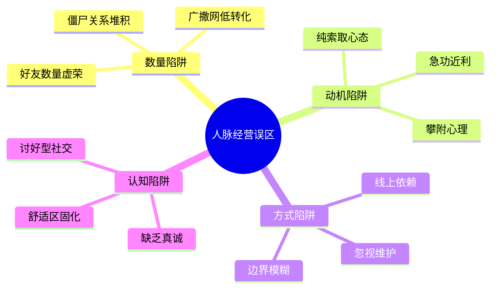
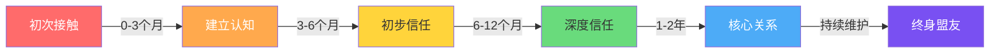
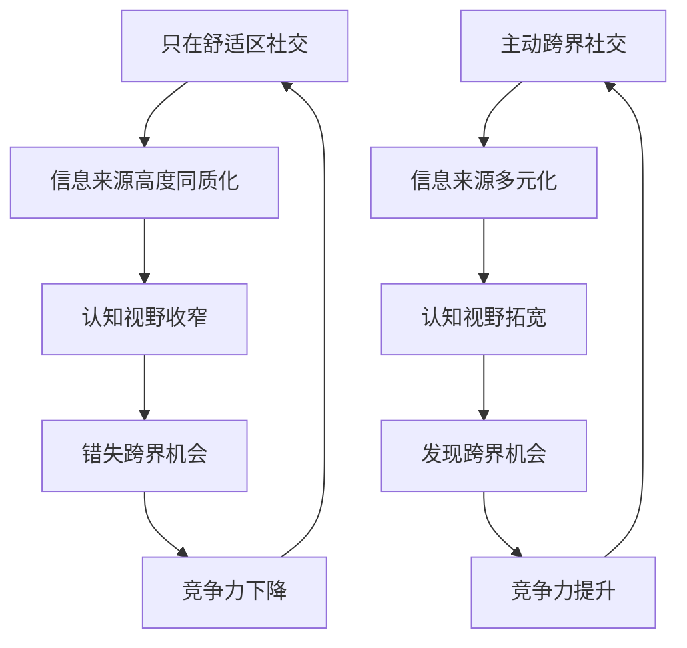
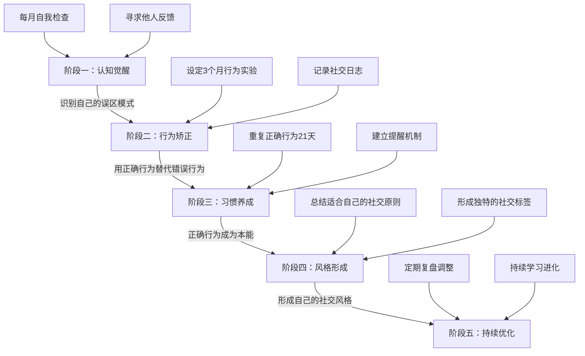

# 人脉经营 · 常见误区

> 人脉经营的失败，很少是因为"不知道该怎么做"，更多是因为"一直在用错误的方式做"。这些误区往往披着"常识"的外衣，让人浑然不觉地消耗时间、精力和社交信用。本节拆解10个最典型的人脉经营误区——不仅告诉你"错在哪"，还给出具体的诊断标准、真实案例和修复方案。

---

## 误区自检：你踩了几个？

在逐条展开之前，先做一个快速自检。对照下表，给每项打分（1=完全不符合，5=完全符合）：

| 序号 | 行为描述 | 自评分 |
|------|----------|--------|
| 1 | 我的微信好友超过1000人，但能随时打电话聊天的不到20人 | |
| 2 | 我联系别人通常是因为"有事相求" | |
| 3 | 超过半年没联系的朋友，我已经想不起上次聊了什么 | |
| 4 | 我希望认识一个"有用的人"后能很快得到帮助 | |
| 5 | 社交场合中，我经常说自己并不认同的话 | |
| 6 | 我的社交圈90%以上是同行业/同背景的人 | |
| 7 | 我主要通过微信/社交媒体维系关系，很少线下见面 | |
| 8 | 我觉得"维护关系"就是逢年过节群发祝福 | |
| 9 | 面对比自己"段位高"的人，我会不自觉地放低姿态 | |
| 10 | 我很少主动在社交中暴露自己的弱点或不足 | |

**评分解读**：总分25分以上，说明你在人脉经营中存在明显的模式偏差；单条4分以上的项目，是需要优先修正的高危行为。



---

## 误区一：认识人多 = 人脉广

### 误区表现

- 微信好友数千人，但真正能说上话的不到50人
- 参加各种活动疯狂加微信，但从不跟进维护
- 以"好友数量"作为社交成功的指标
- 认为"人脉广"就是"通讯录长"

### 底层认知偏差：将"连接数"等同于"关系质量"

这种误区的根源是**可量化指标的诱惑**。好友数量是可见的、可比较的、容易产生满足感的数字，但人脉质量是不可见的、需要长期投入才能感知的。人类大脑天然偏好即时可感知的"成就"，这就是为什么很多人沉迷于"加好友"带来的虚假充实感。

邓巴数（Dunbar's Number）的研究结论是：人类大脑皮层的认知极限决定了我们能够维持的稳定社会关系约为150人。这个150人还可以进一步分层：

| 层级 | 人数 | 关系特征 | 维护成本 |
|------|------|----------|----------|
| 核心层（亲密朋友） | 3-5人 | 无条件信任，危机时第一反应 | 每周多次深度互动 |
| 挚友层 | 10-15人 | 彼此了解近况，愿意互相帮忙 | 每周至少一次互动 |
| 好友层 | 30-50人 | 有基本信任，偶尔交流 | 每月至少一次互动 |
| 熟人层 | 约150人 | 彼此认识，互动有限 | 每季度至少一次互动 |

如果你有3000个微信好友，其中约2850人连"熟人层"都算不上——他们只是你通讯录里的数据。

### 真实案例

**案例A：社交达人的困境**

小张是某互联网公司的市场经理，三年内加了4000多个微信好友。他每周参加2-3场行业活动，每次都能拿到十几张名片、加上一堆微信。然而当他创业需要融资时，翻遍通讯录，发现真正愿意为他做引荐的人不超过5个。大部分"人脉"甚至不记得他是谁。

**案例B：精准经营的回报**

老王是某制造企业的技术总监，微信好友只有600多人。但他每年会花大量时间维护其中50人左右的核心关系——定期约饭、主动分享行业情报、在对方需要时第一时间响应。当他决定跳槽时，这50人中有3个直接给他推荐了优质机会，其中一个还是他5年前帮过的实习生（现在已经是某公司的技术VP）。

### 正确做法

**第一，建立"150人管理清单"**

用一个Excel或Notion表格，把你的关系按邓巴数的四个层级分类。不需要一开始就精确，先粗分，然后在后续互动中调整。

姓名 | 层级 | 认识时间 | 最近互动 | 对方价值类型 | 我能提供的价值 | 下次互动计划

**第二，停止"广撒网"式的社交**

参加活动前先想清楚：这个活动里有哪3-5个人是值得深入交流的？与其和20个人交换微信，不如和3个人进行30分钟的深度对话。

**第三，定期"关系审计"**

每季度审视一次你的人脉清单：哪些关系在退化？哪些人已经失去了互动的意义？哪些人值得提升到更核心的层级？

---

## 误区二：只索取不付出

### 误区表现

- 需要帮忙时才联系别人，平时从不主动联系
- 总是想从人脉中获取资源，但从不考虑自己能提供什么
- 认为"人脉"就是"能用得上的人"
- 聊天时话题永远围绕自己的需求展开
- 别人帮了忙，口头感谢一句就再无下文

### 底层认知偏差：将社交视为"零和博弈"

这种心态的本质是把社交当成一种"消费"——我花时间和你交往，所以你应该给我回报。但健康的社交关系是"正和博弈"：双方都能从关系中获得增量价值。

社会心理学中的**互惠原则**（Robert Cialdini，《影响力》）指出：人们有一种根深蒂固的倾向，会回报他人给予的好处。但互惠原则有一个前提——**必须有人先迈出第一步**。如果你永远在等别人先付出，这个正向循环就永远无法启动。

更关键的是，只索取的人会被社交网络"标记"。人际网络中信息传播的速度远超你的想象——你对A的态度，B和C很可能通过间接渠道就感知到了。一个"只进不出"的名声一旦形成，修复成本是建立好名声的5-10倍。

### 识别"索取型社交"的信号

你可以通过以下信号判断自己是否陷入了索取型社交：

- 你的微信聊天记录中，"在吗？""方便帮个忙吗？"出现频率远高于分享类内容
- 你请别人帮过忙的次数，是你主动帮别人忙的次数的2倍以上
- 你对"没有利用价值"的人缺乏社交动力
- 你收到别人的帮助后，很快就忘了这件事，但别人没帮你时你记得很清楚

### 正确做法

**第一，建立"价值储备"意识**

把社交想象成一个银行账户——每次你主动帮助别人，就是往账户里存款；每次你请求帮助，就是取款。你的目标是让这个账户长期保持"盈余"状态。

**第二，练习"无条件给予"**

每周至少做一件"不期待回报"的社交行为：转发一篇对你朋友有用的文章并附上你的解读；介绍两个可能互相需要的人认识；帮同行解决一个你恰好有经验的技术问题。

**第三，学会"高质量感谢"**

别人帮了你之后，不要只说"谢谢"。一个高质量的感谢应该包含三个要素：
1. **具体化**：明确指出对方帮了你什么，产生了什么影响
2. **后续反馈**：告诉对方你用他的帮助取得了什么结果
3. **回馈承诺**：主动提出"以后有需要我的地方随时说"

> 错误示范："谢谢你上次帮我介绍客户，太感谢了！"
>
> 正确示范："你上次帮我介绍的李总，我们已经签约了，这是我今年最大的单子。我这边有一些制造业的客户资源，如果你需要的话我可以帮你对接。"

**第四，做"连接者"而非"索取者"**

最高级的社交价值不是直接帮助别人，而是**把两个彼此需要的人连接起来**。亚当·格兰特在《给予》一书中的研究表明：在职场中最成功的人，往往不是能力最强的人，而是最愿意帮助他人的人——尤其是那些擅长"连接"不同人群的人。

---

## 误区三：忽视关系维护

### 误区表现

- 认识了新朋友后就不再联系
- 只在需要帮助时才想起联系别人
- 从不主动问候、分享或关心他人
- 认为"好朋友不需要刻意维护"
- 逢年过节群发模板祝福消息

### 底层认知偏差：将"建立关系"等同于"拥有关系"

很多人把加了微信就当作"有了这个人脉"，但实际上，加微信只是关系的**起跑线**，不是终点线。关系是一个动态系统——不维护就会衰退，就像肌肉不锻炼就会萎缩。

社会学中的**亲密关系衰减曲线**（Marmarosh et al.）给出了一个残酷的量化结论：

- **1个月无互动**：关系亲密度下降约15%
- **3个月无互动**：关系亲密度下降约40%
- **6个月无互动**：关系亲密度下降约70%，基本退化为"点头之交"
- **1年以上无互动**：关系实质上已终结，重新激活的成本接近建立一段新关系

### 群发祝福为什么无效？

很多人把"关系维护"理解为逢年过节群发祝福消息。这是一个典型的"做了等于没做"的行为。原因如下：

1. **缺乏个性化**：收到的人一眼就能看出是群发，不会产生任何情感连接
2. **信息噪音**：在春节等高峰期，一个人可能收到几十条类似模板的祝福，你的消息淹没在信息洪流中
3. **没有记忆点**：群发祝福不包含任何与对方相关的具体内容，无法唤起共同记忆
4. **反效果**：部分人会觉得群发祝福是"敷衍"的表现，反而降低好感度

### 正确做法

**第一，建立分层维护机制**

| 层级 | 维护频率 | 维护方式 | 工具 |
|------|----------|----------|------|
| 核心层（3-5人） | 每周 | 电话/面谈，分享近况，深度交流 | 电话、约饭 |
| 挚友层（10-15人） | 每2周 | 微信私聊，关注对方动态，主动评论 | 微信、日历提醒 |
| 好友层（30-50人） | 每月 | 朋友圈互动，分享有价值的信息 | 微信、Notion |
| 熟人层（150人） | 每季度 | 节日个性化问候，行业资讯转发 | 群组、工具 |

**第二，用"触发事件"替代"固定时间"**

比起死板地"每两周联系一次"，更好的方式是**利用生活中的自然事件作为互动契机**：

- 看到对方朋友圈发了旅游照片 → 真诚地评论并询问细节
- 看到一篇与对方工作相关的文章 → 私信发给他并附上你的看法
- 对方公司出了新闻 → 发一条"看到你们公司XX，太厉害了"
- 对方生日 → 不要群发"生日快乐"，而是提到你们之间的某个共同回忆

**第三，建立"关系维护提醒系统"**

用日历、CRM工具（如Notion、飞书多维表格）建立提醒：

姓名: 张三
认识时间: 2024-03-15
上次互动: 2024-06-20
维护周期: 每月一次
下次提醒: 2024-07-20
互动话题备忘: 他女儿今年高考，他对新能源行业很感兴趣

---

## 误区四：急功近利

### 误区表现

- 认识一个人就想马上得到回报
- 参加一次活动就期望获得重大机会
- 刚加微信就发商业广告或请求帮助
- 将社交视为"投资"，期望快速获得"收益"
- 跟人聊天3分钟就开始推销产品/理念

### 底层认知偏差：混淆"社交"与"交易"

社交和交易的核心区别在于**时间维度**。交易是即时的——你付钱，我交货，两清。社交是长期的——今天种下的种子，可能三年后才发芽。用交易的思维做社交，就像用炒短线的心态做价值投资，结果通常是两头落空。

管理学中有一个**"关系投资回报周期"**的概念：



从初次接触到建立深度信任，至少需要6-12个月。这意味着：**如果你今天开始经营一段关系，最快半年后才可能获得实质性回报**。在这个周期内，你能做的只有持续输出价值和保持耐心。

### 真实案例

**案例：求职者与HR的关系**

小李在一次行业会议上认识了某大厂的HR总监。当天晚上，小李就发了一条微信："王总，我是今天跟您聊天的小李，我最近在看机会，您那边有合适的岗位吗？"

结果：对方已读不回。小李从此再也没能和这位HR建立任何联系。

**正确的做法应该是**：会后发一条简短的感谢消息 → 一周后分享一篇行业报告并附上你的见解 → 一个月后在朋友圈互动 → 三个月后在合适的时机自然地提及求职需求。整个过程不需要刻意，而是让关系自然发展。

### 正确做法

**第一，给自己设定"社交回报冻结期"**

在认识一个人之后的3个月内，不向对方提任何请求或索取。这段时间只做两件事：输出价值和加深了解。

**第二，用"三七法则"约束社交行为**

在任何一段关系中，确保你主动付出的时间和精力占总互动的70%以上，寻求回报的行为不超过30%。这个比例在关系初期应该更高（比如九一开），随着关系加深逐渐调整。

**第三，培养"延迟满足"的社交心态**

每次社交时问自己："如果这段关系5年后才有回报，我还愿意投入吗？"如果答案是"是"，那就值得继续投入；如果答案是"否"，说明你可能在用功利的眼光看人。

---

## 误区五：缺乏真诚

### 误区表现

- 社交时戴着"面具"，不展示真实的自己
- 说一套做一套，表面热情内心冷漠
- 虚假恭维，不真诚地赞美他人
- 为了社交目的而刻意改变自己的性格
- 在不同的人面前表现出截然不同的价值观

### 底层认知偏差：将"社交技巧"等同于"表演能力"

市面上大量的"社交技巧"类内容，本质上是在教你如何"表演"得更好。但人类的"虚伪探测器"远比你想象的灵敏——进化心理学研究表明，人类在数十万年的群居生活中发展出了极其敏锐的"真诚度感知"能力。你可能说不出哪里不对，但你的直觉会告诉你"这个人不太真"。

### 真诚的"成本-收益"分析

| 维度 | 虚假社交 | 真诚社交 |
|------|----------|----------|
| 初期投入 | 低（套用模板即可） | 中等（需要真实表达） |
| 长期维护成本 | 极高（需要持续表演，且不能出错） | 低（做自己即可） |
| 关系深度 | 浅层（基于人设，不可控） | 深层（基于真实人格） |
| 崩塌风险 | 高（一旦被识破，关系归零） | 低（真实的人格是稳定的） |
| 社交网络中的口碑 | 不可控（人设容易被拆穿） | 稳定可预期 |

长期维持一个虚假形象的认知负担非常大。社会心理学家Mark Leary的研究表明，**"印象管理"是人类日常认知负荷中最消耗能量的行为之一**。如果你在社交中总是在"表演"，你的心理能量会被大量消耗，导致社交疲劳和倦怠。

### 真诚 ≠ 口无遮拦

需要澄清的是，真诚不等于"想说什么就说什么"。真诚是一种**意图层面的真实**，而不是**表达层面的不加过滤**。

| | 真诚的表达 | 口无遮拦 |
|---|----------|----------|
| 对方案子做得不好 | "我觉得这个方案有几个地方可以优化，我的建议是……" | "你这方案做得太烂了" |
| 不同意对方观点 | "我理解你的想法，但我的看法有些不同……" | "你说的根本不对" |
| 拒绝对方请求 | "感谢你想到我，但这次我确实帮不上忙，因为……" | "不行，我没空" |
| 暴露自己的弱点 | "这个领域我不太熟，正在学习中" | "我什么都不懂" |

### 正确做法

**第一，练习"有条件的脆弱"**

在社交中适度暴露自己的弱点和不足，反而能增加信任度。Brené Brown在《脆弱的力量》中的研究表明：适度的脆弱展示能够显著增强人际关系中的信任和亲密感。

但注意"适度"——在刚认识的人面前不要过度暴露，随着关系加深逐步增加分享的深度。

**第二，建立"一致性人设"**

你不需要在所有人面前表现一模一样（这不现实），但你的核心价值观和行为原则应该是一致的。如果在A面前你支持某个观点，在B面前你反对同一个观点，这种不一致一旦被发现，对你的信任打击是毁灭性的。

**第三，学会"真诚的拒绝"**

很多人的"不真诚"体现在不敢拒绝别人。明明不想参加的聚会去了，明明不认同的观点附和了，明明帮不了的忙硬撑了。学会真诚地说"不"，是维护社交真诚度的关键能力。

---

## 误区六：只在舒适区内社交

### 误区表现

- 只与相似背景、相似行业的人交往
- 害怕与陌生人交流，总是待在熟人圈子里
- 拒绝参加新的社交场合和活动
- 对不同观点和文化持排斥态度
- 认为"跟不同圈子的人没话聊"

### 底层认知偏差：错把"舒适"当"高效"

在熟人圈子里社交确实更轻松——你们有共同话题、共同背景、相似的思维方式。但社会学家Mark Granovetter的**弱关系理论**（The Strength of Weak Tires）揭示了一个反直觉的结论：**最有价值的信息和机会，往往来自弱关系（不太熟的人），而不是强关系（很熟的人）**。

原因很简单：你的强关系和你生活在同一个"信息泡泡"里，你们知道的东西高度重叠。而弱关系连接着你触及不到的信息网络，能为你带来全新的视角、信息和机会。

### 信息同质化的恶性循环



### 跨界社交的具体策略

**第一步：盘点你的"社交舒适区"**

画一个简单的同心圆图：内圈是你的核心社交圈（家人、挚友），中圈是你的行业/兴趣圈子，外圈是你几乎不触及的人群。外圈就是你需要拓展的方向。

**第二步：从"相关跨界"开始**

不需要一步跨到完全陌生的领域。可以先从"相邻领域"入手：

- 你是程序员 → 参加产品经理的分享会
- 你是市场人员 → 参加技术开发者大会
- 你是金融从业者 → 参加科技创业活动
- 你是教师 → 参加企业管理培训

**第三步：带着"学习者"心态进入新圈子**

在新圈子里，不要试图装成内行。坦诚地说"我是XX领域的，对你们这个行业很感兴趣，想多了解一下"——这种姿态反而更容易获得接纳和帮助。

**第四步：寻找"跨界桥梁人物"**

每个圈子里都有一些"桥梁人物"——他们本身就横跨多个圈子，能帮你快速融入新环境。认识一个这样的桥梁人物，等于获得了一张进入新圈子的门票。

---

## 误区七：过度依赖线上社交

### 误区表现

- 只通过微信、社交媒体进行社交，从不进行面对面交流
- 认为线上互动可以完全替代线下见面
- 在社交媒体上很活跃，但现实中社交能力很弱
- 用"点赞"和"评论"代替真正的关心和交流
- 觉得线下社交"太麻烦"、"效率太低"

### 底层认知偏差：将"便利性"等同于"有效性"

线上社交的最大优势是便捷——一条微信就能联系到任何人。但便捷性带来了一个副作用：**你很容易用"低质量的高频互动"替代"高质量的低频互动"**。

哈佛大学商学院的研究显示：面对面交流建立信任的速度是纯线上交流的**10倍**。原因在于：

| 信息维度 | 线上交流 | 面对面交流 |
|----------|----------|------------|
| 语言内容 | ✅ 完整 | ✅ 完整 |
| 语气语调 | ⚠️ 部分（语音/视频） | ✅ 完整 |
| 面部表情 | ❌ 无法感知（文字） | ✅ 完整 |
| 肢体语言 | ❌ 无法感知 | ✅ 完整 |
| 情绪氛围 | ❌ 无法感知 | ✅ 完整 |
| 即时反馈 | ⚠️ 有延迟 | ✅ 即时 |
| 共同体验 | ❌ 无 | ✅ 有（共享物理空间） |
| 注意力集中度 | ⚠️ 容易分心 | ✅ 高度集中 |

麻省理工学院媒体实验室的研究进一步证实：**一次面对面的深度交流，其产生的"社交粘性"大约相当于8-10次线上互动的总和**。

### 微信社交的特定陷阱

对于中文社交环境，微信生态有一些特定的陷阱需要注意：

1. **朋友圈虚假互动**：点赞和评论给人一种"我在维护关系"的错觉，但这些浅层互动几乎不产生真正的关系深度
2. **群聊噪音**：加入大量微信群，90%的消息都是噪音，真正的有效社交信息不到10%
3. **语音消息滥用**：长语音消息是一种"利己不利人"的沟通方式——你省了打字的时间，对方却要花更多时间收听且无法快速检索
4. **已读不回焦虑**：微信没有"已读"功能（这是好事），但很多人会因为对方"朋友圈在更新但没回我消息"而产生不必要的焦虑

### 正确做法

**线上线下的黄金比例**

建议对不同层级的关系，采用不同的线上线下比例：

| 关系层级 | 线上:线下比例 | 说明 |
|----------|---------------|------|
| 核心层 | 3:7 | 大量线下见面，线上只是日常补充 |
| 挚友层 | 5:5 | 线上保持日常联系，每月至少一次线下 |
| 好友层 | 7:3 | 以线上为主，每季度约一次线下 |
| 熟人层 | 9:1 | 几乎全部线上，偶尔在活动中见面 |

**将"线下见面"转化为社交加速器**

每年给重要关系设定"线下见面KPI"。比如：每个季度和5个核心层/挚友层的朋友线下见面。一次2小时的深度午餐，比你花200小时在微信上聊天都管用。

---

## 误区八：忽视社交中的边界感

### 误区表现

- 过度分享个人信息，让人感到不适
- 不尊重他人的时间和空间
- 过于热情，让人感到压力
- 没有分寸感，在不合适的场合提出不合适的请求
- 把"不见外"当作关系好的标志
- 在微信群里@不熟的人帮忙

### 底层认知偏差：将"亲近"等同于"没有边界"

很多人误以为"关系好"就意味着"不需要边界"。但心理学研究表明，**边界感是所有健康关系的基石**——无论是亲密关系、友情还是职场关系。没有边界感的关系，最终只会走向两个结局：要么一方感到窒息而退出，要么双方因期望不一致而产生冲突。

### 边界感的四个维度

```mermaid
graph LR
    subgraph 时间边界
        A[不在深夜/清晨发消息]
        B[控制聊天时长]
        C[尊重对方的忙碌期]
    end

    subgraph 空间边界
        D[不突然造访]
        E[尊重私人空间]
        F[不翻看他人手机]
    end

    subgraph 情感边界
        G[不过度倾诉]
        H[不要求对方"必须理解"]
        I[不把自己的情绪强加于人]
    end

    subgraph 利益边界
        J[不提超出关系深度的请求]
        K[不借钱给/借不熟的人]
        L[不在职场利用友情谋私利]
    end
```

### 边界感的具体判断标准

如何判断自己的行为是否越界？一个简单的判断标准是：**"如果对方对我做同样的事，我会感到不舒服吗？"** 如果答案是"会"，那就大概率越界了。

以下是更具体的"越界行为对照表"：

| 越界行为 | 为什么越界 | 正确做法 |
|----------|-----------|----------|
| 晚上11点后发工作消息 | 侵犯对方的私人时间 | 留到第二天早上发，或使用"定时发送"功能 |
| 刚认识就问收入/感情状况 | 侵犯隐私边界 | 等关系深入后再自然聊到这些话题 |
| 不打招呼就转发对方的聊天截图 | 侵犯隐私权 | 转发前必须征得对方同意 |
| 拒绝后反复劝说 | 不尊重对方的自主权 | 尊重第一次拒绝，不要追问原因 |
| 每次见面都倾诉负面情绪 | 情感索取过度 | 控制负面倾诉的频率和时长 |
| 让朋友帮忙但不尊重对方的专业意见 | 既越界又不尊重 | 请了帮忙就要信任对方的专业判断 |

### 正确做法

**第一，建立"边界雷达"**

养成观察对方微表情和行为信号的习惯。以下是对方感到不舒服的常见信号：

- 回复变慢、内容变短（从长句变短句，从段落变词语）
- 频繁使用"嗯"、"好的"等敷衍性回复
- 身体后倾、双臂交叉（线下场合）
- 回避眼神接触（线下场合）
- 找借口结束对话（"我先忙了"、"我那边还有点事"）

**第二，遵循"渐进式亲密"原则**

关系的深化应该是一个逐步的过程：

第一阶段：礼貌社交（1-2次互动）
  → 聊天气、聊行业、聊公开信息
第二阶段：轻松社交（3-5次互动）
  → 聊兴趣爱好、聊近期见闻
第三阶段：深度社交（多次互动后）
  → 聊个人经历、聊困惑与挑战
第四阶段：亲密社交（长期信任后）
  → 聊价值观、聊人生重大决定

不要跳级——如果你在第一阶段就尝试第三阶段的话题，对方会觉得你不分场合。

**第三，学会"主动设限"**

边界感不只是不侵犯别人，也包括不让别人侵犯你。如果你感到某段关系让你不舒服，要学会温和但坚定地表达：

> "感谢你的信任，不过这个问题我现在帮不了你。"
>
> "我通常晚上10点之后不看工作消息，明天回复你可以吗？"
>
> "这个话题我不太想聊，我们聊点别的？"

---

## 误区九：将人脉经营等同于"攀关系"

### 误区表现

- 认为人脉经营就是认识"大人物"、"有资源的人"
- 只关注对方的社会地位和资源，忽视人格品质
- 为了攀附权贵而刻意接近某些人
- 将社交视为"向上爬"的工具
- 对"不如自己"的人态度冷淡

### 底层认知偏差：将"关系的价值"等同于"对方的资源量"

这种误区的错误在于两个假设：第一，认为人脉的价值取决于对方的"级别"；第二，认为"高级别"的人愿意被你攀附。两个假设都是错的。

**关于第一个假设**：人脉的价值不取决于对方的社会地位，而取决于**你们之间关系的质量和对方愿意为你投入的程度**。一个真心帮你的普通同事，比一个敷衍你的CEO对你更有价值。

**关于第二个假设**：真正有资源和地位的人，对"攀附者"的识别能力极强。他们每天面对大量试图接近他们的人，你的真实意图在他们眼里几乎透明。如果你只是想"攀附"，大概率的结果是：你花了大量时间和精力，对方也感受到了你的目的，但你什么也得不到。

### 平等社交的底层逻辑

真正的优质人脉关系建立在**价值对等**的基础上。这里的"价值对等"不是指你们的社会地位相同，而是指**你们能够互相提供不同类型但同等重要的价值**。

例如：
- 一个年轻程序员可以教行业大佬最新的技术趋势
- 一个基层员工可以为高管提供一线市场的真实反馈
- 一个学生可以为教授带来最前沿的年轻人视角

**你的价值不仅仅体现在你的职位和资源上，也体现在你的信息、视角、精力和学习能力上。**

### 正确做法

**第一，践行"360度社交"**

有意识地在四个方向上建立关系：
- **向上**：比你资深、资源丰富的人（学习和机会）
- **平级**：和你处于相似阶段的人（互助和支持）
- **向下**：比你年轻、资历浅的人（新鲜视角和未来潜力）
- **跨界**：完全不同领域的人（信息差和创新机会）

**第二，对每个人都保持"基本尊重"**

你对待实习生的态度，比你对待CEO的态度更能反映你的真实品格。而且，你永远不知道今天的实习生明天会成为谁。

**第三，用"长期主义"的眼光看人**

不要用一个人当前的状态来判断他的价值。5年前的一个普通朋友，可能现在已经是某个领域的专家。那些你在他"还没什么了不起"的时候就真诚对待的人，往往成为你最忠诚的人脉。

---

## 误区十：混淆"社交"与"讨好"

### 误区表现

- 总是迎合别人的观点，即使内心不同意
- 不敢拒绝任何请求，害怕得罪人
- 过度关注别人对自己的评价
- 为了维持"好人"形象而牺牲自己的利益
- 在社交中习惯性自嘲、自我贬低
- 把"不得罪人"当作社交的最高目标

### 底层认知偏差：将"被喜欢"等同于"有影响力"

讨好型社交的本质是**用顺从换取认可**。这种策略在短期内确实能让你"不被讨厌"，但长期来看，它有一个致命的问题：**讨好者缺乏辨识度**。

在社交网络中，真正有影响力的人不是"所有人都喜欢的人"，而是"有鲜明立场和独特价值的人"。如果你对所有人都点头附和，你在别人的记忆中就不会留下任何深刻印象。

心理学家Harriet Braiker在《讨好是一种病》中指出：讨好型人格的社交者通常会陷入一个恶性循环——越是讨好，越觉得自己不被重视；越觉得不被重视，就越拼命讨好。

### 讨好 vs. 友善 vs. 真诚

| 维度 | 讨好型社交 | 友善型社交 | 真诚型社交 |
|------|-----------|-----------|-----------|
| 核心动机 | 被人喜欢 | 和谐相处 | 建立信任 |
| 对不同意见 | 隐藏或附和 | 温和回避 | 坦诚表达 |
| 面对请求 | 有求必应 | 量力而行 | 明确边界 |
| 自我定位 | 低于对方 | 与对方平行 | 与对方平等 |
| 对方感受 | 舒适但不信任 | 舒适但不深入 | 尊重且信任 |
| 长期结果 | 被轻视 | 维持表面关系 | 建立深度关系 |

### 正确做法

**第一，建立"社交自我价值感"**

你的社交价值不取决于别人怎么看你，而取决于你能提供什么独特价值。花时间提升自己的专业能力、认知水平和独特视角，比花时间研究"怎么让别人喜欢我"有效得多。

**第二，练习"建设性反对"**

当别人提出你不认同的观点时，不要附和，也不要直接反对，而是用以下框架表达不同看法：

> "你说的XX很有道理。不过从另一个角度看，我觉得……因为……你觉得呢？"

这种表达方式既尊重了对方，又展示了自己的独立思考能力，反而能赢得更多的尊重。

**第三，学会"战略性拒绝"**

不是所有请求都要答应。拒绝的技巧在于：**明确拒绝 + 给出理由 + 提供替代方案**。

> "这次活动我参加不了（明确拒绝），因为那个周末我已经有安排了（给出理由），下周三我们单独约个饭聊聊？（替代方案）"

**第四，接受"不被所有人喜欢"**

这是最重要的一点。一个有原则、有立场的人，必然会有人不认同你、不喜欢你——这恰恰说明你有辨识度。试图让所有人都喜欢你，最终的结果是没有人真正记住你。

---

## 误区总结与修复路线图

### 10大误区对照表

| 误区 | 错误认知 | 正确认知 | 修复优先级 |
|------|----------|----------|------------|
| 认识人多=人脉广 | 数量决定人脉质量 | 质量和深度决定人脉价值 | ⭐⭐⭐ |
| 只索取不付出 | 人脉是用来"用"的 | 社交是价值交换，先付出后收获 | ⭐⭐⭐⭐⭐ |
| 忽视关系维护 | 认识了就够了 | 关系需要持续维护才能保鲜 | ⭐⭐⭐⭐ |
| 急功近利 | 社交要快速见效 | 人脉是长期投资，需要耐心 | ⭐⭐⭐ |
| 缺乏真诚 | 社交需要"演技" | 真诚是社交的基础，虚伪成本极高 | ⭐⭐⭐⭐ |
| 只在舒适区社交 | 和相似的人交往更舒服 | 弱关系带来最大的信息差价值 | ⭐⭐⭐ |
| 过度依赖线上 | 线上社交足够了 | 面对面交流的效果是线上的10倍 | ⭐⭐⭐ |
| 忽视边界感 | 越热情越好 | 健康的边界是关系的保障 | ⭐⭐⭐⭐ |
| 等同于攀关系 | 认识大人物最重要 | 平等互助才是长久之道 | ⭐⭐⭐ |
| 混淆社交与讨好 | 不得罪人最重要 | 有立场才有辨识度和影响力 | ⭐⭐⭐⭐ |

### 误区修复的5个阶段



### 每月自我检查清单

建议每月花15分钟做一次"社交健康体检"：

- [ ] 过去一个月，我主动帮助了几个不求回报的人？
- [ ] 过去一个月，我是否有过"只在需要时才联系别人"的行为？
- [ ] 我的核心关系清单中的联系人，是否都保持了足够的互动频率？
- [ ] 我是否在社交中保持了真诚，没有"表演"的成分？
- [ ] 我是否尝试突破舒适区，接触了新圈子或新人群？
- [ ] 我是否有过面对面的深度社交（不仅仅是线上）？
- [ ] 我是否尊重了他人的边界，也维护了自己的边界？
- [ ] 我是否有过"攀附"或"讨好"的行为？

---

## 本节小结

人脉经营的误区，归根结底是**认知框架**的误区。当你把社交看作"建立真诚、互助、可持续的人际关系"，而非"积累可利用的资源"，这些误区自然就会远离你。

五个核心原则，值得反复内化：

1. **质量重于数量**——邓巴数告诉你，维护150个高质量关系比拥有5000个微信好友有意义得多
2. **给予先于索取**——社交的正向循环必须有人先迈出"付出"的那一步
3. **真诚胜于技巧**——虚伪的维护成本远高于真诚的初期投入
4. **长期优于短期**——有价值的关系需要6-12个月才能建立深度信任
5. **平等胜于攀附**——你与任何人的关系都应该建立在互相尊重和价值对等的基础上

避开这些误区，你的人脉经营之路将更加顺畅、健康、可持续。
