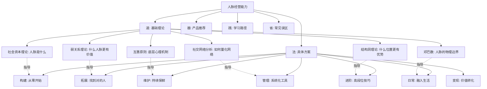
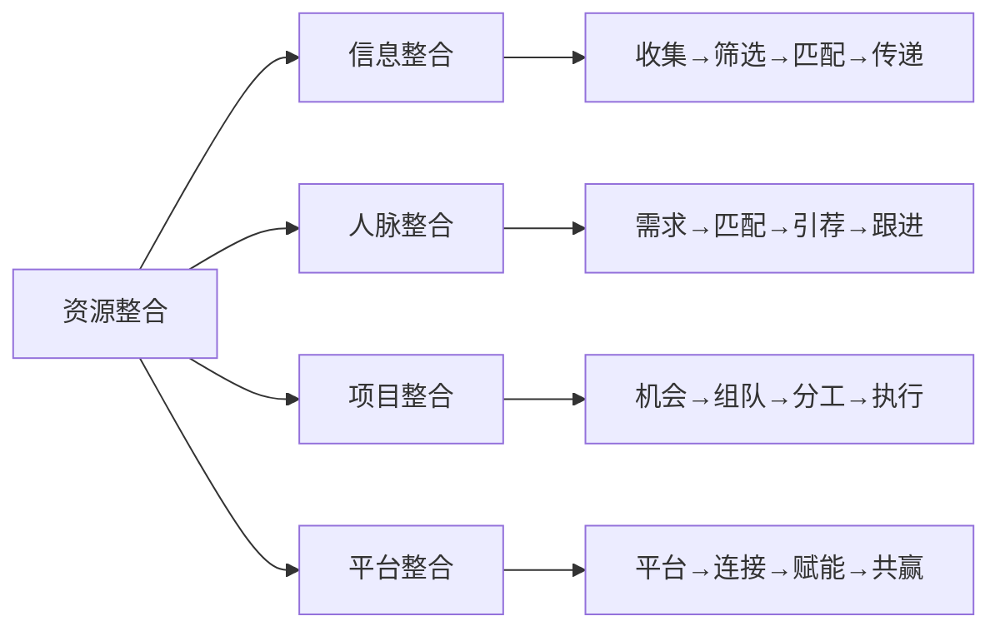
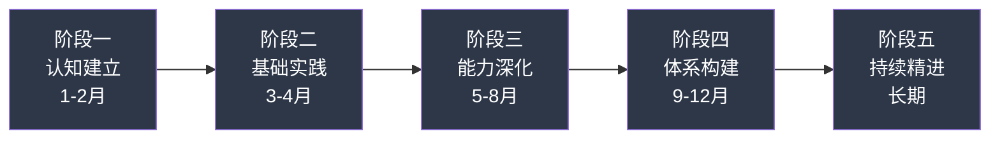

# 人脉经营 · 本章小结

> 本章从理论到实践，系统地拆解了人脉经营的底层逻辑、核心方法和进阶路径。本节不是简单的"要点罗列"，而是一次深度复盘——我们将回顾全章的核心知识体系，梳理理论之间的内在关联，提供自检工具和行动框架，帮助你将零散的知识点内化为可执行的人脉经营能力。

***

## 一、全章知识体系回顾

本章按照"道→法→术→器→践"的逻辑递进，构建了人脉经营的完整知识体系。以下是五大板块的核心定位：

| 板块 | 定位 | 核心问题 | 关键内容 |
|------|------|----------|----------|
| 基础理论（道） | 认知地基 | 人脉经营的底层规律是什么？ | 社会资本、弱关系、结构洞、社交网络分析、互惠原则、邓巴数 |
| 具体方案（法与术） | 方法论与实操 | 如何系统地经营人脉？ | 构建策略、维护方法、拓展渠道、管理工具、变现方法、日常框架、进阶技巧 |
| 产品推荐（器） | 资源工具 | 有哪些辅助资源？ | 经典书籍、实用工具、优质博主、线下活动、在线课程 |
| 学习路径（践） | 执行路线 | 如何从入门到精通？ | 四阶段成长模型、里程碑指标、阶段性检查清单 |
| 常见误区（省） | 避坑指南 | 哪些陷阱需要避开？ | 十大典型误区、成因分析、纠正策略 |

上图揭示了一个关键洞察：**六大理论不是孤立的学术概念，而是六大实践方案的底层操作系统**。理论和实践之间存在精确的映射关系——每一条实操建议都能追溯到某个理论根基，每一个理论都能落地为具体的行为指导。

***

## 二、六大理论的内在逻辑与关联

本章介绍的六大理论之间不是并列关系，而是形成了一条层层递进的认知链条。理解这条链条，你就能用一个统一的框架分析任何人脉问题。

### 2.1 认知链条：六个理论回答六个问题

社会资本理论 → 弱关系理论 → 结构洞理论 → 社交网络分析 → 互惠原则 → 邓巴数
     ↓              ↓             ↓              ↓            ↓          ↓
  人脉是什么    什么人脉     什么位置      如何量化      如何运作    能做多大
               更有价值     更有优势       网络结构      (心理机制)  (物理边界)

这六个问题构成了人脉经营的"第一性原理"。具体来说：

**第一层：定义问题——"人脉是什么？"**

社会资本理论（布迪厄、科尔曼、帕特南）给出了定义：人脉是通过社会关系网络获得的实际和潜在资源。它具有三个维度：

- **结构维度**：你在网络中处于什么位置，连接了多少节点
- **关系维度**：你与他人之间的信任程度和关系质量
- **认知维度**：你与他人之间共享的语言、价值观和思维框架

这三个维度决定了社会资本可以像金融资本一样积累和转化——转化为经济资本（商业机会）、文化资本（知识和视野）、象征资本（声誉和影响力）。

**第二层：价值判断——"什么人脉更有价值？"**

格兰诺维特的弱关系理论回答了这个问题。他发现，56%的求职者是通过个人关系找到工作的，其中83%是通过"偶尔联系"的弱关系而非亲密好友。原因在于：强关系通常与你处于同一个信息圈，传递的信息高度冗余；弱关系则跨越不同社交圈子，传递非冗余的新信息和新机会。

**核心推论**：人脉的价值不取决于亲密度，而取决于信息差。

**第三层：位置选择——"什么网络位置更有优势？"**

罗纳德·伯特的结构洞理论进一步揭示：在社交网络中，连接不同圈子的"桥梁位置"比圈子内部的"核心位置"更有竞争优势。占据结构洞位置的人拥有信息优势（最早知道两个圈子的信息）和控制优势（决定信息如何在两个圈子之间流通）。

**核心推论**：与其在一个圈子里做到最好，不如成为连接多个圈子的桥梁。

**第四层：量化工具——"如何分析和优化网络？"**

社交网络分析（SNA）提供了量化工具。通过分析网络的密度、中心性、聚类系数等指标，你可以：

- 识别自己在网络中的位置（中心还是边缘？）
- 发现网络中的结构洞（哪些圈子之间缺少连接？）
- 评估网络的多样性（信息来源是否同质化？）

**第五层：运作机制——"人脉如何运作？"**

互惠原则（西奥迪尼）揭示了人脉运作的心理机制：人类有一种强烈的回报他人好处的倾向。这种倾向是跨文化、跨时代的，根植于人类的社会性本能。

**核心推论**：先给予后索取，利用互惠原则建立正向循环，是人脉经营最有效的行为策略。

**第六层：经营边界——"人脉能做多大？"**

邓巴数（Robin Dunbar）给出了物理边界：人类能够维持的稳定社交关系上限约为150人，并呈现5-15-50-150的层次结构。这不是意志力的问题，而是大脑新皮层容量的生物学限制。

**核心推论**：接受边界，在150人的框架内做好分层管理，追求质量而非数量。

### 2.2 理论整合：关系管理矩阵

将弱关系理论（信息价值维度）和关系亲密度（情感投入维度）交叉，得到本章最核心的分析工具——**关系管理矩阵**：

| | 高情感投入 | 低情感投入 |
|---|---|---|
| **高信息价值** | 核心盟友：深度信任+高价值信息，是最珍贵的人脉资产，投入最多精力维护 | 关键弱关系：跨越不同圈子带来新信息新机会，定期维护保持连接 |
| **低信息价值** | 情感支持者：家人、挚友，提供情感支撑和心理安全感，不可忽视 | 一般联系人：维持基本礼貌即可，不投入过多精力 |

这个矩阵直接指导你的精力分配决策：核心盟友需要高频深度互动（每周至每月），关键弱关系需要定期轻量触达（每季度），情感支持者保持自然频率的陪伴，一般联系人则不必刻意维护。

***

## 三、核心实践方案回顾与深化

### 3.1 人脉构建：从零到一的策略

本章提供了四类人脉的构建方法。下表将每类人脉的构建策略、关键动作和注意事项整合为可执行的操作指南：

| 人脉类型 | 核心策略 | 关键动作 | 注意事项 |
|----------|----------|----------|----------|
| 行业导师 | 展示学习意愿和潜力，创造价值交换机会 | 先研究对方背景→提出具体问题→定期汇报进展→提供力所能及的帮助 | 不要一上来就要求"收你为徒"，关系是自然发展的 |
| 同行伙伴 | 在专业社群中建立声誉，主动分享和协作 | 参与技术讨论→分享项目经验→主动帮助解决问题→寻找合作机会 | 同行之间存在竞争关系，注意信息边界的把握 |
| 跨领域连接 | 参加跨界活动，用"翻译者"的角色建立连接 | 参加非本行业的活动→学习对方领域的基础知识→找到交叉点→提供跨界视角 | 跨界社交的回报周期更长，需要耐心 |
| 弱关系维护 | 低成本、高频率的轻量互动，保持"在对方视野中" | 朋友圈互动→分享有价值的内容→节日问候→偶遇时的深度交流 | 不要突然变得很热情，保持自然频率 |

### 3.2 人脉维护：让人脉持续保鲜

维护的核心是**建立系统化机制**，而不是依赖记忆和心情。本章推荐的分层维护频率：

核心层（5人）  ：每周1次深度互动（通话/见面/深度消息）
同情层（15人） ：每月1次有意义的互动（分享/讨论/问候）
友谊层（50人） ：每季度1次轻量互动（朋友圈/文章/活动邀约）
相识层（150人）：每半年1次触达（节日/重大事件/朋友圈点赞）

维护的核心动作包括五类：

1. **日历提醒机制**：为每个重要联系人设置定期提醒，包含上次互动时间和内容摘要
2. **内容分享**：看到对方可能感兴趣的文章、活动、机会，主动转发并附上你的见解
3. **关心问候**：记住对方的重要日期（生日、入职周年、项目节点），在关键时刻表达关心
4. **帮助支持**：在对方遇到困难或需要资源时，主动提供力所能及的帮助
5. **面对面交流**：对于核心层和同情层，定期安排线下见面，一次面对面交流的效果约等于10次线上互动

### 3.3 资源整合：让人脉产生乘数效应

人脉经营的最终目标不是"认识人"，而是通过人脉网络实现资源的高效整合。本章介绍了四种资源整合模式：

- **信息整合**：作为信息枢纽，将不同圈子的信息进行筛选、加工和传递。你提供的不是原始信息，而是经过筛选和解读的"信息增值服务"
- **人脉整合**：当A有需求、B有能力时，你作为中间人进行引荐。关键原则是：引荐前先征得双方同意，引荐后主动跟进反馈
- **项目整合**：发现商业机会后，从人脉网络中组合团队。你需要贡献的是"组局"能力——识别机会、匹配资源、协调各方
- **平台整合**：搭建一个平台（社群、活动、内容平台），让不同的人在平台上自主连接和交换价值

资源整合的核心原则：

1. **价值对等**：确保参与各方都能获得对等的价值回报
2. **信任基础**：资源整合建立在信任之上，没有信任就无法推进合作
3. **合法合规**：所有资源整合行为必须在法律和道德框架内进行
4. **长期思维**：不追求单次交易的最大化，而是建立长期的合作关系

### 3.4 圈子经营：从参与者到组织者

经营自己的圈子是人脉经营的高阶形态。本章介绍了四种圈子类型和经营步骤：

| 圈子类型 | 核心价值 | 适合人群 | 运营重点 |
|----------|----------|----------|----------|
| 学习型 | 知识分享和共同成长 | 希望持续学习的专业人士 | 高质量内容输出、定期学习活动 |
| 行业型 | 行业信息和资源对接 | 行业从业者和创业者 | 权威嘉宾邀请、行业趋势讨论 |
| 兴趣型 | 共同兴趣和情感连接 | 希望拓展社交圈的人 | 活动质量、参与体验 |
| 资源型 | 资源共享和价值交换 | 有一定资源基础的人 | 成员筛选、价值匹配 |

经营圈子的五个步骤：

1. **明确定位**：圈子的使命、目标人群、核心价值主张必须清晰
2. **搭建平台**：选择合适的工具（微信群、知识星球、线下场地）
3. **招募成员**：从种子用户开始，通过口碑传播逐步扩大
4. **运营维护**：持续产出价值内容，组织定期活动，维护圈子氛围
5. **持续迭代**：根据成员反馈不断调整圈子方向和运营方式

圈子经营的四个关键要素：核心价值（为什么留在这）、活跃氛围（参与感和归属感）、成员质量（宁缺毋滥）、规则制度（明确边界和预期）。

***

## 四、进阶能力图谱

本章在进阶技巧部分介绍了四个高阶能力。这些能力不是独立的技能，而是前面所有基础能力的综合运用和升华：

### 4.1 超级连接者

成为超级连接者意味着你从"网络中的一个节点"升级为"网络中的枢纽"。具体表现为：

- 你认识的人来自完全不同的领域和背景
- 你经常为不同圈子的人做引荐
- 当有人需要跨领域资源时，第一个想到你
- 你的名字在多个圈子中都被提及

成为超级连接者的关键条件：跨领域知识储备（能理解不同圈子的语言）、乐于助人的天性（不求即时回报的引荐）、以及在多个圈子中建立的声誉。

### 4.2 社交仪式

社交仪式是将人脉维护从"主动记着做"变为"自动发生"的系统设计。例如：

- 每月第一个周五的小组聚餐
- 每周日早晨的运动活动
- 每季度的行业沙龙
- 每年固定时间的老友聚会

社交仪式的价值在于：降低维护的决策成本（不用每次想"要不要约"），提供稳定的社交频率，自然地将弱关系转化为强关系。

### 4.3 社交货币

社交货币是你在社交场合中的"硬通货"——那些让人愿意主动接近你、与你交流的信息和资源。包括：

- **独家信息**：你比大多数人更早知道的行业趋势、政策变化、市场动态
- **深刻见解**：你对某个领域独特的理解和判断
- **有趣经历**：你的故事、旅行、跨界体验
- **稀缺资源**：你能接触到而别人接触不到的人脉和机会

积累社交货币的核心策略：持续学习保持信息优势、刻意积累独特体验、培养独到的分析视角。

### 4.4 社交直觉

社交直觉是高段位社交能力的体现——在社交场景中快速感知氛围、读懂潜台词、调整策略的能力。它包括四个子能力：

| 子能力 | 表现 | 提升方法 |
|--------|------|----------|
| 察言观色 | 快速捕捉对方的情绪和态度变化 | 有意识地观察非语言信号，事后复盘 |
| 读懂潜台词 | 理解对方没有直接说出的意思 | 多问"为什么这样说"，理解背后动机 |
| 调整风格 | 根据场景和对象切换沟通方式 | 积累不同场景的社交经验，刻意练习 |
| 判断走向 | 预判关系的发展方向和可能出现的问题 | 总结过往关系的规律，建立直觉模型 |

社交直觉不是天赋，而是经验的积累和刻意反思的结果。每一次社交互动后花5分钟复盘：这次互动中我感知到了什么？忽略了什么？下次如何改进？

***

## 五、学习路径与成长模型

本章将人脉经营的学习和实践划分为五个阶段。以下不仅是时间表，更是一份自检清单——用它来评估自己当前处于哪个阶段，以及下一步需要做什么：

### 5.1 五阶段成长模型

| 阶段 | 时间 | 核心任务 | 里程碑指标 | 常见卡点 |
|------|------|----------|------------|----------|
| 认知建立 | 第1-2月 | 理论学习、自我评估、目标设定 | 完成自我评估报告，能用理论框架分析自己的人脉结构 | 理论太多不知道从哪开始——先读社会资本理论和弱关系理论 |
| 基础实践 | 第3-4月 | 沟通技巧练习、人脉分层管理、基础维护 | 完成微信联系人分层标签，建立维护提醒机制 | 总觉得"没时间"维护——从每天5分钟开始 |
| 能力深化 | 第5-8月 | 影响力提升、资源整合实践、活动组织 | 完成第一次成功的引荐或资源整合 | 拓展弱关系时感到不自在——这是正常的，坚持突破舒适区 |
| 体系构建 | 第9-12月 | 系统化建设、圈子运营、个人品牌 | 运营自己的小型社群或定期活动 | 圈子运营缺乏持续动力——找到2-3个核心盟友共同运营 |
| 持续精进 | 长期 | 体系优化、价值输出、帮助他人 | 成为某个领域的"超级连接者" | 遇到瓶颈——定期复盘网络结构，识别新的结构洞机会 |

### 5.2 阶段间的转折点

每个阶段之间都有一个关键转折点，决定了你能否顺利进入下一阶段：

- **阶段一→二的转折**：从"知道了"到"开始做"。不需要完全理解所有理论，学到60%就可以开始实践，边做边学
- **阶段二→三的转折**：从"会做"到"做得好"。开始关注效率和策略，从被动维护变为主动经营
- **阶段三→四的转折**：从"个人能力"到"系统能力"。从依靠个人记忆和精力经营人脉，升级为借助工具和系统化方法
- **阶段四→五的转折**：从"经营人脉"到"人脉自运转"。当你的个人品牌和圈子运营到一定程度，人脉会主动向你汇聚

***

## 六、十大误区深度复盘

本章系统梳理了人脉经营中最常见的十个误区。这些误区之所以危险，是因为它们往往披着"常识"的外衣，让人在不知不觉中浪费时间和精力。以下是每个误区的核心纠正逻辑：

| 误区 | 核心错误 | 纠正逻辑 | 检查信号 |
|------|----------|----------|----------|
| 认识人多=人脉广 | 混淆了"联系人数量"和"人脉质量" | 邓巴数：150人上限，5人核心圈。100个愿意帮你的人 > 10000个不记得你名字的人 | 你的微信好友中，超过一半的人你叫不出名字？ |
| 只索取不付出 | 把人脉当"工具"使用 | 互惠原则：先给予后索取。社交寄生虫会被社交网络自动隔离 | 你最近一次主动帮助别人是什么时候？ |
| 忽视关系维护 | 认为关系"建立了就够了" | 社会资本衰减规律：6个月无互动，信任显著下降 | 你是否有3个月以上没联系的"重要"联系人？ |
| 急功近利 | 把长期投资当短期交易 | 信任建立需要1-3年的反复互动和兑现承诺 | 你是否期望参加一次活动就有重大收获？ |
| 缺乏真诚 | 用"技巧"替代"真心" | 长期博弈中，虚伪会被识破，真诚是最低成本的社交策略 | 你在社交中是否经常感觉"累"？ |
| 只在舒适区社交 | 信息来源高度同质化 | 弱关系理论：最有价值的信息来自不同圈子 | 你的朋友圈中，有多少是不同行业/背景的人？ |
| 过度依赖线上 | 低估了面对面交流的价值 | 一次面对面 ≈ 10次线上互动的效果 | 你上一次和朋友面对面深度交流是什么时候？ |
| 忽视给予 | 只关注"获取"，不关注"贡献" | 给予者最终获得最多（亚当·格兰特《给予》） | 别人提到你时，第一反应是"找他帮忙"还是"他帮过我"？ |
| 忽视边界感 | 过度热情反而让人退缩 | 健康的边界是关系的保障 | 是否有人开始回避你的消息或邀约？ |
| 等同于攀关系 | 只看对方的"资源"不看"人" | 平等互助才是长久之道，攀附者会被识别和远离 | 你是否只对"有用"的人热情？ |

### 如何避免陷入误区？

1. **每月自检**：每个月对照上表的"检查信号"进行自我诊断。如果命中3条以上，说明你可能已经陷入了某些误区
2. **寻求反馈**：向信任的朋友询问"你觉得我在社交中有什么需要改进的地方？"旁观者往往比你自己看得更清楚
3. **复盘习惯**：每次重要的社交互动后，花5分钟思考：这次互动中我的表现如何？有没有误区的痕迹？
4. **回归理论**：当你对某个社交决策感到困惑时，回到六大理论中寻找答案——理论是检验实践的标尺

***

## 七、核心行动框架

本章提供了大量行动建议，以下是经过整合的**分层行动框架**——按照时间维度和优先级，将行动拆解为可执行的具体任务：

### 7.1 立即行动清单（今天开始）

这四项任务可以在2小时内完成，但它们会为你后续所有人脉经营行动奠定基础：

- [ ] **完成自我评估**：审视你当前的人脉网络——核心层有几人？弱关系有多少？来自几个不同圈子？信息来源是否同质化？将评估结果写下来
- [ ] **制定3个月目标**：基于评估结果，设定1-3个具体、可衡量的短期目标。例如："每周至少与1位弱关系进行有质量的互动"、"参加2次不同行业的活动"
- [ ] **微信联系人分层**：为核心层（5人）标注星标，为同情层（15人）打上标签，为友谊层（50人）打上标签。这一步完成后，你的维护机制就有了基础
- [ ] **激活3个弱关系**：从你的联系人中找出3个重要的弱关系（可能带来新信息或新机会的人），给他们发一条轻量但有实质内容的消息

### 7.2 本周行动清单

- [ ] **设置维护提醒**：为核心层的5个人设置每周提醒，为同情层的15个人设置每月提醒
- [ ] **参加1次社交活动**：可以是行业沙龙、兴趣社群、线上讨论，关键是走出舒适区
- [ ] **进行1次深度交流**：与1位重要联系人安排一次30分钟以上的深度对话，了解对方的近况、需求和关注点
- [ ] **开始阅读**：推荐从《人性的弱点》（卡耐基）开始，这本书虽然年代久远，但社交心理学的核心原理至今适用

### 7.3 本月行动清单

- [ ] **建立人脉档案系统**：选择一个工具（微信标签、Notion、专用CRM），为每个重要联系人建立档案，记录基本信息、上次互动、对方需求、你的跟进计划
- [ ] **新认识10-15人**：通过线上线下渠道，主动拓展新的社交关系。注意：加微信只是开始，后续的跟进和维护才是关键
- [ ] **完成第一次引荐**：在你的联系人中找到一对互相可能有价值的人，主动为他们做引荐。这是练习"超级连接者"能力的第一步
- [ ] **完成一次复盘**：月末回顾这一个月的人脉经营行动，哪些有效？哪些无效？哪些需要调整？

### 7.4 持续行动系统

将以下行为融入你的日常生活，使其成为习惯而非"额外任务"：

- **每日（5分钟）**：浏览朋友圈/行业资讯，对重要联系人的动态进行互动（点赞+有意义的评论）
- **每周（30分钟）**：与1位核心层或同情层联系人进行深度交流；处理人脉维护提醒
- **每月（2小时）**：参加1次社交活动或社群讨论；进行一次人脉网络复盘
- **每季度（半天）**：审视人脉网络结构，更新分层标签；评估是否需要调整经营策略

***

## 八、本章核心金句

以下是贯穿全章的核心理念。它们不是鸡汤，而是经过理论验证和实践检验的人脉经营第一性原理：

> **"你的人脉有多广，取决于你能为多少人创造价值。"**

社会资本理论的核心推论：价值创造能力是人脉的源头。没有价值创造能力的人脉经营，就是无源之水。

> **"最好的社交不是认识多少人，而是让多少人认可你。"**

弱关系理论的启示：认可度决定信息传递的意愿。只有认可你的人，才会在关键时刻想到你、帮助你。

> **"人脉经营的最高境界是：你不在场时，别人仍然愿意为你说话。"**

这是社会资本的最高形式——你的声誉和信任已经超越了你个人的在场，成为一种独立运作的"社交资产"。

> **"社交不是表演，是真诚地与他人建立连接。"**

长期博弈中，真诚是最高效的策略。所有建立在表演基础上的关系，在时间的考验下都会崩塌。

> **"给予者最终获得最多——但前提是你的给予是真诚的。"**

亚当·格兰特的研究发现，最成功的人往往是给予者。但有一个关键前提：你的给予必须出于真心，而非策略性的"投资"。人们能够分辨真诚的帮助和功利的讨好。

***

## 九、从本章出发：下一步学习建议

完成本章的学习后，你可以按照以下路径继续精进：

### 9.1 深度阅读

| 书名 | 作者 | 核心价值 | 适用阶段 |
|------|------|----------|----------|
| 《人性的弱点》 | 戴尔·卡耐基 | 社交心理学的经典之作，建立正确的人际交往认知 | 入门必读 |
| 《给予》 | 亚当·格兰特 | 给予者如何在社交中获得最大回报 | 入门到进阶 |
| 《引爆点》 | 马尔科姆·格拉德威尔 | 理解社会网络中信息如何传播 | 进阶阅读 |
| 《社会网络分析》 | 罗宾·邓巴等 | 从科学角度理解社交网络的结构和规律 | 深度研究 |
| 《Never Eat Alone》 | 基思·法拉奇 | 系统化的人脉经营实操指南 | 全阶段参考 |

### 9.2 实践练习

1. **绘制你的社交网络图**：用纸笔或工具（如Kumu、Gephi），画出你当前的核心社交网络。标注每个人的关系类型、亲密度、信息价值。这会让你对自己的人脉结构有直观的认知
2. **进行一次"社交实验"**：选一个你平时不会参加的活动（不同行业、不同圈子），去那里认识3个人，事后评估：这次跨界社交带来了什么新信息或新视角？
3. **做一次"引荐实验"**：在你的联系人中找到一对互相可能有价值的人，为他们做一次引荐。观察引荐后的发展，复盘整个过程
4. **建立一个月的维护系统**：为核心层和同情层建立提醒机制，坚持执行一个月，评估效果

### 9.3 持续成长

人脉经营是一门终身课题。以下是持续成长的三个关键习惯：

1. **保持好奇心**：对不同领域、不同背景的人保持真诚的好奇。好奇心是跨领域社交最好的驱动力
2. **定期复盘**：每季度审视一次自己的人脉网络结构和经营策略，识别新的机会和需要调整的地方
3. **帮助他人成长**：当你的人脉经营能力达到一定水平后，最有价值的输出就是帮助他人建立有效的人脉网络。这不仅是利他行为，也会进一步巩固你的"超级连接者"地位

***

**人脉经营，从今天开始。** 不需要等到"准备好了"才行动——社交能力是在实践中提升的。从本章小结的行动清单中选择一项，在今天就完成它。哪怕只是一个微信消息、一次朋友圈互动、一个维护提醒的设置，都是你人脉经营旅程的起点。
