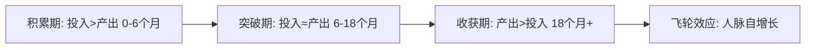
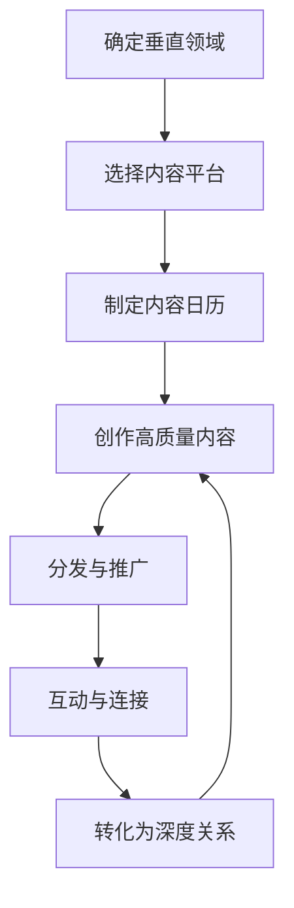
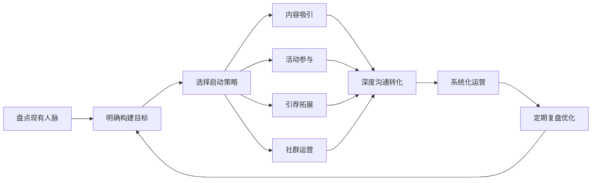

## 一、人脉构建策略：如何从零开始建立有效的人脉网络？

人脉不是"认识多少人"，而是"多少人愿意在关键时刻为你背书"。本章提供一套从零开始、可量化、可迭代的人脉构建系统——从认知底层到实操工具，帮助你在任何起点上高效搭建有价值的人脉网络。

### 1.1 人脉构建的认知基础

#### 1.1.1 为什么"从零开始"并不可怕

很多人觉得自己"没有人脉"，这是一个认知误区。你并非从零开始——你已经拥有的家人、同学、同事、邻居、兴趣伙伴，都是现成的弱关系种子。社会学家马克·格兰诺维特（Mark Granovetter）在1973年的经典论文《弱关系的力量》中指出：**真正带来新机会的，往往不是你的亲密好友（强关系），而是那些你偶尔联系的熟人（弱关系）**。原因在于强关系圈子里的信息高度重叠，而弱关系能为你打通不同社交圈层之间的信息桥。

这意味着两件事：

- 你不需要"认识大人物"才能开始，激活现有的弱关系就是第一步
- 人脉网络的规模效应是非线性的——前50个联系人最难，之后会指数级增长

#### 1.1.2 人脉的本质是价值交换网络

人脉不是名片夹，不是微信好友列表，更不是"认识谁"的虚荣指标。**人脉的本质是一个以价值交换为底层逻辑的社会资本网络**。社会资本理论（Pierre Bourdieu, 1986）将人脉定义为"个人或团体通过拥有的关系网络而获得的实际或潜在资源的总和"。

你在这个网络中的位置取决于三个维度：

| 维度 | 含义 | 举例 |
|------|------|------|
| **关系宽度** | 你连接了多少不同圈子 | 跨行业、跨地域、跨年龄层的关系 |
| **关系深度** | 你与关键人的信任程度 | 愿意为你担保、推荐、分享核心信息 |
| **结构位置** | 你是否占据"桥接"位置 | 你是两个圈子之间唯一的连接点 |

理解了这个底层逻辑，你就明白：**构建人脉的核心不是"讨好别人"，而是让自己成为一个有价值、可信赖、值得连接的节点**。

#### 1.1.3 人脉构建的复利模型

人脉构建遵循复利曲线——前期投入大量时间却看不到明显回报，但当网络突破临界点后，机会和资源会自发涌来。

**积累期（0-6个月）**：你需要主动出击，参加活动，输出内容，一对一深度交流。这个阶段你会感觉"付出很多、收获很少"，这完全正常。

**突破期（6-18个月）**：你的名字开始在圈子中被提及，有人主动找你交流，引荐开始出现。

**收获期（18个月+）**：你的社交资本开始产生复利效应。你不再需要主动推销自己——机会会通过人脉网络自动流向你。

### 1.2 从零开始的四步启动法

#### 第一步：盘点现有人脉资产

不要从零开始幻想，先搞清楚你已经有什么。拿出一张纸（或打开电子表格），完成以下盘点：

**人脉资产盘点清单：**

- **核心圈（5-15人）**：家人、挚友、长期合作伙伴——你们之间有深度信任，可以互相托付
- **活跃圈（30-50人）**：经常联系的同事、同学、朋友——你们了解彼此近况，可以互相帮忙
- **休眠圈（100-200人）**：曾经熟悉但近期没有联系的人——同学、前同事、活动认识的人
- **外围圈（200+人）**：偶尔在朋友圈/社交媒体互动的人——你知道他们是谁，但不了解近况

大多数人的"从零开始"其实是"从休眠圈开始"。**激活休眠圈比建立全新关系成本低10倍**。

#### 第二步：明确构建目标

在动身之前，先回答四个核心问题：

| 问题 | 思考方向 | 输出 |
|------|----------|------|
| 我最需要在哪些领域拓展人脉？ | 职业发展、创业合作、行业信息、个人成长、生活资源 | 1-2个优先领域 |
| 我希望认识什么类型的人？ | 同行前辈、跨行业精英、特定技能专家、志同道合的伙伴 | 目标人群画像 |
| 我能为他人提供什么价值？ | 专业知识、行业信息、情感支持、具体帮助、独特视角 | 个人价值清单 |
| 我的时间和精力预算？ | 每周可投入多少小时？能参加几次线下活动？ | 时间预算 |

基于以上回答，制定一份90天人脉构建计划：

【90天人脉构建计划模板】

目标领域：________________________
目标人群：________________________
我的核心价值：____________________

第1-30天（激活期）：
  - 重新联系 ___位休眠圈朋友（每周___位）
  - 参加___次行业活动
  - 开始输出___内容（每周___篇）

第31-60天（拓展期）：
  - 通过引荐认识___位新朋友
  - 深度交流___位关键人
  - 加入___个社群/组织

第61-90天（巩固期）：
  - 维护___位核心联系人（每周至少一次互动）
  - 主动为___人提供帮助或引荐
  - 复盘并优化下一轮计划

衡量指标：
  - 新增有效联系人数量：___
  - 深度交流次数：___
  - 获得的引荐/机会数量：___
  - 主动帮助他人的次数：___

#### 第三步：构建个人价值锚点

在你开始大规模社交之前，先建立一个清晰的"个人价值锚点"——别人提起你时，脑海中浮现的第一个标签。

**价值锚点的三个层次：**

1. **专业锚点**：你在某个领域的专业能力（"他是做增长黑客的"）
2. **资源锚点**：你能连接到的资源（"他认识很多投资人"）
3. **人品锚点**：你的可靠性和利他性（"找他帮忙准没错"）

**锚点构建公式：** `[身份标签] + [核心能力] + [差异化特征]`

示例：
- "我是做ToB SaaS销售的，专注医疗行业，手上有很多三甲医院的资源"
- "我是一个独立开发者，擅长用AI工具提升开发效率，在GitHub上有两个万星项目"
- "我是心理咨询师，专门做青少年厌学问题，做了8年，帮助过300多个家庭"

#### 第四步：选择合适的启动策略

根据你的性格和资源，选择最适合的启动策略：

| 策略 | 适合人群 | 投入成本 | 见效速度 | 可持续性 |
|------|----------|----------|----------|----------|
| 内容吸引 | 内向、有专业积累的人 | 高（前期） | 慢（3-6个月） | 极强 |
| 活动参与 | 外向、精力充沛的人 | 中 | 快（即时） | 中等 |
| 引荐拓展 | 已有一定人脉基础的人 | 低 | 中（1-3个月） | 强 |
| 社群运营 | 有组织能力、愿意长期投入的人 | 高（持续） | 中（2-4个月） | 极强 |

**关键原则：不要只选一种，但也不要同时全部启动。** 先选一个主策略，稳定后再叠加第二个。

### 1.3 四大核心构建策略详解

#### 策略一：内容吸引——让机会主动找你

内容吸引是**唯一具有复利效应的人脉构建方式**。一篇好文章、一个好视频可以在你睡觉的时候持续为你带来新的连接。

**为什么内容吸引如此有效？**

从信号理论（Signaling Theory）的角度看，高质量内容是一种"昂贵信号"——它需要真实的专业能力和时间投入，因此比口头自我介绍更能建立可信度。当一个陌生人通过你的文章认识你时，他对你的初始信任度远高于在活动上交换名片。

**内容吸引的完整执行框架：**

**（一）平台选择矩阵**

| 平台 | 内容形式 | 优势 | 劣势 | 适合领域 |
|------|----------|------|------|----------|
| 知乎 | 长文、回答 | SEO好、长尾流量、专业氛围 | 算法变化大、冷启动慢 | 专业知识、深度分析 |
| 公众号 | 图文、长文 | 私域沉淀、品牌感强 | 打开率下降、增长慢 | 行业洞察、个人品牌 |
| LinkedIn | 短文、行业动态 | 高端人脉密集、职业属性强 | 中文用户少 | 职业发展、B2B |
| B站 | 视频、教程 | 年轻用户、长视频友好 | 制作成本高 | 技术教程、行业科普 |
| 小红书 | 图文、短视频 | 流量大、女性用户多 | 偏消费、深度有限 | 生活方式、职场经验 |
| 播客 | 音频 | 深度对话、高端调性 | 制作门槛、增长慢 | 行业访谈、思想交流 |
| GitHub/技术博客 | 代码、文档 | 技术圈硬通货 | 受众窄 | 技术领域 |

**（二）内容创作的"三高原则"**

- **高信息密度**：每一段都要有实质内容，不写废话。一篇2000字的文章，读者应该能从中提取至少5个可执行的观点或方法
- **高实用性**：读完就能用。提供模板、清单、框架、案例，而不仅仅是理论
- **高辨识度**：有你自己的观点和风格。避免"正确的废话"——那种放在任何文章里都成立的话

**（三）内容日历模板（以每周为例）**

周一：行业热点解读（结合自己的专业角度）
周三：深度长文/教程（核心内容输出）
周五：个人经验/案例分享（真实故事增加信任感）
周日：互动内容（提问、投票、征集）

**（四）从内容到人脉的转化路径**

输出内容只是第一步，将读者转化为有效人脉才是目的：

1. **引导互动**：在内容末尾提出开放性问题，邀请读者分享自己的经验
2. **私信连接**：对高质量评论主动私信，表示感谢并展开对话
3. **建立社群**：将活跃读者引入微信群或知识星球，形成可运营的人脉池
4. **线下见面**：对深度互动的读者，约线下咖啡交流，将线上关系升级为线下关系

#### 策略二：活动参与——面对面建立信任

活动参与是最直接的人脉构建方式，面对面交流能在极短时间内建立线上无法替代的信任感。心理学研究表明，面对面交流时的微表情、肢体语言和即时互动能将信任建立速度提升3-5倍。

**（一）活动类型与投入产出分析**

| 活动类型 | 认识人数/次 | 关系深度 | 时间成本 | 适合阶段 |
|----------|-------------|----------|----------|----------|
| 大型行业会议/峰会 | 20-50人 | 浅 | 高（半天-2天） | 广泛拓展认知 |
| 行业沙龙/分享会 | 10-20人 | 中 | 中（2-3小时） | 深度专业交流 |
| 小型饭局/私董会 | 5-10人 | 深 | 中（2-4小时） | 深度信任建立 |
| 兴趣俱乐部/运动 | 5-15人 | 中-深 | 中（1-3小时） | 建立非工作关系 |
| 志愿者/公益活动 | 10-30人 | 中 | 高（半天-1天） | 展示品格和价值观 |
| 培训/课程工作坊 | 10-30人 | 中 | 高（半天-多天） | 同窗之谊，天然信任 |

**（二）活动参与的完整执行流程**

**活动前（准备阶段）：**

1. 研究活动信息：主题、嘉宾、参会者名单（如有）、往期评价
2. 制定"目标名单"：列出你最想认识的3-5个人，研究他们的背景和最近动态
3. 准备自我介绍：30秒版本（简洁有力）和2分钟版本（有故事性）
4. 准备"价值钩子"：你能给别人带来什么（一个行业数据、一个工具推荐、一个人脉引荐）

**活动中（执行阶段）：**

1. **到场时机**：提前15分钟到，这时人少，容易与组织者和先到的人建立一对一连接
2. **座位选择**：坐在你想认识的人旁边，而不是坐在角落
3. **开场方式**：不要用"你是做什么的？"这种俗套开场，试试：
   - "你也是因为对XX话题感兴趣来的吗？"
   - "刚才XX嘉宾的观点你怎么看？"
   - "我发现你的名片上写着XX，我一直想了解这个领域"
4. **深度交流优先**：与2-3个人进行20分钟以上的深度对话，比与20个人各聊2分钟更有效
5. **做"连接者"**：如果你发现现场两个人可能互相需要，主动为他们引荐——这会让你成为双方都感谢的人
6. **善用休息时间**：茶歇和午餐是最佳社交时间，主动端着咖啡走动

**活动后（跟进阶段）：**

1. **24小时内**：添加微信并发送个性化消息（提到对话中的具体内容，而非群发模板）
2. **一周内**：分享一条与对话相关的信息、文章或资源
3. **一个月内**：寻找一次深度交流的机会（约咖啡、视频通话、或在下次活动再见面）

**（三）活动后的跟进消息模板**

错误示范：
"XX你好，我是昨天活动上认识的XXX，很高兴认识你！以后多交流~"
（空洞、无记忆点、没有提供价值）

正确示范：
"XX你好，我是昨天沙龙上坐在你旁边的XXX。你提到的那个关于私域流量的案例让我很受启发，
我今天找到了一篇相关的深度分析文章 [链接]，分享给你。另外我之前做过一个类似的项目，
如果你想了解细节，我们可以约个时间聊聊。"
（具体、有记忆点、提供价值、留下后续连接的钩子）

#### 策略三：引荐拓展——借力信任背书

引荐是效率最高的人脉构建方式，因为它**借用了引荐人的信任资本**。当一个你信任的朋友告诉你"这个人很靠谱"，你对这个陌生人的初始信任度会远高于自己去认识的。

**（一）引荐的底层逻辑**

引荐本质上是一种"信任转移"机制。社会网络理论中称之为"传递性"（Transitivity）：如果A信任B，B信任C，那么A对C的信任度会显著提升。这就是为什么"朋友的朋友"天然比"完全的陌生人"更容易建立关系。

**（二）引荐的正确姿势**

**请求引荐的公式：**
[我是谁] + [我想认识谁/什么类型的人] + [为什么] + [我能给对方提供什么价值]

错误示范：
"能帮我介绍一些投资人吗？"（太模糊，对方不知道怎么帮你）

正确示范：
"我最近在做企业SaaS方向的创业，产品已经有200家付费客户。我想认识在ToB SaaS领域有投资经验的天使投资人，聊聊下一轮融资的节奏和估值。如果你有合适的人选，我非常乐意先分享一下我们的产品和数据，即使最后不投资也能交个朋友。"

**（三）成为"引荐中心"的策略**

最强大的人脉策略不是"请求别人引荐你"，而是"成为别人请求引荐的中心"。

具体做法：
1. **记录每个人的专长和需求**：维护一个简单的表格，记录你认识的人"擅长什么"和"需要什么"
2. **主动匹配**：定期扫描你的联系人，发现可以互相帮助的组合，主动引荐
3. **不求即时回报**：引荐的本质是"先给予"——你帮别人建立的连接越多，积累的"引荐信用"越大
4. **跟进引荐结果**：引荐后关心双方的交流是否顺利，这会让你成为可信赖的连接者

**（四）加入引荐型组织**

如果你希望系统化地进行引荐拓展，可以考虑加入专业的引荐型组织：

- **BNI（Business Network International）**：全球最大的商业引荐组织，每个分会每行业只限一人，通过每周固定聚会互相引荐
- **本地商会/行业协会**：有组织化的社交活动和资源对接机制
- **创业者社群/私董会**：定期聚会、深度交流、互相引荐

#### 策略四：社群运营——从"参与者"到"组织者"

社群运营是人脉构建的高级形式。当你从"参加别人组织的活动"变为"自己组织社群"时，你就从"寻找人脉"变为"人脉主动流向你"。

**（一）为什么社群运营是终极策略？**

从网络结构理论来看，社群运营者天然处于"中心节点"位置——所有社群成员都与你直接连接，而成员之间可能并不互相认识。这种"星型网络结构"赋予你最大的信息优势和连接能力。

**（二）社群类型与定位选择**

| 社群类型 | 定位示例 | 核心价值 | 运营难度 | 适合人群 |
|----------|----------|----------|----------|----------|
| 学习型 | 每周共读一本商业书 | 知识输入+讨论碰撞 | 低 | 有学习习惯的人 |
| 行业型 | 产品经理交流群 | 行业信息+求职招聘 | 中 | 有行业积累的人 |
| 技能型 | Python编程实战营 | 技能提升+项目协作 | 中 | 有技术能力的人 |
| 资源型 | 创业者投融资对接 | 资源匹配+商业合作 | 高 | 有资源和信誉的人 |
| 兴趣型 | 周末户外徒步群 | 兴趣交流+线下活动 | 低 | 有共同兴趣的人 |

**（三）社群冷启动方法**

从零开始建社群最大的挑战是"冷启动"——没有人愿意加入一个空荡荡的群。以下是经过验证的冷启动策略：

1. **种子用户法**：先邀请10-20个你最熟悉、最活跃的朋友作为种子用户，让他们先"暖场"
2. **价值前置法**：在建群之前，先通过内容输出（文章、直播、课程）积累一批对你有认知的潜在成员
3. **活动导入法**：通过组织一次线下活动，将参与者导入微信群
4. **互推法**：与其他社群群主互相推荐，交换成员

**（四）社群运营的关键指标**

活跃率 = 每日发言人数 / 总人数 × 100%
  健康标准：>20%

留存率 = 30天后仍在群内的人数 / 入群总人数 × 100%
  健康标准：>70%

转化率 = 参加线下活动的人数 / 群总人数 × 100%
  健康标准：>10%

口碑率 = 通过老成员推荐入群的人数 / 新增人数 × 100%
  健康标准：>30%

### 1.4 沟通技巧：从认识到连接

认识到一个人只是开始，如何将一次偶遇转化为有效的人脉关系，取决于你的沟通能力。

#### 1.4.1 初次接触的"黄金30秒"

心理学中的"首因效应"（Primacy Effect）告诉我们，人们对你的第一印象在最初几秒内就会形成，并且会长期影响后续认知。你只有30秒来建立一个好的第一印象。

**初次接触的四步法：**

1. **破冰**：用一句自然、不刻意的话开场
   - 活动场景："刚才XX老师分享的观点很有意思，你怎么看？"
   - 线上场景："看了你写的关于XX的文章，很有共鸣，特别是XX那段"
   - 引荐场景："XX跟我提起过你，说你在XX方面特别厉害"

2. **建立连接**：快速找到共同点
   - 共同行业："你也是做XX的？太巧了"
   - 共同兴趣："你也喜欢XX？我最近刚……"
   - 共同朋友："你认识XX？我们是大学同学"
   - 共同经历："你之前也在XX公司？我2019年在那里待过"

3. **提供价值**：在第一次交流中就给予对方某种价值
   - 信息价值："你刚才提到的XX问题，我知道一个解决方案……"
   - 连接价值："你如果想了解XX领域，我可以介绍一个人给你认识"
   - 资源价值："我手头正好有一份XX报告，回头发给你"

4. **留钩子**：为下一次交流埋下伏笔
   - "下次有机会我们可以深入聊聊XX话题"
   - "我下周会写一篇关于XX的文章，到时候发给你看看"
   - "你提到的那个问题，我回去研究一下，有了结果告诉你"

#### 1.4.2 深度对话的艺术

初次接触只能留下印象，深度对话才能建立信任。

**提问技巧——用"钻石问题"引导深度对话：**

- **探索型**："你当初是怎么进入这个行业的？"（引出故事）
- **思考型**："你觉得未来3年这个领域最大的变化会是什么？"（引出见解）
- **情感型**："你在这个过程中遇到过什么让你印象特别深刻的挑战？"（引出真实感受）
- **连接型**："你提到XX，我之前也有类似的经历……"（建立共鸣）

**倾听的三个层次：**

1. **听内容**：对方在说什么事实和信息
2. **听意图**：对方为什么说这些，想表达什么
3. **听情感**：对方的情绪状态是什么，需要什么样的回应

高手的倾听不仅是"嗯嗯啊啊"的附和，而是适时地总结和反馈：
- "所以你的意思是……"
- "听起来你对XX特别有热情"
- "如果我理解正确的话，你现在的挑战是……"

#### 1.4.3 结束对话与后续跟进

**优雅地结束对话：**

- "跟你聊天收获很大，我得去跟XX打个招呼，咱们加个微信保持联系？"
- "时间不早了，今天聊得很开心，下次我们可以找个安静的地方深聊"
- "我还有个想法想跟你探讨，但今天时间有限，咱们约个时间继续？"

**跟进消息的"三要素"：**

每条跟进消息必须包含以下至少两个要素：

1. **具体回忆**：提到对话中的具体内容（证明你认真听了）
2. **提供价值**：附带一个相关资源、信息或帮助
3. **后续钩子**：提出一个具体的后续行动建议

**跟进节奏表：**

| 时间节点 | 行动 | 目的 |
|----------|------|------|
| 24小时内 | 添加联系方式+个性化消息 | 巩固印象 |
| 1周内 | 分享一条相关信息/资源 | 提供价值 |
| 1个月后 | 邀约一次深度交流（线上/线下） | 升级关系 |
| 持续 | 点赞/评论朋友圈、节日问候 | 保持存在感 |

### 1.5 常见误区与纠正

#### 误区一：追求"高端人脉"

**错误表现**：一心想认识大佬、CEO、投资人，忽视身边的人。

**为什么错**：第一，你和"大佬"之间没有价值交换的基础，认识了也很难建立真正关系；第二，你的同层级伙伴未来可能是最有价值的人脉——他们的成长速度可能比你想象的快得多。

**纠正方法**：优先与同层级、同阶段的人建立深度关系。当你自己的价值提升后，"高端人脉"会自然出现。

#### 误区二：广撒网、不深耕

**错误表现**：参加大量活动，加了很多人微信，但没有一个深度关系。

**为什么错**：人脉网络的价值不在于"节点数量"，而在于"连接强度"。100个点赞之交不如10个真心朋友。

**纠正方法**：每次活动重点关注2-3个人，进行深度对话并持续跟进，而不是跟所有人泛泛交流。

#### 误区三：只索取不付出

**错误表现**：每次联系别人都是"求帮忙"，从不主动为别人提供价值。

**为什么错**：社会资本理论的核心是"互惠"——长期单方面索取的人会被社交网络排斥。

**纠正方法**：遵循"5:1法则"——每请求一次帮助之前，先主动为对方做5件有价值的事。

#### 误区四：忽视线上维护

**错误表现**：线下活动上交换了名片/微信后，再无任何互动。

**为什么错**：心理学中的"遗忘曲线"（Ebbinghaus Forgetting Curve）表明，如果不及时巩固，7天后你对一个人的记忆就会衰减80%以上。

**纠正方法**：严格执行"24小时跟进"规则，并定期（至少每月一次）与重要联系人保持互动。

#### 误区五：把社交当作"表演"

**错误表现**：在社交场合过度包装自己，说大话、炫耀成就。

**为什么错**：真正的高手都有一眼看穿虚假的能力。过度包装不仅不会加分，反而会失去信任。

**纠正方法**：真诚是最好的社交策略。承认自己不知道的，分享自己真实经历的挫折和教训，比吹嘘成就更能赢得尊重。

### 1.6 进阶：人脉构建的系统化运营

当你的初步人脉网络建立起来后，需要用系统化的方式来维护和运营。

#### 1.6.1 人脉CRM系统

像管理客户一样管理你的人脉关系。核心字段：

| 姓名 | 认识时间 | 认识场景 | 职业/领域 | 核心价值 | 上次联系 | 联系频率 | 备注 |
|------|----------|----------|-----------|----------|----------|----------|------|
| 张三 | 2024.3   | 产品大会 | SaaS产品  | 产品方法论| 2024.6   | 每月     | 有两个孩子 |

工具推荐：
- 轻量级：微信标签+备忘录、Notion数据库
- 中量级：Airtable、飞书多维表格
- 专业级：Lark、HubSpot（免费版）

#### 1.6.2 定期复盘机制

每月花30分钟复盘你的人脉经营：

- 本月新增了多少有效联系人？
- 与核心联系人保持了足够的互动吗？
- 有没有为他人提供了有价值的帮助？
- 下个月需要重点维护哪些关系？

#### 1.6.3 人脉网络健康度自检

定期评估你的人脉网络是否健康：

- **多样性**：你的联系人是否覆盖了不同行业、不同背景？
- **平衡性**：你的关系是否都是"索取型"，还是也有"给予型"？
- **活跃度**：你的联系人中，有多少是你近3个月有交流的？
- **成长性**：你的社交圈是否在持续扩大和升级？

### 1.7 总结

人脉构建不是一次性任务，而是一个持续迭代的系统工程。核心要点回顾：

1. **认知先行**：理解人脉的本质是价值交换网络，弱关系比强关系更可能带来新机会
2. **盘点启动**：从激活现有关系开始，而非凭空构建
3. **策略选择**：根据自身特点选择内容吸引、活动参与、引荐拓展或社群运营中的一种作为主策略
4. **深度优先**：10个深度关系胜过100个浅层认识
5. **持续经营**：人脉需要像花园一样持续浇水施肥，而非种下就不管
6. **系统化**：用CRM工具和定期复盘来保证执行的持续性和有效性

记住：**最好的人脉策略是成为一个值得被连接的人**。先提升自己的价值，再通过系统化的方式让这个价值被更多人看到和信任。人脉不是"求来的"，而是"吸引来的"。
