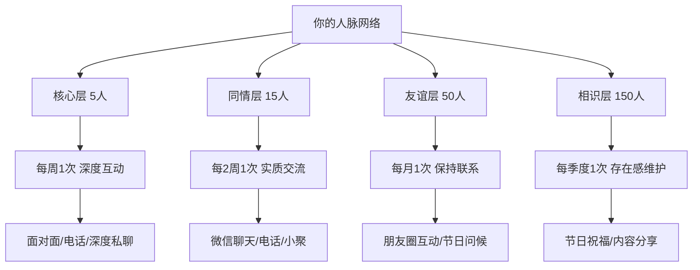
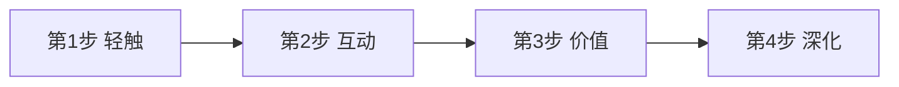
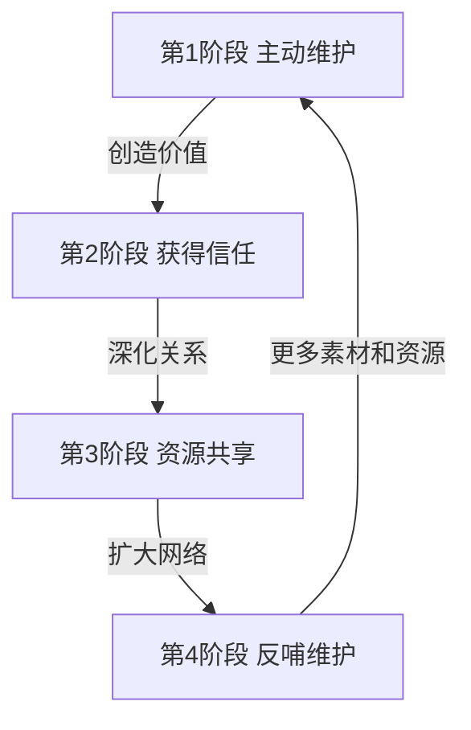

## 二、人脉维护方法：如何让人脉持续保鲜？

认识一个人只是开始，维护关系才是人脉经营的核心。很多人的问题不是认识的人太少，而是维护的关系太浅。研究显示，一个普通职场人每年新增联系人约200-300人，但其中超过80%会在一年内变成"僵尸联系人"——躺在通讯录里，既不互动也不产生任何价值。人脉维护的本质不是"多联系"，而是建立一套可持续运转的关系保鲜系统。

### 2.1 关系衰减的科学原理

理解关系为什么会变淡，才能有针对性地维护。关系衰减不是主观感受，而是有清晰的心理学和神经科学机制。

**（1）遗忘曲线与关系衰退**

赫尔曼·艾宾浩斯（Hermann Ebbinghaus）的遗忘曲线不仅适用于记忆，也适用于人际关系。当你与一个人的互动频率下降时，对方对你的记忆强度会呈指数衰减。具体表现为：

| 停止互动时长 | 记忆强度 | 关系状态 | 恢复难度 |
|:---:|:---:|:---:|:---:|
| 1个月内 | 80%以上 | 热络 | 极低，自然衔接即可 |
| 1-3个月 | 50%-70% | 温热 | 低，简单寒暄即可 |
| 3-6个月 | 30%-50% | 转凉 | 中等，需要价值驱动 |
| 6-12个月 | 10%-30% | 冷淡 | 较高，需要重新激活 |
| 超过1年 | 低于10% | 冻结 | 很高，几乎需要重新建立 |

**（2）邓巴层级与维护成本**

人类学家罗宾·邓巴（Robin Dunbar）的研究表明，人类大脑的认知容量决定了我们能维护的社交关系数量是有限的。不同层级的关系需要不同的维护投入，这就是为什么"一视同仁"的维护策略注定失败——你不可能用维护5个至交好友的方式去维护150个熟人。

**（3）关系的"用进废退"效应**

神经科学表明，当我们与某人频繁互动时，大脑中关于这个人的神经回路会被反复激活和强化。而一旦互动停止，这些回路会逐渐弱化。这不仅影响记忆，还影响情感联结——你可能还记得一个人，但已经感受不到曾经的亲近感。这就是为什么"认识"和"熟悉"是两个完全不同的层次。

### 2.2 关系维护的五大核心原则

这五个原则不是空洞的口号，而是从大量社交心理学研究和实践中提炼出的操作准则。每个原则背后都有明确的行为指导。

**（1）主动原则：掌握关系的"先手优势"**

在关系维护中，"先手"意味着你主动发起互动，而不是被动等待。先联系的人掌握关系的节奏和方向。

为什么主动如此重要？社会心理学中的"启动效应"（Priming Effect）表明，当一个人最近被你联系过，他在接下来的一段时间内会更容易想到你、提起你、甚至为你创造机会。先手联系等于在对方的意识中"种下了一颗种子"。

具体行为指导：
- 每周固定一个"社交时间"（比如周日晚上30分钟），批量处理待维护的关系
- 建立"主动联系"的习惯：看到有趣的内容→立刻想到谁会感兴趣→转发并附上你的想法
- 设定"主动联系"的最低标准：每天至少主动联系1个人（即使是简单的一句话）
- 不要等到"有事"才联系，无事联系才是真维护

**（2）真诚原则：从"表演关心"到"真正关心"**

虚假的关心比不关心更糟糕。人脑有极强的"微表情识别"和"语气分析"能力——即使在文字交流中，对方也能感受到你是真心还是敷衍。

真诚体现在三个层次：
- **表层真诚**：记住对方说过的话，下次聊天时主动提及（"上次你说在准备的项目进展如何？"）
- **中层真诚**：在对方不需要你的时候也关心对方（不是只有求人办事时才联系）
- **深层真诚**：在对方遭遇困境时提供不求回报的帮助，在对方做出错误决定时敢于说出真实看法

反面案例：逢年过节群发"祝您万事如意"的消息，不带任何个性化内容。这种行为不仅不加分，反而会让人觉得你不走心——收件人一眼就能看出这是群发，你在他心中的印象反而从"普通朋友"降级为"群发机器"。

**（3）持续原则：关系维护是"长跑"不是"冲刺"**

关系维护最忌讳的是"三分钟热度"。研究表明，如果两个朋友超过6个月没有任何互动，他们之间的关系亲密度会显著下降（Hillance & Dunbar, 2023）。更重要的是，断断续续的维护比完全不维护更糟糕——它给对方传递的信号是"你只在想起我的时候才联系我"。

持续原则的核心是建立"维护节奏"，而不是依赖灵感或心情：
- 为核心层关系设定每周至少1次的互动频率
- 为同情层关系设定每2周至少1次的互动频率
- 为友谊层关系设定每月至少1次的互动频率
- 为相识层关系设定每季度至少1次的互动频率

这些频率是下限，不是上限。自然产生的互动越多越好，但人为设定的最低频率确保了没有关系被遗忘。

**（4）价值原则：每次互动都要"加分"**

价值创造是关系维护的核心动力。如果你每次联系对方都只是"在吗？""吃了吗？""最近忙什么？"，对方很快就会觉得与你交流没有收获，互动意愿自然下降。

价值的多种形式：

| 价值类型 | 具体形式 | 示例 |
|:---:|:---|:---|
| 信息价值 | 分享对方需要的行业资讯、学习资源 | "看到这篇关于XX行业的报告，想到你在做相关业务，分享给你" |
| 连接价值 | 为对方介绍有价值的人脉 | "我有个朋友在XX领域很资深，需要我介绍你们认识吗？" |
| 情感价值 | 在对方需要时提供情感支持 | "听说你最近压力很大，想聊聊吗？" |
| 专业价值 | 在你的专业领域提供帮助 | "你提到的那个技术问题，我之前遇到过，解决方案是..." |
| 机会价值 | 发现并传递适合对方的机会 | "看到一个XX岗位，觉得很适合你，链接发你看看" |

**（5）平衡原则：避免"社交失衡"**

健康的关系必须是双向的。如果你发现自己在某段关系中一直是付出方或索取方，这段关系就已经失衡了。

失衡的典型表现：
- **过度付出型**：总是你在联系、你在帮忙、你在主动，对方从不回馈。长期下去你会感到疲惫和不值。
- **过度索取型**：只在需要帮助时才联系对方，帮完忙就消失。对方会逐渐把你归类为"功利社交者"。
- **过度热情型**：联系频率远超对方的舒适度，让对方感到压力。过度热情的本质是不尊重对方的边界。
- **过度冷淡型**：想起来才联系一次，频率太低导致关系总是处于"重启"状态。

平衡策略：定期审视你的核心关系，问自己——"这段关系中，我和对方的付出比例大概是多少？"如果长期严重失衡（比如超过7:3），要么调整你的投入，要么重新评估这段关系的价值。

### 2.3 分层维护策略：不同关系用不同"配方"

维护人脉不是"一刀切"——你不可能用维护5个至交好友的方式去维护150个熟人。分层维护是效率和效果的最优解。

**（1）核心层（5人以内）——无条件支持的"人生合伙人"**

这5个人是你在任何情况下都可以打电话求助的人，是你人生重大决策的参谋团，是你情感支持的最后一道防线。

- **维护频率**：每周至少1次实质互动（不是"在吗"，是有内容的交流）
- **维护方式**：深度对话、面对面见面、共同活动、电话长聊
- **内容范围**：生活近况、情感交流、重大决策讨论、人生困惑、家庭事务
- **投入标准**：最多的时间和精力，不计较回报
- **关键特征**：你可以在他们面前展示脆弱，他们也不会因此轻视你

维护要点：
- 不要因为"太熟了"就忽视维护——最亲密的关系也需要经营
- 在对方人生重要节点（结婚、生子、换工作、亲人离世）一定要到场或深度参与
- 定期进行"关系体检"：上一次深度交流是什么时候？有没有被忽略的需求？
- 核心层关系的最大威胁不是矛盾，而是"因为太熟而不再用心"

**（2）同情层（15人以内）——深度互动的"战略盟友"**

这15个人是你在特定领域深度合作或互相支持的人，可能是亲密的同事、行业挚友、长期合作伙伴。

- **维护频率**：每2周至少1次实质互动
- **维护方式**：微信深度聊天、电话、小聚、共同项目
- **内容范围**：工作动态、行业信息、资源互换、互相帮助
- **投入标准**：较多的时间和精力，注重价值交换
- **关键特征**：彼此认可对方的能力和人品，愿意在各自领域互相支持

维护要点：
- 保持"价值交换"的平衡——不要总是索取，也不要总是给予
- 定期分享对方感兴趣的行业信息和机会
- 在对方需要帮助时积极回应，但也要学会合理拒绝
- 关注对方的职业发展节点，及时祝贺或提供支持

**（3）友谊层（50人以内）——定期互动的"朋友圈活跃分子"**

这50个人是你在社交网络中保持活跃连接的人，可能是普通朋友、同事、同学、社群伙伴。

- **维护频率**：每月至少1次互动
- **维护方式**：微信互动、朋友圈点赞评论、节日问候、偶约小聚
- **内容范围**：信息分享、简单问候、偶尔的社交活动
- **投入标准**：适度的时间，高效互动
- **关键特征**：彼此记得对方，有需要时能找到对方

维护要点：
- 朋友圈互动是最高效的维护方式——点赞和有针对性的评论让人感到被关注
- 节日问候要个性化，至少提到一个与对方相关的细节
- 如果发现对方朋友圈有重要动态（换工作、结婚等），私聊祝贺比朋友圈评论更有温度
- 每半年清理一次这一层级，将关系升温的人提升到同情层，将长期不互动的人降级到相识层

**（4）相识层（150人以内）——低成本维护的"弱关系网络"**

这150个人是你认识但不深入了解的人，可能是行业活动上交换名片的人、微信群里加的好友、朋友的朋友。

- **维护频率**：每季度至少1次互动
- **维护方式**：朋友圈互动、节日祝福、偶尔分享有价值的信息
- **内容范围**：节日问候、行业信息分享、简单互动
- **投入标准**：少量但定期的时间，重在保持存在感
- **关键特征**：你知道对方是谁，对方也知道你是谁，但互动不多

维护要点：
- 弱关系的价值在于"信息桥梁"——他们连接着你接触不到的圈子，维护成本低但潜在价值高
- 节日群发祝福时，至少对其中20%的人做个性化修改
- 偶尔在朋友圈分享行业干货，让这些人持续看到你的专业形象
- 如果某位相识层的人突然活跃起来（比如频繁点赞你的朋友圈），考虑是否应该升级关系

### 2.4 六种核心维护方法（附实操模板）

以下六种方法覆盖了人脉维护的90%场景。每种方法都附有具体的操作流程和模板，拿来即用。

**（1）日历提醒法——让系统替你记住**

人脑不擅长记忆日期和周期性任务，但日历工具擅长。把维护节奏交给系统，你只负责执行。

操作流程：
1. 选择工具：手机自带日历、Google Calendar、Outlook Calendar、或专业CRM（见2.6工具推荐）
2. 录入信息：为每位重要联系人创建"联系人事件"，包含姓名、关系层级、上次互动日期、关键信息
3. 设置提醒：根据关系层级设置不同的提醒周期（核心层每周、同情层每两周等）
4. 记录备注：每次互动后更新备注，记录交流要点、对方近况、待跟进事项

模板示例（日历事件备注）：
【联系人】张三 - 前同事，现在某公司做产品经理
【层级】同情层
【上次联系】2024-12-15 - 讨论了他新项目的技术选型
【关键信息】妻子怀孕，预产期2025年3月；对AI产品很感兴趣
【下次联系主题】问问他宝宝出生了没有，分享一篇AI产品经理的文章

**（2）内容分享法——用信息建立连接**

看到对某位朋友有用的信息，立刻分享。这是最低成本、最高效率的维护方式。

操作原则：
- **针对性**：不是群发，是为特定的人分享特定的内容。"看到这篇文章，立刻想到了你"比"分享一篇好文章"有力10倍。
- **附加价值**：不要只丢一个链接，附上你的简短评论或思考。"这篇报告的第三章关于XX的数据，和你上次提到的项目很相关"比"看看这个"有价值得多。
- **频率控制**：同一对象每月分享2-3次为宜，过多会让人觉得被打扰。
- **渠道选择**：微信私聊 > 微信群@ > 朋友圈@，私密性越高，对方越觉得你用心。

分享话术模板：
- "今天看到这篇文章，里面关于XX的观点让我想到你之前说的XX，分享给你看看。"
- "刚参加了一个XX活动，有个信息可能对你有用：[具体内容]。"
- "最近在读XX书，里面有个观点你可能会感兴趣：[摘录+你的思考]。"

**（3）关心问候法——在关键时刻出现**

关心问候的核心不是频率，而是时机。在对方最需要的时候出现，比平时联系100次更有效。

关键时机清单：

| 时机 | 行动 | 话术示例 |
|:---|:---|:---|
| 对方升职/获奖 | 当天私聊祝贺 | "恭喜升职！你在这个岗位上一定能做得更出色，有机会一起吃饭庆祝一下？" |
| 对方发布文章/作品 | 认真阅读后给出有质量的反馈 | "刚读完你那篇关于XX的文章，第三部分的分析特别到位，我有一个补充想法..." |
| 对方生病/遇到困难 | 立刻表达关心，提供力所能及的帮助 | "听说你最近身体不舒服，别太拼了。需要什么帮忙尽管说，我随时都在。" |
| 对方换工作/搬家 | 跟进了解情况 | "听说你去了XX公司？那边的XX业务做得很好，新环境还适应吗？" |
| 对方重要纪念日 | 提前准备，当天表达 | 生日、入职周年、结婚纪念日等 |
| 行业重大事件 | 第一时间与对方讨论 | "今天XX政策出台了，对你所在的行业影响应该不小，你怎么看？" |

**（4）帮助支持法——"利他"是最强的社交货币**

主动为他人提供帮助是建立深度信任最快的方式。但帮助的质量比数量重要——一次精准的、及时的帮助，胜过十次敷衍的"有事找我"。

帮助的层次：
- **第一层：信息帮助**——分享对方需要的信息、文章、数据。成本最低，但要做到精准。
- **第二层：连接帮助**——为对方介绍合适的人脉。需要你对双方都有足够的了解，避免"硬凑"。
- **第三层：专业帮助**——在你的专业领域为对方提供深度帮助。这需要你有真本事，不是说"我试试"就能敷衍的。
- **第四层：资源帮助**——在对方需要时，调用你的资源（资金、设备、渠道等）提供支持。这是最高级别的帮助，也是建立深度信任的关键。

帮助后的注意事项：
- 帮助后不要立刻期望回报——互惠是长期的，不是即时交易
- 帮助后不要反复提起——"我上次帮了你XX"这种话会让所有善意归零
- 帮助后观察对方的反应——如果对方表示感谢并在未来回馈，这段关系值得深化；如果对方毫无表示甚至觉得理所当然，考虑调整投入

**（5）面对面交流法——无法替代的信任加速器**

在所有沟通方式中，面对面交流的信任建立效率是最高的。研究表明，面对面沟通传递的信息中，55%来自肢体语言，38%来自语气语调，只有7%来自文字内容。这意味着微信聊天最多只能传递7%的信息量。

面对面交流的实操建议：
- 频率：核心层每月至少1次，同情层每季度至少1次
- 形式：不必每次都是正式聚餐，一杯咖啡、一次散步、一起运动都是好选择
- 准备：见面前提前想好2-3个话题，避免冷场。可以从对方朋友圈的近况、上次交流的延续话题、共同关心的行业动态入手
- 记录：见面后花5分钟记录交流要点（对方提到的新需求、新变化、待跟进事项），为下次见面做准备

**（6）共同活动法——在"一起做事"中深化关系**

共同活动是关系从"认识"升级到"熟悉"的最自然方式。一起经历过事情的人，关系深度远超只聊天的人。

活动类型推荐：

| 活动类型 | 适合关系层级 | 信任建立效率 | 示例 |
|:---:|:---:|:---:|:---|
| 运动健身 | 核心层/同情层 | ★★★★★ | 跑步、羽毛球、健身房、登山 |
| 学习成长 | 同情层/友谊层 | ★★★★☆ | 读书会、技术沙龙、行业会议 |
| 休闲娱乐 | 全层级 | ★★★☆☆ | 看展、看电影、桌游、KTV |
| 公益活动 | 同情层/友谊层 | ★★★★☆ | 志愿者活动、公益项目 |
| 旅行出游 | 核心层 | ★★★★★ | 短途旅行、自驾游 |

活动后的延续：活动结束后，分享照片、发送感想、约定下次活动。不要让活动成为一个孤立事件，而是成为持续互动的起点。

### 2.5 关系"复活"技巧：如何唤醒沉睡的人脉

有些关系已经疏远了半年甚至更久，但你仍然希望重新激活。复活关系比维护关系难得多，但并非不可能——关键是找到正确的"重启方式"。

**（1）自然重启法——让重新联系看起来毫不刻意**

重新联系的最大障碍是"尴尬"——对方会想"为什么突然联系我？是不是有事求我？"。消除这种疑虑的关键是让重启看起来自然。

自然重启的触发点：
- **借助动态**：看到对方朋友圈的新动态（换工作、发文章、旅行等），以此为切入点私聊
- **借助共同话题**：行业出了大新闻、你们共同关注的领域有新进展，借此联系
- **借助回忆**：路过你们曾经一起去过的地方、看到你们曾经讨论过的话题，以此为由头
- **借助第三方**：听到共同朋友提到对方的近况，顺势联系

重启话术模板：
- "好久没联系了！刚才在朋友圈看到你去了XX，照片拍得好美，玩得怎么样？"
- "今天突然想起咱们之前一起做XX项目的日子，你现在还在做XX方向吗？"
- "最近XX行业出了个大新闻，我记得你之前在这个领域，你怎么看？"

**绝对不要做的**：
- 不要为长时间不联系道歉——"不好意思这么久没联系你"这种话只会放大尴尬
- 不要开门见山说目的——"有件事想请你帮忙"是最差的重启方式
- 不要发"在吗？"——两个字的信息让人紧张，不知道你要说什么

**（2）价值驱动法——带着"见面礼"重启**

如果你能找到一个对对方有价值的信息、资源或机会作为重启的"见面礼"，成功率会大幅提升。

操作步骤：
1. 研究对方的现状（朋友圈、LinkedIn、共同朋友的描述）
2. 找到对方当前的需求或痛点
3. 准备一个能帮到对方的具体资源（文章、人脉、机会、信息）
4. 以分享这个资源为由头重新联系

话术模板：
- "最近看到一个XX岗位在招人，要求和你的背景非常匹配，想推荐给你看看。顺便好久没联系了，你现在还在XX公司吗？"
- "今天读到一篇关于XX的深度报告，数据非常扎实。记得你之前在做相关的事情，分享给你看看。最近怎么样？"

**（3）渐进恢复法——不要指望"一步到位"**

关系的降温是渐进的，回暖也应该是渐进的。一次联系就想恢复到曾经的亲密度，既不现实，也会给对方压力。

渐进恢复的四步法：

- **第1步·轻触**（第1周）：在对方朋友圈点赞或评论，让对方知道你的存在。不要直接私聊。
- **第2步·互动**（第2-3周）：找一个自然的话题私聊几句，交流不要太长，5-10分钟即可。
- **第3步·价值**（第1个月）：分享一个对对方有价值的信息或资源，让对方感受到你的用心。
- **第4步·深化**（第2-3个月）：约一次见面或更深入的交流，逐步恢复到正常维护节奏。

### 2.6 数字化工具：让人脉维护自动化、系统化

在信息爆炸的时代，仅靠人脑记忆来维护人脉已经不现实了。善用工具，可以让维护效率提升数倍。

**（1）联系人管理工具**

| 工具 | 适用场景 | 核心功能 | 成本 |
|:---|:---|:---|:---|
| **微信通讯录标签** | 最基础的分层管理 | 为联系人打标签、分组、备注 | 免费 |
| **Notion/飞书多维表格** | 个人人脉管理 | 自定义字段、视图、提醒 | 免费/付费 |
| **Clay** | 专业人脉管理 | 自动整合社交信息、智能提醒 | 付费 |
| **Dex** | 轻量CRM | 关系追踪、生日提醒、备注 | 免费/付费 |
| **Airtable** | 团队人脉协作 | 关系数据库、自动化工作流 | 免费/付费 |

**（2）提醒与日程工具**

- **日历应用**（Google Calendar / Apple Calendar）：为重要联系人设置周期性提醒
- **提醒应用**（滴答清单 / Todoist）：创建"人脉维护"清单，按优先级排序
- **微信提醒**：利用微信的"提醒"功能，在想到某人时立刻设一个提醒

**（3）内容分享工具**

- **稍后阅读应用**（Pocket / Instapaper / Cubox）：看到好内容先收藏，维护人脉时翻出来分享
- **笔记应用**（Obsidian / Notion / 飞书）：建立"人脉素材库"，分类存储适合分享给不同人的内容
- **微信收藏**：最简单的方案，看到好内容直接收藏，分享时一键转发

**（4）进阶方案：Notion人脉管理模板**

如果你希望系统化管理人脉，可以用Notion建立一个"人脉管理中心"，核心字段设计如下：

联系人名称 | 关系层级（核心/同情/友谊/相识）
认识日期 | 认识渠道 | 认识场景
职业信息（公司/职位/行业）
联系方式（微信/电话/邮箱）
关键信息（兴趣爱好/家庭情况/近期目标）
上次联系日期 | 上次联系内容
下次联系日期 | 下次联系主题
互动历史（按时间线记录每次互动要点）
标签（行业/兴趣/合作潜力等）

### 2.7 关系维护的高频场景应对指南

日常社交中有大量"高频场景"，处理得好是加分项，处理不好是减分项。以下是最重要的四个场景的应对策略。

**（1）节日维护——避免"群发机器"印象**

节日问候是最常见的人脉维护场景，也是最容易"翻车"的场景。90%的人在节日做的事情是：复制一条祝福语→群发→完事。这种做法不仅不加分，还会让人觉得你不走心。

正确的节日维护策略：

| 步骤 | 行动 | 时间投入 |
|:---|:---|:---|
| 1.分层 | 将联系人分为"个性化祝福"和"通用祝福"两组 | 10分钟 |
| 2.个性化 | 为前30%的人写个性化祝福（提及近况、共同回忆、真诚祝愿） | 每人2-3分钟 |
| 3.通用化 | 为其余人写一条温暖但不模板化的祝福 | 5分钟 |
| 4.发送时间 | 避开高峰（除夕零点），选择对方能看到的时间 | - |
| 5.互动跟进 | 对方回复后，进行简短的后续对话 | - |

个性化祝福模板（不要照抄，根据实际情况修改）：
- "XX，新年快乐！今年你在XX领域做得风生水起，真心佩服。新的一年希望你项目顺利，也期待咱们有机会合作。"
- "XX，中秋快乐！上次聊到你家小朋友要上幼儿园了，选好了吗？祝你们全家节日愉快！"

**（2）朋友圈互动——低成本高回报的维护方式**

朋友圈互动是维护弱关系和中等关系最高效的手段。一个有针对性的评论，可能只需要30秒，但能让对方记住你一周。

高质量评论的原则：
- **有内容**：不要只发"👍""厉害""恭喜"，要说具体好在哪里、你的感受或思考
- **有互动**：以问题结尾，引发对方回复，把单向评论变成双向对话
- **有温度**：表达真实的情感反应，而不是社交礼仪性的客套话

评论示例对比：

| 低质量评论 | 高质量评论 |
|:---|:---|
| "恭喜！" | "恭喜升职！你在XX项目上的表现大家有目共睹，期待你在新岗位上有更多精彩！" |
| "好看" | "这个构图太棒了！是在XX拍的吗？我一直想去但还没机会。" |
| "👍" | "这个观点我非常认同，特别是你说的XX，我自己也有类似的感受。你是怎么想到这个角度的？" |

**（3）重大事件跟进——关系升级的"黄金窗口"**

对方遇到重大事件（升职、结婚、生病、创业等）时，是关系升级的最佳时机。在这些时刻出现，对方对你的记忆强度是平时的3-5倍。

跟进的"3-7-30"法则：
- **3天内**：第一时间表达祝贺或关心（私聊，不要只在朋友圈评论）
- **7天内**：跟进了解详情，提供力所能及的帮助或资源
- **30天内**：约一次见面或深入交流，将这次互动转化为关系深化的契机

**（4）生日维护——最容易被忽视的加分项**

生日是一年中最具个人色彩的日子。记住一个人的生日并送上祝福，传递的信号是"你在我心中有位置"。

操作方案：
1. 用日历工具录入所有重要联系人的生日（一次性工作，长期受益）
2. 提前1天设置提醒，留出准备时间
3. 核心层和同情层：私聊祝福 + 可以约饭或送小礼物
4. 友谊层和相识层：私聊个性化祝福（不要只说"生日快乐"，加上一个回忆或祝愿）

### 2.8 关系维护的常见误区

很多人明明花了时间维护人脉，效果却不好，原因往往踩了以下误区。

**误区一："一视同仁"维护所有关系**

错误表现：对所有联系人用同样的频率和方式维护。

问题所在：你的时间和精力是有限的，平均分配等于所有人都没维护好。核心层关系因为投入不足而变淡，相识层关系因为过度维护而让人觉得别有用心。

正确做法：严格分层，把80%的精力放在核心层和同情层，20%的精力维护友谊层和相识层。

**误区二："有事才联系"**

错误表现：只在需要帮忙、求人办事时才联系对方。

问题所在：对方会迅速把你归类为"功利社交者"，对你的每次联系都会保持警惕——"他又来找我帮忙了"。这种标签一旦贴上，极难撕掉。

正确做法：在不需要对方帮忙的时候也保持互动。分享一篇文章、问候近况、约个饭——无目的的互动才是真维护。

**误区三："过度热情"**

错误表现：频繁联系、过度关心、给人压迫感。

问题所在：过度热情的本质是不尊重对方的边界。每个人的社交舒适度不同，你认为的"热情"可能是对方的"骚扰"。

正确做法：观察对方的回应模式——回复速度、内容长度、是否主动发起对话——据此调整你的频率。如果对方总是简短回复、从不主动联系你，说明你的频率超过了对方的舒适度。

**误区四："群发祝福等于维护"**

错误表现：逢年过节群发模板祝福语。

问题所在：群发祝福是最低效甚至负效的维护方式。对方一眼就能看出是群发，不仅不会感到温暖，反而觉得你敷衍。更糟糕的是，群发祝福会稀释你真正在意的关系——当对方发现你给他和100个人发了一模一样的消息，你在对方心中的特殊性就消失了。

正确做法：要么不发，要么个性化。花2分钟为一个人写一条有针对性的祝福，比花2分钟群发100个人有效100倍。

**误区五："只在线上，不见面"**

错误表现：所有维护都通过微信完成，从不见面。

问题所在：线上互动只能传递7%的信息（文字内容），而面对面交流能传递100%的信息（文字+语气+肢体语言+环境）。长期只靠线上维护的关系，深度永远上不去。

正确做法：对核心层和同情层关系，每季度至少安排一次面对面交流。形式不限——吃饭、喝咖啡、散步、运动都可以。

**误区六："帮助后记账"**

错误表现：帮了别人之后反复提起，或者期待即时回报。

问题所在：互惠是长期的、非对称的。帮了别人就记账，会让所有善意变成"社交债务"，对方不仅不感激，反而感到压力和不快。

正确做法：帮完就忘。如果对方主动回馈，欣然接受；如果对方没有回馈，也不必放在心上。长期来看，真正值得深交的人自然会回报，不值得的人你也不必再投入。

### 2.9 进阶：人脉维护的"飞轮效应"

当你的人脉维护系统运转到一定阶段，会产生"飞轮效应"——维护行为带来的正反馈会加速系统的运转，形成自我强化的良性循环。

飞轮运转的四个阶段：

- **第1阶段·主动维护**：你主动为他人创造价值（分享信息、介绍人脉、提供帮助）。
- **第2阶段·获得信任**：对方感受到你的真诚和价值，信任度提升，愿意为你提供更多支持。
- **第3阶段·资源共享**：信任达到一定程度后，双方开始深度的资源共享（核心人脉、内部信息、合作机会）。
- **第4阶段·反哺维护**：资源共享带来的新资源（新人脉、新信息、新机会），成为你维护更多关系的素材，飞轮开始加速。

飞轮效应的关键启动条件：
1. **初始投入要足够大**：在飞轮转起来之前，你需要持续"单方面"创造价值，不计较回报。
2. **耐心等待临界点**：飞轮从静止到高速运转需要时间，通常需要6-12个月的持续投入。
3. **聚焦核心关系**：不要试图同时维护所有关系，先把5个核心关系维护到极致，飞轮效应会自然扩散。

当你的人脉飞轮转起来之后，维护人脉不再是"负担"，而是一种自然而然的生活方式——你会习惯性地分享有价值的信息、习惯性地帮助他人、习惯性地维护关系。到了这个阶段，你的人脉网络就是自增长的。

***

**本节核心要点回顾：**

1. 关系衰减有科学规律——遗忘曲线决定了你必须保持定期互动
2. 五大原则（主动、真诚、持续、价值、平衡）是维护的底层逻辑
3. 分层维护是效率最优解——80%精力给核心层和同情层
4. 六种维护方法（日历提醒、内容分享、关心问候、帮助支持、面对面、共同活动）覆盖90%场景
5. 关系复活需要策略——自然重启、价值驱动、渐进恢复
6. 善用工具让人脉维护从"记忆负担"变成"系统自动"
7. 避免六大误区——平均维护、有事才联系、过度热情、群发祝福、只线上不见面、帮助后记账
8. 长期坚持会产生飞轮效应——维护不再是负担，而是生活方式
