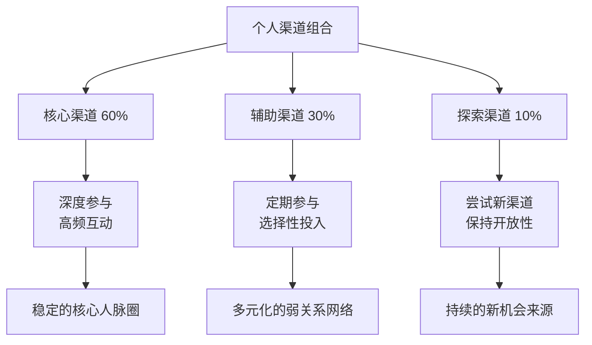
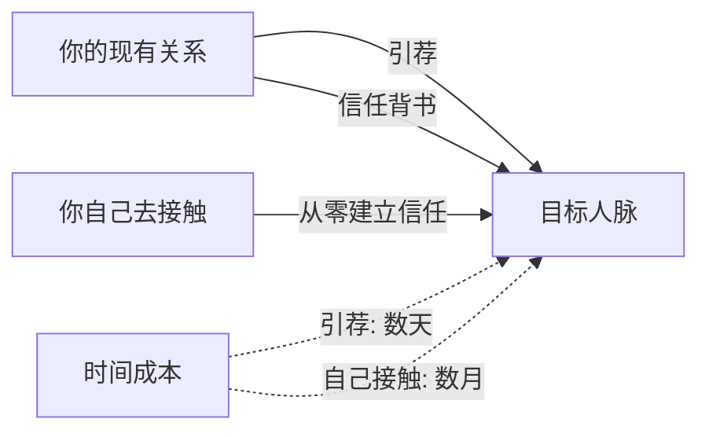
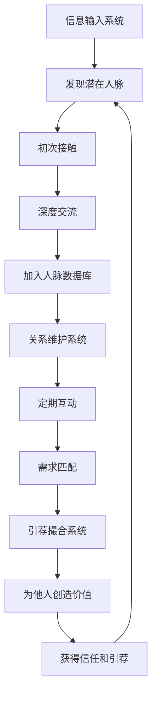

人脉拓展的核心问题不是"要不要拓展"，而是"去哪里找对的人"。渠道选择直接决定了你能接触到的人群质量、建立关系的效率、以及长期维护的成本。选错渠道，再强的社交能力也是白费力气。

## 3.1 渠道的底层逻辑：为什么渠道比技巧更重要

### 3.1.1 渠道决定了人脉的"基因"

人脉拓展本质上是一个**筛选过程**。你出现在什么场合，就已经决定了你能遇到什么样的人。这不是概率问题，而是结构性问题——一个每天泡在酒吧的人和一个每周参加行业沙龙的人，他们的人脉网络从基因上就不同。

社会学中有一个概念叫**"同质性原则"（Homophily）**——人们倾向于与自己相似的人建立联系。渠道本身就是一种同质性过滤器：

- **学历渠道**（MBA、名校校友会）过滤出了教育背景相似的人
- **行业渠道**（行业会议、协会）过滤出了职业领域相同的人
- **财富渠道**（企业家俱乐部、高端私董会）过滤出了经济层级相近的人
- **兴趣渠道**（跑步俱乐部、读书会）过滤出了生活方式相似的人

理解这一点，你就能明白：**选择渠道的本质，是选择你想要的人脉画像**。

### 3.1.2 渠道的三个维度评估

评估一个渠道是否值得投入时间，需要从三个维度考量：

| 维度 | 评估标准 | 高分特征 |
|------|----------|----------|
| **人群质量** | 参与者与你目标人脉的匹配度 | 参与门槛高、筛选机制严格、成员背景可验证 |
| **互动深度** | 能否建立真正的关系而非泛泛之交 | 有持续互动机制、小规模深度交流、共同完成任务 |
| **时间效率** | 单位时间内能建立的有效连接数 | 活动频率适中、组织质量高、后续跟进机制完善 |

很多人的误区是只看"人群质量"而忽略"互动深度"。一个500人的行业大会，人群质量可能很高，但你能深度交流的人不超过5个。而一个20人的读书会，虽然人群没那么"高端"，但每个人你都能真正聊透。

### 3.1.3 渠道组合的"投资组合理论"

不要把所有鸡蛋放在一个篮子里。人脉渠道也需要**分散投资**：

- **核心渠道（60%精力）**：你投入最多时间、收获最大价值的2-3个渠道
- **辅助渠道（30%精力）**：定期参与、保持活跃度的3-5个渠道
- **探索渠道（10%精力）**：尝试新渠道、接触不同人群的"探路"投入

这个比例不是固定的。刚入职场时，探索渠道的比重应该更高（30%以上）；职业稳定后，核心渠道的比重应该提升到70%以上。

## 3.2 线上渠道：数字化时代的人脉金矿

线上渠道的最大优势是**突破地理限制**和**降低社交成本**。但线上渠道也有明显的劣势——关系深度不足、信任建立缓慢、容易陷入"点赞之交"的陷阱。

### 3.2.1 社交媒体平台的深度使用策略

#### 微信：中国人的"数字名片"

微信是中国最重要的社交基础设施，但大多数人只用了它10%的功能。

**朋友圈经营策略：**

朋友圈不是日记本，而是你的**个人品牌展示窗口**。一条好的朋友圈应该满足以下至少一个条件：

- **展示专业能力**：分享行业洞察、项目成果、专业观点
- **展示生活品质**：旅行、运动、阅读、文化活动（但不要炫富）
- **提供价值**：分享有用的信息、资源、机会
- **引发共鸣**：真实的故事、有深度的思考

**具体操作：**

| 内容类型 | 发布频率 | 最佳发布时间 | 注意事项 |
|----------|----------|--------------|----------|
| 专业观点/行业洞察 | 每周2-3条 | 工作日 8:00-9:00 或 12:00-13:00 | 要有自己的观点，不要只转发 |
| 生活分享 | 每周1-2条 | 周末或晚间 | 自然真实，不要刻意摆拍 |
| 价值信息（文章/资源） | 每周1-2条 | 工作日 18:00-20:00 | 附上自己的简评 |
| 互动内容（提问/投票） | 每月1-2条 | 周末 | 选大众关心的话题 |

**微信标签系统：**

用标签对联系人进行分组管理，这是高效维护人脉的基础：

- **关系层级**：核心圈、重要、普通、弱关系
- **行业领域**：互联网、金融、教育、医疗等
- **认识场景**：同事、校友、会议、社群等
- **互动频率**：每周、每月、每季度、偶尔

这样做的好处是：发朋友圈时可以分组可见，针对不同人群展示不同内容；需要特定资源时可以快速定位到相关人群。

**微信群的正确使用：**

微信群不是加了就行。你需要：

1. **选择性加入**：质量高于数量，一个高质量群胜过十个灌水群
2. **定期清理**：退出不再有价值的群，保持信息流质量
3. **主动输出**：在群里分享有价值的内容、回答他人问题、促成连接
4. **线下转化**：将线上关系转化为线下见面，这是建立深度关系的关键一步

#### LinkedIn/领英：职业社交的黄金平台

LinkedIn是全球最大的职业社交平台，在中国虽然不如微信普及，但在特定场景下价值极高：

- **外企求职**：很多外企HR直接在LinkedIn上搜索候选人
- **跨国业务**：与海外合作伙伴建立联系的首选平台
- **行业影响力建立**：在LinkedIn上发布专业内容，触达全球同行
- **猎头接触**：高端岗位的猎头主要通过LinkedIn寻找候选人

**LinkedIn个人资料优化要点：**

- **头像**：专业、清晰、微笑的头像，不要用自拍或风景照
- **标题**：不只是职位名称，要体现你的核心价值主张（如"帮助企业降低30%运营成本的供应链专家"）
- **摘要**：用3-5段话讲述你的职业故事、核心能力、价值主张
- **经历**：每段经历都用STAR法则描述，突出成果而非职责
- **推荐信**：主动请3-5位有分量的人为你写推荐信
- **技能认可**：列出5-10个核心技能，请同事和客户认可

**LinkedIn主动连接策略：**

不要只发"我想加你为好友"这种空白邀请。每次发送连接请求时，附上一段个性化的说明：

> "您好[姓名]，我注意到您在[具体话题]上的分享非常有见地。我目前也在研究这个领域，希望能与您交流学习。期待连接！"

关键要素：提及具体细节（证明你不是群发）、说明连接理由、表达真诚兴趣。

#### 脉脉：中国职场的"暗网"

脉脉的特色是**匿名职场社交**。它有两个独特价值：

1. **行业情报**：匿名区的爆料和讨论，往往比官方渠道更早、更真实
2. **跳槽信息**：很多公司的真实面试体验、薪资水平、内部文化都在脉脉上有讨论

但脉脉也有明显的局限：匿名环境容易滋生谣言和负面情绪，需要批判性看待。建议把脉脉当作**信息收集工具**而非**关系建立平台**。

#### 知乎：知识变现的社交场

知乎的核心价值在于**通过知识输出建立专业形象**。一个高质量的知乎回答，可以持续数年为你带来关注和连接。

**知乎社交策略：**

1. **选择细分领域**：不要什么都答，聚焦1-2个你真正擅长的领域
2. **写深度回答**：2000字以上的深度分析比100字的抖机灵更有长期价值
3. **持续输出**：每周至少1-2个高质量回答，保持活跃度
4. **主动互动**：回复评论、参与讨论、关注同领域的优秀答主
5. **线下转化**：当有人通过知乎主动联系你时，积极回应并尝试线下见面

#### Twitter/X：全球视野的窗口

Twitter虽然在中国无法直接访问，但对于以下人群仍然重要：

- **技术开发者**：开源社区、技术讨论的主要阵地
- **加密货币/Web3从业者**：行业信息和人脉几乎都在Twitter上
- **国际业务从业者**：了解海外市场和建立国际联系
- **内容创作者**：建立全球影响力

### 3.2.2 在线社群：从"加群"到"经营"

在线社群是线上渠道中**最容易被低估**的一个。很多人加了几十个群，但从来没有真正融入任何一个。

#### 付费社群的价值逻辑

付费社群之所以比免费社群质量高，核心原因是**筛选机制**。愿意付费的人，通常具有以下特征：

- **有投入意愿**：愿意为学习和成长投资
- **有一定经济基础**：至少不是完全没有资源的人
- **有行动力**：不只是嘴上说说，而是真正采取了行动

**主流付费社群平台对比：**

| 平台 | 特点 | 价格区间 | 适合人群 |
|------|------|----------|----------|
| **知识星球** | 以KOL为核心，内容驱动 | ¥50-2000/年 | 关注特定领域深度内容的人 |
| **得到社群** | 平台背书，内容系统化 | ¥200-500/年 | 喜欢系统化学习的人 |
| **混沌大学** | 商业教育，案例驱动 | ¥1000-5000/年 | 创业者、企业高管 |
| **樊登读书** | 读书会模式，大众化 | ¥365/年 | 培养阅读习惯的人 |
| **各类私董会** | 小规模，深度互动 | ¥5000-50000/年 | 企业主、高管 |

**付费社群的正确参与方式：**

加入付费社群只是开始，关键是如何在里面建立存在感：

1. **先观察后发言**：加入后先潜水1-2周，了解社群文化和活跃成员
2. **主动提供价值**：回答他人问题、分享自己的经验、推荐资源
3. **参与线下活动**：很多付费社群会组织线下聚会，这是建立深度关系的最佳机会
4. **与核心成员建立私交**：找到社群里最有价值的3-5个人，主动添加私聊
5. **成为"连接者"**：当你发现两个人可以互相帮助时，主动介绍他们认识

#### 行业社群的精准触达

行业社群的价值在于**信息密度高**和**人脉质量高**。但行业社群通常不会公开招募，需要通过以下途径找到：

- **行业前辈推荐**：请你的导师或前辈介绍你加入相关社群
- **行业活动结识**：参加行业活动时，主动询问是否有相关社群
- **行业KOL关注**：关注行业意见领袖，他们通常会运营或推荐相关社群
- **平台搜索**：在微信、QQ、Discord等平台搜索行业关键词

#### 兴趣社群的"慢社交"价值

兴趣社群的独特价值在于**去功利化**。当你和一个人在同一个跑步俱乐部跑了半年，你们的关系基础比任何商务社交都要牢固。

**兴趣社群的选择标准：**

- **持续性**：能长期参与的活动（如每周跑步）比一次性活动（如年会）更有价值
- **互动性**：需要协作或交流的活动（如读书会）比独自进行的活动（如健身房）更容易建立关系
- **门槛适中**：门槛太低导致人群太杂，门槛太高导致圈子太小
- **氛围健康**：避免那些以炫富、攀比、八卦为主基调的社群

### 3.2.3 内容平台：用内容吸引人脉

内容平台是**被动社交**的最佳渠道——你不需要主动去找人，而是通过优质内容让对的人来找你。

#### 公众号/博客：长期价值积累

一个持续更新的公众号或博客，就像一个**24小时在线的自我介绍**。当有人想了解你时，你的文章就是最好的名片。

**内容定位策略：**

| 定位类型 | 特点 | 适合人群 | 变现路径 |
|----------|------|----------|----------|
| **专业干货型** | 深度分析、实操教程 | 专业人士、技术人才 | 咨询、培训、求职 |
| **行业洞察型** | 趋势分析、案例解读 | 行业从业者、分析师 | 行业影响力、商业合作 |
| **个人成长型** | 方法论、经验分享 | 职场人士、创业者 | 个人品牌、社群运营 |
| **生活方式型** | 美食、旅行、运动 | 有生活品质追求的人 | 品牌合作、生活方式IP |

#### B站/YouTube：视频内容的社交杠杆

视频内容的优势是**信息密度高**和**人格化表达强**。一个30分钟的深度视频，传递的信息量相当于3篇5000字的文章。

**视频社交策略：**

1. **找到你的"人设"**：不要试图模仿别人，找到自己独特的表达方式
2. **保持更新频率**：每周至少1个视频，算法喜欢活跃的创作者
3. **互动评论区**：回复每一条有意义的评论，这是建立初始关系的最佳机会
4. **跨平台引流**：在视频中引导观众添加你的微信或关注其他平台
5. **线下见面**：当有观众在同一城市时，可以组织线下聚会

#### 播客：深度连接的利器

播客的独特价值在于**长时间的陪伴式传播**。听众通常会完整听完一集30-60分钟的播客，这种深度接触是其他媒介难以比拟的。

**播客社交的两种方式：**

- **做主播**：邀请嘉宾参加你的播客，这是与行业大咖建立联系的绝佳方式。大多数人不会拒绝一个展示自己的机会
- **做嘉宾**：主动联系播客主播，表达愿意分享的主题。这是建立个人品牌和扩展人脉的有效途径

#### GitHub/开源社区：技术人的社交货币

对于技术人员来说，GitHub上的贡献记录比任何简历都有说服力。一个活跃的GitHub账号，本身就是一张**技术社交名片**。

**开源社区社交策略：**

1. **选择有影响力的项目**：参与Star数超过1000的项目，影响力更大
2. **从小贡献开始**：先修复文档错误、翻译内容，再逐步贡献代码
3. **参与Issue讨论**：在Issue中展示你的思考过程和解决问题的能力
4. **参加线下活动**：很多开源项目会组织Meetup、Conference等线下活动
5. **建立自己的项目**：创建自己的开源项目，吸引志同道合的贡献者

## 3.3 线下渠道：不可替代的关系深度

线下渠道的最大优势是**关系建立速度快**和**信任基础牢固**。一次深度的面对面交流，可以抵得上数月的线上互动。

社会心理学研究表明，面对面交流时传递的信息中，**文字只占7%，语调占38%，肢体语言占55%**。这意味着线下交流的信息密度是线上的数倍，信任建立的速度也快得多。

### 3.3.1 行业活动：精准触达目标人脉

#### 行业会议和论坛

行业会议是**最高效的人脉拓展渠道之一**——在1-2天内，你可以接触到平时分散在全国甚至全球的同行。

**会前准备清单：**

- [ ] 研究议程，标记你最感兴趣的3-5个演讲
- [ ] 查看演讲嘉宾名单，选择3-5个你最想认识的人
- [ ] 准备简洁有力的自我介绍（30秒版本和2分钟版本各一个）
- [ ] 准备足够的名片（至少50张），确保信息准确
- [ ] 了解参会者名单（如果有），提前标记目标人物
- [ ] 准备1-2个有深度的问题，用于会后与嘉宾交流

**会中社交策略：**

1. **提前到场**：活动开始前30分钟到场，这时人少，容易开启对话
2. **坐对位置**：选择中间位置或靠近过道的位置，方便与周围人交流
3. **主动开口**：不要等别人来找你，主动向旁边的人打招呼
4. **提问互动**：在Q&A环节提出有深度的问题，展示你的专业水平
5. **茶歇社交**：茶歇和午餐时间是最自然的社交机会，不要独自刷手机
6. **会后跟进**：活动结束后24小时内添加微信，附上"今天在XX会议认识您"的说明

**如何与演讲嘉宾建立联系：**

演讲嘉宾通常是最有价值的人脉，但也是最难接近的。以下是有效的策略：

- **提问法**：在Q&A环节提出一个嘉宾会欣赏的问题，会后主动去自我介绍
- **内容引用法**：在社交媒体上引用嘉宾的观点并@他们，建立初步印象
- **价值提供法**：如果你能为嘉宾提供某种价值（如数据分析、翻译、资源对接），主动提出
- **重复出现法**：多次参加嘉宾出席的活动，混个脸熟后再主动交流

#### 行业沙龙和分享会

行业沙龙的规模通常在20-50人，这种规模的优势是**每个人都有机会深度交流**。

**沙龙社交的独特价值：**

- **深度对话**：不像大会那样只能听讲，沙龙通常有充分的讨论时间
- **平等氛围**：没有台上台下的等级差异，更容易与资深人士平等交流
- **持续参与**：很多沙龙是系列性的，持续参与可以建立稳定的关系
- **质量筛选**：愿意花时间参加沙龙的人，通常对行业有真正的热情

#### 行业展会

行业展会的特殊价值在于**商业机会集中**。供应商、客户、合作伙伴汇聚一堂，是建立商业人脉的高效场所。

**展会社交技巧：**

1. **提前研究参展商名单**：标记你想拜访的展位，制定路线
2. **带着目的去**：不要漫无目的地逛，每个展位停留时间控制在5-10分钟
3. **交换有价值的信息**：不要只收名片，也要分享你的业务需求和联系方式
4. **参加展会同期活动**：很多展会会组织晚宴、论坛等社交活动，积极参与
5. **会后48小时内跟进**：展会期间收到的名片，48小时内必须跟进，否则价值衰减90%

### 3.3.2 社交活动：在轻松氛围中建立关系

#### 校友活动：天然的信任基础

校友关系是最有价值的"天然信任基础"。即使从未谋面，同一所学校的背景也能瞬间拉近距离。

**校友人脉经营策略：**

1. **加入校友组织**：主动加入所在城市的校友会，成为活跃成员
2. **参加校友活动**：定期参加校友聚会、行业交流、公益活动
3. **成为组织者**：主动承担校友活动的组织工作，这是快速建立影响力的方式
4. **跨届连接**：不要只与同届校友交往，主动连接不同届的校友
5. **为校友提供价值**：分享工作机会、行业信息、资源对接

#### 兴趣俱乐部：去功利化的深度连接

兴趣俱乐部的核心价值在于**共同兴趣提供了天然的社交话题**。你不需要绞尽脑汁想聊什么，兴趣本身就是最好的话题。

**高价值兴趣俱乐部推荐：**

| 兴趣类型 | 社交价值 | 适合人群 | 典型活动频率 |
|----------|----------|----------|--------------|
| **跑步/马拉松** | 高 | 各行业人士，自律性强 | 每周1-3次 |
| **读书会** | 高 | 知识工作者，深度思考者 | 每月1-2次 |
| **摄影** | 中高 | 创意工作者，生活品质追求者 | 每月1-2次 |
| **高尔夫** | 高 | 企业主、高管、商务人士 | 每周1-2次 |
| **登山/徒步** | 中高 | 各行业人士，户外爱好者 | 每月1-2次 |
| **品酒/茶道** | 中 | 生活品质追求者，商务人士 | 每月1次 |
| **瑜伽/普拉提** | 中 | 注重健康的人士 | 每周2-3次 |
| **桌游/棋牌** | 中 | 各行业人士，策略思考者 | 每周1次 |

**选择兴趣俱乐部的原则：**

- **选择需要协作的活动**：团队运动（如羽毛球双打）比个人运动（如游泳）更容易建立关系
- **选择有交流空间的活动**：徒步、品酒等活动有大量聊天时间，比高强度运动更利于社交
- **选择持续性的活动**：每周固定时间的活动比偶尔组织的活动更能建立深度关系
- **选择门槛适中的活动**：门槛太高难以参与，门槛太低人群太杂

#### 运动活动：身体接触加速关系建立

运动活动有一个独特的社交优势——**共同的体力消耗会建立一种"战友情"**。一起跑完10公里、一起打完一场球，这种共同经历会自然地拉近关系。

**运动社交的最佳选择：**

- **羽毛球**：最受欢迎的商务运动之一，场地灵活，可以双打
- **篮球**：团队运动，快速建立团队归属感
- **登山/徒步**：长时间的共同行走，提供充足的交流时间
- **游泳**：适合深度思考者，游完泳后的交流往往更有深度
- **健身房**：固定时间去健身房，可以认识同样自律的人

### 3.3.3 专业组织：结构化的人脉网络

#### 行业协会

行业协会是**行业内人脉的"中央枢纽"**。加入行业协会，你就能接触到行业内的核心人物和关键信息。

**行业协会的参与层次：**

| 层次 | 参与方式 | 人脉价值 | 时间投入 |
|------|----------|----------|----------|
| **普通会员** | 缴纳会费，参加活动 | 一般 | 低 |
| **活跃会员** | 参与委员会工作，主动贡献 | 较高 | 中 |
| **理事/委员** | 参与决策，代表协会发声 | 高 | 中高 |
| **副会长/会长** | 领导协会，塑造行业方向 | 极高 | 高 |

建议从普通会员开始，逐步提升参与层次。成为活跃会员是性价比最高的阶段——投入可控，人脉回报显著。

#### BNI等专业社交组织

BNI（Business Network International）是全球最大的商业引荐组织，其核心理念是**"给予者收获"（Givers Gain）**——你先为别人推荐业务，别人自然也会为你推荐。

**BNI的运作模式：**

- 每周固定时间早餐会（通常早上6:30-8:00）
- 每个行业只允许一个成员（避免竞争）
- 每次会议有60秒自我介绍环节
- 定期有10分钟深度分享机会
- 核心机制是**业务引荐**——成员之间互相推荐客户

**BNI的适用场景：**

- B2B业务（如律师、会计师、设计师、装修公司）
- 本地服务型业务（如教育培训、健康医疗）
- 依赖口碑推荐的业务

**Toastmasters的社交价值：**

Toastmasters是一个专注于**演讲和领导力**的国际组织。虽然主要目的是锻炼演讲能力，但其社交价值不容忽视：

- **共同成长的氛围**：成员之间互相支持、共同进步，关系质量很高
- **展示个人魅力的舞台**：好的演讲能快速建立个人品牌和影响力
- **跨行业交流**：Toastmasters成员来自各行各业，是拓展视野的好机会

#### 公益组织：在服务中建立深度关系

公益组织的独特价值在于**去功利化**和**共同价值观**。当一群人为了同一个公益目标而努力时，建立的关系往往更加真诚和持久。

**公益社交的正确心态：**

- **真心参与**：不要把公益当作社交工具，要真心认同公益理念
- **长期投入**：一次性的公益活动很难建立深度关系，持续参与才能产生信任
- **发挥专长**：用你的专业能力为公益组织提供价值，而不是只出钱
- **主动承担**：在公益组织中承担更多责任，自然会接触到更多核心成员

### 3.3.4 教育和培训：在学习中建立高质量连接

#### MBA/EMBA：人脉拓展的"核武器"

MBA是公认的人脉拓展"核武器"，但也是**成本最高**的渠道。

**MBA人脉的独特价值：**

1. **筛选机制严格**：能通过MBA入学审核的人，本身就是精英群体
2. **共同学习经历**：两年的共同学习，建立了深厚的同学情谊
3. **校友网络强大**：知名商学院的校友网络覆盖全球，影响力巨大
4. **终身关系**：MBA同学关系通常持续终身，是长期的人脉资产

**国内主流MBA项目对比：**

| 项目 | 学费（参考） | 学制 | 人脉特点 |
|------|--------------|------|----------|
| **清华经管MBA** | 约30万 | 2年 | 科技、金融、制造业精英 |
| **北大光华MBA** | 约30万 | 2年 | 金融、咨询、文化产业 |
| **中欧国际工商学院** | 约45万 | 2年 | 外企高管、国际化视野 |
| **长江商学院** | 约50万 | 2年 | 企业家、民营资本 |
| **复旦MBA** | 约30万 | 2年 | 长三角地区商业精英 |
| **上海交大安泰** | 约30万 | 2年 | 制造业、科技、金融 |

**MBA的投入产出分析：**

MBA的总成本包括：学费（30-50万）+ 两年时间的机会成本（可能高达100万以上）。但从人脉价值来看：

- 如果你在MBA期间建立了3-5个深度商业关系，每个关系带来50万以上的商业机会，那投入就是值得的
- 如果你只是混个学位，没有真正投入社交，那MBA的人脉价值就大打折扣

**除了MBA之外的替代选择：**

- **EMBA**：适合已有丰富管理经验的企业高管
- **高管研修班**：时间更短、成本更低，但人脉深度也相对较低
- **行业认证课程**：如CFA、PMP等，可以认识同行业的专业人士
- **在线课程社群**：如Coursera、edX等平台的付费课程通常有学员社群

#### 工作坊和研讨会：小规模深度交流

工作坊和研讨会的规模通常在10-30人，这种小规模环境非常适合**建立深度关系**。

**选择工作坊的标准：**

- **主题与你的专业相关**：这样才能真正参与讨论，展示你的价值
- **有互动环节**：纯讲座式的工作坊社交价值有限，要选择有小组讨论、案例分析的
- **讲师有影响力**：好的讲师本身就是人脉资源，同时能吸引高质量的参与者
- **后续有跟进**：有些工作坊会建立学员社群，持续提供交流机会

## 3.4 引荐渠道：人脉网络的指数级增长

引荐渠道是**效率最高**的人脉拓展方式——通过现有关系人的背书，你可以快速获得新关系人的信任。

### 3.4.1 引荐的底层逻辑：信任传递

引荐之所以有效，核心原理是**信任传递**。当A向B推荐你时，B对你的初始信任来自于对A的信任。这比你从零开始建立信任要快得多。

### 3.4.2 现有关系引荐的操作方法

**如何请人引荐：**

1. **选择合适的引荐人**：引荐人与目标人脉的关系要足够好，同时对你足够了解
2. **明确你的需求**：清楚地告诉引荐人你想认识谁、为什么想认识、你能提供什么价值
3. **降低引荐人的成本**：准备好你的自我介绍和价值说明，让引荐人可以轻松转发
4. **表达感谢**：无论引荐是否成功，都要真诚感谢引荐人
5. **回报引荐人**：在合适的时机，也为引荐人引荐有价值的人脉

**引荐话术模板：**

[引荐人姓名]您好，

我最近在[具体领域]有一些进展，希望能够认识[目标人物姓名]。

关于我：[一句话介绍你的身份和价值]

为什么想认识他/她：[具体、真诚的理由]

如果您方便的话，能否帮我引荐一下？我已经准备好了一份简短的自我介绍，您可以直接转发给他/她。

非常感谢！

### 3.4.3 成为"超级连接者"

最高级的引荐策略不是请别人为你引荐，而是**你自己成为引荐的中心**。

**超级连接者的特征：**

- **信息枢纽**：知道谁擅长什么、需要什么
- **主动撮合**：发现两个人可以互相帮助时，主动介绍他们认识
- **不求回报**：引荐时不期待立即的回报，建立长期的信任
- **维护关系网**：定期与关系网中的人保持联系，了解他们的近况和需求

**如何成为超级连接者：**

1. **建立人脉数据库**：记录每个人的专业领域、当前需求、核心资源
2. **定期"扫描"匹配**：每周花30分钟，看看有没有可以互相帮助的人
3. **主动撮合**：发现匹配时，立即行动，不要拖延
4. **跟进效果**：引荐后跟进双方的交流效果，必要时提供进一步帮助
5. **积累声誉**：当你成为公认的"连接者"，人们会主动来找你

### 3.4.4 平台引荐的数字化方式

在线平台也提供了引荐机制：

- **LinkedIn"共同联系人"**：查看你和目标人物的共同联系人，请他们引荐
- **微信"朋友的朋友"**：通过朋友圈互动发现潜在连接
- **行业社群的"牵线"功能**：一些社群平台提供了成员之间的牵线功能
- **AI社交工具**：一些新兴的AI工具可以根据你的需求自动匹配潜在人脉

## 3.5 渠道组合策略：构建你的人脉版图

### 3.5.1 不同人生阶段的渠道重点

| 阶段 | 年龄参考 | 核心渠道 | 辅助渠道 | 探索渠道 |
|------|----------|----------|----------|----------|
| **学生/初入职场** | 20-25岁 | 校友活动、实习社群、兴趣俱乐部 | 行业沙龙、在线社群 | 行业会议、内容平台 |
| **职业成长期** | 25-35岁 | 行业协会、LinkedIn、专业培训 | 行业会议、读书会 | MBA、创业活动 |
| **职业成熟期** | 35-45岁 | 行业协会、商会、私董会 | MBA/EMBA、公益组织 | 跨界活动、投资社群 |
| **事业巅峰期** | 45岁以上 | 商会、投资圈、高端俱乐部 | 公益组织、智库 | 新兴领域社群 |

### 3.5.2 不同职业的渠道选择

| 职业类型 | 最佳渠道组合 | 说明 |
|----------|--------------|------|
| **程序员/技术人** | GitHub + 技术Meetup + 开源社区 + 技术大会 | 技术社区是技术人员的"主场" |
| **产品经理** | 行业沙龙 + 产品经理社群 + LinkedIn + 行业大会 | 产品圈子相对小，需要跨行业视野 |
| **销售/BD** | 行业展会 + 商会 + BNI + LinkedIn | 销售需要大量的弱关系网络 |
| **创业者** | 创业活动 + 投资人社群 + MBA + 行业协会 | 创业者需要资金、人才、客户、导师四类人脉 |
| **自由职业者** | 兴趣社群 + 内容平台 + 付费社群 + 线下沙龙 | 自由职业者需要多元化的收入来源和人脉支持 |
| **企业高管** | 私董会 + 行业协会 + MBA校友会 + 高端俱乐部 | 高管需要高质量、低频次的深度交流 |

### 3.5.3 渠道效率的量化评估

定期评估你的渠道投入产出比：

**渠道效率评估表：**

| 评估指标 | 计算方法 | 优化方向 |
|----------|----------|----------|
| **单位时间新连接数** | 本月新认识人数 ÷ 投入小时数 | 优化社交效率 |
| **连接转化率** | 深度交流人数 ÷ 新认识人数 | 提升互动质量 |
| **关系维护成本** | 每月维护时间 ÷ 活跃关系数 | 优化维护策略 |
| **机会转化率** | 通过人脉获得的机会数 ÷ 投入时间 | 评估渠道价值 |

每季度做一次评估，淘汰低效渠道，增加高效渠道的投入。

## 3.6 常见误区与避坑指南

### 误区一：贪多求全，什么都想参与

**表现**：加入几十个社群，参加各种活动，但每个都只是浅尝辄止。

**纠正**：聚焦2-3个核心渠道深度参与，比在10个渠道蜻蜓点水效果好10倍。人脉的质量远比数量重要。

### 误区二：只在线上社交，不线下见面

**表现**：微信好友几千人，但真正见过面的不到10%。

**纠正**：线上关系如果不转化为线下关系，很难产生真正的商业价值。每个月至少安排2-3次线下面见。

### 误区三：只参加"高端"活动

**表现**：只关注高端论坛、企业家俱乐部，忽视了身边的普通渠道。

**纠正**：很多真正有价值的人脉，是在看似普通的场合认识的。你的同事、邻居、健身房的伙伴，都可能成为重要的人脉。

### 误区四：参加活动不准备

**表现**：到活动现场才开始想"我应该和谁聊天"。

**纠正**：每次参加活动前，至少花30分钟研究议程、嘉宾、参与者名单，制定社交目标。

### 误区五：认识后不跟进

**表现**：活动上聊得很开心，加了微信后再也没有联系。

**纠正**：认识新朋友后的24小时内，必须发送一条跟进消息。3天内没有跟进，这条人脉基本就废了。

### 误区六：只索取不付出

**表现**：每次联系别人都是"帮我个忙"。

**纠正**：在请求帮助之前，先想想你能为对方提供什么价值。哪怕是一条有用的信息、一个有价值的推荐，都比直接索取好得多。

## 3.7 进阶：构建自动化的人脉拓展系统

当你的人脉网络达到一定规模后，手动管理会变得非常低效。以下是构建**自动化人脉拓展系统**的方法：

### 3.7.1 信息输入系统

建立一个系统化的信息收集流程：

1. **RSS订阅**：订阅行业媒体、KOL博客，保持信息更新
2. **社群监控**：定期浏览核心社群，发现有价值的人和信息
3. **活动追踪**：使用日历工具追踪即将举行的行业活动
4. **人脉雷达**：设置关键词提醒，当有人在社交媒体上提到你的专业领域时，主动接触

### 3.7.2 关系维护系统

建立一个系统化的关系维护流程：

- **每日**：在朋友圈与3-5个联系人互动（点赞、评论）
- **每周**：与2-3个重要联系人私聊，了解近况
- **每月**：与核心圈子的人见面或深度通话
- **每季度**：回顾人脉数据库，更新信息，清理无效联系

### 3.7.3 引荐撮合系统

建立一个系统化的引荐撮合流程：

1. **人脉数据库**：使用Notion、Airtable或CRM工具，记录每个人的核心信息
2. **需求匹配**：每周花30分钟，扫描数据库，寻找可以互相帮助的人
3. **主动撮合**：发现匹配时，立即发送介绍邮件或拉群
4. **效果跟踪**：记录每次引荐的效果，优化匹配算法

这个系统一旦运转起来，你的人脉网络就会像滚雪球一样自动增长。你不再是主动去找人，而是成为人脉网络的**枢纽节点**，机会和资源会自动向你汇聚。

***

**本节要点回顾：**

- 渠道选择决定了人脉的"基因"，比社交技巧更重要
- 线上渠道擅长突破地理限制和降低社交成本，线下渠道擅长建立深度关系和快速建立信任
- 引荐渠道是效率最高的人脉拓展方式，核心是信任传递
- 构建渠道组合要遵循"核心60% + 辅助30% + 探索10%"的投资组合原则
- 定期评估渠道效率，淘汰低效渠道，增加高效渠道投入
- 最终目标是构建自动化的人脉拓展系统，让自己成为人脉网络的枢纽节点
