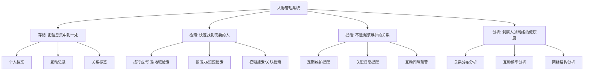
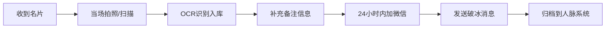

## 四、人脉管理工具：如何系统化管理你的人脉？

人脉管理的本质不是"认识更多人"，而是**让你对每一段关系都有掌控感**——你知道谁在你的核心圈，谁需要本月维护，谁刚换了工作值得跟进，谁已经三个月没联系了。当你的联系人超过 200 人，仅靠记忆和直觉已经无法胜任这项工作。工具不是可选项，而是必需品。

### 4.1 人脉管理的底层逻辑：为什么需要系统化？

#### 4.1.1 人脑的记忆极限与关系衰减

心理学家罗宾·邓巴（Robin Dunbar）提出，人类大脑能够维持的稳定社交关系上限约为 150 人（邓巴数）。其中：

| 层级 | 人数上限 | 关系特征 | 记忆可靠性 |
|------|----------|----------|------------|
| 核心层（亲密知己） | 5 人 | 每周联系，深度信任 | 几乎不会遗忘 |
| 同情层（好朋友） | 15 人 | 每月联系，互相支持 | 大概率记得关键信息 |
| 友谊层（朋友） | 50 人 | 每季度联系，有一定交情 | 会逐渐遗忘细节 |
| 相识层（熟人） | 150 人 | 偶尔联系，点头之交 | 半年不联系就模糊 |
| 弱关系层（名片级） | 500+ | 仅有一面之缘 | 几乎全部遗忘 |

当你的人脉网络超过 150 人——而对大多数职场人士来说这是常态——你必须依赖外部系统来弥补记忆的不足。这不是"懒"，而是**认知资源的合理分配**。把有限的脑力用于深度思考和真诚互动，把信息存储和提醒交给工具。

#### 4.1.2 没有系统的代价

不使用系统化管理的人，通常会付出以下隐性成本：

- **关系断裂成本**：一个重要联系人换了手机号或微信，你完全不知道，直到某天需要找他时才发现失联
- **机会错失成本**：一个前同事去了你一直想合作的公司，你三个月后才从朋友圈偶然得知
- **社交投入浪费**：反复和同一批"近在眼前"的人互动，忽略了远端更有价值的关系
- **人情债务遗忘**：别人帮了你一个忙，你忘了回报；或者你帮了别人，对方忘了——两者都损害关系
- **信息碎片化**：同一个人的信息散落在微信聊天、邮件、电话、名片、笔记本中，无法形成完整画像

#### 4.1.3 系统化管理的核心目标

一套合格的人脉管理系统需要解决四个核心问题：



### 4.2 微信生态：零成本起步的人脉管理

对于 99% 的中国职场人士来说，微信是人脉管理的"主战场"。与其学习一款全新工具，不如先把微信的功能用到极致。

#### 4.2.1 标签体系：人脉管理的第一步

微信标签是最被低估的管理功能。大多数人只给联系人打了零散的标签，从未建立过系统化的标签体系。

**建立标签体系的三步法：**

**第一步：设计标签维度**

一个科学的标签体系应该覆盖以下维度，每个维度独立成组：

| 维度 | 标签示例 | 管理用途 |
|------|----------|----------|
| 关系深度 | 核心层 / 同情层 / 友谊层 / 相识层 / 弱关系 | 决定互动频率和投入程度 |
| 来源渠道 | 校友 / 前同事 / 行业活动 / 客户 / 引荐 / 线上社群 | 追溯关系起源，方便回忆 |
| 行业领域 | 互联网 / 金融 / 教育 / 医疗 / 法律 / 咨询 | 需要行业信息时精准定位 |
| 职能角色 | 技术 / 产品 / 市场 / 销售 / HR / 管理层 | 需要特定职能资源时快速筛选 |
| 地域 | 北京 / 上海 / 深圳 / 杭州 / 成都 / 海外 | 到某地出差时激活当地关系 |
| 兴趣爱好 | 读书 / 跑步 / 摄影 / 投资 / 创业 | 寻找共同话题，组织活动 |
| 合作状态 | 已合作 / 潜在合作 / 有意向 / 暂无交集 | 商务场景下快速定位目标人 |

**第二步：批量打标签**

不要试图一次性给所有联系人打标签——这是最大的放弃点。正确的方法是"渐进式标注"：

1. 先从**核心层和同情层**开始（约 20 人），确保今天完成
2. 接下来一周，每次聊天时顺手给对方补标签（每天处理 10-15 人）
3. 一个月内完成**友谊层**（约 50 人）的标注
4. 相识层和弱关系层可以慢慢来，或者利用"按群聊批量打标签"的功能一次性处理

**第三步：标签实战应用**

标签打好之后，最重要的应用场景有三个：

- **朋友圈分组可见**：发布行业思考时选"同行"标签，发布生活动态时选"核心层+同情层"标签，发布求职信息时选"HR"标签。这样你每条朋友圈都是精准触达，既不会打扰不相关的人，也不会因为"分组可见"被发现而尴尬（因为你确实是在分组，不是屏蔽）
- **群发消息**：节日祝福、活动邀请、内容分享，按标签群发。但要注意：**群发消息不要太频繁，一个月不超过 2 次**，否则会被视为骚扰
- **定期检索**：每月初打开某个标签（如"行业活动认识的人"），检查是否有超过 3 个月没联系的人，安排 2-3 个进行互动

#### 4.2.2 微信备注名：被忽视的信息金矿

微信的"备注"字段是人脉管理中最被低估的功能。大多数人把备注留空，或者只写一个姓名——这是巨大的浪费。

**备注名的黄金格式：**

[行业][公司][职能] 真名 [认识渠道]

**实际示例：**
- `[互联网][字节][后端] 张明 [2024Q2技术峰会]`
- `[金融][中信][投行] 李华 [校友-北大MBA22级]`
- `[教育][好未来][产品] 王琳 [前同事-2021]`

这个格式的精妙之处在于：当你在微信搜索框输入任何关键词——行业、公司、职能、认识场景——都能精准找到对应的人。这相当于在微信内建了一套**免费的搜索引擎**。

**补充信息用法：**

除了备注名，微信还允许你在"描述"栏和"标签"栏填写更多信息。建议在描述栏记录：

- 认识的时间和场景（"2024年5月，XX行业峰会，坐我旁边"）
- 对方的关键特征（"有两个孩子，喜欢潜水，最近在创业"）
- 上次互动的要点（"上次聊到他们公司需要SaaS方案，我推荐了XX"）
- 人情往来记录（"他帮我介绍了XX客户，我请他吃了饭"）

这些信息在你下一次联系对方时会发挥巨大作用——你不需要尴尬地问"你是做什么的来着"，而是能直接说"上次你说创业方向是教育科技，现在进展如何？"

#### 4.2.3 微信收藏：你的私人人脉知识库

微信收藏不只是"存文章"的工具，它还可以作为人脉管理的辅助知识库：

- **收藏重要聊天记录**：长按消息 → 收藏。对方提到的关键信息（需求、偏好、承诺）都值得收藏，方便日后查找
- **创建收藏夹分类**：按人名或项目创建收藏夹，将与此人相关的聊天记录、文章、文件归档在一起
- **收藏后定期回顾**：每周花 10 分钟浏览收藏夹，把过期的信息清理掉，把待办的事项提取出来

#### 4.2.4 微信群的进阶用法

微信群不只是聊天的地方，它可以是**人脉管理的组织单元**：

- **主题群沉淀行业人脉**：创建一个"XX行业交流群"，定期分享行业资讯、组织线上分享，让群成为你的人脉蓄水池
- **项目群追踪合作关系**：每个重要项目建一个群，项目结束后不要解散，定期在群里分享相关动态，保持关系温度
- **校友群/兴趣群拓展弱关系**：积极参与这些群的讨论，输出有价值的观点，把线上弱关系转化为线下强关系

### 4.3 专业人脉管理工具：从记录到智能

当你的联系人超过 500 人，或者你有商务拓展、销售、猎头等专业需求时，微信生态已经力不从心。你需要一个专业的管理工具。

#### 4.3.1 Notion：最灵活的人脉管理平台

Notion 是目前最适合个人人脉管理的工具，原因有三：**高度自定义、多视图切换、免费额度足够个人使用**。

**搭建 Notion 人脉数据库的完整方案：**

**第一步：创建主数据库**

在 Notion 中创建一个 Table 类型的数据库，包含以下属性字段：

| 字段名 | 字段类型 | 说明 | 示例 |
|--------|----------|------|------|
| 姓名 | Title | 联系人姓名 | 张明 |
| 公司 | Text | 当前所在公司 | 字节跳动 |
| 职位 | Text | 当前职位 | 高级后端工程师 |
| 关系层级 | Select | 核心/同情/友谊/相识/弱关系 | 友谊层 |
| 行业 | Multi-select | 所属行业 | 互联网, AI |
| 职能 | Select | 主要职能 | 技术 |
| 城市 | Select | 所在城市 | 北京 |
| 认识渠道 | Select | 如何认识 | 行业活动 |
| 认识日期 | Date | 首次认识时间 | 2024-05-15 |
| 最近联系 | Date | 上次互动时间 | 2024-11-20 |
| 联系间隔 | Formula | 自动计算距今天数 | =dateBetween(now(), 最近联系, "days") |
| 维护频率 | Select | 目标互动频率 | 每月一次 |
| 互动记录 | Relation | 关联互动日志 | → 互动日志表 |
| 微信号 | Text | 微信ID | zhangming_dev |
| 手机号 | Phone | 手机号码 | 138****1234 |
| 邮箱 | Email | 电子邮箱 | zhang@bytedance.com |
| 标签 | Multi-select | 自定义标签 | 技术大牛, 创业者 |
| 优先级 | Select | 维护优先级 | 高 |
| 状态 | Status | 活跃/休眠/失联 | 活跃 |
| 备注 | Text | 关键信息备忘 | 喜欢潜水, 有两个孩子 |

**第二步：创建互动日志表**

创建第二个数据库，记录每次有意义的互动：

| 字段名 | 字段类型 | 说明 |
|--------|----------|------|
| 关联人 | Relation | 关联人脉主表 |
| 日期 | Date | 互动日期 |
| 方式 | Select | 微信/电话/面谈/邮件/活动 |
| 主题 | Text | 聊了什么 |
| 关键信息 | Text | 对方透露的重要信息 |
| 待办事项 | Text | 需要跟进的事 |
| 人情记录 | Select | 我帮对方/对方帮我/互相帮助 |

**第三步：创建多视图**

利用 Notion 的多视图功能，同一个数据库可以有完全不同的"面貌"：

- **表格视图（默认）**：全量信息浏览和搜索，适合精确查找
- **看板视图（按关系层级分组）**：一目了然看到各层级人数分布，拖拽卡片调整关系层级
- **日历视图（按最近联系日期排序）**：直观看到哪些人该维护了
- **筛选视图（按"联系间隔 > 90天"筛选）**：快速找到"即将失联"的关系，优先维护
- **画廊视图（按行业分组）**：需要行业信息时，按行业浏览人脉

**第四步：设置提醒机制**

Notion 本身不支持推送提醒，但可以通过以下方式弥补：

- 每周一打开 Notion，查看"联系间隔 > 目标维护频率"的联系人
- 使用 Notion 的 Filter 功能创建一个"本周待维护"视图
- 配合日历工具（Google Calendar / Apple Calendar），把需要维护的关系标记到日历中
- 进阶方案：使用 Notion API + 自动化工具（如 n8n、Zapier），自动检查即将失联的关系并发送提醒到微信/邮箱

#### 4.3.2 Airtable：适合重度数据管理

Airtable 相比 Notion 的优势在于**更强的数据处理能力和自动化功能**：

- **自动化工作流**：设置"当联系间隔超过 60 天时，自动发送邮件提醒"
- **丰富的字段类型**：支持附件、复选框、评分、进度条等多种字段
- **表单收集**：创建一个表单链接，参加活动时让对方自己填写信息，自动入库
- **API 接口**：可以和其他工具对接，实现数据自动同步
- **多人协作**：如果是一个团队共同维护客户关系，Airtable 比 Notion 更适合

Airtable 的不足是：**中文支持不如 Notion，免费版记录数限制为 1000 条，学习成本稍高**。适合联系人数量超过 500 人、对数据管理有专业需求的用户。

#### 4.3.3 专业关系管理工具（Folk / Clay / Dex）

这是一类专为"个人关系管理"（Personal CRM）设计的工具，核心特点是**轻量化和自动化**：

**Folk CRM：**
- 自动从 Gmail、LinkedIn、Twitter 等平台抓取联系人信息
- 智能提醒你该联系谁（基于设定的维护频率）
- 支持邮件追踪（是否打开、是否点击）
- 月费约 20 美元，适合经常用邮件沟通的用户

**Clay：**
- 自动聚合一个人在各社交平台的公开信息（LinkedIn、Twitter、个人网站等）
- 帮你快速了解一个人的最新动态
- 支持创建"智能列表"，自动分类联系人
- 月费约 20 美元，适合需要深度了解联系人背景的用户

**Dex：**
- 与 LinkedIn 深度集成
- 自动记录你在 LinkedIn 上的互动
- 界面简洁，上手快
- 免费版功能有限，付费版约 12 美元/月

**这些工具的共同局限**：主要面向欧美市场，对中国社交生态（微信、钉钉、飞书）的支持有限。如果你的人脉主要在国内，Notion 或 Airtable 仍然是更好的选择。

#### 4.3.4 国内专用工具

**脉脉 / 领英中国版：**
- 职场社交平台，天然带有 CRM 属性
- 可以查看联系人的职业变动、动态更新
- 适合 B2B 销售、猎头、商务拓展
- 局限：用户活跃度不如微信，信息更新可能滞后

**飞书多维表格：**
- 类似 Airtable 的表格+数据库工具
- 深度集成飞书生态（日历、文档、审批等）
- 如果你的团队已经在用飞书，这是最无缝的选择
- 支持自动化和脚本扩展

**企业微信：**
- 适合有团队协作需求的商务场景
- 支持客户标签、跟进记录、群发助手
- 可以分配客户给不同成员
- 更适合组织层面的客户关系管理，而非个人人脉管理

### 4.4 名片管理：线下社交的数字化桥梁

线下社交场景（会议、活动、饭局）中交换的名片，如果不能及时数字化，一周后就会变成抽屉里的废纸。

#### 4.4.1 名片数字化流程



**关键动作：** 收到名片后的 24 小时内必须完成以上全部流程。超过 48 小时，对方大概率已经忘了你是谁。超过一周，这张名片就作废了。

#### 4.4.2 名片扫描工具对比

| 工具 | 优势 | 劣势 | 适用场景 | 费用 |
|------|------|------|----------|------|
| CamCard（名片全能王） | OCR准确率高，支持多语言，云端同步 | 高级功能需付费，广告较多 | 经常参加线下活动 | 基础免费，高级 ¥98/年 |
| 微信扫一扫 | 无需额外App，直接加微信 | 不存储名片信息，无法检索 | 快速交换微信 | 免费 |
| 白描 | OCR能力强，支持批量扫描 | 名片管理功能弱 | 已有其他管理系统 | 基础免费 |
| Adobe Scan | 扫描质量高，自动裁剪 | 中文OCR准确率一般 | 高质量存档 | 免费 |
| 直接手动录入 | 最准确，即时补充细节 | 效率较低 | 名片量少时 | 免费 |

**最佳实践**：大多数情况下，"微信扫一扫 + 手动备注"已经足够。当场扫码加微信，然后在对方的备注栏填写名片上的关键信息（公司、职位、认识场合），比任何 OCR 工具都高效。名片本身拍张照片存到手机相册即可。

### 4.5 社交活动管理工具

人脉管理不只是"管已有关系"，还包括"拓展新关系"。活动管理工具帮助你高效地参加活动、认识新人、后续跟进。

#### 4.5.1 活动发现与参与

| 平台 | 覆盖领域 | 特点 | 适用场景 |
|------|----------|------|----------|
| 活动行 | 科技、创业、设计、教育 | 活动种类最全，用户量最大 | 寻找行业活动 |
| 互动吧 | 综合类活动 | 免费活动多，覆盖面广 | 兴趣社群活动 |
| 百格活动 | 专业会议、行业峰会 | 偏商务高端 | 大型行业峰会 |
| Luma | 创业、科技、设计 | 国际化，活动质量高 | 硅谷风格活动 |
| Meetup.com | 技术社区、语言交换 | 全球化平台 | 在海外参加活动 |
| 各地社群公众号 | 本地化 | 信息分散但精准 | 本地小型活动 |

**参加活动的系统化流程：**

1. **活动前**：查看嘉宾和参会者名单（如果平台提供），提前标记 2-3 个想认识的目标人物
2. **活动中**：主动交换联系方式，每认识一个人，当场在手机备注栏记下关键信息（外貌特征、聊了什么、对方关注什么）
3. **活动后 24 小时内**：发送个性化跟进消息。不是"很高兴认识你"，而是"昨天你说的 XX 观点很有启发，我分享一篇文章给你"
4. **活动后一周内**：将新认识的人录入人脉管理系统，打标签，设定维护计划

#### 4.5.2 线上社交管理

线上社交场景同样需要管理：

- **腾讯会议 / Zoom**：组织线上沙龙后，创建参会者列表，记录每个人提出的观点和问题
- **知识星球 / 小报童**：付费社群中活跃且有价值的成员，可以单独建立联系
- **即刻 / 小红书**：发现同频的人后，通过评论和私信建立初步联系

### 4.6 工具选择决策框架

选择工具不是"哪个最好"的问题，而是"哪个最适合你当前阶段"的问题。

#### 4.6.1 按人脉规模选择

| 联系人数量 | 推荐方案 | 理由 |
|------------|----------|------|
| < 150 人 | 微信标签 + 备注 | 人脑+基础工具即可覆盖 |
| 150 - 500 人 | 微信标签 + Notion | Notion 补充微信无法承载的复杂信息 |
| 500 - 2000 人 | Notion/Airtable 为主，微信为辅 | 需要系统化数据库和多维视图 |
| > 2000 人 | 专业 CRM（Folk/Clay/企业微信） | 需要自动化和智能提醒 |

#### 4.6.2 按使用场景选择

| 场景 | 推荐工具 | 原因 |
|------|----------|------|
| 个人人脉管理 | Notion | 灵活自定义，免费够用 |
| 销售/BD 客户管理 | Airtable / 企业微信 | 数据处理强，支持自动化 |
| 猎头/HR 候选人管理 | 飞书多维表格 / 专业 ATS | 团队协作，流程管理 |
| 创业者投资人关系 | Notion + Clay | 需要深度了解对方背景 |
| 自由职业者客户管理 | Notion + 微信标签 | 轻量灵活，成本低 |

#### 4.6.3 按技术能力选择

| 技术水平 | 推荐方案 | 学习成本 |
|----------|----------|----------|
| 小白（不熟悉软件） | 微信标签 + 备注 | 零学习成本 |
| 普通用户 | Notion 模板 | 1-2 小时上手 |
| 进阶用户 | Airtable 自建 | 半天学习 |
| 技术用户 | Notion API + 自动化脚本 | 需要编程能力 |

### 4.7 实操模板：Notion 人脉管理系统的完整搭建

以下是手把手的搭建流程，即使你从未用过 Notion，也能在 30 分钟内完成。

#### 4.7.1 创建数据库

1. 打开 Notion，新建一个 Page
2. 输入 `/table`，选择 "Table - Full page"
3. 将 Page 命名为"人脉管理"
4. 按照 4.3.1 节的字段表逐个添加属性

#### 4.7.2 设计视图

创建以下 5 个常用视图，每个视图解决一个具体场景：

**视图 1：全景表格**（默认视图）
- 显示所有字段
- 按"最近联系"降序排列
- 用途：全面浏览和搜索

**视图 2：待维护清单**
- 筛选条件：`联系间隔 > 维护频率对应的天数`
- 显示字段：姓名、公司、关系层级、最近联系、联系间隔
- 用途：每周一打开，安排本周维护任务

**视图 3：关系看板**
- 按"关系层级"分组
- 卡片显示：姓名、公司、最近联系
- 用途：直观看到人脉分布，拖拽调整关系层级

**视图 4：行业地图**
- 按"行业"分组
- 显示字段：姓名、公司、职位
- 用途：需要特定行业信息时快速定位

**视图 5：新人录入**
- 筛选条件：`认识日期 > 本月`
- 显示字段：姓名、认识渠道、认识日期、备注
- 用途：本月新认识的人，检查是否完成跟进

#### 4.7.3 建立日常使用习惯

工具搭建完成后，最重要的是建立使用习惯。以下是推荐的日常节奏：

| 频率 | 动作 | 耗时 |
|------|------|------|
| 每次社交后 | 录入新联系人，补充备注 | 3-5 分钟 |
| 每天 | 检查是否有待跟进的互动 | 2 分钟 |
| 每周一 | 打开"待维护清单"，安排本周维护计划 | 10 分钟 |
| 每月初 | 回顾人脉分布，检查是否有失联风险 | 15 分钟 |
| 每季度 | 全面复盘，清理无效联系人，更新所有人信息 | 1 小时 |

### 4.8 高级策略：让人脉管理从"记录"进化到"智能"

#### 4.8.1 自动化提醒系统

如果你有基本的编程能力，可以用以下方案实现自动化提醒：

**方案一：Notion API + 定时脚本**

```python
# 简化版：每天检查即将失联的关系并发送提醒
import requests
from datetime import datetime, timedelta

NOTION_TOKEN = "your_notion_token"
DATABASE_ID = "your_database_id"

headers = {
    "Authorization": f"Bearer {NOTION_TOKEN}",
    "Notion-Version": "2022-06-28"
}

# 查询超过 60 天未联系的人
filter_data = {
    "filter": {
        "property": "联系间隔",
        "number": { "greater_than": 60 }
    },
    "sorts": [{ "property": "联系间隔", "direction": "descending" }]
}

response = requests.post(
    f"https://api.notion.com/v1/databases/{DATABASE_ID}/query",
    json=filter_data, headers=headers
)

results = response.json()["results"]
if results:
    message = "以下联系人已经超过 60 天未联系：\n"
    for person in results:
        name = person["properties"]["姓名"]["title"][0]["text"]["content"]
        days = person["properties"]["联系间隔"]["number"]
        message += f"- {name}（{days} 天）\n"
    # 发送到微信/邮箱/飞书等
    print(message)
```

**方案二：无代码方案**

- **Notion + Zapier/n8n**：设置触发器"当联系间隔字段 > 60天时，发送邮件提醒"
- **Google Sheets + Apps Script**：用 Google 表格做人脉数据库，用 Apps Script 定时检查并发送提醒
- **iOS 提醒事项 + Siri Shortcuts**：为每个重要联系人创建定期提醒

#### 4.8.2 人脉网络分析

定期分析你的人脉网络结构，发现盲区和机会：

**分析维度 1：关系分布健康度**

检查你的各层级关系是否均衡。如果 90% 的人都在"相识层"，说明你的社交太浅；如果 80% 都在"核心层"，说明你的社交圈太窄。

**分析维度 2：行业多样性**

人脉的价值很大程度上来自**信息差**。如果你的联系人 70% 都在同一个行业，你的信息来源就高度同质化。理想的分布是：3-5 个核心行业各占 15-25%，加上若干边缘行业。

**分析维度 3：互动频率分布**

检查过去 3 个月的互动记录：是不是 80% 的互动集中在 20% 的人身上？如果是，说明你正在"社交懒惰"——只和方便联系的人互动，忽略了需要主动维护的关系。

**分析维度 4：关键节点识别**

在你的社交网络中，谁是"超级连接者"——认识最多不同圈子的人？这类人是你获取跨领域信息和资源的关键节点，值得重点维护。

#### 4.8.3 数据安全与隐私管理

人脉数据是你最敏感的个人信息资产之一，必须注意安全：

- **不要在公共设备上登录人脉管理系统**
- **定期导出备份**（Notion 支持导出为 CSV/Markdown）
- **不要存储过于敏感的信息**（如身份证号、银行账号）
- **使用强密码 + 两步验证**
- **如果使用第三方工具，了解其数据存储位置和隐私政策**
- **手机号等敏感字段用掩码显示**（如 `138****1234`）

### 4.9 常见误区与纠正

| 误区 | 问题 | 正确做法 |
|------|------|----------|
| "工具越贵越好" | 花大量时间学习复杂工具，反而降低了使用频率 | 从最简单的工具开始，需求增长后再升级 |
| "一次性录入所有联系人" | 工作量太大，导致半途而废 | 渐进式录入，每次社交后顺手添加 |
| "只记录不维护" | 数据库变成了"联系人坟场" | 建立每周维护习惯，让数据活起来 |
| "追求完美字段" | 每个人都要填满所有字段，导致录入成本过高 | 只填必要字段，其余随时间补充 |
| "用了工具就不需要真诚" | 过度依赖提醒，互动变得机械和套路化 | 工具辅助记忆，互动仍然要真诚和走心 |
| "把所有平台信息都同步" | 信息过载，反而找不到重点 | 只同步核心平台（微信+邮件），保持简洁 |
| "从不清理数据库" | 无效联系人越来越多，信噪比降低 | 每季度清理一次，标记"失联"或删除无效条目 |

### 4.10 本节核心要点

1. **系统化管理是必需品，不是可选项**：当联系人超过 150 人，你必须依赖外部系统
2. **从微信开始，零成本起步**：标签体系 + 备注名规范 + 收藏分类，覆盖 80% 的基础需求
3. **按规模选工具**：150 人以内用微信，150-500 人用 Notion，500+ 人用专业工具
4. **建立日常习惯**：工具搭建不难，难的是坚持使用。"每周一 10 分钟"的维护节奏比任何高级功能都重要
5. **从记录到智能**：先做好基础记录，再逐步加入自动化提醒和网络分析
6. **工具服务于关系，而不是替代关系**：再好的系统也不能替代真诚的互动和用心的维护
