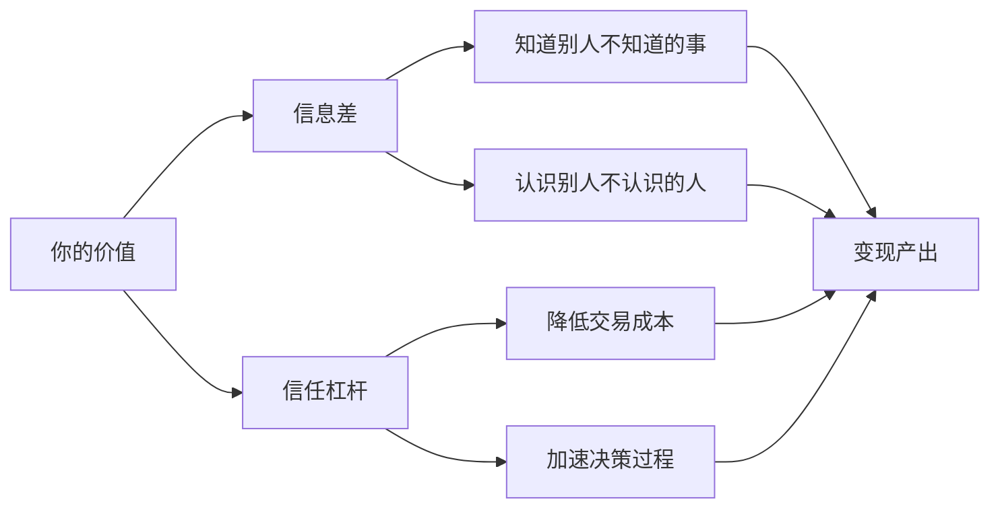
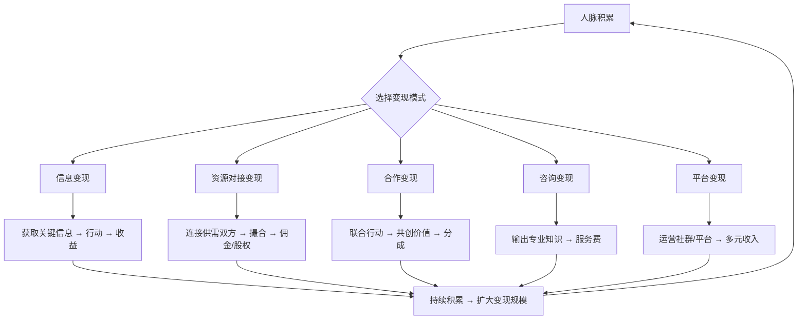
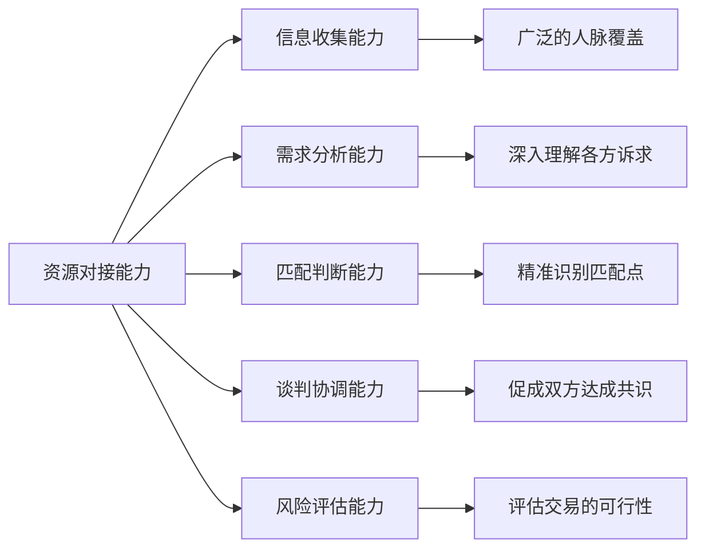
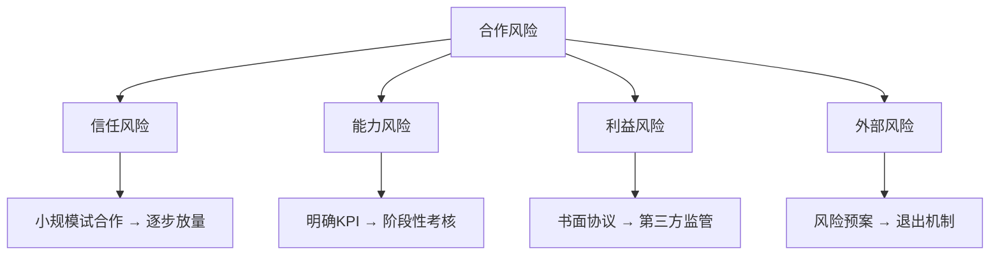
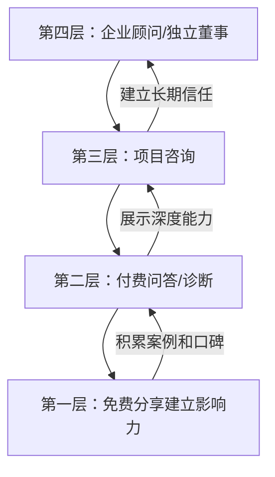
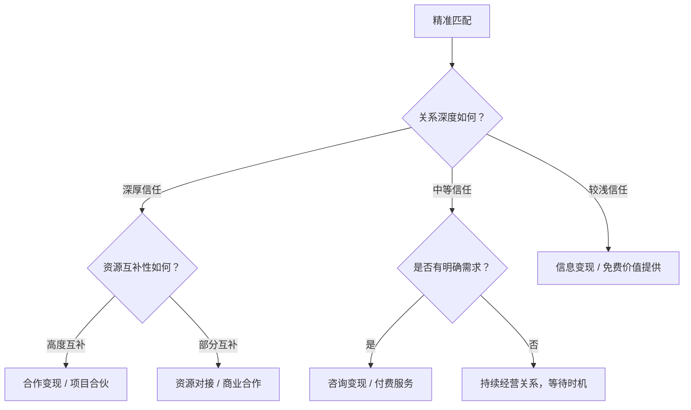

## 五、人脉变现方法：如何将人脉转化为实际价值？

人脉变现是人脉经营的最终闭环——将积累的社交关系转化为可衡量的实际回报。但"变现"二字常被误解为功利性的"利用"，事实上，真正可持续的人脉变现是一种**价值交换的良性循环**：你在帮助他人实现目标的过程中，同步实现了自身价值的兑现。

本章将从变现的底层逻辑出发，系统拆解五大变现模式，提供可落地的实操框架，并深入探讨变现过程中的伦理边界与常见陷阱。

### 5.1 人脉变现的底层逻辑

在讨论具体方法之前，需要先理解人脉变现为什么"能成立"，以及它的运行机制是什么。

#### 5.1.1 人脉变现的本质：信息差与信任杠杆

人脉之所以能产生经济价值，根源在于两个核心要素：

**信息差（Information Asymmetry）**：不同人掌握的信息不同，而信息本身就是资源。你认识张三知道某条供应链信息，李四恰好需要这条信息，你作为连接节点就产生了价值。信息差的大小决定了单次变现的天花板。

**信任杠杆（Trust Leverage）**：交易的本质是信任。当A信任你、你信任B时，你可以充当信任的传递者，降低A和B之间的交易成本。这种信任杠杆是中介、掮客、经纪人等职业存在的根本原因。

#### 5.1.2 人脉变现的三个前提条件

并非所有社交关系都能变现，成功的变现需要同时满足三个条件：

| 前提条件 | 含义 | 缺失的后果 |
|---------|------|-----------|
| **信任基础** | 双方有足够的情感账户余额 | 对方会怀疑你的动机，变现行为被视为"割韭菜" |
| **价值匹配** | 你的资源/能力恰好对应对方的需求 | 即使关系再好，没有交集也无法产生变现 |
| **时机成熟** | 对方处于需要你资源的阶段 | 过早变现会破坏关系，过晚则错过窗口 |

很多人的困惑在于"认识很多人但变不了现"，根本原因往往是这三个条件中至少有一个不具备。最常见的问题是信任基础不够就开始"推销"自己——这会永久性地损害关系。

#### 5.1.3 变现路径的全景图

---

### 5.2 五大变现模式详解

#### 5.2.1 模式一：信息变现

**定义**：通过人脉网络获取高价值信息，并将信息优势转化为实际收益。

信息变现是门槛最低但上限极高的变现方式。几乎所有行业都存在信息差，而人脉网络是获取一手信息最高效的渠道。

**四种核心信息类型及其变现路径**：

**① 求职与职业机会信息**

隐性招聘市场（Hidden Job Market）是指未通过公开招聘渠道发布的工作机会。据LinkedIn的数据统计，约70%的职位从未公开发布，而是通过内部推荐和人脉网络填补。

变现路径：
- 直接变现：获得高薪职位，薪资提升20%-50%（内推通常比海投薪资谈判空间更大）
- 间接变现：推荐他人获得内推奖金（大厂内推奖金通常5000-20000元）
- 长期变现：进入更优质的职业圈子，打开后续发展空间

实操要点：
- 定期（每季度）更新LinkedIn/脉脉等职业社交平台的个人状态
- 主动告诉核心人脉你正在关注的机会类型
- 收到内推机会时，即使不感兴趣也要表示感谢并推荐更合适的人选

**② 商业情报信息**

行业动态、竞争对手策略、客户采购计划、供应链变化等商业信息，往往是决策的关键依据。

| 信息类型 | 价值程度 | 获取难度 | 典型变现方式 |
|---------|---------|---------|------------|
| 行业政策变化 | ★★★★★ | ★★★ | 提前布局，抢占政策红利 |
| 竞争对手动态 | ★★★★ | ★★★★ | 调整策略，避实击虚 |
| 客户采购计划 | ★★★★★ | ★★★★★ | 提前接触，提高中标率 |
| 供应链价格变动 | ★★★★ | ★★★ | 低买高卖，锁定利润 |
| 技术趋势预判 | ★★★★★ | ★★★★★ | 投资布局，技术转型 |

实操要点：
- 参加行业会议时，重点不是听演讲，而是茶歇时的非正式交流
- 建立"行业信息日记"，每周记录从人脉获取的3条关键信息
- 对信息进行交叉验证，单一来源的信息不作为决策依据

**③ 投资与理财信息**

通过人脉获取的投资机会信息，包括一级市场项目、二级市场内幕（需合法合规）、房产投资机会等。

⚠️ **风险警示**：投资信息变现必须严格遵守法律法规。内幕交易、操纵市场等行为将面临严重的法律后果。所有投资决策应基于公开信息和独立判断，人脉信息仅作为参考线索。

**④ 政策与合规信息**

政策变化（如税收优惠、产业扶持、准入门槛调整）往往存在时间窗口，提前获知的人可以抢占先机。

案例：2020年新能源汽车补贴政策调整前，部分经销商通过行业人脉提前获知消息，调整了库存策略，在政策切换期实现了利润最大化。

---

#### 5.2.2 模式二：资源对接变现

**定义**：作为连接者，将拥有不同资源的人撮合在一起，从促成的交易中获取回报。

资源对接是最经典的"中间人"模式。其核心价值在于**降低搜寻成本**——需求方不需要花时间寻找供给方，供给方也不需要花精力开发客户，你作为连接节点同时为双方节省了时间。

**四种核心对接类型**：

**① 供需对接**

将拥有资源的一方与需要资源的一方连接起来。这是最广泛的对接类型，覆盖几乎所有行业。

案例框架：
场景：A公司需要大批量采购某种原材料，B工厂恰好有该材料的产能富余
你的角色：认识A的采购总监和B的销售经理
对接过程：
  1. 了解A的具体需求规格、数量、交付时间
  2. 确认B的产能、质量标准、报价范围
  3. 安排双方负责人面谈
  4. 协助谈判、促成合同签订
回报方式：固定佣金（合同金额的1%-5%）或差价利润

**② 人才对接**

将求职者与招聘方连接起来。不同于传统猎头，人脉驱动的人才对接往往更精准，因为你能同时理解候选人的诉求和企业的需求。

变现方式：
- 猎头佣金：年薪的15%-25%（高端岗位可达30%）
- 内推奖金：5000-50000元不等
- 长期价值：被推荐人入职后的业绩可能为你带来间接收益

**③ 项目对接**

将有项目但缺资源的人与有资源但缺项目的人连接起来。

典型场景：
- 创业者有技术/产品但缺资金，你对接投资人
- 投资人有资金但缺好项目，你对接优质创业者
- 设计师有能力但缺客户，你对接有需求的企业

**④ 资本对接**

连接资金供给方和需求方。这是变现天花板最高的对接类型，也是风险最大的。

| 对接场景 | 典型回报 | 风险等级 | 所需信任等级 |
|---------|---------|---------|------------|
| 天使投资撮合 | 股权1%-5%或FA费用2%-5% | 高 | 极高 |
| PE/VC项目推荐 | FA费用1%-3% | 中高 | 高 |
| 银行贷款对接 | 服务费或佣金 | 低 | 中 |
| 并购交易撮合 | 成交额的1%-3% | 中 | 极高 |

**资源对接的核心能力**：

**资源对接的实操流程**：

**第一步：建立资源地图**

用表格或数据库记录你的核心人脉拥有的资源类型：

人脉姓名 | 资源类型 | 具体描述 | 可对接方向 | 信任等级（1-5）
张三     | 资金     | 可投资金额500万+ | 寻找优质项目 | 4
李四     | 技术     | AI算法团队15人 | 寻找落地场景 | 5
王五     | 渠道     | 华东区域200+经销商 | 寻找新产品代理 | 3

**第二步：主动撮合**

不要等到有人找你才开始对接。定期审视资源地图，主动发现匹配机会。每周花30分钟梳理"谁可能需要谁"。

**第三步：专业的撮合流程**

1. 分别与双方深入沟通，了解需求和底线
2. 准备一份简洁的对接摘要（不超过1页A4纸）
3. 安排正式会面（线上或线下均可）
4. 会面后分别跟进双方反馈
5. 如需进一步谈判，协助敲定细节
6. 合同签订后，持续跟踪执行情况

**第四步：利益分配的注意事项**

- 佣金比例应在撮合前就与受益方达成口头或书面协议
- 首次合作可以适当降低佣金以促成交易
- 对于大额交易，建议签署正式的居间协议
- 如果双方绕过你直接交易，不要计较，保持风度

---

#### 5.2.3 模式三：合作变现

**定义**：与人脉建立深度合作关系，通过共同行动创造价值并分享收益。

合作变现与前两种模式的核心区别在于：你不是"中间人"，而是"共创者"。你深度参与到价值创造的过程中，因此回报也更高，但风险和投入也更大。

**四种合作变现形态**：

**① 商业合作**

与人脉共同开拓市场、开发客户、推广产品。

| 合作形式 | 投入方式 | 分配方式 | 典型案例 |
|---------|---------|---------|---------|
| 代理分销 | 渠道资源 | 差价利润 | A有产品，B有渠道，B代理销售A的产品 |
| 联合营销 | 品牌资源 | 按效果分成 | 两个品牌联合举办活动，分摊成本共享流量 |
| 异业联盟 | 客户资源 | 互相引流 | 健身房与健康餐品牌互相推荐客户 |
| 区域合伙 | 本地资源 | 股权分红 | 总部出品牌和产品，合伙人出本地资源和运营 |

**② 项目合作**

与人脉共同完成一个具体项目，按约定比例分享收益。

项目合作的关键是**明确分工和利益分配**。很多合作关系的破裂源于事前约定不清晰。

项目合作协议核心条款模板：
1. 项目描述：明确项目范围、目标、交付物
2. 分工安排：各方的具体职责和投入
3. 资金安排：各方出资比例、使用规则
4. 利益分配：利润分成比例、分配时间、分配方式
5. 风险承担：亏损分担比例、退出机制
6. 知识产权：项目成果的归属和使用规则
7. 争议解决：协商→调解→仲裁/诉讼
8. 协议期限：项目周期和续约条件

**③ 品牌合作**

与人脉合作进行品牌推广，共同扩大影响力。

案例：两位不同领域的KOL（一位擅长科技评测，一位擅长生活方式），合作推出"科技生活方式"系列内容。科技KOL带来专业深度，生活方式KOL带来生活化表达，双方粉丝产生交集，各自增长30%-50%的粉丝。

**④ 技术合作**

与人脉合作进行技术研发或技术成果转化。

案例：某高校教授有前沿算法研究成果但缺乏工程化能力，某企业技术负责人有强大的工程团队但缺乏算法突破。通过人脉介绍双方合作，教授的算法被工程化落地，共同申请专利并获得商业化收益。

**合作变现的风险管理**：

---

#### 5.2.4 模式四：咨询变现

**定义**：将人脉积累中形成的专业知识、行业洞察和实践经验，以咨询服务的形式输出并获取报酬。

咨询变现的本质是**知识和经验的货币化**。你通过人脉网络获得了深度的行业认知和实战经验，这些积累本身就是高价值资产。

**咨询变现的四层金字塔**：

**① 免费分享建立影响力（起步期）**

在建立咨询业务的初期，需要通过免费内容输出建立专业形象：
- 在知乎、公众号、行业论坛发布专业文章
- 在行业会议上做分享嘉宾
- 为朋友的朋友提供免费的简短建议
- 在社交媒体上分享行业观察

关键指标：当开始有陌生人主动找你咨询时，说明影响力初步形成。

**② 付费问答/诊断（验证期）**

将免费咨询逐步转向付费，验证市场对你专业能力的付费意愿：
- 在知乎、在行等平台开通付费咨询
- 设置一个较低的单价（如200-500元/小时）
- 通过前20-30个付费案例积累口碑和案例库

定价参考：

| 经验年限 | 行业知名度 | 建议时薪 | 典型单次咨询费 |
|---------|---------|---------|------------|
| 1-3年 | 无 | 200-500元 | 500-2000元 |
| 3-5年 | 有少量曝光 | 500-1500元 | 2000-8000元 |
| 5-10年 | 行业知名 | 1500-5000元 | 8000-30000元 |
| 10年+ | 权威专家 | 5000-20000元 | 30000-100000元 |

**③ 项目咨询（成长期）**

承接系统性的咨询项目，深入解决客户的复杂问题：
- 商业模式设计与优化
- 市场进入策略制定
- 组织架构与流程优化
- 技术选型与架构设计
- 融资策略与投资人对接

项目咨询的报价通常按项目整体计费，而非按小时。一个3-6个月的咨询项目，收费在5万-50万元不等，取决于项目复杂度和你的专业水平。

**④ 企业顾问/独立董事（成熟期）**

成为企业的长期顾问或独立董事，获取顾问费和/或股权：
- 企业顾问：每年顾问费5万-50万元，每季度或每月提供一次深度咨询
- 独立董事：年薪+会议津贴+可能的股权激励
- 投资顾问：以咨询服务换取投资机会或股权

**咨询变现的核心能力建设**：

1. **专业深度**：在1-2个领域建立真正的深度认知，而不是"什么都懂一点"
2. **案例积累**：每个成功案例都是你的"资产"，要系统化地记录和展示
3. **方法论沉淀**：将经验提炼为可复用的方法论和工具，提高服务效率
4. **内容输出**：持续产出高质量内容（文章、演讲、课程），形成个人品牌
5. **客户管理**：建立CRM系统，跟踪客户需求和满意度

---

#### 5.2.5 模式五：平台变现

**定义**：通过建立和运营社交平台、社群或个人品牌，将人脉聚集效应转化为多元收入。

平台变现是变现天花板最高的模式。当你成为某个领域的"节点"——所有人都来你这里连接、交流、获取信息——你就拥有了平台级的变现能力。

**平台变现的四种主要形式**：

**① 付费社群**

建立付费制社群，提供独家内容、资源和交流机会。

付费社群的定价与价值设计：

| 社群层级 | 年费范围 | 提供的价值 | 规模建议 |
|---------|---------|-----------|---------|
| 入门级 | 99-399元 | 基础内容、信息汇总、群交流 | 500-2000人 |
| 进阶级 | 999-2999元 | 深度内容、专家分享、资源对接 | 100-500人 |
| 高端级 | 5000-20000元 | 一对一咨询、高端人脉、项目合作 | 20-50人 |
| 核心圈 | 20000元+ | 深度绑定、资源共享、利益共同体 | 5-15人 |

社群运营的关键：持续输出价值 > 收费。如果社群内容不能持续让成员感到"物超所值"，续费率会急剧下降。

**② 活动变现**

通过组织线下或线上活动获取收益：
- 付费培训/工作坊：每人500-5000元
- 行业峰会/论坛：赞助商收入 + 门票收入
- 主题沙龙/晚宴：高端社交场景，收费500-3000元/人
- 游学/考察团：每人5000-50000元

**③ 广告与品牌合作变现**

当平台拥有足够大的流量和影响力时：
- 公众号/知乎广告：根据粉丝量和阅读量定价
- 品牌赞助内容：一篇推广文5000-50000元不等
- 行业白皮书赞助：企业付费在报告中露出品牌

**④ 电商与带货变现**

通过平台推荐和销售产品：
- 自有品牌产品
- 代理/分销他人产品
- 直播带货
- 知识付费产品（课程、电子书、模板）

---

### 5.3 人脉变现的伦理原则与边界

人脉变现最容易踩坑的不是"怎么做"，而是"做的分寸"。以下是必须坚守的伦理底线。

#### 5.3.1 四大伦理原则

**原则一：价值对等**

变现不是单方面索取，而是双向价值流动。在每次变现行为中，都要问自己："对方从这次交易中获得了什么？"如果你的收益远大于对方的收益，这次变现就是在消耗关系。

自检公式：**如果角色互换，你是否愿意接受这个条件？**

**原则二：透明诚实**

- 不隐瞒你从对接中的收益（不必说具体数字，但要让对方知道你有收益）
- 不夸大信息的价值和可靠性
- 不利用信息不对称欺骗任何一方
- 在利益冲突时主动披露

**原则三：自愿互利**

- 不利用关系施压促成交易
- 不在对方困难时趁火打劫
- 不强制捆绑不相关的服务
- 任何一方有权无条件退出

**原则四：长期主义**

单次变现的最大值 < 长期关系的总变现值。不要为了一次性的大收益而损害一个高质量的长期关系。

计算公式：
单次变现收益 vs. 该关系未来10年的预期价值（折现）
如果前者 < 后者，坚决不做损害关系的变现

#### 5.3.2 变现的红线

以下行为严格禁止，即使短期有收益，长期必然反噬：

- **出卖隐私**：将人脉的个人信息、商业秘密出售给第三方
- **两面获利**：在对接中同时向双方收取不透明的费用
- **虚假背书**：为不靠谱的产品或项目背书以获取佣金
- **利用信任骗投**：利用信任关系推荐高风险甚至诈骗性投资
- **职务变现**：利用公司职务之便为私人关系谋取利益（这可能违法）

---

### 5.4 人脉变现的实操框架

#### 5.4.1 第一步：盘点资源——绘制你的"人脉资产表"

变现的前提是知道自己"有什么"。系统盘点你的人脉资源：

人脉资产表模板：

一、核心圈（信任度5分，10人以内）
  - 张三 | 职位/身份 | 拥有的核心资源 | 他的核心需求 | 对接潜力
  
二、紧密圈（信任度4分，30人以内）
  - 李四 | 职位/身份 | 拥有的核心资源 | 他的核心需求 | 对接潜力

三、扩展圈（信任度3分，100人以内）
  - 王五 | 职位/身份 | 拥有的核心资源 | 他的核心需求 | 对接潜力

四、弱连接圈（信任度2分，500人以内）
  - 赵六 | 职位/身份 | 可能的资源 | 潜在需求

建议每季度更新一次，因为人脉的资源和需求是动态变化的。

#### 5.4.2 第二步：建立信任——先付出后回报

在尝试任何变现行为之前，确保信任账户有足够的余额：

信任存款行为清单：
- 主动分享有价值的信息（不求回报）
- 帮助人脉解决小问题（不计报酬）
- 介绍人脉认识对其有帮助的人
- 在人脉遇到困难时伸出援手
- 定期保持联系（不是有事才找人）
- 在公开场合认可和推荐人脉

信任存款的最低标准：**在你提出变现请求之前，至少为对方做过3次以上无条件的价值提供**。

#### 5.4.3 第三步：精准匹配——找到最优变现点

不是所有关系都适合用同一种方式变现。匹配矩阵如下：

#### 5.4.4 第四步：执行落地——从计划到行动

变现执行的"五要素"检查清单：

□ 价值主张：你能为对方提供什么独特价值？（一句话说清楚）
□ 目标对象：这次变现的目标客户/合作伙伴是谁？
□ 执行计划：具体的时间表、里程碑和负责人
□ 风险预案：可能出什么问题？如何应对？
□ 退出方案：如果效果不好，如何体面地终止？

#### 5.4.5 第五步：利益分配——透明、公平、及时

利益分配是合作变现中最敏感的环节。处理不好会导致关系破裂。

分配原则：
1. **事前约定**：在合作开始前就明确分配比例和方式，不要事后协商
2. **贡献导向**：分配应反映各方的实际贡献，而非仅按投入成本
3. **及时兑现**：约定的收益要按时支付，拖延支付是最伤信任的行为
4. **书面记录**：即使是朋友之间，大额交易也要有书面协议
5. **留有余地**：第一次合作可以适当让利，为长期合作打下基础

---

### 5.5 人脉变现的常见误区与纠正

#### 误区一：急于变现，关系还没建立就开始"推销"

**症状**：刚认识就推荐产品、刚加微信就发广告、参加活动的目的就是"找客户"。

**后果**：不仅无法变现，还会被贴上"功利"的标签，彻底失去未来变现的可能。

**纠正**：遵循"3-3-3法则"——至少提供3次无偿价值、维持3个月的互动、进行3次以上的深入交流后，才考虑第一次变现尝试。

#### 误区二：只关注"高价值"人脉，忽视弱连接

**症状**：只跟大佬社交，对"普通人"不屑一顾。

**后果**：弱连接（Granovetter的"弱连接的力量"理论）恰恰是信息差最大的来源。你最需要的信息往往来自你不太熟的人。

**纠正**：弱连接才是信息变现的金矿。维护100个弱连接比维护10个强连接的信息覆盖面大得多。

#### 误区三：只索取不付出，把人脉当"工具"

**症状**：有事才找人、从不主动帮忙、对别人的帮助觉得理所当然。

**后果**：信任账户透支，人脉关系断裂。

**纠正**：遵循"60/40法则"——你为他人提供的价值应该始终大于你从他人获取的价值，至少保持6:4的比例。

#### 误区四：一次变现就想"回本"

**症状**：投入大量时间社交后，急于在一次交易中收回所有成本。

**后果**：报价过高或条件过于苛刻，吓跑潜在合作伙伴。

**纠正**：人脉变现是长期事业，第一次变现的目标是"验证模式"而非"获取暴利"。

#### 误区五：忽视法律和合规风险

**症状**：为了佣金推荐不靠谱的投资、在对接中做虚假承诺、泄露商业秘密。

**后果**：法律纠纷、声誉损失、关系网络崩塌。

**纠正**：任何变现行为都要先评估法律风险。不确定的时候，咨询专业律师。

---

### 5.6 人脉变现的进阶策略

#### 5.6.1 从"一次性变现"到"系统性变现"

初级的人脉变现是随机的、一次性的——碰到机会就做。高级的人脉变现是系统性的、可持续的。

系统性变现的三个层次：

**第一层：建立个人品牌，让机会主动找你**

当你在某个领域建立了足够的知名度，变现机会会主动上门。这需要持续的内容输出（文章、演讲、社交媒体）、案例积累和口碑传播。

**第二层：搭建变现平台，规模化交付**

将个人能力产品化、标准化。例如：
- 将咨询经验整理为课程（知识付费）
- 将对接能力系统化为平台（撮合平台）
- 将合作模式模板化（可复制的合伙模式）

**第三层：建立生态，让价值自动流转**

成为某个领域的核心节点，连接足够多的人和资源，让价值交换在你的网络中自动发生。你不再需要主动寻找变现机会，整个网络的运转都在为你创造价值。

#### 5.6.2 人脉变现的杠杆工具

| 工具类型 | 具体工具 | 用途 |
|---------|---------|------|
| CRM系统 | Notion、飞书多维表格、HubSpot | 管理人脉信息和互动记录 |
| 社交媒体 | 微信、LinkedIn、知乎、即刻 | 内容输出和影响力扩展 |
| 社群工具 | 知识星球、微信群、Discord | 付费社群运营 |
| 内容平台 | 公众号、B站、小宇宙 | 建立个人品牌 |
| 支付工具 | 微信支付、支付宝、Stripe | 收款和分账 |
| 协作工具 | 飞书、腾讯文档、石墨文档 | 项目管理和协作 |
| 合同工具 | e签宝、法大大 | 线上签署合作协议 |

#### 5.6.3 不同职业阶段的变现策略

| 阶段 | 职业年限 | 核心策略 | 重点变现模式 | 年变现目标参考 |
|------|---------|---------|------------|-------------|
| 新人期 | 0-3年 | 积累人脉、建立信任 | 信息变现（求职） | 间接：薪资提升 |
| 成长期 | 3-7年 | 深化专业、拓展圈层 | 咨询变现、资源对接 | 5万-20万元 |
| 成熟期 | 7-15年 | 行业影响力、资源整合 | 合作变现、平台变现 | 20万-100万元 |
| 专家期 | 15年+ | 行业权威、生态构建 | 平台变现、企业顾问 | 100万元+ |

---

### 5.7 自检清单：你的人脉变现健康度

完成以下自检，评估你当前的人脉变现状态：

信任基础（每项1分，满分5分）
□ 核心人脉对你的信任度≥4分（5分制）
□ 过去6个月至少帮助了10位人脉（无条件）
□ 从未做过损害信任的行为
□ 人脉会主动向你分享重要信息
□ 在行业中有正面的口碑

变现能力（每项1分，满分5分）
□ 能清晰说出自己能提供的独特价值
□ 有至少3个成功的变现案例
□ 有系统化的人脉资源地图
□ 了解至少2种适合自己的变现模式
□ 有稳定的变现收入来源

伦理合规（每项1分，满分5分）
□ 所有变现行为都基于双方自愿
□ 从不利用信息不对称欺骗他人
□ 利益分配事先明确且事后兑现
□ 从不做虚假承诺或夸大宣传
□ 变现行为符合法律法规

总分解读：
12-15分：优秀——你的人脉变现系统健康且可持续
8-11分：良好——有基础但需要补强某些环节
4-7分：一般——变现能力需要系统性建设
0-3分：起步——先把信任基础打好再谈变现

---

### 5.8 本章小结

人脉变现不是一次性的"收割"，而是长期价值交换的自然结果。核心要点回顾：

1. **底层逻辑**：人脉变现的本质是信息差和信任杠杆的运用
2. **五大模式**：信息变现、资源对接、合作变现、咨询变现、平台变现——从简到复杂，从低到高
3. **伦理底线**：价值对等、透明诚实、自愿互利、长期主义——任何变现行为都不能突破
4. **实操框架**：盘点资源 → 建立信任 → 精准匹配 → 执行落地 → 利益分配
5. **进阶路径**：从一次性变现到系统性变现，从个人能力到平台效应

记住一个核心原则：**你的人脉变现能力，取决于你为这个网络创造的总价值。先成为一个高价值的节点，变现自然水到渠成。**
