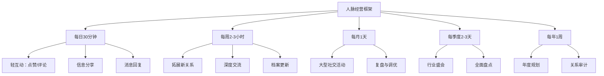
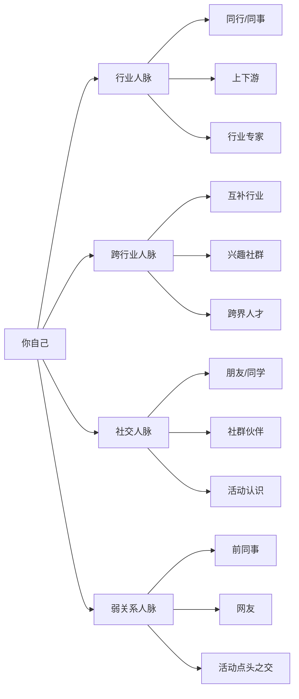

## 六、人脉经营的日常实践框架

前五节分别讲解了人脉构建、维护、拓展、管理和变现的方法论，但方法论如果不能落地为日复一日的行动，就只是纸上谈兵。本节的核心任务是：把所有策略压缩进一个可执行的时间框架，让人脉经营变成像刷牙一样的日常习惯。

### 6.1 为什么需要框架？——从"想到才做"到"系统运转"

人脉经营最常见的失败模式不是"不会做"，而是"想起来才做、忙起来就忘"。行为科学研究表明，习惯的形成依赖三个要素：

| 要素 | 说明 | 人脉经营中的对应 |
|------|------|-----------------|
| **提示（Cue）** | 触发行为的信号 | 日历提醒、朋友圈动态、节日节点 |
| **惯常行为（Routine）** | 具体执行的动作 | 点赞评论、发送消息、参加活动 |
| **奖赏（Reward）** | 完成后的正反馈 | 对方回复、关系深化、获得机会 |

没有框架的人脉经营像随机撒网——偶尔捞到鱼，多数时候空手而归。有了框架，你就拥有了一台"关系维护机器"：每个时间单位投入固定的精力，产生可预期的回报。



### 6.2 每日实践（30分钟）——保持"关系温度"

每日实践的目标不是深度社交，而是保持在对方视野中的"存在感"。社会心理学中有一个"单纯曝光效应"（Mere Exposure Effect）：人们倾向于对经常出现在自己视野中的人产生好感。每天30分钟的轻互动，就是在持续制造这种曝光。

#### 6.2.1 早晨扫描（10分钟）

**做什么：**

- 浏览朋友圈、微博、LinkedIn等社交平台，关注重要联系人的动态
- 对有价值的内容真诚点赞，避免无脑点赞（对方能分辨）
- 对特别有共鸣的内容写一条有质量的评论（15-30字，包含你的观点或追问，而非简单的"说得好"）

**怎么做才有效：**

| 低效做法 | 高效做法 |
|---------|---------|
| 给所有人点赞 | 只对有感触的内容点赞 |
| 评论"写得好👍" | 评论具体观点："第二点关于XX的分析让我想到YY" |
| 随机浏览 | 优先查看"重要联系人"分组的动态 |
| 在微信上浏览 | 用多个平台交叉覆盖（微信+LinkedIn+即刻） |

**进阶技巧——"评论钩子"：** 在评论中抛出一个相关问题或分享一个补充信息，这样对方大概率会回复你，一来一回就完成了一次自然的互动。例如对方分享了一篇关于AI的文章，你评论"这个方向你们团队有落地吗？我最近看到一个案例挺有意思的"——既展示了你关注他的领域，又暗示你有信息可以分享。

#### 6.2.2 主动触达（10分钟）

**做什么：**

- 从你的"重要联系人"列表中选1-2个人，主动发一条消息
- 消息内容可以是：分享一篇对方可能感兴趣的文章、对上次聊天的后续跟进、一个与对方业务相关的行业动态

**消息模板（可根据场景选择）：**

场景一：信息分享
"刚看到这篇文章（链接），里面关于[XX]的观点和你上次说的[YY]挺呼应的，你看了吗？"

场景二：后续跟进
"上次你提到在做[XX]项目，最近进展怎么样？我这边刚好有个朋友做过类似的，需要我帮忙对接吗？"

场景三：节日/天气关怀
"今天降温了，注意保暖。顺便问下，上次你推荐的那本书我读完了，确实很有启发。"

**关键原则：** 每次触达都要提供价值（信息、资源、情绪价值），而不是单纯"刷存在感"。对方收到你的消息时，第一反应应该是"这人又给我带来有用的东西了"，而不是"这人又来寒暄了"。

#### 6.2.3 消息处理（10分钟）

**做什么：**

- 回复收到的消息和请求，不要让消息超过24小时未回复
- 对于需要花时间处理的请求，先回复"收到了，我看看怎么帮你，明天给你回复"，而不是沉默
- 标记需要后续跟进的对话

**消息回复的时效标准：**

| 消息类型 | 建议回复时效 | 说明 |
|---------|-------------|------|
| 紧急求助 | 1小时内 | 人脉危机时刻的快速响应能极大加深关系 |
| 普通消息 | 4小时内 | 保持正常的社交节奏 |
| 群聊消息 | 当天内 | 不需要每条都回，选择有价值的参与 |
| 朋友圈互动 | 当天内 | 收到评论/回复后及时回应 |

**一个容易忽略的细节：** 当你收到别人的帮助后，除了当时感谢，还应该在事情结束后告知结果。比如别人帮你内推了一份工作，无论最终是否成功，都应该告诉对方结果并再次感谢。这种"闭环思维"是高段位人脉经营者的标志。

### 6.3 每周实践（2-3小时）——拓展与深化

每周实践的重心从"维护"转向"发展"——既包括拓展新关系，也包括深化已有关系。

#### 6.3.1 拓展新关系（每周2-3人）

**执行方法：**

- 线上：在行业社群中主动参与讨论，对有价值的观点添加对方好友并附上自我介绍
- 线下：参加1次行业活动、兴趣小组或社群聚会
- 间接：通过现有联系人引荐，这是质量最高的拓展方式

**新人脉档案模板：**

```markdown
## [姓名] - [公司/领域]
- 认识时间：YYYY-MM-DD
- 认识渠道：XX活动/XX介绍
- 核心标签：#行业 #技能 #兴趣
- 对方关注点：（对方最在意什么）
- 我能提供的价值：（你能帮对方什么）
- 最近互动：YYYY-MM-DD [简述]
- 下次跟进：YYYY-MM-DD [计划做什么]
```

**每周新认识2-3人的计算逻辑：** 一年52周，如果每周认识2-3个新人，一年就是100-150个新关系。假设其中30%是有价值的长期关系，一年就能积累30-45个高质量人脉。三年下来，你就拥有一个覆盖各行业的百人核心网络。

#### 6.3.2 深度交流（每周1-2次）

**为什么需要深度交流？**

轻互动（点赞、评论）维持的是"弱关系"，深度交流才能建立"强关系"。社会学家格兰诺维特（Granovetter）的"弱关系理论"指出，弱关系带来信息，强关系带来信任和资源。两者缺一不可，但强关系的建立必须通过深度交流。

**深度交流的形式：**

| 形式 | 时间投入 | 适合对象 | 深度效果 |
|------|---------|---------|---------|
| 一对一咖啡/午餐 | 1-2小时 | 重要联系人、潜在合作伙伴 | ★★★★★ |
| 视频通话 | 30-60分钟 | 异地重要联系人 | ★★★★ |
| 电话聊天 | 15-30分钟 | 老朋友、前同事 | ★★★ |
| 一起运动/活动 | 1-2小时 | 想加深关系的新朋友 | ★★★★ |
| 互相帮忙做项目 | 数小时 | 潜在深度合作伙伴 | ★★★★★ |

**深度交流的聊天框架（PREP法）：**

1. **P（Point）**：开场点明话题——"最近在关注XX领域"
2. **R（Reason）**：说明为什么关注——"因为我发现YY趋势"
3. **E（Example）**：举具体案例——"比如ZZ公司做了什么"
4. **P（Point）**：抛出问题——"你怎么看这个方向？"

这个框架避免了"尬聊"——很多人约了咖啡却不知道聊什么，PREP法提供了结构化的聊天路径。

#### 6.3.3 档案更新（每周30分钟）

**做什么：**

- 更新本周新认识的人脉档案
- 补充已有联系人的最新信息（跳槽、项目变动、兴趣变化）
- 回顾下周需要跟进的联系人
- 清理不再活跃或价值降低的关系标签

**工具推荐：**

| 工具 | 适合人群 | 优势 | 劣势 |
|------|---------|------|------|
| 微信标签+备注 | 轻量级用户 | 零成本，随手可用 | 功能有限，难以系统化 |
| Notion/Airtable | 中度用户 | 灵活，可自定义 | 需要维护成本 |
| 飞书多维表格 | 团队协作 | 可多人共享 | 个人使用偏重 |
| 专业CRM（如Luban） | 重度用户 | 功能全面 | 付费，学习成本高 |

### 6.4 每月实践（1天）——扩大圈子与复盘

每月实践是人脉经营的"中级齿轮"——频率适中，但投入精力更大，产出也更显著。

#### 6.4.1 参加1-2次大型社交活动

**活动选择标准：**

- **相关性**：与你的行业、兴趣或目标高度相关
- **质量**：参加者的水平和你相当或更高（避免"向下社交"的舒适区）
- **形式**：优先选择有互动环节的活动（圆桌、工作坊），而非纯听讲的活动
- **规模**：30-100人最佳，太小接触不到新人，太大难以深度交流

**参加活动的行动清单：**

活动前：
□ 研究嘉宾和参加者名单，圈定3-5个想认识的人
□ 准备好自我介绍（30秒版本：你是谁+做什么+最近关注什么）
□ 带够名片或准备好微信二维码
□ 准备2-3个可以聊的话题

活动中：
□ 提前到场，利用签到和茶歇时间主动社交
□ 在互动环节积极发言，展示专业能力
□ 对目标人物主动搭话，但不要过于功利
□ 记录新认识的人的关键信息（在手机备忘录里快速记下）

活动后：
□ 24小时内添加新认识的人为好友，附上"今天在XX活动认识的XX"
□ 48小时内发送一条跟进消息，提到活动中聊到的具体内容
□ 将新认识的人录入人脉档案

#### 6.4.2 组织或参与1次小型聚会

**为什么要自己组织聚会？** 组织者在社交中天然占据优势——你是"主场"，所有人都认识你，你也是所有人之间的连接点。这是快速建立"超级连接者"身份的最佳方式。

**小型聚会的组织模板（6-8人晚餐）：**

主题：XX行业交流晚餐
时间：[具体日期] 19:00-21:30
地点：[安静适合聊天的餐厅]
人数：6-8人（你+5-7位来自不同背景的朋友）
费用：AA制或轮流做东

邀请原则：
- 每次邀请至少2位对方不认识的人（制造新连接的机会）
- 保证背景多样性（不同行业、不同年龄、不同技能）
- 避免邀请性格冲突的人
- 确保每个人都能从聚会中获得价值

流程安排：
19:00-19:30  入座寒暄
19:30-20:00  每人2分钟自我介绍（你作为组织者先来破冰）
20:00-21:00  自由交流（你可以适当引导话题）
21:00-21:30  每人分享一个最近的收获或困惑（制造深度话题）

#### 6.4.3 月度复盘与策略调整

**复盘框架（每月最后一天，30分钟）：**

| 复盘维度 | 具体问题 |
|---------|---------|
| 数量指标 | 本月新认识了多少人？其中多少是有价值的？ |
| 质量指标 | 与多少位重要联系人进行了深度交流？ |
| 维护指标 | 是否遗漏了需要跟进的人？ |
| 价值指标 | 本月从人脉中获得了什么？（信息、机会、帮助） |
| 贡献指标 | 本月为别人提供了什么价值？（介绍、信息、帮助） |
| 策略指标 | 当前策略是否有效？需要调整什么？ |

**一个健康的"给予-索取比"：** 参考亚当·格兰特在《Give and Take》中的研究，最成功的人脉经营者是"给予者"——他们的给予远大于索取。理想的比例是7:3，即每10次互动中，7次是提供价值，3次是寻求帮助。如果你发现自己近期"索取"过多，下个月要刻意增加"给予"。

### 6.5 每季度实践（2-3天）——战略级投入

季度实践是人脉经营的"战略齿轮"——这个时间尺度的操作决定了你人脉网络的整体方向。

#### 6.5.1 参加1次重要行业活动

与月度的小型活动不同，季度活动应该是行业级的——大型峰会、专业论坛、行业年会。这类活动的价值不在于认识多少人，而在于：获取行业前沿信息、建立高层级人脉、提升个人行业影响力。

**高价值活动的识别方法：**

- 活动的演讲嘉宾中，有你想认识的人（说明这个活动的"浓度"够高）
- 活动有分组讨论或社交环节（纯听讲的活动价值有限）
- 活动的参加者质量高于你当前的平均社交圈水平
- 活动有持续的社群或后续活动（一次性的活动价值衰减快）

#### 6.5.2 人脉关系全面盘点

**盘点方法——人脉地图绘制：**



**盘点清单：**

□ 核心圈（10-15人）：最近3个月有深度交流吗？关系有加深还是疏远？
□ 关键圈（30-50人）：最近半年有互动吗？是否需要主动联系？
□ 活跃圈（100-200人）：哪些人应该升级到关键圈？哪些人标签需要更新？
□ 沉睡圈（200+人）：有没有被遗忘的高价值关系需要激活？
□ 缺口分析：哪些领域/行业/职能的人脉我严重缺乏？

**"人脉健康度"评估模型：**

| 指标 | 健康标准 | 警戒线 |
|------|---------|--------|
| 核心圈活跃率 | >80%（每月有互动） | <50% |
| 新关系获取率 | 每月>8人 | <3人 |
| 给予-索取比 | >2:1 | <1:1 |
| 跨行业覆盖 | >3个不同行业 | 仅限本行业 |
| 关系深度分布 | 强关系>10人 | <5人 |
| 互惠网络密度 | 多人互相认识 | 关系都是孤立的 |

#### 6.5.3 更新长期计划与跨圈子活动

**长期计划更新（每季度1次）：**

- 检视年度人脉目标的完成进度
- 根据职业发展变化调整人脉经营的重心
- 识别下一季度需要重点发展的3-5个关键关系
- 规划下一季度要参加的关键活动

**跨圈子活动（每季度1次）：** 人脉网络最有价值的特性是"结构洞"——连接不同社交圈的桥梁。每季度刻意参加一个你平时不涉足的圈子的活动。比如，如果你是技术圈的人，去参加一次金融圈的沙龙；如果你是创业圈的人，去参加一次公益组织的活动。这种跨圈子的接触往往能带来最有创意的想法和最意想不到的机会。

### 6.6 每年实践（1周）——年度战略规划

年度实践是人脉经营的"顶层设计"——用一周的时间，重新审视整个人脉战略。

#### 6.6.1 年度人脉审计

**审计维度与具体操作：**

**维度一：关系资产盘点**

用一张表格梳理你所有的重要关系，按以下维度打分（1-5分）：

| 关系人 | 亲密度 | 互惠度 | 成长性 | 稀缺性 | 综合得分 | 下一步行动 |
|--------|--------|--------|--------|--------|---------|-----------|
| 张三   | 4      | 3      | 5      | 4      | 16      | 每月深聊  |
| 李四   | 5      | 5      | 2      | 2      | 14      | 引入新领域 |
| 王五   | 2      | 1      | 5      | 5      | 13      | 重点培养  |

- **亲密度**：你们的关系深度
- **互惠度**：双方的给予是否平衡
- **成长性**：这个人未来的发展潜力
- **稀缺性**：这个关系是否难以替代

综合得分低于8分的关系需要决策：是投入精力修复，还是降级为普通联系人。

**维度二：网络结构分析**

检查你的人脉网络是否存在以下结构性问题：

- **过度集中**：所有重要关系都在同一个行业/公司/圈子
- **缺乏桥接**：不同圈子之间没有连接，你是唯一的桥梁
- **层级失衡**：只有同级关系，缺乏导师级和学生级关系
- **地理集中**：所有人脉都在同一个城市

**维度三：价值流分析**

回顾过去一年，你的人脉网络为你带来了：

- 多少个职业机会（面试、合作、项目）？
- 多少个关键信息（行业趋势、投资机会、政策变化）？
- 多少次实际帮助（推荐、背书、资源对接）？
- 多少情感支持（倾听、鼓励、陪伴）？

同时，你为网络中的其他人提供了多少价值？如果"获得"远大于"付出"，说明你的网络正在消耗"信任储蓄"，需要加速补充。

#### 6.6.2 制定下一年计划

**年度人脉目标模板：**

## [年份] 年度人脉经营目标

### 核心目标（最多3个）
1. 建立XX行业/领域的人脉基础，核心关系达到XX人
2. 将现有的XX个弱关系升级为强关系
3. 组织XX次小聚/活动，建立"超级连接者"身份

### 关键行动
- 每周：保持30分钟日常维护 + 1次深度交流
- 每月：参加1-2次行业活动 + 组织1次小型聚会
- 每季度：参加1次行业盛会 + 全面盘点
- 每半年：启动1个跨圈子项目

### 关键指标
- 新认识高质量人脉：XX人/年
- 深度交流次数：XX次/月
- 组织活动次数：XX次/年
- 核心圈活跃率：>80%

### 需要避免的陷阱
1. 不要为了数量牺牲质量
2. 不要只在舒适区内社交
3. 不要忘记维护老关系
4. 不要只索取不付出

#### 6.6.3 年度聚会与整体评估

**年度聚会建议：** 每年组织1次规模稍大的年度聚会（15-30人），邀请过去一年中对你最重要的人。这类聚会的价值在于：让不同圈子的人互相认识（你作为连接点的价值被放大）、一年一次的频率让它变成一个"社交仪式"（参考7.2节）、增强你作为组织者的影响力和记忆点。

**整体ROI评估：**

不要用"认识了多少人"来衡量人脉经营的效果，而要用"关系深度×网络广度×价值流动量"来综合评估。一个有50个核心关系、覆盖5个行业、每月有10次以上价值互换的人脉网络，远比一个有500个微信好友但几乎没有互动的网络更有价值。

### 6.7 框架的灵活调整——适配你的人生阶段

以上框架是一个标准模板，你需要根据自己的实际情况调整：

| 人生阶段 | 调整建议 |
|---------|---------|
| **职场新人（0-3年）** | 侧重拓展，每周认识3-5人；多参加行业活动；主动向资深人士请教 |
| **职业发展期（3-10年）** | 侧重深化，每月重点经营5-8个关键关系；开始建立跨行业连接 |
| **职业成熟期（10年+）** | 侧重赋能，从"获取人脉"转向"输出价值"；成为超级连接者 |
| **创业期** | 频率翻倍，每天1小时；侧重投资人、客户、合作伙伴 |
| **转型期** | 侧重新领域，大量参加目标行业活动；寻找导师和引路人 |
| **自由职业/远程** | 加强线上社交；多参加线下活动弥补自然社交的缺失 |

### 6.8 常见误区与纠正

**误区一："我社交能力差，做不了人脉经营"**

纠正：人脉经营不是"社交达人"的专利。内向者的优势在于深度而非广度——你不需要成为聚会中最活跃的人，但你可以成为一对一深度交流中最真诚的人。调整策略：减少大型活动，增加一对一咖啡；减少表面寒暄，增加深度对话。

**误区二："人脉经营太功利了"**

纠正：功利的不是人脉经营本身，而是经营的方式。如果你每次联系别人都带着明确的"求帮忙"目的，那确实是功利的。但如果你是真诚地关注对方、提供价值、维护关系，这和维护友情没有任何区别。关键在于心态：先给予，后索取；长期主义，而非短期套利。

**误区三："忙的时候可以暂停人脉经营"**

纠正：恰恰相反，越是忙碌的时候，越需要人脉经营。因为你最需要帮助的时候（求职、创业、解决难题），正是人脉价值最大化的时候。如果平时不维护，临时抱佛脚的效果极差。每天30分钟的投入，换来的是关键时刻有人愿意帮你。

**误区四："线上社交就够了，不需要线下见面"**

纠正：线上社交解决了效率问题，但信任的建立仍然高度依赖线下面对面的交流。研究表明，面对面交流建立的信任度是纯线上交流的3-5倍。理想的比例是：线上维护日常关系，线下深化关键关系。

**误区五："人脉经营就是认识更多人"**

纠正：人脉经营的核心不是"认识多少人"，而是"让多少人真正了解你、信任你、愿意帮助你"。100个有深度的关系远比1000个点赞之交有价值。宁可减慢拓展速度，也不要降低关系质量。

### 6.9 本节核心要点

1. **框架比热情重要**：没有框架的人脉经营依赖心情，有框架的人脉经营依赖系统
2. **频率比强度重要**：每天30分钟的轻互动，比每月一次的深度社交更有效
3. **质量比数量重要**：深度关系带来的价值远超广度
4. **给予比索取重要**：最成功的人脉经营者都是"给予者"
5. **复盘比执行重要**：定期回顾和调整，才能持续优化人脉网络
6. **长期比短期重要**：人脉是一辈子的资产，不要用短期思维去经营

记住：人脉经营不是一项额外的任务，而是一种生活方式。当你把以上框架内化为日常习惯，你会发现——关系自然而然地在生长，机会不请自来地在出现。

***
