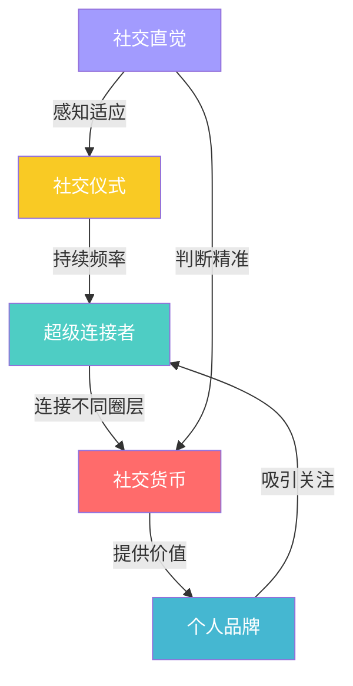

## 七、人脉经营的进阶技巧

掌握了人脉构建、维护、拓展、管理和变现的基本功之后，你需要一套进阶技巧来突破瓶颈。进阶的本质不是认识更多人，而是让你在已有的人脉网络中产生更大的影响力和杠杆效应。

### 7.1 成为"超级连接者"

#### 7.1.1 什么是超级连接者

超级连接者（Super Connector）是社交网络中连接不同圈层的枢纽人物。哈佛大学社会学家尼古拉斯·克里斯塔基斯（Nicholas Christakis）在《大连接》中的研究表明：社交网络中存在"三度影响力"——你朋友的朋友的朋友都会影响你。而超级连接者正是通过跨圈层的连接，让这种影响力倍增。

超级连接者的核心特征不是认识很多人，而是能连接**不同世界的人**。一个只在程序员圈子里认识1000个程序员的人，影响力远不如一个同时连接着程序员、投资人、媒体人和政策制定者的人。

#### 7.1.2 超级连接者的五维能力模型

**维度一：跨领域知识储备**

你不需要成为每个领域的专家，但需要对至少3-5个不同领域有基本认知。这样你才能判断"A领域的某个人"和"B领域的某个人"之间是否存在合作的可能性。

跨领域知识的积累路径：
- 每月阅读1本非本专业的书籍
- 每季度参加1次跨界活动（TED、创业沙龙、艺术展等）
- 关注3-5个不同领域的公众号或播客
- 主动与不同领域的朋友深度交流，了解他们的工作和挑战

**维度二：主动破圈意识**

大多数人的人脉是同质化的——同事的同学、朋友的朋友。超级连接者则会刻意突破圈层边界。

破圈的具体方法：
- **梯度破圈**：先从与自己专业相关的相邻领域开始，逐步向外扩展
- **场景破圈**：选择自己不熟悉的社交场景（行业峰会、公益活动、兴趣社群）
- **角色破圈**：在社交场合中主动扮演"介绍人"角色，而非等待别人来认识你

**维度三：引荐能力**

超级连接者的核心技能是精准引荐——把合适的人介绍给合适的人。

精准引荐的标准流程：
1. 了解双方的背景、需求和目标
2. 判断两人是否有互补价值（不是所有人都值得引荐）
3. 提前征询双方意愿，避免单方面强行介绍
4. 介绍时说明双方的共同点和互补价值
5. 给出一个话题切入点，降低破冰成本
6. 介绍后适度跟进，但不过度介入

**引荐话术模板：**

"张总，我认识一位做AI教育的朋友李明，他们团队刚拿到A轮融资，
正在寻找行业合作资源。您在教育行业多年，我觉得你们可能有很多
共同话题。如果您感兴趣，我可以安排一次线上交流？"

**维度四：多圈子声誉管理**

在不同圈子中建立一致的正面声誉，是超级连接者的长期资产。关键不是在每个圈子都活跃，而是在每个圈子中都有一个清晰的标签——"那个很懂XX的人"或"那个资源很广的人"。

声誉管理要点：
- 在每个圈子中保持至少1个深度贡献（分享、组织、帮助）
- 跨圈子传播正面信息时注意信息筛选，不传八卦
- 当你介绍的人合作成功时，你的声誉会自动增值

**维度五：开放包容的心态**

超级连接者最大的敌人是评判心态。当你对某个人贴上"不值得认识"的标签时，你就关闭了一扇可能很重要的门。保持开放不意味着没有判断力，而是在判断之前先给予了解的机会。

#### 7.1.3 超级连接者的常见误区

| 误区 | 纠正方法 |
|------|----------|
| 追求数量：认识的人越多越好 | 质量优先，深度连接100人比浅层认识1000人更有价值 |
| 滥发名片：每次活动换一堆联系方式 | 活动中深度交流3-5人，活动后跟进1-2人 |
| 功利心太强：只连接对自己有价值的人 | 先提供价值，连接的本质是互惠 |
| 忽视维护：引荐后不管后续 | 定期跟进，确保连接产生实际价值 |
| 过度承诺：随便答应帮人引荐 | 评估后再承诺，保护双方的信任 |

### 7.2 建立"社交仪式"

#### 7.2.1 为什么需要社交仪式

社交仪式是指定期进行的、有固定形式的社交活动。它解决了人脉经营中最大的难题——**持续性**。

大多数人脉经营失败的原因不是方法不对，而是无法坚持。社交仪式通过降低决策成本（固定时间、固定形式、固定参与者），让你不需要每次都"决定"要不要社交，而是变成一种习惯。

行为科学的研究支持这一做法：BJ Fogg的"微习惯"理论表明，将行为绑定到固定的时间和场景，能大幅提升执行率。社交仪式就是人脉经营的"微习惯"。

#### 7.2.2 社交仪式的四种类型

**日频仪式（每天5-10分钟）**
- 早起浏览朋友圈/社交平台，对重要联系人的动态点赞评论
- 回复收到的消息和请求
- 给1位联系人发送有价值的信息（文章、机会、资源）

**周频仪式（每周2-3小时）**
- 固定时间的运动活动（周三晚羽毛球、周六早跑步）
- 周末的小组聚餐或下午茶
- 每周认识1-2个新朋友
- 整理和更新人脉档案

**月频仪式（每月半天-1天）**
- 月度行业沙龙或读书会
- 小型主题聚会（8-12人）
- 人脉经营复盘和策略调整

**季频/年频仪式（每季度/每年1次）**
- 季度大型聚会或团建
- 年度家庭聚会
- 跨圈层交流活动

#### 7.2.3 设计社交仪式的四步法

**第一步：确定核心圈子**

你不可能维护所有关系，必须选择3-5个核心圈子作为社交仪式的重点。

核心圈子的选择标准：
- 与你的职业发展直接相关的圈子
- 能给你带来情感支持的圈子
- 能帮你拓展视野的跨界圈子

**第二步：设计固定形式**

社交仪式的形式要简单、可重复、低决策成本。

成功社交仪式的特征：
- **时间固定**：每周三晚7点、每月第一个周六
- **地点固定**：固定的咖啡馆、固定的运动场地
- **形式简单**：不需要复杂的组织工作
- **人数稳定**：核心成员3-8人，偶尔有新人加入
- **有明确的"锚点"**：可以是读书、运动、吃饭、看电影

**第三步：建立邀请机制**

社交仪式需要稳定的核心成员，也需要适度的新鲜血液。

邀请新人的节奏：
- 核心成员每月邀请1-2位新人参加
- 新人参加2-3次后决定是否成为核心成员
- 核心成员总数控制在8-12人，避免圈子过大

**第四步：保持仪式的活力**

社交仪式最大的风险是变成例行公事、失去活力。

保持活力的方法：
- 每季度引入一个新的小环节（如读书分享、主题讨论）
- 每半年组织一次"特别版"（如户外活动、主题派对）
- 定期收集成员反馈，调整形式和内容

#### 7.2.4 社交仪式的常见问题

**问题1：组织者疲劳**
- 解决方案：轮流担任组织者，或设置"轮值主席"制度
- 使用协作工具（如石墨文档、腾讯文档）分担组织工作

**问题2：参与度下降**
- 解决方案：降低参与门槛（不需要每次都来），增加活动价值（每次都有新收获）
- 建立"出勤积分"机制，给予经常参与者额外权益

**问题3：圈子固化**
- 解决方案：每季度引入1-2位"特邀嘉宾"（不同领域的朋友）
- 组织"跨界之夜"，邀请核心成员的朋友参加

### 7.3 善用"社交货币"

#### 7.3.1 社交货币的本质

社交货币是沃顿商学院教授乔纳·伯杰（Jonah Berger）在《疯传》中提出的概念。在人脉经营的语境下，社交货币是指**能够让你在社交中获得关注、认可和影响力的信息与资源**。

拥有社交货币的人，不需要主动社交——别人会主动来找你。因为和你交流能获得有价值的信息、独特的视角或稀缺的资源。

#### 7.3.2 五种社交货币及其获取方式

**信息货币：独家行业信息**

这是最常见也最有效的社交货币。当你比别人更早知道某个行业趋势、政策变化或市场机会时，你就拥有了信息货币。

获取信息货币的方法：
- 订阅行业报告（如艾瑞咨询、36氪研究院）
- 加入行业协会和精英社群
- 与行业KOL保持联系
- 参加行业峰会和闭门会议
- 阅读英文前沿资讯（比中文媒体快1-3个月）

**故事货币：独特的经历和见解**

好的故事比枯燥的数据更有传播力。当你有独特的经历（创业故事、跨界经历、危机处理）时，你就拥有了故事货币。

积累故事货币的方法：
- 记录自己的关键经历和决策过程
- 提炼经历中的关键洞察和教训
- 用"STAR法则"（情境-任务-行动-结果）结构化你的故事
- 在社交场合中练习讲述，不断打磨

**资源货币：稀缺的资源和机会**

资源货币包括：工作机会、投资机会、合作机会、专家资源等。

积累资源货币的方法：
- 建立"机会库"：记录你遇到的各种机会
- 主动成为资源的"路由器"：A有需求，B有资源，你来连接
- 保护资源来源的隐私，建立信任

**观点货币：独到的见解和判断**

在信息过载的时代，独特的观点比更多信息更有价值。当你能对某个话题提供独到的分析时，你就拥有了观点货币。

培养观点货币的方法：
- 深入研究1-2个领域，形成自己的判断框架
- 定期输出观点（朋友圈、公众号、社群分享）
- 学会用数据和逻辑支撑你的观点
- 敢于提出与主流不同的看法（但要有理有据）

**技能货币：稀缺的专业技能**

当你拥有别人没有的技能时，你就拥有了技能货币。这些技能可以是硬技能（编程、设计、数据分析）或软技能（演讲、写作、谈判）。

积累技能货币的方法：
- 识别市场需求和技能缺口
- 持续学习和精进专业技能
- 在社交场合中展示技能（如帮人分析数据、设计海报）
- 将技能包装成可分享的内容（教程、模板、工具包）

#### 7.3.3 社交货币的使用策略

社交货币不是存起来的，而是要流通的。但流通需要策略：

**先存后取原则**
在使用社交货币之前，先积累足够的"余额"。不要一认识人就索取资源，先主动提供价值。

**精准投放原则**
不同的人对不同类型的社交货币敏感度不同。对投资人投放信息货币（行业趋势），对创业者投放资源货币（合作机会），对年轻人投放故事货币（成长经历）。

**稀缺性原则**
社交货币的价值与稀缺性成正比。不要到处传播同一条信息，选择性地分享给最需要的人。

**及时性原则**
信息货币有保质期。一条独家信息分享得越早，社交货币价值越高。拖延一周后分享，可能已经变成"旧闻"。

#### 7.3.4 社交货币的误区

- **误区一：只有大佬才有社交货币** → 每个人都有独特的经历、技能和信息渠道，关键是识别和积累
- **误区二：社交货币就是炫富/炫资源** → 真正的社交货币是"对别人有用"，不是"让自己显得厉害"
- **误区三：社交货币用了就没了** → 好的社交货币会越用越多，比如你帮人引荐成功，双方都更信任你

### 7.4 掌握"社交直觉"

#### 7.4.1 什么是社交直觉

社交直觉是指在社交场景中快速感知和适应的能力。它让你能在不经过理性分析的情况下，准确判断对方的情绪、意图和需求。

社交直觉不是天生的天赋，而是可以通过刻意练习提升的技能。心理学家丹尼尔·戈尔曼在《情商》中指出：情商的核心就是情绪感知和社交技能，而这两者都可以通过训练提升。

#### 7.4.2 社交直觉的四大能力

**能力一：察言观色——读懂非语言信号**

人类93%的沟通是通过非语言信号传递的（阿尔伯特·梅拉比安的7-38-55法则）。掌握察言观色的能力，你就能读懂对方"没说出口的话"。

需要关注的非语言信号：
- **面部表情**：微表情（持续不到1秒的真实表情）、眼神接触的变化
- **身体语言**：身体朝向、手势、姿态（开放/封闭）
- **声音语调**：语速变化、音量变化、停顿
- **空间距离**：对方是否主动拉近距离或保持距离

练习方法：
- 观看无声视频，尝试判断人物的情绪和关系
- 在社交场合中，花50%的注意力观察对方的非语言信号
- 注意对方语言和非语言信号是否一致（不一致时以非语言信号为准）

**能力二：读懂潜台词——理解真实意图**

很多时候，人们不会直接说出自己的真实想法。读懂潜台词，是社交高手的必备能力。

常见的潜台词类型：

| 对方说的 | 可能的真实意思 |
|----------|----------------|
| "我考虑一下" | 大概率是拒绝，除非你提供了足够吸引力的条件 |
| "有机会合作" | 暂时没有合作的契机，保持联系但不要紧逼 |
| "最近比较忙" | 可能是婉拒，也可能是真的忙，需要根据上下文判断 |
| "这个事情比较复杂" | 可能涉及你不知道的利益关系或障碍 |
| "你说得对，但是..." | 他不同意你的观点，但不想直接反驳 |

读懂潜台词的方法：
- 关注对方的"但是"、"不过"、"其实"等转折词
- 注意对方的犹豫和停顿
- 观察对方的后续行动是否与言辞一致
- 建立对每个人的"语言模式"理解（不同的人表达习惯不同）

**能力三：调整沟通风格——因人而异**

不同的人有不同的沟通偏好。社交直觉强的人能快速判断对方的沟通风格，并相应调整自己的方式。

DISC沟通风格模型：

| 风格 | 特征 | 沟通策略 |
|------|------|----------|
| D（支配型） | 直接、果断、目标导向 | 简洁明了，直接说重点，尊重其决策权 |
| I（影响型） | 热情、乐观、喜欢社交 | 多互动，表达认可，用故事和情感打动 |
| S（稳健型） | 温和、耐心、注重稳定 | 给予充分时间，强调安全和可靠，不要施压 |
| C（谨慎型） | 严谨、分析、追求准确 | 提供数据和证据，逻辑清晰，尊重其分析过程 |

快速判断对方风格的方法：
- D型：语速快，喜欢主导话题，关注结果
- I型：爱笑，喜欢分享故事，关注感受
- S型：语速慢，喜欢倾听，关注关系
- C型：喜欢问细节，关注逻辑，关注质量

**能力四：判断关系走向——预判社交动态**

社交直觉的最高境界是能预判一段关系的发展方向。这需要你对人性、利益和情感有深刻的理解。

判断关系走向的关键指标：
- 双方的需求是否互补
- 双方的价值观是否一致
- 双方的投入是否对等
- 外部环境是否支持关系的发展

#### 7.4.3 提升社交直觉的刻意练习

**练习1：社交复盘**
每次重要社交活动后，花10分钟复盘：
- 对方的关键情绪变化是什么？
- 我是否准确感知了对方的需求？
- 有哪些信号我没有捕捉到？
- 下次遇到类似情况，我应该如何调整？

**练习2：观察练习**
每周花30分钟在公共场所（咖啡馆、地铁、商场）观察人们的互动：
- 推测他们的关系（朋友/同事/情侣）
- 观察他们的沟通模式
- 注意非语言信号

**练习3：反馈收集**
定期向信任的朋友询问：
- 和我交流时，你感觉舒适吗？
- 我有哪些沟通习惯让你不舒服？
- 你觉得我在社交中有哪些盲点？

### 7.5 建立"个人品牌"

#### 7.5.1 个人品牌在人脉经营中的作用

在人脉经营中，个人品牌是你最强大的"被动社交引擎"。当别人在某个领域遇到问题时，能第一时间想到你——这就是个人品牌的威力。

个人品牌解决的核心问题：**让对的人主动找到你，而不是你到处找别人。**

没有个人品牌的人脉经营是"推力模式"——你不断主动出击，效率低且容易给人压力。有个人品牌的人脉经营是"拉力模式"——别人主动来找你，关系建立更自然、更高效。

#### 7.5.2 个人品牌的构建框架

**第一步：明确独特价值主张（UVP）**

你的独特价值主张用一句话概括：你是谁、你做什么、你为什么值得信任。

UVP公式：
我是[身份]，专注于[领域]，帮助[目标人群]解决[具体问题]。

示例：
- "我是一名产品经理，专注于B端SaaS，帮助企业客户提升运营效率。"
- "我是一名数据分析师，专注于电商领域，帮助品牌商家优化投放ROI。"

**第二步：选择品牌传播渠道**

不同渠道适合不同的个人品牌定位：

| 渠道 | 适合类型 | 优势 | 劣势 |
|------|----------|------|------|
| 朋友圈 | 日常社交 | 覆盖现有社交网络 | 内容半衰期短 |
| 公众号 | 深度内容 | 建立专业形象 | 需要持续输出 |
| 知乎 | 专业问答 | 精准触达目标人群 | 需要高质量内容 |
| 小红书 | 生活方式 | 传播力强 | 偏女性用户 |
| 抖音/视频号 | 视频内容 | 覆盖面广 | 制作成本高 |
| 行业社群 | 专业交流 | 精准且深度 | 覆盖面窄 |

**第三步：持续内容输出**

个人品牌的核心是内容输出。你不需要每天发10条朋友圈，但需要保持稳定的输出节奏。

内容输出的频率建议：
- 朋友圈：每天1-2条（有价值的内容，不是流水账）
- 公众号/专栏：每周1-2篇深度文章
- 社群分享：每周1-2次专业见解
- 线下活动：每月1-2次分享或演讲

内容选题的三个方向：
- **专业干货**：分享你的专业知识和经验（占比50%）
- **行业洞察**：分享你对行业趋势的观察和判断（占比30%）
- **个人故事**：分享你的成长经历和反思（占比20%）

**第四步：维护品牌一致性**

个人品牌最忌讳的是"人设崩塌"。保持一致性需要：
- 线上线下形象一致
- 对不同人群的态度一致
- 承诺和行动一致
- 价值观和行为一致

#### 7.5.3 个人品牌的进阶策略

**策略一：打造"标志性内容"**

创造一个能代表你的内容系列或标签：
- 固定栏目的系列文章（如"每周行业观察"）
- 独特的分析框架或方法论
- 特定场景下的标志性表现

**策略二：借势联名**

与同领域或互补领域的人联合产出内容：
- 联合直播或播客
- 联合撰写文章或报告
- 互相推荐和背书

**策略三：从线上到线下**

线上品牌最终要落地到线下关系：
- 将线上互动转化为线下见面
- 在线下活动中强化线上建立的品牌形象
- 通过线下关系反哺线上内容

#### 7.5.4 个人品牌的常见误区

- **误区一：个人品牌就是自我包装** → 个人品牌的本质是真实价值的外化，不是虚假的人设
- **误区二：只有名人才需要个人品牌** → 每个人都有个人品牌，区别只在于是否主动经营
- **误区三：个人品牌一劳永逸** → 个人品牌需要持续维护和更新，否则会被遗忘
- **误区四：个人品牌就是发朋友圈** → 发朋友圈只是手段之一，核心是系统化的内容输出和价值传递
- **误区五：个人品牌和人脉经营无关** → 个人品牌是人脉经营的放大器，能让你的社交效率提升10倍

### 7.6 进阶技巧的整合应用

#### 7.6.1 五项进阶技能的关系

五项进阶技能相互支撑，形成一个正向循环：

- **个人品牌**吸引别人主动找你
- **社交货币**让你能为别人提供价值
- **超级连接者**让你的价值在不同圈层传播
- **社交仪式**保证关系的持续维护
- **社交直觉**让你在每次社交中都能做出最优判断

#### 7.6.2 个人进阶技能评估表

定期评估自己的进阶技能水平，找到短板并有针对性地提升：

| 技能 | 1分（初学） | 3分（熟练） | 5分（精通） | 你的评分 |
|------|------------|------------|------------|----------|
| 超级连接者 | 只在一个圈子活跃 | 在2-3个圈子有影响力 | 跨5+圈层深度连接 | ___ |
| 社交仪式 | 没有固定社交活动 | 有1-2个定期活动 | 有完善的社交仪式体系 | ___ |
| 社交货币 | 很少主动提供价值 | 有1-2种稳定的社交货币 | 有丰富的社交货币储备 | ___ |
| 社交直觉 | 经常误解他人意图 | 大多数情况能准确感知 | 几乎所有场合都能精准判断 | ___ |
| 个人品牌 | 没有明确的品牌定位 | 有基本的品牌形象 | 有系统的品牌经营体系 | ___ |

**评分策略：**
- 总分20+：人脉经营高手，继续精进
- 总分15-19：中等水平，重点提升1-2个短板
- 总分10-14：初级阶段，系统学习和实践
- 总分<10：需要从基础开始，先建立基本的社交习惯

#### 7.6.3 进阶技能的实践路线图

**第1-3个月：建立基础**
- 确定1-2个核心社交圈子
- 设计1个社交仪式（如每周固定运动）
- 梳理自己的社交货币（技能、信息、资源）
- 明确个人品牌定位

**第4-6个月：深化实践**
- 扩展到2-3个圈子
- 增加1-2个社交仪式
- 开始系统化内容输出
- 刻意练习社交直觉

**第7-12个月：突破进阶**
- 成为至少1个圈子的核心连接者
- 建立完善的社交仪式体系
- 形成稳定的社交货币储备
- 个人品牌在目标圈子中建立认知

**第12个月以后：持续精进**
- 跨圈层影响力扩展
- 社交仪式迭代升级
- 社交货币多元化积累
- 个人品牌持续进化
