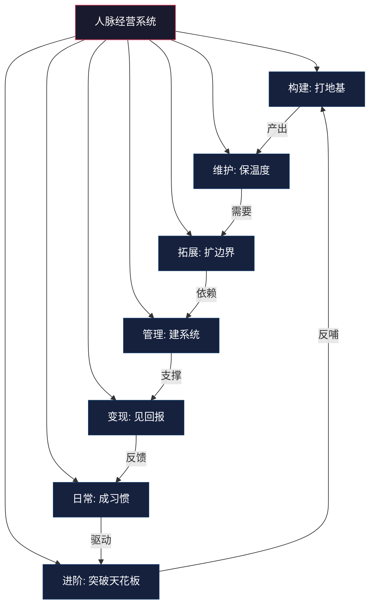
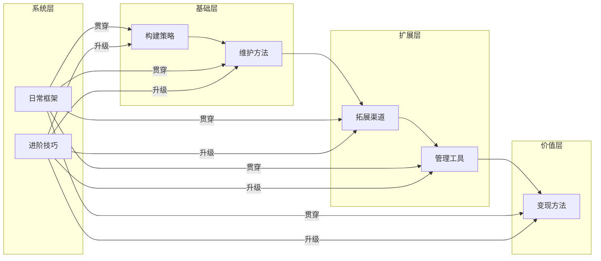

## 本节小结

本节围绕人脉经营的"法与术"，从七个维度构建了一套完整的实操体系。从零开始建立人脉网络，到维护关系持久保鲜；从找到对的渠道拓展人脉，到用系统化工具管理关系；从将人脉转化为实际价值，到建立可执行的日常框架，再到掌握高段位的进阶技巧——这七个板块构成了人脉经营从入门到精通的完整路径。

本节小结不是简单重复前文内容，而是帮助你建立全局视角，理清七个板块之间的逻辑关系，提供自检工具和行动指南，确保你离开这一节时，带着一套可执行的人脉经营系统。

***

### 一、七大板块的核心知识体系

本节七个板块各自回答一个核心问题，形成一条从"建立"到"精通"的完整链路：

| 板块 | 核心问题 | 核心方法 | 关键指标 |
|------|----------|----------|----------|
| 构建策略 | 如何从零开始？ | 弱关系激活、价值定位、社交资产积累 | 新增有效联系人数/月 |
| 维护方法 | 如何让关系保鲜？ | 分层管理、遗忘曲线对抗、定期触达 | 关系活跃率、流失率 |
| 拓展渠道 | 在哪里找到对的人？ | 渠道评估三维度、线上线下组合、精准匹配 | 渠道转化率、人脉质量分 |
| 管理工具 | 如何系统化运营？ | CRM思维、档案建设、提醒系统、定期盘点 | 信息完整度、维护覆盖度 |
| 变现方法 | 如何转化为价值？ | 信息差利用、信任杠杆、五大变现模式 | 变现次数、回报率 |
| 日常框架 | 如何融入生活？ | 日/周/月/季/年五级节奏、时间块分配 | 执行率、习惯化程度 |
| 进阶技巧 | 如何达到高段位？ | 超级连接者、社交仪式、个人品牌 | 影响力半径、主动连接数 |

七个板块不是并列关系，而是螺旋上升的闭环。构建产出新关系，维护保持关系活性，拓展扩大关系边界，管理提升运营效率，变现验证关系价值，日常框架将一切固化为习惯，进阶技巧推动你突破当前层级的天花板——然后回到构建，以更高起点开始新一轮循环。

***

### 二、各板块核心要点精炼

#### 2.1 构建策略：从零到一的起点

构建策略解决了"没有人脉怎么办"这个最普遍的焦虑。核心要点：

**认知层面**：你并非从零开始。家人、同学、同事、邻居都是现成的弱关系种子。弱关系（格兰诺维特理论）才是带来新机会的关键——它们连接着你尚未触及的社交圈层。

**方法层面**：构建有效人脉网络需要三个支点——

1. **价值定位**：明确你能为他人提供什么。信息、技能、资源、情感支持，至少在一个维度上建立你的独特价值
2. **社交资产积累**：每一次帮助他人、分享信息、兑现承诺，都是在存入"社交货币"
3. **系统化拓展**：不是随机社交，而是有目标、有计划、有节奏地扩大网络

**实操层面**：从身边开始，每周有意识地激活2-3个弱关系，通过提供价值而非索取来建立连接。前50个有效联系人最难，之后会呈现指数级增长——这是网络效应的数学本质。

#### 2.2 维护方法：关系保鲜的科学

维护策略回答了"为什么关系会变淡"以及"如何对抗衰减"。

**科学原理**：关系衰减遵循类似遗忘曲线的规律。停止互动1个月内记忆强度保持80%以上，3-6个月降至30%-50%，超过1年则低于10%。这不是"人走茶凉"的道德判断，而是人脑记忆机制的客观规律。

**分层管理**：邓巴层级决定了维护策略必须差异化——

| 层级 | 人数 | 维护频率 | 维护方式 |
|------|------|----------|----------|
| 核心层 | 5人 | 每周 | 深度交流、情感支持、关键时刻在场 |
| 同情层 | 15人 | 每月 | 主动关心、价值分享、定期见面 |
| 友谊层 | 50人 | 每季度 | 节日问候、信息转发、偶尔聚餐 |
| 相识层 | 150人 | 每半年 | 朋友圈互动、群发祝福、关键节点联系 |

**关键原则**：维护不是"多联系"，而是"有效联系"。一次有深度的对话胜过十次无营养的寒暄。提供价值（信息、帮助、情感支持）是关系保鲜的根本动力。

#### 2.3 拓展渠道：找到对的人

拓展策略回答了"去哪里找人"这个实操问题。

**渠道评估三维度**：一个渠道是否值得投入，看三个指标——

- **人群质量**：参与者与你目标画像的匹配度
- **连接深度**：该渠道提供的互动是浅层社交还是深度交流
- **维护成本**：后续维持关系所需的时间和精力投入

**渠道分类**：

| 渠道类型 | 典型场景 | 优势 | 劣势 |
|----------|----------|------|------|
| 行业渠道 | 行业会议、协会、论坛 | 专业度高、信息密度大 | 同质化严重、竞争性强 |
| 学历渠道 | MBA、校友会、同学聚会 | 信任基础好、社会阶层相近 | 覆盖面窄、信息重叠 |
| 兴趣渠道 | 运动俱乐部、读书会、兴趣社群 | 自然连接、情感基础好 | 转化到职业场景需额外步骤 |
| 线上渠道 | LinkedIn、行业社群、知识星球 | 突破地域限制、信息量大 | 关系浅、信任建立慢 |
| 跨界渠道 | 私董会、跨行业沙龙、创业营 | 异质性高、结构洞价值大 | 门槛高、时间成本大 |

**实操建议**：不要试图覆盖所有渠道。根据你当前阶段的需求，选择2-3个主渠道深耕，同时保持1-2个跨界渠道作为"弱关系补给线"。

#### 2.4 管理工具：系统化运营

管理工具回答了"联系人多了怎么办"这个规模化问题。

**核心逻辑**：当联系人超过150人（邓巴数），人脑已无法胜任管理任务。工具不是可选项，而是必需品。

**工具选择矩阵**：

| 联系人规模 | 推荐方案 | 核心功能 |
|------------|----------|----------|
| <100人 | 微信标签+备忘录 | 分组、备注、生日提醒 |
| 100-500人 | Notion/飞书多维表格 | 结构化档案、提醒、标签筛选 |
| 500-2000人 | 专业CRM（如HubSpot免费版） | 自动化跟进、交互记录、Pipeline管理 |
| 2000人以上 | 企业级CRM+助理 | 全流程自动化、团队协作、数据分析 |

**档案模板**：每条人脉记录应包含——基本信息、认识场景、职业背景、核心需求、上次互动时间、下次维护计划、关系层级标签。

**关键习惯**：每次社交活动结束后24小时内更新档案。这是"趁热打铁"——信息最准确、记忆最鲜活的时候。拖延超过3天，信息损失率超过60%。

#### 2.5 变现方法：价值转化

变现策略回答了"人脉有什么用"这个终极问题。

**底层逻辑**：人脉变现的本质是**信息差**和**信任杠杆**。你掌握的信息和你积累的信任，就是可变现的资产。

**五大变现模式**：

| 模式 | 机制 | 典型场景 | 风险等级 |
|------|------|----------|----------|
| 信息变现 | 利用信息差获取价值 | 内推奖金、咨询费、信息服务费 | 低 |
| 资源对接 | 连接供需双方 | 中介费、合作分成、项目撮合 | 中 |
| 能力变现 | 通过人脉获得施展机会 | 被推荐获得职位、项目、客户 | 低 |
| 联合创业 | 与人脉伙伴共同创造 | 合伙创业、联名产品、资源共享 | 高 |
| 平台效应 | 成为网络中心节点 | 社群运营、资源聚合、平台搭建 | 中 |

**伦理边界**：变现的前提是双向价值交换。单方面索取不可持续，过度功利会损害信任。最好的变现是"帮助别人成功的同时实现自己的价值"。

#### 2.6 日常框架：融入生活的节奏

日常框架回答了"每天该怎么做"这个执行问题。

**五级时间节奏**：

| 时间单位 | 投入时间 | 核心动作 | 产出 |
|----------|----------|----------|------|
| 每日 | 30分钟 | 朋友圈互动、主动联系1-2人、回复消息 | 关系温度维持 |
| 每周 | 2-3小时 | 认识2-3个新人、深度交流1-2人、更新档案 | 网络扩展+深化 |
| 每月 | 1天 | 参加活动、组织聚会、回顾效果、调整策略 | 阶段性复盘 |
| 每季度 | 2-3天 | 行业活动、全面盘点、更新计划、跨圈活动 | 战略调整 |
| 每年 | 1周 | 年度目标、年度总结、年度聚会、ROI评估 | 方向校准 |

**关键原则**：固定时间、固定动作、形成习惯。人脉经营不是"想起来才做"的事，而是像健身一样需要持续投入的日常行为。

#### 2.7 进阶技巧：突破天花板

进阶技巧回答了"如何从合格到优秀"这个突破性问题。

**五个进阶方向**：

1. **超级连接者**：连接不同社交网络的人。关键能力是跨领域知识、乐于引荐、在多圈建立声誉
2. **社交仪式**：定期重复的社交活动（月度聚餐、周运动、季度沙龙）。仪式降低决策成本，提供稳定社交频率
3. **社交货币**：让你在社交中获得关注的信息和资源。独家信息、有趣经历、稀缺资源都是社交货币
4. **社交直觉**：快速感知和适应社交场景的能力。察言观色、读懂潜台词、调整沟通风格
5. **个人品牌**：让别人想到某个领域就想到你。明确价值主张、持续内容输出、保持一致性

***

### 三、七大板块的内在关联

七个板块不是割裂的独立模块，而是相互支撑的有机系统。理解它们的关联，才能避免"只练一招"的片面性。

**关键关联**：

- **构建是维护的前置条件**：没有构建就没有维护的对象。但构建的质量（连接深度）决定了维护的成本——深度连接的维护成本远低于浅层社交
- **拓展依赖管理**：当联系人超过150人，没有系统化管理，拓展就变成了"狗熊掰棒子"——掰一个丢一个
- **管理支撑变现**：只有当你的关系信息是结构化的、可检索的，才能在需要时快速找到"对的人"。一个混乱的通讯录无法支撑高效变现
- **日常框架是粘合剂**：它将前五个板块的动作固化为习惯，避免"学了很多道理却依然经营不好人脉"的困境
- **进阶是量变到质变**：当基础动作已经内化为习惯，进阶技巧推动你从"人脉经营者"升级为"人脉节点"——从被动维护关系到主动创造连接

***

### 四、自检清单：你的人脉经营系统是否完整？

对照以下清单，检查你在七个维度上的完成度。每个维度满分5分，总分35分。

#### 4.1 构建维度自检

- [ ] 我有明确的个人价值定位，知道自己能为他人提供什么
- [ ] 我每周有意识地激活2-3个弱关系
- [ ] 我的社交目标不是"认识更多人"，而是"连接对的人"
- [ ] 我在社交中优先提供价值而非索取
- [ ] 我理解网络效应的非线性增长规律，不急于求成

#### 4.2 维护维度自检

- [ ] 我的联系人有明确的分层（核心/同情/友谊/相识）
- [ ] 每个层级有对应的维护频率和方式
- [ ] 我的维护不只是寒暄，而是提供真正的价值
- [ ] 我知道哪些关系正在"衰减"并有应对措施
- [ ] 我有至少3种维护关系的"自然触点"（生日、节日、行业事件）

#### 4.3 拓展维度自检

- [ ] 我有2-3个深耕的主要渠道
- [ ] 我有至少1个跨界渠道作为弱关系补给
- [ ] 我选择渠道时考虑了人群质量、连接深度、维护成本三个维度
- [ ] 我的渠道组合覆盖了线上和线下
- [ ] 我定期评估渠道效果并做调整

#### 4.4 管理维度自检

- [ ] 我使用了某种系统化工具管理联系人（不限于专业CRM）
- [ ] 每条重要联系人有基本信息、职业背景、核心需求的记录
- [ ] 我有定期维护提醒机制（生日、季度跟进等）
- [ ] 社交活动后24小时内更新档案
- [ ] 每季度进行一次人脉盘点

#### 4.5 变现维度自检

- [ ] 我清楚自己人脉网络中的信息差和信任杠杆
- [ ] 我至少尝试过一种变现模式
- [ ] 我的变现行为是双向价值交换，不是单方面索取
- [ ] 我了解变现的伦理边界，不会为短期利益损害长期关系
- [ ] 我有记录变现效果并持续优化

#### 4.6 日常框架自检

- [ ] 每日30分钟的社交维护已成为习惯
- [ ] 每周有固定时间用于社交拓展和深度交流
- [ ] 每月有回顾和调整的固定时间
- [ ] 每季度有战略层面的人脉盘点
- [ ] 我的人脉经营不是"想起来才做"，而是有节奏的日常

#### 4.7 进阶维度自检

- [ ] 我在至少2个不同圈子中建立了声誉
- [ ] 我有固定的社交仪式（定期聚餐、运动、沙龙等）
- [ ] 我有意识地积累社交货币（独家信息、有趣经历、稀缺资源）
- [ ] 我在社交场景中能快速感知氛围并调整策略
- [ ] 我有清晰的个人品牌定位

**评分标准**：

| 总分 | 等级 | 解读 |
|------|------|------|
| 0-10分 | 入门期 | 刚刚建立认知，需要从基础板块开始系统学习 |
| 11-18分 | 成长期 | 已有基础框架，需要在薄弱环节重点突破 |
| 19-25分 | 成熟期 | 系统基本成型，需要在深度和一致性上下功夫 |
| 26-35分 | 精通期 | 系统运转良好，可以向"超级连接者"方向进化 |

***

### 五、从本节到行动：三个层级的启动方案

如果你读完七个板块后不知道从哪里开始，以下三个层级的启动方案可以帮你快速行动。

#### 5.1 最小可行方案（适合入门期，每日15分钟）

如果你目前几乎没有系统化的人脉经营习惯，从最小动作开始：

1. **今天**：在通讯录中选出5个你觉得"应该联系但一直没联系"的人，给他们发一条有价值的信息（不是"在吗"，而是"看到这篇文章想到你，觉得对你有帮助"）
2. **本周**：用Excel或Notion建一个简单的联系人表格，字段只需要：姓名、职业、上次联系时间、下次维护时间
3. **本月**：参加1次线下活动，认识3个新朋友，并在24小时内更新到表格中

#### 5.2 标准方案（适合成长期，每日30分钟）

如果你已有基本框架，需要补齐短板：

1. **每日**：固定30分钟社交维护时间（建议早上或午休），按"回复消息→主动触达→朋友圈互动"的顺序执行
2. **每周**：安排1次深度对话（线上或线下），对象从"同情层"和"友谊层"中选择
3. **每月**：进行1次人脉盘点，检查各层级维护频率是否达标，更新关系状态
4. **工具**：选择一个管理工具（Notion/飞书/专业CRM），将核心联系人信息迁移过去

#### 5.3 高级方案（适合成熟期，系统化运营）

如果你的基础扎实，需要突破瓶颈：

1. **建立社交仪式**：每月固定1次小型聚会（4-6人），每季度1次跨圈子活动
2. **打造个人品牌**：选择1个垂直领域，通过内容输出（公众号/知乎/播客）建立专业形象
3. **成为超级连接者**：有意识地连接不同圈子的人，在每次引荐中积累"连接者"声誉
4. **量化评估**：建立人脉经营KPI体系，追踪新增联系数、关系活跃率、变现回报率等关键指标
5. **年度复盘**：每年花1周时间全面评估人脉网络的健康度，制定下一年的战略方向

***

### 六、常见执行陷阱与应对

在将本节知识转化为行动的过程中，以下陷阱最容易让人半途而废：

#### 陷阱一：完美主义瘫痪

**表现**："等我准备好了再开始"——工具没选好不动、模板没设计完不动、人脉档案没整理完不动。

**应对**：记住"最小可行方案"原则。一个Excel表格就是够用的CRM，一条真诚的消息就是有效的人脉维护。先动起来，在行动中迭代优化。

#### 陷阱二：全维度同时推进

**表现**：读完七个板块后，试图同时在所有维度发力，结果精力分散、每个维度都浅尝辄止。

**应对**：找到你当前最薄弱的1-2个维度集中突破。用自检清单定位短板，先补齐短板再全面发展。人脉经营是长期工程，不需要也不可能一步到位。

#### 陷阱三：重构建轻维护

**表现**：热衷于参加活动、认识新朋友，但对已有关系疏于维护。通讯录越来越大，但"僵尸联系人"也越来越多。

**应对**：维护的优先级永远高于构建。一个维护良好的100人网络，价值远大于一个无人维护的1000人网络。记住关系衰减曲线——不维护的关系会在一年内冻结。

#### 陷阱四：功利心过重

**表现**：每次社交都带着明确的"变现目标"，让人感到被利用。短期可能有效，长期必然损害信任。

**应对**：人脉经营的核心是"先给予后索取"。每一次社交活动前问自己："我能为对方提供什么价值？"而不是"我能从对方那里得到什么？"信任是变现的基础，而信任只能通过持续的价值提供来积累。

#### 陷阱五：忽视工具的力量

**表现**：觉得"人脉经营靠感觉就行"，拒绝使用任何工具。当联系人超过200人后，信息混乱、维护遗漏、关键时刻找不到人。

**应对**：工具不是为了"显得专业"，而是为了释放认知资源。把记忆和提醒交给工具，把真诚和深度留给每一次人际互动。从一个简单的电子表格开始，比什么都强。

***

### 七、本节核心公式

将人脉经营系统浓缩为一个可执行的核心公式：

> **人脉价值 = (网络规模 × 关系深度 × 连接多样性) ÷ 维护成本**

- **网络规模**：你能调动的联系人总数（构建+拓展的结果）
- **关系深度**：每段关系的信任程度和可调动性（维护的结果）
- **连接多样性**：你的网络覆盖了多少不同的圈层和领域（拓展+进阶的结果）
- **维护成本**：维持网络运转所需的时间和精力（管理工具+日常框架的目标是最小化这个值）

自检清单中的七个维度，本质上都是在优化这个公式的某个变量。当你在所有维度上都达到"成熟期"水平时，你的人脉网络就具备了自我生长的能力——新关系会自然涌入，老关系会自动维护，价值交换会自发发生。

这就是人脉经营的终极目标：**从"经营人脉"到"人脉自动运转"**。

***
