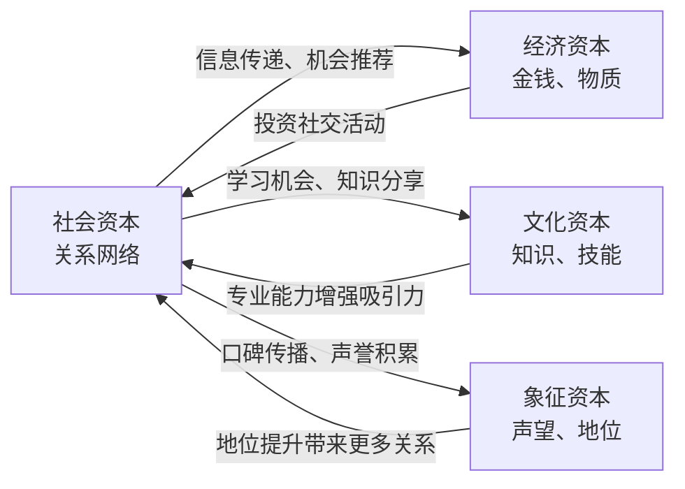
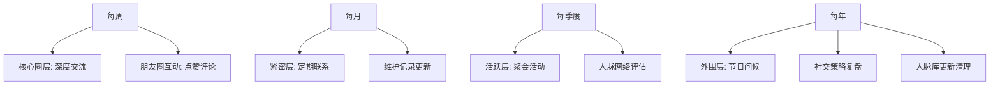
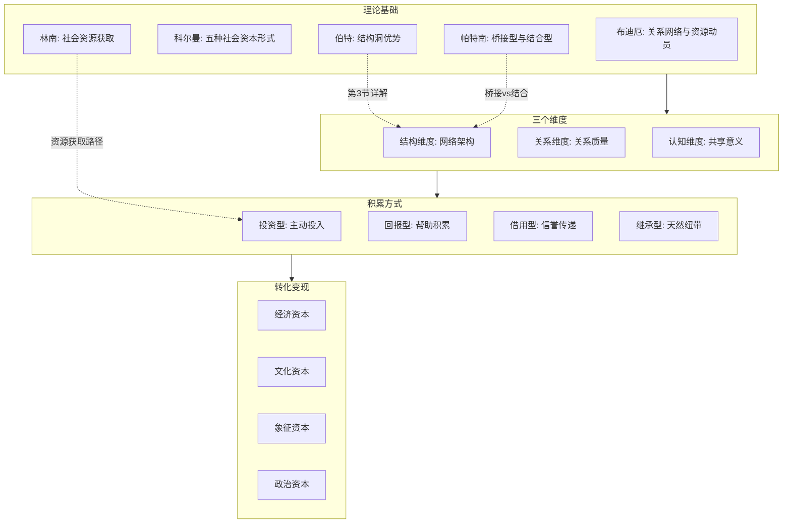

## 一、社会资本理论（Social Capital Theory）

社会资本理论是人脉经营的理论基石。它回答了一个根本问题：**为什么有些人总能获得机会、资源和支持，而有些人即使能力相当却处处碰壁？** 答案不在于个人能力的差异，而在于他们所嵌入的社会关系网络的差异。理解社会资本理论，是系统化人脉经营的第一步。

### 1.1 什么是社会资本？

#### 1.1.1 定义与核心内涵

社会资本是指个体或群体通过社会关系网络所获得的**实际和潜在资源的总和**。这一概念最早由法国社会学家皮埃尔·布迪厄（Pierre Bourdieu）在20世纪80年代系统化提出，后经詹姆斯·科尔曼（James Coleman）、罗伯特·帕特南（Robert Putnam）、林南（Nan Lin）等学者的进一步发展，成为社会科学的核心概念之一。

更精确地说，社会资本包含三层含义：

1. **资源本身**：嵌入在社会关系中的信息、影响力、信任、支持等
2. **获取资源的渠道**：社会关系网络作为资源流通的管道
3. **动员资源的能力**：个体激活和使用这些关系资源的能力

与物质资本（金钱、设备）和人力资本（知识、技能）不同，社会资本存在于人与人之间的关系之中。你无法把它装进口袋，但它在关键时刻能为你打开无数扇门。用一个比喻来说：人力资本是你自身的"硬件配置"，社会资本是你接入的"网络带宽"——再强的配置，没有网络也只是一个孤岛。

#### 1.1.2 社会资本的核心特征

| 特征 | 含义 | 实际表现 |
|------|------|----------|
| **关系嵌入性** | 社会资本存在于关系之中，而非个体内部 | 你不能独自拥有社会资本，它必须通过与他人的互动才能产生和维持。断绝所有社会关系，社会资本归零 |
| **可再生性** | 社会资本在使用中不仅不会减少，反而可能增加 | 你帮助了一个人解决难题，你们之间的信任加深了，你的社会资本反而增长了。这与物质资本的"用一点少一点"截然不同 |
| **互惠性** | 社会资本的运作依赖于互惠规范 | 人们愿意帮助你，因为期望未来得到回报——不一定是你直接回报，可能是整个社交网络的互惠机制在起作用 |
| **可转化性** | 社会资本可以转化为其他形式的资本 | 人脉带来商业机会（经济资本）、学习机会（文化资本）、声誉认可（象征资本） |
| **累积性** | 社会资本具有"复利效应" | 早期的社交投资会随时间增值，拥有越多越容易获得更多（马太效应） |
| **不可转让性** | 社会资本无法像金钱一样直接转让 | 你不能把你的"朋友圈"送给别人，但可以为他人引荐和背书 |

#### 1.1.3 社会资本与其他资本的关系

布迪厄提出资本的三种基本形态，理解它们之间的关系有助于全面把握社会资本的定位：

三种资本之间的转化不是自动发生的，需要特定条件和策略。例如，一个技术专家（高人力资本）如果不懂得社交经营，其人力资本无法有效转化为经济资本——因为没有人知道你的能力，机会就不会来找你。反之，一个社交达人（高社会资本）如果缺乏实际能力，社会资本也会随着时间贬值。

### 1.2 社会资本的主要理论流派

#### 1.2.1 布迪厄的关系主义视角

皮埃尔·布迪厄（Pierre Bourdieu, 1930-2002）是最早系统论述社会资本的学者之一。在1986年发表的《资本的形式》（The Forms of Capital）中，他将社会资本定义为：

> "实际或潜在资源的集合体，它们与由相互默认或承认的关系所组成的持久网络有关。"

布迪厄的理论强调两个核心要素：

**（1）网络关系的规模与质量**

个体所拥有的社会关系网络的大小和质量直接决定了社会资本的总量。但布迪厄特别指出，网络规模并非越大越好——**网络的质量比数量更重要**。一个由10位行业领袖组成的紧密网络，其社会资本可能远超由1000个泛泛之交组成的松散网络。

**（2）资源动员能力**

拥有关系网络是一回事，能够实际调用网络中的资源是另一回事。布迪厄区分了两种社会资本状态：

- **潜在状态**：你认识某个人，但从未向他寻求过帮助
- **激活状态**：你已经在实际调用这段关系来获取资源

从潜在到激活需要满足三个条件：**知道谁有什么资源**（信息）、**能够联系到对方**（渠道）、**对方愿意帮你**（意愿）。

**布迪厄的关键洞察：社会资本的不平等性**

布迪厄特别指出，社会资本不是天然平等的——社会地位越高的人，越容易积累更多的社会资本。原因有三：

1. 高地位者的社交网络本身就包含更多高资源个体
2. 高地位者有更多机会接触高端社交场合（俱乐部、商会、校友会）
3. 人们对高地位者有天然的亲近意愿（光环效应）

这意味着不同阶层的人在社会资本积累上存在先天差距。对于普通人而言，理解这一点不是为了自我设限，而是为了制定更有针对性的策略——找到那些能以小博大的杠杆点。

#### 1.2.2 科尔曼的理性选择视角

詹姆斯·科尔曼（James Coleman, 1926-1995）从理性选择理论出发，在《社会理论的基础》（Foundations of Social Theory, 1990）中将社会资本定义为"个人拥有的社会结构资源"。他识别了社会资本的五种主要形式：

**（1）义务与期望（Obligations and Expectations）**

当你帮助了别人，对方就欠你一个人情，这构成了一种可兑换的社会资本。科尔曼用"赊账单"（slip of paper）来比喻：你帮助他人时获得了一张"赊账单"，未来可以在需要时"兑现"。

这个机制的前提是**信任环境**——只有在信任对方也会遵守互惠规范的环境中，"赊账单"才有价值。在一个充满欺骗的环境中，"赊账单"一文不值。

**（2）信息渠道（Information Channels）**

社会关系网络是获取信息的重要渠道。科尔曼指出，很多有价值的信息（如工作机会、商业线索、行业动态）并非通过正式渠道传播，而是通过非正式的人际网络流通。这与格兰诺维特的弱关系理论高度一致——很多关键信息恰恰来自不太亲密的弱关系。

**（3）规范与有效惩罚（Norms and Effective Sanctions）**

社会网络中的规范能够约束成员行为，降低交易成本。例如，在一个紧密的行业圈子里，如果有人违背承诺，消息会迅速传开，违背者的声誉会受损。这种"社区声誉机制"使得成员倾向于遵守规范，从而降低了交易中的风险和监督成本。

**（4）权威关系（Authority Relations）**

在某些社会结构中，个体赋予他人决策权，形成权威关系。例如，企业中的上下级关系、行业协会中的领导结构等。权威关系是一种特殊的社会资本，它能够协调集体行动，提高组织效率。

**（5）多功能社会组织（Appropriable Social Organizations）**

各种社会组织本身就是社会资本的载体。一个社区协会、一个校友会、一个行业商会，它们建立之初可能是为了特定目的（如社区治理、校友联络），但其产生的社会关系可以被"挪用"到其他目的上——比如通过校友关系找到商业合作伙伴。

**科尔曼的重要发现：社会资本的公共品性质**

科尔曼指出，社会资本不仅仅对建立者有益，对整个群体都有溢出效应。一个拥有丰富社会资本的社区，其成员普遍受益——信息流通更顺畅、合作更容易、问题解决更快。这也意味着，**你在建设自己社会资本的同时，也在为整个网络创造价值**。

#### 1.2.3 帕特南的社区主义视角

罗伯特·帕特南（Robert Putnam, 1941-）将社会资本的概念从个体层面提升到社区和国家层面。他的代表作《独自打保龄》（Bowling Alone, 2000）记录了美国社会资本在过去几十年中的衰退，并分析了其对民主治理和社会福祉的影响。

帕特南的核心论点是：美国社会的社团参与（保龄球联赛、家长会、教堂活动、志愿服务等）在过去几十年中急剧下降，导致了社会资本的衰退，进而影响了社区凝聚力、政治参与和社会信任。

**两种类型的社会资本：**

| 类型 | 桥接型社会资本（Bridging） | 结合型社会资本（Bonding） |
|------|---------------------------|---------------------------|
| **关系性质** | 弱关系为主 | 强关系为主 |
| **群体特征** | 不同群体之间的连接 | 同质群体内部的紧密联系 |
| **开放性** | 开放、包容 | 排他、紧密 |
| **典型例子** | 跨行业社交网络、多元社区组织、国际会议 | 家族网络、同乡会、宗教团体、亲密朋友圈 |
| **优势** | 信息多样性、创新、跨界机会 | 信任、情感支持、内部互助 |
| **风险** | 关系浅、信任度低 | 信息同质化、群体思维、排外 |
| **比喻** | "桥梁"——连接不同岛屿 | "粘合剂"——强化岛屿内部 |

**关键洞见：健康的社会资本需要两种类型的平衡。** 只有桥接型社会资本，你会拥有很多浅层关系，缺乏深度信任；只有结合型社会资本，你会困在信息茧房中，缺乏跨界视野和创新机会。

#### 1.2.4 林南的社会资源理论

林南（Nan Lin, 1938-）是社会资本理论在个体层面应用的最重要学者。他在《社会资本：关于社会结构与行动的理论》（Social Capital: A Theory of Social Structure and Action, 2001）中提出了**社会资源理论**，专注于回答一个核心问题：**个体如何通过社会关系获取嵌入在社会结构中的资源？**

林南提出了三个核心命题：

**（1）社会资源命题（Social Resources Proposition）**

行动者的社会资本与其所接触的网络成员的社会地位正相关。换句话说，你认识的人的地位越高，你能获取的社会资源越多。但这并不意味着你只能结交"大人物"——关键在于你网络中是否有人能**桥接**到高地位节点。

**（2）地位强度命题（The Strength of Position Proposition）**

初始位置（出身）越好，社会资本越丰富。这一点与布迪厄的观点一致。但林南补充了一个重要的调节变量：**关系的强弱**。强关系提供更多的情感支持和信任，弱关系提供更多的信息和跨界机会。

**（3）社会资本的运作机制：接触与动员**

林南区分了社会资本的两个阶段：

- **接触（Access）**：你所认识的人拥有什么资源？你是否知道他们的能力和资源？
- **动员（Mobilization）**：在实际需要时，你能否真正调用这些资源？

很多人有大量的"接触型"社会资本——认识很多人、有很多微信好友——但"动员型"社会资本很有限。当你真正需要帮助时，能够调动的关系寥寥无几。**人脉经营的核心，就是将更多的"接触型"社会资本转化为"动员型"社会资本。**

#### 1.2.5 伯特的结构洞理论（简述）

罗纳德·伯特（Ronald Burt）的结构洞理论将在本章第三节详细展开，这里只做简要概述。伯特提出，**在一个社交网络中，如果A认识B和C，但B和C互不认识，那么B和C之间就存在一个"结构洞"。** 占据结构洞位置的人（A）拥有两种独特优势：

- **信息优势**：A能获得来自B和C两个不同群体的信息，而B和C各自只能获得本群体的信息
- **控制优势**：A可以决定是否让B和C建立联系，以及如何传递信息

这个理论的实践含义是：**不要只在自己的圈子里深耕，更要成为不同圈子之间的桥梁。** 桥梁位置带来的社会资本回报，往往远超在单一圈子内投入的回报。

### 1.3 社会资本的三个维度

社会资本不是一个单一的概念，而是由三个相互关联的维度组成。理解这三个维度，有助于诊断你当前社会资本的状况，并制定有针对性的提升策略。

#### 1.3.1 结构维度（Structural Dimension）

结构维度描述的是社会关系网络的**整体架构**——不是关系的质量，而是关系的模式和布局。

**（1）网络密度（Network Density）**

网络密度衡量你的社交网络中的人彼此之间是否也相互认识。

- **高密度网络**（圈子里的人彼此都认识）：有利于信任建立和规范执行，因为信息透明度高、声誉约束强。但缺点是信息同质化严重——你从A和B获得的信息可能高度相似。
- **低密度网络**（圈子里的人彼此不太认识）：有利于获取多样化信息，因为不同的人连接到不同的信息源。但缺点是信任建立较慢、合作成本较高。

**实践启示**：理想状态是拥有**多层次的网络密度**——核心圈层（信任者网络）保持高密度以确保深度信任，外围圈层保持低密度以获取多样化信息。

**（2）网络范围（Network Range）**

你的社交网络覆盖的地域、行业、阶层范围有多广。

- 一个只有本地朋友的人，其社会资本的地理范围很窄
- 一个跨行业、跨地域、跨阶层的人，其社会资本的范围很广

**网络范围越广，获取异质信息的能力越强。** 这解释了为什么经历过多个行业、多个城市的人，往往比一直在同一个地方做同一份工作的人更能发现跨界机会。

**（3）网络位置（Network Position）**

你在网络中处于什么位置？社会网络分析识别了几种关键位置：

| 位置类型 | 特征 | 社会资本优势 | 典型角色 |
|----------|------|-------------|----------|
| **中心位置** | 被大量节点连接 | 信息量大、影响力强 | 团队核心、社群领袖 |
| **桥梁位置** | 连接两个不重叠的网络 | 信息多样性、控制力 | 跨部门协调人、行业联络人 |
| **边缘位置** | 连接很少 | 信息少、影响力弱 | 新人、旁观者 |
| **守门人位置** | 控制信息流入流出的通道 | 信息筛选、资源分配 | 资源分配者、信息枢纽 |

**关键洞察**：不一定需要成为网络的中心，成为**桥梁**同样甚至更有价值。中心节点获得的信息往往同质化，桥梁节点获得的信息更具多样性和创新性。

**（4）网络层级（Network Hierarchy）**

网络中是否存在等级结构，以及你在等级中的位置。层级明显的网络（如传统企业）中，社会资本的获取很大程度上取决于你在等级中的位置。层级扁平的网络（如开源社区）中，社会资本更多取决于你的贡献和声望。

#### 1.3.2 关系维度（Relational Dimension）

关系维度描述的是个体之间关系的**性质和质量**——不是你认识多少人，而是你与他们的关系有多深、多真。

**（1）信任（Trust）**

信任是社会资本的核心要素。没有信任就没有有效的合作。信任可以分为三个层次：

- **认知信任**（Cognitive Trust）：基于对方的能力和可靠性产生的信任。"我相信你有能力做到你说的事"
- **情感信任**（Affective Trust）：基于情感连接和关怀产生的信任。"我相信你是真心为我好"
- **制度信任**（Institutional Trust）：基于共同规则和制度产生的信任。"我相信即使你不想遵守，制度也会约束你"

**信任的建立需要时间，但破坏只需要一瞬间。** 一次背信弃义的行为可能摧毁多年积累的信任资本。这意味着社会资本的维护成本远高于建设成本。

**（2）规范（Norms）**

共同遵守的行为准则。有效的社会规范能够：

- 降低交易成本：不需要每次都签合同、定条款
- 提高合作效率：大家知道该怎么做、不该怎么做
- 减少机会主义行为：违背规范的人会受到社区惩罚

**（3）义务（Obligations）**

相互之间的义务感和责任感。当你帮助了别人，你就积累了一种"社会信用"。这种信用不是精确计量的，但双方心里都有大致的"账本"。过度计较每一笔"账"反而会破坏关系——因为这把情感关系变成了交易关系。

**（4）认同（Identity）**

共同的身份认同能够增强群体凝聚力。校友、同乡、同行、同好——这些共同身份标签是社会资本的快速启动器。即使从未见过面，一个"校友"标签就能瞬间拉近两个人的距离。

**（5）情感（Emotion）**

关系中的情感投入和回报。情感连接越深，关系越稳固。纯粹功利性的社交关系（"有用就联系，没用就消失"）是脆弱的，因为对方也能感受到这种功利性，从而降低对你的信任和投入。

#### 1.3.3 认知维度（Cognitive Dimension）

认知维度描述的是关系双方**共享的语言、符号、叙事和意义系统**。这是社会资本中最容易被忽视的维度，但它对沟通效率和合作深度有着至关重要的影响。

**（1）共同语言（Shared Language）**

不仅仅是自然语言（中文/英文），更重要的是行业术语、专业概念、表达习惯的共同理解。例如：

- 两个程序员说"这个方案有技术债"，彼此立刻理解
- 两个投资人说"这个赛道的PMF还没验证"，无需额外解释
- 两个医生说"患者主诉胸闷，心电图ST段抬高"，信息精确传递

**共同语言越多，沟通效率越高，合作成本越低。** 这也是为什么行业会议如此重要——它不仅让你认识人，更让你和这些人建立共同的专业语言。

**（2）共同愿景（Shared Vision）**

对未来发展方向的共识。共同愿景能够激发群体的行动力，让成员为了共同目标而协作。一个创业团队如果有强烈的共同愿景，其社会资本的价值远超一个没有共同目标的"人脉群"。

**（3）共同价值观（Shared Values）**

行为准则和价值判断的一致性。共同价值观是长期合作的基础。如果你和合作伙伴在基本价值观上存在根本分歧（如诚信观、利益观），合作注定难以持久。

**（4）共同叙事（Shared Narrative）**

共同的历史记忆和故事。共同叙事增强了群体认同感。校友之间的"在那个食堂吃了四年"、战友之间的"一起扛过枪"、同事之间的"一起加过那个大项目"——这些共同经历构成了独特的叙事资本，是关系深化的催化剂。

**认知维度的实践启示**：这就是为什么"圈子"在人脉经营中如此重要——**圈子本质上就是一个拥有高认知同质性的群体**。加入一个好的圈子，你就自动获得了一套共同语言、共同价值观和共同叙事。

### 1.4 社会资本的积累方式

社会资本不是天生的，它需要有意识的建设和积累。根据积累策略的不同，可以分为四种主要方式。

#### 1.4.1 投资型积累

主动投入时间、精力和资源来建立和维护社交关系。这是最常见的社会资本积累方式。

**具体策略：**

- **参加行业会议和社交活动**：不只是"到场"，而是带着明确的社交目标——今天要认识3个新朋友，和2个老朋友深入交流
- **主动帮助他人解决问题**：不要等到别人开口求助，主动发现他人的需求并提供帮助。最好的帮助是"你刚好需要，我刚好擅长"
- **定期维护人脉关系**：建立定期联系机制——每月一次电话、每季度一次见面、每年一次深度交流
- **参与社群活动**：加入行业社群、兴趣社群、志愿者社群，在共同行动中建立关系

**投资型积累的关键是持续性和真诚性。** 一次性的社交活动效果有限，只有持续的、真诚的投入才能建立稳固的社会资本。切忌"临时抱佛脚"式的社交——需要帮助时才联系别人，不需要时就消失。这不仅无法积累社会资本，反而会消耗已有的社会资本。

#### 1.4.2 回报型积累

通过帮助他人积累"社交信用"，在未来需要时获得回报。这是一种长期投资，回报通常不是即时的，但往往超出预期。

回报型积累的运作机制是社会心理学中的**互惠规范**（Norm of Reciprocity）——人类有一种强烈的倾向，要回报他人给予的好处。罗伯特·西奥迪尼（Robert Cialdini）在《影响力》中将互惠原则列为影响人类行为的六大原则之一，并用大量实验证明了它的普遍性和强大力量。

**回报型积累的操作原则：**

1. **不求即时回报**：帮助他人时不要想着"我帮了你，你也要帮我"。把每次帮助当作对关系的投资，而非交易
2. **提供超出预期的价值**：不只做份内的事，而是提供对方没想到但确实需要的帮助
3. **帮助值得帮助的人**：不是所有人都值得你投入社会资本。选择那些有感恩之心、有能力回报、价值观一致的人
4. **做"不可替代"的帮助**：提供的帮助越是你独有的、别人难以替代的，积累的社交信用越多

#### 1.4.3 借用型积累

通过已有的社会关系网络，借用他人的社交资本。例如，请朋友介绍你认识某个行业的专家，这就是在借用朋友的社交资本。

借用型积累的核心机制是**信誉传递**。当你通过朋友A介绍认识了B，A实际上在用自己的信誉为你背书："我认为这个人值得你认识，我的判断你可以信任。"

**借用型积累的操作原则：**

1. **选对"中间人"**：中间人与目标对象的关系越深，介绍的可信度越高
2. **降低中间人的风险**：让中间人知道你不会让他丢面子。提前告知你的目的、展示你的能力、承诺不会给中间人添麻烦
3. **珍惜信誉传递**：如果你表现不佳，损害的不仅是你与新认识的人的关系，更是你与中间人的关系。一次糟糕的引荐可能让中间人再也不愿意帮你介绍
4. **及时回馈中间人**：介绍成功后，记得向中间人表示感谢。如果介绍带来了实际价值，也要与中间人分享

#### 1.4.4 继承型积累

有些社会资本是"继承"来的——家庭背景、校友网络、同乡关系、行业世家等。继承型积累的优势在于起点高、信任基础好，但也有明显局限性：网络范围往往受限于特定群体。

**继承型社会资本的运用策略：**

1. **善用但不依赖**：继承型社会资本是好的起点，但不能成为唯一的社会资本来源
2. **超越继承的边界**：在继承型社会资本的基础上，主动拓展到新的领域和群体
3. **维护并增值**：继承型社会资本也需要维护，不能坐吃山空。积极参与校友活动、维护家族关系、传承社区纽带
4. **创造新的"可继承"资本**：为下一代（你的孩子、你的学生、你的团队成员）创造可继承的社会资本

### 1.5 社会资本的转化与变现

社会资本可以转化为多种形式的实际收益，但转化不是自动发生的——它需要策略、时机和技巧。

#### 1.5.1 四种转化方向

| 转化方向 | 转化内容 | 具体示例 | 关键转化机制 |
|----------|----------|----------|-------------|
| **→ 经济资本** | 人脉带来金钱和商业价值 | 通过前同事获得内推职位、通过行业朋友获得客户资源、通过投资人获得融资 | 信息传递、信任背书、资源对接 |
| **→ 文化资本** | 人脉带来知识和技能 | 通过导师获得行业洞察、通过同行获得最佳实践、通过跨界朋友获得新视角 | 知识分享、学习机会、视野拓展 |
| **→ 象征资本** | 人脉带来声誉和地位 | 通过大佬推荐获得行业认可、通过媒体朋友获得报道、通过合作伙伴获得品牌背书 | 口碑传播、推荐引荐、品牌背书 |
| **→ 政治资本** | 人脉带来权力和影响力 | 通过联盟获得话语权、通过资源整合获得决策权、通过人脉网络获得支持 | 资源整合、联盟构建、利益交换 |

#### 1.5.2 社会资本转化的四个条件

社会资本的转化不是想转就能转的，需要满足以下条件：

**条件一：信任基础**

没有信任，转化就无法发生。没有人会把一个不信任的人推荐给自己的重要客户或合作伙伴。信任是社会资本转化的"硬通货"——你拥有的信任越深，可转化的范围越广。

**条件二：价值对等**

双方需要感受到价值的对等交换。注意，这里的"对等"不是精确计量，而是双方心理上的大致平衡。如果你总是索取而从不付出，关系会迅速消耗殆尽。同样，如果你总是付出而从不索取，关系也会变得不健康——对方可能觉得亏欠你，从而减少与你的互动。

**条件三：时机匹配**

需要在合适的时机提出合适的请求。同一个请求，在对方心情好、时间充裕、能力允许时提出，成功率远高于在对方压力大、时间紧时提出。**读懂时机是一种重要的社交智慧。**

**条件四：关系深度**

关系越深，转化的可能性越大。浅层关系很难转化为深度价值——你不会把一个刚认识的人推荐给你的核心客户。**转化的深度与关系的深度成正比。**

#### 1.5.3 从"认识"到"变现"的五步转化模型

大多数人的人脉问题出在前三步：认识很多人（第一步），但没有深入交流（第二步），不了解对方的能力和需求（第三步），因此永远无法到达信任和变现的阶段。

### 1.6 社会资本的"马太效应"

社会资本存在明显的**"马太效应"**（Matthew Effect）——"凡有的，还要加倍给他；没有的，连他所有的也要夺过来。"拥有越多社交资本的人，越容易获得更多的社交资本。

**马太效应的四个驱动机制：**

**机制一：网络增长的正反馈**

高社交资本的人有更多"中间人"来帮助他们扩展新关系。假设你有10个活跃的中间人，每人每年为你引荐2个新朋友，你每年就新增20个高质量人脉。而一个没有中间人的人，只能靠自己碰运气。

**机制二：吸引力效应**

人们更愿意与"人脉广"的人建立关系。这不仅是因为功利计算，更是因为"人脉广"本身传递了一个信号：这个人值得信任、有能力、有影响力。这是一种社会证明效应。

**机制三：机会聚集**

高社交资本的人更容易被邀请参加高端社交场合——行业峰会、私董会、投资人晚宴等。这些场合本身就是社会资本的"富矿"，形成"越富越富"的循环。

**机制四：社会信用累积**

高社交资本的人拥有更多的"社会信用"，更容易获得信任。当你向一个拥有良好声誉的人提供帮助时，你相信他不会辜负你的信任，因此更愿意投入。

**马太效应的实践启示：**

1. **人脉经营越早开始越好**：时间是马太效应最重要的变量。早开始的人已经进入了正反馈循环，晚开始的人还在寻找"第一桶金"
2. **早期投资回报率最高**：在社会资本为零或很少时，每一份投入的边际回报最大。不要等到"需要"人脉时才去经营
3. **找到你的"种子节点"**：在早期阶段，一两个高质量的"种子关系"比大量浅层关系更有价值。他们是你进入正反馈循环的入口

### 1.7 社会资本的衰减与维护

社会资本不是一劳永逸的资产，它会随着时间推移而衰减。理解衰减机制，才能制定有效的维护策略。

#### 1.7.1 社会资本衰减的五大原因

| 衰减原因 | 衰减机制 | 典型场景 |
|----------|----------|----------|
| **关系疏远** | 长时间不联系，关系逐渐淡化 | "毕业后就没联系过，突然找我帮忙有点尴尬" |
| **信任破坏** | 违反承诺、背信弃义等行为严重损害社会资本 | "他答应的事没做到，以后不会再合作了" |
| **环境变化** | 工作变动、地域迁移等影响社交网络结构 | "换了城市之后，原来的朋友圈慢慢就散了" |
| **价值失效** | 你提供的价值变得不再稀缺 | "以前他能帮我搞定审批，现在政策变了，他的关系没用了" |
| **网络替代** | 对方找到了更好的替代关系 | "他有了新的合作伙伴，不需要我了" |

#### 1.7.2 社会资本维护的系统框架

**（1）分层维护策略**

不同层次的关系需要不同的维护频率和方式：

| 关系层次 | 人数 | 维护频率 | 维护方式 |
|----------|------|----------|----------|
| **核心层** | 5-10人 | 每周/每月 | 深度交流、共同行动、实质帮助 |
| **紧密层** | 30-50人 | 每月/每季度 | 定期联系、信息分享、适度帮助 |
| **活跃层** | 100-200人 | 每季度/半年 | 节日问候、朋友圈互动、偶尔帮助 |
| **外围层** | 500+ | 每年/不定期 | 社群互动、群发信息、被动维持 |

**（2）价值维护机制**

持续提供价值是维护社会资本最有效的方式。价值的形式包括：

- **信息价值**：分享对方需要的行业信息、市场动态、工作机会
- **连接价值**：为对方引荐有价值的人脉
- **情感价值**：在对方需要时提供情感支持
- **专业价值**：用你的专业能力帮助对方解决问题
- **成长价值**：帮助对方学习新知识、开拓新视野

**（3）信任维护原则**

信任是社会资本的核心，维护信任的黄金法则：

- **不要轻易承诺，承诺了就一定要做到**
- **做不到的事情提前说明，不要到了最后一刻才说不行**
- **出了问题主动承担责任，不要推诿**
- **保持信息透明，不要让人蒙在鼓里**

#### 1.7.3 社会资本的"保养周期表"

### 1.8 数字时代的社会资本

互联网和社交媒体深刻改变了社会资本的积累和运作方式。理解数字时代社会资本的新特征，是现代人脉经营的必修课。

#### 1.8.1 数字时代社会资本的新特征

**（1）网络规模的急剧膨胀**

微信好友上限5000人、LinkedIn连接数无上限——数字工具让我们能够维护的关系数量远超传统社交的极限。但邓巴数（将在第六节详细讨论）提醒我们：人的认知能力是有限的，能够维持的有意义的关系数量有上限。

**（2）弱关系维护成本大幅降低**

在传统社交中，弱关系的维护需要花费大量时间精力（写信、打电话、见面）。数字工具使得弱关系的维护成本大幅降低——一条朋友圈点赞、一个节日群发消息、一次评论互动，就能保持关系的"活性"。

**（3）社会资本的可量化**

社交媒体的粉丝数、互动率、转发量等指标，使得社会资本变得可量化。这既是机遇（可以有针对性地提升）也是风险（可能导致数字焦虑和虚假繁荣）。

**（4）虚拟社会资本与现实社会资本的融合**

线上社交和线下社交不再是两个独立的世界。微信上的群聊可以延伸到线下的聚会，线下的关系也可以在线上维持。**最有效的人脉经营是线上线下一体化的。**

#### 1.8.2 数字时代社会资本的陷阱

| 陷阱 | 表现 | 纠正方法 |
|------|------|----------|
| **数量幻觉** | "我有3000个微信好友" | 质量远比数量重要。真正能在需要时帮助你的人可能不到30个 |
| **点赞社交** | 以为点赞评论就是社交维护 | 点赞是最低层次的互动，不等于真正的关系维护。定期的深度交流才是关键 |
| **线上依赖** | 只在线上交流，从不见面 | 线上交流缺乏非语言信息（表情、语气、肢体语言），信任建立速度远慢于线下 |
| **信息茧房** | 算法推荐导致你只看到相似的观点 | 主动拓展不同领域、不同观点的社交圈 |
| **社交焦虑** | 看到别人光鲜的社交生活而焦虑 | 社交媒体展示的是经过筛选的"最佳时刻"，不要用来和自己的日常比较 |

### 1.9 社会资本的"暗面"与风险

社会资本并非百利而无一害。过度或不当的社会资本经营也会带来负面效应，这些常被忽略的风险值得认真对待。

**（1）过度承诺风险**

社会资本越多，来自他人的求助也越多。如果你不善于拒绝，可能会陷入"帮助所有人但什么都做不好"的困境。社会资本的维护需要时间和精力，而个人的时间精力是有限的。

**应对策略**：学会有策略地说"不"。帮助真正重要的人和事，而非试图满足所有人的期望。

**（2）关系绑架风险**

深度的社会资本有时会变成一种"关系绑架"——对方利用你们之间的关系和义务感，要求你做不愿意做的事情。"你是我兄弟，这个忙你必须帮"就是典型的关系绑架。

**应对策略**：明确个人边界。健康的社交关系建立在自愿基础上，而非义务基础上。

**（3）群体思维风险**

过于紧密的社交网络容易产生群体思维——成员倾向于趋同，排斥不同意见。这会导致决策失误和创新能力下降。

**应对策略**：保持桥接型社会资本（弱关系、跨界关系），确保信息来源的多样性。

**（4）社会资本的"锁定"效应**

如果你的社会资本高度集中在某个特定领域（如某个行业、某个公司），当这个领域衰落时，你的社会资本也会大幅贬值。

**应对策略**：多元化社会资本的分布——跨行业、跨地域、跨阶层。

### 1.10 社会资本的测量与评估

要改善社会资本，首先需要了解自己当前的社会资本状况。以下是几种实用的评估方法。

#### 1.10.1 自我评估清单

回答以下问题，对自己的社会资本进行初步诊断：

**结构维度评估：**
- 你的社交网络覆盖了多少个不同的行业/领域？
- 你的社交网络中有多少人处于"桥梁位置"（连接不同圈子的人）？
- 你的核心圈层有多少人？紧密层有多少人？活跃层有多少人？

**关系维度评估：**
- 在你需要帮助时，有多少人你有信心他们会伸出援手？
- 有多少人会主动向你分享重要信息或机会？
- 你的社交关系中有多少是"双向"的（互相帮助），而不是"单向"的？

**认知维度评估：**
- 你是否属于至少一个有共同语言和价值观的"圈子"？
- 有多少人你不仅了解他们的职业，还了解他们的价值观、兴趣和人生目标？
- 你是否有足够的"跨界"关系，能够接触不同领域的思维方式？

#### 1.10.2 社会资本的量化指标

| 指标 | 测量方法 | 目标值 |
|------|----------|--------|
| **核心信任圈** | 你愿意借给1万元且不担心他不还的人 | ≥ 5人 |
| **活跃帮助网络** | 过去1年中互相帮助过的人 | ≥ 20人 |
| **信息来源多样性** | 过去1年中提供过有价值信息的人覆盖的行业数 | ≥ 5个行业 |
| **弱关系维护频率** | 过去3个月中互动过的"弱关系"人数 | ≥ 50人 |
| **引荐能力** | 过去1年中为他人做过有效引荐的次数 | ≥ 10次 |
| **被引荐次数** | 过去1年中被他人主动引荐的次数 | ≥ 5次 |

### 1.11 社会资本理论的核心框架图

将本节介绍的所有理论整合为一个统一的框架：

### 1.12 常见误区与纠正

| 误区 | 错误认知 | 正确认知 |
|------|----------|----------|
| **"人脉就是认识的人越多越好"** | 数量等于质量 | 10个信任你的深度关系 > 1000个点头之交。社会资本的核心是质量，不是数量 |
| **"社交就是功利交换"** | 有用就联系，没用就断 | 纯功利社交会被对方感知到，反而破坏信任。最好的社交是"真诚地提供价值" |
| **"有钱有地位自然就有人脉"** | 物质资本自动转化为社会资本 | 物质资本能吸引人，但不等于建立深度关系。很多有钱人感到孤独，就是因为混淆了物质吸引力和真正的社会资本 |
| **"人脉经营是短期行为"** | 参加几次活动就够了 | 社会资本是长期资产，需要持续投入和维护。一次性社交活动的效果微乎其微 |
| **"只要我够优秀，人脉自然来"** | 酒香不怕巷子深 | 能力再强，如果没人知道你的存在，机会也不会来找你。主动出击是必要的 |
| **"社交媒体粉丝多就是人脉广"** | 线上影响力等于社会资本 | 粉丝数是"注意力资本"，不等于社会资本。真正的人脉是双向的、深度的、可动员的 |

### 1.13 理论到实践：社会资本的行动清单

将理论转化为行动，以下是基于社会资本理论的可执行清单：

**本周可以做的事：**
1. 盘点你的核心信任圈（5-10人），评估每段关系的健康度
2. 识别你社交网络中的"结构洞"——你是否在连接不同的圈子？
3. 找到一个你可以帮助的人，主动提供一次价值

**本月可以做的事：**
4. 参加一个你从未参加过的社交活动（跨行业、跨领域）
5. 请一位信任的朋友为你做一次引荐
6. 为你的人脉关系建立一个简单的维护记录（推荐使用电子表格或人脉管理工具）

**本季度可以做的事：**
7. 评估你社会资本的三个维度：结构、关系、认知，找出最薄弱的维度
8. 制定一个季度社交投资计划：要认识多少新人、维护多少老关系、提供多少次帮助
9. 复盘社会资本的转化：过去三个月，你的人脉为你带来了什么价值？你为他人提供了什么价值？

***

> **下一节预告**：马克·格兰诺维特的弱关系理论将告诉你，为什么那些不太亲密的"泛泛之交"反而能为你带来最大的机会和信息价值。
