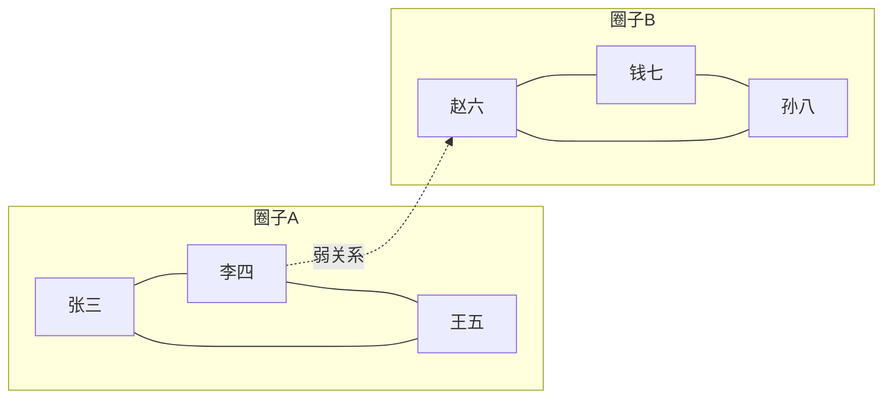
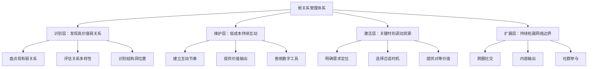
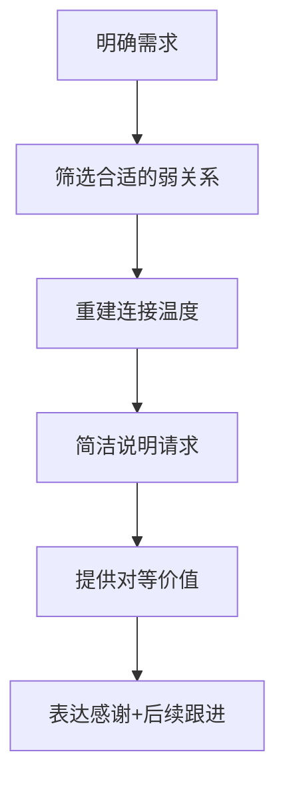
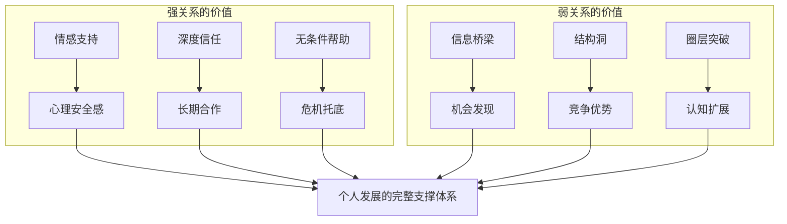

## 二、弱关系理论（The Strength of Weak Ties）

### 2.1 理论起源与学术背景

#### 2.1.1 一篇改变社会学的论文

1973年，美国社会学家马克·格兰诺维特（Mark Granovetter）在《美国社会学杂志》（American Journal of Sociology）上发表了论文《弱关系的力量》（The Strength of Weak Ties）。这篇论文后来成为社会学领域被引用最多的论文之一，截至2024年累计引用超过65,000次，格兰诺维特也因此被誉为"网络社会学之父"。

这篇论文提出了一个颠覆直觉的核心观点：**在求职、信息获取、机会发现等场景中，起关键作用的往往不是我们的亲密好友（强关系），而是那些我们不太熟悉的人（弱关系）**。

#### 2.1.2 研究的起点：波士顿求职调查

格兰诺维特的研究始于一个朴素的观察。1960年代末，他在波士顿地区对专业技术人士和管理层人员进行了深入访谈，调查他们如何找到当前的工作。样本包括282名求职者，覆盖工程师、会计师、科研人员等职业。

调查结果令他震惊：

- **56%** 的求职者是通过个人关系（而非公开招聘）找到工作的
- 在这些通过个人关系找到工作的人中，**83%** 是通过"偶尔联系"或"很少联系"的人——即弱关系
- 只有 **17%** 是通过"经常联系"的亲密好友——即强关系

这个发现直接挑战了当时社会学界的常识性假设——"强关系最重要"。格兰诺维特进一步追问：为什么那些"不太熟"的人反而能提供更有价值的帮助？

#### 2.1.3 理论的逻辑起点

格兰诺维特的推理链条如下：

1. 信息在社交网络中不是均匀分布的，不同圈子拥有不同的信息
2. 强关系倾向于存在于同一个社交圈子内部（同质性原理）
3. 同一个圈子内部的信息高度重叠——你朋友知道的事，你大概率也知道
4. 弱关系则跨越不同的社交圈子，充当信息的"桥梁"
5. 因此，弱关系能带来你圈子内无法获取的非冗余信息

这个逻辑链条简洁而有力，揭示了一个被直觉掩盖的结构性规律。

### 2.2 强关系与弱关系的科学界定

#### 2.2.1 格兰诺维特的四维度量表

格兰诺维特提出了四个维度来衡量关系的强弱，这是至今仍被学术界广泛使用的经典框架：

| 维度 | 强关系特征 | 弱关系特征 | 判断标准 |
|------|-----------|-----------|---------|
| **互动频率** | 高频接触，几乎每天 | 低频联系，数周或数月一次 | 过去一个月互动次数 |
| **情感强度** | 深厚的情感联结，关心对方生活 | 情感投入有限，客套性交往 | 是否会为对方的重大事件感到情绪波动 |
| **亲密程度** | 高度信任，可以倾诉隐私 | 交流停留在表面话题 | 是否愿意向对方暴露脆弱面 |
| **互惠交换** | 广泛的互助，涉及多种资源 | 限于特定领域的有限交换 | 帮助的范围和深度 |

在现实中，四种维度通常高度相关——互动频繁的人往往情感更深、更亲密、互助更多。但也有例外：比如与邻居可能互动频繁但情感不深，与远方老友可能互动很少但情感深厚。

#### 2.2.2 关系强度的连续光谱

强弱关系不是二元对立的"开关"，而是一个连续的光谱。格兰诺维特本人也强调了这一点。可以将关系强度想象为一个从0到10的刻度：

完全陌生 ←——→ 点头之交 ←——→ 普通熟人 ←——→ 较熟悉 ←——→ 好朋友 ←——→ 至交/家人
  0          2           4           6          8         10
                ↑                       ↑
              弱关系区间              强关系区间

大多数人的社交网络分布大致如下：

- **强关系（8-10分）**：5-15人——家人、伴侣、至交好友
- **中等关系（4-7分）**：30-80人——常联系的朋友、熟悉的同事
- **弱关系（1-3分）**：数百到数千人——偶尔联系的熟人、社交媒体好友

这个分布并非随意的——它与人类大脑的认知限制有关。牛津大学人类学家罗宾·邓巴（Robin Dunbar）提出的"邓巴数"理论表明，人类大脑能够维持的稳定社交关系上限约为150人，其中强关系不超过15人。这意味着，我们绝大部分的社交关系天然就是弱关系。

#### 2.2.3 关系强度的动态变化

关系强度不是固定不变的，它随时间、事件和互动而动态波动：

- **强化路径**：弱关系 → 中等关系 → 强关系。例如，新同事经过长期合作成为好友
- **弱化路径**：强关系 → 中等关系 → 弱关系。例如，毕业后与同学逐渐疏远
- **休眠-激活**：曾经的强关系进入休眠状态，但可以在特定情境下被重新激活

理解这种动态性非常重要：**你不需要"维持"所有弱关系的活跃度，但需要有意识地管理关系状态的转换**。

#### 2.2.4 中国语境下的关系分类

在中国文化语境下，关系的运作有其特殊性。社会学家费孝通提出的"差序格局"理论指出，中国人的社会关系是以"己"为中心，像水波纹一样向外扩散的同心圆结构：

- **核心圈（家人/至亲）**：强关系，提供无条件支持
- **中间圈（朋友/同学/同事）**：中等关系，互助互利
- **外围圈（熟人/点头之交）**：弱关系，利益导向

中国人常说的"关系"（guanxi）本身就包含了一套复杂的社会交换规范。弱关系在中国的运作方式与西方有所不同：

- **人情债机制**：中国弱关系中的帮助往往伴随着"人情债"的积累和偿还，这是一种长期的社会交换
- **面子机制**：通过弱关系办事时，"给面子"和"有面子"是重要的润滑剂
- **中间人角色**：在中国社会中，通过共同认识的人（中间人/介绍人）来激活弱关系，比直接联系更有效

### 2.3 弱关系为什么更有价值：深层机制解析

#### 2.3.1 信息桥梁（Information Bridge）机制

弱关系的核心价值在于其**信息桥梁**功能。要理解这个机制，需要先理解社交网络的结构性特征。

想象一个简单的社交网络：

在这个网络中：

- 圈子A内部的人通过**强关系**连接，他们共享相似的信息
- 圈子B内部的人也是如此
- 李四和赵六之间的**弱关系**是连接两个圈子的唯一通道
- 没有这条弱关系，两个圈子之间的信息完全隔离

格兰诺维特用一个形象的比喻来描述：**社会由一个个紧密连接的岛屿组成，强关系是岛屿内部的道路，弱关系则是连接不同岛屿的桥梁。没有桥梁，岛屿之间就无法通信。**

#### 2.3.2 结构洞理论（Structural Holes）

社会学家罗纳德·伯特（Ronald Burt）在1992年出版的《结构洞》（Structural Holes）一书中，将格兰诺维特的思想进一步形式化。他提出了"结构洞"概念——**两个不重叠的社交网络之间的空白地带**。

能够跨越结构洞的人，拥有三大优势：

1. **信息优势**：更早获取多样化的信息
2. **控制优势**：作为中介者，可以控制信息的流向
3. **推荐优势**：能够在不同圈子之间充当中间人，获得"经纪人"收益

伯特通过对企业高管的研究发现，拥有更多结构洞连接的管理者，往往更早获得晋升、薪酬更高、绩效更好。他的数据显示，在一项针对美国大型电子公司的研究中，拥有更多跨结构洞连接的管理者，其绩效评估分数平均高出一个等级。

**举例说明结构洞的价值：**

| 信息场景 | 冗余信息（强关系提供） | 非冗余信息（弱关系提供） |
|---------|---------------------|----------------------|
| 求职 | 大学室友告诉你A公司在招人 | 多年前的行业同行告诉你B公司有未公开职位 |
| 创业 | 同事推荐你已知的供应商 | 跨行业活动上认识的人介绍了一个新的供应链渠道 |
| 投资 | 朋友圈里大家讨论的热门股票 | 海外会议上了解到的新兴市场机会 |
| 学习 | 同专业同学推荐的教材 | 跨学科会议上了解到的不同研究方法 |

#### 2.3.3 "弱关系的力量"的四大实证场景

弱关系的价值不仅在理论上成立，更在大量实证研究中得到反复验证：

**场景一：求职**

格兰诺维特的经典发现已被全球多个研究反复验证：

- 美国的研究显示，约50-60%的工作通过个人关系获得，其中大部分是弱关系
- 中国的研究（边燕杰，1997）发现，中国社会中"强关系"在求职中的作用比西方更大，但弱关系在获取"信息"方面仍然至关重要——中国的模式是"强关系传递信息，弱关系提供影响"
- LinkedIn在2022年发布的大数据研究分析了数百万用户的求职路径，发现"三度人脉"（朋友的朋友的朋友）带来的工作机会数量是一度人脉的3倍以上

**场景二：创业**

硅谷创业生态系统是弱关系力量的最佳注脚：

- 斯坦福大学的研究表明，硅谷创业者之间的弱关系密度远高于其他地区
- 创业者通过弱关系获取关键的市场信息、寻找联合创始人、获得天使投资
- Y Combinator的合伙人保罗·格雷厄姆（Paul Graham）多次强调，创业公司最大的竞争优势之一是"信息优势"，而弱关系网络是获取这种优势的核心渠道
- 哈佛商学院的研究发现，拥有更多跨行业弱关系的创业者，其创业成功率比只依赖行业内部关系的创业者高出约30%

**场景三：创新与知识传播**

- MIT的研究表明，跨学科合作论文的被引用次数平均比同领域论文高出约40%
- 3M公司的"15%时间"制度（允许员工用15%的工作时间做自己感兴趣的项目）之所以能产生创新成果，很大程度上是因为它促进了跨部门弱关系的形成
- 弱关系是"创意"在组织内部传播的主要通道。一个好点子如果只在小圈子内流转，很快就会失去新鲜感；但通过弱关系传播到不同部门，就可能激发全新的应用

**场景四：信息传播与谣言控制**

社交网络中的信息传播路径研究发现：

- 弱关系是信息突破"圈层壁垒"的关键。一条信息如果只通过强关系传播，它会在同一个紧密圈子内反复循环；只有通过弱关系，才能"跳跃"到新的圈子
- 在公共健康传播中（如疫苗信息推广），弱关系网络比强关系网络更有效地将信息传递到"疫苗犹豫"群体
- 在谣言控制方面，弱关系网络既是谣言传播的通道，也是辟谣信息传播的通道——理解这一点有助于设计更有效的信息干预策略

### 2.4 弱关系的实践操作体系

#### 2.4.1 弱关系管理的四层框架

将弱关系理论转化为可执行的实践，需要建立一个系统的管理框架：

#### 2.4.2 识别层：盘点你的弱关系网络

**第一步：绘制你的社交网络地图**

拿出一张纸（或使用思维导图工具），按以下步骤操作：

1. 在中心写上你的名字
2. 第一圈：写下你最亲密的5-10个人（强关系）
3. 第二圈：写下你经常联系的30-50个人（中等关系）
4. 第三圈：写下你偶尔联系但认识的人（弱关系），至少列出50个
5. 在每个人旁边标注：所在的行业/圈子、认识的场景、上次联系的时间

**第二步：评估网络多样性**

用以下维度评估你的弱关系网络是否足够多样：

| 维度 | 评估标准 | 理想状态 |
|------|---------|---------|
| 行业多样性 | 弱关系覆盖的行业数量 | 至少覆盖5个以上不同行业 |
| 职能多样性 | 弱关系的职位类型 | 覆盖技术、市场、管理、创意等 |
| 年龄多样性 | 弱关系的年龄段分布 | 覆盖至少3个不同的年龄段 |
| 地域多样性 | 弱关系的地域分布 | 不限于同一城市 |
| 文化多样性 | 弱关系的文化背景 | 包括不同文化/教育背景的人 |
| 密度均衡 | 不同圈子之间的连接分布 | 不过度集中在某一个圈子 |

如果你的弱关系高度集中在同一个行业或圈子，那么弱关系的信息桥梁价值就会大打折扣——你获得的仍然是同质化的信息。

**第三步：识别结构洞位置**

问自己：

- 我的哪些弱关系连接了两个原本不相关的圈子？
- 我在哪些不同圈子之间扮演"桥梁"角色？
- 有哪些圈子我完全没有弱关系连接？

这些没有连接的"空白地带"就是你需要重点拓展的方向。

#### 2.4.3 维护层：低成本高效率的互动策略

弱关系的维护不需要大量时间和精力投入。关键在于**建立固定的互动节奏**，让维护成为习惯而非负担。

**日常维护动作（每天5-10分钟）：**

- 浏览微信朋友圈/LinkedIn动态，对有价值的内容点赞或评论
- 看到对某个弱关系有用的信息（文章、机会、资源），主动转发并附上一句简短的说明
- 在微信群/社群中参与有价值的讨论

**周期性维护动作（每周/每月）：**

| 频率 | 动作 | 时间投入 | 操作示例 |
|------|------|---------|---------|
| 每周 | 浏览弱关系动态并互动 | 15分钟 | 在朋友圈对3-5条动态留下有意义的评论 |
| 每月 | 主动分享有价值的信息给特定弱关系 | 30分钟 | "看到这篇文章想到你之前提到的XX问题，可能对你有帮助" |
| 每季度 | 约一次弱关系线下见面 | 2小时 | 咖啡/午餐，聊聊近况和行业动态 |
| 每年 | 节日问候+年度回顾 | 1小时 | 发送个性化的节日祝福，简要分享自己近一年的变化 |

**关键原则：提供价值先于索取价值**

维护弱关系最有效的方式不是"保持联系"，而是**持续提供价值**。当你成为一个"有价值的信息源"时，弱关系自然会主动维护与你的连接。

提供价值的方式包括：

- 分享行业洞察和趋势分析
- 推荐有用的工具、资源、课程
- 介绍可能互相帮助的人（充当中间人）
- 在对方需要时提供力所能及的帮助

#### 2.4.4 激活层：如何在关键时刻调动弱关系

当你需要通过弱关系获取帮助（求职、合作、信息等）时，正确的激活方式至关重要。错误的方式不仅无法获得帮助，还可能损害已有的关系。

**激活的正确流程：**

**第一步：筛选合适的弱关系**

不是所有弱关系都适合激活。筛选标准：

- 对方是否处于能够帮助你的位置（行业、职能、资源）
- 你们之间是否有过正面互动（哪怕只是点赞评论）
- 对方的社交风格是否倾向于帮助他人
- 上次联系的时间——超过一年未联系的弱关系需要先"预热"

**第二步：重建连接温度**

不要一上来就提出请求。先用2-3次轻量互动"预热"：

1. 对对方的近期动态点赞评论
2. 分享一篇对方可能感兴趣的文章
3. 在合适的时机进行一次简短的寒暄对话

这个过程通常需要1-2周。突然联系一个很久没联系的人并直接提出请求，会让人感到被"利用"。

**第三步：简洁说明请求**

激活弱关系时，请求的表述方式直接影响成功率。遵循以下原则：

| 原则 | 正确示例 | 错误示例 |
|------|---------|---------|
| 具体而非模糊 | "我想了解XX行业目前的招聘趋势" | "我想换工作，帮帮我" |
| 低成本而非沉重 | "能否花10分钟聊聊你对XX的看法？" | "能不能帮我推荐到你们公司？" |
| 给对方退路 | "如果方便的话，不方便也没关系" | "这个忙你一定要帮我" |
| 说明原因 | "因为你在这个领域有丰富的经验" | 什么都不说直接提要求 |

**第四步：提供对等价值**

即使对方帮了你，也要思考你能提供什么。这种价值不一定是即时的，可以是：

- 未来某个时刻的帮助承诺
- 一个有用的信息或推荐
- 一个潜在的合作机会
- 真诚的感谢和反馈

#### 2.4.5 扩展层：持续拓展弱关系网络

弱关系网络需要持续拓展，因为：(1) 现有弱关系会自然流失；(2) 你的需求和方向会变化；(3) 新的圈子和机会不断出现。

**高效拓展弱关系的渠道：**

| 渠道 | 优势 | 注意事项 | 适合人群 |
|------|------|---------|---------|
| 行业会议/论坛 | 高质量、面对面、深度交流 | 会前研究嘉宾，准备话题 | 有一定行业积累的人 |
| 线上社群（微信群/Discord等） | 低成本、持续互动 | 选择高质量社群，避免水群 | 所有人 |
| 内容输出（写作/视频/播客） | 被动吸引、建立专业形象 | 需要持续投入，效果慢但持久 | 有专业积累的人 |
| 跨领域课程/培训 | 自然认识不同背景的人 | 选择有互动环节的课程 | 想跨圈的人 |
| 志愿者活动/公益项目 | 共同经历建立连接 | 选择你真正关心的领域 | 所有人 |
| LinkedIn/社交媒体 | 最低成本的弱关系维护 | 不要只连接不互动 | 所有人 |
| 校友网络 | 已有共同身份认同 | 利用校友会活动 | 有学历背景的人 |

**关键心法：做"连接者"而非"索取者"**

最有效的弱关系扩展策略不是"认识更多人"，而是**成为不同圈子之间的连接者**。当你持续为别人介绍有价值的人脉、传递有用的信息时，你会自然成为社交网络中的"枢纽节点"，弱关系会主动向你聚拢。

### 2.5 强关系的不可替代性：弱关系理论的边界

#### 2.5.1 强关系的核心价值

弱关系理论并非否定强关系的价值。恰恰相反，理解弱关系的价值，是为了让我们更全面地理解社交网络的运作规律。在以下场景中，强关系依然不可替代：

**情感支持与心理健康**

心理学研究反复证实，强关系是心理健康的基石。面对重大挫折、人生低谷、情感危机时，强关系提供的无条件情感支持是弱关系无法替代的。哈佛大学持续85年的"成人发展研究"（Harvard Study of Adult Development）的核心结论是：**亲密关系的质量是人生幸福感和健康的最强预测因素**。

**深度合作与信任**

需要高度信任和长期承诺的合作——如合伙创业、深度技术研发、长期战略联盟——强关系更为可靠。深度合作需要大量的"关系专用性投资"（relationship-specific investment），这些投入只在强关系中才有安全感。想象一下：你会把毕生积蓄交给一个"偶尔联系的熟人"打理吗？

**危机时刻的资源调动**

在需要大量资源投入的紧急场景中——如突发疾病、经济困难、法律纠纷——强关系更容易伸出援手。强关系中的"社会义务"更强，更可能在不计较回报的情况下提供帮助。

**身份认同与归属感**

强关系构成了我们社会身份的核心部分。我们的自我认知、价值观、行为模式，很大程度上来自于与亲密关系的互动。"我是谁"这个问题的答案，往往嵌入在与家人、挚友、长期伴侣的关系之中。

#### 2.5.2 强弱关系的互补模型

最佳的社交策略不是选择强关系或弱关系，而是建立一个**强弱互补的社交网络**：

可以用一句话概括：**以强关系为根基，以弱关系为翅膀**。强关系提供安全感和稳定性，让你敢于冒险；弱关系提供机会和可能性，让你获得成长。

#### 2.5.3 强弱关系的动态平衡

一个健康的社交网络需要维持强弱关系的动态平衡。过度偏向任何一端都有风险：

| 失衡类型 | 症状 | 后果 |
|---------|------|------|
| 强关系过载 | 只和亲密好友交往，社交圈封闭 | 信息同质化，错失外部机会，思维固化 |
| 弱关系过载 | 认识很多人但没有深交 | 缺乏深度信任关系，危机时无人可依靠 |
| 关系维护失衡 | 忙于拓展新关系，忽视老朋友 | 强关系逐渐弱化，失去最重要的支撑 |

**建议的比例参考（以总社交投入时间为100%）：**

- 强关系维护：40-50%（家人、挚友、核心合作伙伴）
- 中等关系维护：25-35%（同事、常联系的朋友）
- 弱关系维护和拓展：15-25%（新认识的人、偶尔联系的熟人）

### 2.6 弱关系理论的现代发展与数字化时代

#### 2.6.1 社交媒体时代的弱关系

社交媒体的兴起从根本上改变了弱关系的形成和维护方式。Facebook、LinkedIn、微信、微博等平台使得维持数百甚至数千个弱关系成为可能——这在格兰诺维特的时代是不可想象的。

但数字化弱关系有其独特的规律和局限：

**优势：**

- **维护成本极低**：一条点赞、一次转发就完成了一次互动
- **网络规模极大**：一个人的LinkedIn连接可以超过5000人
- **信息传播高效**：一条朋友圈可以同时触达所有弱关系
- **跨地域无限制**：弱关系不再受物理距离的限制

**局限：**

- **深度不足**：数字化互动难以建立面对面交流所传递的信任感和情感温度
- **同质化算法**：社交媒体的推荐算法倾向于让你看到与你观点相似的内容和人，反而加剧了"信息茧房"效应——削弱了弱关系的信息桥梁功能
- **数量幻觉**：社交媒体上的"好友"数量不等于实际社交网络规模。Facebook的数据显示，用户平均有338个好友，但真正有互动的只有不到10%
- **浅层互动陷阱**：点赞和转发可能制造了一种"保持联系"的幻觉，但实际上并没有真正维护关系的深度

**2022年MIT的一项重要研究**分析了Facebook（现Meta）平台上数千万用户的数据，发现了一个与格兰诺维特理论高度一致的结论：**在Facebook上帮助用户找到新工作的人，绝大多数是"不常互动"的弱关系，而非"频繁互动"的强关系**。这项研究以大规模数据再次验证了弱关系理论在数字时代的适用性。

#### 2.6.2 "休眠关系"的特殊价值

格兰诺维特后续的研究揭示了一种特殊的弱关系类型——**休眠关系（Dormant Ties）**。休眠关系是指曾经是强关系或中等关系，但因时间、距离等原因而疏远了的关系。例如大学室友、前同事、曾经的好友等。

休眠关系具有独特的优势组合：

| 特征 | 普通弱关系 | 休眠关系 | 强关系 |
|------|-----------|---------|--------|
| 信任基础 | 低 | 中等（历史信任残留） | 高 |
| 信息新颖性 | 高（不同圈子） | 高（对方可能已进入新圈子） | 低（同质化） |
| 激活难度 | 中等 | 较低（有历史连接） | 低 |
| 推荐意愿 | 低 | 中等 | 高 |

**休眠关系的激活策略：**

1. **找到自然的重新连接理由**：不要突然联系，而是借助某个事件——如看到对方的动态、共同朋友的消息、某个纪念日等
2. **坦诚表达**："好久没联系了，最近看到你XX，想起我们以前XX，想聊聊近况"
3. **不要急于索取**：第一次重新连接应该以叙旧为主，不提任何请求
4. **更新彼此的信息**：让对方了解你的变化，也了解对方的变化——这是休眠关系激活后最重要的一步

#### 2.6.3 算法时代的新挑战

社交媒体的推荐算法正在深刻改变弱关系的运作方式：

**信息茧房效应**

算法倾向于推荐与你已有观点一致的内容和人，这会导致：
- 你的弱关系网络逐渐同质化
- 弱关系的信息桥梁功能被削弱
- 你接触到的"不同圈子"的信息实际上只是"看起来不同但本质相同"的信息

**应对策略：**
- 主动关注与自己观点不同的信息源
- 定期清理社交媒体的信息推荐偏好
- 使用多个社交平台，避免被单一算法主导
- 保持线下弱关系的维护，这是算法无法替代的

**算法推荐的"伪弱关系"**

算法可能会给你推荐一些"你可能认识的人"或"你可能感兴趣的人"，这些算法推荐的关系与自然形成的弱关系有本质区别——前者缺乏真实的互动基础，激活难度更大。

#### 2.6.4 弱关系理论的学术前沿

弱关系理论在学术界仍在持续发展，以下是一些值得关注的前沿方向：

**"超级传播者"与弱关系的层级结构**

并非所有弱关系都同等重要。研究表明，社交网络中存在少量"超级连接者"（super-connectors），他们拥有异常丰富的弱关系网络，是信息传播的关键节点。识别并维护与这些超级连接者的弱关系，其价值远高于维护大量的普通弱关系。

**弱关系与社会资本**

哈佛大学罗伯特·帕特南（Robert Putnam）在《独自打保龄》（Bowling Alone）一书中区分了两种社会资本：

- **粘合型社会资本（Bonding Social Capital）**：基于强关系的紧密连接，提供情感支持和群体认同
- **桥接型社会资本（Bridging Social Capital）**：基于弱关系的广泛连接，提供信息和机会

弱关系理论的核心贡献在于揭示了桥接型社会资本的重要性——它虽然不如粘合型社会资本"温暖"，但对个人发展和社会流动性的价值更大。

**弱关系与认知多样性**

最新研究表明，弱关系不仅带来信息多样性，还能带来**认知多样性**——不同的思维方式、问题解决框架、世界观。这种认知多样性的价值可能比信息多样性更为深远，因为它改变的不是你知道什么，而是你如何思考。

### 2.7 常见误区与纠正

#### 误区一：弱关系=无用的关系

**错误认知**：弱关系太浅，帮不上什么忙，不如把精力放在维护强关系上。

**纠正**：弱关系的价值不在于"深度"，而在于"广度"和"差异性"。强关系能帮你解决"深度"问题（情感支持、深度合作），弱关系能帮你解决"广度"问题（信息获取、机会发现）。两者解决的是不同维度的问题，不可互相替代。

#### 误区二：弱关系越多越好

**错误认知**：疯狂加微信、加LinkedIn，追求弱关系数量的最大化。

**纠正**：弱关系的价值取决于**多样性**和**质量**，而非数量。100个来自同一行业的弱关系，其信息价值可能还不如10个来自不同行业的弱关系。盲目追求数量会导致维护精力分散，反而降低每段弱关系的质量。

#### 误区三：认识=关系

**错误认知**：加了微信就算建立了弱关系。

**纠正**：加了微信只是建立了**连接**（connection），不等于建立了**关系**（relationship）。真正的弱关系需要至少一次有意义的互动——一次对话、一次帮助、一次合作。没有互动基础的"连接"在你需要帮助时是无法激活的。

#### 误区四：弱关系不需要维护

**错误认知**：弱关系既然"弱"，就不需要花时间维护，需要时再联系就行。

**纠正**：完全不维护的弱关系会逐渐"冷却"到完全陌生的状态。研究表明，超过一年没有任何互动的弱关系，激活难度会显著上升。低成本的维护（点赞、评论、偶尔分享信息）可以保持弱关系的"温热"状态，使其在关键时刻更容易被激活。

#### 误区五：只在线上维护弱关系

**错误认知**：在社交媒体上互动就够了，不需要线下见面。

**纠正**：数字化互动虽然高效，但面对面交流建立的信任感和情感连接是线上无法替代的。研究表明，一次面对面的交流对关系强度的提升，相当于5-10次线上互动。对于高价值的弱关系，定期的线下见面（哪怕只是一年一次）非常必要。

### 2.8 实操工具与模板

#### 2.8.1 弱关系网络自评问卷

用以下问题评估你的弱关系网络健康度（每题1-5分）：

1. 我的弱关系覆盖了至少5个不同的行业/领域
2. 我能在需要时列出至少20个可以联系的弱关系
3. 我每周至少花15分钟维护弱关系
4. 我在过去一年中通过弱关系获得过有价值的信息或机会
5. 我经常在不同圈子之间传递信息，充当"桥梁"角色
6. 我的弱关系中包含不同年龄段、不同背景的人
7. 我有至少3个"休眠关系"可以在需要时重新激活
8. 我在社交媒体上有意识地维护弱关系
9. 我在过去半年中至少认识了5个新的弱关系
10. 我有定期评估和调整社交网络的习惯

**评分标准：**

- **40-50分**：弱关系网络健康，继续保持
- **30-39分**：有一定基础，需要加强多样性和维护频率
- **20-29分**：弱关系网络较薄弱，需要系统性地拓展和维护
- **10-19分**：严重依赖强关系，急需建立弱关系管理体系

#### 2.8.2 弱关系维护日历模板

| 时间 | 动作 | 具体操作 | 预计耗时 |
|------|------|---------|---------|
| 每天早上 | 浏览动态 | 刷朋友圈/LinkedIn，对3-5条动态点赞评论 | 5分钟 |
| 每周三 | 主动分享 | 选2-3个弱关系，分享对方可能感兴趣的内容 | 10分钟 |
| 每月第一周 | 回顾盘点 | 检查弱关系网络，标记需要加强维护的人 | 20分钟 |
| 每季度 | 线下见面 | 约1-2个高价值弱关系喝咖啡 | 2小时 |
| 每年1月 | 年度评估 | 用自评问卷评估弱关系网络健康度 | 30分钟 |

#### 2.8.3 弱关系激活话术模板

**重新激活休眠关系：**
> XX你好，好久没联系了。最近（看到你的XX动态/想起我们之前在XX认识/在XX上看到你的文章），想问问你最近怎么样？我这边（简短近况）。有空的话聊聊？

**请求信息型：**
> XX你好，最近我在关注XX领域，想到你在这方面有丰富的经验，不知道你方不方便花10分钟聊聊（具体问题）？如果方便的话我请你喝咖啡，时间你定。

**请求推荐型：**
> XX你好，我最近在寻找XX方面的（合作伙伴/工作机会/供应商），想到你可能了解这个领域的情况。如果方便的话，能否帮我推荐或介绍一两个相关的人？当然，如果有什么我能帮到你的地方也请告诉我。

**请求后感谢：**
> XX，非常感谢你（具体的帮助内容）。对我帮助很大。以后如果有什么我能帮上忙的，请随时告诉我。

### 2.9 本节核心要点回顾

1. **弱关系的核心价值**在于信息桥梁功能——连接不同社交圈子，传递非冗余信息
2. **强弱关系是光谱**，不是二元对立——大部分关系处于中间状态，且强度会动态变化
3. **弱关系的价值取决于多样性**，而非数量——100个同质弱关系不如10个异质弱关系
4. **弱关系维护的关键**是"提供价值先于索取"——成为有价值的信息源，关系自然维护
5. **激活弱关系需要技巧**——先预热、再请求、给退路、提供对等价值
6. **强弱关系互补**——强关系是根基（情感支持、深度信任），弱关系是翅膀（信息、机会）
7. **数字化时代**，弱关系维护成本降低，但信息茧房效应和浅层互动是新挑战
8. **休眠关系**是一种特殊的高价值资源——有历史信任基础，又处于新的圈子
9. **成为"连接者"**比"索取者"更有效——在不同圈子之间传递价值，你会自然成为枢纽节点
10. **定期评估**你的弱关系网络——多样性和维护频率是两个最关键的指标
