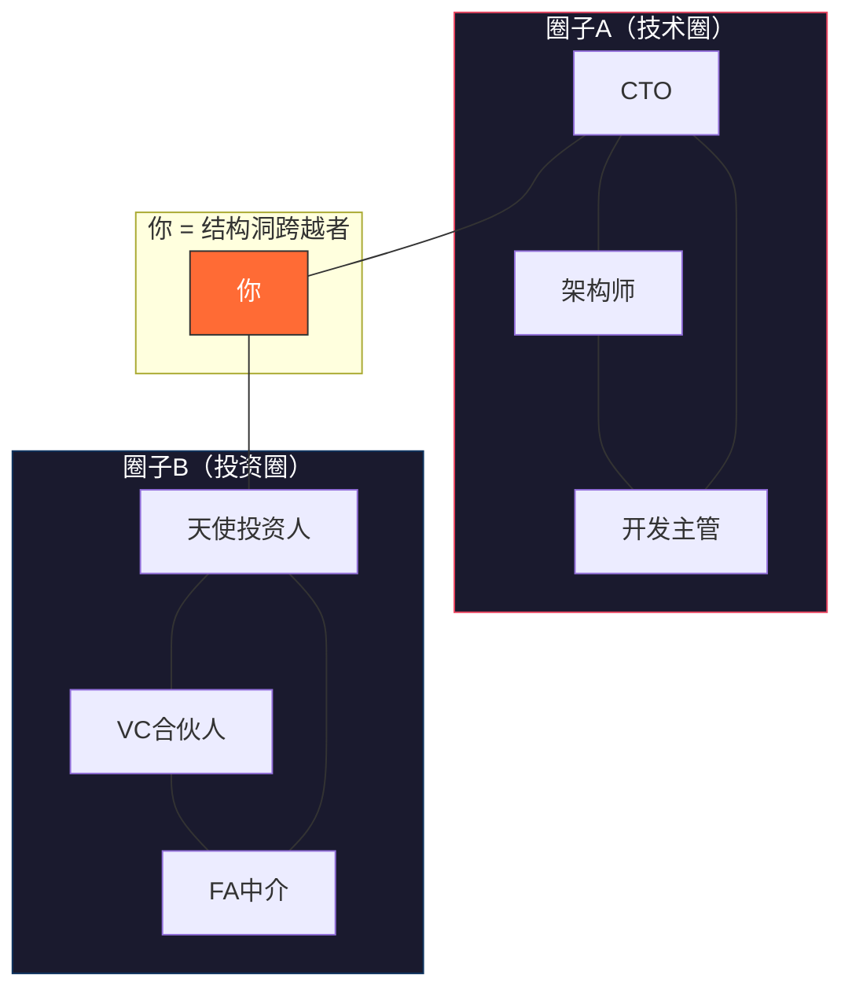
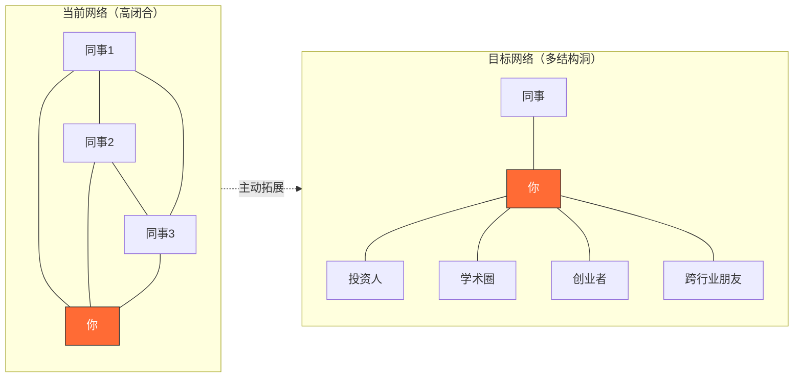
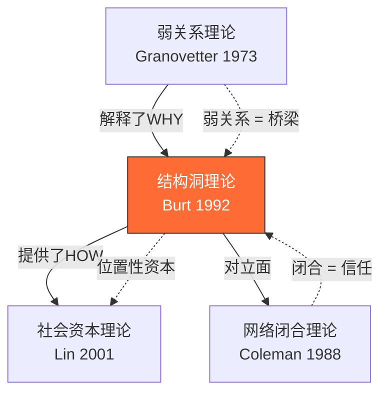

## 三、结构洞理论（Structural Holes Theory）

### 3.1 理论起源与核心洞见

1992年，美国社会学家罗纳德·伯特（Ronald Burt）在芝加哥大学出版了《结构洞：竞争的社会结构》（Structural Holes: The Social Structure of Competition），正式提出了结构洞理论。这一理论并非凭空诞生，而是建立在格兰诺维特弱关系理论（1973）和社会网络分析方法论的基础之上，是对"关系如何创造价值"这一根本问题的更深层回答。

伯特的核心洞察可以浓缩为一句话：**在社交网络中，竞争优势不取决于你知道什么，甚至不完全取决于你认识谁，而是取决于你所认识的人之间是否彼此认识——即你在网络结构中所处的位置。**

这个洞见的深刻之处在于，它把分析单位从"个体"或"关系"转移到了"网络结构"。你拥有的关系数量固然重要，但这些关系在网络中如何分布、是否构成结构洞，才是决定你能获得多大竞争优势的关键变量。

### 3.2 什么是结构洞

#### 3.2.1 基本定义

结构洞（Structural Hole）是指社交网络中两个彼此不相连的群体之间的空隙。如果你认识A和B，而A和B彼此不认识，那么A和B之间就存在一个结构洞，而你恰好跨越了这个结构洞。

用更正式的网络科学语言表述：结构洞是网络中两个非冗余节点之间的缺失连接。所谓"非冗余"，是指这两个节点分别连接着不同的信息源和资源池，它们各自的关系网络不重叠。

在这个结构中，你同时连接了技术圈和投资圈，而这两个圈子内部高度连接，彼此之间却没有直接联系。你就是这两个圈子之间的"桥梁"，占据了跨越结构洞的位置。

#### 3.2.2 结构洞与相关概念的区分

理解结构洞，需要将其与几个容易混淆的概念做明确区分：

| 概念 | 定义 | 与结构洞的关系 |
|------|------|----------------|
| **弱关系**（Weak Ties） | 互动频率低、情感强度弱的关系 | 弱关系常常是跨越结构洞的桥梁，但并非所有弱关系都跨越结构洞 |
| **桥接关系**（Bridge） | 唯一连接两个群体的路径 | 桥接关系必然是跨越结构洞的关系，但结构洞的含义更广泛 |
| **中间中心性**（Betweenness Centrality） | 节点处于其他节点对之间最短路径上的频率 | 高中间中心性通常意味着跨越了更多结构洞 |
| **网络闭合**（Network Closure） | 网络中所有节点都相互连接 | 网络闭合与结构洞互为对立面——闭合程度越高，结构洞越少 |
| **社会资本**（Social Capital） | 嵌入在关系网络中的资源总和 | 结构洞是一种特定类型的社会资本——位置性社会资本 |

#### 3.2.3 结构洞的度量

在社会网络分析中，可以用以下指标量化结构洞：

**（1）有效规模（Effective Size）**

有效规模 = 节点的度数 - 冗余连接数。有效规模越大，说明该节点跨越的结构洞越多。计算公式为：

有效规模 = n - (2t/n)

其中 n 是该节点的关系数量，t 是这些关系之间的实际连接数。

**（2）效率（Efficiency）**

效率 = 有效规模 / 实际规模。效率越高，说明该节点的关系网络冗余度越低，跨越的结构洞比例越大。

**（3）约束（Constraint）**

约束是伯特提出的衡量结构洞缺失程度的指标。约束值越高，说明该节点的关系网络越封闭，结构洞越少。约束值越低，说明该节点拥有越多的结构洞机会。

**（4）等级度（Hierarchy）**

衡量约束是否集中在一个节点上。等级度高意味着一个节点的约束主要来自某一个关系，等级度低则说明约束分散在多个关系中。

### 3.3 结构洞带来的三大竞争优势

伯特将结构洞带来的优势归纳为信息优势、控制优势和创新优势。这三种优势层层递进，构成了结构洞理论的核心价值框架。

#### 3.3.1 信息优势

占据结构洞位置的人能够获取来自不同网络的非冗余信息，这种优势体现在三个层面：

**（1）信息获取的时效性**

跨越结构洞的人往往是最早获知某一圈子内部消息的"外部人"。例如，一个同时连接技术圈和投资圈的人，可能比纯技术从业者更早知道某个技术方向即将获得大额融资，也比纯投资人更早知道某个技术趋势的真实成熟度。

**（2）信息内容的多样性**

不同圈子拥有不同的信息池。技术圈讨论的是技术可行性和实现方案，投资圈讨论的是市场空间和退出路径，学术圈讨论的是前沿趋势和论文发表。跨越这些圈子的人能够获得多维度的信息拼图，形成更全面的判断。

**（3）信息传递的可控性**

占据结构洞位置的人不仅是信息的接收者，更是信息的中转站。他们可以选择将信息传递给谁、在什么时机传递、以什么方式传递。这种信息控制力赋予了他们显著的议价优势。

**案例：硅谷的"超级联络人"**

斯坦福大学社会学家马克·格兰诺维特的研究发现，硅谷最成功的创业者往往不是技术最强的人，而是那些同时连接技术社区、风险投资社区和商业管理社区的人。典型的例子是雷德·霍夫曼（Reid Hoffman）——他在斯坦福读哲学，在苹果做产品，后来成为PayPal高管，同时活跃在投资圈。LinkedIn正是他利用在多个圈子之间积累的结构洞优势而创建的。

#### 3.3.2 控制优势

跨越结构洞的人在网络中扮演"中间人"或"经纪人"（Broker）的角色，能够控制不同网络之间的资源流动。

**（1）议价能力**

当A和B互相不认识、而你是他们之间的唯一连接时，你在任何涉及双方的谈判中都处于有利位置。你可以选择不传递对方的信息，也可以选择放大某些信息来影响对方的判断。

**（2）第三方博弈**

在多方博弈中，结构洞跨越者可以利用"鹬蚌相争，渔翁得利"的策略。例如，在供应链管理中，同时连接供应商和采购商的中间人，可以在双方之间进行议价，获取佣金或价差。

**（3）声望塑造**

通过在不同圈子之间传递有价值的信息和资源，结构洞跨越者能够建立"资源枢纽"的声望。这种声望反过来会吸引更多人主动寻求与你建立联系，形成正反馈循环。

#### 3.3.3 创新优势

这是结构洞理论最具启发性的推论之一。伯特认为，创新往往不是来自同一圈子内部的知识积累，而是来自不同知识领域的交叉碰撞。

**（1）"谁知道什么"思维**

跨越结构洞的人习惯于用"谁知道什么"的框架思考问题。当他们遇到一个难题时，会自然而然地想到"我在另一个圈子认识的某个人可能知道答案"，从而实现跨领域的问题解决。

**（2）思维模式的融合**

不同圈子有不同的"思维方言"——技术圈用工程思维分析问题，商业圈用成本收益框架分析问题，设计圈用用户体验思维分析问题。跨越多个圈子的人能够融合多种思维模式，产生单一圈子内难以产生的创新方案。

**伯特的经典实证研究**

伯特对美国雷神公司（Raytheon）的一家电子设备制造厂进行了研究。他让673名员工提交创新建议，然后由管理层评估这些建议的质量。研究发现：

- 那些在社交网络中占据更多结构洞位置的员工，提出的创新建议被采纳的概率显著更高
- 结构洞位置对创新的影响独立于个人能力、教育背景和工作年限
- 这种效应在"模糊性"更高的领域（如市场策略）比在"确定性"更高的领域（如纯技术问题）更加明显

### 3.4 结构洞的实际应用框架

#### 3.4.1 第一步：绘制你的社交网络地图

要利用结构洞，首先要清楚自己当前的网络结构。以下是具体的操作步骤：

**（1）列出你的核心关系**

拿出一张纸或打开一个思维导图工具，列出你在过去一年中互动最多的50个人。对每个人标注以下信息：
- 姓名/代号
- 所属圈子（行业、兴趣、地域等）
- 关系强度（强/中/弱）
- 你们认识多久
- 上次互动时间

**（2）标注圈子之间的连接**

检查你列出的人之间，谁和谁互相认识。用连线标出。你会发现，某些圈子内部连接密集，圈子之间则几乎没有连接。

**（3）识别结构洞位置**

找到那些你同时认识但彼此不认识的人对。这些就是你目前占据的结构洞。同时，找到那些你完全没有连接的圈子——这些是你潜在的结构洞扩展方向。

#### 3.4.2 第二步：评估结构洞质量

不是所有结构洞都同等重要。你需要从以下维度评估一个结构洞的价值：

| 评估维度 | 高价值特征 | 低价值特征 |
|----------|-----------|-----------|
| **信息差异度** | 两个圈子的信息池高度不同 | 两个圈子的信息高度重叠 |
| **资源互补性** | 两个圈子拥有互补的资源 | 两个圈子资源类型相似 |
| **需求匹配度** | 一个圈子的需求恰好是另一个圈子能提供的 | 两个圈子之间没有明显的供需关系 |
| **圈子活跃度** | 两个圈子都活跃且开放 | 某个圈子已经沉寂或封闭 |
| **你的可信度** | 你在两个圈子中都被信任 | 你在某个圈子中只是边缘人 |

#### 3.4.3 第三步：主动构建结构洞

如果你发现自己的社交网络高度同质化（大部分关系都在同一个圈子里），就需要有意识地构建结构洞：

**（1）跨行业社交**

- 参加不同行业的会议和沙龙（而不是只参加本行业的活动）
- 加入跨领域的学习社群（如混沌学园、得到高研院等）
- 主动参加与你本职工作无关的兴趣社团

**（2）利用"二度人脉"**

- 请现有关系人引荐他们圈子中的人
- 参加朋友的朋友组织的聚会
- 在社交媒体上关注并互动不同领域的意见领袖

**（3）创造"弱连接机会"**

- 在公开场合分享你的专业知识（写文章、做演讲、录播客）
- 参与开源项目或公共项目
- 在社区中担任志愿者或组织者

**（4）地理/文化跨度**

- 利用出差、旅行、留学等机会建立跨地域关系
- 学习一门新语言或进入一个新的文化社群
- 在海外社交平台（LinkedIn、Twitter/X）上建立国际联系

#### 3.4.4 第四步：运营结构洞

占据结构洞只是第一步，持续运营才是关键。

**（1）保持信息流动**

定期在你连接的不同圈子之间传递有价值的信息。注意：传递的必须是真正有价值的信息，而不是泛泛的新闻或八卦。低质量的信息传递会损害你的信誉。

具体做法：
- 每周花30分钟整理你在不同圈子获取的信息，筛选出可能对其他圈子有价值的内容
- 使用"信息日记"记录每个圈子最近关注的热点和痛点
- 当你发现一个圈子的需求恰好是另一个圈子能解决的问题时，主动牵线搭桥

**（2）谨慎引荐**

引荐不同圈子的人相互认识，是结构洞运营中最高效的做法，但也是最需要谨慎的做法。引荐不当可能损害你在两个圈子中的信誉。

引荐原则：
- 确保双方都有见面的动机
- 提前向双方介绍对方的背景和可能的合作点
- 引荐后跟进，确保双方都感到满意
- 不要引荐你不够了解的人

**（3）建立"经纪人"声望**

当你持续在不同圈子之间创造价值时，你的"经纪人"声望会逐渐建立。这种声望是自增强的——更多人会主动寻求通过你建立联系，从而强化你的结构洞优势。

#### 3.4.5 第五步：量化追踪

建议定期（每季度或每半年）对自己的社交网络进行量化评估：

**关键指标：**

- **圈子数量**：你活跃参与的不同圈子有几个？
- **跨圈联系人占比**：在你的核心关系中，有多少人属于不同的圈子？
- **非冗余关系比率**：你的关系中有多少是"非冗余"的（即对方认识的人你不认识）？
- **引荐频率**：你每个月在不同圈子之间做了几次有价值的引荐？
- **被引荐频率**：有多少人主动通过你来建立跨圈联系？

### 3.5 结构洞理论在不同场景中的应用

#### 3.5.1 职场晋升

研究发现，在组织内部，那些跨越部门边界、连接不同团队的人更容易获得晋升。这不仅因为他们拥有更广泛的信息网络，还因为他们能够协调不同部门之间的合作。

**实操建议：**
- 主动参与跨部门项目
- 在公司内部建立非正式的跨部门社交网络
- 成为不同部门之间的信息桥梁（如分享其他部门的成功经验）

#### 3.5.2 创业

创业者如果能够同时连接技术、市场、资本和政策等多个圈子，就能获得显著的创业优势。硅谷的创业生态系统之所以高效，部分原因就在于它鼓励跨圈子的社交互动。

**实操建议：**
- 创业前确保你的核心团队覆盖至少3个不同的圈子
- 利用孵化器、加速器等平台扩展跨圈联系
- 参加Demo Day、创投对接会等跨圈子活动

#### 3.5.3 知识工作者

对于研究者、咨询师、设计师等知识工作者来说，跨领域的知识整合能力是核心竞争力。结构洞理论指出，那些能够将不同领域的知识融合在一起的知识工作者，往往能产出更有影响力的工作。

**实操建议：**
- 建立跨学科的阅读清单
- 参加不同学科的学术会议
- 与不同领域的人合作发表论文或文章

#### 3.5.4 中国语境下的应用

在中国的关系（guanxi）文化中，结构洞理论需要做一些调整：

**（1）"介绍人"角色的文化适配**

在中国文化中，"介绍人"是一个被广泛认可和尊重的角色。这与西方语境中的"经纪人"角色有所不同——在中国文化中，介绍人不仅仅是信息中介，还承担着担保和背书的功能。利用这一文化特点，结构洞跨越者可以在中国社会中获得更强的信任基础。

**（2）"圈子文化"的利用**

中国的社交网络往往以"圈子"为基本单位——老乡圈、校友圈、行业圈、战友圈等。这些圈子内部的连接非常密集（高闭合度），但圈子之间的连接相对稀疏。这为中国语境下的结构洞利用提供了巨大的空间。

**（3）注意"站队"风险**

在中国的组织文化中，跨越过多的圈子有时会被视为"两面派"或"不忠诚"。因此，在利用结构洞优势时，需要注意保持透明度，避免给人留下"吃里扒外"的印象。

### 3.6 结构洞理论的局限性与批判

任何理论都有其适用边界，结构洞理论也不例外。

#### 3.6.1 文化适用性

伯特的原始研究主要基于美国的商业环境。在集体主义文化中（如中国、日本、韩国），过度强调"经纪人"角色可能不被社会接受。这些文化更重视关系的"闭合性"——即你的朋友们也应该是朋友，形成一个紧密的信任网络。

#### 3.6.2 信任成本

跨越结构洞需要在不同的、互不信任的群体之间建立信任。这不是一件容易的事——你需要同时获得多个群体的认可，而任何一个群体对你的不信任都可能破坏你的桥梁位置。

#### 3.6.3 道德风险

结构洞跨越者拥有信息优势和控制优势，如果滥用这些优势谋取私利（如两头通吃、操纵信息），一旦被发现，将面临被多个圈子同时排斥的风险。

#### 3.6.4 网络动态性

社交网络是动态变化的。你今天占据的结构洞，明天可能被填补——当A和B通过其他途径建立直接联系后，你跨越的那个结构洞就消失了。因此，结构洞优势不是一劳永逸的，需要持续维护和拓展。

#### 3.6.5 规模效应

当你的社交网络规模扩大到一定程度后，维护所有结构洞关系所需的时间和精力可能会超过其带来的收益。这时需要做出取舍，保留高价值的结构洞，放弃低价值的。

### 3.7 常见误区与纠正

| 误区 | 纠正 |
|------|------|
| "认识的人越多越好" | 关键不是数量，而是关系的非冗余性。100个互相认识的人不如分属5个圈子的20个人 |
| "结构洞就是搞关系" | 结构洞强调的是网络结构，而不是关系的数量或质量。即使你和每个人都关系很好，如果他们都在同一个圈子里，你也没有结构洞优势 |
| "要一直当中间人，不介绍别人认识" | 过度保守会导致你被视为"垄断者"而非"经纪人"。适度引荐可以建立更好的声望 |
| "弱关系就是结构洞" | 弱关系和结构洞有交集但不等同。你可能有很多弱关系，但这些弱关系可能都在同一个圈子里 |
| "结构洞只能用在商业中" | 结构洞在学术研究、公益组织、社区建设、甚至个人生活中都有应用价值 |
| "占据结构洞位置就够了" | 位置只是前提，你还需要主动运营——传递信息、引荐人脉、创造价值。不运营的结构洞会自然闭合 |

### 3.8 与其他人脉理论的关系

结构洞理论并非孤立存在，它与前面讨论的弱关系理论和后面将讨论的社会资本理论形成了一个完整的理论体系：

- **弱关系理论**解释了为什么弱关系有价值（信息优势），结构洞理论则进一步说明了什么样的网络位置能最大化这种价值。
- **网络闭合理论**（科尔曼提出）强调网络闭合带来的信任和规范优势，与结构洞理论形成互补——前者强调"大家互相认识"的好处，后者强调"大家不互相认识"的好处。
- **社会资本理论**（林南提出）将结构洞视为社会资本的一种来源——位置性社会资本，区别于嵌入性社会资本（来自紧密关系的信任和互助）。

在实践中，最有效的策略不是二选一，而是在不同场景下灵活运用：在需要创新和信息获取时追求结构洞优势，在需要信任和执行力时追求网络闭合优势。

### 3.9 本节核心要点回顾

1. **结构洞的本质**：两个不相连群体之间的空隙，跨越它的人获得信息优势、控制优势和创新优势
2. **不是认识谁，而是谁不认识谁**：竞争优势来自网络结构，而非关系数量
3. **主动构建**：结构洞不会自动出现，需要有意识地扩展到不同圈子
4. **运营是关键**：占据位置只是前提，持续的信息流动和价值创造才能维持优势
5. **动态维护**：结构洞会被填补，需要持续拓展新的结构洞
6. **文化适配**：在中国语境下，要结合"圈子文化"和"介绍人"角色来运用结构洞策略
7. **与闭合理论互补**：创新需要结构洞，信任需要闭合，最有效的策略是两者结合
