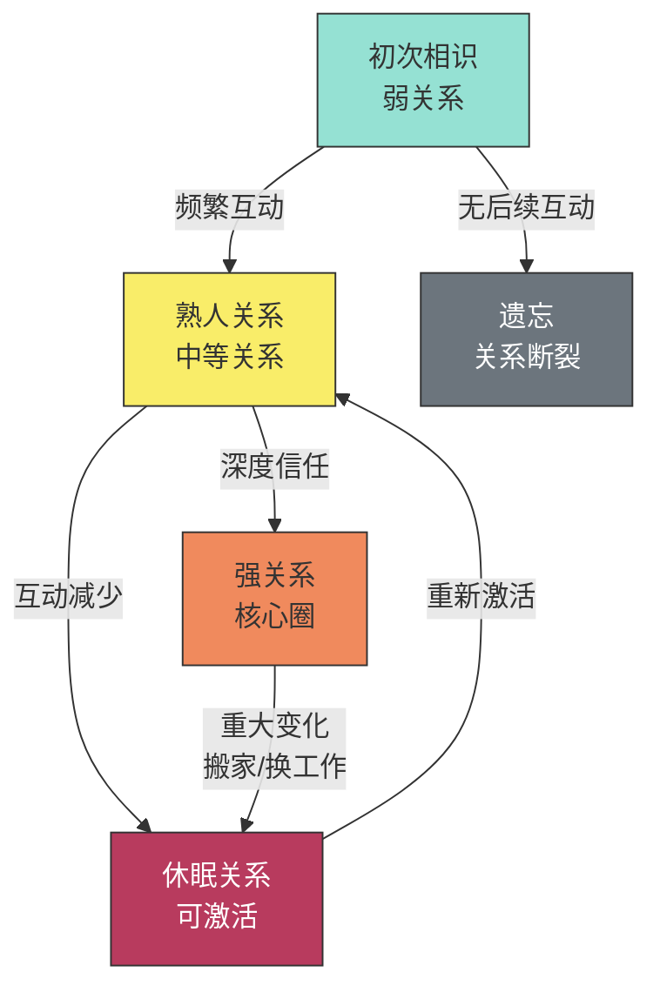
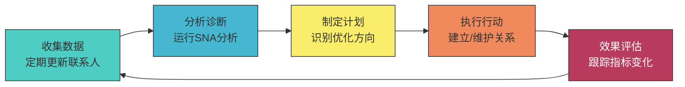

## 四、社交网络分析（Social Network Analysis, SNA）

### 4.1 什么是社交网络分析？

社交网络分析（Social Network Analysis，简称SNA）是一种以图论和网络科学为基础、研究社会关系结构与模式的方法论框架。它将人与人之间的关系抽象为网络，通过可视化和量化手段，揭示隐藏在关系表面之下的结构规律。

传统社会学关注的是"个体有什么属性"——年龄、学历、收入、性格。SNA关注的是"个体处于什么位置"——你跟谁连接、连接的路径有多长、你处在网络的中心还是边缘。这两种视角并非对立，但SNA提供了一个被长期忽视的维度：**你的社交位置本身就是一种资源，它独立于你的个人能力而存在。**

这正是社会学家罗纳德·伯特（Ronald Burt）的核心洞见：结构决定机会。一个能力平平但处于网络关键位置的人，获取信息和资源的效率可能远超一个能力出众但被孤立在边缘的人。

#### 4.1.1 SNA的学科渊源

SNA并非凭空产生，它有深厚的学术根基：

| 学科 | 贡献 | 代表人物/理论 |
|------|------|---------------|
| 社会计量学 | 社会关系的量化测量 | 莫雷诺（Moreno），1930年代社会关系图 |
| 社会学 | 弱关系、结构洞 | 格兰诺维特、伯特 |
| 图论 | 网络的数学描述 | 欧拉（Euler），七桥问题 |
| 物理学 | 复杂网络、小世界模型 | 瓦茨、斯特罗加茨、巴拉巴西 |
| 计算机科学 | 网络算法、图数据库 | PageRank、社区检测算法 |
| 心理学 | 社会支持网络 | 科恩（Cohen），社会支持与健康 |

这些学科在1990年代开始融合，形成了今天我们所说的"网络科学"。互联网和社交媒体的兴起提供了海量数据，使得SNA从学术象牙塔走向了实际应用。

#### 4.1.2 为什么人脉经营需要SNA？

人脉经营的最大陷阱是"凭感觉"——觉得自己朋友很多，但关键时刻一个都用不上；觉得自己社交很活跃，但信息来源极其单一。SNA的价值在于：

1. **从模糊到精确**：把"我人脉不错"这种主观感受变成可量化的指标
2. **从局部到全局**：你看到的只是你直接认识的人，SNA能帮你看到整个网络的结构
3. **从被动到主动**：不是"等到需要时再找人"，而是有意识地修补网络中的薄弱环节
4. **从单一到多元**：识别同质性陷阱，有意识地拓展跨圈连接

### 4.2 社交网络的基本概念

#### 4.2.1 节点（Node）与边（Edge）

社交网络由两类基本元素构成：

- **节点（Node/Vertex）**：网络中的个体或组织。在个人人脉分析中，每个节点代表一个人；在更宏观的分析中，也可以是一个团队、公司或社群。
- **边（Edge/Link）**：节点之间的关系连接。边是SNA中最关键的概念，因为关系的性质决定了网络的性质。

边有三个重要属性：

**方向性**：
- **无向边**：双向关系，如"互为好友""是同学"
- **有向边**：单向关系，如"关注了""汇报给""求助于"

**权重**：
- 无权网络：边只有"存在/不存在"两种状态
- 有权网络：边有强度，如"每周互动5次""合作过3个项目"

**类型**：
- 亲属关系、朋友关系、同事关系、合作关系、信息传递关系
- 不同类型的关系承载不同类型的资源

```mermaid
graph LR
    A["节点A<br/>你"] ---|["每周聊天3次<br/>权重:3"]| B["节点B<br/>密友"]
    A ---|["偶尔联系<br/>权重:0.5"]| C["节点C<br/>前同事"]
    A -->|["单向关注"]| D["节点D<br/>行业KOL"]
    B ---|["共同好友"]| E["节点E<br/>B的大学同学"]
    C ---|["合作项目"]| F["节点F<br/>C的合伙人"]
    style A fill:#ff6b6b,stroke:#333,color:#fff
    style B fill:#4ecdc4,stroke:#333,color:#fff
    style D fill:#ffe66d,stroke:#333,color:#000
```

在实际操作中，你需要根据分析目的来定义"边"。如果你关心的是"谁能帮我找到工作"，那"认识"这种弱连接就够了；如果你关心的是"谁会在深夜接我电话"，那就需要更深层的关系定义。

#### 4.2.2 度数中心性（Degree Centrality）

度数（Degree）是最直观的网络指标——一个节点有多少条边，它就连接了多少人。

度数中心性的归一化公式：

$$C_D(v) = \frac{deg(v)}{n-1}$$

其中 $deg(v)$ 是节点 $v$ 的度数，$n$ 是网络中的总节点数。除以 $n-1$ 是为了消除网络规模的影响，使得不同网络之间的指标可以比较。

**度数中心性的实际含义**：

- **社交广度的直接度量**：度数高意味着直接认识的人多
- **信息触达速度**：度数高的人发出的信息能更快地被更多人接收到
- **资源获取的多样性**：更多的连接通常意味着更多元的信息来源

**度数中心性的局限**：

度数只衡量"量"，不衡量"质"。一个有500个联系人但全是同一圈子的人，其网络价值可能远不如一个只有50个联系人但分布在5个不同行业的人。度数中心性不区分"认识"和"深度关系"，也不区分连接的价值。

在有向网络中，度数还需要区分：
- **入度（In-degree）**：有多少人指向你——衡量你的吸引力和影响力
- **出度（Out-degree）**：你指向多少人——衡量你的主动社交范围

一个入度远大于出度的人，往往是某个领域的权威或意见领袖；出度远大于入度的人，则是典型的"社交达人"，主动拓展人脉。

#### 4.2.3 中介中心性（Betweenness Centrality）

中介中心性衡量的是一个节点在多大程度上充当其他节点之间的"桥梁"。它的计算逻辑是：对于网络中任意两个节点之间的最短路径，有多少比例经过了目标节点。

公式：

$$C_B(v) = \sum_{s \neq v \neq t} \frac{\sigma_{st}(v)}{\sigma_{st}}$$

其中 $\sigma_{st}$ 是节点 $s$ 到节点 $t$ 的最短路径数量，$\sigma_{st}(v)$ 是这些路径中经过节点 $v$ 的数量。

**中介中心性的实际含义**：

- **信息控制力**：高中介中心性的人位于信息传播的关键通道上，可以决定信息是否传递、如何传递
- **跨界连接者**：他们通常是不同圈子之间的桥梁，正如伯特所说的"结构洞经纪人"
- **不可替代性**：如果移除一个高中介中心性的节点，网络的信息流通可能严重受阻

**与伯特结构洞理论的关系**：

中介中心性本质上是对"结构洞占据程度"的量化。伯特发现，在组织中拥有最多结构洞的人——即连接了原本不相连的群体的人——往往获得最多的晋升机会和创新想法。这不是因为他们最聪明，而是因为他们处在信息汇聚的枢纽位置。

#### 4.2.4 接近中心性（Closeness Centrality）

接近中心性衡量的是一个节点到网络中所有其他节点的平均距离。

公式：

$$C_C(v) = \frac{n-1}{\sum_{u \neq v} d(v,u)}$$

其中 $d(v,u)$ 是节点 $v$ 到节点 $u$ 的最短路径长度。

**接近中心性的实际含义**：

- **信息传播效率**：接近中心性高的人能够用最少的"跳数"把信息传递给整个网络
- **信息获取速度**：他们也能最快地获取网络中流通的信息
- **全局视野**：这类人通常对网络的整体状况有更全面的了解

**与度数中心性的区别**：

一个度数很高但所有连接都集中在同一个圈子里的人，其接近中心性可能并不高——因为他到其他圈子的人仍然需要很多步。接近中心性奖励的是"位置优势"而非"连接数量"。

#### 4.2.5 特征向量中心性（Eigenvector Centrality）

特征向量中心性解决的是一个更深层的问题：**你的连接对象有多重要？**

度数中心性只看你连了多少人，特征向量中心性则认为：连接到重要节点的节点本身也更重要。这是一个递归定义——谷歌的PageRank算法本质上就是特征向量中心性的一个变体。

公式：

$$C_E(v) = \frac{1}{\lambda} \sum_{u \in N(v)} C_E(u)$$

其中 $\lambda$ 是归一化常数，$N(v)$ 是节点 $v$ 的邻居集合。

**实际含义**：认识10个行业领袖比认识100个普通人对你的网络地位贡献更大。特征向量中心性捕捉的正是这种"社交质量"。

#### 4.2.6 聚类系数（Clustering Coefficient）

聚类系数衡量的是"你的朋友之间也是朋友"的程度。

局部聚类系数公式：

$$C(v) = \frac{2 \cdot |e_{ij}|}{k_v(k_v-1)}$$

其中 $k_v$ 是节点 $v$ 的邻居数，$|e_{ij}|$ 是邻居之间实际存在的边数，$k_v(k_v-1)/2$ 是邻居之间可能存在的最大边数。

**聚类系数的实际含义**：

| 聚类系数 | 网络特征 | 人脉含义 |
|----------|----------|----------|
| 接近1 | 你的朋友们彼此都认识 | 信息高度冗余，圈子封闭 |
| 接近0 | 你的朋友们互不认识 | 你可能是唯一的桥梁，结构洞位置 |
| 中等 | 部分朋友相互认识 | 兼有信任基础和信息多样性 |

高聚类系数意味着信任传递容易（A信任B，B信任C，所以A也倾向信任C），但信息冗余严重——你从不同朋友那里得到的信息可能高度重复。低聚类系数则相反：信息多样但信任传递困难。

#### 4.2.7 核心-边缘结构（Core-Periphery）

除了上述节点级别的指标，网络还有整体结构特征。核心-边缘模型将网络分为两个区域：

- **核心（Core）**：节点之间连接密集，信息流通快速
- **边缘（Periphery）**：节点主要连接到核心，彼此之间连接稀疏

在人脉经营中，你需要问自己的问题是：我在我的目标网络中，是处于核心还是边缘？从边缘向核心移动的路径是什么？

### 4.3 社交网络的结构特征

#### 4.3.1 小世界特性（Small World）

1967年，哈佛大学心理学家斯坦利·米尔格拉姆（Stanley Milgram）做了一个著名实验：随机选择内布拉斯加州的居民，让他们把一封信转寄给波士顿的一个股票经纪人，规则是只能把信交给自己认识的人。结果发现，成功的信件平均只经过了6个人就到达了目标。这就是"六度分隔"的由来。

1998年，邓肯·瓦茨（Duncan Watts）和斯蒂文·斯特罗加茨（Steven Strogatz）从数学上解释了这个现象。他们发现，小世界网络有两个关键特征：

1. **高聚类系数**：你的朋友之间也是朋友（局部紧密）
2. **短平均路径长度**：任意两人之间只需要很少的中间人（全局可达）

这两个特征看似矛盾，但实际上可以通过"少量远程连接"来实现——你大多数的连接在本地圈子，但偶尔有几个跨圈子的远程朋友，正是这些远程朋友大幅缩短了整个网络的平均路径。

**实践意义**：

- 你和任何目标人物之间的"距离"通常不超过6步
- 关键不是增加连接数量，而是增加跨圈的远程连接
- 每一个跨圈连接，都能为你打开一个全新的信息世界

#### 4.3.2 幂律分布与无标度网络

1999年，物理学家巴拉巴西（Albert-László Barabási）和阿尔伯特（Réka Albert）发现，很多真实网络的度数分布遵循幂律分布：

$$P(k) \sim k^{-\gamma}$$

其中 $k$ 是度数，$P(k)$ 是度数为 $k$ 的节点出现的概率，$\gamma$ 通常在2到3之间。

这意味着什么？

| 网络类型 | 度数分布 | 特征 | 例子 |
|----------|----------|------|------|
| 随机网络 | 泊松分布 | 每个人的朋友数差不多 | 虚拟的理想社区 |
| 无标度网络 | 幂律分布 | 少数人有海量连接，大多数人连接很少 | 微博、LinkedIn |
| 小世界网络 | 近似正态 | 高聚类+短路径 | 现实社交圈 |

无标度网络的形成机制是"优先连接"——新加入网络的人更倾向于连接到已经有很多连接的人（"马太效应"）。这解释了为什么意见领袖越来越有影响力，普通人越来越难被注意到。

**人脉经营启示**：

- 认识一个"超级节点"（行业领袖、社群创始人、资深记者），其网络价值可能超过认识一百个普通人
- 但不能只依赖超级节点——如果超级节点失势或转向，你的网络价值会骤降
- 最优策略是：与少数超级节点保持适度连接，同时在不同圈子中建立自己的影响力

#### 4.3.3 社区结构（Community Structure）

社交网络不是均匀的，它由多个"社区"组成——社区内部的连接密度远高于社区之间。这些社区可能对应于：

- 同一所学校/公司的同学/同事
- 同一个兴趣小组
- 同一个地理区域
- 同一个行业

社区检测是SNA中的重要任务，常用的算法包括：

| 算法 | 原理 | 优势 | 劣势 |
|------|------|------|------|
| 模块度优化（Louvain） | 最大化社区内外连接密度比 | 速度快，适合大网络 | 可能产生过大的社区 |
| 标签传播（LPA） | 节点采纳邻居中最常见的标签 | 超快，适合超大网络 | 结果不稳定 |
| 谱聚类 | 利用图拉普拉斯矩阵的特征向量 | 理论优美 | 计算复杂度高 |
| 层次聚类 | 逐步合并/拆分 | 可得到多层次社区结构 | 需要选择停止条件 |

**人脉经营启示**：

- 识别你所属的社区——这是你的"舒适圈"
- 识别社区之间的结构洞——这是你的机会所在
- 有意识地成为跨社区的桥梁，而非只在单一社区中深耕

#### 4.3.4 同质性（Homophily）

"物以类聚，人以群分"——社会网络研究中最具普适性的发现之一。拉扎斯菲尔德（Lazarsfeld）和默顿（Merton）在1954年首次系统描述了这一现象。后来的研究进一步区分了两种同质性：

- **选择性同质性（Choice Homophily）**：人们主动选择与自己相似的人交往
- **诱导性同质性（Induced Homophily）**：人们因处于相同的环境（学校、公司）而产生连接

研究数据显示，在典型的社交网络中，同质性可以解释30%-70%的连接形成。你的朋友和你在年龄、教育、收入、价值观上的相似程度远高于随机预期。

**同质性的"双刃剑"效应**：

**正面**：
- 相似背景的人更容易建立信任
- 沟通成本低，共同语言多
- 信息在同质群体内传播更快

**负面**：
- **回音室效应**：只听到与自己相同的声音，认知越来越窄
- **信息冗余**：朋友圈子越相似，你获得的新信息越少
- **群体极化**：同质群体容易走向极端
- **机会错失**：最有价值的信息往往来自不同背景的人

打破同质性陷阱的方法：
1. 定期审视你的社交网络，识别同质性过高的领域
2. 主动参加跨行业的活动、社群、课程
3. 对"和你不一样的人"保持好奇而非排斥
4. 利用"共同爱好"而非"共同背景"作为连接基础

#### 4.3.5 网络动态演化

社交网络不是静态的，它持续演化：

- **节点增减**：新人加入，旧人退出
- **边的增减**：新关系建立，旧关系断裂
- **边的权重变化**：关系随时间加深或淡化
- **社区重组**：群体边界随事件和环境变化而移动

一个常见的人脉"生命周期"：



理解网络动态演化对人脉经营至关重要——你需要定期维护关系，防止强关系退化为休眠关系，同时有意识地将弱关系升级为中等关系。

### 4.4 个人社交网络分析：完整实操流程

这是本节的核心。以下是一套可直接执行的社交网络分析流程。

#### 4.4.1 第一步：数据收集

你需要列出你的社交网络中的所有节点和边。这是最耗时但也是最关键的步骤。

**节点清单模板**：

对每个你认为重要的联系人，记录以下信息：

姓名：_______________
认识时间：_______________
认识渠道：□学校 □工作 □社交活动 □网络 □朋友介绍 □其他____
当前关系强度：□强(1) □中(2) □弱(3) □休眠(4)
互动频率：□每天 □每周 □每月 □每季度 □更少
所属圈子：_______________（可多个）
职业/行业：_______________
对方的核心资源：□信息 □人脉 □技能 □资金 □平台 □其他____
上次联系时间：_______________
关系趋势：□加深 □稳定 □淡化

**实用建议**：

不要试图一次性列出所有人。先从最近3个月内有过互动的人开始，逐步扩展。联系人数量参考：大多数人维护的有效社交网络在150-500人之间（邓巴数范围的扩展）。

数据来源可以借助：
- 手机通讯录
- 微信/钉钉联系人
- LinkedIn连接
- 邮件往来记录
- 会议/活动参与记录

#### 4.4.2 第二步：网络建模

有了数据之后，你需要将它转化为网络结构。以下是一个用Python和NetworkX库进行网络分析的完整示例：

```python
import networkx as nx
import matplotlib.pyplot as plt
import matplotlib
matplotlib.rcParams['font.sans-serif'] = ['SimHei']  # 中文显示
matplotlib.rcParams['axes.unicode_minus'] = False

# 创建网络
G = nx.Graph()

# 添加节点及属性
contacts = {
    "你": {"circle": "self", "industry": "互联网"},
    "张三": {"circle": "大学同学", "industry": "互联网"},
    "李四": {"circle": "大学同学", "industry": "金融"},
    "王五": {"circle": "前同事", "industry": "互联网"},
    "赵六": {"circle": "行业社群", "industry": "教育"},
    "钱七": {"circle": "行业社群", "industry": "互联网"},
    "孙八": {"circle": "前同事", "industry": "金融"},
    "周九": {"circle": "朋友介绍", "industry": "医疗"},
    "吴十": {"circle": "行业社群", "industry": "教育"},
    "郑一": {"circle": "大学同学", "industry": "互联网"},
}

for name, attr in contacts.items():
    G.add_node(name, **attr)

# 添加边及权重（互动频率）
edges = [
    ("你", "张三", 5), ("你", "李四", 2), ("你", "王五", 3),
    ("你", "赵六", 1), ("你", "钱七", 2), ("你", "周九", 1),
    ("张三", "李四", 3), ("张三", "王五", 2), ("张三", "郑一", 4),
    ("王五", "孙八", 1), ("赵六", "吴十", 3), ("赵六", "钱七", 1),
    ("李四", "孙八", 2), ("钱七", "吴十", 2),
]

for u, v, w in edges:
    G.add_edge(u, v, weight=w)

# 计算各项中心性指标
degree_centrality = nx.degree_centrality(G)
betweenness_centrality = nx.betweenness_centrality(G, weight='weight')
closeness_centrality = nx.closeness_centrality(G)
eigenvector_centrality = nx.eigenvector_centrality(G, max_iter=1000)

# 输出分析结果
print("=" * 70)
print(f"{'姓名':<8} {'度数':>6} {'中介':>8} {'接近':>8} {'特征向量':>10}")
print("=" * 70)
for node in sorted(G.nodes()):
    if node == "你":
        continue
    print(f"{node:<8} {degree_centrality[node]:>6.3f} "
          f"{betweenness_centrality[node]:>8.3f} "
          f"{closeness_centrality[node]:>8.3f} "
          f"{eigenvector_centrality[node]:>10.3f}")

# 计算聚类系数
print(f"\n你的聚类系数: {nx.clustering(G, '你'):.3f}")
print(f"网络平均聚类系数: {nx.average_clustering(G):.3f}")
print(f"网络平均路径长度: {nx.average_shortest_path_length(G):.2f}")
```

运行这段代码后，你会得到一个清晰的中心性指标表。解读方式：

- **度数最高的节点**：你的社交"核心"联系人，互动最频繁的人
- **中介中心性最高的节点**：网络中最重要的"桥梁"，如果去掉他们，信息流通会严重受阻
- **接近中心性最高的节点**：能最快触达网络中所有人的节点
- **特征向量中心性最高的节点**：连接质量最高的节点——他们的朋友也很重要

#### 4.4.3 第三步：网络可视化

数据可视化能让你直觉地看到网络结构：

```python
import networkx as nx
import matplotlib.pyplot as plt

# 承接上一步的G
pos = nx.spring_layout(G, seed=42)

# 节点大小根据度数中心性调整
node_sizes = [3000 * degree_centrality[n] + 300 for n in G.nodes()]

# 节点颜色根据所属圈子
circle_colors = {
    "self": "#ff6b6b", "大学同学": "#4ecdc4", "前同事": "#45b7d1",
    "行业社群": "#f9ed69", "朋友介绍": "#b83b5e",
}
node_colors = [circle_colors.get(G.nodes[n].get("circle", ""), "#999") for n in G.nodes()]

# 边的粗细根据权重
edge_weights = [G[u][v]["weight"] for u, v in G.edges()]

plt.figure(figsize=(12, 8))
nx.draw_networkx_nodes(G, pos, node_size=node_sizes, node_color=node_colors, alpha=0.9)
nx.draw_networkx_edges(G, pos, width=edge_weights, alpha=0.5, edge_color="#999")
nx.draw_networkx_labels(G, pos, font_size=11, font_family="SimHei")

# 添加图例
for circle, color in circle_colors.items():
    plt.scatter([], [], c=color, s=100, label=circle)
plt.legend(loc="upper left", fontsize=10)
plt.title("个人社交网络图", fontsize=16)
plt.axis("off")
plt.tight_layout()
plt.savefig("social_network.png", dpi=150)
plt.show()
```

**可视化图表的解读要点**：

1. **中心位置**：在图中央的节点通常是网络中连接最广泛的
2. **聚团**：明显聚集在一起的节点组就是你的不同社交圈子
3. **桥梁**：连接不同聚团的节点是跨圈桥梁
4. **孤立节点**：只连接到你的节点是你的"私有"联系人——你需要考虑是否应该帮他们融入更大的网络

#### 4.4.4 第四步：诊断与优化

基于分析结果，进行以下诊断：

**诊断清单**：

| 检查项 | 健康标准 | 警告信号 | 优化方向 |
|--------|----------|----------|----------|
| 网络规模 | 150-500人 | <50人或>2000人 | 精简或扩展 |
| 圈子多样性 | 3-7个不同圈子 | 只有1-2个圈子 | 跨圈拓展 |
| 强关系比例 | 5-15人 | >30人(精力分散)或<3人(支持不足) | 调整投入 |
| 弱关系比例 | 60-80% | <40%(信息闭塞) | 接触新人 |
| 跨圈桥梁 | 每两个圈子间至少1个桥梁 | 大量孤立圈子 | 主动建桥 |
| 聚类系数 | 0.3-0.6 | >0.8(圈子封闭) | 引入外部连接 |
| 中介依赖 | 无单一关键节点 | 某人承载>40%中介流量 | 建立替代路径 |
| 关系新鲜度 | 每月有新关系建立 | 3个月无新联系人 | 参加新活动 |

**输出：人脉优化行动计划**

```markdown
# 人脉网络优化计划

## 一、结构洞机会（优先级：高）
- [ ] 圈子A和圈子D之间无直接连接 → 计划：介绍张三(圈子A)和赵六(圈子D)认识
- [ ] 行业X覆盖不足 → 计划：参加X行业峰会，本月至少认识3人

## 二、关系维护（优先级：高）
- [ ] 王五已3个月未联系 → 本周发消息约咖啡
- [ ] 周九关系在淡化 → 主动分享一条医疗行业相关文章

## 三、弱关系激活（优先级：中）
- [ ] 识别5个"二度关系"——朋友的朋友中有价值的连接
- [ ] 通过现有关系安排介绍

## 四、网络瘦身（优先级：低）
- [ ] 识别3-5个投入产出比低的维护型关系
- [ ] 降低维护频率，将精力转移到更有价值的关系
```

### 4.5 社交网络分析的高级应用

#### 4.5.1 结构洞的战略利用

伯特在《结构洞》一书中详细阐述了如何利用网络中的空白地带：

**三种结构洞角色**：

1. **信息利益**：你比其他人更早获得有价值的信息，因为你连接了不同的信息源
2. **控制利益**：你在多方之间斡旋，可以影响谈判走向和资源分配
3. **举荐利益**：你可以推荐不同圈子的人互相认识，从而积累人情债

**识别你的结构洞位置的方法**：

1. 画出你的社交网络图
2. 标记出不同的圈子/社区
3. 问自己：哪些圈子之间没有直接联系，而我是唯一的连接点？
4. 评估：这个结构洞连接的两个群体各自有什么资源？

**注意**：占据结构洞也有风险。如果你是唯一的桥梁，一旦这个位置被替代（比如两个圈子自己建立了直接连接），你的网络价值会急剧下降。因此，占据结构洞的同时，也要不断寻找新的结构洞机会。

#### 4.5.2 影响力传播模型

SNA中有几个经典的影响力传播模型，理解它们有助于你更有效地进行人脉运营：

**线性阈值模型（Linear Threshold Model）**：

每个节点有一个"激活阈值"。当一个节点的邻居中已激活的比例超过阈值时，该节点也被激活。这意味着：要让一个群体接受你的想法，先影响那些阈值低（容易被说服）的人，再通过他们影响阈值高的人。

**独立级联模型（Independent Cascade Model）**：

每个已激活的节点有独立的概率激活其邻居。这解释了为什么"关键意见领袖"（KOL）如此重要——他们的激活概率更高，能带动更多人。

**实际应用**：

- 推广一个想法：先找到网络中的"种子节点"（高中心性、高特征向量得分），让他们先接受
- 社群运营：识别社群中的"活跃分子"，让他们成为内容传播的放大器
- 求职：不要直接给HR投简历，而是找到公司内部能为你背书的人

#### 4.5.3 多层网络分析

现实中的社交关系是多层的——你和一个人可能同时是同学、同事、朋友、商业伙伴。多层网络分析将这些不同的关系层叠加在一起：

| 层 | 关系类型 | 承载资源 |
|----|----------|----------|
| 情感层 | 亲密朋友、家人 | 情感支持、信任 |
| 信息层 | 行业交流、社群 | 信息、知识 |
| 合作层 | 项目合作、商业伙伴 | 资源、机会 |
| 影响层 | 师徒、导师 | 指导、背书 |

**多层网络分析的关键洞察**：

- 在多层都存在的关系是最强的——既是朋友又是同事的人，关系最稳固
- 有些人在某一层很重要但在其他层不存在——比如你的行业信息源不一定是你可以深夜求助的人
- 理想的人脉网络应该在每一层都有足够的覆盖

### 4.6 社交网络分析工具详解

#### 4.6.1 个人级工具

| 工具 | 特点 | 学习成本 | 适用场景 | 费用 |
|------|------|----------|----------|------|
| **Kumu** | 在线交互式网络图 | 低 | 个人网络梳理和展示 | 免费基础版 |
| **Obsidian** | 知识图谱可视化 | 中 | 个人知识+人脉管理 | 免费 |
| **Notion** | 数据库+关系管理 | 低 | 人脉CRM | 免费基础版 |
| **XMind** | 思维导图 | 低 | 简单的圈层梳理 | 免费基础版 |
| **Draw.io** | 流程图/网络图 | 低 | 静态网络图绘制 | 免费 |

#### 4.6.2 专业级工具

| 工具 | 特点 | 学习成本 | 适用场景 | 费用 |
|------|------|----------|----------|------|
| **Gephi** | 开源、可视化强大、插件丰富 | 中高 | 专业网络分析、论文研究 | 免费 |
| **NetworkX** | Python库、灵活可编程 | 中 | 自定义分析、数据处理 | 免费 |
| **igraph** | 高性能、多语言支持 | 中 | 大规模网络分析 | 免费 |
| **Cytoscape** | 生物网络强、插件生态好 | 中高 | 复杂网络可视化 | 免费 |
| **Neo4j** | 图数据库、查询强大 | 高 | 企业级关系数据管理 | 社区版免费 |

#### 4.6.3 工具选择决策树

你的需求是什么？
├── 只是画个网络图看看结构
│   ├── 联系人<100人 → Kumu 或 Draw.io
│   └── 联系人100-500人 → Gephi
├── 做量化分析（中心性、社区检测等）
│   ├── 会写Python → NetworkX + matplotlib
│   └── 不会写代码 → Gephi（内置分析功能）
├── 作为长期人脉CRM使用
│   ├── 喜欢笔记工具 → Obsidian（图谱模式）
│   └── 喜欢数据库 → Notion
└── 企业级关系数据管理
    └── Neo4j 图数据库

### 4.7 常见误区与纠正

#### 误区一：只关注度数中心性

**错误表现**：疯狂拓展联系人数量，认为认识的人越多越好。

**纠正**：度数只是众多指标之一。一个1000人的松散网络，不如一个100人但结构优化的网络有价值。应该综合关注度数、中介、接近等多个指标。

#### 误区二：忽视关系维护

**错误表现**：花了大量时间建立新连接，但从不维护旧关系。

**纠正**：网络中的边如果长期不维护会"退化"。SNA研究发现，如果没有至少每季度一次的互动，关系强度会以每月约10%的速度衰减。建立连接只是开始，维护才是核心。

#### 误区三：只待在舒适区

**错误表现**：所有的联系人都在同一个行业、同一个城市、同一个年龄段。

**纠正**：同质性使得信息获取效率极低。SNA明确显示，跨圈连接（弱关系）带来的信息新颖度是强关系的5-10倍。

#### 误区四：过度依赖单一超级节点

**错误表现**：所有重要资源都通过一个人获取。

**纠正**：这是最危险的网络结构。如果这个超级节点"掉线"（换工作、搬迁、关系破裂），你的整个网络价值会崩溃。应该建立多个路径和多个超级节点的连接。

#### 误区五：将SNA等同于社交工程

**错误表现**：把人脉关系纯粹当作工具，用完即弃。

**纠正**：SNA是一种分析工具，不是操纵术。它帮你看到网络结构的盲点，但关系的建立和维护仍然需要真诚和长期投入。功利化的人脉经营会适得其反——人们能感受到你是在"利用"他们。

### 4.8 SNA在不同场景中的应用案例

#### 案例一：求职者的网络诊断

**背景**：小王，3年经验的后端工程师，想跳槽到大厂。

**分析结果**：
- 120个联系人，80%是现公司同事
- 跨行业连接几乎为零
- 没有直接在目标大厂工作的联系人
- 2个中介中心性较高的联系人（大学校友，在创业公司）

**优化策略**：
1. 通过2个高中介中心性的校友，请求介绍他们在大厂的朋友
2. 参加目标大厂的技术分享会、开源社区活动
3. 在GitHub/技术博客上提升技术影响力，吸引大厂工程师主动连接
4. 每月至少认识2个新行业的人

**结果**（3个月后）：通过校友介绍认识了一位字节跳动的技术专家，经内推拿到面试机会并成功入职。

#### 案例二：社群创始人的网络扩展

**背景**：小李是一个500人技术社群的创始人，想把社群规模扩展到2000人。

**SNA分析**：
- 社群内部聚类系数高达0.82——成员之间高度互联，但与外部的连接很少
- 5个核心成员占据了社群内80%的信息中介流量
- 社群外的"触角"只有3条——小李个人的3个外部联系人

**优化策略**：
1. 引入"新鲜血液"——邀请外部嘉宾做分享，打破内部封闭
2. 培养新的信息中介——鼓励边缘成员分享、发言，降低对5个核心成员的依赖
3. 建立"外部触角"——与5个相关社群建立合作关系，交换优质内容
4. 设立"推荐奖励"——激励老成员邀请新人

**结果**（6个月后）：社群规模达到1800人，聚类系数降到0.65，核心成员从5人扩展到15人，外部连接从3条增加到12条。

#### 案例三：创业者的投资人网络

**背景**：小张是初创公司CEO，需要构建融资关系网络。

**SNA分析**：
- 直接认识的投资人：0
- 二度关系中的投资人：5个（通过3个不同的人可接触到）
- 3个"关键桥梁"人中，2个是天使投资人（本身对项目有兴趣），1个是FA（财务顾问）

**优化策略**：
1. 优先激活FA这条路径——FA有动机帮你对接，因为他的商业模式就是撮合
2. 通过2个天使投资人认识他们的投资人朋友
3. 参加路演活动，在现场直接建立"一度关系"
4. 在LinkedIn/即刻上主动连接目标投资人的分析师

### 4.9 从SNA到系统性人脉管理

SNA提供了分析框架，但真正的人脉经营是一个持续的系统工程：



**建议的执行节奏**：

- **每日**：花15分钟维护2-3个关系（点赞、评论、转发、私聊）
- **每周**：主动约1个人线下见面或深度交流
- **每月**：参加1-2个新活动，认识新人
- **每季度**：更新一次社交网络数据，运行一次SNA诊断
- **每年**：做一次全面的人脉网络审视和战略规划

SNA不会告诉你应该和谁交朋友，但它能告诉你：你当前的网络结构中有什么盲点，你的社交投入有没有用在刀刃上。数据不能替代真诚的关系，但数据能帮你在真诚的基础上，做出更聪明的选择。
