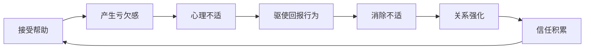
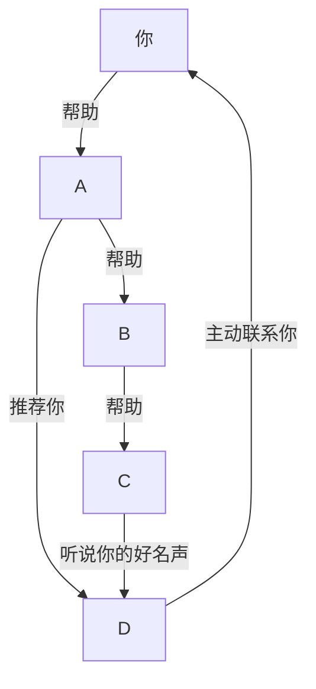

## 五、互惠原则（Reciprocity Principle）

互惠原则是社会心理学中最强大、最普遍的人际影响力机制。它揭示了一个深层真相：**人类天生倾向于回报他人给予的好处、善意或帮助，这种倾向跨越文化、年龄和时代，是人类社会得以运转的底层操作系统。**

理解互惠原则，不是为了学会"操控"他人，而是为了理解人际关系的本质规律——关系从来不是单向的索取或给予，而是一种动态的价值交换系统。掌握这一原则，你就能从"被动等待别人帮忙"转变为"主动构建互惠网络"，从而实现人脉经营的质变。

### 5.1 什么是互惠原则？

#### 5.1.1 经典定义

互惠原则（Reciprocity Principle）指的是：**当一个人给予另一个人某种好处时，接受者会产生一种强烈的、几乎是自动化的心理义务感，驱使自己在未来某个时刻回报这份好处。** 这种回报义务感的强度，通常远超好处本身的实际价值。

罗伯特·西奥迪尼（Robert Cialdini）在《影响力》（*Influence: The Psychology of Persuasion*）中将互惠原则列为六大影响力武器之首。他描述了一个经典实验：研究者在圣诞节期间给200多名完全陌生的人寄送圣诞贺卡。结果令人震惊——绝大多数收到贺卡的人（超过90%）都回寄了贺卡，尽管他们根本不认识寄卡者。一张价值几美分的贺卡，就能激发如此强烈的回报冲动，这说明互惠原则的驱动力远超理性的成本收益计算。

#### 5.1.2 互惠原则的三个核心特征

| 特征 | 说明 | 实际表现 |
|------|------|----------|
| **自动化** | 互惠反应几乎是无意识的，不需要深思熟虑 | 别人帮你开了门，你下意识说"谢谢"并想找机会回报 |
| **不对称性** | 回报的冲动往往超过好处的实际价值 | 西奥迪尼实验中，几美分的贺卡换来几美元的回寄 |
| **跨文化普遍性** | 在所有已知的人类社会中都存在 | 从原始部落到现代商业社会，互惠规范无处不在 |

#### 5.1.3 互惠原则与相关概念的辨析

很多人将互惠与"交换"、"交易"混为一谈，但它们有本质区别：

- **交换/交易**：明确的、即时的、等价的价值转移，如"我给你100元，你给我一件商品"
- **互惠**：模糊的、延迟的、非等价的价值转移，如"你帮了我一个忙，我欠你一个人情"
- **互惠利他**：进化生物学概念，指个体暂时牺牲自身利益帮助他人，期望未来获得回报

互惠的关键特点在于**时间差**和**价值模糊性**——你不知道对方什么时候会回报，也不知道回报的价值是否对等，但你依然有强烈的动机去给予。正是这种不确定性，使得互惠成为构建深度关系的强大引擎，而非简单的利益交换。

### 5.2 互惠原则的心理机制

#### 5.2.1 进化基础：互惠利他主义

互惠倾向并非后天学习的结果，而是人类进化过程中形成的深层心理机制。进化生物学家罗伯特·特里弗斯（Robert Trivers）在1971年提出的**互惠利他理论**（Reciprocal Altruism Theory）解释了这一机制的起源：

在远古环境中，食物获取不稳定、捕食风险高。那些愿意分享食物、在危险时互相帮助的群体，比各自为战的群体有更高的存活率。关键在于：**帮助行为虽然在短期内降低了给予者的收益，但在长期中通过被回报而获得了更高的总收益。**

这个进化逻辑产生了三个重要的心理机制：

1. **利他记忆**：人类对"谁帮助过我"有极强的记忆能力，这种记忆比一般事件记忆更持久、更准确
2. **欺骗检测**：人类能敏锐地识别"只索取不回报"的人，这种能力被称为"社会交换的欺骗检测机制"
3. **情绪触发**：接受帮助后产生的"亏欠感"是一种真实的情绪体验，类似于生理不适，驱使我们去消除它

#### 5.2.2 社会规范：互惠作为社会秩序的基石

在所有人类社会中，互惠都是一条基本的社会规范——不遵守互惠规范的人会被社会排斥。人类学家马塞尔·莫斯（Marcel Mauss）在《论礼物》（*Essai sur le don*，1925）中指出，礼物交换不仅仅是经济行为，更是社会关系的建构行为。他发现了礼物交换的三重义务：**给予的义务、接受的义务、回报的义务。**

社会规范层面的互惠有三个重要特征：

- **强制性**：不回报会被视为"忘恩负义"，遭到社交惩罚
- **公共性**：互惠行为通常是公开的，有社会见证
- **升级性**：回报的"价值"通常要略高于接受的好处，导致互惠螺旋式上升

#### 5.2.3 认知一致性：消除心理失调

社会心理学家利昂·费斯廷格（Leon Festinger）的认知失调理论（Cognitive Dissonance Theory）提供了互惠原则的另一个解释。当别人帮助了我们，如果我们不回报，就会产生两种相互矛盾的认知：

- 认知A："我是一个懂得知恩图报的好人"
- 认知B："我接受了别人的帮助却没有回报"

这两种认知的矛盾会产生心理上的不适感（认知失调）。为了消除这种不适感，最简单的方式就是**回报对方**，从而恢复认知一致性。这种心理机制解释了为什么即使是很小的好处也能激发回报行为——不是因为好处本身有多大，而是因为"不回报"带来的心理代价太高。

#### 5.2.4 神经科学证据

现代脑成像研究为互惠原则提供了神经科学层面的证据：

- **回报行为激活奖赏系统**：fMRI研究发现，当人们回报他人的好意时，大脑的腹侧纹状体（ventral striatum）和伏隔核（nucleus accumbens）会被激活——这些区域与获得金钱奖励时激活的区域相同。换句话说，**回报他人本身就能产生愉悦感。**
- **不回报激活痛苦系统**：当人们违背互惠规范时，前扣带皮层（anterior cingulate cortex）和脑岛（insula）会被激活——这些区域与社会排斥和身体疼痛相关。**不回报他人确实会让人"痛"。**
- **催产素的作用**：催产素（oxytocin）——一种与信任和社交联结相关的神经肽——在互惠行为中扮演重要角色。保罗·扎克（Paul Zak）的研究表明，催产素水平较高的人更倾向于信任他人和做出互惠行为。

### 5.3 互惠原则的六种形态

互惠不是单一的行为模式，而是包含多种形态。理解这些形态有助于在不同场景中灵活运用。

#### 5.3.1 物质互惠

最直观的互惠形态：给予对方实物或金钱价值的资源。

- 送礼物、请客吃饭、提供折扣
- 分享有价值的工具、模板、资源包
- 提供物质帮助（如借用设备、场地）

**关键原则**：物质互惠要适度，过度的物质给予会让人感到"被收买"，反而破坏关系。研究表明，价值较低但精心挑选的礼物，比昂贵但随意的礼物更能激发互惠反应。

#### 5.3.2 信息互惠

在知识经济时代，信息互惠是最高频、最有效的互惠形态：

- 分享行业报告、研究数据、市场洞察
- 推荐好书、好课程、好工具
- 提供对方可能不知道的机会、趋势、变化
- 转发与对方工作相关的文章并附上自己的见解

**信息互惠的优势**：成本低、传递快、个性化程度高、不带"收买"色彩。一条及时的行业信息，可能为对方节省数周的研究时间。

#### 5.3.3 情感互惠

情感层面的支持和认可是最容易被忽视、但效果最持久的互惠形态：

- 真诚的赞美和认可（具体到行为，而非泛泛之词）
- 在对方困难时提供情感支持
- 认真倾听对方的想法和困扰
- 在公开场合为对方背书、站台

**具体vs泛泛的对比**：

| 泛泛的赞美 | 具体的认可 |
|------------|------------|
| "你真厉害" | "你上次在会议上用数据反驳对手的方式特别有力，我学到了" |
| "你的产品不错" | "你们的用户引导流程设计得非常好，我注意到第三步的转化率应该很高" |
| "你人真好" | "上次我遇到困难时你二话不说帮我对接了资源，我一直记在心里" |

#### 5.3.4 社交资本互惠

将你的人脉资源转化为对他人的帮助：

- 引荐对方认识有价值的人
- 在社交场合主动介绍对方的成就和专长
- 为对方的项目或产品做背书
- 帮助对方进入某个圈子或社群

**社交资本互惠的杠杆效应**：你花5分钟写一封介绍邮件，可能为对方创造一个价值数十万的商业机会。这是所有互惠形态中杠杆率最高的。

#### 5.3.5 能力互惠

用自己的专业能力直接帮助对方解决问题：

- 帮对方写一段代码、设计一个方案
- 为对方提供专业的咨询建议
- 帮对方审核文件、把关质量
- 分享自己的方法论和工作流程

#### 5.3.6 战略互惠

在对方最需要的时机提供帮助，使互惠的影响力最大化：

- 在对方职业转型期提供关键的建议或机会
- 在对方创业初期提供资源支持
- 在对方遇到危机时伸出援手
- 在对方的关键节点（升职、融资、上市）给予支持

**时机的价值倍增效应**：同样一个帮助，在对方一帆风顺时给出可能只值"1分"，但在对方陷入困境时给出可能值"100分"。这解释了为什么"雪中送炭"远比"锦上添花"更能建立深厚的关系。

### 5.4 互惠原则在人脉经营中的实操框架

#### 5.4.1 先给予后索取：人脉经营的黄金法则

这是互惠原则最核心的应用。在请求帮助之前，先为对方提供价值。这不是虚伪的策略，而是一种长期的关系投资思维。

**具体操作步骤**：

1. **识别对方的需求**：通过日常交流、社交媒体、公开信息了解对方当前的挑战和需求
2. **匹配你能提供的价值**：从上述六种互惠形态中选择最适合的方式
3. **主动提供，不等被问**：主动出手比被动等待更有效
4. **保持适度，不过度**：给予太多会让人产生压力，适度即可
5. **耐心等待回报**：不要在给予后立即提出要求，给关系自然发展的时间

**回报等待期的参考框架**：

| 关系类型 | 建议等待期 | 说明 |
|----------|-----------|------|
| 新认识的人 | 至少3次互动后再提要求 | 需要先建立基本信任 |
| 普通朋友 | 1-3个月 | 确保之前的帮助已被对方感知 |
| 深度信任关系 | 可以较快提出，但要给对方说"不"的空间 | 高信任度降低互惠压力 |
| 职场关系 | 至少在对方认可你的价值之后 | 避免被视为"功利社交" |

#### 5.4.2 亚当·格兰特的三种社交风格

组织心理学家亚当·格兰特（Adam Grant）在《给予》（*Give and Take*）一书中，通过大量研究将人际互动风格分为三种：

| 风格 | 特征 | 长期结果 |
|------|------|----------|
| **给予者（Giver）** | 主动为他人提供帮助，不求即时回报 | 成功率最高和最低的都是给予者——差异在于是否设置了边界 |
| **索取者（Taker）** | 尽可能从他人那里获取价值，很少付出 | 短期可能成功，长期信誉崩塌 |
| **匹配者（Matcher）** | 严格遵循等价交换，你帮我我才帮你 | 稳定但难以突破性成长 |

格兰特的关键发现：**顶级给予者（成功者中比例最高）与底层给予者（失败者中比例最高）的区别，不在于给予的多少，而在于是否设置了边界。** 顶级给予者是"有策略的给予者"——他们慷慨但不盲目，帮助他人但保护自己的核心利益。

#### 5.4.3 互惠账本：管理你的互惠关系

虽然"记账式社交"听起来功利，但适度的互惠关系管理是必要的。这不是为了精确计算人情债，而是为了：

- **发现失衡**：识别那些经常帮助你但你尚未回报的人，及时补充
- **识别单向关系**：发现那些只索取不付出的人，调整投入
- **优化资源配置**：将有限的社交精力投入到互惠关系中

**互惠账本模板**：

关系名称：___________
对方帮助我的记录：
  - 日期 | 内容 | 价值评估（高/中/低）
  - ___  | ___  | ___
我帮助对方的记录：
  - 日期 | 内容 | 价值评估（高/中/低）
  - ___  | ___  | ___
当前互惠状态：平衡 / 我欠对方 / 对方欠我
下次行动建议：___________

**重要提醒**：互惠账本是管理工具，不是社交的本质。如果你发现自己在精确计算每一次帮助的价值，说明你已经偏离了健康社交的轨道。真正的互惠是自然流动的，账本只是帮助你保持觉察的辅助工具。

#### 5.4.4 建立"给予习惯"：从刻意到自然

互惠能力不是天赋，而是可以训练的习惯。以下是将"给予"从刻意行为转化为自动习惯的训练路径：

**第一阶段（1-30天）：刻意给予**

- 每天至少为一个人提供一个有价值的信息、建议或帮助
- 记录给予的内容和对方的反应
- 不期待任何回报，纯粹练习"给予"的肌肉

**第二阶段（31-90天）：选择性给予**

- 开始识别哪些人值得长期投入
- 根据对方的需求和你的能力，选择最有效的给予方式
- 从"广泛撒网"转向"精准投资"

**第三阶段（91天以后）：战略性给予**

- 建立系统性的互惠网络
- 在给予中嵌入长期的关系投资逻辑
- 成为一个"自然的给予者"——给予已经成为你的社交本能

### 5.5 互惠原则的高级应用

#### 5.5.1 互惠杠杆：用小投入撬动大回报

互惠杠杆的核心逻辑是：**在对方最需要的时刻，以较低的成本提供高感知价值的帮助，从而积累远超投入的"社会信用"。**

杠杆效应的三个关键要素：

1. **时机选择**：在对方困难、迷茫、刚起步时出手，价值感知倍增
2. **个性化匹配**：确保你提供的帮助精准匹配对方的需求
3. **低成本高感知**：选择那些对你成本不高、但对对方价值巨大的帮助方式

**案例分析**：

一位软件工程师在技术社区看到一位创业者发布了技术难题求助帖。工程师花了一个周末帮忙解决了问题，并额外写了技术方案文档。这位创业者后来融资成功，邀请工程师成为技术顾问，并给了期权。

这个案例的杠杆逻辑：工程师投入了一个周末的时间（低成本），解决了一个困扰创业者数周的技术难题（高感知价值），最终获得了远超投入回报的期权价值。

#### 5.5.2 互惠网络：好意在网络中的流动与放大

互惠不是一对一的线性关系，而是网络化的流动系统。当你帮助了A，A帮助了B，B又帮助了C——即使你和C没有直接关系，互惠网络也会间接为你创造价值。

**构建互惠网络的策略**：

1. **成为网络中的枢纽节点**：连接不同圈子的人，为他们创造互相帮助的机会
2. **传播善意而非截留**：当你收到帮助时，不仅回报给予者，还要将善意传递给更多人
3. **构建"给予者声誉"**：在社交网络中建立"乐于助人"的标签，这会吸引更多人主动与你建立联系
4. **利用弱关系网络**：弱关系（参考第二章）往往能带来更广泛的互惠网络，因为他们连接着你未曾触及的社交圈

#### 5.5.3 互惠文化：在团队和社群中系统性建设互惠

在团队或社群中建设互惠文化，可以显著提升整体的协作效率和信任水平。

**互惠文化的四大支柱**：

| 支柱 | 具体措施 | 预期效果 |
|------|----------|----------|
| **明确的互惠规范** | 在团队公约中明确"互相帮助"的行为准则；新人入职时强调互惠文化 | 降低"帮助他人是否值得"的决策成本 |
| **公开的认可机制** | 定期公开表扬帮助他人的行为；设立"最佳协作奖" | 通过社会认可强化互惠行为 |
| **搭便车治理** | 识别并处理"只索取不付出"的成员；设置贡献度追踪 | 防止"公地悲剧"，保护互惠系统的可持续性 |
| **领导者的示范** | 领导者率先垂范，主动帮助团队成员；分享自己的资源和人脉 | 上行下效，领导行为决定团队文化 |

**案例：桥水基金的"极端透明"互惠文化**

桥水基金（Bridgewater Associates）创始人瑞·达利欧（Ray Dalio）建立了一种极端透明的文化：所有会议都被录像，任何人都可以对任何人提出批评和建议。这种文化本质上是一种系统性的互惠——每个人都在给予"真实反馈"，同时也接受他人的反馈。这种互惠文化使得桥水成为全球最大的对冲基金之一。

#### 5.5.4 数字时代的互惠原则

在数字化社交时代，互惠原则的应用场景和形态都发生了显著变化：

**线上互惠的独特形态**：

- **内容互惠**：在社交媒体上分享有价值的内容、转发他人的作品并附上真诚的评论
- **连接互惠**：在LinkedIn、微信等平台上为人牵线搭桥
- **曝光互惠**：通过自己的平台为他人提供曝光机会（如邀请做客、推荐产品）
- **反馈互惠**：为他人的产品、内容提供详细的反馈和建议

**线上互惠的注意事项**：

1. **真诚度要求更高**：线上交流缺乏非语言线索，虚假的互惠更容易被识别
2. **公开性带来杠杆**：线上的互惠行为是公开的，一次帮助可能被成百上千人看到，声誉效应成倍放大
3. **持续性更重要**：线上的互惠需要持续维护，一次性的互动效果有限
4. **注意隐私边界**：在线上分享他人的信息时要注意隐私保护

### 5.6 互惠原则的误区与陷阱

#### 5.6.1 误区一：互惠就是"算账"

**错误表现**：每次帮助别人后都在心里记一笔账，期待精确等价的回报；如果对方没有"还清"人情就感到不满。

**纠正方法**：互惠是长期的、模糊的平衡，不是精确的等价交换。健康的心态是"我帮助别人是因为我有能力也有意愿，回报会在适当的时候以适当的方式到来"。

#### 5.6.2 误区二：过度给予以"购买"关系

**错误表现**：不停地送礼物、请客、帮忙，试图通过大量的付出来"绑定"对方。

**纠正方法**：过度给予不仅不能建立健康的关系，反而会让对方感到压力和不适。亚当·格兰特的研究表明，没有边界的给予者往往成为最失败的社交者。给予要适度，更要尊重对方的自主性。

#### 5.6.3 误区三：忽视"接受"的重要性

**错误表现**：只习惯给予，从不接受他人的帮助，认为接受帮助是"欠人情"或"示弱"。

**纠正方法**：接受他人的帮助本身就是一种互惠行为——它让对方感到自己"有价值"、"被需要"。拒绝他人的善意，实际上是在拒绝关系深化的机会。**健康的互惠是双向流动的。**

#### 5.6.4 误区四：将互惠视为操纵工具

**错误表现**：先给予一个小好处，然后立刻要求一个大回报；或者计算好"投入产出比"后再决定是否帮助别人。

**纠正方法**：操纵性的互惠会破坏信任。如果对方感觉到你的"善意"是有目的的，不仅不会产生互惠反应，反而会产生抗拒心理。真诚是互惠的前提——没有真诚的互惠，只是交易。

#### 5.6.5 误区五：忽视文化差异

**错误表现**：用同一套互惠策略应对不同文化背景的人。

**纠正方法**：不同文化对互惠的期望差异很大。例如：

- **中国**：人情文化根深蒂固，"人情债"有明确的社会规范，回报的时机和方式都有讲究
- **美国**：更倾向于即时互惠和明确的等价交换，"人情"的概念相对较弱
- **日本**：互惠高度仪式化，礼物交换有严格的礼仪规范（如"御中元"和"御歳暮"）
- **北欧**：互惠期望较低，过度的给予可能让人感到不适

#### 5.6.6 陷阱：被互惠操纵

有些人（尤其是销售人员和谈判高手）会刻意利用互惠原则来操纵你。常见的操纵手段包括：

- **免费试用/赠品**：先给你一个免费的产品或服务，然后要求你购买
- **意外的"好意"**：突然送你一个礼物或帮一个忙，然后提出请求
- **让步-回报**：先提出一个夸张的要求，然后"让步"到真实要求，利用你的回报心理让你接受

**防御策略**：

1. **识别意图**：当一个陌生人突然给予你好处时，问自己"对方想从我这里得到什么"
2. **分离行为与义务**：对方的给予是对方的选择，你没有义务回报——尤其当对方是在利用互惠原则时
3. **延迟决策**：在收到"好处"后不要立即做出承诺，给自己时间评估
4. **重新定义**：将对方的"好处"重新定义为"销售策略"而非"个人善意"，降低亏欠感

### 5.7 互惠原则的测量与评估

如何评估你的互惠能力是否在健康水平？以下是一个自评框架：

#### 5.7.1 互惠健康度自评表

对以下每项进行1-5分评分（1=完全不符合，5=完全符合）：

**给予维度**：
1. 我每周至少主动为他人提供一次有价值的帮助
2. 我的帮助是根据对方需求定制的，而非泛泛而为
3. 我帮助他人时不期待即时回报
4. 我善于发现他人的潜在需求并主动满足
5. 我有多种帮助他人的方式（信息、连接、能力、情感支持）

**接受维度**：
6. 我能够坦然接受他人的帮助而不感到不安
7. 我会主动寻求他人的帮助和建议
8. 我清楚地知道谁帮助过我，以及如何回报
9. 我在接受帮助后会及时表达感谢

**平衡维度**：
10. 我的社交关系中，给予和接受大致平衡
11. 我能够识别那些"只索取不付出"的人并调整投入
12. 我不会因为过度给予而让自己精疲力竭
13. 我的互惠行为是真诚的，而非策略性的操纵

**评分解读**：
- **55-65分**：互惠能力优秀，你是一个成熟的"策略性给予者"
- **40-54分**：互惠能力良好，可以在某些维度上继续提升
- **25-39分**：互惠能力需要改善，建议重点关注得分最低的维度
- **24分以下**：互惠能力严重不足，建议系统性地学习和练习

#### 5.7.2 互惠关系健康度评估

定期审视你的重要社交关系，评估互惠状态：

| 评估指标 | 健康信号 | 危险信号 |
|----------|----------|----------|
| 给予-接受比例 | 大致1:1，允许短期波动 | 长期严重失衡（>3:1或<1:3） |
| 回报时间差 | 自然合理，双方都舒服 | 一方总是拖延或从不回报 |
| 回报质量 | 真诚用心，有所匹配 | 敷衍了事，明显不对等 |
| 互动频率 | 稳定或增长 | 一方在回避或减少互动 |
| 情感质量 | 双方都感到舒适和满足 | 一方感到压力、怨恨或被利用 |

### 5.8 互惠原则与其他理论的整合

互惠原则不是孤立存在的，它与本章其他理论有着深刻的联系：

**互惠 × 社会资本理论**：互惠是社会资本的核心驱动力。每一次互惠行为都在积累信任和人情，而这些正是社会资本的核心组成。社会资本越丰富，互惠的机会和效果就越大，形成正向循环。

**互惠 × 弱关系理论**：弱关系（第二章）往往是互惠杠杆最大的地方。与强关系之间的互惠更多是"维持性互惠"，而与弱关系之间的互惠更可能是"突破性互惠"——一个弱关系的一次帮助，可能为你打开一个全新的世界。

**互惠 × 结构洞理论**：占据结构洞位置的人，天然拥有更多的互惠机会——你可以连接不同圈子的人，为他们创造价值，从而同时与多方建立互惠关系。

**互惠 × 社交网络分析**：在社交网络中，互惠率（reciprocity rate）是衡量网络健康度的重要指标。双向连接（A关注B，B也关注A）的比例越高，网络的信任和合作水平就越高。

**互惠 × 邓巴数**：邓巴数限制了你能维护的关系数量，但互惠原则决定了每段关系的质量。在有限的关系容量中，优先投入那些互惠活跃的关系，是最优的社交资源配置策略。

### 5.9 本节核心要点

1. **互惠是人类的底层心理机制**：它有进化基础、神经科学证据和社会规范支撑，不是后天的策略而是先天的倾向
2. **互惠有六种形态**：物质、信息、情感、社交资本、能力和战略互惠，不同场景需要不同的互惠方式
3. **先给予后索取是黄金法则**：但要有策略、有边界，避免成为"没有底线的给予者"
4. **警惕互惠陷阱**：识别操纵性互惠，保护自己的决策自主性
5. **互惠是网络化的**：好意在网络中流动和放大，你不需要与每个人都直接互惠
6. **文化差异影响互惠规范**：跨文化社交中要调整互惠策略
7. **真诚是互惠的基石**：没有真诚的互惠只是交易，不会产生深度关系

***

> **延伸阅读**：
> - 罗伯特·西奥迪尼《影响力》——互惠原则的经典之作
> - 亚当·格兰特《给予》——给予者如何在社交中获得长期成功
> - 罗伯特·特里弗斯《互惠利他主义的进化》——互惠的进化生物学基础
> - 马塞尔·莫斯《论礼物》——礼物交换的社会学经典
> - 保罗·扎克《信任因子》——信任和互惠的神经科学基础
