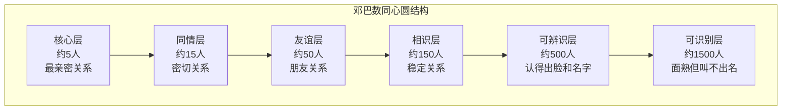
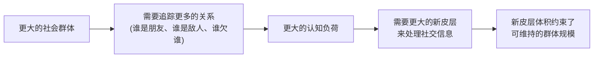

## 六、邓巴数（Dunbar's Number）

### 6.1 什么是邓巴数

英国人类学家罗宾·邓巴（Robin Dunbar）在20世纪90年代研究灵长类动物的社会行为时，发现了一个关键规律：**灵长类动物的新皮层（neocortex）体积与其社交群体规模呈显著正相关**。通过回归分析，他将这一规律外推到人类——按人类大脑新皮层的容量计算，人类能够维持的稳定社交关系数量上限约为 **150人**。

这个数字被称为"邓巴数"（Dunbar's Number），它不是一个精确的硬性限制，而是一个统计学上的最佳估计值，合理范围在 **100至230人** 之间。150代表的是大多数人在正常条件下能够维持的关系数量中心趋势。

邓巴在1992年首次提出这一假说，随后在1993年发表于《Journal of Human Evolution》的论文中正式论证，此后在《How Many Friends Does One Person Need?》（2010）和《Friends》（2021）等著作中不断扩展和完善了这一理论。

**邓巴数的核心含义不是"你最多能认识多少人"，而是"你能够维持多少段有意义的、双向的、包含信任和义务的社交关系"。** 认识一个人和维持一段关系是完全不同的两件事——前者只需要记忆，后者需要持续的时间、精力和情感投入。

### 6.2 邓巴数的六层同心圆结构

邓巴进一步发现，150并不是一个扁平的数字，社交关系天然呈现出 **同心圆层级结构**。每一层的人数大约是上一层的三倍（近似3:1比例），这一规律在不同文化和历史时期中高度一致：

#### 6.2.1 各层级详细特征

| 层次 | 人数 | 关系深度 | 互动频率 | 典型关系 | 时间投入占比 | 失去该关系的情感影响 |
|------|------|----------|----------|----------|------------|-------------------|
| **核心层** | 约5人 | 极深：共享脆弱性、无条件信任 | 每周多次，甚至每天 | 配偶、父母、子女、挚友 | 约40%的社交时间 | 极度悲伤，可能需要数年恢复 |
| **同情层** | 约15人 | 深：主动关心、情感投入 | 每周1-2次 | 好友、亲密同事、兄弟姐妹 | 约25%的社交时间 | 明显悲伤，数月影响 |
| **友谊层** | 约50人 | 中等：有感情基础、愿意帮忙 | 每月1-2次 | 普通朋友、前同事、邻居 | 约20%的社交时间 | 感到遗憾，但可接受 |
| **相识层** | 约150人 | 浅：知道对方背景和兴趣 | 每季度1-2次 | 认识的人、点头之交 | 约15%的社交时间 | 短暂惋惜 |
| **可辨识层** | 约500人 | 极浅：仅认出身份 | 每年1-2次或更少 | 偶尔见过的人、行业会议认识的人 | 极少 | 几乎无影响 |
| **可识别层** | 约1500人 | 几乎无：仅限面部识别 | 不定期，可能永远不再接触 | 面熟但叫不出名字的人 | 几乎为零 | 无影响 |

#### 6.2.2 层级之间的流动性

社交关系的层级不是固定不变的。理解层级之间的流动规律，是主动管理人脉的基础：

**向上流动（关系深化）**：
- 相识层 → 友谊层：需要至少3-5次有意义的互动，累计约10-20小时的共同经历
- 友谊层 → 同情层：需要经历共同挑战或困难，建立互惠信任，通常需要6-12个月
- 同情层 → 核心层：需要深度的情感共鸣和时间检验，通常需要数年

**向下流动（关系淡化）**：
- 超过6个月没有任何互动的关系，几乎必然降级一层
- 超过18个月无互动，可能从150人的相识层滑落到500人的可辨识层
- 关系降级是自然规律，不必过度焦虑，但需要有意识地决定哪些关系值得维持

### 6.3 邓巴数的科学基础

#### 6.3.1 新皮层比率假说（Neocortex Ratio Hypothesis）

邓巴的核心发现来自对灵长类动物的系统研究。他分析了38种灵长类动物的大脑数据，发现新皮层体积与群体规模之间的相关系数高达0.76。将这一回归模型外推到人类新皮层的体积，得出的预测群体规模恰好在150左右。

这一假说的逻辑链条如下：

关键数据点：黑猩猩的新皮层比率支持约50个个体的群体，大猩猩约30个，而人类的比率支持约150个。

#### 6.3.2 时间分配约束模型

邓巴数不仅是认知限制，更是**时间预算**的必然结果。这是理解邓巴数最关键的实证基础。

2007年，邓巴团队使用"时间分配日记"追踪了英国利兹地区居民的社交活动，发现：

- 每个人每周大约有 **540分钟**（约9小时）可用于社交活动（不含工作中的被动社交）
- 维持一段"稳定关系"平均需要 **每月至少一次有意义的互动**，每次互动约2-3小时
- 如果每月与150个人分别互动一次，需要约300-450小时，远超可用时间

**实际的时间约束计算：**

每周社交时间预算: ~540分钟
每年社交时间预算: ~540 × 52 = ~28,080分钟 ≈ 468小时

维持一层关系所需的时间:
  核心5人 × 每周3小时 = 每年780小时  ← 已超预算!
  同情15人 × 每月4小时 = 每年720小时
  友谊50人 × 每季度4小时 = 每年200小时
  相识150人 × 每年4小时 = 每年600小时

这说明核心层和同情层的关系已经占用了大部分社交时间预算，这正是为什么更外层的关系只能维持浅层互动——不是不想深入，而是时间不允许。

#### 6.3.3 神经影像学证据

现代脑成像研究进一步验证了邓巴数的神经基础：

**社交脑网络（Social Brain Network）**：

| 脑区 | 功能 | 与邓巴数的关系 |
|------|------|---------------|
| 前额叶皮层（PFC） | 推理他人意图、规划社交行为 | 损伤后社交网络显著缩小 |
| 颞顶联合区（TPJ） | 心智理论（Theory of Mind） | 体积与社交网络大小正相关 |
| 内侧前额叶皮层（mPFC） | 自我反思、理解他人视角 | 活跃度与亲密关系数量相关 |
| 杏仁核 | 情感处理、威胁检测 | 体积与社交网络复杂度相关 |
| 前扣带回皮层（ACC） | 冲突监控、社交疼痛处理 | 在社交排斥时高度活跃 |

2012年发表在《Nature Neuroscience》上的研究（Bickart et al.）发现，杏仁核体积较大的个体拥有更大的社交网络，这直接支持了"社交脑"假说。

2016年的一项fMRI研究更进一步发现，当被试者被要求对150个认识的人进行分类时，大脑激活模式存在明显的三个层级——核心层、中间层和外围层，对应邓巴的层级结构。

#### 6.3.4 工作记忆与社交容量

米勒的"神奇数字7±2"（Miller's Magic Number）描述了工作记忆的容量限制。虽然工作记忆容量与邓巴数的直接关系仍在研究中，但已有证据表明：

- 社交记忆（记住某人的姓名、外貌、关系历史、共同经历）需要占用工作记忆
- 维持一段关系需要在心理上保持对对方状态的追踪（"他最近怎么样""他上次说什么来着"）
- 当关系数量超过大脑的追踪能力时，信息衰减导致关系自然淡化

### 6.4 历史与跨文化验证

邓巴数之所以被广泛接受，不仅因为神经科学证据，更因为它在人类历史和不同文化中的反复验证。

#### 6.4.1 历史验证

| 验证对象 | 规模 | 时间/来源 |
|----------|------|----------|
| 新石器时代村落 | 约120-150人 | 考古学证据，近东地区 |
| 罗马军队百人队（centuria） | 约120-130人 | 罗马共和国时期 |
| 中世纪英国村庄 | 约150人 | 《末日审判书》（1086年） |
| 澳大利亚原住民狩猎部落 | 约150人 | 人类学田野调查 |
| 哈特派（Hutterites）社群 | 约150人后分裂 | 宗教社群研究 |
| 圣诞贺卡网络 | 约150张 | 英国社会学家研究 |
| 暴雪《魔兽世界》公会 | 约150人活跃成员 | 2010年研究（Gonçalves et al.） |
| 推特（Twitter）活跃互动圈 | 约100-200人 | 社交媒体研究 |

哈特派社群的案例尤其有说服力：这个实行财产共有制的宗教团体，每当社群人数超过150人时，就会主动进行分裂。他们的领袖发现，超过这个规模后，社群内部的凝聚力、信任度和自觉遵守规则的程度都会显著下降。

#### 6.4.2 跨文化一致性

邓巴团队在多个国家和文化中进行了验证研究：

- **英国**：圣诞贺卡发送名单平均约150人（1997年，Hill & Dunbar）
- **美国**：大学生社交网络约140-160人（多个复制研究）
- **中国**：微信活跃联系人中位数约130-170人（多项独立研究）
- **巴布亚新几内亚**：传统村庄规模约150人
- **纳米比亚**：游牧部落规模约150人

**关键发现**：不同文化中的数字在100-230的范围内波动，但中位数始终接近150。这个范围的变异主要取决于生活环境（城市vs农村）、职业（社交密集型vs独立工作型）和个人性格（外向vs内向）。

#### 6.4.3 邓巴数在组织管理中的验证

企业组织结构的实践也间接验证了邓巴数：

- 当团队规模超过150人时，管理者不得不引入正式的层级结构、流程和规则来弥补非正式社交纽带的缺失
- 戈尔公司（W.L. Gore & Associates）刻意将工厂规模限制在150人以内，超过即另建新厂
- Valve 公司的扁平化管理模式在公司规模超过150人后面临显著挑战
- 军队中一个连（company）的典型编制约100-150人，正好对应邓巴数

### 6.5 社交媒体时代的邓巴数

#### 6.5.1 "好友膨胀"的真相

社交媒体平台让"好友数量"变成了一个可以被展示和比较的数字，但大量研究表明，线上联系人数量与实际维持的关系数量之间存在巨大鸿沟：

| 平台 | 平均联系人数 | 活跃互动人数 | 真正稳定关系数 |
|------|------------|------------|--------------|
| 微信 | 300-500 | 80-150 | 50-100 |
| 微博 | 200-1000 | 20-50 | 10-30 |
| Facebook | 300-500 | 60-120 | 40-80 |
| LinkedIn | 200-800 | 10-30 | 5-20 |
| Twitter | 100-1000 | 10-30 | 5-15 |

2016年Facebook发表的内部研究显示，即使在拥有数百好友的用户中，他们实际在一个月内有过互动的好友中位数仅为 **约100-200人**，与邓巴数高度吻合。

#### 6.5.2 数字工具对邓巴数的影响

**社交媒体能做到的：**
- 延缓关系衰减：即使不主动联系，看到对方的动态也能维持微弱的社会连接
- 降低弱关系维护成本：点赞、评论等轻量互动可以让关系不至于完全消失
- 帮助快速重建连接：多年不联系的朋友通过社交媒体重新建立联系的门槛大幅降低

**社交媒体做不到的：**
- 扩大核心层和同情层的容量：这两层仍然严格受限于面对面互动的时间
- 替代深度社交互动：语音、视频通话虽好，但仍无法完全替代面对面的非语言交流
- 创造真正的亲密关系：亲密关系需要共享脆弱性，这在社交媒体的"表演性"环境中很难实现

#### 6.5.3 注意力经济对社交关系的侵蚀

现代人每天平均花3-4小时在社交媒体上，但这段时间的大部分消耗在被动浏览（刷信息流）而非主动社交（与特定的人互动）。这意味着：

- 社交媒体表面上在帮助我们社交，实际上在用被动消费的时间**挤占**了主动社交的时间
- 被动浏览他人精心策划的生活片段反而可能加剧孤独感和社交焦虑
- 碎片化的浅层互动（表情包、点赞）无法替代深度对话的情感连接功能

### 6.6 邓巴数的实践应用框架

#### 6.6.1 人脉分层盘点法

理解邓巴数的第一步是对自己现有的社交关系进行一次诚实的盘点。

**操作步骤：**

**第一步：列出所有你认识的人**
打开你的微信通讯录、手机联系人、邮件联系人，把所有你能在30秒内回忆起对方是谁的人列出来。这个数字可能在200-500之间。

**第二步：分类标注**
为每个人标注一个层级：

评估维度（每项1-5分）：
1. 互动频率：每天(5) / 每周(4) / 每月(3) / 每季度(2) / 每年(1)
2. 情感深度：无话不谈(5) / 分享感受(4) / 聊近况(3) / 寒暄(2) / 仅认识(1)
3. 互惠程度：随时可求助(5) / 通常会帮(4) / 看情况(3) / 不确定(2) / 不会(1)
4. 信任程度：完全信任(5) / 高度信任(4) / 一般信任(3) / 不太信任(2) / 不信任(1)

综合评分 = (维度1 + 维度2 + 维度3 + 维度4) / 4

评分对照：
4.0-5.0 → 核心层
3.0-3.9 → 同情层
2.0-2.9 → 友谊层
1.5-1.9 → 相识层
1.0-1.4 → 可辨识层/可识别层

**第三步：统计各层级人数**
检查你的各层级人数是否接近邓巴数的1:3:15:50:150比例。如果偏差过大（比如核心层有20人），说明你可能对关系深度的判断有误差，或者你的社交资源分配存在结构性问题。

**第四步：识别空缺和过载**
- 核心层是否不足5人？如果有重大变故，你有可以无条件依靠的人吗？
- 某一层级是否严重过载？比如认识了500人但都停留在点头之交，是否应该选择性地深化部分关系？
- 是否有"伪核心层"？某些人占据了核心层的位置，但关系实际上并不对等或健康？

#### 6.6.2 时间分配策略

根据邓巴数的时间约束模型，合理分配社交时间：

每周社交时间预算分配建议（总计约9小时/周）：

核心5人: 40% → 约3.6小时/周
  ├── 每人每周约45分钟的高质量互动
  └── 形式：深度对话、共同活动、面对面聚餐

同情15人: 25% → 约2.25小时/周
  ├── 每人每月约45分钟
  └── 形式：电话/视频聊天、定期约饭、一起运动

友谊50人: 20% → 约1.8小时/周
  ├── 每人每季度约45分钟
  └── 形式：群聊互动、偶尔聚餐、节日问候

相识150人: 15% → 约1.35小时/周
  ├── 每人每年约30分钟
  └── 形式：朋友圈互动、节日祝福、行业活动交流

**关键原则：不要试图平均分配时间。** 邓巴数的意义在于告诉你资源是有限的，必须做出选择。宁可深维护50人，也不要浅维护500人。

#### 6.6.3 关系维护的"最小有效剂量"

每段关系维持其所在层级所需的最低互动量，称为"最小有效剂量"：

| 层级 | 最小有效剂量 | 失效窗口 | 降级后的恢复难度 |
|------|------------|---------|----------------|
| 核心层 | 每周至少1次深度互动 | 超过2周无互动即可能产生裂痕 | 需要真诚道歉和持续投入 |
| 同情层 | 每月至少1次有意义的互动 | 超过6周无互动开始淡化 | 需要一次深度交流重新激活 |
| 友谊层 | 每季度至少1次互动 | 超过6个月无互动降为相识层 | 需要找到共同话题重新连接 |
| 相识层 | 每年至少1次互动 | 超过18个月可能完全遗忘 | 几乎需要重新认识 |

**实操建议：**
- 对于核心层5人，建立固定的互动节奏（比如每周日晚上通话、每周五一起吃饭）
- 对于同情层15人，在日历中设置每月提醒，轮流联系
- 对于友谊层50人，利用节日、生日、对方重大事件作为互动触发器
- 对于相识层150人，利用社交媒体的轻量互动维持存在感

#### 6.6.4 数字工具辅助管理

虽然邓巴数限制了深度关系数量，但数字工具可以帮助你更高效地管理浅层关系：

**轻量级工具（适合大多数人）：**

| 工具类型 | 推荐工具 | 适用场景 |
|----------|---------|---------|
| 联系人备注 | 微信标签 + 备注 | 标注认识场景、共同兴趣、对方近况 |
| 日历提醒 | Google Calendar / Apple Calendar | 关键人物的生日、重要日期提醒 |
| 笔记追踪 | Notion / Obsidian | 记录每次互动的要点、对方提到的需求 |
| 关系管理 | 轻流 / 简道云 | 自定义联系人CRM，追踪互动历史 |

**专业级工具（适合销售、商务拓展人员）：**

| 工具 | 核心功能 | 适合谁 |
|------|---------|-------|
| HubSpot CRM | 联系人管理、互动追踪、自动化提醒 | 商务人士、销售人员 |
| Notion关系数据库 | 自定义字段、关联视图、提醒 | 喜欢DIY系统的人 |
| Clay.earth | 个人关系管理、AI辅助维护 | 需要管理大量弱关系的人 |
| Dex | 跨平台联系人整合、互动提醒 | 需要统一管理多个平台联系人的人 |

**不要过度工具化。** 工具是辅助，不是目的。如果你发现自己花在"管理关系"工具上的时间超过了实际与人互动的时间，那就本末倒置了。

### 6.7 邓巴数与性格差异

邓巴数150是一个群体平均值，个体差异客观存在：

#### 6.7.1 外向者 vs 内向者

| 维度 | 外向者 | 内向者 |
|------|--------|--------|
| 稳定关系数量 | 可能接近或略超150 | 可能在80-120之间 |
| 核心层深度 | 可能更分散 | 可能更深但更少 |
| 社交能量来源 | 社交互动本身 | 独处后重新充电 |
| 最大挑战 | 关系太浅、缺乏深度 | 关系太少、错失机会 |
| 应对策略 | 刻意深化核心关系 | 刻意扩大舒适区边缘的关系 |

#### 6.7.2 职业因素

不同职业对邓巴数的利用方式不同：

- **销售/商务拓展**：需要最大化相识层（150人）和可辨识层（500人）的覆盖范围，弱关系是商业机会的主要来源
- **技术研发**：核心层和同情层的质量更重要，深度技术讨论需要强关系
- **管理/领导**：需要平衡各层级，核心团队（5人）的质量直接决定团队效能
- **创业**：早期核心层的质量决定创业能否存活，中后期需要大量弱关系获取资源和机会

### 6.8 关于邓巴数的常见误解

#### 误解一："邓巴数意味着我只能有150个朋友"

**纠正**：邓巴数指的是"稳定社交关系"的上限，不是"朋友"的上限。你可以认识更多人，也可以拥有更多的线上联系人，但你在大脑中真正追踪其生活状态、能够在需要时回忆起其背景信息的人数，大约在150左右。150人中也只有约50人是你会称之为"朋友"的。

#### 误解二："150是一个固定不变的硬限制"

**纠正**：150是一个统计平均值，个体差异范围在100-230之间。而且这个数字会受到生活方式、职业、性格、社交技能等因素的影响。有些人可能天然能维持200人的关系网络，有些人可能只能维持100人，这都是正常的。

#### 误解三："社交媒体突破了邓巴数"

**纠正**：社交媒体确实帮助维持了更多弱关系，但研究反复证明，人们在社交媒体上真正有双向互动的人数仍然在150左右。线上的"好友数"和实际维持的关系数是两回事。社交媒体延长了关系衰减的时间，但没有扩大核心关系的容量。

#### 误解四："邓巴数说明人际关系是量化的、冷冰冰的"

**纠正**：邓巴数描述的是人类社交能力的生物学限制，不是社交的"配额"。它不是说你应该把人际关系当成数字来管理，而是帮你理解为什么你和某些人更亲密、为什么有些关系会自然淡化——这是大脑的自然机制，不是你的失败。

#### 误解五："邓巴数只适用于线下社交"

**纠正**：邓巴数最初基于面对面社交研究，但后续研究表明它同样适用于线上社交网络。Facebook 2016年的内部研究确认，即使在纯线上环境中，活跃互动人数的中位数仍然落在邓巴数的范围内。

### 6.9 邓巴数与其他社交理论的关系

#### 6.9.1 与格兰诺维特"弱关系的力量"的互补

马克·格兰诺维特（Mark Granovetter）在1973年提出"弱关系的力量"理论，指出弱关系（不太亲密的联系人）在信息传播和机会获取方面比强关系更有价值。

邓巴数和弱关系理论并不矛盾，而是互补的：

- 邓巴数告诉你**资源是有限的**——你不可能和所有人都建立强关系
- 弱关系理论告诉你**弱关系也有巨大价值**——所以不要忽视150人之外的500人和1500人
- 两者的交集是：**有策略地分配有限的社交资源，在保证核心层质量的前提下，最大化弱关系网络的覆盖面**

#### 6.9.2 与社会资本理论的关联

罗伯特·帕特南（Robert Putnam）区分了"桥接型社会资本"（bridging）和"结合型社会资本"（bonding）：

- **结合型**：对应邓巴数的核心层和同情层，提供情感支持、信任和归属感
- **桥接型**：对应邓巴数的相识层和可辨识层，提供新信息、新机会和新视角

健康的人脉网络需要两种社会资本的平衡。过度投入结合型关系可能导致"同质化陷阱"（只和相似的人来往），过度投入桥接型关系可能导致"浅社交"（认识很多人但没有深度连接）。

#### 6.9.3 与"结构洞"理论的互补

罗纳德·伯特（Ronald Burt）的"结构洞"（Structural Holes）理论指出，在社交网络中处于不同群体之间"桥梁"位置的人，拥有信息优势和控制优势。

结合邓巴数，这意味着：
- 在你的150人中，尽量让这些关系**分散在不同的社交圈**中，而不是集中在同一个群体
- 核心层5人如果都来自同一个圈子（比如都是同事），你的情感支持系统是脆弱的
- 相识层150人如果覆盖了5个不同的圈子（行业、兴趣、社区、校友、家庭），你的信息获取能力和机会来源会远超150人都来自同一圈子的情况

### 6.10 实战案例

#### 案例一：程序员小王的人脉优化

小王是一名互联网公司的后端工程师，社交圈很窄。他进行邓巴数盘点后发现：

- 核心层：2人（女友、母亲）——不足
- 同情层：6人（3个大学同学、3个同事）——不足
- 友谊层：20人——不足
- 相识层：约80人——低于150人

**问题**：核心层过少意味着缺乏多元的情感支持，一旦其中一段关系出现问题（和女友吵架），整个情感支撑系统就会动摇。相识层不足意味着信息渠道狭窄、职业机会有限。

**优化方案：**
1. 核心层：每周固定时间和大学好友进行深度视频聊天，将1-2个同情层朋友升格
2. 同情层：加入一个线下技术社区，每月参加活动，将新认识的2-3人从相识层升格
3. 友谊层：利用技术博客和开源社区，扩展同行业弱关系
4. 相识层：参加行业会议、线上社区，目标从80人扩展到150人

#### 案例二：销售总监李姐的关系网络重构

李姐是一名企业销售总监，微信好友超过2000人，但盘点后发现：

- 核心层：8人——过多，精力被稀释
- 同情层：30人——过多，维护困难
- 友谊层：约200人——严重超出50人上限
- 相识层：无法确认——混乱

**问题**：层级边界模糊，导致大量社交时间被低效分配。认识的人很多，但缺乏深度关系。

**优化方案：**
1. 核心层：从8人精简到5人，将3人降级但不疏远
2. 同情层：从30人精简到15人，选择对职业发展和情感健康最有价值的人
3. 友谊层：从200人中筛选50人重点维护，其余降为相识层
4. 使用CRM工具（HubSpot）系统管理相识层关系，设置互动提醒
5. 每季度进行一次关系盘点，动态调整

### 6.11 小结

邓巴数揭示了一个深刻的真相：**人类的社交资源是有限的，而且这个限制是由我们的大脑结构决定的，几乎无法改变。** 这不是一个悲观的结论——恰恰相反，理解了这个限制，你就可以：

1. **停止焦虑**：不必为无法和所有人保持亲密联系而内疚，这是人类的共同限制
2. **聚焦质量**：将有限的时间和精力投入到最重要的关系中，而不是试图面面俱到
3. **有策略地扩展**：在保证核心关系质量的前提下，有意识地扩展弱关系网络
4. **接受自然规律**：有些关系会自然淡化，这是正常的社交代谢，不必强行挽留
5. **善用工具**：数字工具可以帮你更高效地管理关系，但不能突破生物学限制

最终，邓巴数教给我们的不是"你能有多少朋友"，而是**"你应该把有限的生命花在哪些人身上"**。这不是一个数字问题，而是一个价值观问题。
