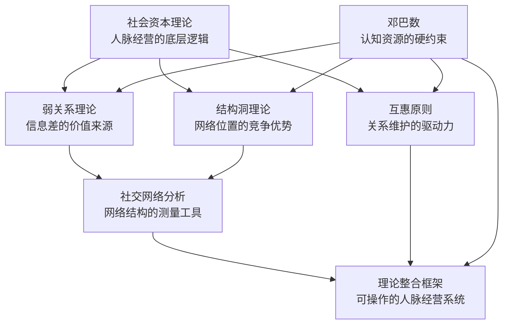
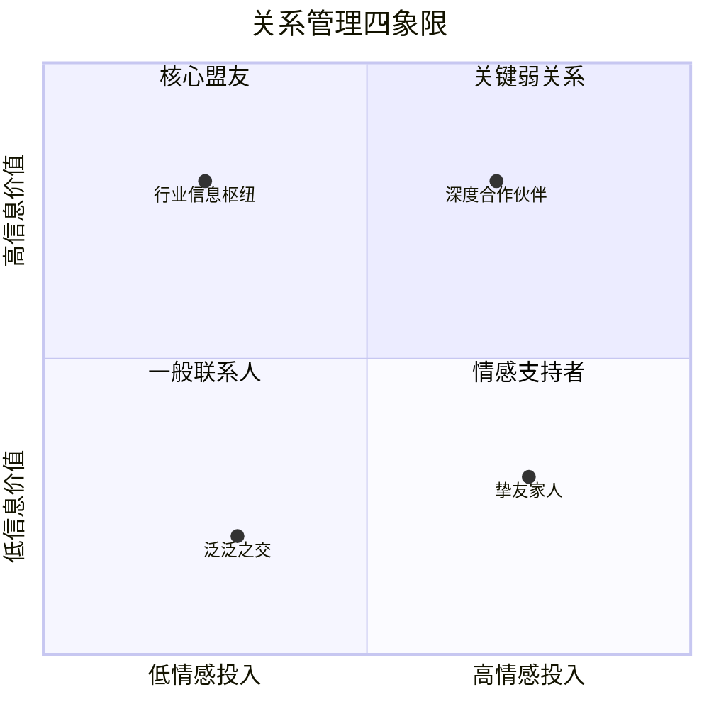
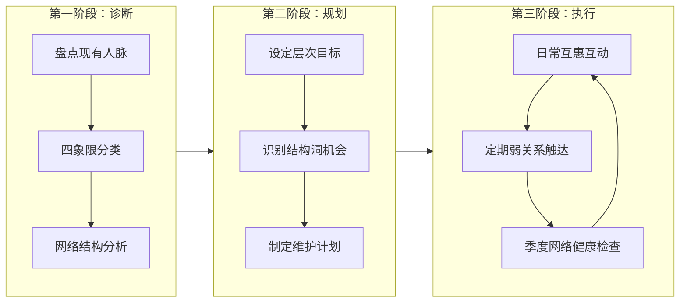

## 七、理论整合：人脉经营的核心框架

前六节分别介绍了社会资本理论、弱关系理论、结构洞理论、社交网络分析、互惠原则和邓巴数。单独来看，每一条理论都能解释人脉经营的某个侧面；但如果只掌握其中一两条，就容易陷入"盲人摸象"的困境——你可能花大量精力维护强关系，却忽视了弱关系带来的信息差；你可能疯狂拓展弱关系，却突破了邓巴数的认知极限，导致所有关系都浮于表面。

本节的核心任务是：**将六条理论编织成一张完整的、可操作的人脉经营框架**，让你在面对任何社交决策时，都能从多个理论视角进行交叉验证，做出更优的选择。

### 7.1 六大理论的关系图谱

六条理论并非相互独立的平行知识点，它们之间存在清晰的逻辑层次和因果关系。理解这些关系，是整合的前提。



每条理论在框架中的角色：

| 理论 | 回答的核心问题 | 在框架中的角色 |
|------|---------------|---------------|
| 社会资本理论 | 人脉为什么有价值？ | **本体论**——定义了人脉经营的目标：积累和转化社会资本 |
| 弱关系理论 | 哪些关系能带来新机会？ | **选择标准**——指导你应该重点投资哪些关系 |
| 结构洞理论 | 在网络中处于什么位置最有利？ | **布局策略**——指导你如何构建自己的网络结构 |
| 社交网络分析 | 我的网络现状如何？ | **诊断工具**——提供量化评估网络健康度的方法论 |
| 互惠原则 | 如何让关系持续运转？ | **运营机制**——提供维持关系活力的动力学模型 |
| 邓巴数 | 我的精力能支撑多大的网络？ | **资源约束**——设定管理边界，防止贪多嚼不烂 |

把这六条理论看作一个"经营系统"：社会资本理论告诉你**为什么要做**，弱关系理论和结构洞理论告诉你**做什么**，社交网络分析告诉你**怎么衡量**，互惠原则告诉你**怎么维持**，邓巴数告诉你**做多少**。

### 7.2 关系管理矩阵：四象限分类法

将弱关系理论（信息价值）和互惠原则（情感投入）两个维度交叉，可以得到一个实用的关系管理矩阵。这个矩阵不是理论推导的产物，而是一个日常可用的分类工具。



用表格形式更方便日常对照使用：

| | 高情感投入 | 低情感投入 |
|---|---|---|
| **高信息价值** | **核心盟友**（强关系 + 高价值）——人生挚友、长期合伙人、深度信任的行业前辈。双向信息共享、资源整合、危机时的铁杆支撑。 | **关键弱关系**（弱关系 + 高价值）——不同行业的信息枢纽、偶尔联系的猎头/投资人/跨界专家。保持轻量互动即可获取关键信息差。 |
| **低信息价值** | **情感支持者**（强关系 + 低信息价值）——家人、发小、多年老友。在信息和资源层面回报有限，但提供情感安全感和归属感。 | **一般联系人**（弱关系 + 低信息价值）——社交场合认识的泛泛之交、群聊中的陌生人。投入产出比最低，定期清理。 |

**四象限的经营策略差异：**

**核心盟友**——投入最多的时间和精力。定期深度交流（每周/每两周一次一对一），主动分享资源和信息，在对方需要时提供实质性帮助。这部分关系的质量直接决定了你社会资本的"厚度"。维护方式：固定周期的一对一深度对话、共同参与项目、互相引荐人脉。

**关键弱关系**——用最少的时间成本维持最大的信息触达面。核心操作是"轻触达"：每1-3个月发一条有价值的信息（不是寒暄，而是对方真正感兴趣的内容），每年至少见面一次。关键弱关系的维护原则是**质量优先于频率**——一次高质量的互动胜过十次客套的寒暄。

**情感支持者**——不需要刻意经营，但绝不能忽视。这部分关系的核心价值是心理健康和幸福感。维护方式：定期陪伴、节假日问候、在对方遇到困难时主动出现。不需要信息交换，只需要"在场"。

**一般联系人**——定期清理。邓巴数的约束意味着，你花在一般联系人身上的每一分精力，都是从核心盟友和关键弱关系身上"偷"来的。每季度评估一次，将其中可能有潜力升级的个别联系人提升到其他象限，其余的逐步淡化。

### 7.3 人脉经营的六大整合原则

将六大理论的精华提炼为六条可执行的经营原则。每条原则都不是孤立的建议，而是多条理论交叉验证后的结论。

#### 7.3.1 原则一：分层管理——以邓巴数为硬约束

**理论依据**：邓巴数理论揭示了人类认知能力的物理极限。你的大脑能够维持的稳定关系总量约为150人，且这些关系天然形成分层结构（5/15/50/150）。

**实操方法**：

| 层次 | 人数 | 定义 | 维护频率 | 维护方式 |
|------|------|------|----------|----------|
| 核心圈 | 3-5人 | 生命中最重要的人，可以随时打电话求助 | 随时 | 面对面、电话、即时通讯，不限形式 |
| 亲密圈 | 10-15人 | 值得信赖的朋友和关键合作者 | 每周1-2次 | 一对一深度交流、共同活动 |
| 熟悉圈 | 35-50人 | 稳定的同事、合作伙伴、定期联系的朋友 | 每月1-2次 | 聚会、群组互动、信息分享 |
| 认知圈 | 100-150人 | 认识且保持基本联系的人 | 每季度1次 | 社交媒体互动、节日问候、偶尔约见 |

**关键执行要点**：

1. **先把人放进正确的层次**。拿出一张纸（或打开电子表格），把你目前所有认识的人分类。这个过程本身就是一次重要的自我认知。很多人发现自己80%的时间花在了认知圈和一般联系人身上，而核心圈的人反而被冷落了。

2. **严格控制每层的人数上限**。核心圈超过5人，你就无法对每个人投入足够的深度；亲密圈超过15人，你的精力就会被过度稀释。如果有人要进入更高层次，就必须有人降到更低层次——这是残酷但必要的取舍。

3. **低层次的关系可以向高层次升级，但需要"试用期"**。不是所有熟人都适合成为密友。通过多次高质量互动，观察对方的价值观、可靠度和互惠意愿，再决定是否升级。

#### 7.3.2 原则二：弱关系投资——以信息差为核心目标

**理论依据**：格兰诺维特的弱关系理论证明，弱关系是获取新信息、新机会的主要渠道。你的强关系圈往往信息同质化严重（你们关注同样的领域、参加同样的活动、认识同样的人），而弱关系能把你连接到完全不同的信息世界。

**实操方法**：

1. **主动识别高价值弱关系**。不是所有弱关系都值得投资。高价值弱关系通常具备以下特征：
   - 处于与你不同的行业或领域
   - 本身就是某个领域的信息枢纽（认识很多人）
   - 有主动分享信息的习惯
   - 对你所在领域有一定的好奇心

2. **建立"弱关系维护系统"**。不要依赖随机偶遇。具体方法：
   - 维护一份"关键弱关系清单"，记录每个人的核心领域、最近交流内容
   - 设定每1-3个月的定期触达提醒
   - 每次触达时提供价值（分享一篇文章、推荐一个机会、介绍一个认识的人），而不是只说"好久不见"
   - 使用LinkedIn、微信朋友圈等社交媒体保持低频但持续的可见性

3. **在社交场合中优先拓展弱关系**。参加行业会议、跨领域沙龙、校友聚会时，有意识地与不同背景的人交流。目标不是当场建立深度关系，而是交换联系方式并留下一个印象。

#### 7.3.3 原则三：结构洞思维——占据信息桥梁位置

**理论依据**：伯特的结构洞理论揭示了一个更深层的真相——竞争优势不仅取决于关系数量，更取决于你在网络结构中的位置。当你连接了两个彼此不相连的群体时，你就占据了一个结构洞位置，能够获得信息优势和控制优势。

**实操方法**：

1. **诊断你当前的网络结构**。问自己：
   - 你的朋友之间是否彼此认识？（如果大部分都认识，你的网络同质化严重）
   - 你是否认识来自不同行业、不同背景的人？
   - 你的社交网络中，是否存在明显的"断层"——两个群体之间没有连接？

2. **有意识地桥接不同群体**。具体操作：
   - 成为"介绍人"——当你发现两个朋友有共同利益但彼此不认识时，主动介绍他们认识
   - 参加跨领域的活动，将你的A圈子的信息带入B圈子
   - 在公司内部，成为不同部门之间的信息桥梁

3. **避免成为"被绕过的桥梁"**。结构洞位置的价值在于"排他性"。如果你桥接的两个群体后来建立了直接联系，你的桥梁价值就消失了。因此，你需要持续提供超越"连接"本身的附加价值——比如对两个群体的信息进行整合分析，提供独到的见解。

#### 7.3.4 原则四：社会资本积累——长期主义视角

**理论依据**：社会资本理论强调，社会资本是一种"储备性资源"——你在关系良好的时候积累的信任、善意和人情，在未来某个时刻会以机会、支持和资源的形式回报给你。

**实操方法**：

1. **建立"社会资本账户"概念**。把每一段重要关系想象成一个银行账户：
   - 存款：提供帮助、分享信息、表达关心、兑现承诺
   - 取款：请求帮助、索要资源、占用对方时间
   - 账户余额：双方的信任水平和互惠历史

2. **保持"存款 > 取款"的基本原则**。在每一段重要关系中，确保你提供的价值大于你索取的价值。这不意味着你要做"老好人"，而是说在关系的早期阶段和维护阶段，给予应该大于索取。

3. **记录关键的"社会资本事件"**。不需要事无巨细地记录，但以下几类事件值得标记：
   - 谁帮过你一个大忙（你欠了人情）
   - 你帮过谁一个大忙（对方欠了人情）
   - 重要的承诺和约定
   - 关系中的关键转折点

#### 7.3.5 原则五：互惠驱动——建立正向循环

**理论依据**：互惠原则是关系维系的核心动力机制。西奥迪尼的研究表明，互惠不仅是理性计算的结果，更是一种深层的心理冲动——人们收到好处后会产生强烈的回报欲望，即使这种好处并非主动请求的。

**实操方法**：

1. **主动发起互惠循环**。不要等到别人先帮你，你再回报。主动成为第一个"给予者"：
   - 分享有价值的信息
   - 在对方不知情的情况下为其说好话
   - 主动介绍可能对对方有用的人脉
   - 在对方遇到困难时第一时间出现

2. **匹配互惠的"货币类型"**。不同的人对不同类型的互惠敏感度不同：
   - 信息型：分享行业动态、内部消息、专业见解
   - 资源型：介绍人脉、推荐机会、提供平台
   - 情感型：倾听、鼓励、陪伴、认可
   - 技能型：提供专业建议、帮忙解决技术问题

3. **避免互惠的陷阱**：
   - **即时回报压力**：有些人收到好处后急于"还清"，这反而破坏了关系的长期性。健康的互惠是"记账式"的，不需要即时清算。
   - **过度互惠**：不停地给予会让对方感到压力，甚至怀疑你的动机。适度的给予，偶尔的请求，才是健康的节奏。
   - **公开互惠**：在公开场合强调"我帮过你什么"是最破坏关系的做法。好的互惠是无声的。

#### 7.3.6 原则六：网络优化——定期评估与调整

**理论依据**：社交网络分析提供了量化评估网络结构的工具和指标。你的社交网络不是一成不变的——随着职业发展、生活阶段的变化，网络需要持续优化。

**实操方法**：

1. **每季度进行一次"网络健康检查"**。评估以下维度：

| 评估维度 | 健康标准 | 警告信号 |
|----------|----------|----------|
| 网络密度 | 适度——不过密也不过疏 | 所有朋友都互相认识（过密），或几乎没有交叉连接（过疏） |
| 多样性 | 覆盖3个以上不同领域 | 所有关系都在同一个行业或圈子里 |
| 互惠平衡 | 大部分关系中给予≈索取 | 长期单向付出，或长期单向索取 |
| 层次分布 | 符合5/15/50/150的比例 | 核心圈过大（>10人）或过小（<2人） |
| 更新频率 | 每季度有新关系进入 | 半年以上没有认识新的重要联系人 |

2. **根据职业阶段调整网络重心**：

| 职业阶段 | 网络重心 | 重点关注 |
|----------|----------|----------|
| 初入职场（0-3年） | 拓展弱关系、积累行业人脉 | 数量优先，广泛接触，找到导师 |
| 成长期（3-8年） | 深化关键关系、占据结构洞 | 质量优先，建立专业声誉，跨领域连接 |
| 成熟期（8-15年） | 维护核心盟友、输出价值 | 从"获取者"转变为"给予者"，成为信息枢纽 |
| 转型期 | 重建弱关系网络、探索新领域 | 跨界连接，寻找新结构洞位置 |

3. **果断"修剪"无效关系**。这不是冷酷，而是对有限认知资源的负责任管理：
   - 长期单向索取型关系（你一直在给，对方从不回报）
   - 消耗型关系（每次互动后你都感到疲惫和负面）
   - 僵尸关系（超过一年没有任何有意义的互动）
   - 对于这些关系，不需要"绝交"，只需停止主动投入，让其自然淡化。

### 7.4 理论整合的行动框架

将六大原则整合为一个可执行的行动框架。这个框架分为三个阶段：诊断、规划、执行。



#### 7.4.1 第一阶段：诊断（用时：1-2天）

**步骤一：人脉全景盘点**

拿出2-3个小时不受打扰的时间，用以下模板列出你目前所有的社交关系：

```markdown
## 我的人脉清单

### 核心圈（3-5人）
1. [姓名] - [关系类型] - [核心价值] - [上次深度交流时间]

### 亲密圈（10-15人）
1. [姓名] - [关系类型] - [核心价值] - [上次深度交流时间]

### 熟悉圈（35-50人）
1. [姓名] - [关系类型] - [核心价值] - [上次深度交流时间]

### 认知圈（100-15人）
1. [姓名] - [关系类型] - [核心价值] - [上次深度交流时间]
```

**步骤二：四象限标注**

在人脉清单的每个人旁边，标注其所属象限（核心盟友/关键弱关系/情感支持者/一般联系人）。注意同一个人在不同场景下可能扮演不同角色，但你需要做一个主分类。

**步骤三：网络结构自检**

回答以下问题：
- 你的核心圈是否过度集中在同一个领域？（如果是，多样性不足）
- 你的弱关系是否覆盖了至少3个不同的行业或领域？
- 你是否有明显的"结构洞"位置——即你连接着两个彼此不相识的群体？
- 你的社交网络中是否有"冗余"——大量互相认识且信息同质的关系？

#### 7.4.2 第二阶段：规划（用时：2-4小时）

**步骤一：设定层次目标**

根据你的职业阶段和当前需求，确定每个层次的目标人数和重点关系。例如：

```markdown
## 未来6个月的人脉目标

### 核心圈
- 保持现有3人的深度关系
- 每月至少一次深度一对一
- [具体姓名]：计划每两周见面一次

### 亲密圈
- 从12人扩展到15人
- 重点维护：[姓名A]、[姓名B]
- 升级候选：[姓名C]（从熟悉圈提升）

### 弱关系投资
- 新增5个不同行业的弱关系
- 重点拓展领域：人工智能、医疗健康、金融投资
- 维护频率：每月触达一次现有弱关系清单中的Top 10
```

**步骤二：识别结构洞机会**

分析你当前所在的社交网络，找出潜在的结构洞位置：
- 你的工作/生活中是否接触到了两个彼此不交流的群体？
- 你是否具备连接这两个群体的知识或语言能力？
- 桥接这两个群体会带来什么信息优势或资源机会？

**步骤三：制定维护日历**

把关系维护变成日历上的固定事件，而不是随机的行为：

| 频率 | 行动 | 对应层次 |
|------|------|----------|
| 每天 | 检查核心圈的消息，及时回复 | 核心圈 |
| 每周 | 至少一次与亲密圈的深度交流 | 亲密圈 |
| 每月 | 向弱关系清单发送有价值的信息 | 关键弱关系 |
| 每季度 | 进行一次全面的网络健康检查 | 全部层次 |
| 每年 | 更新人脉清单，调整层次分配 | 全部层次 |

#### 7.4.3 第三阶段：执行与迭代（持续进行）

执行阶段的关键不是追求完美，而是**保持节奏**。以下是一些实操技巧：

1. **利用碎片时间维护弱关系**。在通勤、排队、等人的间隙，给一个弱关系发一条有价值的信息。每天花5分钟，一个月就能维护30个弱关系。

2. **把"社交"嵌入已有习惯**。比如每周跑步时约一个朋友一起跑，参加行业活动时带上名片，午餐时和不同部门的同事一起吃。

3. **每季度的网络健康检查不要跳过**。这是整个系统中最容易被忽略但最重要的环节。没有检查，你就不知道自己的网络是否在健康地发展，是否需要调整策略。

4. **允许计划偏离，但记录偏离的原因**。人脉经营不是精密工程，有时候你需要放下计划去处理突发事件。关键是事后回顾：这次偏离是值得的吗？下次怎么更好地应对？

### 7.5 常见误区与纠正

将六大理论整合后，我们能更清晰地看到许多人脉经营中的常见误区。这些误区之所以难以避免，往往是因为只看到了某一条理论的局部，而忽视了其他理论的约束。

#### 误区一："人脉越广越好"

**错误根源**：只看到了弱关系理论和结构洞理论的启示，忽视了邓巴数的约束。

**为什么是错的**：盲目追求人脉数量会导致两个问题——第一，突破邓巴数极限后，所有关系都会退化为浅层的点头之交，既无法获得深度信任带来的情感支持，也无法获得弱关系带来的信息差（因为连基本了解都没有）。第二，维护大量浅层关系的时间成本是巨大的，这些时间本可以用来深化少数关键关系。

**纠正方法**：以邓巴数为硬约束，在150人的框架内做精细化管理。宁可有150个经过精心分层管理的关系，也不要500个你自己都记不清的"好友"。

#### 误区二："强关系比弱关系更重要"

**错误根源**：忽视了弱关系理论的核心发现。

**为什么是错的**：强关系提供的是情感支持和深度信任，但强关系圈的信息往往高度同质化——你们有相似的背景、关注相似的话题、认识相似的人。如果你只维护强关系，就等于把自己封闭在一个信息茧房里，错失大量跨界的机会和信息。

**纠正方法**：按照四象限矩阵，对强关系和弱关系进行差异化管理。强关系投入深度，弱关系投入广度，两者缺一不可。

#### 误区三："人脉经营就是功利地利用别人"

**错误根源**：把社会资本理论和互惠原则庸俗化了。

**为什么是错的**：纯粹功利的社交有两个致命问题——第一，功利心会通过你的言行传递出来，让对方产生防御心理，反而降低了关系的质量。第二，纯粹基于利益交换的关系缺乏韧性，一旦利益格局变化（比如你失去利用价值），关系会瞬间崩塌。

**纠正方法**：把人脉经营的目标定义为"建立互惠互利的长期关系"，而不是"从别人身上获取价值"。最健康的关系是双方都在给予，双方都在受益，且这种互惠是自然发生的，而不是刻意计算的。

#### 误区四："结构洞就是做中间人、两头吃"

**错误根源**：对结构洞理论的片面理解。

**为什么是错的**：伯特的结构洞理论确实强调了桥梁位置的优势，但如果把"桥梁"简单理解为"信息掮客"，就会陷入一个陷阱——一旦被桥接的两方发现你在利用信息不对称获利，他们就会绕过你直接建立联系，你的桥梁价值瞬间归零。

**纠正方法**：真正的结构洞优势来自于**整合分析**——你不仅传递信息，还对来自不同群体的信息进行加工、整合和增值。比如你同时了解A行业的技术和B行业的需求，你能看到别人看不到的交叉机会，这种能力比单纯的信息传递更持久。

#### 误区五："社交网络分析太复杂，普通人用不上"

**错误根源**：把SNA等同于学术研究中的复杂图论分析。

**为什么是错的**：SNA确实有复杂的学术应用，但其核心思想对普通人极其有用——你的网络有结构，结构决定信息流动，你可以通过改变结构来改变结果。即使你不用任何SNA工具，只要你能画出你的社交网络图（哪怕是手绘的），你就能发现很多以前没有注意到的模式和问题。

**纠正方法**：从最简单的练习开始——在纸上画出你的20个最重要的关系，用线连接互相认识的人，然后问自己：谁是连接不同群体的桥梁？谁被孤立在边缘？有没有两个应该认识但彼此不认识的人？

#### 误区六："互惠就是你帮我、我帮你，记好账"

**错误根源**：把互惠原则简化成了交易模型。

**为什么是错的**：过度精确地计算互惠会让关系变得冰冷和脆弱。好的关系中，双方都觉得自己"亏欠"对方一点，这种模糊的亏欠感反而是关系的粘合剂。如果你精确地记录每一笔"人情债"并急于"还清"，对方反而会觉得你把这段关系当成了交易。

**纠正方法**：保持"大致平衡"即可，不需要精确到每一笔。更健康的互惠心态是：我主动给予，不期待即时回报；当对方需要帮助时，我尽力而为。把注意力从"我得到了什么"转移到"我能提供什么"。

### 7.6 进阶：理论整合的深层洞察

对于已经掌握基础框架的读者，以下是一些更深层的思考。

#### 7.6.1 理论之间的张力与平衡

六条理论之间并非完全和谐，存在一些内在张力。理解这些张力，才能在实践中做出更精准的判断。

**张力一：邓巴数 vs. 弱关系投资**

邓巴数限制了你的关系总量，弱关系理论鼓励你拓展弱关系。如何平衡？答案是**用更高效的维护方式来处理弱关系**。弱关系不需要你像维护强关系那样投入大量时间——一条精心编写的年度消息、一次有深度的跨领域对话，就足以维持一个弱关系的活性。关键是提高每次互动的质量，而不是增加互动的频率。

**张力二：结构洞位置 vs. 信任深度**

占据结构洞位置意味着你需要在不同群体之间保持一定的距离和独立性，而建立深度信任往往需要你在某个群体中长期深入参与。如何平衡？答案是**分层处理**——在你的核心圈（强关系圈）中建立深度信任，同时在更广泛的层面上保持跨群体的桥梁角色。你不需要在每个群体中都成为核心成员，但你需要在每个群体中至少有一个可靠的连接点。

**张力三：互惠原则 vs. 社会资本积累**

互惠原则强调即时的双向交换，而社会资本理论强调长期的积累和储备。在实际操作中，有时候你需要"单方面"投入而不期待即时回报（比如帮助一个目前无法回报你的年轻人），这种行为从短期互惠的角度看是"亏损"的，但从长期社会资本积累的角度看是"投资"。

**平衡策略**：将你的人脉经营视为一个"投资组合"——大部分精力用于维护互惠平衡的关系（稳健收益），少部分精力用于单方面投资高潜力关系（风险投资）。随着经验积累，你会越来越擅长识别哪些人值得单方面投入。

#### 7.6.2 数字时代的新变量

六大理论诞生于互联网普及之前，但数字时代为人脉经营引入了新的变量：

**社交媒体降低了弱关系维护成本**。以前维护一个弱关系需要打电话、写信或专门约见，现在通过朋友圈点赞、LinkedIn留言就能保持"轻触达"。这使得个人维护的弱关系数量上限有所提升——但注意，深层信任仍然无法通过社交媒体建立，强关系的核心维护方式没有太大变化。

**信息过载增加了"筛选"的重要性**。在信息匮乏的时代，任何弱关系传递的信息都有价值；在信息过载的时代，大多数弱关系传递的信息都是噪音。因此，现代人脉经营中，**识别高信号比关系**比**维护大量弱关系**更重要。你需要找到那些能够从海量信息中筛选出真正有价值内容的人，并与他们建立连接。

**在线社群创造了新的结构洞机会**。传统结构洞理论关注的是地理和社交圈的隔离，而在数字时代，在线社群（Discord频道、Slack群组、微信社群）创造了新的"信息岛屿"。能够连接不同在线社群的人，占据了新型结构洞位置。

**远程工作改变了弱关系形成机制**。传统职场中，弱关系通过茶水间闲聊、电梯偶遇等"非正式接触"自然形成；远程工作中，这些非正式接触消失了，你需要更主动地创造跨团队、跨部门的互动机会——比如参加线上兴趣小组、主动加入跨部门项目、在公司内部论坛上活跃发言。

#### 7.6.3 不同性格类型的人脉经营策略

六大理论对所有人都适用，但具体执行方式因性格而异：

**外向型（E）** 的优势在于容易拓展弱关系、在社交场合如鱼得水。需要警惕的陷阱是：关系数量过多但深度不足。建议：有意识地将一部分社交时间用于深化现有关系，而不是不断认识新的人。

**内向型（I）** 的优势在于擅长深度对话、容易建立高质量的强关系。需要警惕的陷阱是：社交圈过窄、弱关系不足。建议：利用自己擅长写作和深度交流的特点，通过文章分享、一对一深度对话等方式拓展弱关系，而不是强迫自己在大型社交场合"表演"外向。

**思考型（T）** 的优势在于能够理性分析网络结构、识别结构洞机会。需要警惕的陷阱是：过度功利化、忽视情感维度。建议：在运用结构洞思维和互惠原则时，加入更多的情感关怀——记住对方的生日、关心对方的近况、在不需要回报的时候主动给予。

**情感型（F）** 的优势在于善于维护互惠关系、能给对方提供情感支持。需要警惕的陷阱是：被消耗型关系拖累、难以做出必要的关系修剪。建议：学会识别和远离长期单向索取的关系，在关系维护中加入更多的理性判断。

### 7.7 框架验证：用三个案例检验理论整合

以下三个案例展示了如何将六大理论整合应用于真实的人脉经营场景。

#### 案例一：职场新人的网络构建

**背景**：小王，25岁，刚入职一家互联网公司做产品经理，此前社交圈仅限于大学同学和少数实习同事。

**理论应用**：
- **邓巴数**：当前有效人脉约30人（远低于150人上限），有大量空间拓展
- **弱关系**：优先拓展公司内其他部门的同事（技术、设计、运营），以及行业内的前辈
- **结构洞**：作为产品经理，天然处于技术团队和业务团队之间的桥梁位置，应充分利用
- **互惠**：主动为技术同事翻译业务需求，为业务同事解释技术约束，在双向翻译中建立信任
- **社会资本**：先大量"存款"——主动承担跨部门协调工作、帮忙组织团建、分享行业信息
- **SNA**：每季度画一次社交网络图，确保覆盖了产品、技术、设计、运营、市场五个方向

**6个月后的预期网络**：核心圈3人，亲密圈10人，熟悉圈30人，认知圈60人。网络覆盖5个以上部门，具备初步的跨部门信息桥梁能力。

#### 案例二：创业者的资源整合

**背景**：老李，35岁，正在创业做教育科技产品，需要同时搞定技术团队、投资人和第一批客户。

**理论应用**：
- **邓巴数**：需要优化现有150人网络，将低价值关系让位给高价值关系
- **弱关系**：重点拓展投资圈和教育行业的弱关系，这是获得融资和客户的关键信息渠道
- **结构洞**：把自己定位在"技术圈"和"教育圈"的桥梁上——这是你的产品核心价值所在，也是你的人脉核心价值所在
- **互惠**：对投资人，提供行业深度洞察和优质项目源；对教育从业者，提供技术趋势分析和产品思路
- **社会资本**：大量消耗现有社会资本来获取资源，但同时在新领域快速建立新的存款
- **SNA**：确保网络中包含至少三种不同类型的节点：能提供资金的、能提供技术的、能提供客户的

**关键风险**：创业者容易陷入"过度社交"——见了太多人、聊了太多方向，但没有深度推进任何一段关系。需要严格遵循分层管理原则，对核心盟友（联合创始人、天使投资人）投入最大精力。

#### 案例三：职业转型期的网络重建

**背景**：张姐，40岁，传统媒体从业者，计划转型到数字营销领域。

**理论应用**：
- **邓巴数**：需要从现有网络中释放空间给新领域的联系人。不是"抛弃"旧人脉，而是降低维护频率
- **弱关系**：最关键——转型成功与否取决于你能否快速建立新领域的弱关系网络。参加数字营销行业活动、加入相关社群、主动联系该领域的从业者
- **结构洞**：你有一个独特优势——你同时理解传统媒体和数字营销。这种"跨界桥梁"位置非常有价值，很多公司正在做媒体融合，需要既懂传统又懂数字的人
- **互惠**：初期以"给予者"的姿态进入新领域——分享传统媒体的专业知识和资源，换取数字营销领域的信息和人脉
- **社会资本**：坦然接受在新领域社会资本为零的事实，不要急于求成。信任需要时间积累
- **SNA**：重点关注"连接者"——那些同时认识传统媒体人和数字营销人的人，他们是你转型的加速器

### 7.8 本节总结

六大理论的整合不是简单的叠加，而是一个有机的系统：

| 维度 | 核心问题 | 理论来源 | 关键行动 |
|------|---------|---------|---------|
| 目标 | 人脉为什么有价值？ | 社会资本理论 | 以积累长期社会资本为目标经营关系 |
| 选择 | 哪些关系值得投资？ | 弱关系理论 | 重点维护高信息价值的弱关系 |
| 布局 | 怎样的网络结构最有利？ | 结构洞理论 | 占据跨群体的桥梁位置 |
| 衡量 | 如何评估网络健康度？ | 社交网络分析 | 定期进行网络结构自检 |
| 维持 | 如何让关系保持活性？ | 互惠原则 | 主动给予，建立正向互惠循环 |
| 边界 | 管理多少关系最合理？ | 邓巴数 | 分层管理，严控各层人数上限 |

在接下来的实操章节中，我们将基于这个整合框架，提供具体的人脉拓展、关系维护、社交危机处理等场景化方案。理论是地图，实践是旅程——现在你有了地图，是时候出发了。
