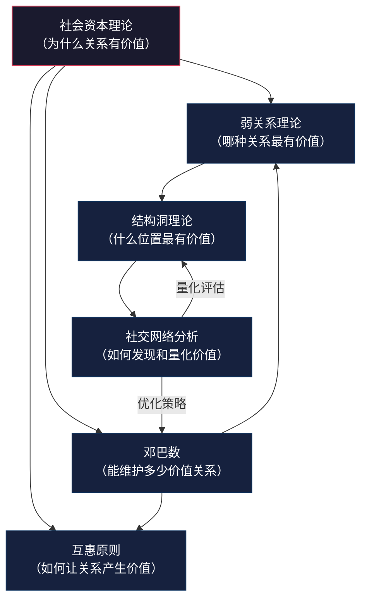

## 本节小结：人脉经营的理论全景

基础理论部分的七个章节，构建了人脉经营的完整认知框架。从社会资本理论到邓巴数，从结构洞到互惠原则，这些理论不是孤立的学术概念，而是一套环环相扣的底层逻辑。本节将从三个维度进行系统回顾：各理论的核心洞见、理论之间的内在关联、以及从理论到实践的转化路径。

### 一、六大核心理论速览

下表梳理了本节涉及的六大理论及其核心要义：

| 理论 | 创始人/代表学者 | 核心问题 | 核心观点 | 最关键的一个数字 |
|------|---------------|---------|---------|----------------|
| 社会资本理论 | 布迪厄、科尔曼、帕特南、林南 | 为什么关系能创造价值？ | 社交关系是一种可积累、可转化、可再生的资本 | 社会资本占职业成功的 **87.5%**（斯坦福研究） |
| 弱关系理论 | 格兰诺维特（1973） | 谁给你带来新机会？ | 弱关系跨越社交圈子，传递非冗余信息 | **83%** 的求职者通过弱关系找到工作 |
| 结构洞理论 | 伯特（1992） | 什么位置最有竞争优势？ | 占据网络中不相连群体之间的空隙位置，获得信息和控制优势 | 结构洞跨越者的创意产出比高出 **2-3倍** |
| 社交网络分析 | 怀特、格兰诺维特、博加提等 | 如何量化和优化网络结构？ | 网络结构决定个体行为和命运，可用图论工具分析 | 中介中心性 top **5%** 的节点控制 **80%** 的信息流 |
| 互惠原则 | 西奥迪尼、古尔德纳 | 为什么别人愿意帮你？ | 给予会激发回报义务感，互惠是人类合作的基础机制 | 主动给予后获得回报的概率提升 **2-3倍** |
| 邓巴数 | 邓巴（1992） | 你能维护多少关系？ | 人类社交能力有自然上限（约150人），关系呈层次结构分布 | 150 → 5/15/50/150/500/1500 六层同心圆 |

### 二、理论间的内在关联

这六个理论并非并列关系，而是构成了一个多层嵌套的系统。下面这张关系图揭示了它们之间的逻辑链条：

**核心逻辑链条如下：**

**第一层：价值基础（社会资本理论）** — 回答"为什么人脉值得经营"。社会资本理论确立了一个根本前提：关系不仅是情感需要，更是一种可以积累、转化和再生的资本形态。没有这个认知基础，后续所有策略都是无根之木。

**第二层：价值发现（弱关系理论 + 结构洞理论）** — 回答"什么关系最值得经营"。弱关系理论指出，跨越社交圈子的弱连接能带来非冗余信息和新机会。结构洞理论进一步揭示，不是所有弱关系都一样——占据不同群体之间空隙位置的关系，才能带来真正的竞争优势。两者一脉相承：弱关系理论发现了"弱关系更有用"这一现象，结构洞理论解释了"为什么弱关系更有用"的结构性原因。

**第三层：价值运作（互惠原则）** — 回答"如何让关系持续产生价值"。互惠原则是社会资本运转的动力机制。没有互惠，社会资本就是一次性的；有了互惠，社会资本才能实现"可再生性"——在使用中不仅不减少，反而增加。

**第四层：价值约束（邓巴数）** — 回答"能维护多少有价值的关系"。邓巴数为人脉经营设定了物理上限：你的大脑和时间只够维护约150个稳定关系。这个约束迫使我们做出选择——不是认识越多人越好，而是要在有限的带宽内优化关系结构。

**第五层：价值度量（社交网络分析）** — 回答"如何衡量和优化人脉网络"。SNA提供了量化工具，让我们能够像做财务审计一样审视自己的人脉网络：哪些关系是冗余的？哪些位置是空缺的？哪些连接需要加强？

### 三、每个理论的一句话精华

如果把每个理论浓缩为一句可以直接指导行动的话：

- **社会资本理论**：你的人脉网络就是你的"隐形净资产"，它和银行存款一样需要持续投资和管理。
- **弱关系理论**：不要只和熟人玩——那些"点赞之交"可能比铁哥们更能帮你找到下一个机会。
- **结构洞理论**：做两个不相干圈子的"连接器"，你就是最有价值的那个人。
- **社交网络分析**：定期给自己做一次"人脉体检"，用数据而非直觉来优化你的社交投资。
- **互惠原则**：先成为别人的人脉，别人才会成为你的人脉。
- **邓巴数**：接受150人的上限，把精力花在对的人身上，而不是盲目扩张好友列表。

### 四、理论整合：人脉经营的核心原则

将六大理论综合提炼，可以得到人脉经营的六条核心原则：

| 原则 | 理论依据 | 含义 | 违反此原则的后果 |
|------|---------|------|----------------|
| **分层管理** | 邓巴数 | 将人脉按亲密度和价值分层，不同层级投入不同资源 | 在500人身上平均用力，结果谁都没维护好 |
| **弱关系投资** | 弱关系理论 + 结构洞理论 | 有意识地拓展和维护跨圈子的弱关系 | 信息茧房，错失圈外机会 |
| **结构洞思维** | 结构洞理论 | 主动占据不同群体之间的"桥梁"位置 | 在同质化圈子中内卷，缺乏差异化优势 |
| **社会资本积累** | 社会资本理论 | 持续投资社交关系，积累长期回报 | 临时抱佛脚，关键时刻无人可用 |
| **互惠驱动** | 互惠原则 | 先给予后索取，建立正向互惠循环 | 单方面消耗关系存量，人脉逐渐枯竭 |
| **网络优化** | 社交网络分析 | 定期评估网络结构，弥补短板 | 网络畸形发展——要么过于封闭，要么过于分散 |

### 五、常见认知误区

在学习这些理论的过程中，有几个极易产生的误解需要特别澄清：

#### 误区一：弱关系比强关系更重要

**错在哪里：** 弱关系理论强调的是弱关系在信息传播和机会获取方面的独特优势，但从未否定强关系的价值。强关系提供情感支持、深度合作、危机时刻的全力帮助——这些是弱关系无法替代的。

**正确认知：** 强关系和弱关系各司其职。强关系是你的"安全网"，弱关系是你的"雷达"。一个健康的人脉网络两者缺一不可。用邓巴数的层次模型来看：核心层（5人）和同情层（15人）是强关系，为你提供情感和信任基础；友谊层（50人）和相识层（150人）中的大部分是弱关系，为你提供信息和机会。优化人脉不是"用弱关系替代强关系"，而是"在保持强关系质量的同时，有意识地拓展弱关系的多样性"。

#### 误区二：结构洞意味着"操控"他人

**错在哪里：** 有些人把结构洞理论理解为"做中间人赚差价"或者"利用信息不对称操控他人"。这是对理论的功利化曲解。

**正确认知：** 结构洞的价值在于**促进连接**，而非制造隔阂。一个健康的结构洞跨越者，是让两个原本不相连的群体实现合作的"桥梁建设者"，而不是"信息掮客"。长期来看，那些能够持续为双方创造价值的连接者，才能维持自己的网络位置。试图通过信息封锁来获利的人，一旦被发现就会被整个网络排斥。

#### 误区三：邓巴数意味着只能有150个朋友

**错在哪里：** 把150理解为硬性上限，认为"我只能认识150个人，多了没用"。

**正确认知：** 150是"能维持稳定关系"的上限，不是"能认识的人"的上限。在数字时代，你可以认识成千上万的人，但真正需要你投入时间和精力去维护的核心关系，确实需要控制在一定范围内。邓巴数的真正启示是：**与其追求关系数量，不如优化关系质量和层次结构。** 在150人中，有5个能在深夜接你电话的人、15个愿意花一小时帮你解决问题的人、50个在你求助时会回应的人——这个结构远比"3000个微信好友"更有实际价值。

#### 误区四：互惠就是"你帮我一次，我帮你一次"

**错在哪里：** 把互惠理解为精确的等价交换，甚至记账式的"人情往来"。

**正确认知：** 健康的互惠是**延迟的、非精确的、不求对等的**。它不要求即时回报（你可以今天帮一个人，三年后他以完全不同的方式回报你），不要求等价（你给出的和收回的价值形式可能完全不同），甚至不要求直接回报（你的善行可能通过整个网络的互惠机制间接回到你身上）。如果把互惠变成精确记账，反而会破坏关系——因为它把人际互动降格为交易。

#### 误区五：社交网络分析只适合大公司和研究者

**错在哪里：** 认为SNA需要复杂的软件和大量数据，普通人用不上。

**正确认知：** SNA的核心思维方式——从"关系结构"而非"个人属性"的角度审视社交——对任何人都有价值。你不需要会写代码或用专业软件，只需要养成一个习惯：定期审视自己的人脉结构，问三个问题——"我认识的人主要集中在哪些圈子？""哪些圈子之间缺乏连接？""谁是网络中的关键节点？"这种结构化思维本身就是SNA的应用。

### 六、理论的适用边界

任何理论都有适用范围和局限性。理解这些边界，才能正确应用理论而不至于教条化：

| 理论 | 适用场景 | 不适用/需谨慎的场景 | 局限性 |
|------|---------|-------------------|--------|
| 社会资本理论 | 分析人脉的长期价值、规划社交投资策略 | 不适合把所有关系都功利化看待——亲情、友情也有超越资本的价值 | 过度强调"资本"维度可能忽略关系的情感和伦理层面 |
| 弱关系理论 | 求职、信息获取、拓展新领域 | 需要深度合作、情感支持、危机帮助的场景 | 原研究基于1960年代美国求职市场，不同文化/行业的适用程度有差异 |
| 结构洞理论 | 职业发展、创业、跨领域整合 | 高度信任依赖的紧密团队内部——此时结构洞可能意味着缺乏信任 | 强调个人竞争优势，但现实中合作往往比竞争更有价值 |
| 社交网络分析 | 网络诊断、结构优化、关键节点识别 | 依赖直觉和情感的深层人际关系——关系不能完全被量化 | 模型简化了关系的复杂性，真实社交远比节点+边复杂 |
| 互惠原则 | 建立信任、维护关系、激励合作 | 文化差异较大的跨文化社交——不同文化对互惠的理解和期待不同 | 被"伪互惠"利用（先给小恩小惠，再提大要求的操控术） |
| 邓巴数 | 人脉规模规划、时间分配、分层管理 | 数字社交时代弱关系维护成本大幅降低——邓巴数的原始估计基于面对面社交 | 150是一个统计平均值，个体差异很大（80-300之间都有可能） |

### 七、从理论到行动：下一步的关键转换

理解理论是必要的，但不充分。理论的价值在于指导实践。在进入"具体方案"部分之前，请对照以下清单，确认自己已经掌握了这些理论的核心要义：

- [ ] 能用自己的话解释"社会资本"是什么，以及它为什么重要
- [ ] 理解弱关系比强关系在信息传播上更有效的结构性原因
- [ ] 能画出自己当前人脉网络的简化结构图，识别潜在的结构洞位置
- [ ] 知道度数中心性、中介中心性、接近中心性分别衡量什么
- [ ] 理解互惠的延迟性和非精确性，不会把人脉互动变成记账
- [ ] 知道邓巴数的六层结构，并能粗略估计自己每一层的人数
- [ ] 理解六条核心原则及其理论依据

在下一节"具体方案"中，我们将把这些理论逐一转化为可操作的行动方案——从人脉构建策略、维护方法、拓展渠道，到管理工具和变现路径，最终形成一套完整的、可执行的人脉经营系统。

理论是地图，实践是旅程。地图不会替你走路，但没有地图的旅程注定是低效的。现在你有了地图，是时候出发了。

***
